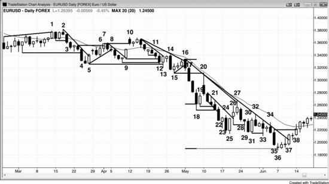
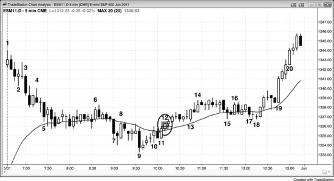

## 第 2 章：突破中的强势迹象

<!-- Source PDF pages 102–123 -->

<!-- PDF page 102 -->

第 2 章
突破中的强势迹象
突破成功的最低标准是：交易者能在突破入场并至少赚到剥头皮利润。最强的突破会导致可持续数十根K线的强趋势。有一些早期迹象增加突破会强到足以运行到一个或多个等幅运动目标的可能性。例如，多头突破具备下列特征越多，突破越可能很强：
突破K线有大多头趋势实体，影线小或没有影线。K线越大，突破越可能成功。
若成交量是最近K线平均成交量的 10 到 20 倍，跟随买盘与可能等幅运动的机会增加。
尖峰走得非常远，持续几根K线，突破多个阻力位如移动平均线、先前摆动高点与趋势线，且每一个都越过许多 tick。
在突破K线第一根形成时，它大部分时间花在高点附近，回撤很小（小于增长中K线高度的四分之一）。
有紧迫感。你觉得必须买入但想要回撤，它却从不来。
接下来两或三根也有至少是最近多头与空头实体平均大小的多头实体。即便实体相对较小且影线突出，若跟随K线（初始突破K线之后那根）很大，趋势继续的几率更大。
尖峰增长到五到 10 根K线而不回撤超过一根左右。

<!-- PDF page 103 -->

当多头突破越过先前显著摆动高点时，越过该高点的运动走得足够远，使在该摆动高点上方 1 tick 止损入场的剥头皮交易者能获利。
尖峰中有一根或多根K线的低点在前一根收盘处或仅低 1 tick。
尖峰中有一根或多根K线的开盘在前一根收盘上方。
尖峰中有一根或多根K线收在高点或仅低于高点 1 tick。
多头趋势K线之后那根的低点在该多头趋势K线之前那根的高点处或上方，创造微型缺口，是强势迹象。这些缺口有时成为度量缺口。虽然对交易不重要，它们可能代表更小时间框架艾略特波浪 1 高点与波浪 4 回撤之间的空间，可以触及但不重叠。
整体背景使突破很可能，如回撤后趋势恢复，或在强势突破空头趋势线后对空头低点的更高低点或更低低点测试。
市场最近有几个强多头趋势日。
震荡区间中有增长的买盘压力，表现为许多大多头趋势K线，且多头趋势K线在区间中明显比空头趋势K线更突出。
第一次回撤只在突破三根或更多K线之后才发生。
第一次回撤只持续一或两根K线，且它跟在不是强空头反转K线的K线之后。
第一次回撤未到达突破点，也未打到保本止损（入场价）。
突破反转了许多最近收盘与高点。例如，当有空头通道并形成大多头K线时，这根突破K线的高点与收盘在五根甚至 20 根或更多K线的高点与收盘上方。被多头K线收盘反转的大量K线，是比被其高点反转相似数量K线更强的迹象。

<!-- PDF page 104 -->

多头突破具备下列特征越多，越可能失败并导致震荡区间或反转：
突破K线有小或平均大小的多头趋势实体，顶部有大影线。
下一根有空头实体，要么是空头反转K线要么是空头内包K线；该K线收在或接近低点，实体大约是突破前K线平均实体的大小（不只是 1 tick 高的空头实体）。
整体背景使突破不太可能，如反弹测试震荡区间日的高点，但反弹有空头K线、许多重叠K线、有显著影线的K线，以及途中几次回撤。
市场已处于震荡区间数日。
突破K线之后那根是强空头反转K线或空头内包K线。
多头趋势K线之后那根的低点低于该多头趋势K线之前那根的高点。
第一次回撤在反转后两根K线发生。
回撤延伸几根K线。
回撤后的趋势恢复停顿，市场形成有空头信号K线的更低高点。
尖峰仅越过阻力位如摆动高点、空头趋势线或多头趋势通道线一两个 tick 然后反转向下。
尖峰勉强突破单一阻力位，但在突破其他稍高的水平之前就回撤。
在先前摆动高点上方止损买入的交易者在回撤之前无法赚到剥头皮利润。
在突破K线形成时，它回撤超过K线高度的三分之二。
在突破K线形成时，它两次或更多次回撤至少其高度的三分之一。
回撤跌破突破点。任何K线的低点与两根前那根的高点之间没有缺口。

<!-- PDF page 105 -->

回撤跌破尖峰第一根K线的低点。
回撤打到保本止损。
有困惑感。你觉得不确定突破会成功还是失败。
对空头突破，上述全部的反面成立。空头突破具备下列特征越多，突破越可能很强：
突破K线有大空头趋势实体，影线小或没有影线。K线越大，突破越可能成功。
若成交量是最近K线平均成交量的 10 到 20 倍，跟随卖盘与可能等幅下行的机会增加。
尖峰走得非常远，持续几根K线，突破多个支撑位如移动平均线、先前摆动低点与趋势线，且每一个都越过许多 tick。
在突破K线第一根形成时，它大部分时间花在低点附近，回撤很小（小于增长中K线高度的四分之一）。
有紧迫感。你觉得必须卖出但想要回撤，它却从不来。
接下来两或三根也有至少是最近多头与空头实体平均大小的空头实体。即便实体相对较小且影线突出，若跟随K线（初始突破K线之后那根）很大，趋势继续的几率更大。
尖峰增长到五到 10 根K线而不回撤超过一根左右。
当空头突破跌破先前显著摆动低点时，跌破该低点的运动走得足够远，使在该摆动低点下方 1 tick 止损入场的剥头皮交易者能获利。
尖峰中有一根或多根K线的高点在前一根收盘处或仅高 1 tick。

<!-- PDF page 106 -->

尖峰中有一根或多根K线的开盘在前一根收盘下方。
尖峰中有一根或多根K线收在低点或仅高于低点 1 tick。
空头趋势K线之后那根的高点在该空头趋势K线之前那根的低点处或下方，创造微型缺口，是强势迹象。这些缺口有时成为度量缺口。虽然对交易不重要，它们可能代表更小时间框架艾略特波浪 1 低点与波浪 4 回撤之间的空间，可以触及但不重叠。
整体背景使突破很可能，如回撤后趋势恢复，或在强势跌破多头趋势线后对多头高点的更低高点或更高高点测试。
市场最近有几个强空头趋势日。
震荡区间中有增长的卖盘压力，表现为许多大空头趋势K线，且空头趋势K线在区间中明显比多头趋势K线更突出。
第一次回撤只在突破三根或更多K线之后才发生。
第一次回撤只持续一或两根K线，且它跟在不是强多头反转K线的K线之后。
第一次回撤未到达突破点，也未打到保本止损（入场价）。
突破反转了许多最近收盘与低点。例如，当有多头通道并形成大空头K线时，这根突破K线的低点与收盘在五根甚至 20 根或更多K线的低点与收盘下方。被空头K线收盘反转的大量K线，是比被其低点反转相似数量K线更强的迹象。
空头突破具备下列特征越多，越可能失败并导致震荡区间或反转：
突破K线有小或平均大小的空头趋势实体，底部有大影线。
下一根有多头实体，要么是多头反转K线要么是多头内包K线；该K线收在或接近高点，实体 <!-- PDF page 107 --> 大约是突破前K线平均实体的大小（不只是 1 tick 高的多头实体）。
整体背景使突破不太可能，如抛售测试震荡区间日的低点，但抛售有多头K线、许多重叠K线、有显著影线的K线，以及途中几次回撤。
市场已处于震荡区间数日。
突破K线之后那根是强多头反转K线或多头内包K线。
空头趋势K线之后那根的高点高于该空头趋势K线之前那根的低点。
第一次回撤在反转后两根K线发生。
回撤延伸几根K线。
回撤后的趋势恢复停顿，市场形成有多头信号K线的更高低点。
尖峰仅跌破支撑位如摆动低点、多头趋势线或空头趋势通道线一两个 tick 然后反转向上。
尖峰勉强跌破单一支撑位，但在跌破其他稍低的水平之前就回撤。
在先前摆动低点下方止损做空的交易者在回撤之前无法赚到剥头皮利润。
在突破K线形成时，它回撤超过K线高度的三分之二。
在突破K线形成时，它两次或更多次回撤至少其高度的三分之一。
回撤反弹到突破点上方。任何K线的高点与两根前那根的低点之间没有缺口。
回撤反弹到尖峰第一根K线的高点上方。
回撤打到保本止损。
有困惑感。你觉得不确定突破会成功还是失败。

<!-- PDF page 108 -->

对交易者来说，突破意味着强势与可能的新趋势。它跟在双边交易时期之后，多头与空头都同意有价值，两者都愿意建仓。在突破期间，他们现在都同意市场应在另一个价格找到价值，突破是寻找那个新价格的快速运动。市场偏好不确定性并快速运动以寻找它。突破是确定时期。多头与空头确定突破内的价格在空头突破中太高或在多头突破中太低，跟随的几率通常约 60% 到 70%。市场快速运动以寻找多头与空头都同意对他们启动交易有价值的价格水平。这意味着再次有不确定性，没人知道哪一方会赢并成功创造下一次突破。不确定性是震荡区间的标志，因此突破是对震荡区间、对不确定性、以及对等距运动 50% 方向概率的寻找。尖峰之后的通道通常创造随后典型形成的震荡区间的大致顶部与底部。当市场在通道中上行时，等距运动的方向概率侵蚀，当它到达通道末端时实际上偏向反转。这是因为震荡区间突破通常失败，几率偏向回到区间中部的运动，那里方向概率中性。那个区间中部是突破的目标，其位置在形成之前未知。
突破以趋势K线开始，可大可小，但通常至少比最近K线的大小某种程度上更大。记住，所有趋势K线都应被视为突破、尖峰、缺口与高潮。当它小时，很容易忽略其重要性，但若它后跟一些横盘价格行为然后稳定的方向运动，突破正在进行。最容易发现的突破发生在异常大的趋势K线快速把市场移出震荡区间、并很快被同方向其他趋势K线跟随时。无论突破是单根趋势K线还是一系列趋势K线，它都是尖峰。如前所述，几乎所有趋势都可被视为某种尖峰与通道趋势。例如，若多头突破K线有强收盘，接下来几根也有强收盘、小或没有 <!-- PDF page 109 --> 影线，且高点与低点呈趋势（没有回撤K线），连续多头趋势K线实体之间重叠极少，则市场在反转回突破运动起点之外之前的某个时点很可能比当前更高。若趋势继续，最终其动量会放缓，通常会有某种通道。
交易中最重要的概念之一是：多数突破失败。因此，在每一次突破的突破方向入场是亏损策略。然而，常常有价格行为事件增加突破会成功的可能性。例如，若有强空头趋势然后到移动平均线的两段式反弹，在这个空头旗形的向下突破上做空是合理交易。然而，若市场不在趋势中，有大量重叠K线与许多大影线K线，市场处于平衡。多头与空头都舒适建仓，震荡区间在发展。若市场然后有一根延伸到区间顶部甚至上方的多头趋势K线，在区间中部乐意卖出的空头会在这个更好价格更激进。此外，在区间中部乐意买入的多头会变得犹豫在更高处买入，转而急于在区间顶部出场。多头与空头的这种行为在区间中部创造磁力吸引，结果是多数交易会在区间中部。即便市场成功突破并可能运行等于区间高度的等幅运动，磁力吸引仍往往把市场吸回区间。这使最后旗形反转如此可靠（在第三册讨论）。
若你看任何图，你会注意到大量实体相对较大、影线小的多头与空头趋势K线。每一根都是突破尝试，几乎全部未能导致趋势，震荡区间反而继续。在 5 分钟 Emini 图上，这些可能代表某些机构试图推动市场的买卖程序。有些算法被设计来对这些趋势K线做逆势交易，预期多数会失败。有经验的交易者在相信突破很可能失败时也会这样做。例如，若有大多头趋势K线形式的突破，这些程序可能在该K线收盘、其高点上方、接下来一两根的收盘 <!-- PDF page 110 --> 或它们的低点下方做空。若足够多程序化交易资金在 fade 一侧（卖出侧）进入，它们会压倒试图启动多头趋势的程序，震荡区间会继续。最终，突破会成功。突破K线会很大，K线形成时的回撤会很小，突破在接下来几根会有良好跟随。试图 fade 该运动的程序在失败，它们会平掉亏损仓位并进一步推动趋势。强势会吸引其他趋势交易者，其中许多人是动量交易者，一看到动量就快速入场。
一旦人人确信市场现在在趋势，可能走很远才有回撤。为何如此？考虑市场以三根强多头趋势K线形成的尖峰突破进入强多头趋势的例子。交易者相信市场不久会在某个时点更高，且不确信它会在接下来几根K线内更低。这使空头买回空单，进一步推高市场。仓位不足的多头相信市场在近期会更高，且市价买入或在两三个 tick 回撤时买入会比等待八或 10 个 tick 回撤或回撤到移动平均线赚更多。这也推高市场。由于多头与空头都在市场上涨时本质上市价买入，回撤从不来，或至少在市场远高于当前价格五根或更多K线之后才来。
这在第 8 章更详细讨论，但交易者在突破中任何时候都愿意市价买入，因为他们相信几率好于 50–50 他们会赚到至少与他们在冒的风险一样多的点数。当突破很强时，概率通常是 60% 到 70% 或更高。若他们在尖峰顶部比尖峰低点高四点时在最高 tick 买入 5 分钟 Emini，他们相信几率可能 60% 或更好：市场会再涨四点才打到他们的四点止损。你如何能确定这点？因为若成功机会远低于 60%，让风险等于回报在数学上不明智，机构因此不会做这笔交易。由于市场仍在上涨，机构在做这笔交易。由于交易在市场保持在尖峰底部上方时仍有效，他们在把风险放到尖峰底部。他们知道尖峰通常上行大约等幅运动，因此他们的利润目标——即回报——等于风险。若尖峰在停顿前再长两点， <!-- PDF page 111 --> 尖峰然后是六点高。若那是尖峰的终点，他们会假定大约有 60% 的机会市场会再高六点才跌六点。这意味着所有在更低处买入的多头有 60% 的机会市场会再高六点才打到他们的四点止损。例如，在尖峰四点高时买入的多头现在在冒四点风险以在 60% 赌注上总共赚八点，这是出色的数学情况。他们预期市场有 60% 的机会测试尖峰收盘上方六点，即他们入场上方两点，给他们八点利润目标。
当突破成功并导致趋势时，初始快速运动之后动量放缓，双边交易迹象发展，如重叠K线、增加的影线、相反方向趋势K线，以及回撤K线。即便趋势可能持续很久，趋势的这部分通常会被回撤并成为震荡区间的一部分。例如，在尖峰与通道多头趋势形态中，尖峰是突破，通道通常成为震荡区间的第一段，因此通常会被回撤。典型地，市场最终一路回撤到通道起点，完成初期震荡区间的第二段。在那个多头突破的例子中，市场然后通常会试图从该支撑反弹。这导致双底多头旗形，有时导致新区间上方突破，其他时候演变成持久震荡区间如窄幅震荡区间或三角形。较少见的是后跟反转。
在 5 分钟 Emini 图上，每天通常有许多突破尝试，但多数在一两根趋势K线后失败。它们最可能代表某个机构程序交易的开始，但被其他机构的相反程序压倒。当足够多机构在同一时间有同方向程序运行时，他们的程序能把市场移到新价格水平， <!-- PDF page 112 --> 突破会成功。然而，没有什么永远 100% 确定，即便最强的突破也有约 30% 的时间失败。
当突破非常强时，会有三根或更多影线小、重叠极少的趋势K线。这意味着交易者没有在等待显著回撤。他们害怕市场可能在跑很远之后才有回撤，想确保至少捕捉趋势的一部分。他们会市价入场并在一两个 tick 的微小回撤时入场，他们不懈的订单会给趋势强势，不利于显著回撤的形成。突破K线常常有大成交量，有时会有平均K线 10 到 20 倍的成交量。成交量越高、尖峰中K线越多，越可能有显著跟随。在突破之前，多头与空头都在分批建仓，争夺对市场的控制，各自试图创造他们方向的成功突破。一旦有清晰突破，失败方会快速以亏损平掉大仓位，获胜方会更激进入场。结果是一根或多根趋势K线，常常有高成交量。成交量不总是特别高，但当它是最近K线平均的 10 倍或更多时，成功突破——意思是会有许多根K线的跟随——的概率更高。此外，成交量在几根K线内失败的突破上也可以异常高，但这较少见。成交量不够可靠到值得跟随它，构成尖峰的大趋势K线已经会告诉你突破是否可能成功。试图额外考虑成交量，更多时候会让你分心并妨碍你以最佳状态交易。
所有成功突破都应被视为尖峰，因为多数后跟通道并创造尖峰与通道趋势形态。然而，突破也可以失败，若它是趋势中的旗形，先于它的震荡区间然后成为最后旗形。事实上，多数突破确实失败，但突破K线如此不起眼，多数交易者甚至没有意识到有尝试过突破。较少见的是，市场可以在突破后进入窄幅震荡区间，这通常后跟趋势恢复，但有时那个窄幅震荡区间的突破可以在另一方向，导致反转。

<!-- PDF page 113 -->

突破可以是单根大趋势K线或一系列大或小趋势K线，突破通常成为先前讨论的趋势形态之一的一部分。例如，若有「从开盘起的趋势」空头趋势，它很可能是前一日形态下方的突破。若趋势有序，它可能后跟几小时窄幅震荡区间，然后该日可能变成收盘前的趋势恢复空头。若突破反而加速下行，每根K线导致更陡斜率，图表呈现抛物线因而高潮的外观，它可能后跟回撤然后通道。该日可能成为尖峰与通道空头趋势日。
有时，在市场已强趋势许多根K线之后，它在趋势方向创造异常大的趋势K线。那根大K线典型地要么成为进入更陡、更强趋势的突破，或至少趋势中的又一段，要么可能意味着趋势的高潮式结束。若市场回撤几根K线且没有回撤突破K线太多，突破成功的几率良好，交易者会在多头突破的 High 1 突破回撤上入场（或在空头突破中做空 Low 1）。
即便回撤回撤超过突破点，趋势仍可继续，但回撤越深，突破越可能失败且市场反转。在这种情况下，大K线将代表趋势的高潮式结束而不是突破。若回撤相当深，交易者可能犹豫约一小时不愿顺势入场。例如，若有突破摆动高点或震荡区间的大多头趋势K线，但回撤相当深，或许略低于摆动高点顶部，交易者不确定突破是否已失败，或反弹是否只是略微过度。这种情况下多头常常约 10 根K线或更久不会买入，市场常常进入小震荡区间。他们不会买入 High 1，而很可能等待 High 2，尤其若它在一小时左右之后形成。若震荡区间保持在移动平均线上方且大约一小时已过，多头会寻找买入两段式横盘或下行回撤。有时横盘运动后跟第二段下行。那第二段可以导致新高，或导致趋势反转与更多卖盘。

<!-- PDF page 114 -->

一旦有回撤——它是小震荡区间——交易者会寻找趋势恢复。回撤的突破有初始目标：大约等于震荡区间高度的大致等幅运动。许多交易者会在该区域部分或全部止盈，激进逆势交易者会启动新仓位。
最容易发现的突破失败是那些市场快速反转方向、没有在突破方向做任何显著尝试继续的。当有其他可能反转的证据时，这更可能发生，如突破趋势通道线上方然后以强信号K线反转向下。
突破可以是任何东西，如趋势线、震荡区间，或当日或昨日的高点或低点。因为它们都以同样方式交易，所以没关系。若它失败就对其做逆势交易；若反转尝试失败因而成为突破回撤，则在突破方向再入场。只有在突破非常强时才在突破上入场。这方面的例子是：若有强多头趋势然后两K线回撤到 High 1 买入形态。交易者可以在前一根高点上方 1 tick 买入，也可以通过在旧高上方 1 tick 挂止损买单在突破至新高时再买。通常，更好是买入回撤或寻找做空失败突破。
在多数日子，交易者把新摆动高点与低点看作可能的逆势形态。然而在强趋势日，突破通常有巨大成交量，即便在 1 分钟图上也几乎没有回撤。显然趋势交易者在掌控。例如，当多头趋势如此强时，价格行为交易者会在 High 1 与 High 2 回撤上买入，而不是等待趋势先前高点上方的突破。他们始终试图最小化交易风险。然而，一旦强趋势在进行，因任何理由顺势入场都是好交易。在强趋势中，每一个 tick 都是顺势入场，因此你可以在任何时点市价入场并使用合理止损。
若有大趋势K线的突破且该K线尚未收盘，你有决定要做。若你刚部分剥头皮出场，现在在考虑波段持有剩余，始终考虑你有多少风险。帮助决定是否应继续持有波段仓位的一种方式是问自己：若你此刻没有持仓会做什么。若你愿意 <!-- PDF page 115 --> 用波段规模仓位与波段保护性止损市价入场，那么你应留在当前波段仓位中。若你反而认为以那个风险量市价入场风险太大，那么你应市价退出波段仓位。
当有突破时，买家与卖家都把它看作机会。例如，若市场有摆动高点然后回撤，多头与空头都会在市场越过该先前摆动高点时入场。多头会买入突破，因为他们把它看作强势迹象，相信市场会在他们入场上方走得足够高让他们止盈出场。空头也会把突破看作赚钱机会。例如，空头可能在该先前高点水平或高几个 tick 处用限价单卖出。若市场反转下来，他们会寻找止盈出场。然而，若市场继续上涨，若他们认为市场可能回撤测试突破，他们会寻找加空。由于多数回撤一路回到先前摆动高点，他们可以在那个突破回测上大约保本平掉第一笔入场，在第二笔更高入场上获利。
当交易者想到突破时，他们通常立刻想到震荡区间的形象。然而，突破可以是任何东西。许多交易者忽略的一种常见突破是旗形在意外方向突破，如空头旗形向上突破或多头旗形向下突破。例如，若有相当强的空头趋势，交易者不确定可交易低点是否已在，看到空头旗形在形成，他们可能开始在前一根低点下方买入，预期 Low 1 然后 Low 2 甚至 Low 3 会失败。有时空头旗形会有良好形状并触发 Low 2 做空或楔形空头旗形做空，然后立即反转向上进入一两根多头趋势K线。这种突破通常创造导致等幅上行的度量缺口。交易者会在突破与任何小回撤上入场；由于空头被困，他们很可能在市场至少有两段上行之前不会急于再做空。多头趋势中的多头旗形则相反。
有一种特殊类型的突破有时发生在趋势日的最后一小时。例如，若市场在下行趋势中没有回撤迹象，可以有一两根大空头趋势K线突破 <!-- PDF page 116 --> 空头通道底部。可能有小回撤然后第二次短暂突破至新低。其他时候，市场只是无情下行进入收盘而没有大空头趋势K线。这两种情况下很可能发生的是：交易公司的风险经理在告诉那些一直在抄底的交易者他们站在市场错误一侧，必须市价平掉仓位。由于它们主要由于被迫卖出，这些急跌通常没有太多跟随。很可能有些聪明程序员预期到这一点，试图通过设计程序短暂做空来利用它，增加卖盘高潮的规模。动量程序也是强趋势的一部分。在一两次卖盘高潮之后，进入收盘时可能有也可能没有反弹。以强多头尖峰或通道结束的日子则相反。风险经理在告诉交易者在收盘前买回亏损空单，当市场快速上涨时，动量程序检测到这一点，只要动量继续就也不懈买入。
交易者的目标之一是做机构在做的事。许多突破由当日最大成交量的大趋势K线组成。这些是机构交易最重的时候，他们这样做是因为预期该运动会有持久跟随。尽管大突破期间市场可能感觉可怕且情绪化，机构把它看作绝佳机会，成交量表明如此，你也应如此。尽量学会交易突破，因为它们有出色的交易者公式。若必须，只交易四分之一规模仓位（「我不在意」规模），只为获得经验。行情常常大到你能赚到与用全仓做常规交易一样多。
图 2.1 突破每天发生许多次

<!-- PDF page 117 -->

某种类型的突破在每张图上每几根K线就会发生，如图 2.1 欧元/美元外汇日线图所示。严格来说，若某根K线的高点在任何先前K线高点上方，或其低点在任何先前K线低点下方，它就是那根K线的突破。此外，每一根趋势K线都是突破（记住第一册，每一根趋势K线都是尖峰、突破、缺口与高潮）。这张图上突出显示了许多不同类型的突破与失败。
K线 1 突破趋势通道线上方，下一根跌破其低点，设置两K线反转，在 K线 3 入场K线上触发。K线 2 是第二次试图突破多头通道上方，它突破了另一个两K线反转上方，但突破失败，市场反转向下。
K线 4 是摆动低点下方的突破，是从 K线 2 起卖盘高潮中的第六根。由于该K线波幅大且影线小，它可能代表需要修正之后才有跟随卖盘的卖盘高潮。事实证明如此，因为 K线 5 是强多头反转K线，把 K线 4 变成失败突破。有到移动平均线的两段式回撤，K线 8 突破了空头旗形。
K线 9 突破空头趋势线上方。
K线 10 突破摆动高点上方，但当下一根跌破其低点时突破失败。

<!-- PDF page 118 -->

K线 12 跌破 K线 9 入场K线及其前信号K线下方。
K线 13 试图反转向上并创造失败突破，但那个失败突破在 K线 14 再反转向下时失败。K线 14 也是微型趋势线与多头反转K线上方失败突破的向下反转。当失败突破未能反转市场时，它成为突破回撤。
K线 16 突破空头趋势线上方失败，该K线反转向下成为外包向下反转，跌破前三根的空头旗形趋势线。
K线 16 到 18 创造由实体大、影线小、重叠极少的强空头趋势K线组成的四K线突破。在震荡区间内分批加多的多头终于投降，不仅停止买入，还不得不快速平掉大仓多单而不等待回撤。他们不确信回撤会很快到来，并确信市场会在几根K线内更低。这意味着市价或K线内微小回撤出场是他们的最佳选择。他们的多头清算以及几根K线没有买盘，促成了抛售的强势。当突破如此强时，通常后跟通道，并常常导致从尖峰第一根开盘到最后一根收盘的等幅运动。K线 36 低点刚好在那个等幅运动投射下方，那结束了通道。市场然后通常会设法回升测试尖峰后第一个合理买入信号，即 K线 19 多头内包K线的高点。若到达那里，它接下来试图测试空头通道起点，即 K线 20 高点。
K线 20 是试图让四K线突破失败，但当突破如此强时，通常有跟随，失败通常会失败并只成为突破回撤，如这里所做。市场在略低于 K线 15 突破点与移动平均线处再反转向下。每当市场在未触及阻力位的情况下再向下转时，空头非常强，因为他们没有在等待阻力被触及。空头害怕多头可能无法把市场推到那里，因此他们在略下方挂限价单。这是空头紧迫感的迹象。突破点 <!-- PDF page 119 --> （K线 15 低点）与突破回撤（K线 20 高点）之间的缺口通常成为度量缺口，常常是运动的大致中点。空头趋势起点是 K线 2 高点，市场最终跌破缺口下方的幅度超过 K线 2 高点到度量缺口中部之间的点数。突破与突破回测上的强反转向下确立空头趋势非常强，交易者当日剩余时间应只寻找做空。可能有一两次多头剥头皮，但交易者只有在能在K线跌破前一根低点、表明小回撤可能结束时立即翻空的情况下才应做它们。顺便说一句，艾略特波浪交易者把回撤看作波浪 4 的顶部，把突破点看作波浪 1 的底部。若其间的下行波浪 3 确实是波浪 3——通常是趋势中最强的波浪——两者不能重叠。
K线 22 是跌破四K线通道底部的大波幅空头K线。它可以说是连续第三次卖盘高潮（第一次是 K线 14，第二次是到 K线 18 的四K线尖峰）。市场在两三次连续高潮之后通常至少有 10 根K线、两段式修正。然而这里，那个四K线空头尖峰是当日压倒性特征，是强突破的开始。是的，它是尖峰因此是卖盘高潮，但它如此大以至于市场性质改变，任何计数必须重新开始。一旦它形成，交易者决定会有强劲下行，通道是强尖峰之后最常见的形态。通道在修正前常常有三次下推，这个也是。三次下推是 K线 18、25 与 36，后跟进入收盘的弱势反弹。
K线 23 是 K线 22 卖盘高潮与三K线空头通道底部超调后的反转尝试。然而，当大图景如此看空时，基于这几根K线寻找做多是错误。市场始终在试图反转趋势，当底部形态实时发生时很容易陷入情绪；但你永远不应忽视大图景。那个四K线空头尖峰非常强，始终持仓仓位仍是做空。此刻任何底部尝试几乎肯定导致空头旗形，如这里所做。

<!-- PDF page 120 -->

市场始终有惯性，当它在趋势时，预期所有反转尝试都会失败。
K线 25 是跌破 K线 20 到 21 通道下方后第二次试图反转向上。由于两次尝试的信号K线都有强多头实体，市场可能测试移动平均线。多数交易者不应做这笔交易，而应保持做空。太多次，交易者会为一点剥头皮逆势交易，然后不翻空，错过顺势交易上赚四点或更多。若你刚做多，很难快速把心态转回做空；若你不能轻松做到，就不要做逆势剥头皮然后错过下行波段。
K线 26 如预期突破通道顶部。
K线 27 突破空头趋势线与 K线 18 突破点上方，但在下一根失败并反转向下。
K线 28 是三K线空头旗形的突破。
K线 29 跌破 K线 26 多头入场K线下方，但找到买家，如大影线所示。
K线 32 是对空头趋势线的又一次测试，因此是尝试突破，但失败了。
K线 35 是又一根大空头趋势K线，因此又一次可能的卖盘高潮。当市场在短时间内开始形成第二、第三次卖盘高潮时，它很可能至少反转两段式修正。
K线 36 跌破等幅运动下方但没有找到卖家。相反，它找到安静交易，可能在发出 K线 22 到 34 空头旗形失败突破的信号。漫长空头趋势后的水平空头旗形常常成为最后旗形，通常后跟至少两段横盘到上行。K线 36 也是空头通道中的第三次下推，那通常导致至少一次反转尝试。
K线 36 之后那根突破 K线 36 高点上方，成为多头入场K线。
K线 37 是空头趋势线上方的多头突破K线。
K线 38 突破强 K线 35 空头趋势K线上方，该K线上方肯定有许多空单的买入止损，因为它的大空头实体代表强卖盘。一旦市场越过其高点，大量 <!-- PDF page 121 --> 空头决定不再有足够强势保持做空，他们买回空单（空头回补）进入收盘。
图 2.2 旗形可在不太可能的方向突破

旗形有时在意外方向突破并导致等幅运动。在图 2.2 中，有失败的楔形空头旗形在 K线 9 向上突破。K线 7 突破点高点与 K线 10 突破回测之间的度量缺口导致几乎完美的等幅上行。
K线 3 是 Low 1 做空形态，但在三根强多头实体与 K线 2 卖盘高潮之后，它很可能失败。激进交易者会在 K线 3 低点处及下方用限价买单做多。K线 5 是 Low 2 做空的入场K线，但在强 K线 4 外包向上K线之后，市场可能在做当日低点。再次，激进交易者会在 Low 2 信号K线低点处或下方做多。K线 7 是楔形空头旗形做空的信号K线，但市场处于多头通道中，K线 4 外包向上K线使始终持仓交易做多。与其在 K线 7 下方做空，空头应等待看市场是否形成更低高点。多头在 K线 8 上方做多，预期失败楔形空头旗形的等幅上行。
然后有 K线 22 上方的失败 Low 2 空头旗形买入形态，入场K线是多头趋势K线。这次突破也导致等幅上行。K线 21 是多头日上空头通道的底部，K线 22 是 <!-- PDF page 122 --> 该通道突破的突破回撤，因此警觉的交易者认为 Low 2 有极佳机会失败并导致当日高点测试。
K线 26 的低点反转了过去 12 根K线的低点（它在那些低点下方）与过去 13 根的收盘。其收盘反转了这些同样的低点，这很重要，因为收盘在低点下方比仅仅低点在先前低点下方更是强势迹象。被反转的低点与收盘越多，反转越强。在那过去 12 根期间买入的每个交易者现在都持有亏损，会寻找任何小反弹平掉多单。许多人在下一根卖出，创造了该K线顶部的影线。此外，那些多头至少几根K线内很可能不会再寻找买入。
图 2.3 小突破K线

如图 2.3 所示，虽然像 K线 3 与 19 这样的大突破K线常常导致大趋势，有时像 K线 12 这样的小突破K线可以是持久运动的开始。在 K线 9 空头尖峰之后，交易者想知道到 K线 11 的反弹是否会在移动平均线处成为 Low 2 空头旗形（K线 10 与 11 是两次上推）。然而，市场没有向下突破，而是突破 K线 10 与 K线 11 双顶上方（这使反弹成为最后旗形，因为它是空头趋势的最后旗形，即便它从未向下突破）。K线 12 突破K线很小， <!-- PDF page 123 --> 但足以使交易者开始抛弃到 K线 11 的运动是空头旗形的想法，开始怀疑 K线 9 是否是耗竭性卖盘高潮，可能修正 10 根或更多K线。K线 12 之后那根也小，但它有两个强势迹象：多头实体，以及低点没有跌破 K线 11 高点（突破点）。虽然到 K线 14 的反弹没有覆盖很多点数，它是无情多头趋势，成为两段上行中的第一段（第二段始于 K线 18 与 K线 15 的双底，以及 K线 13、15 与 18 低点形成的三角形）。
