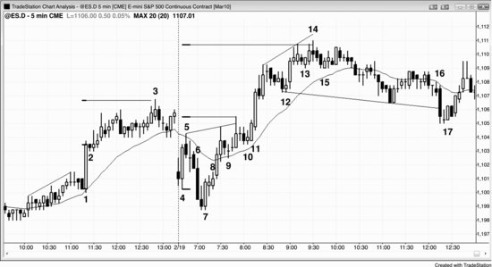
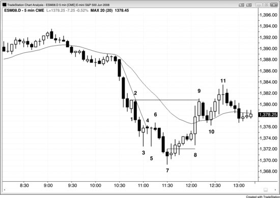

## 第 3 章：初始突破

<!-- Source PDF pages 124–133 -->

<!-- PDF page 124 -->

第 3 章
初始突破
在大多数市场的 5 分钟图上，通常每天至少有几次成功的重要突破。大多数突破始于单根趋势K线，它通常比先前K线更大，且没有影线或只有小影线。在最强的突破中，会有一系列重叠很少的趋势K线。例如，在 5 分钟 Emini 图上的强多头突破中，突破K线一收盘，一些交易者就会在该K线收盘价挂限价买单。若下一根在该价开盘并立即上行而未跌破该价，限价单很可能无法成交，这些多头交易者会被困在市场之外。他们会感到紧迫，因为害怕错过行情，并会尽快做多，要么用市价单，要么用限价单买入任何 1–2 tick 或小回撤，或者切换到更小时间框架图如 1 或 2 分钟，然后在 High 1 或 High 2 回撤入场。这在情绪上常常很难，可比作从高跳台跳下。两种情况下可能都有效的做法是：直接去做——捏住鼻子，紧闭双眼，绷紧全身每一块肌肉，相信你不会伤得太重，糟糕的感觉会很快结束。若你在交易 Emini，你就简单买入小回撤并依赖止损。若突破良好，止损不会被触及，你在接下来许多根K线中有很好机会赚到 2 到甚至 6 点或更多，而风险大约 2 点。
若一到两根K线的突破之后，不是连续数根强多头趋势K线，而是小K线、十字星、内包K线、大影线K线或空头趋势K线，突破可能失败。这可能导致反转回震荡区间、趋势反转成空头趋势，或失败的反转——它只是一到两根的回撤，随后 <!-- PDF page 125 --> 是上行恢复。当突破成功时，它会形成某种版本的尖峰与通道趋势。
突破入场在当日结束时看图显得欺骗性地容易。然而在实时中，形态往往要么不清楚，要么清楚但吓人。在突破时或突破K线收盘后入场很难，因为突破尖峰常常很大，交易者必须迅速决定冒比平时大得多的风险。结果他们常常选择等待回撤。即便他们减小仓位使美元风险与其他交易相同，冒两到三倍 tick 风险的想法也会吓到他们。在回撤时入场很难，因为每一次回撤都始于小反转，交易者害怕回撤可能是深度修正的开始。若反转只持续一到两根并酝酿突破回撤入场，他们又害怕入场，因为担心市场可能进入震荡区间，若是多头突破他们不想在顶部买入，若是空头突破他们不想在底部卖出。趋势尽其所能把交易者挡在外面，这是它们能让交易者全天追赶市场的唯一方式。当形态容易且清晰时，运动通常是小而快的剥头皮。若运动会走很远，它必须不清楚且难以执行，才能把交易者留在场边并迫使他们追赶趋势。
你会经常听到评论员讨论某只股票因糟糕报告——如令人失望的财报或管理层变动——导致的一到两日抛售。他们在判断这则新闻在其他方面强劲的多头趋势中只是一日事件，还是会改变该股未来数月的前景。若他们断定几率有利于多头趋势，会在空头尖峰底部附近买入。若他们认为新闻严重到足以使该股数月承压，就不会买入，事实上会在下一次反弹时寻找平掉多头。技术交易者把抛售看作空头突破，并从突破强度评估该股。若尖峰看起来强，他们会在反弹处做空，甚至可能在K线收盘做空，预期更大尖峰、尖峰与通道或其他类型的空头趋势。若相对于多头趋势它看起来弱，他们会在 <!-- PDF page 126 --> 空头趋势K线的收盘与低点附近买入，预期失败突破，以及趋势反转尝试只是又一个多头旗形。
图 3.1 有许多连续趋势K线的突破通常很强

最强的突破有紧迫感，并有连续数根趋势K线，如图 3.1 所示俄罗斯 Market Vectors 交易所交易基金（ETF）RSX 的开盘即趋势多头趋势日中所发生的。市场突破了昨日最后一小时形成的震荡区间。注意突破中数根K线的低点没有跌破前一根收盘。这意味着等待K线收盘后立刻在该收盘水平挂限价买单的多头很可能无法成交，会被困在市场之外。市场正离他们而去，他们知道这一点，于是会抓住任何理由做多。这种紧迫感使市场急剧上涨。这一系列K线应被视为多头尖峰。多头尖峰通常后跟多头通道，合在一起构成尖峰与通道多头趋势。
K线 6 是内包K线与第一次停顿，这在开盘即趋势多头趋势日中通常是可靠的 High 1 做多入场。然而，当趋势如此强时，你可以市价买入，或以任何理由买入。去年亚马逊某处下雨了吗？那就买。你孩子高中篮球队去年有人得分了吗？

<!-- PDF page 127 -->

那就再买。你需要做多并保持做多，因为很可能有超过 70% 的机会市场会做出等于或大于尖峰大致高度的等幅上行（从 K线 1 的低点或开盘到 K线 4 或 8 的收盘或高点，把这些点数加到那些K线的收盘上）。确切概率永远不可知，但根据经验这是非常强的突破，这里等幅运动的概率很可能大于 70%。从 K线 1 开盘到 K线 4 收盘的等幅上行是 K线 8 顶部停顿处的价位。基于 K线 1 开盘到 K线 8 收盘的等幅运动在当日收盘（未显示）被超出 3 美分。
图 3.2 成功突破需要跟随

突破在 5 分钟 Emini 图上很常见，但像图 3.2 中 K线 1 与 K线 11 那样有数根跟随的强成功突破，通常每天只发生一到三次。
K线 1 突破了小楔形顶部，顶部与底部有小影线，是大的多头趋势K线。
K线 2 是小空头内包K线，既是失败突破做空的信号K线，也是突破回撤做多的信号K线。记住，内包K线是单K线震荡区间，是任一方向突破的形态。
突破常导致等幅运动，一个常见形态是从尖峰的开盘或低点到尖峰的收盘或高点， <!-- PDF page 128 --> 然后从尖峰的收盘或高点向上投射。这里，到 K线 3 当日高点的运动是从 K线 1 突破K线的开盘到收盘的等幅运动。
开盘区间常导致突破到等幅运动，但测量点通常有几种可能，最好先看最近的目标。交易者应看 K线 4 低点到 K线 5 高点。一旦该等幅运动被超越，交易者应看其他可能。失败的楔形常导致等幅运动，但交易者需要考虑他们能看到的每一个选项。例如，他们可能看 K线 7 低点到楔形高点（K线 9 后两根）。然而，楔形始于 K线 4，K线 7 更低低点可视为对实际 K线 4 低点的超调。市场试图从 K线 4 低点形成楔形空头旗形，并有三段上推（K线 5，以及 K线 9 前后的尖峰）。用 K线 4 低点到楔形顶部做测量，投射的运动在 K线 14 当日高点仅被超出 1 tick。找到这些等幅运动目标的目的是找到合理止盈区域，若有强逆势形态，也可在相反方向发起交易。
K线 6 是强突破到当日新低，但被 K线 7 向上外包多头趋势K线向上反转。当交易者看到横向运行至 K线 8 时，他们在想这可能是突破回撤（空头旗形），其后可能再有一段下行。你必须始终考虑多头与空头两种可能。市场没有更多卖出，而是快速上行。如此强的空头趋势K线怎么会这么快被向上反转？若机构有大量买单，他们希望以最好价格成交；若他们认为市场在上行前很可能测试 K线 4 低点下方，他们会等到该测试之后再买。当市场接近他们的买入区域时，他们现在买入没有意义，因为他们相信接下来几分钟市场会再低一点。因此这些非常急切的多头在旁观。最强买家的缺席造成卖方失衡，因此市场必须快速下跌，空头才能找到愿意接单的对手方。结果是大空头趋势K线。一旦市场到达多头认为 <!-- PDF page 129 --> 不会再跌的水平，他们突然出现并开始沉重、不懈地买入，压倒空头。空头意识到发生了什么，停止做空并开始回补。这意味着多头与空头都相信市场会上涨，这造成等距运动的方向概率有 60% 或更高有利于多头。换句话说，市场有 60% 或更高的机会先涨 2 点再跌 2 点，先涨 3 点再跌 3 点。事实上，很可能有超过 60% 的机会市场在出现 2 点回撤之前突破开盘区间上方并有等幅上行，这对多头是绝佳交易。
K线 9 与 10 是当日新高后的突破回撤。
K线 11 是始于 K线 5 高点的楔形突破。它是强两K线多头尖峰，其后又有两段上推。尖峰后的多头通道常有三段上推，尖峰顶部是第一段上推。
K线 12 是强多头趋势中的两段式 High 2 突破回撤，是绝佳买入形态。
K线 13 是另一个突破回撤，但由于它会导致第三段上推，多头必须谨慎。一旦 K线 14 触及做多入场上方 5 tick，许多多头把止损移到保本，因为他们在想 K线 14 楔形高点是否会导致漫长（10 根或更多）两段式回撤甚至趋势反转。因此 K线 15 对多头是坏信号，他们预期任何反弹都会在 K线 14 楔形高点下方结束，并至少再有一段下行。激进的交易者在其高点上方做空，因为很可能失败的买入信号意味着交易者可以在经验不足的交易者刚做多的地方做空，并有大约 60% 的机会市场先跌 2 点到弱势多头的保护性止损，再触及他们高 6 tick 的止盈限价单。他们冒 6 tick 风险赚 8 tick，有 60% 信心会赢，这是合乎逻辑的下注。
K线 16 是头肩顶下方的空头突破，但由于大多数顶部形态其实只是多头旗形，突破很有可能失败。多头本可以在随后小十字星内包K线上方买入， <!-- PDF page 130 --> 但这有些风险，因为十字星不是可靠的信号K线。一旦他们看到 K线 17 多头趋势K线，买入楔形多头旗形成为更可靠的形态。在强多头K线上方买入会提高成功几率，因为市场已显示一些力量。由于强突破通常有连续数根趋势K线，而非下一根是小十字星，交易者把这看作空头突破疲弱的警告。
图 3.3 看图，不看新闻

如图 3.3 所示，一定有某则新闻导致 10:30 a.m. PST 的急剧抛售。你绝不应该关注新闻——除了知道它何时发布——因为它会在你与你必须做的事之间制造距离。它需要你随后必须与图表调和的思考，这只会减少你的利润。图表告诉你你需要知道的一切。发生了某事使机构积极卖出，这就是交易者需要的全部信息。是时候寻找做空形态了。
K线 1 是强多头趋势K线，困住了买入蜡烛形态或更小时间框架反转的早期买家。在这张 5 分钟图上，买入甚至 <!-- PDF page 131 --> 没有被触发，因为下一根没有越过 K线 1 高点。这些多头会在 K线 1 低点下方离场，在更多价格行为展开之前不会再寻找买入。在 K线 1 低点下方 1 tick 挂止损做空，那是那些多头会放保护性止损的地方；当他们平仓时会提供充足的下行燃料。若它被触发，你知道被困多头会出场且不久不想再买，而聪明的空头会加空。没有人再买，市场几乎肯定会提供剥头皮利润，并很可能多得多。
K线 5 是第三根重叠K线，且至少有一根是十字星（三根都是）。这是铁丝网形态，通常是延续形态；像任何震荡区间一样，你绝不应该在其高点买入或在其低点卖出。你可以在其极端处对小K线做逆势交易；由于所有水平震荡区间都是磁铁并常成为最后旗形，你可以等待趋势K线突破失败，并寻找反转回区间。这里，K线 7 收在中点上方，因此满足反转K线的最低要求，且它跟随连续第三次卖盘高潮。这通常后跟至少 10 根K线、两段式修正。
K线 3 与 5 是经典蜡烛形态陷阱。背熟蜡烛反转形态的交易者会急于买入这些有长多头影线的巨大蜡烛，因为他们会把长影线与收在高点附近看作多头正在取得控制的证据。当你在空头趋势中看到大K线带长影线与小实体时，它告诉你若在其高点上方买入，你付得太多。在空头趋势中，你想买低，而不是在紧空头通道中、尚无先前多头力量或趋势线突破时，在小实体大K线的顶部买入。K线 5 甚至是比 K线 3 更好的蜡烛形态陷阱，因为它是墓碑十字星，蜡烛新手崇拜它。此外，市场交易到该K线高点上方，似乎确认了多头力量，且它是第二次筑底尝试（与 K线 3 的双底）。但哪里出错了？当你在强趋势中看到这些小实体大蜡烛、且尚无趋势线突破时，你应该兴奋，因为它们是绝佳陷阱，因此是完美做空形态。只需等待通常跟随的小K线。其缺乏上行跟随使这些早期多头非常害怕。人人都知道那些多头 <!-- PDF page 132 --> 会把保护性止损放在哪里，所以那正是你应该挂入场止损做空的地方。当你看到那些大十字星蜡烛时，你也会看到多头力量，但随后假定：由于价格在那些K线高点附近徘徊，多头现在与空头平衡，那些K线的高点很可能在震荡区间中部或顶部，而非底部。
到 K线 6 的两段式横向运动突破了趋势线。交易者于是知道多头正急于买入，因此完美的做多形态会是到新低的失败突破。聪明的交易者只需等待一到两根跌破 K线 3 与 5，然后开始在前一根高点上方 1 tick 挂买单。他们准备好若未成交就把订单下移。若运动继续下行太远，他们会等待另一次趋势线突破再寻找买入，因为趋势会已恢复，这个形态会未能触发。有两三次亏损的更早多头这次会等待确认并迟介入场，这会在价格行为多头入场后为上行提供额外燃料。
即便 K线 7 有空头实体，它至少收在中点上方，表明一些力量。大概多头在 K线 1、3 与 5 的入场亏损后有点谨慎。此外，它是铁丝网形态的失败突破，而铁丝网常形成趋势的最后旗形。这是有利可图做多的几率很高，聪明的交易者会一直在预期它，因此没有借口错过它。
入场K线有多头实体，尽管很小，这是建设性的。此外，它是内包实体变体（其实体在信号K线实体之内，是内包K线的较弱版本），意味着空头没有取得控制。此时多头感到自信，因为他们的保护性止损没有像更早多头那样在入场后一根被触及。
随后三根都是收盘高于前一收盘的多头趋势K线，因此收盘处于多头趋势。合理假定会有两段上行，但几乎肯定在第二段之前会有向下止损扫盘。保本止损在 K线 8 的猛烈下行中未被触及，该K线变成多头外包K线与第二段上行的起点（更高低点）。每当有强向上外包K线把市场 <!-- PDF page 133 --> 突破成新趋势时，其低点是趋势起点，所有K线计数重置。例如，K线 9 的两K线反转是 Low 1 形态，而非 Low 2。
反弹的目标是空头中的多头信号K线高点（K线 3 与 5 的高点，可能还有 K线 2）。K线 9 超出最终目标 1 tick。动能如此强，以至于 K线 8 低点很可能只是第一段上行的一部分，而非第二段上行的起点，取而代之的是应有更大回撤然后第二段上行（它结束于 K线 11）。
K线 11 从 K线 8 低点的反弹形成 Low 2 做空。
