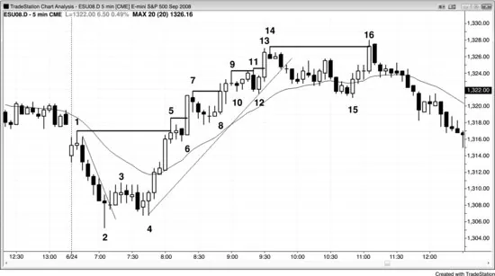
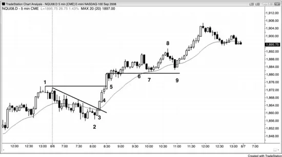

## 第 4 章：在已有强趋势中的突破入场

<!-- Source PDF pages 134–139 -->

<!-- PDF page 134 -->

第 4 章
在已有强趋势中的突破入场
当趋势很强且有回撤时，每一次越过先前极端的突破都是有效的顺势入场。突破通常有强成交量、大突破K线（强趋势K线），以及随后数根的跟随。聪明的资金显然在突破时入场。然而，那很少是交易突破的最佳方式，价格行为交易者几乎总能找到更早的价格行为入场，如多头趋势中的 High 1 或 2。重要的是认识到：当趋势很强时，你可以在任何时候入场，只要使用足够的止损就能获利。一旦交易者看到趋势很强，有些交易者不做第一次入场，因为他们希望有更大回撤，如到移动平均线的两段式回撤。例如，若市场刚变得明显始终做多，初始多头尖峰有三根实体够大、影线很小的多头趋势K线，交易者可能害怕这一波有点高潮性，决定想等待 High 2 买入形态。然而，当趋势像这样非常强时，头几次入场通常只是 High 1 买入形态。激进的交易者会在前一根低点下方挂限价单买入，预期任何反转尝试都会失败。一旦市场交易到前一根低点下方，他们会预期 High 1 买入形态至少导致新高，并很可能基于多头尖峰高度有等幅上行。若交易者未能做这两个早期入场中的任一个，他们应训练自己保证进入这个强趋势。当他们看着回撤开始时，应在尖峰高点上方 1 tick 挂买入止损，以防回撤只有一根并迅速向上反转。若他们未能做任一个早期回撤入场，而市场开始在没有他们的情况下向上狂奔，他们会被卷入交易而不会被抛下。在最强的交易中，你通常会看到突破多头尖峰上方的那根通常是大多头趋势K线，这告诉你许多强多头相信 <!-- PDF page 135 --> 在新高买入有价值。若对这么多他们来说是绝佳入场，对你也是。
判断趋势强度的一个快速方法是看它在突破先前趋势极端后如何反应。例如，若多头趋势有回撤然后突破当日高点，突破时是找到更多买家还是卖家？若市场上行足够远使突破买家至少赚到剥头皮利润，则突破找到的买家多于卖家。那是强趋势的标志之一。相反，若市场冲到新摆动高点但在一到两根内向下反转，则突破找到的卖家多于买家，这更符合震荡区间特征，市场可能正在过渡到震荡区间。观察市场在新高处的表现，能提示是否仍有强趋势在起作用。若没有，即便趋势可能仍在，它也不那么强，多头应在新极端处止盈，甚至寻找做空，而不是买入到新高的突破或寻找买入小回撤。空头趋势中则相反。
总体而言，若你在新极端用止损入场，你应把大部分或全部交易做剥头皮，除非趋势特别强。若特别强，你可以波段持有大部分或全部仓位。例如，若市场处于强多头趋势，多头会在最近高点上方用止损买入，但大多数会剥头皮出场。若市场极强，他们可能波段持有大部分仓位。若不是，空头会在每一个新摆动高点用限价单在旧摆动高点处或略上方做空，并在更高处加仓。若市场在第一次入场后下跌，他们会带利润出场。若市场反而继续上行，他们预期旧高在几根内会被回撤测试，这允许他们在第一次入场保本出场，并在更高入场上获利出场。
图 4.1 强突破有许多连续强趋势K线

<!-- PDF page 136 -->

如图 4.1 所示，从 K线 4 更高低点起的反弹成为强多头趋势（趋势线突破后的更高低点），在市场反转穿越 K线 1 当日高点时有连续七根多头趋势K线。有如此多动能，人人同意 K线 5 会在跌破多头趋势起点 K线 4 之前被超越。市场处于始终持仓模式，很可能基于从 K线 4 到 K线 5 的多头尖峰，或从 K线 1 到 K线 2 的开盘区间，有大约等幅上行，因此多头可以市价买入、在任何回撤买入、在任何K线低点处或下方买入、在任何回撤高点上方买入、在任何K线收盘买入，以及在最近摆动高点上方用止损买入。
突破交易者会在每一个先前摆动高点上方买入，如在 K线 5、6、8、11、13 与 16。到 K线 5，市场已明显强烈始终向上。激进的多头在前一根低点挂限价单买入，预期初始回撤只会持续一根左右，市场会以 High 1 向上反转。在前一根下方买入通常比在 High 1 上方买入更低的入场。若交易者更喜欢用止损入场，且未在 K线 5 后那根的低点买入，他们会在 K线 6 的 High 1 入场，当它越过前一根时买入。若他们反而希望有更深回撤如移动平均线处的 High 2，且未做这两个入场中的任一个，他们需要保护自己免于错过强趋势。他们绝不应让自己 <!-- PDF page 137 --> 被困在绝佳趋势之外。做法是在 K线 5 多头尖峰高点上方 1 tick 挂最坏情况的买入止损。入场会更差，但至少他们会进入很可能基于多头尖峰高度至少继续等幅上行的交易。K线 6 是没有影线的大多头趋势K线，表明许多强多头在同一根买入。一旦交易者看到强多头买入到新高的突破，他们应确信交易良好。他们的初始保护性止损在最近小摆动低点下方，即 K线 6 前的 High 1 信号K线。
回撤交易者在每一个例子中都会更早入场，在突破回撤处——它们是多头旗形——例如在 K线 6 的 High 1、K线 8 的 High 2、K线 10 失败的楔形反转、K线 12 的 High 2 与失败的趋势线突破（未显示），以及 K线 15 在移动平均线下方的 High 2 测试（第一根均线缺口K线买入形态）与 K线 12 的双底（High 2 基于从 K线 14 起清晰的更大两段下行）。突破交易者在价格行为交易者卖出多头止盈的完全相同区域发起多头。总体而言，在许多聪明交易者正在卖出的地方买入是不明智的。然而，当市场很强时，你可以在任何地方买入，包括高点上方，仍能获利。不过，买入回撤时的风险/回报比远好于买入突破时。
盲目买入突破是愚蠢的，聪明的资金不会买入 K线 11 突破，因为它是在异常强的 K线 6 突破K线重置计数并形成第一段上推之后可能的第三段上推。此外，他们不会买入 K线 16 突破，那是趋势线突破后对旧 K线 14 高点的更高高点测试，因为趋势反转风险太大。当突破失败时对其做逆势，或在突破回撤后顺突破方向入场，要好得多。当交易者认为突破看起来太弱不宜买入时，他们常会改在先前高点处及上方做空。
空头可以在突破越过先前摆动高点时做空突破并在更高处加仓来赚钱。然后，当市场回来测试突破时，他们可以平掉全部空头仓位，在第二次入场上获利，并在第一次做空上大约保本出场。若空头在市场越过 <!-- PDF page 138 --> K线 5、7、9 与 14 时做空，这一策略本可能可行。例如，当市场从 K线 7 摆动高点回撤时，空头可以在该高点处或略上方挂单做空。他们的空单会在 K线 8 期间成交。然后当他们认为市场可能再次开始回撤时，或再高两三点时，他们会加空。然后他们会尝试在原始入场价、K线 7 高点用限价单平掉所有空头交易。因为空头在那个突破回测处回补，且多头在同一区域加多，回撤常在该价结束，市场再次上行。
K线 4 处的向上反转是空头趋势最后旗形的突破。有时最后旗形反转来自更高低点而非更低低点。对旧极端的测试可以超过旧极端或达不到。K线 15 是多头趋势中最后旗形的终点，K线 16 处的反转来自新极端（更高高点）。
图 4.2 强趋势通常在次日有跟随

如图 4.2 所示，昨日（只显示最后一小时）是开盘即趋势的强多头趋势日，因此几率很高今日会有足够跟随以收在开盘上方；即便今日开盘有回撤，多头趋势也很可能至少达到名义新高。交易者都在关注买入形态。
K线 2 是 High 4 买入形态后的小更高低点，并与昨日最后回撤形成双底。信号K线有空头收盘， <!-- PDF page 139 --> 但至少其收盘高于中点。错过该入场的交易者看到市场在随后两到三根形成强多头尖峰，并判定市场现在始终做多。聪明的交易者至少市价买入小仓位，以防在市场走高得多之前没有回撤。
突破上有两根大多头趋势K线，各有强收盘与小影线。若你在 K线 3 收盘做多，此时你会波段持有部分交易。这意味着若你反而空仓，你可以市价买入相同仓位，并使用若你更早买入会使用的止损。该止损现在会在 K线 3 强多头趋势K线下方。
K线 4 是昨日高点下方不远处的停顿K线，在其高点上方 1 tick 买入是另一个好入场。停顿K线是可能的反转形态，因此在其高点上方买入会在早期空头回补、以及提早离场的多头也会买回多头的地方做多。
此时趋势清晰且强，你应买入每一次回撤。
K线 6 后跟两K线反转与第三段上推，是回撤到移动平均线的可接受做空形态。
K线 8 是合理的逆势剥头皮（趋势线突破后到新高的失败突破），因为它是强空头反转K线与扩展三角形顶部，但趋势仍向上。注意尚无收盘低于移动平均线，且市场已在移动平均线上方超过 20 根K线，两者都是强势迹象。若你在考虑做逆势剥头皮，只有在你会立刻寻找在趋势转回向上时再做多的情况下才做。你不想平掉多头、做空剥头皮，然后在趋势恢复时错过波段上行。若你无法可靠处理这两次方向改变，就不要做逆势交易；简单持多。
K线 9 是移动平均线下方第一次收盘后的多头内包K线，也是两K线反转的第二根，因此预期形态上方的突破至少会测试多头高点。
