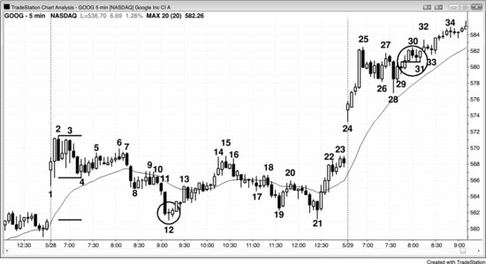
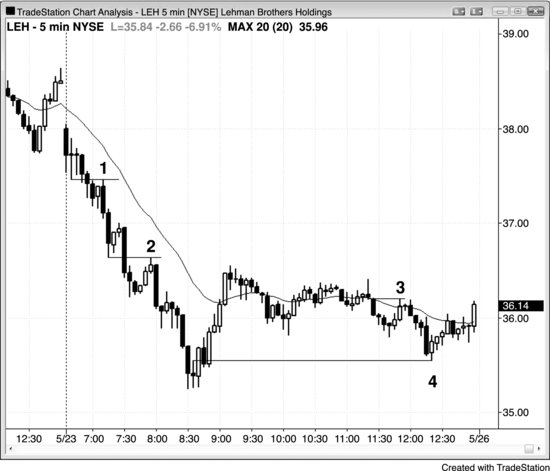
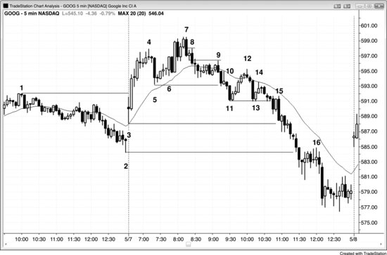
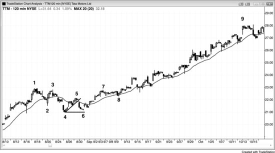
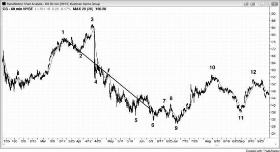

## 第5章　失败突破、突破回撤与突破回测

<!-- Source PDF pages 140–158 -->
<!-- English: Chapter 5: Failed Breakouts, Breakout Pullbacks, and Breakout Tests -->

<!-- PDF page 140 -->

# 第5章  
# 失败突破、突破回撤与突破回测

突破、失败突破、要么趋势反转要么突破回撤然后趋势恢复这一序列是价格行为最常见的方面之一，每天多数交易都可被解读为该过程的某种变体。在更大尺度上，它是主要趋势反转的基础——第三册讨论——那里有趋势线突破，然后突破回撤测试趋势极端。该序列发生在所有突破中，但最常发生在多头或空头旗形的突破中，那是屏幕上主趋势相反方向的小趋势。每当有突破时，市场最终会回撤并测试先前显著价格。回撤的开始把突破转化为失败，你应在此时把所有突破看作失败，即便它们随后恢复。若失败成功反转趋势，突破将已失败而反转将已成功。若反转只走一两根且突破恢复，反转尝试将简单成为突破的回撤（所有未能反转市场的失败突破都是突破方向交易的突破回撤形态）。例如，若有多头突破然后市场回撤到入场价附近，形成买入信号K线，并触发做多，该回撤测试了突破（它是突破回测），并在最近回撤K线高点上方设置做多。若趋势恢复，突破K线通常成为度量缺口；若趋势反转，多头趋势K线成为衰竭缺口，空头趋势K线成为突破缺口（缺口在第6章讨论）。测试可在突破后那根或 20 根或更多之后。究竟测试了什么？测试的是突破会成功还是失败。市场因卖出而从突破回撤。

<!-- PDF page 141 -->

多头卖出以对多单部分获利了结，空头卖出以试图使突破失败并把始终持仓交易方向翻转为向下。多空都评估突破强度。若形态与入场K线强，交易者会预期更高价格。当市场回撤到突破区域时，已做多的多头——无论他们是否在突破上剥头皮出了部分仓位——会把回撤用作再次买入的机会。错过原始入场的多头也会用该回撤做多。在突破前、入场价下方做空的空头会相信市场已翻转为始终做多并将向上趋势。他们因此会用回撤以小亏损回补空单。做空突破的空头会看到突破强、使突破失败的尝试弱，他们会以小利润或亏损或保本回补空单。由于空头现在相信突破会成功且市场会反弹，他们不会想再做空直到市场更高，且仅当有卖出信号发展时。

若形态或突破弱，且突破后不久发展出强空头反转K线，交易者会预期突破失败、空头趋势开始或恢复。多头会卖出平多并至少几根内不再寻找买入，空头会开新空或加现有空。结果是市场会跌破多头突破入场价，对该位的测试将已失败，空头趋势将至少再有一段横盘到下行。

若突破与反转约同样强，交易者然后会看空头反转信号K线后的那根。若它有强空头收盘且是强空头趋势K线，反转继续下行的机会增加。若它反而强多头反转K线，失败突破可能不会成功，该多头反转K线然后成为其高点上方 1 tick 突破回撤买入的信号K线。记住，交易者做的最重要单一判断——且他在每一根收盘后做——是前一根上方与下方会有更多买家还是卖家。这对突破与失败突破尤其成立，因为随后的行情通常 <!-- PDF page 142 --> 决定始终持仓方向，因此持续许多根，而不只是剥头皮。

同一过程每天在所有时间框架上重复许多次。突破可能只是安静地推过前一根高点，回撤可在下一根开始；当情况如此时，突破在更小时间框架图上可能是 10 根突破。突破也可以巨大，如 10 根多头尖峰，回撤可在 20 根或更多之后发生。当过程涉及许多根时，它是更高时间框架图上的小突破，该图上突破与回撤只持续几根。

多头突破后，以下是回撤常到达的一些常见区域：突破点（突破开始的价格）。  
尖峰与通道多头趋势中尖峰顶部。一旦市场突破通道下方，它通常测试下行至尖峰顶部，最终到通道底部。  
最后旗形突破中尖峰顶部。一旦市场在潜在最后旗形突破后开始回撤，它通常测试旗形前的摆动高点。  
阶梯形态中最近摆动高点。多头阶梯通常有至少略跌破最近摆动高点的回撤。  
多头趋势型震荡日中较低震荡区间顶部。若它不反转回上，它可回撤到该较低震荡区间底部。  
在潜在楔形（上升收敛通道）中第三次上推后，概率很高它会测试第二次上推顶部。一旦反转，它通常测试到楔形底部（第一次回撤底部，即楔形通道底部）。  
信号K线高点。即便突破K线突破 10 根前的摆动高点上方，常会有对突破K线紧前那根高点的测试。  
入场K线低点。若市场跌破入场K线，它常在强空头趋势K线中这样做，从那里起的下行通常至少足以剥头皮。

<!-- PDF page 143 -->

上行起点摆动低点底部。市场有时跌破入场K线与信号K线并回撤到多头腿底部，在那里常形成双底多头旗形。  
任何支撑区域如均线、先前摆动低点、趋势线或趋势通道线（如市场形成楔形多头旗形时）。

每当有突破时，交易者必须决定它后会跟趋势还是会失败并反转。由于每张图上有许多突破，精通这一点很重要。突破可能继续几根，但在某一点会有回撤。逆势交易者会把回撤看作突破失败的信号，并在假设市场会反转——至少足以剥头皮——时入场。顺势交易者会部分获利，但他们预期失败突破不会走远就会设置突破回撤，然后趋势会恢复。例如，若有多头突破，第一根低点低于前一根低点的K线是回撤。然而，交易者需要决定它是否反而失败突破并即将导致向下反转。突破越有强趋势特征，它越可能有跟随。若它有很少或没有那些特征，失败并反转回下的概率增加。强趋势特征在第一册《Trading Price Action Trends》中详述，但强多头趋势的重要特征是几根连续多头趋势K线、实体重叠很少、小影线，以及当日更早的多头强度。然而，若第二根是相对强的空头反转或空头内包K线，突破K线不太大，突破是第三次上推，且该K线反转回趋势通道线下方，失败突破与可交易做空的概率更好。若你在该K线低点下方做空且下一根是强多头反转K线，你通常应反转回做多，因为该失败突破可能正在失败，反而设置突破回撤买入形态。

突破后，最终会有回撤测试发起突破的交易者的强度，测试的成功将由 <!-- PDF page 144 --> 交易者是否在该区域第二次入场决定。最强突破通常不会一路回到突破点，但一些回撤可回撤远超突破点并仍后跟强趋势。例如，在多头阶梯形态中，每一次到新摆动高点的突破后跟深突破回撤。该突破回撤保持在先前更高低点上方，创造更高高低点的多头趋势，然后后跟另一更高高点。若突破回撤回到入场价几个 tick 内，它是突破回测。测试可在突破后那根或甚至 20 根或更多之后发生，或两者。该测试K线是潜在信号K线，聪明交易者寻找在其上方 1 tick 放置买入止损入场单，以防测试成功且趋势恢复。它是特别可靠的突破回撤形态。

在向上突破中，突破价区域可能有大量买入，买家压倒卖家。在突破回撤时，市场回落到该价格区域，看买家是否会再次压倒卖家。若他们会，结果可能至少两段上行，突破是第一段上行。然而，若卖家压倒买家，则突破失败，可能有可交易下行，因为剩余多头会被困住，新多头在失败后会犹豫再买。买家会已两次尝试从该价格区域上行并失败，因此市场现在可能做相反的事并至少两段下行。

若突破后一两根内有回撤，突破已失败。然而，即便最强突破也会有一或两根失败，事实上变成突破回撤而非反转。一旦趋势恢复，失败突破将已失败，所有突破回撤都是这种情况。突破回撤只是反转突破的失败尝试。连续失败是第二次入场，因此有出色机会设置盈利交易。突破回撤也称为杯柄形态，它是最可靠的顺势形态之一。

突破回撤可在没有实际突破的情况下发生。若市场强力运行接近旧极端但未超过它，然后安静回撤一到约四根左右，这可能完全像突破回撤一样运作， <!-- PDF page 145 --> 应被交易为好像回撤跟随实际突破。记住，当某物接近教科书形态时，它通常会像教科书形态一样表现。

若当日更早有强行情或趋势第一段，则当日稍后的顺势突破更可能成功；失败可能不会成功反转趋势，它会成为突破回撤。然而，若当日多数时间无趋势、双向有一或两根突破，失败导致反转的概率增加。

初始运行后，许多交易者会部分获利，然后在余额上放置保本止损。保本止损在每笔交易上不必精确在入场价。取决于股票，交易者可能愿意冒 10 甚至 30 或更多美分，它仍基本上被视为保本止损，即便交易者会亏钱。例如，若谷歌（GOOG）在 $750 交易，交易者刚对一半部分获利并想保护其余，但 GOOG 最近打掉保本止损 10 到 20 美分但很少 30 美分，交易者可能在突破外 30 美分放置保本止损，即便这会导致至少 30 美分亏损而非精确保本交易。

在过去一年左右，苹果（AAPL）与 Research in Motion（RIMM）非常尊重精确保本止损，多数突破回撤测试事实上在入场价约 5 美分内结束。相比之下，高盛（GS）经常打掉止损然后回撤才结束，因此交易者若试图持有仓位必须愿意冒一点风险。或者，他们可在保本离场然后在测试K线外 1 tick 止损重新入场，但他们几乎总会以比初始入场差 60 或更多美分重新入场。若价格行为仍好，更有道理扛过突破回测并冒或许 10 美分，而不是离场然后以差 60 美分重新入场。

多数主要趋势反转可被视为突破回撤交易。例如，若市场一直在空头趋势中然后有空头趋势线上方反弹，到更低低点或更高低点的回撤是 <!-- PDF page 146 --> 突破回撤买入形态。重要的是意识到突破的回撤可超过旧极端，因此在多头反转中，向上突破后，回撤可跌破空头低点，多头反转仍可有效并控制价格行为。

有时趋势的最后回撤也可充当相反方向新趋势的第一段。例如，若有空头趋势，后跟可能持续 10 到 20 根或更多的缓慢反弹，然后卖盘高潮与向上反转进入多头趋势，包含最后空头旗形的通道若向上向右投射，有时也会大约包含新多头趋势。该最后空头旗形事实上事后可被看作新多头趋势中实际上的第一次上行。向下俯冲可被视为新多头趋势中的更低低点回撤。若你认出该形态，你应寻找波段持有更多仓位而不要太快离场。一旦新多头趋势超过空头旗形高点，它会打掉把空头旗形看作弱反弹尝试、因此可能不是空头趋势最后更低高点的空头的保护性止损。市场在该高点上方反转后，空头一段时间不会寻找新做空机会。这常导致空头旗形被超过后很少或没有回撤，上行可延长。同一现象在楔形旗形成形时常见。例如，楔形空头旗形有三次上推。它常在第一次上推后有向下突破到更低低点。它然后会在该低点后再有两次上推以完成楔形空头旗形。一旦空头旗形完成，市场通常会从楔形空头旗形下侧突破并形成新趋势低点。

突破常失败，失败可在任何点发生，甚至在仅第一根之后。窄幅震荡区间的单根突破与继续进入趋势一样可能失败并反转回区间。开盘持续几根的急剧突破常失败并导致相反方向的趋势日。这在第三册交易第一小时章节讨论。

在日线图上，常有因意外新闻事件的急剧逆势突破。然而，尖峰没有跟随（如通道）成为成功突破，突破通常失败，尖峰只成为短暂回撤的一部分。例如， <!-- PDF page 147 --> 若股票在强多头趋势中且昨日收盘后有意外差财报，它今日可能跌 5%，使交易者怀疑趋势是否在反转过程中。多数情况下，多头会在空头尖峰低点与收盘附近激进买入，那总是到支撑区域如趋势线。他们正确押注空头突破失败、多头趋势恢复的概率。他们把抛售看作短暂大甩卖，让他们以几天后就会消失的大折扣买入更多。在一周左右内，所有人都会忘记可怕新闻，股票通常会回到空头尖峰顶部上方，前往新高。

## 图 5.1　趋势末期突破可导致反转或新一段

有时趋势末期的突破可以是衰竭高潮并导致反转，其他时候它可以是突破并导致另一通道。所有高潮都以震荡区间结束，可短至单根。在震荡区间期间，多空继续交易，双方都试图在其方向获得跟随。在图 5.1 中，在下行至 K线 5 的卖盘高潮与上行至 K线 19 的买盘高潮中，多头都赢得了争夺。

K线 1、2、3 与 5 结束空头尖峰，连续卖盘高潮常导致至少持续 10 根并至少有两段的调整。K线 4 是空头趋势中最大的空头趋势K线，因此它可能代表最后弱多头最终放弃并以任何价格离场。情况可能确实如此，市场以两段上行调整进入收盘，第一段结束于 K线 8，第二段以当日最后一根结束。

<!-- PDF page 148 -->

次日，K线 15、16、17 与 19 是买盘高潮。市场成功突破跟随跳空尖峰至 K线 15 并以到 K线 17 的三推结束的多头通道下侧。然而，每当调整是横盘而非下行时，多头强，他们能够创造三推顶上方的突破。尽管大多头K线可能由最后空头最终放弃造成，此处它由激进多头成功把市场突破楔形顶上方造成。该多头尖峰后跟试图在 K线 21 结束但能延伸至 K线 25 的通道。

## 图 5.2　突破回撤

如图 5.2 所示，K线 8 是潜在失败突破，但突破强，由三根空头趋势K线组成，覆盖当日多数波幅，影线小且重叠少。市场回撤至均线并导致 K线 10 处的 Low 2 做空（或小楔形空头旗形）信号，那是第二根空头趋势K线与回撤至均线第二段的终点。突破回撤是最可靠形态之一。

<!-- PDF page 149 -->

K线 12 再次是到当日新低的潜在失败突破。这是连续第二次卖盘高潮的向上反转，连续高潮的反转通常导致至少 10 根与两段的回撤。即便 K线 12 信号K线是十字星而非多头反转K线，它有比空头影线更大的多头影线，表明一些买入与空头的一些减弱。此外，K线 8 到 K线 10 空头旗形是窄幅震荡区间，因此有磁力，增加任何突破会被吸回该位的机会。K线 11 是突破K线，因此它创造了突破缺口。突破缺口通常被测试，突破点也是。K线 1 低点是突破点。空头想要回撤保持在 K线 1 下方，多头想要相反。至少，多头想要市场回到 K线 1 低点上方并保持在那里，以便多数交易者把突破看作失败。这可能已结束空头趋势。最后，前几小时的震荡区间约是平均日波幅的一半，这增加任何向上或向下突破后会跟约相同大小震荡区间的概率，创造趋势型震荡日。因此，应预期多头在 K线 12 价格位附近出现，那是从当日第一段下行（K线 2 到 K线 4）的等幅运动下行。

K线 31 是突破小摆动高点上方并几乎突破至当日新高的小反弹的回撤。当市场几乎突破然后回撤时，它会交易为好像它实际突破了，因此是一种突破回撤。该 K线 31 突破回撤只交易到 K线 29 信号K线顶部下方 2 美分，当股票在 $580 交易时，它几乎是完美突破回测，因此是可靠做多形态。市场再次在三根前突破的价格处找到强买家。旗形突破的回撤是最可靠形态之一。

一旦到当日新高的实际突破发生，在 K线 33 有突破回撤做多入场形态。

尽管不值得在日内看许多不同时间框架，更小时间框架常有在你用于交易的图上不明显的可靠突破回测形态。例如，若你在交易 3 分钟图，你会看到 K线 6 高点 <!-- PDF page 150 --> 是形成 K线 3 上方高点的 3 分钟K线的突破回测。这意味着若你看 3 分钟图，你会发现对应 5 分钟图上 K线 6 的K线对对应 5 分钟图上 K线 3 的 3 分钟图上K线低点形成完美突破回测。

K线 28 是强空头K线，是把市场向下突破的尝试。在它形成时，它短暂是大空头趋势K线，最后价格在其低点并在前八根低点下方，创造强空头突破与反转。然而，到该K线收盘时，其收盘在 K线 26 震荡区间低点上方。多数逆势突破尝试失败并被强交易 fade；他们理解多头趋势中的空头尖峰常见，通常后跟新高。在 K线 28 在其K线低点的那一刻，初学者把它看作非常大的空头趋势K线并假设趋势在急剧反转成强空头。他们看不见图上所有其他K线。有经验的交易者把空头尖峰看作短暂降价与在多头趋势中买入折扣的大好机会。当这样的空头尖峰发生在日线图上时，通常由于某个新闻事件，当时看起来巨大，但有经验的多头知道与股票所有其他基本面相比它很小，它只是强多头趋势中的一根空头K线。

## 图 5.3　突破回测

<!-- PDF page 151 -->

许多股票常表现良好，会精确到 tick 回来测试突破，如雷曼兄弟控股（LEH）在一日内做了四次（见图 5.3）。由于许多交易者会在信号K线外 1 tick 止损入场突破，这样的精确回撤会打掉任何保本止损 1 tick。然而，在测试K线外 1 tick 重新入场通常是好交易（例如，在 K线 2 低点下方一美分做空）。或者，交易者可在回撤上冒几美分风险，避免被突破回测打掉。趋势恢复后，他们可把止损移到刚好该测试K线上方。

卖家在 K线 1、2 与 3 高点再次出现。买家在 K线 4 再次展现自己，当市场回落到买家最初在当日低点压倒卖家的地方。该更高低点是买家在该价格区域第二次尝试控制市场，他们成功了，因此应至少有两段上行。

## 图 5.4　突破回测可打掉保本止损

<!-- PDF page 152 -->

GS 在过去一年因打掉保本止损而臭名昭著，但只要你意识到你交易的市场的倾向，你可做盈利调整（见图 5.4）。

K线 8 延伸到 K线 6 信号K线低点上方 6 美分。

K线 10 触及 K线 9 信号K线低点上方 2 美分，把精确保本止损打掉 3 美分。交易者可通过在成功突破回测后冒约 10 美分避免被打掉并不得不在低 50 美分处再做空。一旦市场跌破突破回测K线，把保护性止损移到其高点上方 1 美分。

K线 5 高点超过昨日最后一小时摆动高点 2 美分后第二次在该价格区域反转向下。买家两次尝试走到该区域上方并两次失败，创造双顶，因此市场应至少两段下行。它也超调跨 K线 2 与 4 画出的趋势通道线，到 K线 7 的多头趋势线突破后跟 K线 8 对多头极端（K线 5）的更低高点测试，导致空头摆动。

K线 8 是由四根空头K线突破多头趋势线（未显示）形成的尖峰的回撤。交易者争论突破会失败还是成功。多头把 K线 7 向上外包——与 K线 3 双底——看作空头突破会失败的信号，并在它向上外包且在 K线 7 高点上方时买入。空头把空头尖峰看作强，寻找做空回撤。他们在 <!-- PDF page 153 --> K线 8 后空头内包K线低点下方卖出（它与 K线 8 形成两K线反转）。

K线 1、K线 2 后那根、K线 3，以及 K线 4 后那根是单根突破回撤买入形态。

到 K线 9 的三根多头尖峰无论多强，交易者都不能看不见之前从 K线 8 起的强得多的抛售。初学者常只看最近几根，倾向于忽略稍左更令人印象深刻的K线。K线 9 只是空头趋势中对均线的 Low 2 测试。K线 10 是均线处的双顶（与四根前那根高点）因此是另一个 Low 2 做空。初学者可能再次把到均线的三根强多头K线反弹看作趋势反转，再次看不见有效的强空头趋势。K线 10 只是空头趋势中另一更低低点后对均线的另一更低高点测试。

## 图 5.5　顶部的突破回撤可以是更高高点

楔形顶突破后，回撤不必是更低高点。在图 5.5 中，有两个向下突破的楔形顶，两种情况下市场都回撤到更高高点（在 K线 6 与 K线 11）。

市场从 8 月到 10 月在震荡区间中然后向上突破，有大量双边交易。这是趋势型震荡形态，概率很高一旦它反转 <!-- PDF page 154 --> 向下，它会至少测试较低区间的 K线 6 高点。一旦市场跌入较低区间且没有立即反转回上，下一个测试点是较低区间底部。

## 图 5.6　突破回撤形态

GOOG 在图 5.6 所示图中形成一系列突破回撤入场。开盘急剧反弹突破昨日 K线 1 摆动高点上方，K线 5 的回撤甚至不能到达均线或突破点。当有强动能时，买入 High 1 回撤是好交易。信号K线是小十字星内包K线，表明大空头趋势K线后卖出力量丧失。多头微型趋势线下方的空头突破失败并成为昨日高点上方突破的回撤。在 K线 6 有第二次做多入场，是 High 2。在强趋势中，有时 High 2 入场高于 High 1 的入场（此处，三根前）。

K线 7 是到更高高点行情中的第三个强空头尖峰。这代表卖盘压力，总是累积的，表明空头变得越来越强。

K线 8 是差 2 美分未达信号K线低点的突破回测。K线 9 是差 4 美分未达 K线 8 做空信号K线低点的突破回测。

<!-- PDF page 155 -->

这些只是观察，做 K线 8 与 9 的突破回撤做空不需要它们。

K线 9 是均线处的 Low 2 做空形态且是空头趋势K线，这是可靠组合。随后是内包K线，在 K线 10 创造另一突破回撤做空入场。它也是第一个清晰更低高点与空头趋势的可能起点。

K线 11 跌破 K线 5 回撤并导致均线处 K线 12 的突破回撤做空。K线 12 是另一更低高点，与 K线 9 形成双顶空头旗形。双顶不必精确。K线 12 也是下行至 K线 11 的空头尖峰的回撤与空头通道起点，通道中有几个更多空头尖峰。

K线 13 只突破 K线 11 下方 5 美分但很快在 K线 14 Low 1 给出突破回撤做空入场。由于 K线 14 有多头实体，更谨慎的交易者会等第二次入场。K线 14 后的十字星是可接受入场K线，但卖出该十字星后的外包K线更好，因为它是 Low 2。为何是 Low 2？因为它跟随两小段上行。K线 14 是第一段上行，两根后的外包K线交易到该小十字星上方，创造第二段上行（以及 Low 2 做空入场）。

K线 15 也是 K线 11 与 13 下方突破后回撤的外包K线做空入场。它特别好是因为有被困多头，他们买入两K线多头反转，以为那是 K线 11 与 K线 13 双底下方的失败突破。每当双底下方突破试图向上反转并失败时，它是失败楔形形态，常有约等幅运动下行。双底创造前两次下推，双底下方突破是第三次下推。由于从 K线 14 起有四根空头趋势K线，聪明交易者会想要更高低点回撤再做多。

K线 16 是昨日 K线 2 摆动低点下方突破后的 Low 2 回撤。

这些交易中许多是微小剥头皮，不应是多数交易者的焦点。它们的意义在于它们说明常见行为。交易者应专注于交易更大转折点，如 K线 4、7、9 与 12。

<!-- PDF page 156 -->

## 图 5.7　失败突破

如图 5.7 所示，该 EWZ（iShares MSCI 巴西基金 ETF）60 分钟图上有几个多头与空头旗形的失败突破。一旦有趋势然后有突破失败并后跟反转的旗形，该旗形是趋势的最后旗形。

最后多头旗形可在更高高点后向下反转，如在 K线 3 与 9，或在更低高点后，如在 K线 5 与 10。最后空头旗形可在更低低点后向上反转，如在 K线 6、11 与 13，或在更高低点后，如在 K线 1、8 与 14。

## 图 5.8　最后旗形

<!-- PDF page 157 -->

有时最后空头旗形也是下一多头趋势的第一段上行（见图 5.8）。该塔塔汽车有限公司（TTM，印度汽车制造商）120 分钟图有结束于 K线 5 并成为抛售最后旗形的空头旗形。K线 6 更高低点导致急剧反弹至 K线 7，那在 K线 5 更低高点上方，因此是更高高点与多头强度信号。如第三册最后旗形部分讨论，最后空头旗形的突破不必跌破空头低点。

## 图 5.9　双底

<!-- PDF page 158 -->

如图 5.9 所示，5 分钟 Emini 在强空头趋势下行至 K线 1，随后是结束于 K线 2 的低动能、圆顶空头旗形。接着是急剧抛售至 K线 3，测试 K线 1 低点。尽管它高几个 tick，它是对空头低点的双底测试。事后看，到 K线 2 的反弹是最后空头旗形并实际上是新多头趋势的第一段上行，到 K线 3 的抛售是该反弹的突破回撤与空头旗形的失败突破。从 K线 3 起的多头尖峰有如此多动能，它毫不停顿地冲过 K线 2 空头旗形上方。这通常表明还有更多空间，因此交易者不应太快离场全部多单。第一次回撤是 K线 4 的 High 1，远在 K线 2 高点上方。

## 图 5.10　最后旗形斜率可预测新趋势斜率

有时趋势最后旗形的斜率约与反转后新趋势的斜率相同（见图 5.10）。该 GS 60 分钟图有从 K线 1 到 K线 2 的最后多头旗形，其一般斜率约与反转后空头趋势相同。市场知道抛售会有的大致下降速率，但抛售被到 K线 3 的一次最后更高高点短暂打断。从 K线 1 到 K线 9 的整个形态是下行通道，即多头旗形。到 K线 3 的上行是向上假突破。
