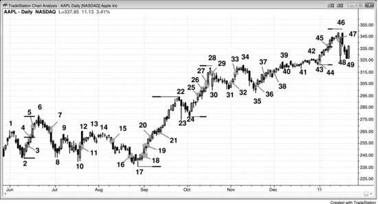
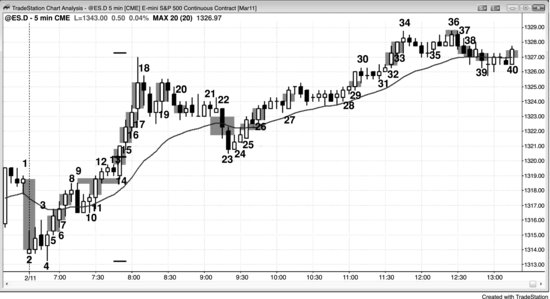
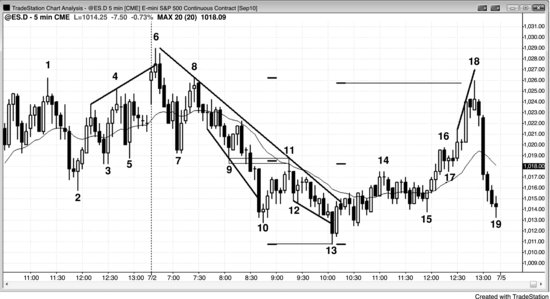
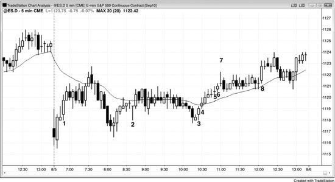

## 第 6 章：缺口

<!-- Source PDF pages 159–179 -->

<!-- PDF page 159 -->

第 6 章
缺口
缺口只是两个价格之间的空间。在日线、周线与月线图上，传统缺口很容易发现。例如，若市场处于多头趋势且今日低点在昨日高点上方，则今日跳空高开。这些传统缺口在趋势起点形成时称为突破缺口（breakaway/breakout gaps），在趋势中部时称为度量缺口，在趋势末端形成时称为耗竭缺口。当缺口在其他时候形成时，如在趋势的尖峰阶段内或在震荡区间内，它只是被简单称为缺口。交易者通常无法在看到市场接下来做什么之前对缺口分类。例如，若市场在日线图上正在突破震荡区间顶部，突破K线是低点在前一根高点上方的大多头趋势K线，交易者会把缺口看作强势迹象，并把它想成潜在突破缺口。若新多头趋势持续数十根K线，他们会回头看该缺口并明确称其为突破缺口。若市场反而在几根K线内反转向下进入空头趋势，他们会称其为耗竭缺口。
若多头趋势走了五或 10 根左右K线然后再次跳空，交易者会认为这第二次跳空可能成为多头趋势的中部。他们会把它看作可能的度量缺口，许多交易者会在市场做出等幅上行时寻找止盈多单。等幅运动基于从多头趋势底部到缺口中部的高度，该高度加到缺口中部。这类缺口通常在趋势的尖峰阶段，它给交易者信心市价或在小回撤时入场，因为他们相信市场会朝等幅运动目标推进。
在多头趋势已持续数十根K线、到达阻力区域并开始显示可能反转的迹象之后，交易者会注意下一次跳空高开（若有）。若形成一个，他们会把它看作 <!-- PDF page 160 --> 潜在耗竭缺口。若在走高太多之前，市场交易回落到缺口前那根高点下方，交易者会把那看作弱势迹象，并认为该缺口可能代表耗竭，那是一种买盘高潮。他们常常在市场至少修正 10 根K线与两段之前不再寻找买入。有时耗竭缺口在趋势反转之前形成，因此每当有可能的耗竭缺口时，交易者会看整体价格行为，看交易者公式是否支持做空仓位。若有反转，创造它的趋势K线然后是突破缺口（一根K线可以像缺口一样起作用）与可能反方向趋势的开始。
由于所有趋势K线都是缺口，交易者可以看到日线图上如此常见的传统缺口的日内等价物。若有处于阻力区域且很可能反转向下的多头趋势（反转在第三册讨论），但有最后一次突破，那根多头趋势K线可能成为耗竭缺口。该K线有时是收在高点附近的非常大多头趋势K线，偶尔最后突破会由两根非常大多头趋势K线组成。这是潜在买盘高潮，它提醒精明交易者卖出。多头卖出以锁定利润，因为他们相信市场很可能交易两段并约 10 根K线，可能允许他们在低得多处再买。他们也意识到耗竭性买盘高潮与趋势反转的可能性，不想冒回吐任何利润的风险。激进空头也意识到这一点，他们会卖出启动空单。若接下来几根内形成强空头趋势K线且始终持仓方向翻转为做空，那最后一根多头趋势K线成为确认的耗竭缺口，空头趋势K线成为突破缺口。多头趋势K线后跟空头趋势K线是高潮式反转，也是两K线反转。若两根趋势K线之间有一根或更多K线，那些K线形成岛形顶。那个岛形顶的底部是空头突破缺口的顶部，与所有缺口一样，可能被测试。若它被测试且市场再次向下转，那个突破回测形成更低高点。若初始反转向下很强，多头与空头都会在市场测试岛形顶以及市场再次向下转时卖出，因为两者都更确信市场会下跌约 10 根或更多K线。多头会卖出以锁定利润或 <!-- PDF page 161 --> 最小化亏损，若他们在多头趋势突破K线形成时在更高处买入。空头会卖出启动空单。一旦市场交易下行许多根K线，止盈者（买回空单的空头）会进入并创造回撤或震荡区间。若市场再次有跌破震荡区间的空头趋势K线，该K线然后是可能的度量缺口，交易者会试图持有部分空单直到市场接近该目标。
当市场向下转时，交易者会看空头K线的强度。若有一两根收在低点附近的大空头趋势K线，交易者会假定始终持仓方向可能在翻转为做空。他们会观察接下来几根，看是否形成 High 1 买入信号K线。若形成且它很弱（相对抛售），如小多头十字星或空头K线，更多交易者会寻找在其高点上方做空而不是买入。记住，这是一直是多头趋势中的 High 1 回撤，但现在交易者在寻找约 10 根K线横盘到下行，因此更多会寻找在 High 1 买入信号K线上方做空而不是买入。若他们正确，High 1 买入信号会失败并形成更低高点。若反转向下很强，交易者也会在更低高点下方与 High 1 买入信号K线下方做空。若市场更多横盘到下行然后形成 High 2 买入形态，空头会假定它也会失败，并在其高点处及上方挂限价单做空。其他空头会在 High 2 买入信号K线下方挂止损单做空，因为那是买入 High 2 的多头放保护性止损的地方。一旦这些多头被止损出局，他们很可能至少几根K线内不会再寻找买入，多头的缺失与空头的存在可导致空头突破。若它很弱，多头可能能创造楔形多头旗形（High 3 买入形态）。若突破很强，下行运动很可能至少走几段小腿，并到达基于震荡区间高度（多头高点到 High 2 多头信号K线底部）的等幅运动。突破K线然后成为度量缺口。若多头在 High 3（楔形多头旗形）成功把市场转上，则空头度量缺口会关闭并成为耗竭缺口。
这个过程在每张图上每天发生许多次，交易者始终在问自己突破是否可能成功（并把突破K线变成度量缺口），还是更可能失败（并把 <!-- PDF page 162 --> 形成突破的趋势K线变成耗竭缺口）。标签不重要，含义重要。这是交易者做的唯一最重要决定，每当他们考虑任何交易时都会做：前一根上方与下方会有更多买家还是卖家？每当他们相信有失衡时，他们就有优势。在那个多头突破的情况下，当终于有失败突破的信号K线时，交易者会决定该K线下方会有更多买家还是卖家。若他们认为突破很强，他们会假定会有更多买家，会在该K线下方买入。其他人会等待看下一根是否只跌几个 tick。若是，他们会挂止损单在其上方买入，并把它视为突破回撤买入形态。缺口然后很可能成为度量缺口。空头会把失败突破的信号K线看作强卖出信号，会在其低点下方做空。若他们正确，市场会抛售，关闭多头缺口（把它变成耗竭缺口），不久跌破多头突破K线低点下方，他们希望它继续低得多。
「所有缺口都会被回补」是你有时听到的说法，但这说法很少帮助交易者。市场始终在回来测试先前价格，因此该说法若是「所有先前价格都被测试」会更精确。然而，足够多交易者关注缺口，使它们充当磁铁，尤其当回撤接近它们时。市场越接近任何磁铁，磁场越强，市场越可能到达磁铁（这是买盘与卖盘真空的基础）。例如，若多头趋势中有跳空高开，一旦终于有修正或反转，市场可能只是略微更可能跌到缺口前那根高点下方（因此回补缺口），而不是跌到反弹中任何其他K线高点下方。然而，由于缺口是磁铁，交易者可以在市场接近它们时寻找交易机会，正如他们在市场接近任何磁铁时应该做的。
K线低点在前一根高点上方，或K线高点在前一根低点下方的缺口，在高流动性工具的日内图上罕见，除了当日第一根——那时它们很常见。然而，若使用宽定义，其他类型的缺口在 5 分钟图上每天发生许多次，它们可以 <!-- PDF page 163 --> 有助于理解市场在做什么以及设置交易。偶尔，5 分钟图上某根K线的开盘会在前一根收盘上方，这常常是强势的微妙迹象。例如，若连续多头趋势K线上有两三个这种缺口，多头很可能很强。所有这些缺口在日线、周线与月线图上也有同样意义。
由于缺口是价格行为的重要元素，日内交易者应使用缺口的宽定义，并把趋势K线看作日内等价物，因为它们在功能上相同。若成交量足够稀薄，每当有一系列趋势K线时，每张日内图上都会有实际缺口。记住，所有趋势K线都是尖峰、突破与高潮，突破是缺口的一种变体。当 Emini 当日第一根有大跳空高开时，标准普尔（S&P）500 现货指数上会有大多头趋势K线。那是缺口与趋势K线代表同样行为的例子。当趋势起点有大趋势K线时，它创造突破缺口。例如，若市场在从低点反转向上或突破震荡区间，趋势K线之前那根的高点与之后那根的低点创造突破缺口。你也可以简单把整个趋势K线实体想成缺口，可能有其他最近摆动高点被一些交易者视为缺口底部。常常没有单一选择，但那没关系。重要的是有突破，意味着有缺口，即便图上看不见传统缺口。市场常常会跌到趋势K线之前那根高点下方一两个 tick，交易者仍会认为突破有效，只要回撤不跌破趋势K线低点。总体而言，若市场跌到之前那根高点下方超过几个 tick，交易者会对突破失去信心，即便没有反转也可能没有太多跟随。
每当潜在多头突破中有趋势K线时，始终看它之前那根的高点与之后那根的低点。若它们不重叠，它们之间的空间可能充当度量缺口。若趋势继续上行，在等幅运动处寻找止盈（基于多头段低点到缺口中部）。有时缺口底部会是几根前形成的摆动高点，或 <!-- PDF page 164 --> 尖峰内的高点，但在趋势K线前几根。缺口低点可能是突破K线后许多根形成的摆动低点。对在空头段中突破的空头趋势K线也一样。始终寻找潜在度量缺口，最明显的一个是空头趋势K线之前那根的低点与之后那根的高点之间。
若多头趋势已持续 5 到 10 根或更多K线，然后又有一根多头趋势K线，它可能成为只是不起眼的缺口、度量缺口，或耗竭缺口。交易者在看到接下来几根之前不会知道。若有另一根强多头趋势K线，度量缺口的几率更大，多头会继续买入，预期反弹基于缺口中部继续上行大约等幅运动。
另一种常见缺口是在K线高点或低点与移动平均线之间。在趋势中，这些可以设置测试趋势极端的好波段交易；在震荡区间中，它们常常设置到移动平均线的剥头皮。例如，若有强空头趋势且市场终于反弹到移动平均线上方，该反弹中第一根低点在移动平均线上方的K线是第一根移动平均线缺口K线。交易者会在该K线低点下方 1 tick 挂卖出止损做空，寻找测试空头市场低点。若止损未触发，他们会继续把止损上移到刚收盘那根低点下方 1 tick，直到空单成交。有时他们会被市场越过信号K线上方止损出局，若发生，他们会再试一次在前一根低点下方 1 tick 重新入场空单。一旦成交，信号K线是第二根移动平均线缺口K线做空信号。
移动平均线缺口每天发生许多次，多数时候它们在没有强趋势时发生。若交易者有选择性地做，许多这些缺口K线可以设置到移动平均线的 fade。例如，假定当日是震荡区间日，市场已在移动平均线上方一小时左右。若它然后抛售到移动平均线下方，但后跟高点在移动平均线下方的强多头反转K线，若该K线高点与移动平均线之间有足够空间做多头剥头皮，交易者常常会在该K线上方做多。

<!-- PDF page 165 -->

所有时间框架上的突破，包括日内与日线图，常常形成与传统版本不同的突破缺口与度量缺口。突破点与突破后第一次停顿或回撤之间的空间是缺口，若它出现在可能强趋势的早期，它是突破缺口（breakaway gap），是强势迹象。虽然它会导致从该段起点起的等幅运动，目标通常对交易者止盈来说太近，他们因此应忽略等幅运动投射。相反，他们应把缺口只看作强势迹象，而不是用来创造止盈目标的工具。例如，若 Emini 平均日波幅约 12 点，在开盘约一小时后波幅只有三点，突破形成的缺口会导致当日波幅只有六点的目标。若趋势刚开始，更可能波幅会达到约平均 12 点而不是仅六点，因此交易者不应在等幅运动目标处止盈。
当从段起点到突破缺口（breakaway gap）的距离大约是平均日波幅的三分之一到一半时，其中部常常导致交易者可能止盈甚至反向的等幅运动投射。例如，若市场处于震荡区间然后形成突破震荡区间上方的大多头趋势K线，区间顶部的摆动高点是突破点。若下一根横盘或上行，该K线低点是第一个要考虑作为突破回测的价格；其低点与突破点之间的中点常常成为多头段的中部，缺口是度量缺口。若区间大约是最近平均日波幅的三分之一到一半，用该段底部作为等幅运动起点；测量该低点到度量缺口中部之间的 tick 数，并在该中点上方投射同样数量的 tick。然后看若市场上行到等幅运动一两个 tick 内时市场如何表现。若在突破后几根内市场回撤进入缺口但然后反弹，用那个回撤低点作为突破回测，然后度量缺口在那个低点与突破点之间。这是强势迹象。一旦市场反弹到等幅运动投射，许多交易者会部分或全部止盈 <!-- PDF page 166 --> 他们的多单。若上行弱，有些交易者甚至可能在等幅运动目标挂限价单做空，尽管只有非常有经验的交易者应考虑这点。
艾略特波浪交易者把多数这些缺口看作由保持在波浪 1 高点上方的小波浪 4 回撤形成，并预期波浪 5 会跟随。基于艾略特波浪理论交易的成交量不足以使这成为价格行为的显著成分，但每当回撤不跌破突破点时，所有交易者都把这看作强势迹象，并预期趋势高点测试。回撤是突破回测。
若回撤略跌破突破点，这是缺乏强势的迹象。你仍可使用那个低点与突破点之间的中部，即便回撤在突破下方。当那发生时，我把这类缺口称为负缺口，因为数学差是负数。例如，在多头突破中，若你用突破回测K线低点减去突破点高点，结果是负数。负度量缺口导致的投射不太可靠，但仍可以非常准确，因此值得观察。顺便说一句，阶梯形态在每一次新突破后都有负缺口。
小度量缺口也可以在任何趋势K线周围形成。若趋势K线之前与之后那根不重叠，这些微型度量缺口会发生，像任何缺口一样，可以导致等幅运动。若趋势K线在充当突破，等幅运动通常更准确。例如，看任何多头段中任何强多头趋势K线，其中趋势K线正在突破进入强多头段。若它之后那根的低点在它之前那根的高点处或上方，之间的空间是缺口，可以是度量缺口。从段起点量到缺口中部，并向上投射看若缺口在段中部市场必须走多高。这是多头可能止盈的区域。若在那里有其他做空理由，空头也会在那里做空。当这些微型缺口发生在趋势前几根时，市场通常会延伸远超基于缺口的等幅运动。不要用缺口找止盈区域，因为市场很可能走得远得多，你不想 <!-- PDF page 167 --> 在绝佳波段中过早出场。然而，这些缺口在趋势早期仍重要，因为它们给趋势交易者对趋势强度更多信心。
突破每天发生许多次，但多数失败，市场反转。然而，当它们成功时，它们提供潜在回报可以是风险数倍、且有可接受成功概率的机会。一旦交易者学会如何判断突破是否可能成功，应考虑这些交易。第 8 章关于等幅运动中有度量缺口的其他例子。
使用缺口的这一宽定义使交易者发现许多交易机会。一种非常常见的缺口类型发生在任何图上任何三根连续趋势K线中。例如，若这三根在上行趋势且 K线 3 低点在 K线 1 高点处或上方，有缺口，它可以充当度量缺口或突破缺口。K线 1 高点是突破点，由 K线 3 低点测试，后者成为突破回测。在更小时间框架图上，你可以看到 K线 1 顶部的摆动高点与 K线 3 底部的摆动低点。很容易忽略这个形态，但若你研究图表，你会看到这些缺口常常在接下来许多根内被测试但未被回补，因此成为买家很强的证据。
相关缺口发生在市场已趋势许多根K线但现在有异常大的趋势K线之后。例如，若市场过去几小时一直在上涨但现在突然形成收在高点附近的非常大多头趋势K线，尤其若这根或接下来几根中的一根的高点延伸到趋势通道线上方，会创造一个或多个有一个或多个突破点与突破回测的重要缺口。很少见地，这根是新的、甚至更陡多头趋势的开始，但更常见得多的是它代表过度、耗竭多头趋势中的买盘高潮，会在几根内后跟可持续约 10 根左右的横盘到下行修正，甚至可能成为趋势反转。有经验的交易者等待这些K线，他们的等待从市场中移除卖家并创造买盘真空，快速吸高市场。一旦他们看到它，多头止盈，空头在该K线收盘、该K线上方、接下来一两根收盘（若它们弱）或在那些K线下方止损做空。看 <!-- PDF page 168 --> 买盘高潮K线之前与之后的K线。第一个要考虑的缺口是它之后那根低点与之前那根高点之间。若市场继续上行几根然后回撤再反弹，突破回测现在是那个回撤的低点。若市场交易到买盘高潮K线之前那根高点下方，缺口然后被关闭（回补）。若市场继续下行进入大空头段，缺口成为耗竭缺口。
此外，在多头突破之前的K线中寻找其他可能的突破点。这些通常是摆动高点，可能有几个要考虑。例如，几根前可能有小摆动高点，但甚至一两小时前形成的另外几个更高摆动高点。若突破K线强势突破它们全部上方，它们都是可能的突破点，可导致等幅上行，你可能必须考虑从这些缺口每一个中点向上的投射。若在其中一个投射处有阻力汇合，如趋势通道线、更高时间框架空头趋势线，或基于其他计算的几个其他等幅运动目标，如震荡区间高度，止盈者会在该水平进入，也会有一些空头。有些空头会剥头皮，但其他人会建立波段并在更高处加仓。
有一种广泛持有的信念：多数缺口会被回补，或至少突破点会被测试，这是真的。每当某事很可能发生，就有交易机会。当有空头尖峰与通道时，市场常常修正回升到通道顶部，那是缺口底部，并试图形成双顶做下行测试。当有突破显著摆动高点上方的买盘高潮K线时，通常会有回撤测试那个摆动高点，因此交易者应寻找可能导致测试的做空形态。然而，不要太急，确保形态有意义且有其他证据表明回撤可能迫近。这可能是横盘多头旗形突破并运行几根然后有强反转K线，把那个多头旗形变成可能的最后旗形。最后旗形通常后跟至少两段式修正，测试旗形底部；它们常常从顶部下跌等幅下行 <!-- PDF page 169 --> 到旗形底部，有时导致趋势反转。上述对空头突破也全部成立。
除了在趋势起点形成的突破缺口与在中部形成的度量缺口外，当趋势试图反转时形成耗竭缺口。当趋势晚期有缺口然后市场反转并关闭缺口时，缺口成为耗竭缺口，与所有耗竭迹象一样（在第三册关于反转中讨论），它通常后跟震荡区间，但有时导致反转。这些对按日线图交易的交易者更重要，但日内交易者在导致开盘反转的跳空开盘上始终看到它们。日内交易者把它们想成只是失败的跳空开盘，但它们是一种耗竭缺口。在日线图上，若有耗竭缺口后跟反方向突破缺口且该缺口在K线收盘后仍打开，这创造岛形反转形态。例如，若有多头趋势然后有跳空高开，后跟下一根甚至十几根后的跳空低开，两个缺口之间的K线被视为岛形顶。图 18.4（在第 18 章）显示日线图上岛形底的例子。

每当有通道然后有收盘越过前一根极端的趋势K线时，交易者应观察是否形成缺口。例如，若有多头通道或空头旗形且下一根收在前一根高点上方几个 tick，这根突破K线可能成为度量缺口。观察下一根低点是否保持在前一根高点上方。若是，突破K线可能是度量缺口。若缺口关闭，趋势K线可能是耗竭缺口，多头尖峰可能导致反转向下。
突破缺口在第一册第 23 章关于从开盘起的趋势与第三册关于跳空开盘的章节中进一步讨论。
图 6.1 日线图上的多种缺口 <!-- PDF page 170 --> 日线图上的传统缺口被分类为突破缺口（breakaway gaps）、度量缺口、耗竭缺口，以及只是普通缺口。大体上，分类不重要，最初看起来是一种类型的缺口稍后可被视为不同类型。例如，图 6.1 所示 AAPL 日线图上的缺口 5 可能曾是度量缺口，但最终是耗竭缺口。此外，当市场处于强趋势时，它常常有一系列缺口，任何一个都可以成为度量缺口。交易者需要意识到每一种可能。例如，缺口 4、21、25、26、27 与 45 是潜在度量缺口。缺口 4 是度量缺口，K线 6 高点几乎是完美等幅运动。从该段 K线 2 底部到缺口中部大约有与从缺口中部到 K线 6 顶部——止盈者与新强空头进入处——一样多的 tick。止盈在基于缺口 26 与 45 的目标略下方进入。

突破缺口常常翻转始终持仓方向，因此是重要的强势迹象。多数交易者会把下列分类为突破缺口：缺口 3、7、11、15、18、29、32、36、44 与 47。当有突破与缺口时，把缺口看作强势迹象，而不是用来创造等幅运动目标的工具。当趋势刚开始时，过早止盈是错误。不要把合理的突破缺口候选当作度量缺口使用。
到 K线 22 的反弹突破 K线 6 高点上方，到 K线 23 与 24 的回撤是突破回测。K线 24 低点——市场再次向上转处——与 K线 6 高点之间的空间是突破缺口。

<!-- PDF page 171 -->

这里，由于 K线 24 低点在 K线 6 高点下方，突破缺口是负的。由于它是从大震荡区间的突破，它也很可能是度量缺口。
一些有经验的交易者会 fade 突破并在 K线 22 下方做空，寻找测试突破点与快速下行剥头皮。多头在寻找同样的东西，并准备在回撤测试进入缺口时急切市价或限价买入。多头最初在上行至 K线 22 的运动中买入突破，他们急于在同样价格再买使新多头趋势能恢复并至少走某种等幅上行（例如，它可能基于从 K线 22 高点到 K线 23 低点的回撤高度）。
在趋势已持续一段时间之后，交易者会开始寻找更深回撤。缺口常常在修正前出现，那个缺口是耗竭缺口，如缺口 5、16、27、33 与 45。
当缺口作为尖峰中一系列的一部分或在震荡区间内发生时，它通常不被分类，多数交易者只是称其为缺口，如缺口 19、20、37 与 38。
图 6.2 趋势K线与缺口相同

日内图上的传统缺口通常只有在成交量极轻时才能在 5 分钟图上看到。图 6.2 显示两个相关交易所交易基金（ETF）。左侧 FAS 今日交易 1600 万股， <!-- PDF page 172 --> 右侧 RKH 只交易 98,000 股。RKH 图上所有缺口在 FAS 图上都是趋势K线，FAS 图上许多大趋势K线在 RKH 图上是缺口，证明趋势K线是缺口的一种变体。
图 6.3 趋势K线是缺口

日内图有它们自己版本的缺口。每一根趋势K线都是尖峰、突破与高潮，由于每一次突破都是缺口的一种变体，每一根趋势K线都是一种缺口。跳空开盘在多数 5 分钟图上常见。在图 6.3 中，K线 2 跳空跌破昨日最后一根低点，创造开盘缺口。
市场在 K线 5 反转向上，在反转时，鉴于强底部，它是多头趋势开始的几率良好。由于它是多头趋势的开始，它是突破缺口。一些交易者把它的实体看作缺口，其他人认为缺口是 K线 4 高点与 K线 6 低点之间的空间。
K线 6 与 K线 7 也是趋势K线因此也是缺口。趋势途中有缺口很常见，是强势迹象。
K线 11 是从 K线 9 到 K线 10 多头旗形的突破与开盘区间上方的突破。由于开盘区间大约是平均日波幅的一半，交易者在寻找波幅翻倍，那使 K线 11 既可能是度量缺口也是突破缺口。

<!-- PDF page 173 -->

市场在昨日高点区域、进入收盘时，在 K线 12 与 K线 13 之间犹豫了三根。一些交易者把这看作今日开盘区间的顶部。K线 13 是空头反转K线，由于市场可能跌破其下方，空头把它看作失败突破的信号K线（既是 K线 9 高点也是昨日收盘高点）。由于突破如此强，远更多交易者假定失败突破卖出信号不会成功，因此挂限价单在其低点处及下方买入。那些激进多头能在 K线 14 快速把市场转上。K线 14 低点然后形成度量缺口的顶部，K线 9 高点是底部。由于 K线 14 是外包向上K线，它是突破回撤买入入场，在市场越过前一根（K线 13）高点时触发买入。多头趋势远超过等幅运动目标。若空头成功把市场反转向下，K线 11 会成为耗竭缺口而不是度量缺口。只要回撤不跌破 K线 9 高点下方超过一两个 tick，交易者仍会把缺口看作度量缺口，并会考虑在等幅运动目标部分止盈（市场如此急剧上行，许多人不会在目标出场）。若市场跌得更远，交易者不会信任任何基于 K线 11 缺口的等幅上行，转而会寻找其他方式计算等幅运动目标。在那一点，把 K线 11 称为度量或耗竭缺口会没有意义，交易者不再会用那些术语想它。只要抛售不跌破 K线 10 高点，多头会认为突破成功。若它跌破 K线 10 高点，或 K线 10 低点，交易者然后会把市场看作处于震荡区间，或若抛售很强甚至可能是空头趋势。K线 14 是 K线 11 缺口的突破回测。它差 1 tick 未触及 K线 9 突破点并转回向上。通过不让市场跌破 K线 9 高点或 K线 12 低点，多头在显示他们的强势。
市场在 K线 15 再次突破，意味着 K线 15 是突破缺口与潜在度量缺口。一些交易者会用开盘区间高度做等幅运动（K线 4 低点到 K线 13 高点），其他人会用 K线 13 突破点与 K线 15 回撤之间缺口的中部。

<!-- PDF page 174 -->

K线 15 与 16 也是多头趋势中的缺口，因此是强势迹象。
K线 17 是趋势已持续 10 或 20 根K线中异常大多头趋势K线，因此它很可能充当耗竭类型的趋势K线与可能的耗竭缺口。买盘高潮有时导致反转，但更常只导致持续约 10 根K线且常常有两段的修正。
K线 19 是又一个潜在突破缺口，因为它是小多头旗形上方的突破，但在买盘高潮之后，更可能有更多修正。
K线 20 是空头突破缺口的尝试，但实体太小；该K线没有跌破发展中震荡区间的底部（K线 19 前那根的低点）。
K线 22 是突破缺口，空头希望它导致等幅下行（因此成为度量缺口）。它有大空头实体，跌破五K线平台与震荡区间底部。然而，在强多头趋势中，它可能只是移动平均线测试的一部分，可能只是由于卖盘真空，强多头与空头只是在等待稍低价格。多头在等待买入启动新多，空头在等待空单止盈。
K线 23 延伸了突破，但没有跟随，与多数反转尝试以及多头趋势中多数空头突破尝试一样，它失败了。多数交易者想在他们认为市场已翻转为始终做空之前再看到一根空头趋势K线。这是常见情况，这就是为何激进多头买入像 23 这样K线的收盘，预期空头无法把市场翻转为做空。这允许那些多头在修正非常底部附近做多。
K线 24 是多头移动平均线缺口K线，也是从 K线 17 买盘高潮起两段下行结束的信号K线。虽然 K线 22 可被视为耗竭缺口，因为它是小空头趋势的结束，多数交易者仍把市场看作始终做多且趋势仍向上，因此没有显著空头趋势可耗竭。这是 <!-- PDF page 175 --> 多头趋势中的回撤，而不是新空头趋势。因此 K线 22 只是失败突破。
K线 25 是又一次突破，因为市场在从多头趋势回撤中反转向上，因此在突破多头旗形上方（K线 23 后的多头内包K线是多头旗形入场的信号K线）。K线 25 是到 K线 23 空头尖峰后的潜在空头旗形。一旦 K线 25 收在远高于 K线 24 高点，空头可能放弃第二段下行会跟随的前提。那个收盘创造了 K线 25 是度量缺口的可能，一旦 K线 26 在单K线停顿后再次把市场转上，它就是。反弹远超过等幅运动目标，25 成为突破缺口（breakaway gap）。
一些交易者仍怀疑是否可能在进行空头通道，但当 K线 26 越过之前空头趋势K线上方与 K线 22 顶部（空头突破缺口）上方时，对多数交易者空头理论站不住脚。
K线 27、29、32 与 40 也是多头突破缺口。
K线 36 是突破缺口但下一根反转向下。一些交易者然后把 K线 36 看作耗竭缺口与可能的反弹结束以及震荡区间或更大修正的开始。
K线 37、38 与 39 是空头缺口，是空头方面强势（卖盘压力）的迹象。
图 6.4 日内缺口 <!-- PDF page 176 --> 图 6.4 中这张 5 分钟 Emini 图说明了若干缺口。唯一的传统缺口发生在开盘，当日第一根低点跳空在昨日最后一根高点上方。然而，由于第一根没有跳空在昨日高点上方，日线图上没有缺口。

市场下行趋势至 K线 13 然后反弹到移动平均线上方，突破空头趋势线。注意 K线 14 低点在移动平均线上方，且它是超过两小时中第一根这样的K线。这是移动平均线缺口，这些缺口常常导致空头低点测试然后两段式上行，尤其若到缺口K线的上行突破空头趋势线上方，如这里所做。这里，它导致 K线 15 的更高低点趋势反转然后到 K线 18 的第二段上行。
K线 6 突破 K线 1 与 4 高点上方，那些成为突破点。那些高点与 K线 6 低点之间的空间是缺口，在 K线 6 之后那根被回补。日内交易者把这想成只是跳空高开与开盘反转向下，但它是一种耗竭缺口。
K线 10 前的空头趋势K线开在高点附近、收在低点附近，波幅相对较大。由于它在市场已下行趋势许多根之后形成，它是卖盘高潮，有最后一口气卖盘，直到回撤之后没有人愿意再卖，回撤常常有两段。那根突破K线跌破许多摆动低点（K线 2、3、5、7 与 9），K线 11 成为突破回测。K线 10 高点与移动平均线之间也有大缺口，该缺口被形成 Low 2 做空形态的两段式运动回补。
K线 9 突破点与 K线 11 突破回测之间缺口的中部，导致从 K线 8 通道顶部到 K线 9 的等幅下行。K线 10 低点下方偏右一根的短横线是从两个更高短横线向下的投射。这个缺口成为度量缺口。市场没有如趋势通道线超调后反转向上常见的那样反转向上，而是向下突破，底部恰好在等幅运动处。由于你永远无法提前知道哪个（如果有）可能的等幅运动目标会有效，画出你能看到的全部并在任何一个处寻找反转是好的。这些是空单合理的止盈区域。若有 <!-- PDF page 177 --> 其他理由启动多单，若它发生在等幅运动处，盈利反转交易的机会增加。这里，例如，市场跌破趋势通道线与当日先前低点，并在精确等幅运动处反转向上。
虽然到 K线 11 的反弹接近 K线 7 与 9 突破点，缺口未被回补。那是空头很强的迹象，后跟新的空头低点。
K线 13 是漫长空头趋势后的又一根大空头K线，因此是第二次卖盘高潮。下一根回补了 K线 10 低点下方的缺口。
K线 14 是 K线 7 与 9 双底——即突破点——的第二次突破回测。然而，市场没有下跌，而是横盘到 K线 15 并形成楔形多头旗形。这导致反弹与缺口关闭，K线 7 与 9 下方的突破失败。该日试图成为反转日，如趋势震荡区间日有时所做，但多头趋势在当日晚期无法维持控制。
K线 17 是测试 K线 14 突破点高点的突破回撤，导致强反弹，停在从 K线 13 底部到 K线 11 顶部等幅运动上方两个 tick。等幅运动短横线刚好在 K线 13 右侧，从底部那根到中部那根的距离导致向上投射到顶部那根。
K线 18 是大移动平均线缺口的又一个例子，缺口在几根内被回补。
还有许多其他次要缺口，如 K线 6 低点与 K线 8 高点之间。即便那个高点与 K线 6 低点在同一价格，它是缺口，是 K线 6 下方突破的突破回测。同样，K线 15 反转K线高点是两根后发生的突破回测K线的突破点。
注意实体最大的三根K线——K线 7、K线 10 前那根，以及 K线 18 前两根——都导致反转。记住，多数突破走不远并通常反转，至少进入回撤。当大趋势K线在趋势已持续一段时间后发生时，它通常代表投降或耗竭。例如，K线 18 前两根形成的大多头趋势K线处于非常强的多头段中。空头绝望想出场，担心市场可能在回撤到来、让他们在更低价格出场之前走得高得多。

<!-- PDF page 178 -->

其他空仓的交易者在恐慌，害怕错过进入收盘的巨大趋势，因此他们市价买入，也害怕回撤不会来。这种强烈买盘由极其紧迫的交易者引起，在他们买入之后，留下愿意买入的唯一交易者是只愿在回撤时买入的交易者。在这些高价没有人留下买入，市场只能横盘或下行。
有几个微型度量缺口。例如，K线 6 后的空头趋势K线设置了一个，K线 10 后的多头趋势K线与 K线 15 后的多头趋势K线也是。所有运动都越过了等幅运动目标。
K线 6 后那根的低点与 K线 7 前那根的高点形成微型度量缺口，K线 7 低点是精确等幅下行。中间的趋势K线是到当日新低的突破与强空头趋势K线，收在低点。
K线 15 后那根突破了小楔形多头旗形。它之后那根的低点测试了 K线 15 高点，那是突破点。测试是精确的，只要突破回测的低点不跌破突破点下方超过一两个 tick，测试是强势迹象。若突破回测跌得更多，会是突破不强、更可能失败的迹象。突破点与突破回测之间的空间是微型缺口。由于它是突破缺口，应只把它用作突破强度的指示，而不是等幅运动的基础。初始突破通常导致大行情，交易者不应过早寻找止盈。微型缺口常常是负缺口，意思是突破回测K线的低点在突破点K线低点下方一两个 tick。一旦突破K线收盘，激进交易者可以挂限价单在前一根高点上方 1 tick 买入，风险仅约三个 tick。成功机会可能只有约 40%，但回报是风险的许多倍，因此交易者公式非常有利。
图 6.5 K线开盘与前一根收盘之间的缺口 <!-- PDF page 179 --> 若K线开盘在前一根收盘上方或下方，就有缺口。有时它可以完全由于低成交量（例如，当有许多十字星时），但其他时候它可以表示强势。图 6.5 中八个缺口中的七个是看多的；只有在 K线 2 缺口向下。当有两个或更多同方向连续缺口且K线有趋势实体时，它是强势迹象。在那七个多头缺口中，大量交易者在K线收盘挂市价单，订单在卖价成交，表明市场必须上行才能找到足够卖家成交那些订单。若卖家只愿在更高处卖而多头愿在卖价买入，市场很可能继续上行，至少一段时间。

K线 1 与它之前那根的高点与之后那根的低点设置了微型度量缺口。到太平洋时间上午 7:35 摆动高点的上行是从当日第二根开盘起的精确等幅运动。等幅运动常常以尖峰第一根趋势K线的开盘开始。若市场越过该目标，则用尖峰底部看市场是否在该目标开始修正。
下行缺口在第二根反转向上，因此是耗竭缺口。日内交易者反而会只把它想成失败的跳空低开与开盘反转向上。
