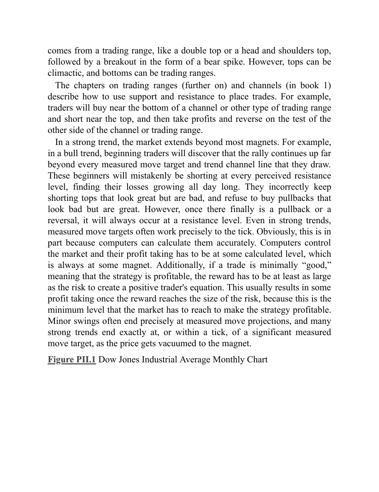
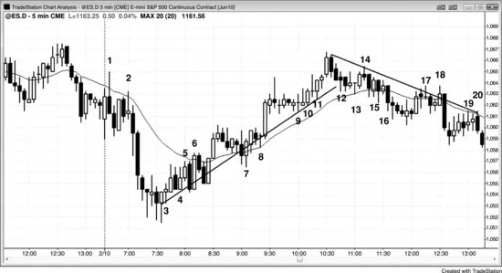

# 第二部分　磁力位：支撑与阻力

<!-- Source PDF pages 180–193 -->
<!-- English: Part II: Magnets: Support and Resistance -->

<!-- PDF page 180 -->

# 第二部分  
# 磁力位：支撑与阻力

磁力位有两种：支撑与阻力。当磁力位在市场下方时，它是支撑位，意味着多头会在此建立仓位、空头会在此对空单获利了结。当磁力位在市场上方时，它是阻力位，意味着多头会在此对多单获利了结、空头会在此开空。支撑与阻力是把市场吸向它们的磁力位。当你意识到距当前价格不远有一个磁力位时，只应朝磁力位方向交易，直到它被到达。到达之后，你必须判断市场看起来像要反转、横盘，还是忽略磁力位继续趋势。磁力位告诉你可能的目的地，但不告诉路径，沿途可能有大回撤。此外，市场可能在震荡区间中运行数十根K线，但仍在磁力位的打击距离内。尽管你应意识到磁力位，在市场决定是否测试磁力位以及如何到达那里时，仍可有双向的可靠交易。

交易者不断关注支撑与阻力。市场有惯性，有强烈倾向继续它一直在做的事。当它在趋势中时，多数反转趋势的尝试会失败。例如，若市场在下跌趋势中，多数支撑位将无法守住或反转市场。然而，所有多头反转都发生在支撑位（所有空头反转都发生在阻力位），因此若市场开始向上反转，潜在回报往往是风险的许多倍。即便成功概率常只有 40%，交易者公式仍为正，反转交易因此在数学上成立。惯性也意味着：当市场处于震荡区间时，多数突破尝试会失败，市场会反复从区间底部的支撑向上反转，并从顶部的阻力向下反转。尽管多数反转趋势的尝试会失败， <!-- PDF page 181 --> 所有趋势反转与所有回撤都始于支撑与阻力位，因此知道它们在哪里可引导交易者在最优位置获利了结并进入反转交易。

多数 Emini 交易由计算机完成，其算法基于逻辑与数字。当它们买入下跌市场或卖出上涨时，是因为它们计算出该特定价格是下单的逻辑位置。若足够多的算法使用相似价格，市场至少可反转一两根K线，且常足以成为盈利交易。尽管有些算法使用并非直接基于 Emini 价格图的数字（例如，可能使用期权市场或其他相关市场的数据），除非许多程序得出相似数字，否则不太可能有足够力量改变市场方向。当市场反转时，它总是在支撑与阻力位这样做；通过练习，个人交易者通常能发现它们。因为其中一些反转导致盈利交易，且这些位是获利了结的合理区域，了解可能的转折点是有用的。

寻找磁力位的重要原因之一是：它们是部分或全部获利了结的逻辑区域。你始终应比对相反方向入场更快地在交易上获利了结。这意味着你需要比获利了结更强的形态才能在相反方向开仓。若朝磁力位的行情弱，且与更大趋势方向相反，你也可寻找相反方向开仓，预期反转。市场通常至少会小幅超调磁力位；若朝磁力位的行情不是强趋势，市场通常至少会反转一两根K线。若趋势恢复并进一步越过磁力位，然后第二次反转，这通常是相反方向交易的可靠形态，尤其在有强反转K线时。

任何显著类型的价格行为都可形成支撑或阻力，常见例子包括：趋势线。  
趋势通道线。  
任意时间框架上任意类型的移动平均线。

<!-- PDF page 182 -->

等幅运动目标。  
先前摆动高点或低点。  
多头入场K线低点与空头入场K线高点。  
多头信号K线高点与空头信号K线低点。  
昨日的高、低、开、收。  
任意K线的高、低、开或收，尤其当该K线是大趋势K线时。  
日线枢轴。  
斐波那契回撤位与投射。  
任意类型的轨道。

支撑与阻力是交易者创造的术语，用来描述某个价格对交易者下盈利单具有足够数学优势。这些术语由交易者创造以帮助他们发现交易。每一时间框架上每一根K线的高点都在某个阻力位，每一根的低点都在支撑，收盘在它所在之处而非高或低 1 tick，是因为计算机出于某个原因把它放在那里。支撑与阻力可能并不明显，但既然计算机控制一切且它们使用逻辑，一切都必须说得通，即便往往难以理解。图上每个价格都有某种数学优势，但优势通常太小而无法交易，除非是高频交易（HFT）程序——其中许多设计为剥头皮一美分利润。

按定义，一个价格只有在有方向概率失衡时才是支撑或阻力。例如，若市场跌至支撑位，交易者相信至少有约 60% 或更高的机会会出现至少足以剥头皮的反弹，而这是每个交易者的最小交易。若机会只有 52% 或 53%，交易者可能不会认为足够高而使用该术语，而只是把该价格看作不显眼。若市场在震荡区间中部，前一根低点在词的一般意义上至少是最小支撑区域，但这并不意味着预期反弹大到足以下盈利单。若预期反弹只有几个 tick，从交易者角度看它不是支撑。若当前K线仍在形成且在其低点、比前一根低点高 1 tick，市场在下跌 2 tick 之前先反弹 2 tick 的机会可能是 53%。然而，那是太小的 <!-- PDF page 183 --> 优势、太小的价格运动，交易者不会下单（尽管高频程序可能做那笔交易），因此交易者不会称之为支撑。阻力则相反。

支撑与阻力存在是因为市场有记忆。一旦市场回到先前价格，它倾向于做上次在那里时做的事。例如，若市场跌破震荡区间底部然后反弹回区间底部，它通常会再次下跌，因为上次在该价格位时就是这样。未能平掉多单、扛过空头腿的交易者会急于获得第二次机会以更小亏损离场，他们会持有直到市场反弹回并测试突破。那时，他们会卖出平多，这就创造卖盘压力。此外，在抛售底部获利了结的空头会急于在反弹时再次做空。空头与平仓多头的联合卖出会对进一步上涨形成阻力，并通常把市场打回向下。

当市场回落到某个价格并多次触及且每次反弹时，它在该价格位找到支撑。若市场反弹到某个价格位并不断回落，该区域是阻力。任何支撑或阻力区域都充当磁力位，把市场吸向该价格。随着市场接近，它进入磁场，越近磁力越强。这增加了市场触及该价格的概率。更大的磁力部分由真空效应产生。例如，若市场在向空头趋势线做空头反弹但尚未触及，卖家常会靠边站、等待测试。若他们相信市场会触及该线，在略低于该线处卖出没有意义，因为他们很快就能在更高处卖出。卖出的缺席创造买盘失衡，因此有真空效应迅速把市场吸上。结果常是多头趋势K线。然后，多头剥头皮者获利卖出平多，空头卖出以开新空。由于低点没有清晰多头反转，多数多头买入是为剥头皮，只预期回撤然后空头趋势恢复。

一旦市场到达目标，交易者认为市场现在更可能下跌到足以下盈利单的程度，他们从天而降、无情地激进做空，把市场 <!-- PDF page 184 --> 打低。在那根强多头趋势K线顶部买入的弱多头对没有跟随感到震惊，但他们误解了多头趋势K线的意义。他们以为交易者突然确信市场会突破趋势线上方且多头腿会开始。他们无视真空效应，没有考虑空头只是在等市场稍高一点。强多头趋势K线是由于空头短暂靠边站，而非空头回补空单。不断买入的多头需要找到空头做对手方，他们只能在更高处找到他们——空头认为市场将开始反转的地方。市场将继续下行到中性区域，并通常越过该点到达多头现在有数学优势的位置。这是因为市场从不知道它已走得够远，直到它走得太远。然后它在中性区域上方上下交易，该区域随着多空更好地定义它而越来越紧。在某一点，双方都认为价值是错的，市场然后再次突破并开始对新价值的新搜索。

每一次逆势尖峰都应被视为真空效应回撤。例如，若 5 分钟图上有急剧空头尖峰，然后市场突然反转成多头腿，则低点处有支撑区域，无论你是否事先看到。多头靠边站直到市场到达他们认为价值可观、且以这个好价格买入的机会将是短暂的水平。他们进来并激进买入。聪明空头意识到该磁力位，并把它用作空单获利了结的机会。结果是 5 分钟图上的市场底部。该底部与所有底部一样，发生在某个更高时间框架支撑位，如多头趋势线、移动平均线，或大多头旗形底部的空头趋势通道线。重要的是记住：若 5 分钟反转很强，你会基于该反转买入，无论你是否在日线或 60 分钟图上看到支撑。此外，即便你看到更高时间框架支撑，你也不会在该低点买入，除非 5 分钟图上有证据表明它在形成底部。这意味着你不需要看许多不同图表去寻找那个 <!-- PDF page 185 --> 支撑位，因为 5 分钟图上的反转告诉你它在那里。若你能跟随多个时间框架，你会在市场到达之前看到支撑与阻力位，这可在市场到达磁力位时提醒你在 5 分钟图上寻找形态。然而，若你只是仔细跟随 5 分钟图，它会告诉你需要知道的一切。

一般而言，若市场四或五次测试支撑区域，突破该支撑的可能性增加，在某一点突破变得比不突破更可能。若在该位托起市场的买家反复未能再次这样做，他们在某一点会放弃并被卖家压倒。例如，若市场在平坦均线上方休整，交易者会在每次触及均线时买入，预期反弹。若市场反而继续横盘，他们甚至得不到足以允许盈利剥头皮的反弹，在某一点他们会卖出平多，从而创造卖盘压力。他们也会停止在触及均线时买入。这种买入的缺席会增加市场跌破均线的概率。多头已决定均线对他们激进买入来说折扣不够，他们只会在进一步折扣时这样做。若它在跌破均线后 10 到 20 根内找不到那些买家，市场通常要么向下趋势，要么继续在震荡区间中，但现在在均线下方。交易者会开始在反弹至均线时做空，这将增加市场开始形成更低高点且均线开始向下趋势的机会。一旦市场跌破支撑，它通常变成阻力；一旦市场突破阻力上方，它通常变成支撑。

这也可发生在趋势线或趋势通道线上。例如，若多头市场四次或更多次回撤至趋势线且没有远高于趋势线的反弹，在某一点多头会停止在趋势线测试处买入，并开始卖出平多，创造卖盘压力。这加上空头的卖出，且由于多头已停止买入，市场会跌破趋势线。然而有时，市场反而会突然向上加速， <!-- PDF page 186 --> 空头会停止在每次小反弹做空，反而会回补空单，把市场推高。

机构交易由裁量交易者与计算机完成，计算机程序交易已变得越来越重要。机构基于基本面或技术信息或其组合进行交易，两类交易都由交易者与计算机完成。一般而言，多数裁量交易者主要基于基本面信息做决定，多数计算机交易基于技术数据。由于现在多数成交量由 HFT 公司交易，且多数交易基于价格行为与其他技术数据，多数程序交易是基于技术的。在二十世纪末，单一机构运行大型程序可移动市场，程序会创造微型通道，交易者视之为程序在运行的信号。现在，多数日子 Emini 中有十几左右的微型通道，许多有超过 100,000 张合约成交。以当前 Emini 约 1200 计，那对应 60 亿美元，大于单一机构为单一小交易会交易的规模。这意味着单一机构无法把市场移动很远或很久，图上所有运动都是由许多机构在同一时间向同一方向交易造成的。此外，HFT 计算机分析每一 tick，并全天不断下单。当它们检测到程序时，许多会顺程序方向剥头皮，且在微型通道（程序）进行时，它们常占多数成交量。

主要基于技术信息交易的机构不能永远单向移动市场，因为在某一点市场会向基于基本面交易的机构呈现价值。若技术机构把价格推得太高，基本面机构与其他技术机构会把市场看作卖出平多与开空的好价格，它们会压倒看多的技术交易并把市场打低。当技术交易创造空头趋势时，在某一点市场在基本面与其他技术机构眼中会明显便宜。买家会进来并压倒造成抛售的技术机构，把市场反转向上。

<!-- PDF page 187 -->

所有时间框架上的趋势反转总是发生在支撑与阻力位，因为技术交易者与程序把它们看作应停止加码并开始获利了结的区域，许多人也会开始在相反方向交易。由于它们都基于数学，产生全部交易量 70% 与机构成交量 80% 的计算机算法知道它们在哪里。此外，机构基本面交易者也关注明显的技术因素。他们把图上的主要支撑与阻力看作价值区域，并在市场到达时在相反方向入场。基于价值交易的程序通常会在相同区域附近找到它，因为按任何衡量，在主要支撑与阻力附近几乎总有显著价值。多数程序基于价格做决定，没有秘密。当有重要价格时，无论用什么逻辑，它们都看到它。基本面交易者（人与机器）等待价值，并在检测到时重仓投入。他们想在认为市场便宜时买入，在认为昂贵时卖出。例如，若市场在下跌，但到达机构觉得它在变便宜的价格位，他们会从天而降并激进买入。这在开盘反转中最戏剧性且经常看到（反转可上可下，在第三册交易开盘的部分讨论）。空头会回补空单以获利，多头会买入以建立新多。没人擅长知道市场何时已走得够远，但多数有经验的交易者与程序通常对其知道何时已走得太远的能力相当有信心。

因为机构在等市场明显超卖再买入，在可能底部上方区域买家缺席，市场能够加速下行到他们确信它便宜的区域。一些机构依赖程序决定何时买入，另一些是裁量的。一旦足够多的他们买入，市场通常会至少向上转两段、约 10 根或更多——在发生这件事的任意时间框架图上。在它下跌时，机构继续一路做空直到他们判断已到达可能目标且不太可能进一步下跌， <!-- PDF page 188 --> 那时他们获利了结。市场越超卖，成交量中基于技术的比例越高，因为基本面交易者与程序在认为市场便宜且应很快被买入时不会继续做空。当市场接近主要支撑位时买家的相对缺席常导致卖出加速进入支撑，通常导致卖盘真空把市场吸到支撑下方的高潮式抛售，此时市场急剧向上反转。多数支撑位不会阻止空头趋势（多数阻力位不会阻止多头趋势），但当市场最终向上反转时，它会在明显的主要支撑位，如长期趋势线。抛售底部与向上反转通常成交量非常大。市场下跌时，沿途有许多反弹至阻力位与抛售至支撑位，每一次反转发生在足够多机构判断它已走得太远并为相反方向交易提供价值时。当足够多机构在同一位附近行动时，发生主要反转。

有基本面与技术方式确定支撑（与阻力）。例如，可用计算估计，如标普 500 市盈率理论上应是多少，但这些计算从不足以精确到让足够多机构同意。然而，传统的支撑与阻力区域更容易看到，因此更可能被许多机构注意到，它们更清晰地定义市场应反转的位置。在 1987 年与 2008–2009 年的崩盘中，市场崩跌至略低于月线趋势线然后向上反转，创造主要底部。市场将继续上行，带有许多向下测试，直到它已走得太远——总是在显著阻力位。只有那时机构才能确信卖出平多与开空有清晰价值。过程然后向下反转。

基本面（买卖中的价值）决定总体方向，但技术面决定实际转折点。市场总是在探测价值，价值是一种极端，总是在支撑与阻力位。报告与新闻在任何时候都可改变基本面（对价值的感知）到足以使市场趋势上下持续数分钟到数日。持续数月的主要反转 <!-- PDF page 189 --> 基于基本面，并在支撑与阻力位开始与结束。这对每个市场与每个时间框架都成立。

重要的是意识到：在市场已从主要顶部开始转下之后，新闻仍会把基本面报告为看多；在它从主要底部转上之后，仍会报告为看空。新闻仍把市场看作多头或空头并不意味着机构如此。交易图表而非新闻。价格是真理，市场总是领先新闻。事实上，新闻在市场顶部总是最看多，在市场底部最看空。记者陷入亢奋或绝望，寻找会解释为何趋势如此强并将持续更久的专家。他们会忽略最聪明的交易者，可能甚至不知道他们是谁。那些交易者对赚钱感兴趣，对新闻不感兴趣，不会主动找记者。当记者打车上班，司机告诉他刚卖光所有股票并抵押房子以便买黄金时，记者兴奋并迫不及待要找一个看多专家上节目来确认他对黄金牛市的深刻洞见。「想想看，市场如此强，连我的出租车司机都在买黄金！因此所有人都会卖掉其他资产再买更多，市场必然再暴涨许多个月！」对我来说，当连最弱的交易者最终也入场时，就没有人再留下可买。市场需要更大的傻瓜愿意在更高处买入，以便你能获利卖出。当没有人留下时，市场只能走一个方向，而那与新闻告诉你的相反。很难抵抗电视上无尽说服力的教授式专家，他们给出博学论证说黄金不可能下跌、事实上明年还会再翻倍。然而，你必须意识到他们在那里是为了自我吹嘘与娱乐。网络需要娱乐来吸引观众与广告费。若你想知道机构真正在做什么，只需看图。机构太大而无法隐藏；若你理解如何读图，你会看到他们在做什么以及市场在去哪里，而这通常与你在电视上看到的任何事无关。

多数主要顶部并非来自巨大K线与成交量的高潮——那在主要底部更常见。更常的是，顶部 <!-- PDF page 190 --> 来自震荡区间，如双顶或头肩顶，随后是空头尖峰形式的突破。然而，顶部可以是高潮性的，底部可以是震荡区间。

关于震荡区间（后文）与通道（第一册）的章节描述如何用支撑与阻力下单。例如，交易者会在通道或其他类型震荡区间底部附近买入，在顶部附近做空，然后在测试通道或震荡区间另一侧时获利了结并反转。

在强趋势中，市场延伸超过多数磁力位。例如，在多头趋势中，初学者会发现反弹远超他们画出的每一个等幅运动目标与趋势通道线。这些初学者会错误地在每一个感知的阻力位做空，发现亏损整天在增长。他们错误地不断在看起来很棒但很差的顶部做空，并拒绝买入看起来很差但很棒的回撤。然而，一旦最终有回撤或反转，它总是发生在阻力位。即便在强趋势中，等幅运动目标也常精确到 tick。显然，这部分是因为计算机能准确计算它们。计算机控制市场，它们的获利了结必须在某个计算水平，而那总是在某个磁力位。此外，若一笔交易最低限度「好」，意味着策略是盈利的，回报必须至少与风险一样大以创造正交易者公式。这通常导致一旦回报达到风险大小就有一些获利了结，因为这是市场必须到达以使策略盈利的最低水平。次要摆动常精确结束于等幅运动投射，许多强趋势精确结束于或在显著等幅运动目标 1 tick 内，因为价格被吸向磁力位。

图 PII.1　道琼斯工业平均指数月线图

<!-- PDF page 191 -->

道琼斯工业平均指数月线图（图 PII.1）显示几种类型的支撑与阻力（都是磁力位）。

趋势线与趋势通道线是重要的支撑与阻力区域。2009 年崩盘的 K线 18 底部从 1987 年崩盘低点到 1990 年 10 月回撤画出的月线趋势线下方反转向上。它也在由 K线 8 与 12 创造的趋势通道线处（创造对决线形态，在后文讨论）。所有从熊市向上的主要反转都发生在支撑，所有顶部都发生在阻力，但多数支撑与阻力不会阻止趋势。然而，若有强反转形态且它形成于支撑或阻力位，机构会获利了结，许多人甚至会在另一方向入场。市场底部更常来自卖盘高潮，如 1987 年与 2009 年的崩盘。市场顶部更常来自震荡区间，如 K线 9 与 15 附近。

K线 15 高点接近基于 K线 12 到 K线 13 多头尖峰高度的等幅运动上行。

移动平均线反复充当支撑，如在 K线 3、4、6、8、14 与 20，以及阻力，如在 K线 11 与 17。

震荡区间充当支撑与阻力。K线 9 震荡区间下方的突破对 K线 11 的反弹是阻力，K线 15 震荡区间对 K线 17 的反弹是阻力。一旦市场反弹至 K线 15，K线 16 在 K线 9 震荡区间顶部找到支撑。

<!-- PDF page 192 -->

摆动高低点充当支撑与阻力。K线 12 在 K线 8 低点找到支撑并形成双底。K线 13 与 K线 11 形成双顶，但市场横盘并很快突破该阻力上方。

图 PII.2　支撑可变成阻力，阻力可变成支撑

在图 PII.2 所示的 5 分钟 Emini 图中，支撑变成阻力，阻力变成支撑。这对移动平均线与趋势线都成立。

K线 1、2、5、6、17、18、19 与 20 在反弹至均线时找到卖家，K线 7、8、13、15 与 16 在小回撤至均线时找到买家。

K线 12、13、15 与 16 是对均线的反复测试，买家没有得到回报，很快停止买入回撤。市场然后跌破均线，空头开始在小反弹至均线时做空，创造一系列更低高低点。

多头趋势线是以尽可能多的K线测试它为目标画出的最佳拟合线。买家显然在趋势线区域买入，它被测试十几次以上而没有远离趋势线的急剧反弹。这种缺乏加速使多头随时间更加谨慎，最终他们变得不愿在 <!-- PDF page 193 --> 趋势线区域买入。一旦市场跌破趋势线，多头变得更加犹豫买入，并开始卖出平多，空头变得更加激进。形成更低高低点，交易者开始画他们在反弹时做空的空头趋势线。

顺便说，任何向上倾斜的通道都应被视为空头旗形，即便它是多头市场的一部分，因为最终会有趋势线下方突破，市场会表现为就交易目的而言通道是空头旗形。同样，任何向下倾斜的通道都应被视为多头旗形，其最终突破应被交易为好像多头腿在进行中。
