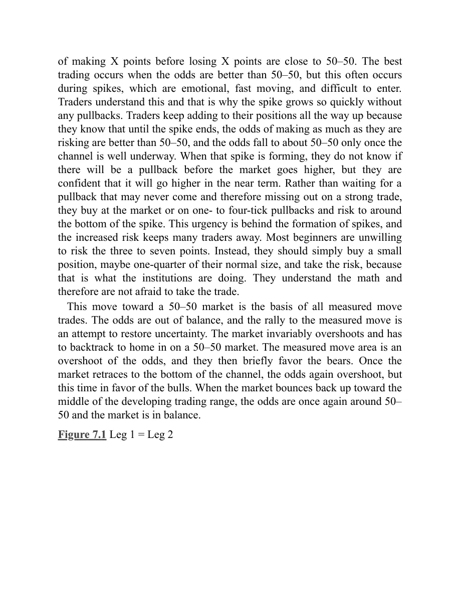
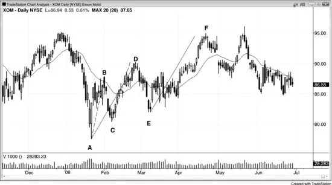
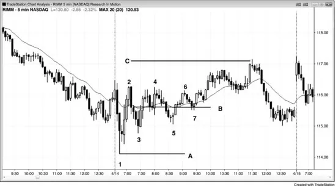
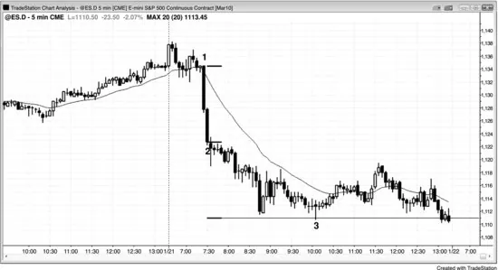

## 第7章　基于第一段（尖峰）大小的等幅运动

<!-- Source PDF pages 194–206 -->
<!-- English: Chapter 7: Measured Moves Based on the Size of the First Leg (the Spike) -->

<!-- PDF page 194 -->

# 第7章  
# 基于第一段（尖峰）大小的等幅运动

等幅运动是与先前同方向摆动大小相等的摆动。你根据第一次走了多远来估计第二次市场会走多远。等幅运动为何有效？若你在寻找等幅运动，则你相信你知道始终持仓方向，意味着你至少 60% 确定该行情会发生。等幅运动通常基于尖峰或震荡区间的高度，初始保护性止损通常在第一段起点之外。例如，若有强买入尖峰，则初始保护性止损在尖峰低点下方 1 tick。若尖峰巨大，交易者很少会冒那么大风险，通常仍有盈利交易，但理论止损仍在尖峰下方。此外，概率常超过 60%。若尖峰约四点高，则风险约四点。由于你相信等幅运动会发生且在尖峰顶部买入的策略是合理的，你在 60% 的赌注上冒四点风险。数学规定：你的信念（当概率是 60% 时策略会盈利）只有在回报至少与风险一样大时才为真。这在第25章关于交易数学中讨论。这意味着策略要有效，你需要 60% 机会至少赚四点，即等幅运动目标。换言之，策略唯一有效的方式是等幅运动目标约 60% 的时间被触及。由于交易趋势是最可靠的交易形式，若有任何有效的策略，这必须是其中之一。这是等幅运动有效的原因吗？没人确切知道，但它是合理的解释，也是我能想到的最好的。

<!-- PDF page 195 -->

多数等幅运动基于尖峰或震荡区间。当基于尖峰时，通常导致震荡区间；当基于震荡区间时，通常导致尖峰。例如，若有双顶——一种震荡区间——交易者常在向上或向下突破到达等幅运动时部分获利了结。交易者寻找突破（尖峰），并通常预期一旦尖峰到达等幅运动区域就有一些获利了结。若突破带强尖峰且在等幅运动目标没有显著停顿，尖峰本身常导致基于尖峰高度的等幅运动。一旦市场到达那里，交易者常开始获利了结，结果通常是震荡区间。

一旦有强行情后的回撤，通常有同方向的第二段，且它常大约与第一段大小相同。这一概念是几种投射第二段终点可能目标的可靠技术的基础。该等幅运动区域是在你的趋势仓位上获利了结的合理位置，然后你可等待另一回撤重建仓位。若有强反转形态，你也可考虑逆势交易。

当市场有急剧行情然后回撤时，它可能有第二段，第二段常大约与第一段大小相同。这是 leg 1 = leg 2 行情，但也称 ABC 行情或 AB = CD。这种字母术语令人困惑，更简单只把两段称为第一段与第二段，第一段后的回撤只称为回撤。字母标注的困惑在于：在 AB = CD 形态中，B、C 与 D 对应 ABC 行情的 A、B 与 C。ABC 的 B 段是回撤，它在 Market Profile（CME 集团的价格与时间信息图）上创造厚区域。任何厚区域的中点常导致等幅运动，此处目标与基于 AB = CD 的相同。例如，对多头趋势中的 AB = CD，若你从 A 点开始并加上 AB 段长度（即 B – A），然后加到 C，你得到 C + (B – A)。对厚区域，你从 A 开始然后加上 AB 段长度（即 B – A），然后回落到厚区域一半（因此减去 BC 段一半），然后加上 B 减去 BC 厚区域一半的高度，得到从 BC 中点起的等幅运动上行。

<!-- PDF page 196 -->

两个方程都等于 C + (B – A)，因此给出相同的等幅运动投射。这太复杂了，且重要性次要，因为你不应仅基于斐波那契延伸或等幅运动或任何其他磁力位用限价单 fade 行情。它们只提供指引，让你在它们接近前顺势交易，那时你也可考虑逆势形态。

除了设置等幅运动的清晰回撤入场外，有时有更微妙但同样有效的情况。当市场有强趋势行情然后相当强的回撤腿，然后震荡区间时，交易者可用区间大致中点投射回撤第二段可能到达的位置。随着震荡区间展开，不断调整你估计中点所在的线，那通常会在行情最终完成第二段后在回撤中点附近。这只是作为指引，你应在何处预期两段回撤结束、市场设置趋势恢复交易。你也可简单用 leg 1 = leg 2 测量。例如，在两段多头旗形中，取第一段下行的长度，从回撤顶部减去该高度，找到回撤第二段下行可能结束的合理位置。

尖峰与通道趋势中有变体，通道高度常约与尖峰高度相同。当尖峰强时尤其如此，如有异常大趋势K线或几根强趋势K线、重叠少且影线小。当有强尖峰时，市场常在任一方向做等幅运动，但通常在顺势方向，基于尖峰第一与最后K线的开、收、高或低的某种组合。例如，若有巨大多头尖峰，取从尖峰第一根开盘到尖峰最后一根收盘的点数，加到该最后一根收盘。随后的通道通常会在该区域找到一些阻力，市场然后常向下调整到通道底部。该等幅运动目标是你对多单获利了结的区域。有时市场可能从尖峰第一根低点到尖峰最后一根收盘或高点做等幅运动，或

<!-- PDF page 197 -->

从第一根开盘到最后一根高点，因此审慎的是看所有可能性。较少见的是，市场不会形成多少上行通道，而会反转到尖峰底部下方，然后做等幅运动下行。

重要的是记住多数时候市场处于某种震荡区间，因此等距行情的方向概率是 50%。这意味着市场向上走 X 点与向下走相同点数一样可能。当有趋势时，概率在趋势方向更好。当有强尖峰时，跟随的概率可能是 60%，有时若整体图表形态与强趋势行情一致甚至 70%。此外，当市场在震荡区间底部时，概率偏向向上；当在区间顶部时，概率偏向向下。这是因为市场惯性，意味着市场倾向于继续它一直在做的事。若它在趋势中，概率偏向更多趋势；若它在震荡区间中，概率偏向突破尝试会失败。事实上，约 80% 的趋势反转尝试失败，这就是为什么你应等待它们演化成回撤然后顺势方向入场。此外，80% 的突破震荡区间尝试失败，在数学上远更有意义的是 fade 震荡区间的顶底，而不是在顶部附近买入大多头趋势K线、在底部附近做空大空头趋势K线。

以下是使用几个假设的等幅运动例子。有三根多头趋势K线组成的强多头尖峰突破震荡区间。下一根是小十字星，该停顿意味着尖峰在前一根结束，那是连续多头趋势K线的最后一根。突破强是因为K线之间重叠很少，每根开盘在或高于前一根收盘。任何K线上最大影线只有两 tick，几根底部没有影线。第一根高三点半（14 tick），第二根高 10 tick，第三根高八 tick，第四根有一 tick 多头实体但底部三 tick 影线、顶部两 tick 影线。该十字星是第一根缺乏

<!-- PDF page 198 -->

动能的K线，因此告诉你尖峰在前一根结束。第一根开盘在尖峰中第三也是最后一根多头趋势K线收盘下方八点，因此尖峰应被视为至少八点高。你可用第一根低点到第三根高点甚至第四根十字星高点，但对初始投射用较小数字更保守。若第二段超过该目标，再看其他目标。

随着该尖峰形成，若你在任何点买入，你交易上的止损可能必须在尖峰底部下方。为论证起见，假设你会冒到尖峰第一根开盘下方 1 tick 的风险。若你在尖峰三点高时在最高 tick 市价买入，则你会冒约三点风险以至少赚三点。那时，你相信市场会有等于尖峰高度的等幅运动上行，尖峰三点高。你知道止损在哪里，你还不知道尖峰顶部会在哪里，但你知道它至少会与你买入处一样高。由于你相信市场在趋势中，你觉得概率好于 50–50 市场会先上三点再下跌打到下方三点的止损。

尖峰继续长到七点后，你改变评估。你现在相信由于市场仍在趋势中，概率至少 50–50 市场会再上七点再跌七点。此刻，你已有四点浮动利润，在冒三点风险时期望赚三点。若你想，你可在仍在形成的尖峰最高 tick 再买入更多，然后你的风险会是七点（可能多几个 tick，因为你可能想冒到尖峰第一根底部下方 1 tick），你的止盈目标会再高七点。然而，在你的初始多单上，你仍冒三点风险但现在有好于 50% 机会总共赚 11 点（从入场到尖峰当前顶部的四点，然后再七点）。

一旦第四根形成——十字星——你然后知道上行尖峰在前一根收盘结束，在尖峰第一根开盘上方八点。那时，你会得出结论：

<!-- PDF page 199 -->

市场有超过 50% 机会先再上八点到尖峰收盘上方，再下跌八点到尖峰开盘或底部下方（下行可能多一两个 tick，因为最安全止损在尖峰起点之外）。由于尖峰如此强，概率可能超过 60%。

尖峰一结束，双边交易开始，那时不确定性增加。市场横盘到向下调整，然后上行通道开始。尽管市场可能从该回撤底部做 leg 1 = leg 2 上行——尖峰是第一段、通道是第二段——当尖峰非常强时，更可靠的目标是基于尖峰第一根开盘到尖峰最后一根收盘。随着市场反弹，更高价格的概率慢慢侵蚀。当多头通道到达等幅运动目标约一半距离时，等距行情的方向概率回落到约 50% 到 55%，不确定性再次非常高。记住，多头通道通常后跟回撤到通道底部然后至少反弹，因此多头通道实际上是尚未形成的震荡区间的第一段。一旦市场到达等幅运动目标区域，它可能是该萌芽区间的高端，概率偏向下行。这对所有震荡区间都成立。这是对多单获利了结的出色区域，因为这么多交易者在等幅运动区域获利了结，市场开始回撤。多数交易者不会再激进寻找买入，直到市场回撤到通道底部附近，那里通常形成双底。该区域也是磁力位。多头开始再次买入，在通道顶部做空的空头会获利了结。由于市场现在在发展中震荡区间底部附近，方向概率略偏向多头。

一旦市场进入震荡区间，每当市场在该区间中部附近时，等距行情的方向概率再次是 50–50。若你的风险是 X 点，你有 50% 机会在止损被打前赚 X 点，50% 机会在止盈目标到达前亏 X 点。这是市场相对有效的副产品。多数时候，它们是有效的，赚 X 点再亏 X 点的概率接近 50–50。最佳

<!-- PDF page 200 -->

交易发生在概率好于 50–50 时，但这常发生在尖峰期间，而尖峰是情绪性的、快速移动的、难以入场的。交易者理解这一点，这就是为什么尖峰增长如此快而没有任何回撤。交易者一路加仓，因为他们知道直到尖峰结束，赚与风险一样多的概率好于 50–50，概率只有在通道充分进行后才降到约 50–50。当尖峰形成时，他们不知道在市场走高前是否会有回撤，但他们确信短期内会走高。与其等待可能永远不来的回撤从而错过强交易，他们市价买入或在一到四 tick 回撤上买入，并冒到尖峰底部附近的风险。这种紧迫感在尖峰形成背后，增加的风险让许多交易者远离。多数初学者不愿冒三到七点风险。相反，他们应简单买入小仓位，可能正常规模的四分之一，并承担风险，因为那是机构在做的。他们理解数学，因此不怕做该交易。

这种朝 50–50 市场的运动是所有等幅运动交易的基础。概率失衡，到等幅运动的反弹是恢复不确定性的尝试。市场总是超调并必须回调以瞄准 50–50 市场。等幅运动区域是概率的超调，它们然后短暂偏向空头。一旦市场回撤到通道底部，概率再次超调，但这次偏向多头。当市场反弹回发展中震荡区间中部时，概率再次约 50–50，市场处于平衡。

## 图 7.1　第一段 = 第二段

<!-- PDF page 201 -->

埃克森美孚（XOM）在图 7.1 所示日线图上从 K线 A 到 K线 B 有强第一段上行，因此交易者买入 K线 C 更高低点，寻找可能的 leg 1 = leg 2 反弹。K线 D 略未达目标（虚线顶部）。一旦在目标区域，许多交易者看到他们以为可能是到 K线 A 抛售后的两段空头反弹。若你用 ABC 标注，K线 B 是 A 点，K线 C 是 B 点，K线 D 是 C 点，由于这种混淆，更好简单把到 K线 B 的上行称为第一段，到 C 的抛售称为回撤，到 D 的反弹称为第二段。

一旦 K线 E 有更高低点且反弹突破 K线 D 上方，交易者可把 AD 看作包含两个更小段（AB 与 CD）的第一段，然后持多直到有等幅运动上行（AD = EF，目标是实线顶部）。

斐波那契交易者也寻找其他延伸（138%、150%、162% 等）作为寻找反转的有效区域，但这太复杂且近似。一旦市场有清晰双边行为，只要有强信号，买入低点卖出高点同样可靠。

## 图 7.2　第一段 = 第二段的变体

<!-- PDF page 202 -->

有时 leg 1 = leg 2 等幅运动的第一段不是初始抛售的绝对低点。从第一段下行的调整上行通常是两段行情或楔形空头旗形，但任一种的回撤常跌破调整段起点下方，如图 7.2 在 K线 6 处。到 K线 9 形成看起来像第一段下行回撤终点时，敏锐交易者对调整上行到 K线 9 始于 K线 4 而非 K线 6 的可能性持开放态度，因此认为第二段下行可能等于 K线 1 到 K线 4 第一段下行，而非 K线 1 到 K线 6 第一段下行。K线 12 底部是基于 K线 4 第一段终点的完美到 tick 的 leg 1 = leg 2 等幅运动。若市场反而继续下行，交易者会观察一旦它跌到基于 K线 6 结束的第一段的 leg 1 = leg 2 区域会发生什么。

为何考虑第一段在 K线 4 结束的可能性是有道理的？交易者在寻找第二段下行开始前的两段回撤上行，从 K线 6 到 K线 9 的行情在通道中，因此可能只是一段。艾略特波浪交易者知道上行调整可包括跌破初始下行底部下方的回撤，他们称这种横盘类型调整为 flat。此处 flat 会是到 K线 5 的上行、到 K线 6 的下行，与到 K线 9 的上行。此外，到 K线 5 的行情是合理强多头尖峰，因此是可能的调整起点。从该上行尖峰到 K线 6 的回撤是更低低点回撤，更低低点回撤很常见。因此，随着调整展开，交易者对这种解读并不困扰。

<!-- PDF page 203 -->

K线 5 与 8 形成潜在双顶空头旗形，但到 K线 9 的突破消除了该可能性。然而，每当有双顶上方突破时，交易者观察它是否失败。若如此，这实际上是楔形顶。三次上推是 K线 5 与 K线 8 双顶后跟到 K线 9 的失败突破。

一旦市场在失败突破后尖峰下行至 K线 10，交易者相信从 K线 1 高点起的第二段下行已开始。

该图上还有一些其他显著特征。K线 12 是扩展三角形底部，K线 4、6 与 12 是三次下推。

第一天开盘有急剧反弹至 K线 3，然后急剧抛售至 K线 6，延伸到开盘下方约与 K线 3 在开盘上方一样远。即便波幅小，它约是最近几天的平均（十二月底常有小波幅日）。每当一日有平均波幅且开盘在波幅中部时，市场常试图在开盘附近收盘。交易者知道这一点，这就是为什么 K线 7 后的窄幅震荡区间有很大机会有测试当日开盘的突破。该日收盘在开盘上方 1 tick，在日线图上形成几乎完美的十字星蜡烛。

到 K线 9 的反弹是对 K线 3 下方抛售的突破回测。到 K线 23 的抛售是对 K线 13 上方反弹的突破回测，差 1 tick 未打到保本止损。它也是对当日开盘的精确测试。

## 图 7.3　基于震荡区间中点的等幅运动

<!-- PDF page 204 -->

在图 7.3 中，Research in Motion（RIMM）在从昨日低点下方开盘反转后有到 K线 2 的急剧上行，然后回撤至 K线 3。由于强三根多头尖峰后第二段上行可能，若交易者有兴趣知道它可能在哪里结束，他们可不断调整 B 线到发展中区间的中点。一旦市场突破，他们可做平行线并从 A 线等距向上拖动做等幅运动，在那里他们可预期获利了结。即便市场在震荡区间中，对向上突破有轻微偏向，因为震荡区间前的行情向上，且震荡区间中多数K线是多头趋势K线，代表买盘压力。

直到市场通过走到 K线 6 上方突破三角形，交易者可双向交易，正如在任何震荡区间中。由于震荡区间是多空都同意有价值的区域，多数离开中点的试探会失败，市场会被吸回区间。最终，市场会脱离磁场，在不同价格找到价值。

## 图 7.4　基于空头尖峰的等幅运动

<!-- PDF page 205 -->

当有创造尖峰的新闻发布时，尖峰常导致等幅运动，交易者可在那里寻找获利了结。在图 7.4 中，在 K线 1 市场对总统提出新银行监管的公告感到意外，这导致两根大空头趋势K线。一旦有停顿K线如十字星、底部有大影线的K线，或有多头实体的K线，你就知道尖峰在前一根结束。此处，尖峰持续两根，交易者寻找从尖峰最后一根收盘的等幅运动下行。他们预期它约与从尖峰第一根开盘到尖峰最后一根收盘的 tick 数相同。有时第一根高点到尖峰最后一根低点成为等幅运动高度，但交易者总是先看最近可能性，只有第一目标未能遏制市场时才寻找更大行情。该目标是在波段空单上最终获利并寻找回撤再做空的好地方。若在该测试区域有强反转信号，可考虑逆势交易。

## 图 7.5　尖峰可导致向上或向下的等幅运动

<!-- PDF page 206 -->

尖峰后可在任一方向有等幅运动。在图 7.5 中，开盘有强六根反弹，但市场在这个大跳空低开日在均线失败，最终到达下方的等幅运动。该行情基于尖峰第一根开盘到尖峰最后一根收盘。尽管多数尖峰在有任何停顿K线时就结束，若行情在停顿后继续上行，你应考虑它会像尖峰一样运作的可能性，在更高时间框架图上它可能就是。
