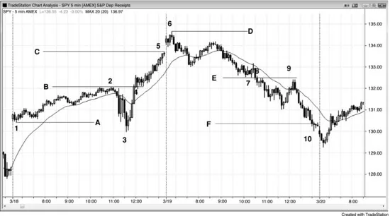
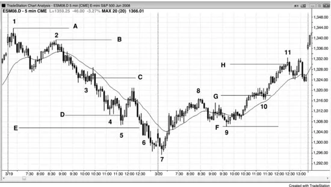
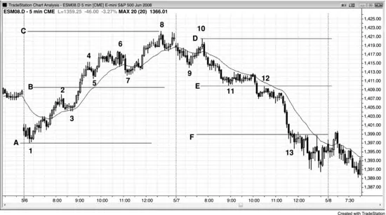

## 第8章　基于缺口与震荡区间的等幅运动

<!-- Source PDF pages 207–214 -->
<!-- English: Chapter 8: Measured Moves Based on Gaps and Trading Ranges -->

<!-- PDF page 207 -->

# 第8章  
# 基于缺口与震荡区间的等幅运动

缺口在日线图上常见：一根K线的低点在前一根高点上方，或一根K线的高点在前一根低点下方。若对市场方向有信念，缺口中点常成为趋势中点。当市场接近等幅运动目标时，交易者会仔细看精确目标，并常在该区域部分或全部获利了结，一些交易者会开始在相反方向建立仓位。这常导致停顿、回撤甚至反转。

当日线图上发生突破时，这类缺口很少出现。然而，常有同样可靠的东西：突破点与第一次停顿或回撤之间的缺口。例如，若市场突破摆动高点上方，突破K线是相对大多头趋势K线，且下一根的低点在突破点上方，则该低点与突破点之间有缺口，那常成为度量缺口。若突破后那根也是大多头趋势K线，则等待第一根小多头趋势K线、空头趋势K线或十字星。其低点然后是缺口顶部。若突破点或突破回撤不清晰，市场常只使用突破K线的中点作为缺口中点。在这种情况下，等幅运动基于反弹起点到突破K线中点。然后预期市场从该位上方大约等 tick 数反弹。

若市场在突破后几根内回撤且回撤低点在缺口内，则缺口现在更小，但其中点仍可用于找等幅运动目标。若市场进一步回撤，甚至略低于缺口，突破点与 <!-- PDF page 208 --> 该回撤之间的中点仍可用于投射。由于突破回撤与突破点之间的差然后是负数，我称之为负缺口。基于负缺口的等幅运动投射较不可靠。

在 Market Profile 上，这些日内度量缺口——市场快速移动之处——是两个分布之间的薄区域，代表市场单边的价格。分布是「厚」区域，只是双边交易发生的震荡区间。震荡区间是对价格的一致区域，其中点是多空认为公平的中点。缺口也是一致区域。它是多空同意不应交易发生的区域，其中点是该区域的中点。在两种情况下，简单地说，若那些价格是多空一致的中点，则它们是包含它们的那一段的中点的粗略指引。一旦它们形成，波段持有你部分或全部的顺势入场。当目标接近时，若有好形态可考虑逆势入场。多数交易者用先前震荡区间的高度来测量，这很好，因为无论你怎么做精确距离都只是近似（除非你是斐波那契或艾略特波浪交易者并有非凡能力说服自己市场几乎总是创造完美形态，尽管有压倒性相反证据）。关键是只顺势交易，但一旦市场在等幅运动区域，你可开始寻找逆势入场。然而，最佳逆势交易只跟随早前足够强以突破趋势线的逆势行情。

若等幅运动到达后市场停顿，两段强趋势腿可能只是更高时间框架调整的结束；若看起来是那样，则波段持有任何逆势入场的一部分。两段常完成一段行情，随后通常至少有一段至少两腿的延长逆势行情，有时变成新的相反趋势。逆势行情常一路测试回突破点。

有时投射精确到 tick，但多数时候市场未达或超调目标。这种方法只是保持你在市场正确一侧交易的指引。

<!-- PDF page 209 -->

## 图 8.1　度量缺口

缺口中点常导致等幅运动。在图 8.1 中，Emini 在 K线 3 跳空高开，在前一日 K线 2 高点上方，该缺口中点是上行行情可能的中点。交易者从 K线 1 反弹底部量到缺口中点，然后向上投射相同点数。K线 4 到达投射几个 tick 内，但许多交易者相信除非市场到达 1 tick 内，Emini 中的目标未被充分测试。这给交易者信心在次日开盘急剧抛售至 K线 5 时买入。当日高点比等幅运动投射高两个 tick。市场在次日抛售至 K线 7，但再次反弹测试目标略下方。再下一日，多头放弃，有大跳空低开然后抛售。当然有新闻公告被电视专家用来解释所有这些行情，但现实是行情基于数学。新闻只是市场做它本就要做的事的借口。

## 图 8.2　度量缺口

<!-- PDF page 210 -->

图 8.2 显示两天基于薄区域的等幅运动。薄区域是K线重叠很少的突破区域。市场在太平洋时间上午 11:15 美联储公开市场委员会（FOMC）报告时从 K线 3 急剧上冲，突破当日 K线 2 高点上方。K线 4 的旗形以两段横盘调整测试突破，K线 2 顶部与 K线 4 突破回测底部之间有小负缺口。若你从 K线 4 回撤低点减去 K线 2 突破点高点，你得到缺口高度的负数。尽管负缺口中点有时产生完美等幅运动，更常见的是等幅运动终点等于突破点顶部（此处为 K线 2 高点）减去初始震荡区间底部（此处为 K线 1 低点）。你也可用 K线 3 低点计算等幅运动，但总是最好先看最近目标，只有市场穿越较低目标时才考虑更远目标。

市场在当日最后一根精确到达从 A 线（K线 1）到 B 线等幅运动的 C 线目标，并在次日开盘戳破使用 K线 3 到 B 线投射的 D 线目标上方。即便 K线 1 高于 K线 3，它仍可被视为等幅运动底部，把抛售至 K线 3 看作只是对 K线 1 实际低点的超调。

<!-- PDF page 211 -->

第二天，K线 7 下方与 K线 8 上方有缺口，F 线目标在收盘前被超过。

顺便说，K线 8 与 9 也有双顶空头旗形。

## 图 8.3　在等幅运动目标获利了结

苹果（AAPL）在图 8.3 所示月线图上处于强多头趋势。每当有趋势时，交易者寻找逻辑水平部分或全部获利了结。他们通常转向等幅运动。K线 13 刚好在基于从 K线 4 到 K线 5 强反弹的等幅运动上方。

K线 10 是多头趋势K线，突破 K线 5 上方尝试突破后的 K线 9 回撤上方。每一根趋势K线都是突破K线与缺口K线，此处 K线 10 充当突破缺口与度量缺口。尽管 K线 11 尖峰刺破 K线 10 下方，该下行作为失败突破K线不太可能有多少跟随，因为信号K线是第三根连续强多头趋势K线。动能太强，不是可靠做空。市场在 K线 12 再次测试 K线 9 上方缺口，该回撤给交易者潜在度量缺口。市场在 K线 13 转下，约低于基于从 K线 8 低点到该缺口中点上行的目标 3%。它可能在形成两K线反转，可导致更深、可有几段且持续 10 根或更多的调整。由于 K线 13 是第六根连续多头趋势K线，上行动能 <!-- PDF page 212 --> 仍强。当这么多力量出现在延长多头趋势之后时，它有时代表趋势的高潮性衰竭，随后是大调整。这是对多单部分或全部获利了结的合理区域，但尚不是基于该月线图开空的足够强形态。然而，由于尚未有清晰顶部，市场可能再推升至基于 K线 10 缺口的等幅运动目标。

尽管现在判断还早，交易者可能用 K线 8 低点到 K线 9 高点创造等幅运动目标。尽管未显示，该目标略低于基于 K线 4 到 K线 9 多头尖峰的目标，而市场已超过后者。交易者需要看更多K线才知道高点是否已形成，或是否会到达基于 K线 10 缺口的目标。若到达，它可能找到或找不到获利了结者与空头，但既然它是清晰的等幅运动磁力位，它是两者都可能在场的逻辑区域。

## 图 8.4　等幅运动

如图 8.4 所示，下行至 K线 3 附近突破回撤空头旗形很陡，合理的等幅运动下行目标是从该段顶部（K线 2）到旗形大致中点（C 线）。这投射到 D 线，被超调并导致均线测试。你也可用 K线 1 高点测量，但一般应看当前这段的起点作为你的第一 <!-- PDF page 213 --> 目标。D 线目标到达后，基于 K线 1 起点的 E 线目标很快被触及。注意从 K线 2 到 K线 4 的下行是没有显著趋势线突破的强空头趋势，因此最好坚持顺势形态。

K线 4 附近的小楔形空头旗形大体水平，因此是可能的最后空头旗形，但由于尚未有急剧反弹（如均线上方缺口K线），逆势交易必须是剥头皮（若你做的话）。你应只在你足够好、能在顺势交易一出现就切换到顺势交易时做它们。若不是，你不应逆势交易，而应努力做顺势入场。仅仅在等幅运动区域不足以成为逆势入场的理由。你需要一些更早的逆势强度。

第二天，在 K线 8 上方突破后，K线 10 附近有旗形。双底多头旗形上方的这次突破向上投射到 H 线。第一个底是从 K线 7 起尖峰中的单根回撤。若你改用当日 K线 7 低点，目标会在次日跳空高开后不久到达。

一旦有突破旗形，明智的是波段持有你部分顺势交易直到等幅运动到达。那时，若有好形态可考虑逆势交易。

## 图 8.5　度量缺口

<!-- PDF page 214 -->

如图 8.5 所示，B 线是突破（K线 2 高点）与第一次回撤低点（K线 5 低点）之间薄区域的中点。等幅运动在 K线 8 精确到 tick 被触及。

E 线是薄区域中点，市场大幅超调其 F 线投射。从 K线 12 空头旗形的突破有巨大薄区域下行至 K线 13，但当日太晚，其中点的等幅运动不太可能到达。然而，那时当日显然是空头趋势日，交易者应只做空，除非有清晰且强的多头剥头皮（最后一小时有几个）。五根尖峰下行至 K线 13 导致等幅运动下行，当日低点差 1 tick 未达。

顺便说，到 K线 7 的行情突破趋势线，表明空头在变强，到 K线 9 的行情突破主要趋势线，设置 K线 10 对趋势极端（K线 8）的更低高点测试，以及随后的空头趋势。
