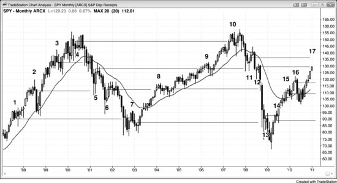

## 第 9 章：反转常止于先前失败反转的信号K线处

<!-- Source PDF pages 215–218 -->

<!-- PDF page 215 -->

第 9 章
反转常止于先前失败反转的
信号K线处
早期失败反转的入场价，常常是后来成功反转的磁铁。例如，若存在空头趋势，并在市场持续下跌过程中有过多次失败的多头入场，一旦向上反转最终成功，这些入场价以及每一根信号K线的高点都会成为目标。市场往往会一直反弹到最高那根信号K线的高点，才会出现显著回撤。很可能一些在那些更高信号处入场的交易者在市场逆向时分批加仓，然后把最初入场点作为最终止盈目标——在最差那笔上保本出场，并在所有更低入场上获利了结。也可能只是聪明的交易者相信情况如此，于是在那些目标位抛售多头；也可能这只是所有优秀交易者都知道的众多「秘密握手」之一，他们在那里出场，只因为知道回撤常在接近更早入场点附近结束，这是可靠且反复出现的形态。对交易者而言，它也可能是一种「谢谢上帝，我再也不这么做了！」的价位。他们没有在亏损交易上出场，亏损不断放大，却一直希望市场回到入场价。当它终于回到时，他们出场并发誓再也不犯同样的错误。
交易中几乎每件事情都有数学基础，尤其是因为成交量中有很大一部分来自基于统计分析的软件算法。在上述空头趋势向上反转的例子中，最早的买入信号常常出现在空头通道的起点。当空头通道开始时，等距运动的方向概率至少为 60%。这意味着市场大约有 60% 的机会先下跌 10 tick 再上涨 10 tick。可以是任何基于近期 <!-- PDF page 216 --> 摆动、在合理可达范围内的幅度，但关键点是市场带有下行偏倚。随着市场下跌、动能放缓，方向概率在下行大约过半时降到 50% 左右，但这个中性区域的价格通常要等到市场形成震荡区间之后才可知。当它继续跌向某个重要磁铁时，方向概率会越过中性，实际上转向有利于多头。在震荡区间中部存在不确定性；但一旦市场触及底部，大家就会认同市场走得太远。此时方向概率有利于多头。它随后会反弹并开始形成震荡区间。方向概率在震荡区间底部总是有利于多头，而那个底部会落在某个关键技术价位。市场下跌时有许多可选支撑，其中大多数不会形成清晰的买入形态。有些公司会基于一个或多个技术支撑位编写程序，另一些公司则使用别的。当足够多的关键技术区域彼此靠近出现时，就会有足够成交量押注反转，从而改变方向。此时数学站在你一边，因为你是在将要成为震荡区间底部的位置买入。反转点事先永远无法确定，但它会以某种反转形态出现；当市场处于关键技术位时——如等幅运动目标、趋势线，甚至更高时间框架的移动平均线与趋势线——重要的是留意这些形态。第三册关于反转的章节会进一步讨论。通常不必为了寻找形态而查看大量图表，只要你有耐心、保持警觉并了解这些形态，每张图上都会有合理的形态。
一旦市场转而向上，它通常会尝试形成震荡区间，而这个初生震荡区间顶部的第一批可能位置，就是那些更早的多头入场价。市场会尝试反弹到那些多头信号K线的顶部。在上行过程中，方向概率回落到 50%，并在接近区间顶部时继续下降。由于顶部事先永远未知，方向概率中性的震荡区间中部也事先未知，市场会过度延伸，直到触及某个交易者认为明显过头的技术位。这常常就在那些更早买入信号的价位。记住，价格上次在那里时方向概率有利于空头； <!-- PDF page 217 --> 当它再次到达时，通常再次有利于空头；这就是市场通常会再次在那里转而下行的原因。那是卖方取得控制的价格。反弹常与那些更早入场K线之一形成双顶，然后至少短暂转下，而震荡区间在演化。市场会上下来回，寻找不确定性，也就是 50% 的中性方向概率。在某个时点，市场会认定这一区域对多头与空头都不再代表价值，对某一方是坏价格。市场随后会再次趋势运行，直到找到一个多头与空头都认为是好入场价的价位。
图 9.1 更早的入场点是回撤的目标

SPY（一种与 Emini 可比的交易所交易基金）的月线图上，强多头趋势在 2000 年结束，但在市场继续上行时，有过数次试图反转为空头趋势的尝试（见图 9.1）。每一根空头信号K线的低点（K线 1、2 与 3）都是下行途中任何修正的目标。
同样，2003 年结束的空头趋势沿途有过数次失败的多头反转尝试（K线 4、5 与 6），每一根多头信号K线的高点都是随后任何反弹的目标。
此外，2003 年起的反弹有过数次失败的空头尝试（K线 7、8、9 <!-- PDF page 218 --> 与 10），每一个都是 2009 年初结束的那轮空头趋势中的目标。那次下跌有过数次筑底尝试，那些买入信号K线（K线 11、12 与 13）的高点，是当前反弹的目标。
最后，上行至 K线 17 的反弹有过数次见顶尝试（K线 14、15 与 16），那些卖出信号K线各自的底部，都是任何下跌中的磁铁。
这些目标中没有一个是必须到达的，但每一个都是强磁铁，经常把市场拉回其价位。
