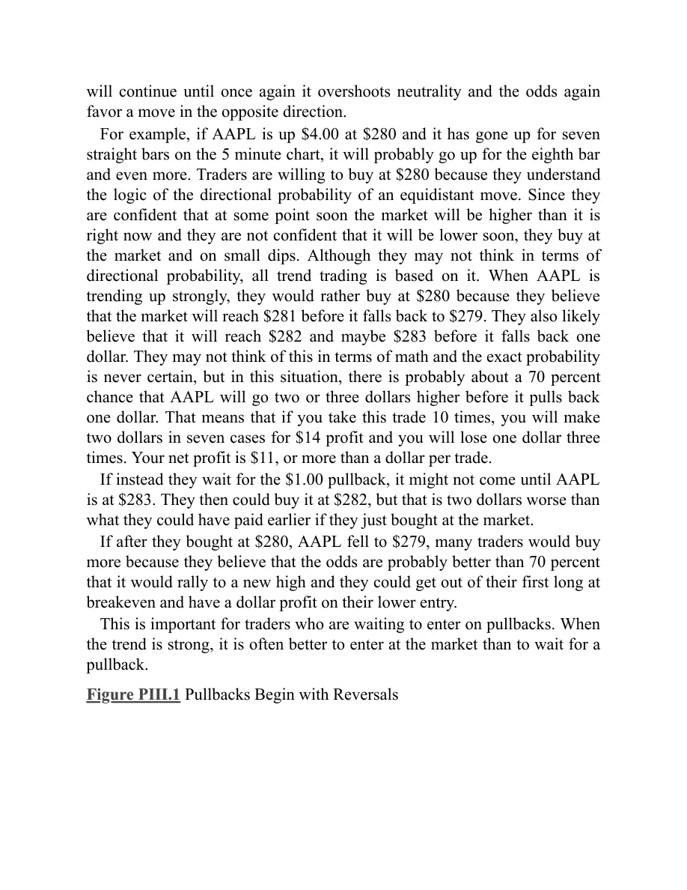
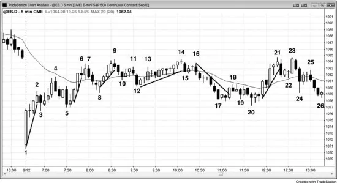

### 第三部分　回撤：趋势转为震荡区间

<!-- Source PDF pages 222–246 -->
<!-- English title: Part III: Pullbacks: Trends Converting to Trading Ranges -->

<!-- PDF page 222 -->

# 第三部分
# 回撤：趋势转为震荡区间

即便图表处于强趋势中，也会出现双边交易阶段；但只要交易者相信趋势会恢复，这些就只是回撤。这些震荡区间足够小，交易者会把它们看作趋势中的短暂停顿，而不是图表的主导特征。你所看图上的所有回撤都是小型震荡区间；而所有震荡区间在更高时间框架图上都是回撤。然而，在你面前的这张图上，震荡区间的大多数突破尝试会失败，而回撤的大多数突破尝试会成功。在更高时间框架图上，该震荡区间就是一个简单的回撤；若你在那张图上交易，可以像对待任何其他回撤一样交易它。由于更高时间框架图上的K线更大，风险也更大，你必须减小仓位。多数交易者更喜欢只用单一时间框架交易，而不是在不同时间框架之间来回切换、采用不同仓位大小、不同止损与不同止盈目标。

若市场处于强趋势且人人预期趋势会延续，回撤为何还会发生？要理解原因，以多头趋势为例。向下反转入回撤，是由于多头获利了结，以及在较小程度上空头剥头皮。多头会在某一点获利了结，因为他们知道这在数学上是最优做法。若永远持有，市场几乎总会回落到他们的入场价，最终甚至远低于入场价，造成大亏。他们永远无法确切知道最佳止盈位置，于是用阻力位作为最佳估计。这些位置对你来说可能明显也可能不明显；但由于它们给交易者提供机会，持续寻找它们很重要。

<!-- PDF page 223 -->

趋势剥头皮者与波段交易者，以及逆势剥头皮者，都预期回撤并据此交易。当市场到达足够多多头认为应获利了结的目标时，他们停止新买入、并卖出平多，会使市场停顿。目标可以是任何阻力位（本书第二部分支撑与阻力各章讨论），或重要信号K线上方一定数量的 tick（例如 Emini 中 6、10 或 18）。该K线可能有比前一根更小的多头实体，顶部可能有影线，或下一根是带空头实体的小K线。这些都表明：多头不太愿意在摆动顶部买入，部分多头在获利了结，空头开始为剥头皮做空。若足够多的多头与空头卖出，回撤会变大，当前K线可能跌破前一根低点。在强多头尖峰中，交易者会预期多头趋势立即恢复，因此多空双方都会在前一根低点附近买入。这形成 High 1 做多信号，通常随后出现新高。随着多头趋势成熟并减弱，更多双边交易会发展，多空双方都会预期回撤会跌更多 tick、持续更多K线。市场可能形成 High 2 做多信号、三角形，或楔形多头旗形。这创造出小型下跌趋势；当它到达某个数学目标时，多头会再次买入，空头会获利了结并回补空头。在市场反弹到足以让这一过程重复之前，双方都不会再卖出。

部分买盘也会开始枯竭，因为多头不愿继续只在 1 至 3 tick 的回调处买入。他们变得谨慎，怀疑更大的回撤即将到来。因为他们相信自己能在高点下方 6 至 10 tick 或更深买入，就没有动力在更高处买入。同时，他们有动力部分或全部获利了结，因为相信市场很快会更低，他们可以再买并在反弹测试最近高点时再赚一笔。动量程序感知到动能丧失，也会获利了结，直到任一方向动能恢复才再入场。空头也看到趋势走弱，开始在K线高点上方与摆动高点上方为剥头皮做空，并

<!-- PDF page 224 -->

在更高处分批加空。一旦看到更多卖盘压力，他们也会在K线低点下方做空，预期更深的回撤。

多数多头会在比他们开空所需更弱的卖出信号上平多。他们起初寻求在强势中获利了结，例如在摆动高点上方、前一根高点上方，或大阳线收盘时。在强势中获利后，他们会在弱势中了结剩余仓位，并开始在空头反转K线下方卖出平多；他们怀疑回撤会变大。多数人不会加入空头做空，因为多数交易者无法持续良好地反向操作。他们一直认为市场在涨，通常需要空仓几分钟才能说服自己去做反向交易。若他们相信市场只是回撤而非反转，就会在认为回撤结束后再买回多头。由于多数人不能或不愿反向，当他们准备买入时就不想持有空头。若他们做了剥头皮空头，很可能无法再反向做多，就会因为试图做一笔小空头剥头皮而被困在多头波段之外。在低概率空头上试图赚 1 点，结果错过高概率多头上的 2 至 4 点，在数学上不合理。

在多头趋势中，有一系列更高高点与更高低点。趋势强时，多头会因任何理由买入，许多人会移动保护性止损。若市场创新高，他们会把止损抬到最近更高低点下方。若足够多空头做空、足够多多头获利了结，反转可能比交易者最初预期更强。这常发生在趋势后期，此前几次回撤后都出现了新的多头高点。然而，多空双方都相信市场会在最近摆动低点上方重新向上，双方通常都会在该低点处或其上方买入。结果要么是双底多头旗形，要么是另一个更高低点。下跌可以很猛，但只要足够多交易者相信多头趋势完好，就会买入，市场会测试旧高；多头会部分或全部获利了结，空头会再次做空。

<!-- PDF page 225 -->

随着多头趋势成熟，交易者只会在更深调整处买入，并预期市场走出两段式调整，其中第二段跌破第一段低点。价格行为会告诉交易者何时可能出现这种更深调整；一旦他们相信会如此，就不再把保护性止损拖在最近摆动低点下方。他们会在更高处获利了结，例如在最近摆动高点上方，然后在该低点附近再买回，重建多头。一旦他们相信市场可能有两段式调整并因此跌破该低点，依赖最近更高低点下方的止损就没有意义。他们会在那之前退出大部分或全部仓位，但仍然看多。多头趋势不再形成更高高点与更高低点。然而，这个更低低点通常仍在更高时间框架图上最近更高低点上方，因此更大的多头趋势仍然完好。这个两段式回撤是大型 High 2 做多设置；随着趋势成熟，这些回撤变大并有细分。若趋势真正反转，会有一系列更低高点与更低低点，但通常会有清晰的反转（反转在第三册讨论）。在没有清晰反转时，两段式下跌只是一种多头旗形，通常随后有新的多头高点。例如，第一段下跌可能是小型空头尖峰，第二段下跌是小型空头通道。若下跌很强，即便是在紧、复杂的通道中而不是空头尖峰，交易者也会预期它是至少两段下跌中的第一段。买入回撤的多头会在趋势高点下方获利了结，空头会在旧高下方积极做空，预期更低高点与第二段下跌。

一旦市场开始形成更低高点，多头通常只会在更深回撤处买入，他们买入的缺席有助于制造那些更深回撤。空头看到同样的价格行为，并过渡到持有空头以获取更大利润，预期下跌会变大。市场反复在旧高附近（略上、正好、或略下）抛售，但继续从旧低附近反弹。上行与下行突破尝试都失败，市场失去方向，

<!-- PDF page 226 -->

造成近期不确定性。这是震荡区间的标志。多头会反复尝试恢复趋势，空头会反复尝试反转趋势，双方各约 80% 失败。由于多头趋势中的震荡区间只是更高时间框架图上的多头旗形，概率偏向向上突破。总会有某种形态被多空双方识别为多头趋势即将恢复的信号。当可信形态出现时，更少空头愿意在反弹中剥头皮做空，多头会开始继续向区间顶部买入。随着更少空头愿意做空、更少多头愿意卖出平多，反弹会突破震荡区间上方。若突破很强，那些建立波段空头、预期更大调整或反转的空头会回补，并至少在随后数根内不再做空。既无剥头皮空头也无波段空头做空，且多头不再获利了结，市场通常会向上运行约等于震荡区间高度的等幅运动。多头随后开始获利了结，空头再次做空。若卖盘够强，会出现回撤、震荡区间，甚至向下反转。

空头趋势中发生相反情况。回撤最初是由于空头在新低获利了结，但总有一些积极多头买入，认为市场会反弹到足以让他们做有利可图的剥头皮。一旦市场反弹到某个阻力位——通常在 Low 2 或 Low 3 形态中——多头会卖出平多获利，空头会再次做空。空头希望市场继续形成更低高点与更低低点。每当他们看到急涨，就会在接近最近更低高点时积极做空。有时他们直到市场到达最近摆动高点才大量做空，这就是双顶空头旗形如此常见的原因。只要市场继续形成更低高点，他们知道多数交易者会认为空头趋势完好，因此很可能随后有另一个更低低点，他们可在此部分或全部对空头获利了结。最终，回撤会演变成震荡区间，并有一些反弹越过最近更低高点。在更高时间框架图上，仍会有更低高点与更低低点，但在你交易的图上，这个更高高点是空头趋势丧失部分力量的迹象。随着空头趋势成熟并减弱，它们常形成既有更高低点又有更高高点的两段式反弹，但

<!-- PDF page 227 -->

空头趋势仍然完好。这是 Low 2 做空设置的基础，它
本质上只是两段式反弹。区间内总会有某种形态告诉多空双方：空头趋势很可能恢复，且该形态总是在阻力位，如等幅运动或趋势线。这会使多头更不愿在区间底部附近买入，空头更愿一路卖到区间底部。市场随后向下突破，多头剥头皮者停止买入，多头波段交易者卖出平多。市场随后下跌约一个等幅运动，空头开始获利了结，积极多头会再次买入。若多空双方的买盘够强，会出现回撤、震荡区间，或向上趋势反转。

回撤的最后一段常常是逆势的微型通道（多头旗形末端的空头微型通道，或空头旗形末端的多头微型通道）。微型通道的突破通常只走一两根就会有回撤，尤其当微型通道有四根或更多K线时。若趋势很强，常常没有回撤，因此在微型通道突破处入场是合理交易。当趋势不太强时，微型通道突破通常在一两根内有失败尝试。与所有突破一样，交易者必须评估突破强度，并与失败突破信号K线的强度比较。若突破明显更强，尤其若底层趋势很强，反转尝试很可能失败，并导致突破回撤设置，给交易者第二次顺突破方向入场的机会。若突破相对较弱，例如带大影线的小趋势K线，而反转K线很强，尤其若背景很可能导致反转（例如震荡区间顶部略下方的多头旗形），反转尝试很可能成功，交易者应做反转入场。若突破与反转大致同样强，且没有强的底层趋势，交易者会评估下一根的强度。例如，若震荡区间中部有多头旗形，突破旗形的多头趋势K线后跟一根同样强的空头反转K线，且市场跌破该K线低点，交易者会评估那根空头入场K线的外观。若它变成多头反转K线，他们会认为市场只是在形成多头旗形突破后的回撤，并

<!-- PDF page 228 -->

在其高点上方买入。若它反而是强空头趋势K线，尤其若收在最低且收在多头突破K线低点下方，交易者会把该形态看作空头突破，并寻求做空——若他们尚未在空头反转K线下方做空。

在最严格意义上，回撤是一根逆趋势移动、足以打掉前一根极值的K线。在多头趋势中，回撤是至少有 1 tick 延伸到前一根低点下方的运动。然而，更宽的定义更有用：趋势动能中的任何停顿（包括内包K线、反向趋势K线或十字星）都应视为回撤，即便只有横盘而没有真正回退。即便最强的趋势在推进中，到某一点也会给出回撤将有多深的证据。最常见的是双边交易区域。例如，在尖峰与通道多头趋势的尖峰之后，市场有停顿或回撤，形成通道起点。一旦趋势通道结束、下跌（回撤）开始，通常会向下测试到通道底部。那是空头开始卖出的地方；随着多头通道涨过他们的做空入场价，他们开始担心。他们和其他空头在多头趋势推进时继续卖出，但一旦趋势转下进入回撤，那些空头会非常乐意在其最早、最低的做空入场价——即通道起点——退出全部入场。一旦空仓，他们不会在该区域再卖，因为他们看到市场在较早空头交易后反弹了多远。然而，若他们仍看空，会在反弹时再做空。若反弹在先前高点下方结束，会形成更低高点，通常导致第二段下跌。若空头特别强，那个更低高点可能是新空头趋势的起点，而不仅是萌芽中震荡区间的第二次回撤。

对趋势末端的楔形也一样。若空头趋势形成向下倾斜的楔形，市场会尝试修正到楔形顶部——最早多头开始买入处。若市场能到达他们最早的入场价，他们可以对该笔交易保本离场，并对所有更低入场获利，且很可能不想再买，直到市场再次下跌。他们从第一笔交易学到买得太高；他们不喜欢在市场继续下跌时经历多头

<!-- PDF page 229 -->

的浮亏，不想再经历一次。这次，他们会等待回撤，并希望市场形成更高低点甚至更低低点。他们预期楔形原始低点会在任何后续回撤中成为支撑，在该价位附近买入、止损略低于该价，给了他们有明确且有限风险的入场，他们喜欢这样。

趋势中市场测试最早双边交易区域的倾向，使敏锐的交易者能预期回撤何时可能形成、可能延伸多远。他们不会在双边交易的第一个迹象就逆势入场，但双边交易告诉他们：逆势交易者开始建仓，在不太久之后市场很可能回撤到该价位。在趋势通道、楔形或阶梯形态开始显现反转迹象后（见第三册趋势反转章），他们会做逆势交易，并寻求在双边交易开始的区域（通道起点）获利了结。

由于回撤本身就是趋势——即便通常相对于它所回撤的更大趋势较小——像所有趋势一样，它通常至少有两段。一段式与三段式回撤也很常见，还有小型通道与三角形，但所有回撤都相对短暂，交易者会预期趋势很快恢复。有时这些段仅在更小时间框架图上可见，有时很大，每一段又分解成更小段，每小段也有两段。因为交易者预期主要趋势很快恢复，他们会 fade（逆势交易）回撤中的突破。例如，若有强空头趋势终于出现两段式向上回撤，当市场突破第一段上涨高点上方时，通常空头远多于多头。即便市场在多头趋势中突破摆动高点，买入突破的多头通常会被做空的空头淹没，因为空头预期突破会失败、空头趋势很快恢复。他们会在摆动高点处及上方用限价单与市价单做空。他们把这次突破看作在高价重建空头的短暂机会。由于 80% 的趋势反转尝试会失败，概率强烈偏向空头。对强趋势中的首次两段式回撤尤其如此。

<!-- PDF page 230 -->

任何有两段的运动都应像回撤一样交易，即便它是顺势的。有时趋势的最后一段是两段式、顺势运动，到达多头趋势中的更高或更低高点，或空头趋势中的更低或更高低点。例如，若多头趋势有一次跌破多头趋势线的抛售，且该趋势线突破后跟两段式回撤，该回撤只是测试先前极值，甚至可能超过旧极值。这意味着来自趋势线突破的回撤可以导致更低高点，甚至更高高点，而仍是向新空头趋势过渡的一部分。严格来说，空头趋势直到最终高点之后才开始，但那个最终高点常常只是跌破多头趋势线之后的更高高点回撤。

什么算两段？你可以基于收盘价做线图，常常清晰看到两段式运动。若你用K线或蜡烛图，最容易看到的两段式运动是：先有逆势运动，然后较小的顺势运动，再有第二次逆势运动（教科书式 ABC 回撤）。那么为何运动常在第二段后反转？以多头趋势中的两段式回撤为例。多头会在新低（C 段）买入，认为第二段下跌将是趋势的结束。此外，寻求两段式调整的空头剥头皮者会买回空头。最后，在第一段下跌低点（A 段）买入的积极多头，现在会在向更低低点的运动中加多。若所有这些买方压过在第一段下跌下方突破做空的新空头，反弹就会发生，通常至少测试旧高。

然而，两段常常仅在更小时间框架图上清晰可见，在你观看的图上必须推断。由于用单张图交易比整天查看多张图更容易，若交易者能在眼前图上看到两段——哪怕只是推断——就有优势。

在多头市场中，当有一系列多头趋势K线时，一根空头趋势K线可被假定为回撤第一段（A 段），即便其低点在前一根低点上方。若你查看更小时间框架图，逆势段很可能明显。若下一根有顺势收盘但其高点低于结束多头波段的那根K线的高点，

<!-- PDF page 231 -->

则这是 B 段。若随后有空头K线或低点低于前一根低点的K线，这就形成第二段下跌（C 段）。

必须推断的越多，形态越不可靠，因为更少交易者会看到它或对它有信心。交易者可能投入更少资金、更快出场。

这里有个显而易见的要点。若现在回撤的趋势以高潮或任何显著趋势反转形态结束，趋势已经改变，你不应再寻找旧趋势中的回撤入场。它结束了，至少大约 10 根左右，或许当天余下时间。所以在强反弹后，若有楔形顶或跌破多头趋势线后的更低低点，你现在应寻找做空设置，而不是在旧多头趋势中寻找回撤买入。当不清楚是否可能发生了趋势反转时，两个方向的设置都可能至少对剥头皮有效。趋势反转越可能已经发生，越重要的是避免旧方向的交易，因为现在很可能在新方向至少有两段。此外，这次运动的时间与点数通常大致与反转的清晰度成比例。当你有很好的反转设置时，你应波段持有部分仓位，极少情况下甚至全部仓位。

所有回撤都以某种反转形态开始。它通常足够强，诱使逆势交易者逆趋势建仓，但不够强到成为可靠的逆势设置。由于该设置与回撤不够强到改变始终持仓（always-in）交易的方向，交易者不应寻找逆势交易。相反，他们应寻找表示回撤可能结束的设置，然后顺趋势方向入场。然而，由于回撤以反转开始，许多交易者会过于谨慎，劝自己放弃一笔好交易。你永远不会对任何交易 100% 确定，但当你有合理信心交易看起来不错时，你必须信任数学、做这笔交易，并单纯接受现实：有时你会亏。这就是这门生意的本质，除非你愿意承受亏损，否则无法以交易为生。记住，大联盟棒球击球手 70% 的时间失败仍被视为超级明星，靠那另外 30% 赚数百万。

<!-- PDF page 232 -->

当市场处于弱趋势，或处于从震荡区间向趋势过渡的早期阶段时，有时会有旗形，然后旗形突破，然后回撤，而该回撤又变成另一个旗形。市场有时会这样重复几次，直到强突破出现。

一两根K线的停顿比持续多根、真正从极值回撤的回撤更难交易。例如，若有强多头运动，最后一根是小K线，其高点仅比前一根高点低 1 或 2 tick，而那根前一根是大多头趋势K线且前面还有一两根大多头趋势K线，若你在这根小K线上方 1 tick 买入，你是在当日高点买入。由于许多机构会 fade 每一个新高，存在实质风险：在到达你的止盈目标前，运动可能反转并打到你的止损。然而，若趋势非常强，这是一笔重要的交易。使这笔交易如此困难的部分原因是：你几乎没有时间分析趋势强度，也没有时间寻找可能的趋势通道线超调或其他交易可能失败的理由。

更难的停顿是小十字星，其高点比前一根强多头趋势K线的高点高 1 tick。在十字星高点上方买入有时是好交易，但对多数交易者来说，太难快速评估风险，最好等待更清晰的设置。反对买入停顿K线突破的一个理由是：若最后一两根趋势K线有相当大的影线，表明逆势交易者能施加一些影响。此外，若先前的顺势入场跟随较大回撤（如 High 2），你应犹豫，因为每次回撤通常会更深，而不是更浅。然而，若市场刚刚突破，有三根收盘接近高点的多头趋势K线，那么你在这些K线之后的停顿K线上方买入时，成功剥头皮的机会很好。一般而言，强多头趋势早期阶段的这些 High 1 做多（或空头趋势中的 Low 1 做空）是多数交易者应考虑的唯一停顿K线入场。还要记住：一根突破后的停顿K线同样可能是反方向入场，因为一根突破常常失败，尤其若它们是逆势的。

若回撤相对于趋势很小，通常可在它一结束就入场。若它大到足以成为可交易的、强的逆势

<!-- PDF page 233 -->

运动，最好等到第二次信号形成。例如，若强多头趋势中有漫长的空头通道，与其买入第一次向上反转，更安全的是等待该突破的回撤，并买入突破回撤。

所有多头回撤结束都有原因，那个原因总是：市场到达了某种支撑。有时它们安静地结束，有时带着强逆主趋势的趋势K线，并接近反转趋势。这对大回撤如此，对小型旗形突破后的一两根回撤也如此。即便 1987 年与 2009 年股市崩盘也结束于月线多头趋势线，因此只是多头趋势中的回撤。多数结束于一簇支撑位，即便许多交易者可能看不到其中部分或全部。一些交易者会因专注于某一个支撑位而买入多头趋势中的回撤——无论是多头趋势线、沿多头旗形底部的通道线、先前高低点、某条均线，或任何其他类型支撑——另一些会因在同一区域看到不同支撑位而买入。一旦有足够多买方进入、压过空头，趋势就会恢复。空头回撤也一样。它们总是结束于一簇阻力位，尽管市场看到的阻力常常容易被忽略。一旦市场接近关键价格，真空效应常常占主导。例如，若买方相信市场接近重要支撑位，他们常常会靠边等待该位被触及。这可能导致非常强的空头尖峰，但一旦支撑被触及，多头进入并积极、持续地买入。制造回撤的空头也一样。他们也看到支撑位，市场越接近它，他们越确信市场会到达那里。结果是他们积极、持续地卖出直到该位到达，然后突然停止卖出并迅速回补空头。回撤可能以大多头趋势K线结束，看起来可能把始终持仓翻转为做空，但随后数根没有跟随卖盘发展。相反，多头趋势恢复，有时起初缓慢。随着多空双方都在买入，反转可以很猛并走很远。真空效应始终存在，即便在最戏剧性的反转中，如 1987 年与 2009 年股市崩盘。在这两种

<!-- PDF page 234 -->

情况下，市场自由落体，但一旦市场跌到月线趋势线略下方，就强力向上反转。尽管两次崩盘都极具戏剧性，它们只是真空效应起作用的例子。

同样的行为也发生在旗形突破后的一两根回撤中。例如，若强空头趋势中均线处有 Low 2 空头旗形并触发做空，入场K线后可能跟一根多头趋势K线。这代表失败突破，可能是多头趋势或更大空头反弹的起点。然而，它通常失败；当失败再失败时，它成为更大趋势中的回撤。此处，它成为突破回撤做空设置。交易者会预期它失败，积极空头会在其收盘、以及略低于与略高于其高点处做空。更保守的交易者会等待确认：这根空头趋势K线只是空头旗形突破后的回撤。他们会在空头K线低点下方、或若回撤再持续一点则在随后一两根下方，用止损单做空。

由于回撤只是趋势中的停顿而非反转，一旦你认定所信的是回撤，你就相信趋势会恢复，并会有对趋势极值的测试。例如，若有多头趋势然后市场下跌数根，若你把那次抛售看作买入机会，那么你相信它只是多头趋势中的回撤。你预期测试多头趋势高点。重要的是：测试不必到达新高。是的，它常常是更高高点，但也可以是双顶或更低高点。测试之后，你再决定多头趋势是否完好，或已过渡到震荡区间甚至空头趋势。

回撤常常是强尖峰，使交易者怀疑趋势是否已反转。例如，在多头趋势中，可能有一两根大多头趋势K线跌破均线，或许还跌破震荡区间数 tick。交易者会怀疑始终持仓方向是否正在翻转为向下。他们需要看到的是跟随卖盘，形式或许只是再一根空头趋势K线。人人都会密切关注下一根。若它是大多头趋势K线，多数交易者会相信反转已确认，并开始市价做空以及在回撤处做空。若该K线反而有多头收盘，他们会怀疑反转尝试已失败，抛售只是

<!-- PDF page 235 -->

短暂但剧烈的降价，因此是买入机会。新手交易者看到强空头尖峰，忽视它所处的强多头趋势。他们在空头趋势K线收盘卖出、在其低点下方卖出、在随后数根的任何小反弹处卖出，以及在任何 Low 1 或 Low 2 做空设置下方卖出。聪明的多头站在那些交易的对面，因为他们理解正在发生什么。

市场总在尝试反转，但 80% 的反转尝试失败并成为多头旗形。在反转尝试发生时，那两或三根空头K线可能非常有说服力，但没有跟随卖盘时，多头把抛售看作在短暂卖盘高潮低点附近再次做多的绝佳机会。有经验的多空双方等待这些强趋势K线，有时会靠边直到一根形成。然后他们进入市场买入，因为他们把它看作卖盘的高潮结束。空头回补，多头重建多头。这与趋势末端强交易者等待一根大趋势K线时的情况相反。例如，在支撑区域附近的强空头趋势中，常常有以异常大多头趋势K线形式出现的晚期突破。多空双方都停止买入直到看到它形成。那时，双方都买入卖盘高潮，因为空头把它看作对空头获利的绝佳价格，多头把它看作以极低价买入的短暂机会。

若交易者认为那只是回撤，那么他们相信趋势仍然完好。当他们评估交易者公式时，概率永远无法确切知道，但既然他们在顺趋势方向交易，可以假定等距运动的方向概率是 60%。它可能更高，但不太可能低很多。否则，他们会断定回撤已持续太久、失去了预测价值，变成了普通震荡区间——最终向上或向下突破的概率大致相等。一旦他们确定风险，就可以设定至少与风险一样大的止盈目标，并合理假定有约 60% 或更高的成功机会。例如，若他们买入 Goldman Sachs（GS）中多头旗形的突破，保护性止损在多头旗形下方，约在入场下方 50 美分，他们可以假定至少有 60% 的机会

<!-- PDF page 236 -->

在多头上至少赚 50 美分。他们的止盈目标可能是测试多头高点。若是如此且该高点在入场上方 $2.00，他们很可能仍有约 60% 的成功机会，但现在潜在回报是风险的四倍，这从交易者公式看非常有利。

一旦你相信市场已反转，它通常会回撤测试先前趋势的极值，然后新趋势展开。例如，假定有空头趋势，且先前回撤强到足以突破空头趋势线上方，现在市场从对空头趋势底部的更低低点测试处向上反转。这是可能进入多头趋势的趋势反转。若第一段上涨以强尖峰形式出现，你随后相信反转的概率现在甚至更大。来自那第一段强上涨的回撤通常会导致更高低点，但也可能导致与空头低点的双底，甚至更低低点。怎么可能你相信趋势已反转为多头，市场却又跌到更低低点？更低低点是空头趋势的标志之一，永远不可能是多头趋势的一部分。是的，这是传统智慧，但若你使用更宽的定义，作为交易者你有望赚更多钱。若市场跌破旧空头低点，你可能止损平多，但你仍可能相信多头真正控制市场。那个向上尖峰是旧空头趋势的突破，把市场转为多头趋势。突破后的回撤是否跌破空头低点并不重要。假定市场刚好停在旧低而不是再低 1 tick。你真的认为这有重大重要性吗？有时是，但通常接近就足够接近。若两件事相似，它们会有同样行为。你把多头尖峰底部还是回撤到更低低点看作多头趋势起点，也不重要。严格来说，尖峰是第一次反转尝试，一旦市场跌破尖峰底部它就失败了。然而，它仍是显示多头控制市场的突破，回撤跌到更低低点、空头短暂重新获得控制，其实并不重要。重要的是多头在控制，且很可能持续许多K线，所以你需要寻找买入回撤，甚至包括第一次回撤到更低低点。

<!-- PDF page 237 -->

多头趋势中回撤到更低低点，或空头趋势中回撤到更高高点，在每张图上发生的小段中很常见。例如，假定有空头趋势，然后有约八根的紧通道反弹到均线。由于通道紧，它很强，这意味着第一次空头突破很可能失败，即便它是顺趋势方向。交易者通常等待再向上的回撤后再寻找做空。然而，该回撤常常以更高高点形式出现，在空头趋势中形成 ABC 回撤。他们会在前一根低点下方做空，确信强空头趋势中均线处的 Low 2 做空是极好交易。许多交易者不把这个 ABC 看作空头突破（B 段是构成 A 段的通道下方突破）然后突破回撤到更高高点（C 段），但若你想一想，它实际上就是这样。

在主要趋势反转中有一种特殊类型的更高高点或更低低点回撤，第三册会讨论。例如，若多头趋势有强下跌跌破多头趋势线，然后弱反弹（例如楔形）到新高，这个更高高点有时是新空头趋势的起点。若趋势随后向下反转入空头趋势，这个向更高高点的弱反弹只是跌破多头趋势线的空头尖峰后的回撤。那个空头尖峰是空头趋势的实际起点，即便尖峰后的回撤涨到空头尖峰顶部上方，并在多头趋势中创造新高。在空头趋势持续 20 根或更多之后，多数交易者会回看更高高点并把它看作空头趋势起点，这是合理结论。然而，在趋势形成时，敏锐交易者在怀疑市场是否已反转入空头趋势，他们不在乎来自空头尖峰的反弹是以更低高点、双顶还是更高高点测试多头高点。从严格技术角度看，趋势在空头尖峰期间空头控制市场时开始，而不是在测试多头高点时开始。趋势反转的确认来自市场从更高高点强力抛售。虽然更高高点实际上只是空头尖峰后的回撤，你认为两个高点中哪一个是空头趋势起点并不重要，因为你会以同样方式交易市场，在更高高点下方寻找做空。当空头

<!-- PDF page 238 -->

趋势在强反弹突破空头趋势线上方后从更低低点反转入多头趋势时，情况相同。多头在突破多头趋势线的尖峰上控制了市场，但多数交易者会说新多头从更低低点开始。然而，那个更低低点只是强多头尖峰后的回撤。

任何在很少K线内覆盖很多点数的趋势——意味着有大K线与彼此重叠极少的K线的某种组合——最终都会有回撤。这些趋势有如此强的动量，概率偏向回撤后趋势恢复，然后测试趋势极值。通常极值会被超过，只要回撤不变成反方向的新趋势并延伸超过原趋势起点。一般而言，若回撤回撤 75% 或更多，回撤回到先前趋势极值的概率大幅下降。对空头趋势中的回撤，在那一点，交易者最好把回撤看作新多头趋势，而不是旧空头趋势中的回撤。

等待回撤最令人沮丧的是：有时它似乎永远不来。例如，当有反弹且你现在确信买入回撤会很明智时，市场一根接一根上涨，直到走得太远，你现在认为它可能反转而不是回撤。为什么？每一个多头趋势都由使用一切可想象算法的买入程序创造，强趋势发生在许多公司沿同一方向运行程序时。一旦你确信多头趋势很强，其他人也一样。有经验的交易者理解正在发生什么，他们意识到任何回撤几乎肯定会被买入，并随后有新高。因此，与其等待回撤，他们做机构正在做的事。他们市价买入，并在眼前图上看不到的微小回撤处买入。或许他们在 1 或 2 tick 的回撤处买入。程序会继续买入，因为概率是趋势会继续直到到达某个技术位。在那一点，数学会偏向反转。换句话说，数学超调了中性，现在偏向反转；正因为如此，公司会积极反向交易，新趋势

<!-- PDF page 239 -->

会继续，直到再次超调中性，概率再次偏向反方向运动。

例如，若 AAPL 涨了 $4.00 到 $280，并在 5 分钟图上连续七根上涨，它很可能再涨第八根甚至更多。交易者愿意在 $280 买入，因为他们理解等距运动方向概率的逻辑。由于他们确信不久市场会高于现在，且不确信很快会更低，他们市价买入并在小回调处买入。尽管他们可能不以方向概率思考，所有趋势交易都基于它。当 AAPL 强势上涨时，他们宁愿在 $280 买入，因为他们相信市场会在回落到 $279 之前到达 $281。他们也可能相信它会在回落一美元之前到达 $282 甚至 $283。他们可能不以数学和确切概率思考，确切概率也永远不确定，但在这种情况下，AAPL 在回撤一美元之前再涨两三美元的概率大概约 70%。这意味着若你做这笔交易 10 次，七次赚两美元共 $14 利润，三次亏一美元。你的净利是 $11，或每笔交易超过一美元。

若他们反而等待 $1.00 的回撤，它可能直到 AAPL 到 $283 才来。然后他们可以在 $282 买入，但比他们若市价买入能付的价格差两美元。

若他们在 $280 买入后 AAPL 跌到 $279，许多交易者会加买，因为他们相信概率可能好于 70% 它会反弹到新高，他们可以在第一笔多头上保本离场，并在更低入场上有一美元利润。

这对等待回撤入场的交易者很重要。当趋势很强时，市价入场往往比等待回撤更好。

## 图 PIII.1　回撤以反转开始

<!-- PDF page 240 -->

所有回撤都以反转开始，且常常足够强，使交易者在顺势信号终于出现时过于害怕而不敢做。在图 PIII.1 中，左图显示在均线处 bar 10 的 Low 2 做空设置时 5 分钟图的样子，右图显示全天。Bar 7 是强多头反转K线，随后是 bar 9 的强两K线反转与更高低点。然而，市场超过 20 根未触及均线，因此空头趋势很强，空头很可能寻找向均线的两段式反弹做空，尤其若有空头信号K线。当完美设置终于形成时，许多新手如此专注于 bar 7 与 9，以至于忽视了它们之前的空头趋势，以及在均线处有空头信号K线的 Low 2 做空是可靠卖出设置这一现实。反弹由获利了结的空头与剥头皮多头创造，双方都计划在向均线附近的两段式回撤上顺强势卖出。多头获利了结，空头重建空头。没有什么会 100% 确定，但空头趋势中均线处有空头信号K线的 Low 2，对在 bar 10 下方 1 tick 用止损单做空的空头来说，通常至少有 60% 可能成为成功做空。在这个特定案例中，信号K线只有三 tick 高，因此空头风险五 tick，以测试约低两点的空头低点为目标。许多空头用位于均线下方 1 tick 的限价单做空这次向均线的第一次回撤。其他空头

<!-- PDF page 241 -->

把它看作第一次两段式空头反弹，因此预期它失败。当他们看到 bar 9 多头反转时，他们在 bar 8 高点处及上方放置限价单做空，并在反弹到 bar 10 时成交。他们预期任何反转都是空头旗形的开始，并认为任何向上突破都是在更高价格重建空头的短暂机会；他们积极抓住该机会，压过买入 bar 8 上方突破的多头。

Bar 10 的 Low 2 空头旗形以强空头趋势K线突破，但随后跟一根有多头实体的K线。这是使突破失败的尝试。多头希望市场形成失败 Low 2 然后反弹，并翻转为始终做多。然而，交易者知道多数反转尝试失败，许多人在多头收盘做空，并有限价单在其高点上方做空。因为空头不知道市场是否会交易到这根多头K线高点上方，若他们希望在该处或其上方做空但想保证即便上方限价单未成交也能做空，许多人还会在其低点下方 1 tick 放置止损单。若他们在K线高点处的限价单成交，许多人会取消止损入场单。若限价单未成交，K线下方的止损会确保他们做空。多数人已经在 Low 2 突破做空，但有些人会在市场顺他们方向时加仓。这对计算机化程序交易尤其如此，许多程序在市场继续下跌时继续做空。

顺便说，交易反转的铁律之一是：在市场第二次尝试恢复趋势时退出。在这个案例中，预期 bar 7 是持久底部为时过早。一旦市场在均线处形成 Low 2，尤其 bar 10 信号K线有空头实体，所有多头必须退出。很少人有能力反向做空；那些没有该能力的人退出他们的小多头剥头皮，并错过了大空头交易。耐心等待空头趋势中向均线的反弹做空，远好于剥头皮做多。

一旦多头趋势清晰，交易者预期第一次两段式回撤会失败。当他们看到 bar 21 后的多头趋势K线时，他们在 bar 21 低点放置买入限价单，因为他们预期 bar 21 下方的突破会失败。它会是强多头趋势中第一次两段式

<!-- PDF page 242 -->

下跌，而多数逆强趋势的第一次都会失败。他们还相信均线会是支撑，那里会有积极买方。他们的买入限价单在市场跌到均线时成交。其他多头在 bar 23 高点上方用买入止损入场，因为它是多头趋势中均线处有多头信号K线的 High 2 做多设置，这是非常强的做多设置。

Bar 24 空头反转K线底部有影线，略弱于从 bar 20 到 bar 23 前一根的空头微型通道的多头突破。突破K线是大多头趋势K线，且前面有两根多头K线。一些交易者在 bar 24 下方做空，预期多头突破失败。其他人等待看随后几根是什么样子。做空入场K线是强空头K线，但守在多头突破K线低点上方，因此市场尚未翻转为始终做空。下一根有多头实体，因此未确认卖盘。多头在其高点上方买入，相信它是多头趋势中、或发展中震荡区间多头段中、均线处合理的突破回撤做多设置。

## 图 PIII.2　每一次回撤都以反转开始

每一次回撤都以某种反转设置开始。反转是许多顺势交易者开始获利了结、逆势交易者发起交易所需要的。是的，机构创造反转形态，是因为顺势机构获利了结、逆势
机构开始分批加仓做反转交易。然而，许多其他机构与交易者等待反转的早期迹象再发起交易，所有交易者的累积效应创造了回撤。若趋势很强而反转设置很弱，回撤有时只持续一两根，如图 PIII.2 中 bar 3、9 与 19。有时它只是停顿并创造横向回撤，如 bar 7。

有向下到 bar 2 的四根空头尖峰，但第三、第四根有缩小的空头实体，表明动能丧失。Bar 2 上的影线是双边交易的迹象。一些交易者认为这可能预示开盘反转与当日低点，他们在 bar 2 上方买入。

从 bar 5 起的五根多头尖峰足以使多数交易者相信始终持仓交易已翻转为做多。他们预期更高价格，并相信任何抛售都会被积极买入并导致更高低点。然而，到 bar 8 有三推上涨，这个楔形顶可能有两段下跌。这导致一根回撤，随后又是一段强上涨。由于从 bar 5 起的反弹很强，许多交易者相信任何回撤都会被买入。

一旦人人相信下方有强买方，他们就市价买入。他们不知道市场是否很快回撤，但他们相信无论是否回撤，市场很快会更高。与其冒错过太多趋势的风险，他们开始市价买入，并持续买入直到他们认为市场可能终于开始回撤。

Bar 10 在尖峰与高潮多头趋势的抛物线运动后有几根十字星。从 bar 5 起的五根形成了多头尖峰。它也是当日新高。一些交易者开始做空他们以为可能是当日高点的位置，但结果只是又一次回撤。

一些交易者把 bar 18 看作与 bar 10 的可能双顶，并在内包信号K线下方做空。由于有连续七根多头实体，多数交易者预期更多上涨，因此他们在该信号K线低点下方买入而不是做空。

Bar 26 是空头反转K线，也是跌破震荡区间 bar 16 底部后可能的更低高点。然而，更多

<!-- PDF page 244 -->

交易者相信当天是强多头趋势日，他们在 bar 26 低点处及下方买入。

## 图 PIII.3　突破回撤

当通道很陡时，最好不要在突破趋势线时做反转交易，而是等待看是否有突破回撤形成第二次信号。在图 PIII.3 中，向 bar 2 的尖峰太陡，不宜在第一次跌破趋势线时做空。相反，交易者应只在有突破回撤测试尖峰高点时考虑做空。测试可以是更低高点、双顶或更高高点。此处，在均线略下方 bar 4 空头反转K线处有更高高点。

向 bar 6 的尖峰也太强，不宜在 bar 6 下方突破时做空。空头希望成功突破多头趋势线下方并有良好下行跟随。相反，交易者应等待突破回撤再考虑做空。此处，bar 6 后变成向上外包K线，是对从 bar 5 到 bar 6 紧通道高点的更高高点测试。随后是空头内包K线，形成 ioi（内包-外包-内包）更高高点做空设置。

从 bar 8 到 bar 9 的通道有连续四根多头趋势K线，因此太强不宜在第一次跌破通道时做空。相反，交易者应等待看突破回撤是什么样。它

<!-- PDF page 245 -->

是 bar 11 处的更低高点，他们可在其低点下方 1 tick 做空。

从 bar 12 到 bar 14 的多头通道非常紧，因此交易者不应在跌破趋势线时做空。相反，他们应等待看是否有好的突破回撤做空设置。Bar 16 形成对通道高点的更低高点测试，交易者可在 bar 16 跌破前一根低点并变成向下外包K线时做空。或者，他们可等待该K线收盘。一旦他们看到它有空头实体且收在前一根低点下方，他们可在 bar 16 向下外包K线低点下方做空，这是更高概率的做空，因为那个空头收盘给了他们空头很强的额外确认。

向 bar 17 的抛售在紧通道中，有七根没有多头收盘。这太强不宜买入第一次向上突破尝试。突破回撤是 bar 20 处的更低低点，做多设置是 ii（内包-内包）形态。

向 bar 21 的反弹在陡多头通道中，有七根更高低点与更高高点。这太强不宜在第一次跌破多头通道时做空。向 bar 23 的突破回撤与 bar 21 通道高点形成双顶。随后一根是强空头内包K线，是突破回撤做空的好信号K线。

向 bar 5 的运动是多头旗形，随后是突破，然后回撤到 bar 8，那是另一个多头旗形的底部。然后它突破到 bar 9 并形成另一个回撤到 bar 12，那是另一个多头旗形做多设置。市场常常有导致变成旗形的回撤的突破。这通常发生在较弱趋势与震荡区间中，如此处。

尽管 bar 5 与 12 是强空头趋势K线，并试图把始终持仓仓位翻转为做空，它们做了多数此类尝试会做的事——失败。空头需要再一根强空头趋势K线才能说服交易者短期趋势向下、随后数根内更低价格可能。当变得清晰多头在无情买入、空头无法把市场推下时，他们回补空头。他们的买入，加上把强空头趋势K线看作以低价买入绝佳机会的多头的持续买入，

<!-- PDF page 246 -->

导致多头趋势恢复。多头喜欢看到进入支撑的强空头趋势K线。他们知道它们代表空头反转趋势的尝试，且多数会短暂并失败。他们常常靠边等待一根形成，并把它看作回撤的可能结束。这给了他们以低价买入的短暂机会。有经验的交易者可在空头趋势K线收盘、在其低点处及下方、以及随后几根收盘买入。多数交易者应改为等待多头反转K线并在其高点上方买入，或等待向上反转，然后在多头旗形突破后的回撤上方买入（例如在 bar 12 的 High 2 多头旗形突破后 bar 13 之后的两K线横向回撤上方）。
