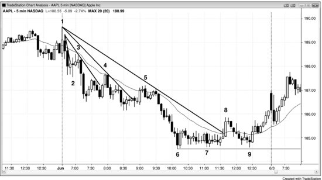
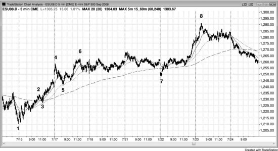

## 第11章　第一次回撤序列：K线、次要趋势线、均线、均线缺口、主要趋势线

<!-- Source PDF pages 247–255 -->
<!-- English: Chapter 11: First Pullback Sequence: Bar, Minor Trend Line, Moving Average, Moving Average Gap, Major Trend Line -->

<!-- PDF page 247 -->

# 第11章  
# 第一次回撤序列：K线、次要趋势线、均线、均线缺口、主要趋势线

趋势中可发生许多类型的回撤，有浅有深，可按程度分类与排序。其中任一种首次出现是该类型回撤的第一次回撤。每一次后续回撤将是更大种类的第一次，每一次通常后跟对趋势极端的测试，因为强行情一般至少有两段。因此，每一种类型的第一次逆势行情都可能后跟趋势中的另一段。回撤不必以完全相同的顺序发生。例如，有时 High 1 会在 High 2 之后发生，若趋势在 High 2 后加速。

随着多头趋势进展，它最终失去动能，变得更双边，并开始有回撤。回撤变大并演化成震荡区间，最终震荡区间会反转成空头趋势。在最终反转之前，每一次逆势行情通常后跟趋势中的另一高点。因此，每一个疲弱信号理论上是买入形态，且在下列清单中任一个发展之前，每一个都可发生数次。此外，一个可发生，然后在其他发生后再次发生。

以下是多头趋势中疲弱信号发展的一般顺序：多头实体变小。  
K线顶部开始形成影线，后续K线上影线变大。  
K线与各自前一根重叠比更早时更多。

<!-- PDF page 248 -->

一根有很小实体或十字星实体。  
一根有空头实体。  
当前K线高点在或低于前一根高点。  
当前K线低点在或刚好高于前一根低点。  
当前K线低点低于前一根低点。  
有一段回撤（High 1 买入形态），K线高点低于前一根高点。  
有两段回撤（High 2 买入形态），只持续五到约 10 根。  
有三段回撤（楔形多头旗形或三角形），只持续五到约 15 根。  
有次要多头趋势线突破。  
一根触及均线（20 缺口K线买入形态）。  
到新高的下一次反弹有一根或多根空头趋势K线与一两次回撤。  
一根收盘在均线下方。  
一根高点在均线下方（均线缺口K线）。  
有主要多头趋势线突破。  
一旦有高点在均线下方的K线，在市场回到均线上方之前有第二段下行。  
到新高的反弹有两次或更多回撤，每次持续两三根且有更明显的空头实体。  
有更大的两段回撤，持续超过 10 根，第二段下行跌破显著更高低点，形成更低低点。  
市场进入震荡区间，多头与空头K线约同样明显。  
市场突破震荡区间上方并回到震荡区间内，形成更大震荡区间。

以下是空头趋势疲弱的序列：空头实体变小。

<!-- PDF page 249 -->

K线底部开始形成影线，后续K线上影线变大。  
K线与各自前一根重叠比更早时更多。  
一根有很小实体或十字星实体。  
一根有多头实体。  
当前K线低点在或高于前一根低点。  
当前K线高点在或刚好低于前一根高点。  
当前K线高点高于前一根高点。  
有一段回撤（Low 1 做空形态），K线低点高于前一根低点。  
有两段回撤（Low 2 做空形态），只持续五到约 10 根。  
有三段回撤（楔形空头旗形或三角形），只持续五到约 15 根。  
有次要空头趋势线突破。  
一根触及均线（20 缺口K线做空形态）。  
到新低的下一次反弹有一根或多根多头趋势K线与一两次回撤。  
一根收盘在均线上方。  
一根低点在均线上方（均线缺口K线）。  
有主要空头趋势线突破。  
一旦有低点在均线上方的K线，在市场回到均线下方之前有第二段上行。  
到新低的抛售有两次或更多回撤，每次持续两三根且有更明显的多头实体。  
有更大的两段回撤，持续超过 10 根，第二段上行到达显著更低高点上方，形成更高高点。  
市场进入震荡区间，多头与空头K线约同样明显。

<!-- PDF page 250 -->

市场突破震荡区间下方并回到震荡区间内，形成更大震荡区间。

多数第一次回撤是次要的，仍是更大趋势第一段的一部分。然而，随着逆势交易者更愿意建仓、顺势交易者更快获利了结，每一次回撤往往更大。逆势交易者开始在新极端处获得控制。例如，在多头趋势中，交易者会开始能通过在新高处反转做空来做盈利交易，顺势交易者会在买入突破至新高时开始亏损。在某一点，逆势交易者会压倒顺势交易者，趋势会反转。

强趋势中的第一次次要回撤是一或两根回撤，几乎总是后跟新极端。例如，若有持续四根的多头尖峰，K线之间重叠很少且影线小，趋势强。若下一根低点低于前一根低点，这是该多头趋势中的第一次回撤。交易者会在其高点上方放置买入止损，因为他们预期至少再推升一次。若他们的单成交，这是 High 1 做多入场，在本书第17章详述。激进交易者会在前一根低点下方下限价单买入，预期回撤短暂，并希望以低于等待在回撤K线或K线上方止损买入的交易者的价格入场。下一次回撤可能是三到五根长，可能突破次要趋势线，然后后跟另一新极端。若该回撤有两小段，则买入入场是 High 2 做多（两段回撤，常称 ABC 回撤）。尽管这第二次回撤可以是 High 2 形态，若趋势非常强，它可以是另一个 High 1（一段回撤）。若市场从一或两个 High 1 入场然后 High 2 入场，且看起来在设置另一个 High 1，明智的是等待。在一系列盈利交易之后，你应对未经先见更大回撤的重新变强保持怀疑，因为这种力量可能是陷阱在设置（如最后旗形，第三册讨论）。更好是等待更多价格行为并错过可能的陷阱，而不是因为你骗自己相信在玩别人的钱而感到无敌无畏。若你交易，它很可能变成别人的钱。

<!-- PDF page 251 -->

强空头趋势中则相反，第一次回撤通常是短暂的一或两根 Low 1 做空入场，后来的回撤有更多K线与更多段。例如，ABC 回撤有两段并设置 Low 2 做空入场。

若趋势强，它可能两小时或更多远离均线，但一旦触及均线，它可能形成另一顺势形态，导致另一新极端，或至少对旧极端的测试。在多头趋势中回撤至均线时，许多交易者相信价格有足够好的折扣让他们买入。在上方做空的空头会回补空单以获利；在更高处获利了结的多头会寻找再次买入；一直在场外等待更低价格的交易者会把均线看作支撑与足够的折扣以开新多。若市场在约 10 到 20 根后不能移到均线上方，可能是因为交易者在激进买入前想要更多折扣。价格还不够低以吸引足够买家托起市场。结果是市场必须进一步下跌，然后才有足够买家回来托起市场测试旧高。这同一过程发生在所有支撑位。

若回撤越过均线，它会有第一次均线缺口K线形态（例如，在强多头趋势中，最终有回撤出现高点在指数移动平均线下方的K线）。这通常后跟对极端的测试，并可能新极端。最终，会有突破主要趋势线的逆势行情，它常是到第一次均线缺口K线的回撤。它后跟对极端的测试，可能未达（空头趋势中更高低点或多头趋势中更低高点）或超调（空头趋势中更低低点或多头趋势中更高高点）旧极端。这然后通常后跟至少两段逆势行情，若非趋势反转。反转前的每一次回撤是顺势入场，因为每一次是某种类型的第一次回撤（K线、次要趋势线、均线、均线缺口或主要趋势线），且任何类型的第一次回撤通常后跟至少对极端的测试并通常新极端，直到主要趋势线被突破之后。

<!-- PDF page 252 -->

尽管在 5 分钟图上交易时不值得花精力关注更高时间框架图，较大的 5 分钟回撤可能结束于 15、30 或 60 分钟，甚至日线、周线或月线图上的显著点，如指数移动平均线（EMA）、突破点与趋势线。此外，常有到 15 分钟均线的第一次回撤后跟对趋势极端的测试的倾向，然后回撤至 30 或 60 分钟均线，那可能后跟另一对极端的测试。由于更高时间框架显著点相对不频繁出现，花时间寻找对那些点的测试会是干扰，使交易者错过太多 5 分钟信号。

若趋势强且你已做了几笔盈利交易，但现在有几根横盘K线，对进一步入场要谨慎，因为这实际上是震荡区间。在多头趋势中，若区间低点附近有形态你可以买入，但要小心买入震荡区间高点的突破，因为空头可能愿意在新高做空，多头可能开始在高点获利了结。

延长下行后的空头旗形中也一样。横盘K线意味着买家与卖家都活跃，因此你不想在旗形低点突破上做空。然而，若旗形顶部附近有做空形态，你的风险小，交易值得做。

## 图 11.1　后续回撤往往变大

<!-- PDF page 253 -->

趋势中总会有回撤，且随着趋势延伸它们往往变大。然而，直到有反转，每一次回撤应至少测试先前极端（在图 11.1 中，空头趋势中为当日先前低点），测试通常会创造新极端。

K线 1 是多头趋势线突破后的两段更高高点。它在两K线反转中向下反转。那时，聪明交易者在寻找潜在新空头趋势中的做空入场，而不是先前多头趋势中的做多入场。

K线 3 是两根回撤至均线后的做空，是从昨日高点上方开始反转向下的两根空头尖峰后的第一次回撤。它是昨日摆动低点下方突破后的突破回撤。

K线 4 是第一次突破空头趋势线与均线，尽管只差约 1 tick，后跟新低。它走到次要摆动高点上方，因此是小更高高点，但未能到达均线、K线 3 后空头尖峰顶部或 K线 3 前的摆动高点上方。多数交易者把这看作简单两K线反转与均线处的 Low 2 做空形态。该 ABC 每段只有两三根，那很少足以让交易者把这小反弹看作趋势反转。

K线 5 是对均线的另一次测试，这次有两个收盘在均线上方，但勉强，回撤 <!-- PDF page 254 --> 后跟新低。它没有走到 K线 4 后小摆动高点上方，而是差 1 tick 失败并形成双顶。交易者把 K线 4 看作显著更低高点，因为它后跟新空头低点。一旦市场在 K线 5 后跌至新低，K线 5 成为最近的显著更低高点。空头把保护性止损从 K线 4 上方移到 K线 5 上方。

K线 8 突破主要趋势线并形成第一次均线缺口K线（低点在 EMA 上方的K线）。第一次缺口K线通常后跟对低点的测试，但有时有第二次入场。主要趋势线突破可能是新趋势的第一段，但通常后跟对低点的测试，可超调或未达低点，然后至少两段逆势行情展开（此处在空头趋势中为反弹）。这时，交易者需要寻找买入而不是继续交易旧空头趋势。K线 8 后的停顿K线设置做空，因为它导致空头趋势线上方失败突破。

到 K线 8 的反弹也突破 K线 6 与 7 之间的次要高点上方，在 K线 8 创造次要更高高点。然而，K线 8 在更大空头趋势中仍是更低高点。市场下跌许多根至 K线 9，在那里测试 K线 6 空头低点。然而，K线 9 没有到达新空头低点，而是形成更高低点。多数空头会把保护性止损移到刚好在 K线 8 高点上方。他们可能更早离场，因为他们判断市场在从 K线 9 更高低点起的两根多头尖峰上已反转为始终做多，或当它走到两根后形成的两K线多头旗形上方时。一旦市场走到 K线 8 上方并形成更高高点，他们预期更高价格。

市场在 K线 7 与 9 形成双底多头旗形。K线 9 刺破 K线 7 下方 1 tick，打掉止损，但未能创出新低。多头在捍卫其多单并激进买入下跌（吸筹）。第二段上行次日完成。

比较 K线 4、5 与 8 对均线的测试，注意 K线 5 比 K线 4 穿透更多，K线 8 比 K线 5 有更多穿透。这是可预期的，当情况如此时对下做空单要小心，因为会有许多聪明空头只在 <!-- PDF page 255 --> 更高价格做空，以及许多有足够信心买入下跌的多头。这减少卖盘压力，使你的做空入场有风险。

## 图 11.2　均线回撤

市场在图 11.2 中 K线 1 更低低点反转。有几次回撤至 20 根指数移动平均线，导致到 K线 4 的行情中的新高。

K线 4 是导致急剧调整至 K线 5 的趋势通道线超调，K线 5 测试 15 分钟 20 根 EMA（虚线），然后后跟对趋势高点的测试（K线 6 是更高高点）。

市场跳空低开至 K线 7，尽管市场最初看起来看空，该下行是到 60 分钟 20 根 EMA（虚线）的第一次回撤，后跟 K线 8 新高。
