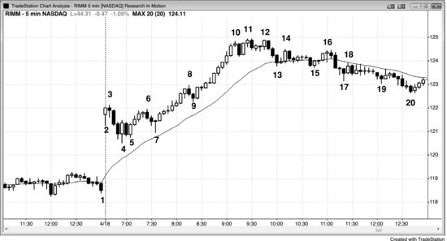

## 第 13 章：二十缺口K线

<!-- Source PDF pages 272–276 -->

<!-- PDF page 272 -->

第 13 章
二十缺口K线
当市场连续 20 根或更多K线停留在移动平均线一侧而不触及它时，趋势很强，但同时也过度延伸，很可能很快回撤到移动平均线，从而形成二十缺口K线形态。如果回撤之前没有清晰的趋势反转，第一次触及是高概率的剥头皮，目标是测试趋势极端。有些交易者会在移动平均线处或稍上/稍下用限价单和市价单入场，但更好的做法是等待价格行为入场（朝趋势方向的反转，并用止损单入场），以防回撤远远越过移动平均线。20 根并没有什么神奇之处。它只是一个有用的指引，提醒你趋势很强。你可以任意选取任何较大的K线数量并生成通常相同的形态，它在其他时间框架上同样有效。趋势可以极强，却仍每 30 分钟触及一次移动平均线；趋势也可以连续四小时远离移动平均线，却突然反转成相反趋势。当它出现在 5 分钟图上、市场至少两小时未触及移动平均线时，我过去称之为「距移动平均线两小时」形态，或 2HM。由于同一概念适用于所有时间框架，用K线数量而非小时数来表述更有用。这 20 根可以出现在一天中的任何时段，不一定在头两个小时。
一旦你意识到已存在连续 20 根缺口K线，就应寻找对移动平均线每一次触及的逆势交易（fade）。在一次或多次均线测试之后，很可能出现一次穿越移动平均线并形成均线缺口K线的测试——该K线完全位于移动平均线另一侧，从而在K线与均线之间出现缺口。寻找对第一根缺口K线的逆势交易（在多头趋势中，若前一根高点低于指数 <!-- PDF page 273 --> 移动平均线，则在其高点上方 1 tick 买入）。若第一次入场失败，若有第二次入场则再买一次。与所有形态一样，若前两个形态都失败，第三次买入就不值得了，因为此时市场很可能处于通道中，而非形成反转。由于你是顺势交易，应波段持有部分仓位，因为市场可能跑得比你想象的远得多。均线测试在股票中特别可靠，常常全天提供出色的入场。然而，若第一根均线缺口K线出现在强趋势反转之后，它很可能会失败，因为趋势已经反转，而那根缺口K线是针对现已结束的旧趋势的形态。
图 13.1 二十缺口K线

当趋势强到连续 20 根或更多K线没有一根触及移动平均线时，许多交易者会在第一次回撤到移动平均线时入场，并持有以测试趋势极端。在图 13.1 中，K线 11 是超过 20 根K线中第一根触及移动平均线的K线；由于空头趋势没有清晰底部，交易者在移动平均线稍下、其上与稍上挂限价单建立空头仓位。即便上行至 K线 11 由连续六根多头趋势K线组成，K线 10 处也没有清晰底部，因此交易者在移动平均线附近寻找做空。做空导致 K线 11 之后出现一根小的空头内包K线，而不是强空头趋势K线，这意味着大多数交易者认为此时反弹过强，不宜做空。

<!-- PDF page 274 -->

然而，空头在 K线 13 下方的第二次做空入场处变得积极（第一次入场机会在前一根）。由于上行至 K线 13 如此强劲，交易者在寻找更高低点，然后进行第二次向上测试，因此大多数空头在 K线 14 对 K线 10 空头趋势低点的更高低点测试附近离场。
K线 8 没有触及移动平均线，但仍是对移动平均线的两段式测试。空头如此急于做空，以至于把限价单放在移动平均线下方 2 或 3 tick，因为他们不确信反弹会触及移动平均线。若他们有信心，本可以把限价单放在移动平均线下方 1 tick，并在触及移动平均线时做空成交。当市场刚好在移动平均线下方转下时，空头非常积极。当测试像这里一样变成大的空头趋势K线时，这一点尤为明显。
K线 7、9 与 10 形成空头楔形，这是反转形态。K线 10 信号K线不够强，未能说服交易者市场正在向上反转，因此他们仍在移动平均线附近寻找做空形态。底部足够强，有第二段上行至 K线 15，在那里与 K线 13 形成双顶空头旗形。
对本图的更深入讨论
图 13.1 中市场以空头趋势K线跳空下行，因此突破可能成为开盘即趋势的空头趋势。两根K线后突破失败，但形态不够强，不宜买入。相反，空头应出场并等待。K线 4 与 K线 3 形成双顶空头旗形，并与随后一根构成两K线反转。交易者可以在 K线 4 下方用止损单做空双顶，也可以等待。下一根是跌破 K线 4 的空头趋势K线，使 K线 4 成为摆动高点。既然现在既有摆动低点也有摆动高点，且开盘区间小于近期平均日波幅的三分之一，市场处于突破模式。多头会在震荡区间上方用止损做多，空头会在区间下方 1 tick 用止损做空。突破应有跟随，当日常常成为趋势日，如此处所示。
尽管上半日空头力量很强，多头仍突破了多条空头趋势线。在止损扫盘式下挫至 K线 25 之后，他们能够推动市场上行——K线 25 在反弹至 K线 13 时跌破空头趋势线后与 K线 21 形成双底。它也是 K线 21 至 K线 24 空头旗形突破的最后旗形买入形态。K线 13 也是空头趋势中第一根位于移动平均线上方的缺口K线，因此是卖出形态（见下一章）。

<!-- PDF page 275 -->

图 13.2 二十缺口K线并不总是买入形态

如果市场连续 20 根或更多K线未触及移动平均线，但此前先有高潮，二十缺口K线形态可能不会导致反弹与对极端的测试。如图 13.2 所示，Research in Motion（RIMM）有一段抛物线式多头趋势上行至 K线 10。由于抛物线走势不可持续，它是一种高潮，而任何高潮之后通常至少会有持续至少 10 根K线的两段式修正，甚至可能跟随趋势反转。这使得回撤到移动平均线的单段修正成为有风险的做多。
对本图的更深入讨论
尽管图 13.2 中多头本可以基于 K线 13 在移动平均线处的限价单剥头皮赚取小利润，但在高潮之后的空头尖峰处买入是有风险的，因为至少应预期向下两段。K线 15 是更好的形态，因为它是第二段下行，且有不错的多头反转K线，但它在 K线 16 的 Low 2 处失败。K线 16 也与 K线 14 形成双顶空头旗形。由于市场处于窄幅震荡区间，这不是强做空形态。
上行至 K线 10 的K线重叠很少，且收在接近高点处。从 K线 7 到 K线 10 的整个反弹如此垂直，以至于它是一个多头尖峰。尖峰之后是停顿或回撤。这里，回撤始于三根空头趋势K线形成的尖峰下行至 K线 13。当先有多头尖峰再有空头尖峰时，这是高潮反转，是两K线反转的一种（但这可能只在更高时间框架图上才明显）。市场通常会横向一段时间：多头继续买入以试图生成多头通道，空头继续卖出以试图把市场推入空头通道。这里空头获胜，市场跌破 K线 13 与 15 的双底， <!-- PDF page 276 --> 完成向下的等幅运动。当市场两次未能做成某事时，它通常会做相反的事。
虽然图中未显示，多头能够从 K线 20 低点创建强多头通道，从 K线 20 上行的那一段与 K线 4 至 K线 10 的第一段高度完全相同，形成 leg 1 = leg 2 等幅运动。上行至 K线 10 的多头尖峰远大于下行至 K线 13 的空头尖峰，它也是更高时间框架上的多头尖峰。空头尖峰在这张 5 分钟图上得到了通道，然后多头尖峰在次日更高时间框架图上得到了通道（未显示）。
高潮中也有一个小楔形顶部。尽管 K线 12 低于 K线 11，这仍像楔形一样运作，可以说空头如此积极，以至于阻止了第三段超过第二段。有些交易者会把 K线 10 之后的空头K线看作多头通道下方的第一次突破，然后把 K线 11 看作突破回撤到更高高点。这不足以做空，但足以让多头减仓或离场。
K线 12 是两K线反转的第一根，与 K线 11 形成更低高点或双顶。交易者可以在第二根（强空头趋势K线）下方做空，最低目标是测试移动平均线。K线 17 是移动平均线下方的第一根缺口K线，但多头趋势已演化为震荡区间（市场已横向 20 到 30 根K线），这不再是可靠的买入形态。
