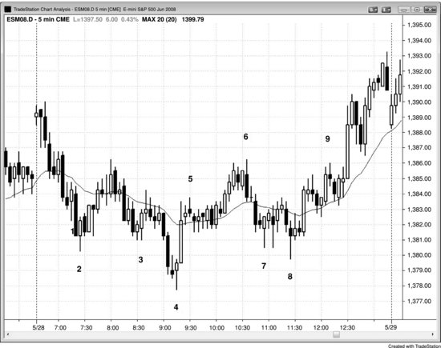

## 第 14 章：第一根均线缺口K线

<!-- Source PDF pages 277–280 -->

<!-- PDF page 277 -->

第 14 章
第一根均线缺口K线
通常，二十缺口K线形态之后会测试极端，而下一次对移动平均线的测试会探测得更深。可能形成一根完全位于移动平均线另一侧的K线。这是均线缺口K线，有时也可以是二十缺口K线回撤形态。缺口是一个广义术语，只表示图表上两点之间有空间。例如，若今日开盘高于昨日收盘，就是向上跳空。若开盘高于昨日高点，日线图上就会有缺口。更宽泛地使用该术语会打开其他交易机会。例如，若一根K线的高点低于移动平均线，则该K线与移动平均线之间存在缺口。在多头市场或横向市场中，市场很有可能回补该缺口。有时一根K线会突破前一根高点，但在一到两根内回撤继续向下。若市场再次突破前一根高点，这就是第二次均线缺口K线形态，或在多头趋势中第二次尝试回补均线缺口，从这个形态走出可交易反弹的几率很高。同样，移动平均线上方的缺口在空头趋势或横向市场中也倾向于被回补。
若存在强趋势，且这是该趋势中的第一根均线缺口K线，其后通常会测试趋势极端。回撤到缺口K线的这一段通常强到足以跌破趋势线；在测试趋势极端之后，市场一般会形成两段式修正，甚至主要趋势反转（在第三册讨论）。例如，若存在强多头，它终于出现一根高点低于移动平均线的K线，然后下一根突破该K线高点，市场将尝试对多头极端做更高高点或更低高点测试。交易者会买入做波段，预期市场接近或超过旧高。有些交易者会在 <!-- PDF page 278 --> 跌破移动平均线的回撤继续下行时分批加仓（这在第 31 章关于分批加仓与减仓中讨论）。若市场反弹测试旧高，但随后向下反转，通常会有更持久的修正，通常至少两段，并常导致趋势反转。
大多数图表上的大多数K线都是均线缺口K线，因为大多数K线并不触及移动平均线。然而，若没有强趋势而交易者对其做逆势交易（例如，在移动平均线上方的K线低点下方 1 tick 卖出），交易者往往只是寻找回撤到移动平均线的剥头皮并在那里止盈。交易者只有在到移动平均线有足够空间可接受利润、且该交易在当前价格行为背景下说得通时才会做。因此，若存在强趋势，第一根均线缺口往往酝酿波段交易；若没有强趋势而交易者做均线缺口K线交易，她更可能是在寻找剥头皮。
图 14.1 均线缺口，第二次信号

<!-- PDF page 279 -->

在图 14.1 中，K线 2 是横向市场中第二次尝试回补移动平均线下方缺口。向下动能有些强，可以说今天市场并非横向，但由于昨日强收盘，移动平均线基本走平。此外，有数根K线与前一两根重叠，且 K线 2 是由当日第三、四根形成的两K线空头尖峰之后的第三段下推。多头在 K线 2 高点上方 1 tick 挂买入止损做多，并寻求在测试移动平均线时获取剥头皮利润。
K线 3、4 与 8 也是第二次尝试（第一次尝试可以只是一根多头趋势K线），或第二次均线缺口K线入场。
K线 5 是均线缺口K线，但交易者不会为了剥头皮到移动平均线而做空它，既因为到移动平均线空间不够，也因为它跟随强劲向上反转与更高低点，且在 K线 4 更低低点向上反转后很可能有第二段上行。
K线 6 与 9 是第二次均线缺口K线做空形态。一旦市场突破 K线 9 上方，就出现了多头趋势，因为两次下行尝试都失败了（K线 9 是第二次均线缺口K线形态，意味着它是第二次尝试关闭到移动平均线的缺口）。
K线 7 是均线缺口K线形态，但由于到移动平均线空间太小，交易者较不可能仅因其为均线缺口K线就买入做剥头皮。
对本图的更深入讨论
图 14.1 中市场向上突破，但当日第一根K线很小，因此不是失败突破做空的可靠信号K线。第三根是强K线，因此是可能的开盘即趋势空头趋势的更好形态。
K线 6 是始于 K线 4 之后上冲尖峰的尖峰与通道多头趋势的向下外包反转。
K线 8 是始于 K线 7 低点的小扩展三角形的信号K线。它也可以看作楔形，因为它是小双底下方的突破，且突破失败。K线 8 也是 K线 4 底部之后的楔形多头旗形；三段下推是 K线 5 之后那根、K线 7 与 K线 8。最后，K线 8 是跟随 K线 4 更低低点之后上冲至 K线 5 的尖峰后的更高低点。
突破 K线 9 上方是失败的楔形空头旗形，因此很可能出现向上等幅运动。三段上推是 K线 8 前两根、K线 9 前的摆动高点，以及 K线 9。

<!-- PDF page 280 -->

图 14.2 均线缺口与对极端的测试

第一根均线缺口K线可以导致对趋势极端的测试。在图 14.2 中，K线 1 与 2 都是强趋势中的第一根均线缺口K线，其后都测试了趋势极端。K线 1 是空头趋势中第一根低点高于移动平均线的K线（K线与移动平均线之间有缺口），其后是对空头低点的更高低点测试。K线 2 之后出现了新的趋势极端。
