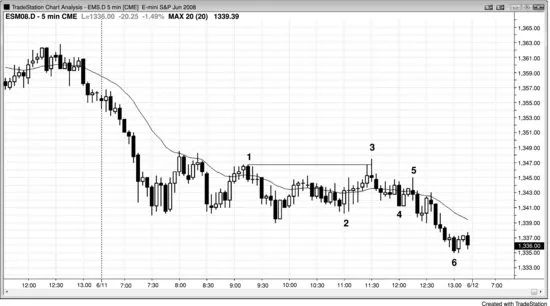
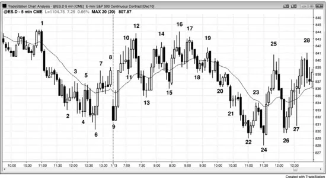
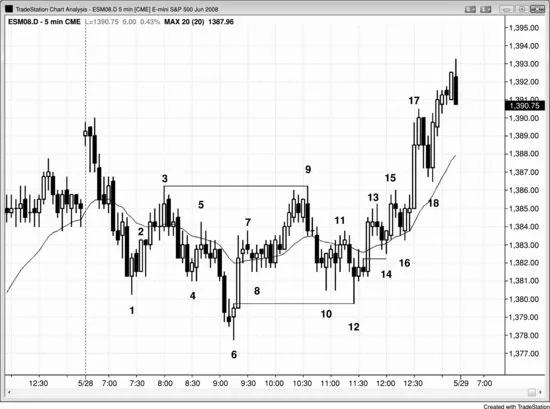

## 第 15 章：酝酿突破与反转的日内关键转折时点

<!-- Source PDF pages 281–285 -->

<!-- PDF page 281 -->

第 15 章
酝酿突破与反转的
日内关键转折时点
市场常在太平洋标准时间（PST）早上 7:00 与 7:30 经济数据发布前后一根K线内突破或反转，在 11:30 a.m. PST，较少在 11 a.m. 与 noon PST 附近。在强趋势日上非常常见的是，会出现一波强逆势恐慌行情，把人吓出仓位，这通常发生在 11:00 与 11:30 a.m. 之间，尽管也可能更早或更晚。一旦你清楚自己被一波强逆势运动愚弄了，趋势通常已经朝旧极端回走了很长一段，你和其他被困出场的贪婪交易者会去追赶它，使它走得更远。是什么造成这一运动？机构从急剧的逆势尖峰中获益，因为它允许他们在好得多的价格加仓，预期趋势会恢复进入收盘。若你是一名希望在收盘前加满仓位、并想在好得多的价格入场的机构交易者，你会寻找制造或助推任何谣言的机会，以引发短暂恐慌，扫止损，并短暂使市场尖峰越过某个关键价位。谣言或新闻是什么、是否有机构散布它来赚钱，都不重要。重要的是，止损扫盘给理解发生了什么的交易者提供了搭机构便车、从失败趋势反转中获利的机会。
止损扫盘式回撤通常会突破重要趋势线，因此运行到新极端（趋势线被突破后的更高高点或更低低点测试）会促使聪明的交易者在次日第一小时寻找相反方向的交易。
这类陷阱在震荡日上也很常见：市场在看似即将突破的某一极端附近徘徊数小时，却突然急剧运动扫掉

<!-- PDF page 282 -->

另一极端，而这一相反方向的突破常在 11:30 a.m. PST 左右失败。这把早先为某一方向突破布局的交易者困出场，并把在另一方向突破时入场的新突破交易者困进场。大多数震荡日收在中间某处。
图 15.1 晚期止损扫盘

图 15.1 中有两个二十缺口K线形态形成于晚期止损扫盘。K线 5 是 11:25 a.m. PST 止损扫盘后的入场，也是均线缺口形态的第二次入场（第二次均线缺口K线做多形态，第一次入场在 K线 4 空头尖峰之后那根上方）。注意那根空头趋势K线有多大实体、收盘多么接近低点。这根空头突破K线让弱势交易者以为市场已转成空头趋势。聪明的交易者把它看作绝佳买入机会，预期它会是衰竭性卖盘高潮与失败突破。这类止损扫盘通常会突破主要趋势线，且由于其后通常跟随趋势的新极端，它常为次日第一小时的相反方向交易搭好舞台（这里是突破多头趋势线后的更高高点）。它与多头通道起点的 K线 2 形成了双底多头旗形。
两天中，均线缺口逆势交易都是在两次或更多次测试移动平均线之后形成的。当逆势交易者能够多次把市场带回移动平均线后，他们逐渐

<!-- PDF page 283 -->

建立了加压下注的信心，导致出现越过移动平均线的缺口K线。然而，第一次这种越过移动平均线的突破通常会失败，并为预期的趋势恢复提供出色的逆势交易。
第一天，市场在 7 a.m. 试图向下反转，大概是因为某项报告。由于当时当日是开盘即趋势的多头趋势，这一根K线的抛售是开盘即趋势日中的第一次回撤，因此是买入形态。失败的反转之后是三根多头尖峰，然后是通道。
第二天，7 a.m. 反转成功，成为三根空头尖峰，随后是空头通道。
第二天，市场在 noon 试图从最后空头旗形向上反转，但反转在 K线 10 均线缺口做空形态处失败。
图 15.2 晚期多头陷阱

在图 15.2 的开盘即空头趋势之后，市场无力上穿移动平均线，交易者预期 11:30 a.m. PST 多头陷阱，而它今天准时出现。K线 3 也是空头趋势中的第一根均线缺口K线。通常，陷阱是强逆势腿，让满怀希望的多头积极买入，却在市场迅速转下时被迫平仓。然而今天，从 K线 2 起的反弹由大量重叠十字星组成，表明交易者在两个方向都紧张。若没有信念，交易者又如何被困？答案是：K线 3 前一根试图形成

<!-- PDF page 284 -->

双顶空头旗形，而 K线 3 越过 K线 1 高点破坏了它。这使许多交易者放弃空头判断，迫使空头回补，并在突破时把一些多头困进多单。导致突破的动能很弱，因此被困多头可能不多。然而，由于未能与 K线 1 形成完美双顶，它把空头困在了场外。既然是陷阱，就有空头侧燃料：被困出场的空头现在必须在更低处做空并追赶市场下行，而被困多头必须卖出多单。从 K线 3 下行腿的疲弱与从 K线 2 上行腿的疲弱一致，但结果正如预期——收在当日低点。这是空头趋势恢复日，但由于恢复开始得很晚，且跟随的是有强双边交易的窄幅震荡区间（大、重叠、大影线的K线），它导致的腿比开盘抛售更小。
图 15.3 震荡日上的晚期陷阱

震荡日上也常有 11:30 a.m. PST 陷阱（见图 15.3）。这里，在当日区间上半部停留数小时后，市场向下扫过当日低点，把多头困出场，并把新空头困进场。市场在 11:35 a.m. 的 K线 24 上方给出第二次入场 High 2 做多。市场两次尝试向下突破 K线 9 当日低点并失败，因此很可能尝试

<!-- PDF page 285 -->

相反方向。大多数震荡日收在中间某处。
当日以第一根K线起的开盘即多头趋势开盘，并在 7:00 a.m. 回撤跌破 K线 10 信号K线，这很可能与某项报告有关。由于有三根带突出影线的大横向K线，这代表一个小震荡区间，在其上方买入有风险。于是市场在报告时短暂向下突破，把空头困进场，然后向上突破 K线 11，把多头困进场、空头困出场；随后在 K线 12 第二次转下。当有多头与空头被困进或困出时，下一个信号通常至少适合剥头皮。
对本图的更深入讨论
图 15.3 中进入昨日收盘的反弹是从楔形底部向上的反转，很可能至少有两段。K线 9 的更高低点向上反转足够接近，可视为双底，而 7:40 a.m. PST 的 K线 13 更高低点是双底回撤。由于开盘反弹是强劲上冲尖峰，市场很可能在回撤后尝试形成通道，但它在 K线 12 与 K线 1 的双顶处失败。随后一小时内出现数根空头尖峰，最终是在 11:30 a.m. 的 K线 24 向上反转的空头通道。11:00 a.m. 的 K线 22 反转尝试失败。市场处于过陡的空头通道中，因此通道的第一次突破之后很可能是突破回撤与更高概率的做多，而 K线 24 就是信号K线。它也是从当日新低向上反转的第二次尝试。
上冲至 K线 12 形成了楔形空头旗形，K线 5 与 8 是前两段上推。市场过陡向上，不宜在 K线 11 突破从 K线 9 起的窄多头通道时做空，但做空突破回撤到 K线 12 更高高点是合理的。更稳妥的是等待 K线 12 向下外包K线收盘，看空头是否能主导该K线。收盘接近低点确认了空头力量，因此在跟随开始时在其下方做空是好入场。
