### 第17章　K线计数：High 与 Low 1、2、3、4 形态与 ABC 调整

<!-- Source PDF pages 290–332 -->
<!-- English title: Chapter 17: Bar Counting: High and Low 1, 2, 3, and 4 Patterns and ABC Corrections -->

<!-- PDF page 290 -->

# 第17章
# K线计数：High 与 Low 1、2、3、4 形态与 ABC 调整

所有市场都是分形的。这是一个数学概念，意味着市场每一段都与每一个更低与更高时间框架图有相同的一般形态。若你去掉图表上的时间与价格标签，通常无法分辨图表是 3 分钟、5 分钟、60 分钟甚至月线图。你能可靠近似图表时间框架的唯一时候是平均K线只有一到三 tick 高，因为图会大多是十字星，而这只发生在小时间框架或成交量极小的市场，你不应交易那些。

由于每张图上的每一次运动都倾向于两段式，每一次调整也倾向于两段式，每一次调整的调整也倾向于两段式，理解这一倾向的交易者会发现大量机会。

多头趋势或震荡区间中回撤结束的可靠迹象是：当前K线高点至少延伸到前一根高点上方 1 tick。这引出一个有用的概念：计算这种情况发生的次数，称为「K线计数」。在多头趋势或震荡区间中的横向或向下运动里，第一根高点在前一根高点上方的K线是 High 1，它结束横向或向下运动的第一段，尽管这段可能成为更大回撤中的小段。若市场未变成多头波段而继续横向或向下，把下一次出现高点在前一根高点上方的K线标为 High 2，结束第二段。High 1 与 High 2 之间需要至少有微小趋势线突破，以表明趋势交易者仍活跃。没有这个，先不要 <!-- PDF page 291 --> 寻找买入，因为 High 1 与 High 2 更可能只是正在形成复杂第一段下跌的通道的一部分。

在强上摆中，High 2 入场可以高于 High 1；在强下摆中，Low 2 入场可以低于 Low 1。顺便说，多头趋势中的 High 2 与空头趋势中的 Low 2 常被称为 ABC 调整，其中第一段是 A，形成 High 1 或 Low 1 入场的方向变化是 B，回撤最后一段是 C。从 C 的突破在多头 ABC 调整中是 High 2 入场K线，在空头 ABC 调整中是 Low 2 入场K线。

多头趋势中的 High 2 与震荡区间中的 High 2、空头趋势中的 Low 2 与震荡区间中的 Low 2 有重要区别。例如，当多头趋势中有 High 2 设置时，它通常在均线处或上方，趋势足够强使你可在当日高点附近买入。你在买入趋势中的持续形态，因此可在趋势顶部附近买入。然而，当你在震荡区间中买入 High 2 时，你通常在寻找反转，设置在均线下方且接近区间底部。若你认为市场在震荡区间中，在均线上方且接近震荡区间高点买入 High 2 有风险。事实上，由于该交易很可能失败，你应改为考虑在 High 2 信号K线高点处或上方用限价单做空。若 High 2 很可能失败，它为何还会触发？它触发是因为空头在K线上方寻找做空，而较少在刚好低于K线高点处做空。他们在前一根高点处及上方放置限价单做空。由于相对缺乏愿意在刚好低于K线高点处做空的空头，多头没有对手并能把市场推过前一根高点，希望大量多头用买入止损入场。K线高点充当磁铁，推过该K线是小型买盘真空。多头发现有压倒性数量的空头在那里等待做空。结果是 High 2 触发，但市场立即转下。在过去几个 tick 买入的那些多头迅速看到前一根高点上方缺乏反弹。因为市场没有做他们预期的事，他们退出，并至少几根内不再寻找买入。他们卖出平多促成了抛售。

震荡区间中的 Low 2 情况相反。你应只在均线上方且接近震荡区间顶部寻找卖出 Low 2， <!-- PDF page 292 --> 因为你在交易反转而不是持续形态。你试图做空上涨段的末端，因此在逆小型趋势交易。若它形成在震荡区间底部附近且你相信市场现在在震荡区间而不是空头趋势中，最好在 Low 2 信号K线处或下方买入，预期 Low 2 失败并形成某种双底。这些预期的失败通常发生在市场看起来在趋势、但你认为市场已进入震荡区间时。

多头趋势中的 High 1 与空头趋势中的 Low 1 可因各自在趋势中的位置而有不同的风险/回报特征。例如，若市场在筑底并形成失败 Low 1，在该K线上方买入是在拿新多头趋势的第一个 High 1 入场。成功概率可能只有 50–50，但风险小、潜在回报大。你有小概率赚大利润。新多头趋势初始尖峰后的 High 1 做多交易有高概率至少成为成功的波段交易。风险小，潜在回报与成功概率都高。然而，若市场正在形成连续第三个 High 1 设置，波段概率小，交易者应剥头皮。这意味着风险与潜在回报都小，概率也低于第一个 High 1。

一些多头回撤可进一步增长并形成 High 3 或 High 4。当 High 4 形成时，有时以 High 2 开始，而这个 High 2 未能走很远。它反而随后有空头突破与另外两段下跌以及第二个 High 2，整个运动只是更高时间框架 High 2。另一些时候，High 4 是小型尖峰与通道空头趋势，其中第一次或第二次下推是空头尖峰，随后下推在空头通道中。若 High 4 未能恢复趋势且市场跌破其低点，市场很可能不再形成多头趋势中的回撤，而是在空头波段中。在下单前等待更多价格行为展开。

当空头趋势或横向市场在横向或向上修正时，第一根低点在前一根低点下方的K线是 Low 1，结束修正的第一段，可以短到只有那一根。随后的出现称为 Low 2、Low 3 与 Low 4 入场。若 Low 4 失败 <!-- PDF page 293 --> （Low 4 做空触发后有K线延伸到 Low 4 信号K线高点上方），价格行为表明空头已失去控制，市场要么变成双边——多空交替控制——要么多头获得控制。无论如何，空头能重新获得控制的最佳证明是以强动量突破多头趋势线。

若市场处于清晰多头趋势，不要寻找 Low 1 或 Low 2 做空，因为那些只是空头趋势与震荡区间中的设置。若市场处于清晰空头趋势，不要寻找 High 1 或 High 2 做多，因为那些只是多头趋势与震荡区间中的设置。事实上，若市场在空头趋势中，你常常可在前一根高点上方寻找做空，因为在空头趋势中买入 High 1 是低概率交易。这意味着若它只有约 40% 机会成为成功多头，它有约 60% 机会在触及止盈限价单前打到保护性止损。若你在 5 分钟 Emini 图上剥头皮，则有 60% 机会市场会下跌并打到两点止损，再触及信号K线上方五 tick 的限价单。所以若有 60% 机会它在上涨五 tick 前下跌两点，这对做空是极好设置。同样，你可在强空头趋势或空头通道中任何K线高点上方寻找卖出，可在多头趋势中买入 Low 1，并在多头趋势或多头通道中任何前一根低点下方买入。

在你计数这些回撤时，你常常会看到市场继续修正而不是反转，此时你必须改变视角。若你认为市场在震荡区间中只是有强新高，然后看到旧高上方的 Low 2（做空设置），但市场未下跌而是继续上涨，你应开始寻找 High 1 与 2 做多入场。多头力量很可能足以让你只做多。你应推迟寻找 Low 1 与 2 做空，直到空头展示足够力量使可交易的下跌运动可能（如多头趋势线突破后跟失败的摆动高点测试）。

注意在震荡区间中，常见在约 10 根过程中看到 High 1、High 2、Low 1 与 Low 2 都存在，即便 High 2 看多而 Low 2 看空。由于市场横向，多空双方 <!-- PDF page 294 --> 都未控制价格行为超过短暂时间，因此双方都会试图夺取控制是有道理的，当每一方试图确立自己时，多头或空头形态会形成。在震荡区间中很容易看到大量 High 与 Low 1 与 2 形态，非常重要的是你不要过度交易。当市场大多横向、K线大量重叠、且区间不是很强趋势中的小旗形时，多数交易者应靠边不交易。为什么？若你在寻找 High 2 或 Low 2，你是在窄幅震荡区间顶部或底部用止损入场，做的恰好与机构相反。当市场在窄幅震荡区间中越过前一根高点时，他们在对多头获利了结或在做空，所以你不想买入。你的工作是跟随他们在做什么；不是忽视他们在做什么并欺骗自己相信你有某种神奇设置，只要你不断交易它就会赚很多钱。窄幅震荡区间可作为很强趋势中的小旗形形成，那时在区间突破时用止损入场是合理的。例如，若有强的四K线空头尖峰，且市场横盘 10 根时没有高潮或强反转，在空头趋势K线下方用止损做空有道理。但若当天是震荡日且窄幅震荡区间在当天中间三分之一，多数交易者永远不应基于K线计数下单。

当市场在窄幅震荡区间中时，它常常反复反转方向，所以若你做每一个 High 1、2、3、4 并做空每一个 Low 1、2、3、4，在一小时过程中你会亏掉过去一周赚的所有钱。在第 22 章窄幅震荡区间中，我会更详细讨论。没有神奇设置，每一个设置都有数学给它优势的环境，以及其他会亏损的环境。基于K线计数的交易需要有波段的市场。若市场在窄幅震荡区间中，不要交易，除非你是非常有经验的交易者，且你舒服在前一根高点上方做空而不是在那里用止损买入，以及在前一根低点下方买入而不是在那里用止损做空。

这种编号有变体，但目标仍是帮助发现两段式调整。例如，在强多头趋势中，两段式
<!-- PDF page 295 -->回撤可以形成且只有 High 1，但功能上是两段式回撤。你可以从 5 分钟图的外观推断，也可以通过查看更小时间框架图确认，尽管这不必要。你称之为眼前图上的 High 1、High 2 变体，还是更小时间框架 High 2，并不重要，只要你理解市场在做什么。若有空头收盘（或两根），即便下一根未延伸到空头K线高点上方，这也可以代表第一段下跌。若下一根有多头收盘但其高点仍低于趋势高点，则若再下一两根又是空头趋势K线，它就成为第一段下跌的终点。若下一根延伸到其低点下方，在随后几根内寻找延伸到其前一根高点上方的K线，结束两段下跌。把每一根看作潜在信号K线，在其高点上方 1 tick 放置买入止损。一旦成交，你现在有 High 2 的变体。这根入场K线严格来说只是 High 1，但把它当作 High 2。回撤开始处的那根空头K线后跟有多头收盘的K线。在更小时间框架上，这几乎肯定是小下跌段后跟成为更低高点的上涨段，然后最后再一次下推到 High 2 结束第二段处。

回撤常常增长并演变成更大回撤。例如，若有多头趋势且 High 1 做多入场未能到达新高，反而有更低高点然后另一段下跌，交易者会寻找 High 2 设置买入。若 High 2 触发但反弹走不远且市场再次转下到 High 2 信号K线低点下方，交易者会随后寻找买入 High 3（楔形或三角形）或 High 4 回撤。每当 High 2 或楔形（High 3）做多信号K线下方有强突破时，市场通常至少再有两段下推。若 High 2 信号K线下方的突破不强，且整个下跌有楔形形状并从趋势通道线反转向上，则 High 3 正在形成楔形多头旗形，常常是可靠的做多设置。记住，这是多头趋势中的回撤，而不是空头趋势中的反转尝试——在那里交易者在寻找买入前需要清晰的多头力量展示，如第三册反转部分讨论。若 High 2 做多信号K线下方的突破在第二次下推后向上反转，且四次下推在某种通道中、看起来不是特别强，它是 High 4 做多设置。一些 <!-- PDF page 296 --> High 4 做多设置只是更高时间框架上的 High 2 做多设置，其中两段各细分为两个更小段。若失败 High 2 下方的突破有强动量，且从抛售顶部起的整个回撤在相对紧的通道中，则买入 High 3 有风险。相反，交易者应等待看是否有空头通道上方的突破然后突破回撤。每当交易者怀疑向下通道是否太强而不宜在 High 3 或 High 4 信号K线上方买入时，他应像对待任何其他通道突破一样对待该设置，如第一册讨论。等待看多头突破有多强再寻找买入。若突破很强，交易者可寻找买入回撤。若它如此强以至于有一系列没有回撤的多头趋势K线——可能发生但不寻常——市场会变成始终做多，交易者可因任何理由买入，包括任何强多头趋势K线的收盘。由于止损在尖峰底部下方，可能很远，仓位应小。若市场反而跌破 bar 4 信号K线低点，市场很可能在空头趋势中，交易者应开始寻找卖出反弹，而不是继续寻找买入。

空头反弹中情况相反。若 Low 2 做空失败且市场继续反弹，看从失败 Low 2 起上涨的动量。若不太强且市场在通道中，尤其若有楔形形状，寻找做空 Low 3，那将是楔形空头旗形。若向上动量非常强，例如从失败 Low 2 起有两或三根强多头尖峰，寻找至少再两段上涨，不要做空 Low 3。只有在整体图景支持做空时才做空 Low 4，若你相信市场现在已转为多头趋势则不要做空。

如第三册反转章讨论，当交易者寻找向下反转时，他们常常寻找他们预期会失败并成为多头段最后旗形的 High 1、High 2 或三角形（High 3）形态，然后在做多信号K线上方做空。由于突破是对高点的测试，它创造双顶（突破可能形成更低高点或更高高点，但由于它是第二次上推且在转下，它是一种双顶，如第三册讨论）。当一个人在 High 2 做多信号K线上方做空时，他预期市场会 <!-- PDF page 297 --> 向下交易进入震荡区间或新空头趋势。由于双顶是两次上推，且交易者预期它在震荡区间或新空头波段顶部，它也是 Low 2 做空设置（在创造双顶的那根K线低点下方卖出）。几乎每一次向下反转都来自某种形式的双顶。若顶部在震荡区间中只是小上涨段之后，双顶常常只涉及几根并成为微型双顶。多数底部也一样。它们来自失败 Low 1 或 Low 2 或三角形突破，创造双底与最后旗形向上反转。由于交易者预期向上进入震荡区间或新多头，双底也是 High 2 做多设置，入场在创造双底最后一次下推的那根K线高点上方 1 tick。

High 3 与 Low 3 形态应像楔形一样交易（若形态大多横向则像传统三角形），因为功能上它们相同。然而，为保持术语一致，当它们作为反转形态时最好称之为楔形，因为按定义 High 3 是多头趋势或震荡区间中的回撤（楔形多头旗形），Low 3 是空头趋势或震荡区间中的楔形空头旗形。例如，若有多头趋势或震荡区间，High 3 意味着有三段下跌，并在信号K线高点上方设置做多信号。若有空头趋势，你在寻找 Low 1、2、3、4 设置而不是 High 1、2、3、4 形态。若空头趋势中有清晰楔形底，你应寻找买入反转；但由于它在空头趋势中，你应称之为楔形底而不是 High 3。同样，若有空头趋势或震荡区间，Low 3 意味着有三次上推，你应像楔形顶一样交易它。若有多头趋势，你不应寻找 Low 3 做空，但在楔形顶下方做空可以接受。

失败 High/Low 4 也有变体。若 High 4 或 Low 4 的信号K线特别小，尤其若是十字星，有时入场K线会迅速反转成外包K线，打掉刚入场交易者的保护性止损。当信号K线小时，为避免洗盘，常常最好把保护性止损放在信号K线之外超过 1 tick（或许 3 tick，但在 Emini 平均波幅约 10 点时从入场起总计不超过八 tick）， <!-- PDF page 298 --> 并仍把形态视为有效，即便技术上它失败了——尽管只失败 1 tick 左右。记住，一切都是主观的，交易者总在寻找接近完美的东西，但从不期望完美，因为完美罕见。

要知道 5 分钟图上的复杂调整在更高时间框架图上常常表现为简单的 High/Low 1 或 2 调整。不值得看更高时间框架图，因为交易在 5 分钟图上显而易见，你冒分心寻找稀有信号并错过太多 5 分钟信号的风险。

High 1 做多设置是市场尝试向下反转的失败，Low 1 做空设置是空头趋势中失败的反弹尝试。因为强趋势通常继续，反转尝试几乎总是失败。你可以通过押注失败获利。你恰好在那些被困的 fade 者（逆趋势交易者）会带亏损退出的地方入场。他们的退出止损是你的入场止损。

最可靠的 High 1 与 Low 1 入场发生在趋势尖峰阶段——趋势最强段——微型趋势线的虚假突破时。交易者看到尖峰并开始寻找买入 High 1，但他们忽视了 High 1 做多设置的第二个关键组成部分。最后组成部分是过滤器——不要在显著买盘高潮后做 High 1，也不要在显著卖盘高潮后做 Low 1 做空。是的，你需要多头尖峰；但你也需要强多头趋势。交易者最常犯的错误之一是他们在希望中交易并买入每一个 High 1，预期趋势会跟随。相反，他们必须强迫自己等待多头趋势形成，然后寻找 High 1。若多头尖峰很强，但仍低于图上更早的高点，市场可能仍在震荡区间中，这使在 High 1 上方买入风险更大。High 1 做多设置可能轻易变成大调整或反转前反弹的最后旗形。向上冲的多头尖峰可能是由于震荡区间高点的买盘真空测试，而不是新多头趋势。若多空双方都预期震荡区间顶部会被测试，一旦市场接近顶部，多头会积极、持续地买入，确信市场会到达略高处的磁铁。强空头看到同样的事并停止做空。他们为何现在做空，当他们可以在几分钟后以更好价格卖出？

<!-- PDF page 299 -->

结果是非常强的多头尖峰，一旦到达震荡区间顶部附近就导致反转，此时聪明交易者不会买入强多头趋势K线的收盘或 High 1 做多设置。事实上，许多人会用限价单做空，因为他们预期这次突破尝试会像多数强突破尝试一样失败。对交易者要买入 High 1，他们需要强多头尖峰与多头趋势，而不仅仅是震荡区间内的向上尖峰。此外，若多头尖峰以过强的买盘高潮结束，他们不应买入 High 1。

Low 1 做空也一样。等待空头趋势，而不仅仅是震荡区间内的空头尖峰，然后寻找有 Low 1 做空设置的尖峰。不要在每一个尖峰后简单地做空每一个 Low 1，因为多数尖峰发生在震荡区间中，在震荡区间底部做空 Low 1 是亏损策略，因为 Low 1 设置很有可能是下跌段的最后旗形；市场随后可能有大向上修正甚至多头反转。若交易者在寻找买入 High 1 或做空 Low 1，他们应只在趋势的尖峰阶段这样做，若有可能高潮的证据则不要做该交易。例如，若你在寻找买入 High 1 设置，你在押注回撤会最小且只有一段。许多 High 1 设置只是急剧三到五根尖峰后的一两根回撤，另一些是在已运行五到 10 根的极强趋势中到均线的四或五根回撤，这可能有点太远、太快。若你在买入如此短暂的回撤，你相信市场有巨大紧迫感，这个短暂回撤可能是你在你所信的非常强多头趋势高点下方买入的唯一机会。若市场横盘五根并有几个小十字星，市场已失去紧迫感，最好在买入前等待。若 High 2 形成，它是更安全的做多设置。

交易者未能买入 High 1 回撤的最常见原因是交易者希望更大的回撤。然而，当有强多头趋势时做多很重要，交易者应在先前摆动高点上方放置买入止损，以防回撤短暂且多头趋势迅速恢复。强空头趋势中也一样。若做空 Low 1 的三个标准都存在（强空头趋势、强空头
<!-- PDF page 300 -->尖峰，且无强卖盘高潮），交易者必须做空。若他们在决定是否在 Low 1 信号K线下方放置做空单，他们应在摆动低点下方 1 tick 放置做空单。然后，若他们最终未做空 Low 1 且市场急速下跌，他们会被卷入强空头趋势。这远好于从场外观看并等待下一次回撤。若他们做空了 Low 1，然后可取消摆动低点下方的做空单。

若那个 High 1 在强多头趋势尖峰阶段是如此可靠的做多设置，机构知道趋势恢复并随后有新高的机会可能有 80%，它怎么可能形成？若他们相信市场会更高，他们为何会允许回撤？因为是他们创造了回撤。尖峰由许多公司同时无情买入造成，意味着他们在买入程序中分批加多。在某一点，这些公司中的每一家都会开始分批减仓；一旦足够多停止买入并开始卖出平仓，就会形成低点在前一根低点下方的K线。许多其他公司会在市场跌破另一根时买入，但若趋势不太强只是为了剥头皮。从这一点起，公司都会在分批减仓；因此，High 1 设置上方的突破常常只导致剥头皮。在极强趋势中，它是波段交易，可能在更高水平还有一两个 High 1 设置，然后一些 High 2 做多设置；但在所有情况下，回撤由机构从更低入场获利造成。他们以赚钱为业，意味着他们必须在某一点获利；当足够多同时开始部分获利时，他们创造多头旗形，如 High 1、High 2 或更大回撤。空头趋势中相反。

这是重要观察，因为你现在看到：你应只在趋势非常强时买入 High 1 做多设置，这通常意味着只在尖峰阶段且只在市场明显处于趋势时。最后，不要在高潮或反转后买入 High 1，也不要在震荡区间顶部买入 High 1 回撤，因为多头趋势尚未突破。强多头尖峰顶部的 High 1 做多设置与强空头尖峰底部的 Low 1 做空设置在震荡区间中常见，通常是陷阱。事实上，它们常常是好的 fade 设置。

<!-- PDF page 301 -->

例如，若 High 1 在震荡区间顶部设置，尤其若信号K线是十字星，常常合理在 High 1 做多信号K线顶部处或上方放置限价单做空。由于你预期 High 1 做多会失败，你认为它会在走六 tick 并成交你一点剥头皮止盈限价单前反转并打到两点止损。当你预期 High 1 做多失败时，你相信保护性止损在止盈限价单成交前被打到的概率至少 60%。若你通过在信号K线高点用限价单做空来 fade High 1，你预期它不会上涨六 tick，因此你可用六 tick 保护性止损。由于你觉得它是糟糕的做多设置，你相信它会跌到你入场价下方七 tick，即在信号K线上方 1 tick 用止损买入的多头入场价下方八 tick。这意味着你可用六 tick 限价单剥头皮平空，有至少 60% 机会在风险六 tick 的同时赚六 tick，这是好交易。若 Low 1 形成在震荡区间底部且你相信 Low 1 做空会失败，你也可在 Low 1 做空信号K线低点处或下方放置限价单做多。

若震荡区间顶部那个 High 1 如此强，为何尖峰不够强到远破震荡区间上方并有数根跟随？市场在告诉你尖峰不是很强，你因此应倾听。仅仅因为尖峰有四根多头趋势K线并不使它成为强多头趋势的尖峰阶段。看整张图，确保尖峰是强趋势的一部分，而不仅仅是震荡区间顶部的陷阱。记住，市场常常在震荡区间顶部有强多头尖峰，因为强交易者靠边且直到市场到达区间顶部甚至突破一两根才卖出。多头然后卖出平多获利，空头卖出开新空。这种真空快速吸市场向上，但与趋势无关。交易者非常渴望卖出，但若他们认为市场会再涨几个 tick 测试区间顶部，对他们来说现在卖出没有意义。相反，他们停止卖出并等待市场到达那里；然后他们突然出现，强反弹反转，困住新手在当日高点附近买入。High 1 只是清晰多头趋势中的做多设置， <!-- PDF page 302 --> 而不是震荡区间顶部附近尖峰中的。Low 1 只是清晰、强空头趋势中的做空设置。

High 1 与 Low 1 形态是顺势设置，所以若一个发生在趋势回撤内但方向是回撤方向而不是趋势方向，不要做该交易。相反，等待它失败，然后在突破回撤上顺趋势入场。例如，若有多头趋势然后在均线处或上方形成四根长空头微型趋势线，不要做空趋势线上方的失败突破。你不想在均线附近回撤底部——通常接近回撤末端——做空多头趋势。相反，寻找这次失败再失败并变成突破回撤，那将是趋势方向（向上）。空头微型趋势线上方有突破失败。失败突破短暂向下交易，但未能走远并向上反转。一旦它向上反转，向上反转是初始突破微型趋势线上方后的突破回撤入场。然而，若空头段有四根或更多连续空头趋势K线，且失败微型趋势线设置在均线下方，它很可能是有利可图的做空剥头皮，即便当天可能是多头趋势日。

趋势有趋势性的高低点。在多头趋势中，每个低点通常高于先前低点（更高低点），每个高点越来越高（更高高点）；在空头趋势中，有更低高点与更低低点。一般而言，更高高点与更高低点术语保留给多头趋势似乎到位或正在发展的情况，更低低点与更低高点暗示空头趋势可能生效。这些术语暗示至少有过次要趋势线突破，所以你在考虑在多头趋势中买入更高低点（回撤）或在空头趋势中买入更高低点（逆势但可能是反转），以及在多头趋势或空头趋势中卖出更低高点。逆势交易时，你应剥头皮大部分或全部仓位，除非反转很强。

一旦多头趋势或震荡区间中 High 2 做多触发，若市场随后反转并在至少达到剥头皮利润前跌破形态低点，High 2 做多已失败。同样，若空头趋势或震荡区间中有 Low 2 做空入场，且市场未能至少达到剥头皮利润反而突破形态顶部上方，Low 2 做空已失败。High 或 Low 2 失败的最常见原因是交易者否认趋势反转 <!-- PDF page 303 --> 并仍在旧趋势方向寻找交易。

High 或 Low 2 是最可靠的顺势设置之一。若交易失败，形态通常会演化并再有一或两个修正段。例如，若市场在多头趋势或震荡区间中向下回撤并形成 High 2，但在一两根内有K线交易到信号K线低点下方，High 2 未能使市场从多头旗形向上反转。当那发生时，下摆通常会再次尝试在 High 3 或 High 4 向上反转。High 3 代表三次下推，因此是楔形的变体。若市场更可能继续更低，若你买入 High 3 会被止损。然而，若你总是等待 High 4，你会错过许多好的 High 3 做多交易。市场常常给交易者线索哪个情景更可能。该线索以失败 High 2 后的动量形式出现。若市场未显著改变其从下跌运动的动量，更可能市场会在 High 3 向上反转，创造楔形多头旗形做多信号（High 2 下方的突破成为衰竭缺口，而不是度量缺口）。若反而有一两根大空头突破K线，这增加至少再两段下跌的概率，交易者应等待 High 4 再寻找买入。在这种情况下，突破K线很可能成为度量缺口并导致下行等幅运动。每当有强尖峰，许多交易者会重新开始计数，并预期至少再两段下跌才愿再买入。第一段后的向上反转是突破陡空头趋势线上方的第一次尝试，因此很可能失败。第二次向上尝试是该突破的突破回撤，由于它是突破回撤（无论是更低低点还是更高低点），更可能成功。若市场在失败 High 2 后从 High 4 向上反转，通常形态只是复杂 High 2，其中两段各细分为两个更小段。这在更高时间框架图上通常明显，简单 High 2 常常清晰可见。若那个 High 4 失败，市场更可能现在在空头趋势中而不是多头趋势中的回撤，交易者应在下更多单前重新评估市场的强度与方向。

<!-- PDF page 304 -->

空头趋势或震荡区间中的上涨段情况相反。若 Low 2 触发做空入场，但在一两根内有K线交易到信号K线高点上方且动量不起眼，有利可图的 Low 3 设置（楔形空头旗形）更可能。然而，若有几根大多头趋势K线，则突破很强，市场很可能至少再有两段上涨，所以交易者不应做空 Low 3。相反，他们应等待看是否形成 Low 4。若 Low 3 后向上动量非常强，市场很可能在陡多头通道中，最好不要做空 Low 4，那是强多头通道底部的第一次突破。相反，交易者应等待看是否形成更高高点或更低高点突破回撤。若如此，这是第二次入场做空与更低风险交易。然而，若多头通道不是很紧且有某种理由寻找顶部，例如 Low 3 是小型最后旗形、或越过摆动高点后第二次尝试向下反转、或从更高时间框架空头趋势线反转，则交易者可做空 Low 4。Low 4 信号K线常常很小，当它们小时，市场常常迅速向上反转并打掉 Low 4 信号K线上方的保护性止损，然后再次向下反转进入好的空头波段。因此，当有小 Low 4 或 High 4 信号K线时，在 Emini 中使用约两点的资金管理止损，而不是信号K线之外的价格行为止损。

理解 High/Low 2 设置概念的关键是记住其意图。想法是市场倾向于对任何事做两次尝试，在其修正尝试中，它常常会两次尝试反转趋势。在多头趋势中买入 High 2 回撤的优势是思考很少且容易做。困难出现在调整有两次尝试但未形成清晰 High 或 Low 2 时。这就是为何有必要看变体——你可以通过交易两段式回撤赚钱，即便它们不提供完美的 High 或 Low 2 设置。

最明显的两段式运动有两个清晰摆动，中间有突破次要趋势线的反向摆动，通常在多头趋势中形成 High 2 回撤或在空头趋势中形成 Low 2（ABC 调整）。然而，有不那么清晰的变体提供同样可靠的交易，所以识别这些也很重要。任何时候
<!-- PDF page 305 -->你看到可以推断两段的调整，你就找到了可接受的形态。然而，离理想越远，它越不像理想那样行为。

多头趋势中的 High 2 比震荡区间中更可靠。当有多头趋势时，市场沿途有回撤，由获利了结的多头与积极空头共同创造。多数时候，顶部看起来可能够好做剥头皮，这吸引希望反转的新空头。可能有好看的空头反转K线、楔形、买盘高潮，或某种使他们相信市场有合理机会反转的其他形态，因此他们做空。若市场回撤，他们开始感到自信。若市场形成 High 1 做多，许多人会继续持空，因为他们希望空头趋势或至少多头趋势中的大调整，他们把 High 1 接受为可能的更低高点，随后有更低价格。当市场从那个更低高点转下时，他们更有信心。然而，若市场第二次转上，他们不会持有空头。若如此，那将是 High 2 做多入场。多头会把设置看作两次尝试把市场推下都失败，所以他们会买入 High 2 做多。空头会以同样方式看，若两次都失败，他们会放弃、回补空头，并等待另一个信号再做空。随后一两根相对缺乏空头与多头重新的热情使 High 2 在多头趋势中成为可靠设置。多数时候，它形成在均线处或附近。

空头趋势中的 Low 2 情况相反，Low 2 设置比震荡区间中更可靠。空头趋势会有回撤，回撤的开始总是刚好足够令人困惑，使多头怀疑它是否可能是趋势反转，所以他们开始买入；空头会怀疑它是否可能导致更强的向上修正，所以他们开始获利了结，买回一些空头。多空双方这种买入的结果是反弹，但在这一点多空都不知道它会是反转还是只是空头旗形。早期多头可能允许一次以 Low 1 形式的逆他们运动，因为它可能形成更高低点，但若市场两次逆他们运动，他们不会持有多头。他们会在 Low 2 退出，并至少几根内不再买入。

<!-- PDF page 306 -->

此外，空头会做空 Low 2，所以他们的做空，加上多头的卖出（他们在卖出平多）以及新多头的缺席，导致有利于空头的不平衡。就像多头趋势中的 High 2 一样，空头趋势中的 Low 2 通常形成为到均线或附近的回撤。

三推顶常常是 Low 2 的变体，即便它实际上是 Low 3。每当第一段很强且相对于后两段不成比例地大或强时，你有看起来够像楔形、行为像楔形的东西。跟随那个强第一段的 Low 1 后跟两段较弱段，常常可看作只由两个更小部分组成的一段。入场在楔形完成时的 Low 3，但也可被看作 Low 2。然而，编号变得无关紧要，因为你面对三推形态，它应像楔形反转一样行为，无论你选择把入场称为 Low 3 还是 Low 2。不要在这里的智力层面花太多时间。记住，多数真正聪明的学院派不能交易，所以尽管理想主义与完美很理想，若你与市场对抗并坚持它像教科书常描述的那样完美行为，你会亏钱。

三推底情况相反，两段中的第二段常常可看作拆成两部分，你有看起来像 High 3 但功能像楔形与 High 2 的东西。换句话说，无论你如何选择给各段编号，市场应至少上涨到剥头皮。

一些交易者寻找逆强趋势的逆势剥头皮。例如，若有强空头趋势然后形成多头反转K线，过于急切的多头可能在该K线上方买入。由于他们在逆趋势交易，他们常常允许回撤，如 Low 1 做空。他们预期 Low 1 做空会失败并成为更高低点，他们可能持多看是否如此。然而，若市场未到达他们的止盈目标反而形成 Low 2 设置，多数交易者不会允许趋势第二次恢复，他们会在 Low 2 触发时卖出平多。若 Low 2 未触发且市场再有一次小上推并设置 Low 3，这是楔形空头旗形，多头会在它触发时退出。他们知道只要市场不跌破小更高低点，他们的交易仍有 <!-- PDF page 307 --> 可能成功的可能性，但他们意识到概率太强烈不利。更有经验的交易者不会买入那个反转，反而会等待在 Low 2 或 3 信号K线下方做空，这在空头趋势中是非常强的设置。当市场跌破更高低点时，随着最后的多头放弃并卖出亏损多头，空头趋势常常加速。一般而言，若你曾经过早买入，总要在市场触发 Low 2 或 3 做空时退出甚至反向，尤其若有强空头信号K线，因为这是最可靠的卖出设置之一。同样，若你做空强多头趋势，总要在 High 2 或 3 触发时退出，尤其若有强多头信号K线，这创造最强的做多设置之一。若你在情绪上能够反向，通常应该。

## 图 17.1　K线计数

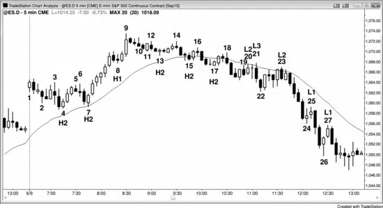

不要在K线计数中忘记目标。专注于回撤，而不是 High 1、High 2、Low 1 与 Low 2。多数时候当市场在多头趋势或震荡区间中时，你在寻找买入两段式回撤，如图 17.1 中 bar 4、7、13 或 17 上方的 High 2，即便那时你也不应机械地买入每一个。例如，到 bar 15 有两段下跌，第一段是到 bar 13 的通道。然而，bar 15 是连续第四根空头K线，且前面两根有强空头趋势K线。此外，第二段比 <!-- PDF page 308 --> 第一段小得多，所以可能还有更多。当设置有问题时，最好等待。

为何 bar 10 不是好的 High 1 做多设置？因为它在多头段与最后旗形（bar 8）末端的买盘高潮之后，市场很可能以两段或更多段横向到向下修正约 10 根或更多。每当市场已上涨一段时间后有相对大多头趋势K线时，它可能代表趋势的暂时衰竭。若趋势可能衰竭，它不再是强多头趋势，因此 High 1 不是好的做多设置。这也是 bar 11 不是好做多设置的原因。由于市场仍在买盘高潮后的修正过程中，它处于震荡区间阶段，在震荡区间中均线上方买入 High 2 有风险。

Bar 17 是更好的 High 2 做多设置。它是复杂两段式调整的终点，每一段细分为两段，更大段尺寸相似、小段尺寸相似，所以形状好。此外，尽管事后看市场已转为空头趋势，在这一点仍有足够双边交易可视为震荡区间，因此买入 High 2 合理。更大的第二段下跌从 bar 14 开始结束于 bar 17，High 2 可以三种方式思考：作为 High 4；作为两个更大段的 High 2，其中 bar 13 是第一段终点的 High 1；或作为两个更小段的 High 2，其中 bar 15 是第一段终点。

尽管 High 1 与 Low 1 常见，它们很少是好设置，除非在最强趋势中。由于 High 1 通常发生在段的顶部附近，你应只在该段处于多头段尖峰阶段时买入它。Bar 8 是好 High 1 的例子，因为它形成于有连续六根多头趋势K线且每个多头实体与前一根实体很少重叠的强多头趋势中。几乎所有多头尖峰中的 High 1 与空头尖峰中的 Low 1 回撤都会是微型趋势线突破。

同样，bar 25 与 27 是空头尖峰中好的 Low 1 做空设置。有强空头趋势、强空头尖峰，且无强卖盘高潮——至少在 bar 24 没有。有时用K线计数设置以外的名称描述设置更贴切，bar 27 是好 <!-- PDF page 309 --> 例子。是的，它是强空头趋势中的 Low 1，但一些交易者会担心强 bar 26 多头反转K线。他们会随后断定空头趋势不再够强到做空 Low 1。然而，他们可能怀疑市场是否开始进入震荡区间，因为这是第二次尝试向上反转，他们可能随后怀疑 bar 26 是否实际上是萌芽中震荡区间底部的 High 2，其中 bar 24 设置了 High 1。他们仍会在 bar 27 Low 1 下方做空，但不是因为它是 Low 1。相反，他们会做空是因为他们把它看作空头趋势中的失败 High 2，知道那个强 bar 26 反转K线后的 High 2 会困住多头。

由于市场在 bar 25 处于强空头趋势，你不能在前一根高点上方买入，你可以在前一根 bar 24 高点上方做空，并在 bar 25 下方再卖更多。

### 对本图的更深入讨论

图 17.1 中 bar 1 是大跳空高开日开盘即趋势多头趋势起点的尝试，但在下一根就失败，成为多头陷阱（困住多头进入亏损交易）。由于那根空头反转K线交易到 bar 1 上方然后转下，它可被看作失败 High 1。这使 bar 2 成为 High 2 做多设置，但在那个多头陷阱后，最好等待第二段下跌与至少一根好多头实体再寻找买入。此外，向 bar 2 的下跌是微型通道，通道上方突破很可能有回撤，所以最好等待该回撤再寻找买入。不要担心这种不清晰的K线计数；相反，专注于找到两段式回撤买入的目标。此处值得注意的一点是：在许多日子，当当天第二根交易到第一根上方然后市场下跌时，那第二根常常成为 High 2 做多设置中的 High 1，若设置看起来好你应准备买入那个 High 2。尽管 bar 2 的 High 2 导致有利可图的剥头皮，若 bar 2 是多头反转K线会更强，尤其若其低点在均线下方。

Bar 20 是到均线的两段式回撤（前两根的多头趋势K线是第一次上推），因此是合理的做空设置。然而，市场在两根后于 bar 21 交易到入场与信号K线上方。那形成了困住买入失败 Low 2 的多头、以及让自己在 bar 20 做空信号K线高点上方被止损的空头的小第三次上推。这是楔形空头旗形的例子。每当市场在均线下方时，交易者在寻找做空，当既有被困空头又有被困多头时，成功做空信号的概率上升。多头会止损离场，他们卖出平多的卖出会帮助进一步推低市场。刚被止损的空头现在会恐慌并愿意追着市场下跌，增加卖盘压力。

<!-- PDF page 310 -->

## 图 17.2　震荡区间中的 High 与 Low 1 设置

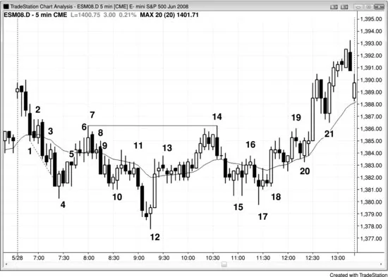

图 17.2 左图中的 High 与 Low 1 设置形成于震荡区间内，不是好交易。右图中的那些在清晰空头与多头趋势中，是极好设置。仅仅因为市场有强多头尖峰与 High 1 做多设置并不意味着你应买入它，你永远不应做空 Low 1，除非有强空头趋势。

到 bar 7，市场已有五次反转，波幅小，多数K线与先前K线重叠。当天处于震荡区间，明显不在强多头趋势中。两根多头趋势K线从 bar 5 更低低点形成强向上尖峰，并突破 bar 4 更低高点上方。多头希望当天向上突破并形成多头趋势，本可能如此，除了市场惯性。趋势倾向于继续趋势，反转通常失败；震荡区间继续横向，突破尝试通常失败。Bar 7 是强多头尖峰后的 High 1 做多设置，但它在震荡日。它也有十字星信号K线，代表双边交易。这是糟糕的做多设置，事实上，积极交易者预期它失败，并在 bar 7 高点处及上方用限价单做空。

Bar 9 是均线上方且在震荡区间中的 High 2 设置，因此很可能失败。

<!-- PDF page 311 -->

Bar 11 是跌破当日新低的空头尖峰中第四根空头趋势K线。然而，这是震荡日。它可能变成趋势日但尚未如此，因此在当日低点的 Low 1 很可能失败，尤其有十字星信号K线。积极多头在 bar 11 低点处或下方买入，预期空头被困。

把那些设置与右图中的比较。市场是开盘即趋势，由三根大空头趋势K线组成，影线小、重叠少，并远破昨日低点下方。这是清晰、强空头趋势，有大量紧迫感。Bar 22 是一根回撤，交易者在这个 Low 1 做空设置下方积极做空。事实上，交易者如此确信市场会跌破尖峰低点，许多人在 bar 21 高点处及上方用限价单做空。

有另一次卖盘高潮到当日低点，这常常随后有两段式调整，有时趋势反转。六根多头趋势K线创造了到均线的反弹，K线重叠很少、实体大、影线小。买入有紧迫感，人人在等待这个可能新多头趋势中强多头尖峰的回撤。Bar 26 有一根停顿，设置了好的 High 1 做多。

有另一次六根尖峰到 bar 30，然后六根回撤到 bar 31 的均线，那里有多头信号K线与另一个有效 High 1 做多设置。

## 图 17.3　K线计数有时很困难

<!-- PDF page 312 -->

图 17.3 呈现难以计数（但相当容易交易）的一天，显示回撤各段计数中的许多微妙之处。当第一段很陡且其修正只有一两根长（如到 bar 2 停顿），然后 High 2 设置形成，同样只在一两根后（如 bar 3），没有显著趋势线会被突破，所以你不应寻找买入 High 2。风险太大这是空头趋势而不是震荡区间或多头趋势中的回撤，因此你不应寻找 High 1 与 2。

即便有两次尝试上涨，第一次尝试太弱。你总想在做多设置前看到力量展示。否则，假定市场仍在其第一段下跌中。若 bar 3 后的K线越过 bar 3 高点，它会是积极的做多入场，但若第一段下跌后的反弹（High 1）显示更多力量，买入总是更好。

市场有时再次下跌并在穿透趋势通道线后向上反转形成 High 3。这是楔形反转（三段与趋势通道线的失败突破），在 bar 4 设置了一个。注意 bar 2 与 bar 3 都未越过各自前一根，但它们各自有效结束了小段下跌。在 1 分钟图上，几乎肯定有 <!-- PDF page 313 --> 清晰段与形成这些 5 分钟多头趋势K线的小修正反弹。

Bar 4 是 High 3 做多入场K线，但它也是空头趋势K线。由于它只是上涨段的第二根，且楔形底后的反弹通常至少有两段上涨，它不是好的 Low 1 做空设置。记住，所有这些反转尝试在跟随更长更强趋势线突破时更可靠。若在前一段（如 bar 2 反转尝试）没有有意义的趋势线被突破，则下一段的反转尝试不会有太多信心（bar 3），你应等待额外价格行为如 bar 4 的楔形底再考虑买入。

Bar 5 可被看作 Low 1 或 Low 2，但当市场从高潮底（楔形是一种高潮）向上修正时，确保允许它横向到向上修正再寻找再次做空。什么构成足够修正没有严格规则，但一般修正应有两个清晰段，且至少约有楔形一半数量的K线。抛售也是尖峰与通道空头趋势，所以上涨段应测试接近通道起点 bar 2。

严格来说 bar 6 是 Low 2，但由于 Low 1 处没有有意义的多头趋势线突破，你不会做空它。市场仍在紧通道中，所以你不应寻找 Low 1 或 Low 2 做空。通道在推进中可有许多回撤，但它们通常至少有三段才有突破与反转。Bar 7 是第三次上推。它是均线测试上的第二次入场做空，与 bar 2 通道顶部形成双顶，是两K线反转的第一根。在随后空头K线下方做空是合理交易。然而，市场自 bar 6 以来处于窄幅震荡区间，多数交易者不应交易；相反，他们应等待突破然后开始寻找交易。

Bar 8 是 High 1，但它发生在弱反弹顶部六根横盘之后，而不是在强多头尖峰中。

Bar 10 也是震荡区间底部多头K线上方的 High 2 入场，是可接受的做多入场。

<!-- PDF page 314 -->

尽管 bar 11 是 High 1 变体，因为它未延伸到前一根上方，它也是均线下方的 Low 2 做空设置。Low 1 设置是前两根的 2 根反转，那也设置了失败 High 2（bar 10 是 High 2 入场K线）。它是创造 bar 10 High 2 做多失败的第二次尝试，多数在 bar 10 上方买入的交易者会在这次第二次失败时退出。这是均线下方 Low 2 做空有效的原因之一。它恰好是过早多头会退出的地方，当他们卖出平多时，他们增加卖盘压力，并至少一两根内不再买入。

Bar 12 是多头反转K线与 High 2（bar 11 是 High 1），在平静日且是当日新低，使其成为至少剥头皮的高概率交易。若没有 High 1，下跌会有约六根趋势空头K线，交易者必须等待突破回撤（第二次入场）再考虑做多。Bar 12 是更大两段式回撤中等幅运动（大约）的终点，第一段结束于 bar 10，也是从当日高点起甚至更大等幅运动的终点，第一段结束于 bar 4。最后，bar 12 是空头趋势通道超调的向上反转。线未显示，但它锚定在 bar 10 前一根的低点，创建为从 bar 7 向下空头趋势线的平行线。

Bar 13 本可能是窄幅震荡区间的开始，因为它是连续第三个小十字星。到两根后，窄幅震荡区间清晰，多数交易者不应再使用K线计数作设置。然而，有经验的交易者可把 bar 13 看作一次下推，随后四根中的两根空头K线看作另外两次下推；他们可随后把这个窄幅震荡区间看作楔形多头旗形（第 18 章讨论），然后寻找买入突破，预期强 bar 12 多头尖峰后有多头通道。由于在这一点当天基本上在震荡区间中且这个窄幅震荡区间在当天波幅中间，K线计数不可靠。然而，由于刚有强向上尖峰，在多头趋势K线上方寻找买入是合理的，无论K线计数是什么。

Bar 14 是 Low 2，结束第二段上涨，从 bar 12 起的尖峰是第一段上涨。它也是与 bar 7 的双顶空头旗形， <!-- PDF page 315 --> 因此是冲向当日高点的第二次失败尝试。在无趋势日且双顶空头旗形后，你应寻找两段下跌。第一段以 bar 15 High 1 结束，随后两小段上涨，以均线处 bar 16 Low 2 结束。

第二段下跌以 bar 17 的 High 2 结束，但 bar 17 是跟随空头趋势K线的空头趋势K线，且跟随到 bar 15 的非常强的第一段下跌。它仍是有效买入，但不确定性导致 bar 18 High 2 的第二次机会入场。这个第二次入场发展是因为足够多交易者对第一次入场足够不舒服，使他们等待第二次设置。它也是仅基于实体的 ii 形态变体。在后面章节中，你会学到它也是双底回撤做多设置。Bar 17 与 bar 15 前或后一根形成双底，bar 18 前的横盘K线是回撤。

Bar 19 的 Low 2 在强上行动量之后，但仍是有效做空。然而，它导致 bar 20 的五 tick 失败（后文描述；意味着从 bar 19 起的下跌只到五 tick，因此留下许多空头没有剥头皮利润仍被困）。

Bar 20 形成失败 Low 2，困住空头，因此是好入场，尤其当上行动量一直很强时。当失败 Low 2 发生时，通常随后要么是 Low 3 楔形要么是 Low 4。它也是均线上方且在震荡区间内的 High 2，但市场处于多头尖峰与通道趋势的通道阶段，因此是顺势做多设置，即便仍在震荡区间顶部下方。尖峰与通道趋势在第一册趋势第 21 章讨论。

由于从 bar 20 起的多头尖峰很强，至少再两段上涨可能，买入 bar 21 的 High 1 是可靠交易。这段下跌本可能演变成有低点在 bar 21 低点下方的两段式回撤的K线（形成 High 2 做多设置），但概率不利。力量实在太多。

## 图 17.4　SDS 有助于分析 SPY

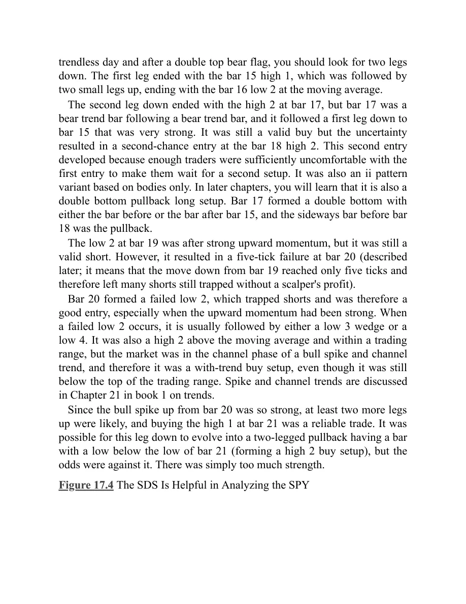

<!-- PDF page 316 -->

图 17.4 左是 5 分钟 Emini，右是 5 分钟 SDS，一种交易所交易基金（ETF），是 SPY（与 Emini 可比的 ETF）的反向，但有两倍杠杆。在 Emini 图上，bar 5 有 High 2，跟随 bar 1 的多头趋势线突破，然后 bar 3 更高高点测试旧趋势高点。这是可能的趋势反转。下行动量很强，bar 4 的 High 1 很弱。它刺破从 bar 3 高点起的小多头微型趋势线并立即向下反转，表明多头弱而不是强。买入 bar 5 的 High 2 是不明智的，除非它显示异常力量，如有强多头反转信号K线且前面没有两K线空头尖峰。此外，信号K线太大，迫使交易者在弱市场中买高，信号K线是十字星，几乎完全在前两根内（两根都是空头趋势K线）。

当有三根或更多大量重叠的K线且一根或多根是十字星时，最好在发起交易前等待更多价格行为。多空双方处于平衡，任何突破都可能失败（如 bar 5 的 High 2 做多信号），你当然不应在其高点上方买入突破，尤其在空头段中，特别因为多数震荡区间是顺趋势的且前一段向下。

每当你怀疑信号是否够强时，从不同视角研究图表有帮助，如使用K线图或
<!-- PDF page 317 -->反向图。一般而言，仅仅你觉得需要进一步研究这一事实就应告诉你：它不是清晰强信号，因此你不应做该交易。

即便你被诱惑在 Emini 图上买入 High 2，几乎没有人会在右侧 SDS 图上寻找卖出 bar 5 的 Low 2，因为上行动量如此强。由于这些图本质上只是彼此的反向，若你不会在 SDS 上买入，你就不应在 Emini 上卖出。

注意 Emini 上 bar 7 是 High 4，通常是可靠的做多信号。然而，在 High 1、2 或 3 没有任何多头力量的情况下，你不应做该交易。单独K线计数不够。你需要以至少突破次要趋势线的相对强运动形式的先前力量。这是由向下尖峰然后楔形通道形成的 High 4 例子（bar 4、5 与 7 结束三次下推）。

注意更早有强多头趋势，Low 2 做空是糟糕交易，直到市场突破多头趋势线之后。没有强下行冲刺，但市场横盘约 10 根，表明空头够强把多头挡在外相当长时间。空头这种力量展示是交易者有信心做空最后旗形突破到 bar 3 当日新高所必需的。

Bar 4 是 Emini 图上可接受的微型趋势线做空，即便当天曾是多头趋势日。在到 bar 3 更高高点的最后旗形后，你需要考虑趋势可能已切换为向下。在这种类型反转后应至少有两段空头——多空双方都会预期它。此外，入场在均线上方，这是你在 Low 1 信号K线下方卖出时想看到的。

一旦市场看起来在空头趋势中且向下动量良好，你可通过在前一根高点处或高几个 tick 放置限价单做空 High 1、2、3 与 4。Bar 4、5 与 6 是那些做空的入场K线例子，它们也是在其低点下方 1 tick 再卖更多的信号K线。

## 图 17.5　失败 Low 2 常常最终成为 Low 4 做空

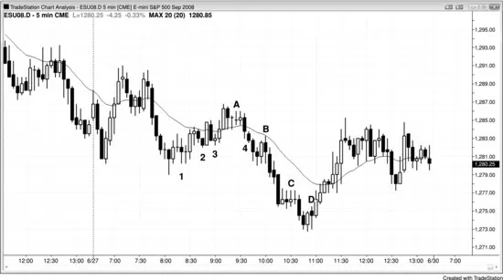

<!-- PDF page 318 -->

在图 17.5 中，bar 2 是失败 Low 2，因此预期再有一或两段上涨。即便 bar 2 上方的突破不强，向上通道太紧不宜做空 Low 3。一个 Low 4 结束了空头反弹，另一个结束了到当日低点的抛售。Bar A 的 High 1 发生在前一段的 Low 4 之前并不重要。

Bar 1 是微型趋势线 Low 1 做空，对剥头皮好。然而，太平洋时间上午 8:00 的小十字星与该 Low 1 做空的十字星信号K线意味着市场正在变成可能的窄幅震荡区间。这使交易有风险，可能最好不做该交易。

Bar B 是强势穿过均线后回撤到均线的 Low 1 做空好例子。它也是微型趋势线失败突破做空。

## 图 17.6　失败 Low 4

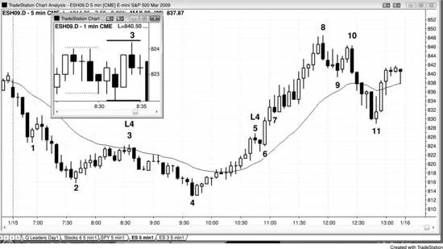

<!-- PDF page 319 -->

两个失败 Low 4 做空说明重要观察，如图 17.6 所示。在 bar 3 触发做空入场的 Low 4 有小十字星作设置。当这种情况时，总把止损放在信号K线高点上方两或三 tick，因为市场常常在你入场做空后迅速跑到信号K线上方 1 tick 打止损，如此处。看 1 分钟图的插图。5 分钟信号K线由虚线之间的五根 1 分钟K线组成，入场K线由实线之间的五根组成。你可以看到市场在入场K线第二分钟触发做空，但在第四分钟跑到信号K线上方 1 tick，然后抛售到 bar 4。

第二个 Low 4 由 bar 5 设置触发。向 bar 4 的反弹几乎全是多头趋势K线，它跟随突破主要空头趋势线后形成的 bar 4 更低低点。趋势已变为多头趋势，你不应再寻找空头反弹，也不应再寻找做空 Low 1、2、3 或 4，那些是震荡区间与空头趋势中的设置。在从 bar 4 起上涨缺乏空头力量时尤其如此，如多头趋势线突破。事实上，与其寻找反转做空，你应寻找回撤买入，你甚至可以在 bar 5 低点处或下方放置限价单买入。看当入场后下一根 Low 4 失败时发生了什么。如预期，人人终于接受这是多头市场的现实，市场不停冲到 <!-- PDF page 320 --> bar 8，那大约是 bar 4 到 bar 5——整个 Low 4 形态——高度的等幅运动。突破在突破点（bar 5 高点）与突破回撤（bar 7）之间创造了度量缺口。这类度量缺口在第 6 章缺口中讨论。

注意 bar 7 是三次尝试再向下反转中的第一次，因此是任何额外反弹后任何回撤的磁铁。它是失败 Low 4 上方两K线突破尖峰后多头通道的起点。向 bar 11 的两段式下跌（跟随多头趋势线突破与 bar 10 更低高点）打到所有三根更早空头反转K线的低点下方，这很常见。面对如此强的反弹，很难相信市场能回到那些水平，但若你知道如何读价格行为，你会更惊讶若它没有，尤其在如此高潮的上涨之后。Bar 7 后是窄幅震荡区间，但这在强多头市场中。尽管窄幅震荡区间使K线计数不太可靠，由于它是强多头市场，交易者应在多头K线上方寻找买入，同时把保护性止损放在信号K线低点下方。

顺便说，bar 7 与随后四根中的两根空头反转K线构成三次下推。当它们以两根多头趋势K线组成的突破失败时，楔形上方有另一个度量缺口导致上行等幅运动，当日高点超过它几个 tick（失败楔形常常导致等幅运动）。

Bar 8 后几根形成 High 1 做多设置，尽管它在强多头尖峰与多头趋势中，它在买盘高潮之后，因此不是好做多设置。市场在 bar 6 两K线多头尖峰后处于抛物线多头通道中。

## 图 17.7　多头趋势中的 Low 2 不是做空

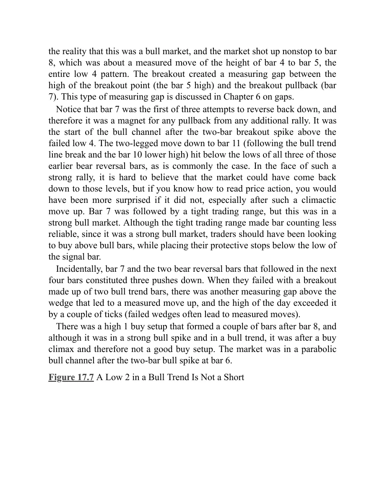

<!-- PDF page 321 -->

Low 2 设置不足以成为在没有先前强趋势线突破时做逆势交易的理由。事实上，它几乎总会失败并变成极好的顺势入场，如 High 2 做多，如图 17.7 中 bar 4 与 6 所发生。Low 2 是震荡区间或熊市中的设置，永远不是多头趋势中的，而这是多头趋势，所以交易者不应寻找 Low 2 设置。在做空强多头趋势前，你首先需要空头展示他们已经愿意积极。你寻找他们第二次尝试把市场推下时做空，而不是第一次，因为第一次通常失败。当多头趋势非常强时，你甚至可以考虑在前一根低点下方买入，预期任何 Low 1 或 Low 2 失败。例如，你可以在 bar 2 前形成的反转K线下方放置限价单买入，或在 bar 5 跌破前一根低点时买入，预期 Low 2 失败。一般而言，在前一根高点上方用止损买入更安全；但当多头趋势很强时，你几乎可在任何时候因任何理由买入，在前一根低点下方买入是合乎逻辑的，因为你必须预期多数反转尝试失败。

到 bar 4，市场在窄幅震荡区间中，所以K线计数变得令人困惑。你应在这一点忽略它，由于多头趋势如此强，只在任何多头K线上方用止损寻找买入，如 bar 4 后的那根。

## 图 17.8　失败 Low 2

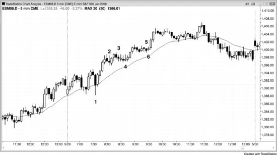

<!-- PDF page 322 -->

如图 17.8 所示，今天有跳空向下突破，然后突破回撤到均线略下方 bar 2 的双顶，随后是新低。在这一点，交易者不知道到 bar 3 的两段下跌是否结束了运动，还是还有更多（第一段是从昨日收盘到 bar 1）。尽管 bar 4 的 Low 2 做空到达了剥头皮止盈目标因此技术上不能是失败，跌破趋势线与向上反转使市场很可能像失败 Low 2 一样行为；它会至少再有两段上涨，然后尝试形成 Low 4 空头设置。

Bar 4 的 Low 2 做空有几个问题。首先，它跟随趋势线突破（向 bar 2 的反弹），意味着 bar 3 可能是当日低点（糟糕的做空位置），因为当日高或低通常在第一小时左右发展。其次，Low 2 离均线太远，因此不是好的均线测试。通常，对均线的第二次测试更接近均线或比第一次更深穿透，而 bar 2 的第一次测试 <!-- PDF page 323 --> 明显更近。许多交易者在回撤触及或接近均线 1 tick 左右之前不会舒服顺趋势入场。当反转在这发生前开始时，它会缺少那些做空本会提供的燃料。

Bar 6 形成 Low 4 设置，是均线上方的第二次上推。然而，这次反弹有许多重叠K线与几个十字星，表明多空双方相当平衡，大而快的下跌不太可能。因此，对偏好高概率交易与大盈利潜力的交易者，在这一点交易可能不值得。解决方案？要么等待更多价格行为，知道若你能耐心好设置总会来，要么做空但准备允许回撤，如入场后那根的回撤。

Bar 9 是连续第五根重叠K线，在这一点市场在窄幅震荡区间中。窄幅震荡区间中的K线计数太不确定，多数交易者不应在此基础上交易，直到突破之后。

## 图 17.9　失败 Low 2 可演变成 Low 3 或 Low 4

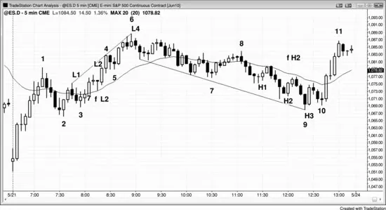

失败 Low 2 可导致楔形顶（Low 3）或 Low 4 顶，取决于从失败 Low 2 起向上的动量。有时它可直接变成多头趋势。图 17.9 中失败 Low 2 上方的突破由两根实体大、影线小的多头趋势K线构成，从 bar 3 起的运动在紧通道中。它也是跟随从开盘到 bar 1 非常强尖峰的通道。此外，Low 2 <!-- PDF page 324 --> 仅在一根后向上反转。这种强多头动量使在 bar 5 ii 形态下方做空太冒险。预期这个 Low 2 失败是合理的，因为它在多头通道早期阶段，通道常常有困住交易者在错误方向的回撤。到这一点多头的力量良好，可见通道的紧度、多头趋势K线的数量，以及相邻K线之间缺乏太多重叠。这些是坚实多头通道的迹象，因此应预期 Low 2 失败。

即便市场未交易到 bar 5 下方触发 Low 3，它仍是从 bar 2 起的第三次上推，因此起了与 Low 3 相同的作用。由于突破动量强，应预期再两段上涨。Bar 6 前一根略刺破趋势通道线并有空头收盘，bar 6 再次测试该线。这是至少两段下跌的合理 Low 4 做空设置。

当天稍后，High 2 失败但在 High 3（一种楔形）后转上而不是 High 4。从 High 1 与 High 2 起的上涨各持续数根，表明多头有一些力量。尽管失败 High 2 下方的突破很强，它是衰竭卖盘高潮。空头尖峰中K线实体增大是衰竭迹象，它发生在趋势通道线处与 bar 2 低点区域。由于 bar 2 是多头通道的起点，它是应预期被测试的磁铁，如此处。测试后，市场通常至少反弹到发展中震荡区间高度约 25%。由于向 bar 9 的三K线空头尖峰代表强空头动量，至少再有一段下跌可能。由于卖盘高潮，概率偏向至少两段横向到向上。这使买入 bar 10 更高低点成为好概率交易，尤其因为概率偏向在测试多头通道底部 bar 2 后尝试形成震荡区间。

### 对本图的更深入讨论

如图 17.9 所示，今天以失败突破开盘，在跳空向下突破后向上反转。有强多头趋势K线尖峰然后紧通道到 bar 1；整个运动很可能是更高时间框架图上的多头尖峰。当动量
<!-- PDF page 325 -->像这样强时，概率偏向回撤后至少第二段上涨，这使在市场回撤到多头通道起点 bar 2 区域后寻找做多设置合理。

这也是开盘即趋势多头日，bar 2 是第一次回撤做多的设置。Bar 3 是从 bar 1 到 bar 2 的多头旗形突破后的突破回撤做多设置。

交易者把从 bar 6 起的整个下跌段看作多头趋势中可能的回撤。High 2 离那个底部够近，但交易者不确定。无论如何，他们在寻找买入。还要注意从 bar 6 高点起的每一个新低都迅速反转。交易者在买入新低，所以买方一路向下都活跃。尽管从失败 High 2 起的下跌很强，它是三根增大尺寸的空头K线，是小型卖盘高潮。交易者可在 bar 9 上方买入并假定 bar 9 低点会守住（楔形低点），但最好等待回撤，它随 bar 10 更高低点到来。这导致收盘前强反弹，因为开盘多头恢复买入。

## 图 17.10　High 2 变体

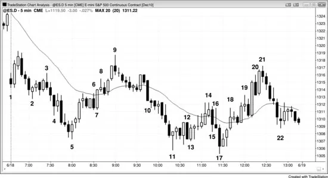

在图 17.10 中，bar 16 十字星顶部有大影线，表明市场在该K线内上下移动。那个向上运动是第一段下跌的终点，因此 bar 17 应像 High 2 一样行为，确实如此。

Bar 12 是均线下方的 Low 2 做空设置，但市场开始形成震荡区间，因此这不是可靠做空。事实上，在 bar 12 低点买入更有道理，但这只是有经验交易者应尝试的事。每当均线略下方有卖出信号且信号K线大并 <!-- PDF page 326 --> 大多与两根或更多K线重叠时，市场在小型震荡区间中，在底部做空通常是亏损策略。

### 对本图的更深入讨论

图 17.10 中当天以大跳空低开开始，因此是空头突破。尽管 bar 1 是空头趋势K线，它仍可能是开盘即趋势多头趋势日的第一根，尽管这比若它是多头趋势K线的可能性更小。交易者为失败突破反弹在 bar 1 高点上方买入。反弹只走了两根，然后空头在第二根多头K线下方与两K线反转下方（那个空头入场K线的低点）做空，为突破回撤做空与可能的开盘即趋势空头日。大跳空低开增加成为空头趋势日的机会，交易者应尝试做所有合理做空设置以波段向下。

Bar 4 是当天第三次下推，但它是空头尖峰的第三根，因此不是可靠的做多信号K线。交易者应等待突破然后回撤再做多。下一根是交易到 bar 4 上方的多头趋势K线并形成两K线反转，但市场未交易到两根顶部上方；它反而向下突破。Bar 2 前三根空头K线有足够动量，许多交易者会重新开始计数，并认为 bar 2 是第一次下推。

当 bar 4 形成时，一些交易者把它看作第三次下推，另一些只看作第二次，没有人知道哪组交易者会正确。有疑虑时，旁观并等待第二次信号。

Bar 5 是多头反转K线与两K线反转的第二根；它也是以 bar 2 空头尖峰开始的通道中的第三次下推。尖峰常常是第一次下推，如此处。在这一点，尖峰与通道多头买入，预期两次上推，把计数重置为 bar 2 尖峰的楔形交易者也买入这次第三次下推。怀疑 bar 4 是否是第三次下推的交易者在寻找突破回撤，并把 bar 5 看作更低低点突破回撤。此时所有交易者都相信所有这些因素在起作用，两段式反弹的概率良好。

Bar 5 后是到均线的四K线多头尖峰，这可能是第一段上涨的终点。

Bar 6 是 Low 2 做空设置，但由于第二段上涨可能，最好不做空剥头皮，而是寻找更低高点做多设置或这个多头旗形的突破。Bar 6 与前两根是形成两小段下跌的空头K线；它们因此在 bar 6 高点上方设置 High 2 做多。

Bar 8 是小十字星，但它可能是以 bar 6 结束的四K线多头旗形失败突破的最后旗形做空设置。然而，从 bar 5 到 bar 8 的运动在相当紧的多头通道中，因此不清楚 bar 8 是否是第二段上涨。有疑虑时，等待第二次信号。Bar 8 后是空头趋势K线，对做空的空头是好入场K线，但他们会在空头趋势K线上方回补。许多交易者在 bar 6 上方做多，因为有被困空头，且这现在也是失败 Low 2，其中 bar 6 是第一次下推。

<!-- PDF page 327 -->

Bar 9 是空头反转K线，是 bar 8 为第一次设置的第二次信号均线缺口K线，也是空头楔形顶部。从 bar 5 起的尖峰顶部是第一次上推，bar 8 是第二次。楔形反转通常至少有两段下跌，此处确实有。第一段结束于 bar 11，第二段于 bar 17。寻找从 bar 5 楔形底起两段上涨的多头满意于：从 bar 5 起的尖峰是第一段上涨，从 bar 6 底部起的通道是第二段上涨。

Bar 10 后三根试图与多头通道底部 bar 7 形成双底但失败。

Bar 10 是空头尖峰，随后是到 bar 11 的高潮通道。

Bar 11 是十字星，但它跟随从 bar 9 起的急跌，由于那个空头动量，市场很可能在向上反转前横盘。

Bar 12 是 Low 2 做空，但它是大信号K线且与前三根有大量重叠；因此这很可能是空头陷阱而不是好做空设置。失败 Low 2 导致到 bar 14 的六K线多头尖峰，但相邻K线之间有大量重叠，上涨在非常紧的通道中。即便通道向上倾斜，其紧度增加任何下行突破不会走很远、市场会被吸回通道区域的机会。这因此是可能的最后旗形，可导致多头反转。

市场向下尖峰到 bar 17，bar 17 是大多头趋势K线，因此是卖盘高潮。

随后的多头内包K线是至少两段式反弹的好设置，基于最后旗形反转、当天第三次下推（这与 bar 5 与 bar 11 创造大型楔形多头旗形），以及跌破开盘 bar 5 低点后第二次更低低点向上反转尝试。

Bar 17 也是缩小阶梯，因为它比 bar 11 低 2 tick，而 bar 11 比 bar 5 低 6 tick。这是空头趋势丧失动量的迹象。

Bar 19 是 Low 2 设置，但上行动量太强、信号K线太弱，不宜做空。入场K线是强空头趋势K线，但市场立即向上反转。警觉的交易者会预期 Low 2 失败，并在这根空头入场K线上方做多。

Bar 20 是从 bar 17 低点起的第三次上推与强空头趋势K线，但做空从未触发。市场再有一次上推到 bar 21，向下反转被一些交易者看作 Low 4，被另一些看作楔形顶，其中 bar 18 是第一次上推、bar 19 是第二次。其他交易者把它看作大型 Low 2，其中 bar 14 是第一次上推。

## 图 17.11　High 2 变体

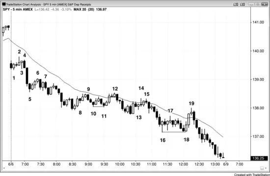

<!-- PDF page 328 -->

在图 17.11 中，bar 3 与 4 在多头波段中创造了两段式调整，即便 bar 3 后的那根是上涨段的终点。因为是两段式调整，bar 4 是 High 2 做多信号K线。

Bar 7 是空头趋势K线，因此不是可靠的 High 1 信号K线，但 bar 8 与它形成两K线反转，在 bar 8 多头趋势K线上方买入比在 bar 7 空头趋势K线上方买入成功交易的机会更大。尽管一些交易者把 bar 7 看作 bar 3 第一段上涨后的 Low 2 入场，上涨如此强以至于这可能是多头趋势；因此，做空 Low 2 是低概率交易。

Bar 8 是失败 Low 2 做多设置与 High 1 做多。

一些交易者会在 bar 9 下方做空，但多头通道太陡、信号K线太弱，不宜在这一点做空。

Bar 10 是 High 2 做多（bar 8 是 High 1），因为它跟随当日高点处两次尝试抛售（bar 7 与 10）。两次向下尝试的序列与两段式调整相同，所以它是 High 2 做多设置。它也是失败 Low 2 做多设置，很可能有被困空头在 bar 10 上方回补。此外，来自 bar 8 信号的一些空头会允许一次上推，但几乎所有人会在第二次上推时回补。这是 High 2 做多设置在多头趋势中如此可靠的原因之一。

<!-- PDF page 329 -->

一些交易者把 bar 12 看作 High 1 做多设置，另一些看作 High 2 做多设置，其中前一根十字星表示第一次小下推的终点。由于到 bar 11 的运动是楔形通道，它很可能有两段式横向到向下修正，所以在这里买入不是高概率交易。Bar 12 突破了多头趋势线，可能随后有更低高点或更高高点；无论哪种情况，空头很可能寻找为至少剥头皮向下而做空反弹。

所有这些分析都宽松，但其目标重要。交易者需要寻找两段式回撤，因为它们设置极好的顺势入场。此外，不要在多头趋势中寻找 Low 2 做空设置。

## 图 17.12　Low 2 变体

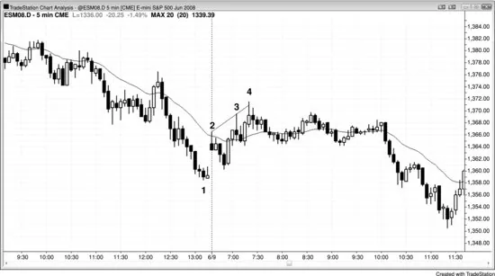

图 17.12 呈现的 SPY 图展示 Low 2 设置的大量变体，但若你思考每一个，每一个都是两段式空头调整的逻辑终点。由于图明显看空（在下降的指数移动平均线下方），交易者在寻找做空入场机会，所以任何类似 Low 2 的东西都够好。

Bar 3 是 Low 1，其高点被 bar 4 打掉，使 bar 4 成为第二次向上尝试与下一根触发的 Low 2 做空的设置。

<!-- PDF page 330 -->

Bar 6 是 Low 1 设置，两根后有多头趋势K线，表明上涨段。Bar 7 是随后一根做空的信号K线，即便它是比 Low 1 更低的入场。它仍是两段式调整。

Bar 8 是向上修正中的小空头内包K线，因此构成微小修正，结束第一段上涨。Bar 9 跟随另一根多头趋势K线（实际两根），所以它是第二次向下尝试，有效地是均线附近的 Low 2 做空。

Bar 11 低于 bar 10，所以它是向 bar 12 运动的起点。为何 bar 12 顶部后的那根是 Low 2？Bar 12 多头外包K线的低点在 bar 12 开盘后不久刺破前一根下方，尽管你无法从此图看出，但通过查看 1 分钟图（未显示）你可以确定。这使 bar 12 成为 Low 1。外包K线突破前一根两侧；你不知道它先突破哪一侧，尽管其实体方向通常可靠（例如，多头实体通常表明向上突破发生在第二，因为其方向向上进入收盘）。Bar 12 后的那根跌破 bar 12，所以是从 bar 11 起这段上涨中第二次有K线跌破前一根低点，因此是均线处的 Low 2 做空。Bar 12 也是 Low 2 做空设置，因为 bar 9 是第一次上移、bar 12 是第二次上移。

Bar 13 是 Low 1 做空入场K线（也是 Low 2，其中前三根的空头K线是 Low 1），但在两根强多头趋势K线后，这太冒险不宜做，因为更可能有更多向上修正。

一旦有第二段上涨（bar 14 有更高高点，所以它明显是小第二段），任何低点在前一根下方的K线都是 Low 2 做空。Bar 15 变成 Low 2 做空信号K线，即便它是低于两段上涨高点的小摆动高点（它是应预期至少两段下跌中的更低高点）。此外，如下一章讨论，bar 15 也是基于三次上推的楔形空头旗形入场，其中 bar 14 是第三次上推，bar 13 前两根多头趋势K线是前两次上推。

Bar 17 是 Low 2 设置，但它跟随两根有大影线的多头反转K线，所以交易者开始在此区域买入。这使在这里做空
<!-- PDF page 331 -->有风险，很可能K线下方买方比卖方多。你越确定市场在窄幅震荡区间中，你对K线计数就越不确定。一般而言，最好不要在窄幅震荡区间中基于K线计数做交易，除非你对计数非常有信心，意味着你相信计数够清晰值得做交易。

Bar 18 是与 bar 16 的双底，也是基于从 bar 17 起两次小下推的 High 2。

### 对本图的更深入讨论

如图 17.12 所示，当天有大跳空低开，因此是空头突破。第一根是空头趋势K线与可能的当日高点；因此，它是可接受的做空设置。然而，市场在下一根向上反转入失败突破做多设置，当天本可能变成开盘即趋势多头趋势日。大跳空低开仍偏向空头，除非多头以强多头尖峰与跟随清晰控制市场。

一旦市场交易到 bar 2 下方，市场在当天第一根后既有向下尖峰又有向上尖峰，且当天波幅不到近期平均日波幅的三分之一。这使开盘区间处于突破模式，可能成为趋势日，交易者在当日高点上方放置买入止损以在向上突破时做多，在 bar 1 低点尖峰下方放置卖出止损以在向下突破时做空。跌破 bar 1 的大多头趋势K线显示交易者做空有多积极。抛售可能归因于太平洋时间上午 7:00 的报告。然而，更可能的是机构已经计划今天做空，非常不可能他们被大量客户电话淹没——客户听到看空报告后突然决定卖出。机构已经在寻找做空，但希望报告有反弹以便他们在更高处做空。报告说服他们不会得到那个反弹，所以他们必须在报告后做空，并全天继续做空。

Bar 18 是窄幅震荡区间突破后空头趋势K线的终点，由于窄幅震荡区间的磁力吸引——它们常常成为最后旗形——很可能向上反转。

Bar 19 是空头趋势中的第一根均线缺口K线，因此是好做空。它是空头趋势日最后一两小时常常出现的空头陷阱的好例子。它在突破 bar 17 摆动高点上方并困住多头入场、困住空头出场的强多头尖峰顶部。所有多头尖峰都是高潮与突破，它们有时失败并导致向下反转而不是向上反转。在尖峰形成时，害怕错过主要反转的情绪化交易者在那第二根多头趋势K线形成时买入，在它突破 bar 17 更低高点上方时买入，在它收在高点时买入。强空头只是靠边让多头去。这些空头知道概率很高在当天结束前会有多头反转尝试，他们等待强多头趋势K线形成。一旦他们看到它，他们相信市场不会在那里守很久，所以积极做空。由于 <!-- PDF page 332 --> 他们与多头都知道空头控制当天，空头有信心能再次把市场推到当日新低。多头剥头皮平多，因为他们不相信向上反转有够多强多头反转的成分。没有先前对空头趋势线的强突破，且市场全天任何时候都无法守在均线上方。

## 图 17.13　尖峰与通道是两段式运动

当有尖峰与通道回撤时，尖峰可被看作第一段上涨，通道为第二段。在图 17.13 中，跳空开盘到 bar 2 是尖峰，是三次上推中的第一次。多头通道在修正前常常再有两次上推，整个形态在此图形成楔形顶。多数形态有多种解读，一些交易者基于一种交易，另一些更依赖另一种。向 bar 4 的运动被一些交易者看作楔形顶，被另一些看作两段式调整，其中跳空尖峰到 bar 2 是第一段，两段式通道到 bar 4 是第二段。
