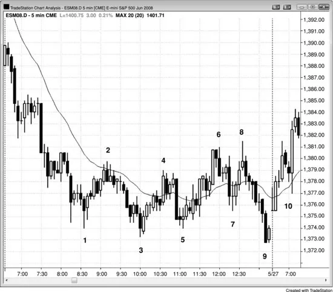
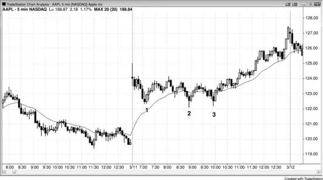
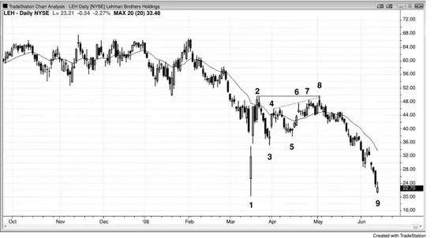
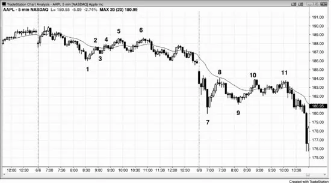
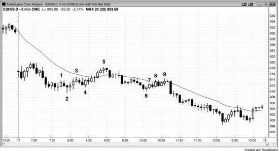
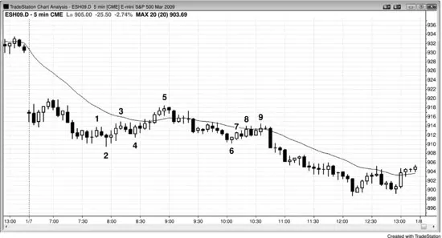
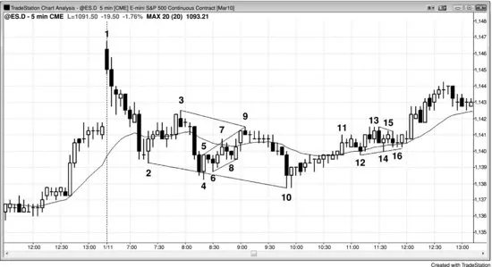

## 第18章　楔形与其他三推回撤

<!-- Source PDF pages 333–343 -->
<!-- English: Chapter 18: Wedge and Other Three-Push Pullbacks -->

<!-- PDF page 333 -->

# 第18章  
# 楔形与其他三推回撤

当回撤在多头趋势中形成时，它是多头旗形；当它在空头趋势中发生时，它是空头旗形。它常被包含在收敛的趋势线与趋势通道线之间。当情况如此且它水平时，它是三角形，可向任一方向突破。然而，当它在多头趋势中下跌或在空头趋势中上涨时，它被称为楔形，与所有回撤一样，它通常会向趋势方向突破。像其他类型三角形一样，它至少有五段，但与典型三角形不同，第二段常超过先前摆动点。它可以只是简单的三推楔形形态或尖峰后的通道。它也可呈现看起来完全不像楔形的不规则形状，但有三次逆势推进，那就是有资格成为三角形所需的全部，或者若它倾斜，则是楔形类三角形，或简单地说楔形。

楔形回撤是顺势形态，交易者可在第一次信号入场，一旦市场反转回趋势方向。楔形也可是可靠反转形态，但与楔形回撤不同，楔形反转是逆势形态，因此通常最好等第二次入场。例如，除非楔形顶极其强，交易者应等待空头突破然后评估其强度。若强，他们然后可看是否有突破回撤做空形态可做空。回撤可来自更高高点或更低高点。若突破弱，交易者应预期它失败，然后寻找买入形态，以便在失败空头突破上入场以恢复多头趋势。

若楔形反转在多头趋势中形成，楔形指向上，与多头趋势中指向下的楔形回撤不同。空头趋势中的楔形底部指向下，与指向上的楔形空头旗形不同。此外，楔形旗形通常是更小形态，多数持续约 10 到 20 根。由于它们是顺势形态，它们不必完美， <!-- PDF page 334 --> 许多是微妙的，看起来完全不像楔形或任何其他类型三角形，但有三次回撤。反转通常需要至少 20 根长并有清晰趋势通道线才足够强以反转趋势。

楔形也可在震荡区间中形成，当它们这样做时通常兼有楔形旗形与楔形反转的特征。若楔形强且有清晰双边交易，在第一次信号入场通常是盈利的。然而，每当你有任何合理怀疑时，等第二次信号。楔形反转在第三册趋势反转章节详述。

当楔形作为趋势中的回撤发生且趋势然后恢复时，其突破把逆势行为反转回趋势方向。记住，楔形通常是趋势的结束，回撤是小趋势（但与更大趋势方向相反），因此把楔形回撤看作类似楔形反转是有道理的。一般而言，若楔形向右上倾斜，无论它是空头趋势中的回撤还是多头趋势中的顶部，它可被视为空头旗形，即便没有先前空头趋势，因为它通常会向下突破。这是因为其突破行为与突破后的跟随与强空头趋势中空头旗形的无法区分。若它向右下倾斜，它可被视为多头旗形，无论它是实际多头旗形还是在空头趋势底部，通常导致向上突破。如后文讨论，Low 3 在功能上与楔形顶相同，事实上常是实际楔形，High 3 应像楔形底一样交易。

强趋势有时有持续几小时且缺乏多少动能的中午三段回撤。有时它是尖峰与通道形态，这是常见的楔形回撤类型。通道常有平行线而非楔形形状，但它仍是可靠的顺势形态。你称它为回撤、震荡区间、三角形、旗形、三角旗、楔形或任何其他都不重要，因为精确形状无关紧要，所有这些回撤变体都有相同意义。重要的是第三摆动把逆势交易者困在坏交易中，因为他们错误地假设第三段是新趋势的开始。这是因为多数回撤以两段结束， <!-- PDF page 335 --> 每当有第三段时，交易者会怀疑趋势是否已反转。

## 图 18.1　楔形空头旗形与扩展三角形

强趋势后常跟有典型低动能的三摆动回撤。在图 18.1 中，K线 4、6 与 8 是 K线 3 新低后三次回撤的顶部，每一次是多头趋势性摆动（更高高低点）。由于有许多与前一根重叠的K线、许多有影线的K线，以及许多空头趋势K线，上行动能弱。这会使交易者在每个新高做空。

也有扩展三角形（K线 1、2、3、8 与 9）。做多入场形态是 K线 9 后的内包K线，但这是当日最后一根。然而，次日跳空高开在信号K线上方（不要在跳空高开时买入；只有入场K线在信号K线高点下方开盘然后穿过你的买入止损时才入场），因此直到次日 K线 10 突破回撤才有入场。

<!-- PDF page 336 -->

## 图 18.2　楔形空头旗形

如图 18.2 所示，K线 9、15 与 22 形成大多头旗形，并形成 5 分钟 QQQQ 中三摆动序列的中段，在三天中展开（空头趋势，后跟三推反弹，然后对空头趋势低点的测试）。即便上行动能好，与先前空头趋势规模相比它实际上是次要的，其低点几乎肯定会被测试。对低点的测试发生在第三天开盘。到 K线 22 的楔形上行只是大多头旗形，在 15 或 60 分钟图上很容易被如此看到。

K线 4 处的楔形反转尝试太小而不能导致主要反转，交易者只能在更高低点后剥头皮。然而，K线 6 更高低点发生得太晚而无法交易。

当市场进入大震荡区间时，有许多导致可交易剥头皮的楔形回撤。由于市场在震荡区间中，交易者可在反转上入场而不必等第二次信号。然而，当楔形很陡时，通常更好等待。例如，K线 11、13 与 15 的楔形在相当窄的多头通道中，一些交易者可能更愿等在 K线 17 高点下方做空以获得预期的第二段下行。

<!-- PDF page 337 -->

K线 14、16 与 18 在到 K线 15 的强反弹后形成楔形多头旗形，交易者可在 K线 18 上方买入。然而，由于它是连续第七根下行K线，其他交易者会更愿等在 K线 20 更高低点上方买入。

## 图 18.3　跳空高开与楔形多头旗形

如图 18.3 所示，苹果（AAPL）的大跳空高开实际上是陡峭多头腿（多头尖峰）。随后有三次回撤，第三次是失败摆动（它未能走到先前低点下方）。为简单起见可称之为楔形，尽管它没有好的楔形形状。跳空高开是尖峰，到 K线 3 的横盘是导致多头通道的回撤。这是趋势恢复日的变体，此处第一段多头腿是跳空开盘。

### 对本图的更深入讨论

如图 18.3 所示，交易者应从 K线 3 入场波段持有部分或全部多单，预期大约等于缺口尖峰高度的等幅运动上行（昨日最后一根低点到今日第一根高点）。等幅运动也可以是 leg 1 = leg 2 类型，K线 3 是第二段上行的底部。

## 图 18.4　楔形空头旗形

<!-- PDF page 338 -->

在图 18.4 中，雷曼兄弟控股（LEH）在 K线 1 有大反转日，成交量巨大，被广泛报道为强支撑与长期底部。

K线 8 是楔形回撤（K线 4、6 或 7，与 8）与小三推形态（K线 6、7 与 8）的终点。它也与 K线 2 形成双顶空头旗形（K线 8 高 24 美分，但在日线图上够近）。

K线 1 是卖盘高潮，是向下尖峰后跟向上尖峰。市场然后常横盘，多头继续买入并尝试生成多头通道，空头继续卖出以尝试创造空头通道。此处空头获胜，多头不得不卖出平多，增加卖盘压力。该股很快交易到巨大 K线 1 反转K线下方，LEH——全国第三大投行——在几个月内倒闭。

K线 1 是单根岛形底部的例子，之前有衰竭缺口，之后有突破缺口。

## 图 18.5　楔形空头旗形的更高高点突破回撤

<!-- PDF page 339 -->

如图 18.5 所示，有到 K线 6 的两段调整，第一段结束于 K线 5。K线 5 是楔形，但常如此，它实际上是两段，第二段由两个更小段组成（K线 4 与 5）。到 K线 1 的行情是小尖峰，然后 K线 2、4 与 5 是通道中的三次上推。从 K线 5 起的抛售是多头通道下方突破，该突破的回撤是 K线 6 的更高高点。

从 K线 7 起有第二次三段调整。你把它看作三角形还是两段——一段从 K线 7 到 8，另一段从 K线 9 到 11 且第二段由两个更小段组成——并不重要。趋势中的三段调整很常见，有时它们真的只是两段，第二段有两个更小段。当想起来这么难时，停止想任何事，只想趋势与市场无法远高于均线。寻找做空入场，若那些想法给你不下单的借口，不要太担心数段。

## 图 18.6　作为楔形多头旗形的尖峰与通道

<!-- PDF page 340 -->

有时回撤可以是小尖峰与通道形态，创造楔形多头旗形（见图 18.6）。此处有多头上行，然后小尖峰下行至 K线 1，那是尖峰下行的第一次推进，后跟再两次下推。尖峰后的通道常以三推结束，这一次成为楔形多头旗形与当日更高低点。从 K线 3 起有第二次上推，其规模约与开盘反弹离低点的反弹相同（leg 1 = leg 2 等幅运动）。

当第一次与第二次下推都有强动能时，不要太急于买入第二次下推后的 High 2。强第一次尖峰下行常意味着你应允许可能的楔形调整。等待 High 2 信号K线上方突破的回撤（此处为 K线 2 的两K线反转）。该第二次入场形态可以是更高低点，或如此处为更低低点，形成楔形多头旗形。与所有尖峰与通道形态一样，最小目标是通道起点，即 K线 1 后高点，有足够空间至少做多剥头皮。市场超过最小目标并测试开盘反弹高点，在那里形成大双顶空头旗形，导致进入收盘的空头趋势。

## 图 18.7　楔形旗形

<!-- PDF page 341 -->

三推回撤常设置可靠顺势入场（见图 18.7）。

K线 1 是 Low 2，它成为空头反弹中三次上推的第一次。K线 2 是否在导致 K线 1 上推的那根低点下方并不重要，事实上当最后旗形演化成更大形态时这很常见。此处，该更大形态是在 K线 5 以第一次均线缺口K线结束的三推上空头反弹。它也是小尖峰与通道多头趋势，到 K线 3 的行情是尖峰，从 K线 4 到 K线 5 的反弹是通道。小尖峰与通道常是两段反弹，由于它跟随 K线 1 上推，那两段是楔形空头旗形的第二与第三段。

开盘跳空低开是空头尖峰，到 K线 2 的行情是通道。K线 5 测试通道顶部并与之形成双顶。

K线 7 到 9 形成三推回撤，是在均线停顿的略上升窄通道。一般而言，只有非常有经验的交易者应考虑在窄幅震荡区间中下单，因为它们难以解读，这降低任何成功交易的概率。

K线 9 与 K线 6 前第四根形成双顶空头旗形，那是空头尖峰后空头通道的起点。

## 图 18.8　三推形态

<!-- PDF page 342 -->

图 18.8 所示 5 分钟 Emini 图中有几个楔形回撤。K线 2、4 与 10 上的三次下推创造典型楔形反转形态，但由于它是在 K线 1 见顶的多头趋势中的大调整，它是楔形回撤。回撤持续足够久构成小空头趋势，但该空头趋势只是更大多头趋势中的回撤。

K线 5、7 与 9 是通道中的三次上推，形成从 K线 3 到 K线 4 短暂强下行的调整。你可用K线极端或实体顶底画线。由于楔形回撤的形状常如此不规则，不精确的趋势线与趋势通道线是常规而非例外。

K线 12、14 与 16 在从 K线 10 起的反弹中形成横盘调整中的三次下推。三角形是三推形态的一种。注意 K线 13 高点超过 K线 11 高点。第一次下推后的反弹常超过刚在其前的摆动高点。

一旦 K线 9 成为空头反转K线，你可用 K线 5 高点画最佳拟合趋势通道线，K线 7 高点在线上方并不重要。同样，一旦市场在 K线 10 后形成多头内包K线并设置楔形底买入，你可连接 K线 2 与 10 的底部以突出楔形，第二次下推 K线 4 在线下方无关紧要。

## 图 18.9　失败的楔形多头旗形

<!-- PDF page 343 -->

在图 18.9 中，5 分钟 Emini 试图形成楔形多头旗形但失败。K线 5、7 与 9 是三次下推，设置楔形多头旗形做多，但 K线 9 附近没有可靠信号K线去做多。这本会与 K线 3 后的回撤形成双底。市场没有形成强多头反转形态，而是进入小窄幅震荡区间。K线 11 下方突破信号楔形底部失败，并设置大约等幅运动下行的可能性。K线 11 成为进入收盘的延长空头通道的尖峰。
