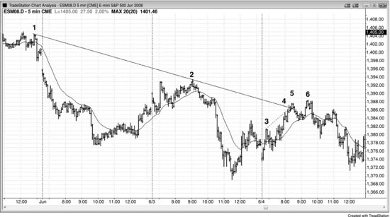
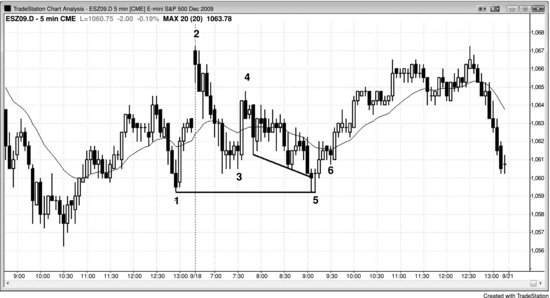

## 第 19 章：对决线：回撤到趋势线的楔形

<!-- Source PDF pages 344–347 -->

<!-- PDF page 344 -->

第 19 章
对决线：回撤到
趋势线的楔形
当回撤被趋势通道线约束，并在更高时间框架的支撑或阻力线处结束时，这就是对决线形态，它常常带来可靠的顺更大趋势方向的交易。它是短期趋势（回撤）在长期趋势的支撑（多头趋势中）或阻力（空头趋势中）处结束。所有回撤都以对决线形态结束，尽管支撑或阻力线并不总是显而易见。任何类型的支撑或阻力都可以是强手进场并结束回撤的区域。每当交易者看到回撤接近趋势线、趋势通道线、移动平均线、先前摆动低点或高点、或任何其他关键价位时，都应警惕会导致回撤结束与趋势恢复的形态。当他们看到该形态时，就处于做出出色交易的位置。记住，交易正日益由数学控制，回撤的结束是有原因的。多头趋势中的回撤总在支撑位结束，空头趋势中的回撤总在阻力位结束，因此所有回撤都是对决线形态。然而，我把该术语保留给交易者能看到支撑或阻力的那些回撤，以便他能预期可能的趋势恢复并下单。最可靠的形式是：回撤处于通道中并呈楔形或三段式，而回撤结束的信号K线是刺穿趋势线后反转的那根。例如，若存在多头趋势，它正在形成在多头趋势线处结束的楔形多头旗形回撤，楔形多头旗形下方的趋势通道线在下降，并在回撤酝酿买入信号时恰好与上升的多头趋势线相交。支撑线可以是水平线，例如横跨先前摆动低点，这可以在楔形结束时酝酿双底 <!-- PDF page 345 --> 买入信号。支撑也可以来自移动平均线。当这种情况发生时，若有足够的形态，寻找顺趋势方向入场。
再举一例，看一条空头通道，看通道内是否有一段上行。若有，看该段是否有三段上推。若小空头反弹在测试其高点画出的趋势通道线的同时，也在测试空头趋势线，则该上行段很可能结束，市场会向下反转测试通道下端。若市场此时转下，它是因为同时测试两条阻力线——即便一条上升、一条下降——而两种阻力同时影响市场，会增加获利交易的机会。
图 19.1 对决线回撤

所有回撤都以对决线形态结束，即便长期支撑不易看见。回撤是与更大趋势相反方向的小趋势。所有回撤总有结束的理由，多头回撤总在某种更长期支撑处结束，如趋势线、等幅运动或先前摆动高点或低点。在图 19.1 中，在 K线 3 与 5 之间画出的空头趋势通道线为 K线 6 提供了支撑。画趋势线与趋势通道线时应考虑所有摆动点，甚至来自先前趋势的。K线 3 是多头趋势中的摆动低点，K线 5 是可能的新空头趋势修正中的摆动低点。下行至 <!-- PDF page 346 --> K线 6 最终只成为多头市场中的大两段式修正。在 K线 6 有对决线（斜率相反的多头趋势线与空头趋势通道线），市场在交点处向上反转，这很常见。由于下行至 K线 6 很陡，合理的做法是等待 K线 7 更高低点处的第二次入场，在其高点上方 1 tick 用止损买入。
空头趋势通道线也可以基于跨过 K线 4 高点之后两个摆动高点画出的趋势线，然后锚定到 K线 5。目标是看整体形状，然后选择任何包含价格行为的趋势通道线。然后观察市场在刺穿该线后如何反应。
对本图的更深入讨论
图 19.1 中 K线 6 是楔形多头旗形。在下行至 K线 6 之前还有双顶空头旗形，多头顶部之后的双顶空头旗形可视为有两个峰的更低高点。
图 19.2 对决线

如图 19.2 所示，K线 5 测试了空头趋势线，与此同时对更小的多头趋势通道线（从 K线 3 到 K线 4）出现超调，从而从对决线形态走出剥头皮做空。在 K线 6 名义更高高点处有第二次入场。由于上行至 K线 5 如此 <!-- PDF page 347 --> 强劲，市场在跌破陡峭多头通道并测试移动平均线之后出现突破回撤到 K线 6 更高高点并不令人意外。通道未画出，但是上冲至 K线 3 的多头尖峰之后的那条。
图 19.3 对决线变体

图 19.3 是对决线的一种变体，长期支撑以先前摆动低点处的水平线形式出现，结果是双底。这导致在这个震荡日上从当日新低向上反转。开盘抛售是空头尖峰，从 K线 4 到 K线 6 的运动是通道。
对本图的更深入讨论
图 19.3 中市场向上突破摆动高点，但今日第一根是空头趋势K线，酝酿了失败突破做空。这也是扩展三角形顶部，可用昨日 11:05 或 11:55 a.m. PST 的K线作为第一段上推。有上冲至 K线 4 的尖峰，随后是更低低点回撤至 K线 5，与 K线 1 形成双底多头旗形。这导致三小时反弹（K线 4 多头尖峰之后从 K线 5 起的通道上行），然后进入收盘的抛售。即便它是震荡日，在日线图上却表现为空头趋势日，因为它开在高点附近、收在低点附近。
