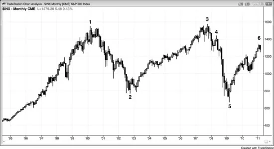
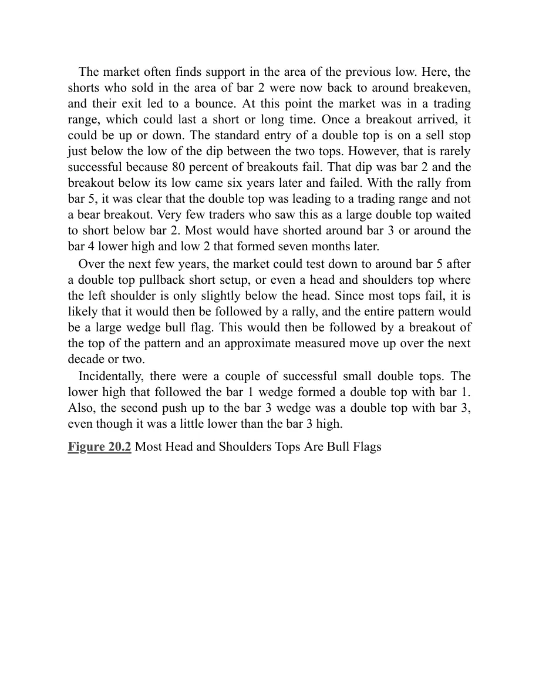
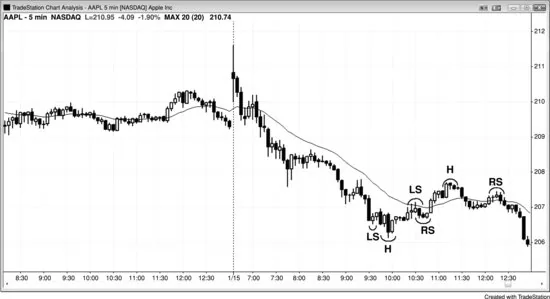

## 第 20 章：「反转」形态：双顶与双底、头肩顶与头肩底

<!-- Source PDF pages 348–353 -->

<!-- PDF page 348 -->

第 20 章
「反转」形态：双顶与
双底、头肩顶与
头肩底
由于趋势不断制造反转形态，而除了最后一个之外全部失败，把这些常被讨论的形态当作反转形态是误导性的。更准确的是把它们当作延续形态——很少失败，但一旦失败，失败可能导致反转。把每一个顶或底都看作绝佳反转形态是错误的，因为若你做所有那些逆势入场，你的多数交易会亏损，偶尔的盈利不足以抵消亏损。然而，若你有选择性地寻找趋势可能反转的其他证据，这些可以是有效的形态。
所有头肩顶与头肩底其实都是头肩延续形态（旗形），因为它们是震荡区间，而像所有震荡区间一样，它们更可能朝趋势方向突破，仅很少反转趋势。双顶与双底也是如此。例如，若多头市场中有头肩顶，跌破颈线的突破通常会失败，市场最可能随后向上反转，并有顺势向上突破右肩。若形态大体水平，它成为三角形；若略向下倾斜，则成为楔形多头旗形。三段下推是左肩、头部与右肩之后的下行腿。由于从头部的下行通常跌破多头趋势线，右肩成为更低高点的突破回撤。此外，若空头市场正在形成震荡区间，且该震荡区间呈现

<!-- PDF page 349 -->

头肩顶形状，跌破颈线是空头旗形的顺势突破，很可能导致更低价格。
同样，头肩底也是顺势形态。空头趋势中的头肩底通常是三角形或楔形空头旗形，应向下突破右肩。多头市场中的头肩底是多头旗形，应向上突破颈线。
图 20.1 处于 12 年震荡区间中的标普现货月线图

如图 20.1 所示，标准普尔（S&P）现货指数月线图上有一个大双顶。2007 年夏当市场测试 2000 年高点时，所有在 K线 1 区域买入的交易者都想拿回他们的钱。他们曾一路承受下行至 K线 2 的毁灭性亏损。然而，到 K线 3 时他们已收复那些亏损，不想再冒另一轮抛售的风险。他们平仓，并在显著回撤之前不想再买。随着一大批买家退出市场，空头取得控制并推动市场下行。正如经常发生的那样，当交易者想在回撤时买入时，回撤却深且猛烈，使他们改变主意，而这种买盘缺失有时会加速卖压。原因显然远比这复杂，因为有无数参与者以无数理由行动，但这是一个组成部分。

<!-- PDF page 350 -->

市场常在先前低点区域找到支撑。这里，在 K线 2 区域做空的空头现在大约回到保本，他们的离场导致反弹。此时市场处于震荡区间，可能持续短或长时间。一旦突破到来，可能向上或向下。双顶的标准入场是在两个顶之间下探低点下方用卖出止损。然而，这很少成功，因为 80% 的突破会失败。那个下探是 K线 2，跌破其低点的突破在六年后到来并失败。随着从 K线 5 的反弹，双顶显然正导致震荡区间，而非空头突破。很少有把这看作大双顶的交易者会等待在 K线 2 下方做空。大多数会在 K线 3 附近，或在七个月后形成的 K线 4 更低高点与 Low 2 附近做空。
在随后几年中，市场可能在双顶回撤做空形态之后，甚至在左肩仅略低于头部的头肩顶之后，再次测试 K线 5 附近；由于大多数顶部会失败，很可能随后是反弹，整个形态成为大楔形多头旗形。然后会跟随形态顶部的突破，并在接下来一二十年中大约等幅上行。
顺便说一句，有几个成功的小双顶。跟随 K线 1 楔形的更低高点与 K线 1 形成双顶。此外，到 K线 3 楔形的第二段上推与 K线 3 形成双顶，即便它略低于 K线 3 高点。
图 20.2 大多数头肩顶是多头旗形

<!-- PDF page 351 -->

图 20.2 所示高盛（GS）日线图上有多个头肩顶。头肩形态很可能比几乎任何其他形态让更多初学者亏钱，这可能是因为太多评论员把它们称为反转形态，而它们几乎总是延续形态。头肩顶其实是三角形或楔形多头旗形，是可靠的买入形态。它们是楔形，因为有三段下推：一段在左肩之后，第二段在头部之后，第三段在右肩之后。由于它们是多头趋势中的水平震荡区间，它们应像多头趋势中任何其他震荡区间一样表现，并导致多头突破，这说得通。有时，像所有延续形态一样，它们未能导致顺势突破，随后出现反转，因此给它们贴上顶、底或反转这类标签是误导性的。这些术语使交易者去做与他们应该做的相反的事，因此最好不要使用它们。当你在多头趋势中看到一个正在形成时，最好把它当作楔形多头旗形并那样称呼，因为那样你会寻找在多头趋势中的停顿处买入，这是有利可图的策略。你不应称它为头肩顶，因为它几乎肯定不是顶。同样，若你在空头趋势中看到正在形成的头肩底，更准确的是改称三角形或楔形空头旗形，因为这会让你寻找做空，而这是在空头趋势中赚钱的最佳方式。

<!-- PDF page 352 -->

市场总在尝试反转，而反转尝试通常在即将反转始终持仓方向时结束。上面所有头肩顶都是完美例子。许多向下突破，但这不足以让交易者相信趋势已经反转。交易者还想看到跟随。由于有经验的交易者知道大多数向下突破不会有跟随，他们把这些空头突破看作绝佳买入机会。正当过于急切的弱势空头在跌破颈线、触发头肩顶「反转」的强空头趋势K线处做空时，强多头进场并积极买入，正确相信空头反转很可能失败，并只是成为多头旗形。
图 20.3 头肩顶与头肩底空头旗形

如图 20.3 所示，Apple（AAPL）中有失败的头肩底与头肩顶空头旗形。市场处于开盘即空头趋势，并试图形成头肩底（左肩、头部、右肩），正如预期，它未能反转市场，反而演化为更大的空头旗形。楔形空头旗形的第三段上推成为头肩顶空头旗形的头部。该头肩顶的头部是在 11:15 a.m. PST 第一根均线缺口K线处结束的两段式反弹的终点。市场试图在该头部之后形成更高低点，但失败了，小反弹成为右肩，它是

<!-- PDF page 353 -->

上冲至头部的通道的突破回撤。突破导致对空头低点的测试，这在强空头趋势中第一根均线缺口K线之后是预期之中的。
