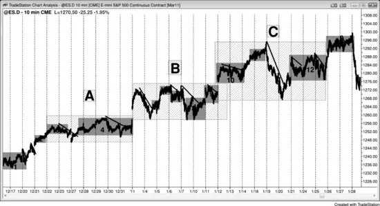
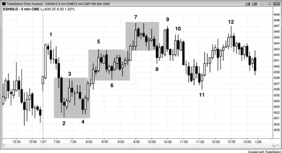
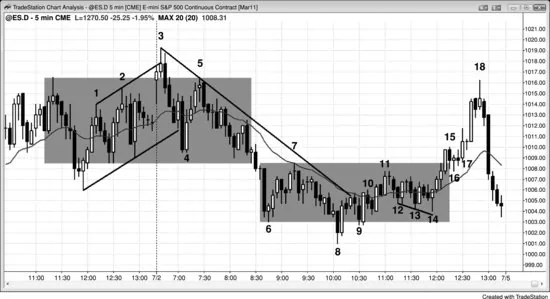
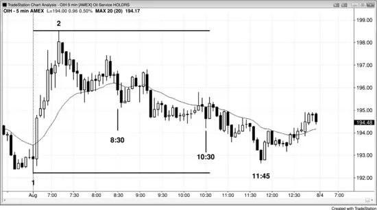
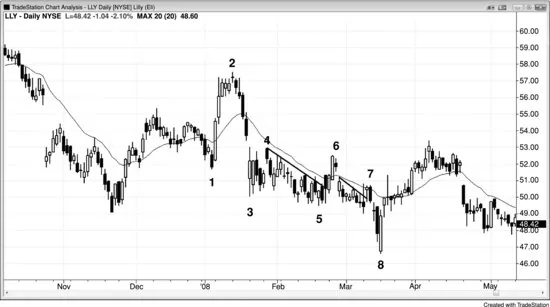
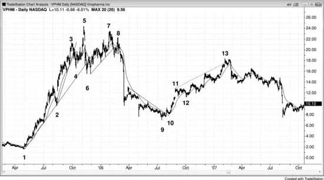
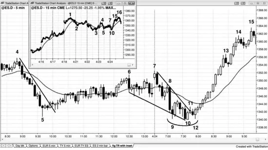
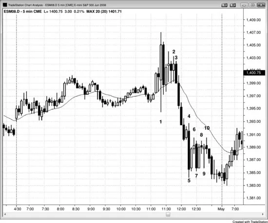

# 第四部分 震荡区间

<!-- English: Part IV: Trading Ranges -->
<!-- Source PDF pages 354–397 -->

<!-- PDF page 354 -->

第四部分
震荡区间
震荡区间最宽泛、也最有用的定义是：它只是一个双向交易的区域。它可以小到单根K线（十字星K线），也可以比你屏幕上的所有K线都大。它可以大体呈水平状，表明多头与空头处于平衡；也可以略有倾斜。若向上倾斜，多头更积极；若向下倾斜，空头更强。若倾斜过甚，则应视为趋势通道而非震荡区间。它可以有持续许多根K线的大幅摆动，也可以非常紧凑、每次摆动只持续一两根K线，从而形成窄通道。当它呈水平时，约束它的线就是支撑线与阻力线，支撑线在下、阻力线在上。
“震荡区间”一词通常用于图表上任何未在趋势中、大体呈水平的区段，但对交易者而言，采用更宽泛的定义更有用——一旦你知道存在双向交易，就可以寻找双向交易的机会。许多初学者过于急切地寻找反转，在市场尚未足够可能从趋势过渡到震荡区间之前就忍不住去做。然而，一旦有足够证据表明过渡正在发生，往往会出现高概率的逆势剥头皮甚至波段形态。关键是要等到有足够证据再做。有些形态通常不被当作震荡区间，但实际上符合更宽泛的定义——图表上任何发生双向交易的区域，而这种情况在大部分时间都存在。趋势中有短暂的尖峰阶段，双向交易很少，但趋势中的大部分价格行为都有某种双向交易，因此属于某种震荡区间。
回撤是一种震荡区间，交易者认为趋势很快会恢复。传统意义上的震荡区间是不确定区域，趋势可能恢复也可能反转，但大多数尝试

<!-- PDF page 355 -->

突破都会失败。多头中的上升通道与空头中的下降通道是倾斜的震荡区间，因为二者都有双向交易，但趋势交易者比逆势交易者更积极。它们也是尚未明显的震荡区间中的第一段。例如，市场以一连串大实体、小影线、几乎无重叠的多头趋势K线向上尖峰后，很快进入一个阶段：K线重叠更多、影线更大、出现一些空头实体、斜率更缓，并出现回撤（即使只持续单根K线）。这是多头通道，但所有通道本质上都是震荡区间，因为它们代表双向交易。若通道陡峭向上且回撤很小，空头虽在，却被多头压倒。通道由一系列小震荡区间构成，每个之后有一次小突破，再导向另一个小震荡区间。随着通道成熟，摆动变大，多头变得不那么积极，空头更积极。会出现跌破通道下方的突破，然后通常会测试通道底部。此时，市场有一段向上（多头通道）和一段向下（对通道底部的测试），大多数交易者会把整体形态看作震荡区间。它可能形成双底多头旗形，或在某个点空头取得控制，出现向下尖峰，过程反转。
以下是震荡区间中常见的一些特征：
对即将发生的突破方向有不确定感。事实上，不确定是震荡区间的标志；每当大多数交易者不确定时，市场就处于震荡区间（趋势则带有确定感与紧迫感）。
然而通常，震荡区间最终是趋势恢复形态，意味着它只是更高时间框架图上的回撤。
几乎所有交易看起来确定性都不超过55%。
同时形成合理的多头与空头形态。
屏幕上有若干次方向变化。
整体价格行为大体水平，屏幕左右边缘的K线位于屏幕垂直方向的中间三分之一

<!-- PDF page 356 -->

。
大多数K线在屏幕中部，顶部与底部附近有急剧反转。
市场反复触发止损，常伴有强趋势K线，但下一根K线又反转方向。例如，市场出现两根跌破强摆动低点的空头趋势K线，但下一根又向上反转。
有许多多头与空头趋势K线，但很少出现连续三根或四根多头趋势K线或空头趋势K线。
许多K线有显著影线。
许多K线与前一根重叠50%或更多。
有许多区域出现三根或更多K线，各自与前一根K线区间重叠50%或更多。
有许多十字星，可大可小。
移动平均线相对平坦。
屏幕左侧之外的价格行为也曾处于震荡区间。
刚刚出现过令人印象深刻的买盘或卖盘高潮。
真空效应存在，导致顶部出现强多头尖峰、底部出现强空头尖峰，二者都未能突破，反而反转回区间内。
许多段会再细分为两个更小的段，然后反转成相反方向的两段式移动。
底部的Low 1与Low 2做空形态、顶部的High 1与High 2买入形态通常会失败。
信号K线常常看起来疲弱，即使是第二次入场。
任何双向交易的区域，即使只持续单根K线，都是震荡区间。当你把震荡区间称为回撤时，你相信趋势很快恢复的概率有利，因此你很可能只做趋势方向的交易。每个交易者标准不同，但一般而言，若你约有60%或更高把握认为你的交易很快会跟随趋势恢复，你就认为该形态是回撤。若相反你对

<!-- PDF page 357 -->

交易之后会有突破的把握较低，则该形态是震荡区间。震荡区间只是持续太久、失去了短期预测力的回撤，约80%的向上或向下突破尝试会失败。若你在底部附近买入，市场很可能交易到顶部，但不会突破，而是出现卖出形态，市场回到你做多入场的区域。若你在顶部附近做空，市场很可能跌到足以剥头皮获利，然后再次回升到你入场价附近。最终，概率仍偏向于震荡区间之前的趋势会恢复，因为它只是更高时间框架图上的回撤；然而，若它在你交易的图上持续数日，你若只做那一笔顺势交易并等待突破，就会错过许多交易机会。虽然你可以把它当作更高时间框架图上的回撤来交易，但大多数交易者发现，只看并只交易单张图更容易赚钱，即使他们也意识到更高与更低时间框架图上的形态。
对于回撤，你通常应只寻找趋势方向交易，除非回撤可能大到足以做逆势剥头皮。大多数交易者仍应等待顺势形态，因为逆势剥头皮对除最有经验交易者以外的所有人都是亏损策略。若你做逆势，只有在你相信市场将进入震荡区间而不仅仅是回撤时才应如此。在震荡区间中，你可以双向交易，知道大多数向上与向下的突破尝试会失败。然而，若多头市场中震荡区间底部有特别强的形态，你可以考虑波段持有全部或部分仓位。同样，若强空头趋势之后的震荡区间顶部有强卖出形态，你应波段持有部分或全部空头仓位。
多头市场中大多数震荡区间的最后一段向下是空头通道，这是空头创造顶部与新空头趋势的最后尝试。空头通道是多头旗形。多头可以在震荡区间底部的向上反转买入，或在通常很快随后出现的突破回撤上买入。当震荡区间处于多头市场中时，上涨往往比回撤更强，尤其在震荡区间接近结束时。此外，每一次回撤都充当旗形。下一次上涨是

<!-- PDF page 358 -->

该多头旗形的突破，而下一次回撤是突破回撤形态，同时也是另一个多头旗形。其中一个多头旗形将是最后一个，其突破将成为多头趋势恢复中的下一段上涨。由于所有震荡区间在更高时间框架图上都是回撤，该突破也将是更高时间框架多头旗形的突破。空头趋势中的震荡区间情况相反，最后一段通常是多头通道，即空头旗形。
通道最终通常会演化成震荡区间，交易者总在寻找过渡的最早迹象，因为通道是趋势，交易者不如在震荡区间中那样愿意逆势交易——在震荡区间中交易者双向交易。一旦交易者相信它已变成震荡区间，就会出现相反方向的尖峰与通道。有时趋势会反转（大多数反转形态是震荡区间），但更可能的是，市场会再至少10或20根K线处于震荡区间。
每个通道都有双向交易，通常是震荡区间的开端。然而，只要高低点仍在趋势化，通道仍然有效，市场尚未转化为震荡区间。例如，在上升通道中，当市场接近最近的更高低点时，多头会积极买入所有回撤，因为他们希望每个人都仍把市场看作通道（一种多头趋势），而不是震荡区间。这会使其他交易者更可能买入，上涨更可能延续，他们的利润增长。有时市场会跌破一个次要更高低点并找到买盘。这个新低点成为新的、更平坦的趋势线（从通道底部）以及更缓、更宽通道的基础。它表明价格行为正变得更加双向，因此更像震荡区间，但仍在通道中。一旦市场明确进入震荡区间，交易者将开始在上涨中卖出，这将削弱多头继续推高市场的能力并限制其获利能力。只要他们能让市场继续向上趋势，他们就知道大多数交易者只会寻找买入。市场往往会回撤到最近的更高低点并形成双底多头旗形。这对多头是可接受的，因为他们知道这是看涨形态，若形态触发（交易到信号K线高点上方），市场会预期大约等幅运动向上。

<!-- PDF page 359 -->

至少他们那时对上涨可能走多高有一个概念，这会给他们一个获利目标。
当市场处于趋势的尖峰阶段时，它非常单向，回撤由机构获利了结造成，而不是由他们反向交易造成。随着回撤加深，逆势交易者开始剥头皮。一旦回撤成长为震荡区间，更多逆势交易者在剥头皮，有些在分批加仓做空。顺势交易者对趋势还能走多远变得不那么有信心，他们从波段交易过渡到更多剥头皮。这就是为什么在震荡区间中，多头与空头的剥头皮都占主导。双方都在低买高卖。底部的买盘来自多头开多与空头获利了结，顶部的卖盘来自空头做空与多头获利了结。由于交易者的工作是跟随机构，他也应当剥头皮，在区间底部附近买入、顶部附近卖出。每当市场处于震荡区间，交易者应立即想到：“低买、高卖、剥头皮。”
震荡区间有双向交易，多头在底部附近更强，空头在顶部附近更强。震荡区间中的每一次上涨本质上都是空头旗形，每一次下跌实际上都是多头旗形。因此，交易者像在空头趋势中交易空头旗形那样交易区间顶部。他们在K线上方与下方、在阻力上方与支撑下方卖出。他们在K线上方卖出，包括强多头趋势K线，以及在每一种阻力上方卖出，因为他们把每一次向上移动看作突破区间顶部的尝试，而他们知道大多数突破尝试会失败。他们在K线下方与每一种支撑下方卖出，因为他们把每一次向下移动等同于空头趋势中空头旗形底部的突破。他们预期突破震荡区间上方的尝试会失败，空头旗形突破会成功，市场很快会向下反转并测试区间底部。他们像在多头趋势中交易多头旗形那样交易区间底部。他们在K线上方与下方、在阻力上方与支撑下方买入。他们在K线下方买入，包括强空头趋势K线，以及在每一种支撑下方买入，因为他们把每一次向下移动看作突破区间底部的尝试，而他们知道大多数突破尝试会失败。他们在K线上方与每一种

<!-- PDF page 360 -->

阻力上方买入，因为他们把每一次向上移动等同于多头趋势中多头旗形顶部的突破。他们预期跌破震荡区间下方的尝试会失败，多头旗形突破会成功，市场很快会向上反转并测试区间顶部。
当图表处于趋势中时，震荡区间相对较小，更宜描述为回撤，因为它们只是趋势中的短暂停顿，随后会测试趋势极端。若测试没有到来而市场反转，起初看似回撤的东西已演化为反转形态。若图表由贯穿整个屏幕的向上与向下摆动构成，则多头与空头都不占主导，他们交替控制市场，图表便处于震荡区间。每个摆动都是可交易的小趋势，尤其在更小时间框架上。在更大时间框架上，震荡区间将是趋势中的回撤。例如，大体为大型震荡区间的5分钟图，在60分钟图上很可能只是趋势中的回撤；60分钟震荡区间在日线或周线图上则是回撤。
许多交易者使用旗形、三角旗或三角形等描述性名称，但名称无关紧要。重要的只是正在发生双向交易。市场处于突破模式，某个点它会向任一方向突破进入另一趋势。多头与空头都认为这一价格区域是好价值区域，双方都在开仓。价值存在于极端。市场要么太便宜（在支撑处），要么太贵（在阻力处）。震荡区间中部对多头与空头也是价值区域，因为双方都把它看作极端。多头相信市场在筑底因此处于低位，空头则看作见顶处于高位。若市场略微下跌，空头会卖得更少，多头会在这一更好、更极端的价格上更积极。这将倾向于把市场抬回区间中部。若价格升近区间顶部，多头会买得更少，因为他们会觉得市场有点贵。空头则相反，会更急切地在这些更好价格上卖出。
即使陡峭的通道也代表突破模式。例如，若有陡峭的多头通道，市场可以突破通道顶部，趋势可以向上加速。当这种情况发生时，突破

<!-- PDF page 361 -->

通常在一两次尝试后失败，且通常在约五根K线内；若市场反转回通道内，通常会刺穿通道另一侧，并常常跟随更大的调整或反转。即使突破尖峰持续数根K线，通常很快会有回撤测试通道，并常常重新进入通道、突破另一侧，然后至少跟随两段式调整，有时是趋势反转。
在5分钟Emini图上，当市场处于相对窄幅的震荡区间、摆动在反转向区间另一侧之前只有两到四根K线长时，往往发生的比表面上看起来多得多。人们容易把价格行为简单归因于成交清淡的随机漂移；但若你看成交量，往往会发现K线平均有10,000张或更多合约。这不是清淡交易。很可能是许多机构在区间内运行买入程序，而另一些机构运行卖出程序。当市场接近区间顶部时，卖出程序更积极地卖出；接近底部时，买入程序压倒卖出程序。双方都赢不了。某个点，要么买入程序在区间顶部压倒卖出程序、市场突破进入上涨，要么卖出程序在区间底部压倒买入程序、市场出现空头突破。然而，震荡区间在那之前可能有十几次或更多上下摆动，由于那十几次左右的突破尝试在一次最终成功之前都失败了，赌它们失败远好于在每次突破尝试上入场。重要的是要理解，突破在每张图上都很常见，但大多数会失败，如第一部分关于突破的章节所讨论。
震荡区间总在试图突破，因此，朝顶部与底部的摆动往往有强动能，带有一两根、有时三四根大实体小影线的趋势K线。在测试区间底部时，空头试图产生足够动能来恐吓多头并吸引其他卖家，以便出现带跟随的突破。然而，当向下段开始时，多头看到积聚的向下动能，并在预期他们可以再次积极买入的最佳价格。空头也在

<!-- PDF page 362 -->

寻找获利了结的好价格。有什么比几根跌破摆动低点的大空头趋势K线更好呢，尤其若它位于另一个支撑区，如趋势线或等幅运动目标？多头与空头都等待市场测试区间底部，不在乎它是下冲还是上冲。当市场朝区间底部下跌、多头与空头都预期它会进一步走远以做出清晰测试时，他们没有动力在相信再等一下就能更便宜买入时去买。当这些机构交易者这样退到一边时，市场出现相对失衡，动能往往在市场下跌时增强。这就是真空效应，它迅速把市场吸到区间底部。一些大型程序化交易者交易动能，在动能强时积极卖出，并持续卖出直到向下动能停止。这创造出随后向上反转的大空头趋势K线。常见的是，市场在测试区间低点时出现一两根大空头趋势K线。一旦它到达支撑位（通常是小等幅运动目标），买家进场并积极买入。空头回补空头获利，多头开新多。这停止了动能，导致动能交易者也停止卖出并开始回补空头。有如此多大型交易者积极而持续地买入，市场开始向上摆动。
若你是机构多头或空头，这很完美。你想在市场处于区间底部时买入，有什么比一根过度延伸的空头K线作为你的买入信号更好？你强烈相信市场将上涨，而这里市场向下尖峰，显示出极端空头力量。这是绝佳的买入机会，因为你相信价值极好，并且知道若你正确，它只会短暂处于这一低价。机构交易者会突然出现并积极买入。有些会在最后那根大空头趋势K线收盘买入，另一些会等待看下一根是否是停顿K线。若它有多头收盘，他们会更有信心。若是停顿K线，他们会把这看作更多证据：空头无法在其卖出上跟随，因此是弱的。他们也可能

<!-- PDF page 363 -->

等待市场交易到前一根K线高点上方并实际反转。会有大型多头与空头在所有这些信号上、在所有时间框架上买入，他们会有每一种可以想象的信号告诉他们入场。
一些获利了结的空头在市场下跌时分批加仓做空。这使他们的平均入场价也下降，使他们能够在市场反转升回平均入场价之前积极回补全部空头，以确保离场时有利润。由于空头在买入而非卖出，而多头现在也在积极买入，出现相对买盘失衡，市场再次朝区间顶部移动。在震荡区间顶部发生相反情况，强多头趋势K线往往导致多头获利了结与空头开新空的卖出。
这就是为什么震荡区间总是冲向顶部与底部，总是看起来即将突破，却只是反转。这也解释了为什么大多数震荡区间突破会失败，以及为什么有突破顶部的多头趋势K线与突破底部的空头趋势K线。市场越接近区间顶部或底部，越多交易者相信它会超过旧极端，至少一两个tick。震荡区间的顶部与底部有磁力吸引，随着市场越接近顶部或底部，磁力越大，因为预期市场会反转的大交易者只是在等待最佳价格，然后突然积极入场，使市场反转。这对所有震荡区间都成立，包括多头与空头通道、三角形，以及多头与空头旗形。
永远不要被朝震荡区间顶部或底部的强动能冲刺困住。你需要跟随机构在做什么，而他们在做的是：在区间顶部卖出强多头趋势K线，在区间底部买入强空头趋势K线——恰恰在市场看起来有力量突破的时候。只有非常有经验读图的交易者才应在突破K线收盘上逆势交易。几乎所有交易者若等待市场反转回区间内再用止损单入场，更可能成功。此外，他们应只在信号K线不太大时做该交易，因为他们需要在区间极端附近入场，而不是在中部。最终会有一次成功突破，但此前五到十次尝试都会看起来很强却失败。因为这种数学关系，远更好的是

<!-- PDF page 364 -->

预期失败。当成功突破发生时，寻找在回撤上进入新趋势，甚至若突破看起来足够强、且整体环境使突破可能成功，可在突破期间入场。但在那之前，跟随机构；一旦他们能在区间顶部或底部附近创造反转（失败突破），就接受反转入场。在第一部分，关于突破的章节讨论了成功突破通常如何呈现。
由于多头趋势中的震荡区间是多头旗形，且它只是更高时间框架图上的回撤，交易者可以用止损单买入突破，并把保护性止损放在震荡区间底部下方很远处。任何一次突破成功的机会约为20%，但市场最终向上突破的机会约为60%。然而，在多头趋势恢复之前，它可能向上与向下突破若干次，因此若交易者买入突破且不想被止损，他们需要把保护性止损放在震荡区间下方足够远，使反复失败的向下突破不会止损他们。很少有交易者愿意冒那么大的风险并等那么久，所以他们中的大多数不应买入大多数震荡区间突破。有时多头趋势中震荡区间上方的突破是用止损买单入场的好选择，但仅当多头趋势在突破前已明确开始恢复时。即便如此，通常更好是在震荡区间内、在多头趋势恢复时入场，或等待突破并在突破后、一旦它明确很强时买入，或在最终形成时买入突破回撤。
媒体让人听起来像交易者在恐惧与贪婪之间摇摆。对初学者可能如此，但对有经验的交易者则不然，他们很少感到这两种情绪。对他们而言，另一对情绪远更常见，也远更有用：不确定与紧迫。趋势是确定区域，或至少相对确定。你的个人雷达可以告诉你市场更可能处于趋势，而不是震荡区间内的强一段。若你有不确定感，市场更可能处于震荡区间；若相反你有紧迫感并希望出现回撤，则市场更可能处于趋势。每个趋势由一系列尖峰与震荡区间构成，尖峰是短暂的。当它们存在时，概率有方向性偏向。这意味着

<!-- PDF page 365 -->

在多头趋势的尖峰期间，市场在向低移动X个tick之前先向高移动X个tick的概率超过50%，若趋势强可以是70%或更高。多头与空头都同意市场需要移到一个新的价格水平，在那里不确定性会回归。震荡区间就是那个不确定区域，每当你对市场方向不确定时，它很可能处于震荡区间。在震荡区间中部，市场向上或向下移动X个tick的概率在大多数时候约为50%。这一概率有短暂波动，但大多数持续的tick太少，无法有利可图地交易。这种对不确定性的寻找是等幅运动的基础。市场将继续其更高概率的方向性移动，直到概率跌破50–50，意味着反转可能（市场现在向相反方向移动的概率更大）。大多数时候，那会发生在某个支撑或阻力区，如此前摆动点、趋势线或趋势通道线，且大多数时候会在某个等幅运动区域。反转是朝将要成为震荡区间中部的移动，在那里市场在向相反方向走X个tick之前先向上或向下走X个tick的概率为50%。
当你对震荡区间完全中性时，等距移动的方向概率为50%，市场处于将要成为区间中部的位置。当市场向区间顶部运行时，概率偏向市场下跌，方向概率为60%或更高，即市场在上涨X个tick之前先下跌X个tick。在区间底部附近则相反，方向概率偏向反弹。若有强多头趋势通向该区间且尚未有清晰顶部，则即使市场在震荡区间中部，也有偏向多头的方向性偏向。若趋势非常强，区间中部的方向概率可能是53%到55%，尽管永远不可能确定。只需意识到震荡区间是更高时间框架图上的延续形态，若有强多头趋势通向它且无清晰顶部，向上突破的概率更大。在强多头趋势之后，当市场跌到区间底部时，等距移动的方向概率

<!-- PDF page 366 -->

大于空头趋势之后形成的震荡区间底部，因此不是60%偏向反弹，也许是70%到80%。事实上，在下跌X个tick之前先上涨两倍或三倍X个tick的概率甚至可能是70%或更高。例如，若震荡区间高50个tick，你在区间底部两段式回撤的多头反转K线上方买入，且该K线高八个tick，市场可能有70%机会在触及你入场下方10个tick的止损之前上涨20或30个tick。同样，在区间顶部附近，等距移动的方向概率小于空头趋势之后的震荡区间，不是70%到80%的机会在上涨X个tick之前先下跌X个tick，那些概率可能更像60%。再次，没人能知道确切概率，但意识到这种偏向是有帮助的，因为当你考虑做交易时它应影响你。你应更倾向于在大型多头市场中的震荡区间底部附近买入，而不是在顶部做空。
多头与空头都不知道突破方向，但双方都舒适地在区间内交易；由于多头在区间顶部买得更少、空头卖得更多，在底部则相反的倾向，市场大部分时间花在中部某处。这一舒适区域有磁力吸引，每当市场离开它，市场就被吸回其中。即使有成功突破运行数根K线，它通常也会被拉回区间，这是最后旗形的基础，在第3册讨论。也常见看到一个方向的突破运行数根K线，然后反转，再向相反方向突破，然后回撤进入区间。震荡区间的磁力效应可以影响市场数日，常见看到市场从强震荡区间（如持续10根或更多K线的相对窄幅区间）趋势离开，却在两三天后回到区间内。
是什么导致震荡区间中的多头或空头改变其视角，最终允许突破成功？很少会有像联邦公开市场委员会（FOMC）报告这样在日中特定时间预期的新闻，但大多数时候突破是未预料的。电视上总会给出与新闻相关的突破原因，

<!-- PDF page 367 -->

但大多数时候它可能与正在发生的事情无关。一旦市场突破，CNBC会找到某个专家自信地解释它如何是某条新闻的直接结果。若相反市场向相反方向突破，该专家会论证对同一新闻的相反解读。例如，若市场在FOMC降息时向上突破，专家会论证更低利率对市场有利。若在同一降息时向下突破，专家会论证降息证明美联储认为经济疲弱，因此市场定价过高。两种解释都无关紧要，与刚刚发生的事情无关。没有什么会那么简单，无论如何，对交易者来说都无关紧要。每天的大部分成交量由程序产生；在突破之前与期间有数十个大型程序在运行，它们由不同公司独立设计，每家都试图从其他公司赚钱。程序背后的逻辑不可知，因此无关紧要。对交易者而言，重要的只是净结果。作为交易者，你应跟随机构，若他们在推高市场，你应跟随他们做多；若他们在压低市场，你应跟随他们做空。
几乎总是，突破会在最终成功之前经历10根或更多K线展开，这可能是新闻发布前一小时。无论新闻将是什么，市场已对突破方向下定决心，若你能读价格行为，你往往可以在突破发生前就定位自己。
例如，若多头开始变得不耐烦，因为他们认为市场现在本应已向上突破，他们将开始卖出其多头。这会加到空头的卖盘压力上。此外，那些多头很可能希望显著更低的价格才再次寻找买入，他们在区间底部买入的缺席会移除买盘压力；结果是价格将以空头趋势跌到多头再次看到价值的更低水平，另一个震荡区间将形成。在向上突破中，发生相反情况。空头不再愿意在区间内做空，他们会回补

<!-- PDF page 368 -->

空头，加到多头的买盘压力上。他们只会在显著更高的价格再次寻找做空，这创造出薄区，多头在多头突破中快速把市场推高。市场将继续在多头趋势中快速上行，直到到达空头再次相信做空有价值、多头开始对多头获利了结的水平。然后，双向交易恢复，另一个震荡区间形成。
若横盘价格行为持续约5到20根K线且非常紧凑，交易者必须特别小心，因为多头与空头处于非常紧密的平衡。在这种情况下交易突破可能代价高昂，因为每一次短暂向上移动都被空头积极卖出，新多头很快离场。这导致区间顶部附近K线顶部出现影线。同样，每一次急剧向下移动很快被反转，在区间底部附近K线底部创造影线。然而，有方法可以有利可图地交易这类市场。一些公司和许多交易者在每下跌几个tick时分批加仓做多、减仓做空，在每上涨几个tick时做相反操作。然而，这对个人交易者来说乏味且最多只有微利，他们会发现自己在最终成功突破发生时太累而无法良好交易。
一般而言，所有震荡区间都是延续形态，意味着它们更常朝其之前趋势的方向突破。它们也倾向于远离移动平均线突破。若它们在移动平均线下方，通常向下突破；若在上方，则倾向于向上突破。若震荡区间紧邻移动平均线，这一点尤其成立。若它们远离移动平均线，它们可能在设置回测移动平均线。若多头摆动在震荡区间中停顿，概率偏向最终突破发生在上方。然而，在最终突破之前可能有若干次顶部与底部的失败突破，有时市场逆势突破。此外，震荡区间持续越久，它成为反转形态的概率越大（空头震荡区间中的吸筹，多头震荡区间中的派发）。这是因为顺势交易者会开始担心他们未能使趋势恢复，他们将开始平仓并停止加仓。因为这些不确定性，

<!-- PDF page 369 -->

交易者需要小心并寻找低风险的价格行为形态。5分钟图上持续数小时、有许多大而难读摆动的震荡区间，在15或60分钟图上可以是小、干净、易读的震荡区间，因此有时看更高时间框架是有帮助的。事实上，许多交易者交易更高时间框架图。
你屏幕上的图表大部分时间处于震荡区间，多头与空头对价值大体一致。在震荡区间内有小趋势；在那些趋势内有小震荡区间。当市场处于趋势时，多头与空头也对价值一致，一致之处在于价值区域在别处。市场正快速移向双方都觉得有价值的震荡区间，他们将争斗直到清楚一方正确、另一方错误，然后市场将再次趋势。
有些震荡区间日由两到三个大的趋势性摆动构成；在摆动期间，市场表现得像强趋势。然而，第一次反转通常直到第一小时左右之后才开始，而趋势日通常在那之前已在进行。当趋势启动太晚时，该日很可能是震荡区间日，且至少会有第二次反转与对区间中部的测试。
日中三分之一，大约太平洋时间上午8:30到10:30，在未明确趋势的日子（换句话说，大多数日子）对交易者可能很困难。若市场在大约当日区间中部（或只是当日区间内某个震荡区间的中部）交易，且现在处于当日交易时段的中部，出现带重叠K线、大影线与多次小反转的窄幅震荡区间的机会很大，大多数交易者明智地少交易。在这些情况下通常最好放弃任何不够完美的入场，转而等待对当日高点或低点的测试。尚未成功的交易者不应在市场处于日中中部且也处于当日区间中部时交易。仅这一交易习惯的改变就可能意味着亏损者与盈利者的差别。
有时Emini会在日中设置出看起来极好的形态，你会在入场上滑点一个tick。若市场没有在数秒内冲向你的获利目标，机会

<!-- PDF page 370 -->

很高你已被困。在这种情况下，几乎总是更好挂限价单在盈亏平衡离场。每当某事看起来好得不真实，如此明显以至于每个人都会寻找入场，机会很高它恰好如表面所示——不真实。
每当有向上尖峰然后向下尖峰，或反之，市场就形成了高潮反转，在第3册讨论。尖峰通常跟随通道；但由于两个方向都有尖峰，多头与空头将继续积极交易，试图压倒对方并创造他们方向的通道。高潮之后通常发生的这种双向交易是震荡区间，它可以短至单根K线，也可以持续数十根K线。最终突破通常会导致约等于尖峰高度的等幅运动。
震荡区间有时看起来像反转形态，但实际上只是趋势中的停顿。例如，若60分钟图上有强多头趋势，5分钟图有持续数根K线的强向下尖峰，随后是持续数根K线的回撤上涨，然后再有数根K线的第二次向下尖峰，该形态在5分钟图上可能看起来强烈看跌，但在60分钟图上可能是简单的High 2或双底买入形态。若ABC在60分钟移动平均线处结束，这一点尤其成立。你不必看60分钟图，但你应始终意识到震荡区间之前趋势的方向。这会给你更多信心去做交易，这里是大型High 2买入形态，而不是新空头趋势的起点。
有时空头趋势日的低点，尤其是高潮性的，可以来自有大K线的小震荡区间，常带有大影线或大反转实体。这些反转在顶部较不常见，顶部往往不如底部那么高潮性。这些震荡区间往往也是其他信号，如双底回撤或双顶空头旗形。
即使震荡区间在更高时间框架图上是旗形并通常朝趋势方向突破，有些会向相反方向突破。事实上，大多数反转形态是某种震荡区间。头肩形态是明显的例子。双顶与双底也是震荡区间。这在

<!-- PDF page 371 -->

第3册关于趋势反转的章节中进一步讨论，但重要的是要意识到趋势内的大多数震荡区间朝趋势方向突破，并不导致反转。因此，所有反转形态实际上都是延续形态，偶尔未能延续反而反转。因为如此，当你看到反转形态时，远更好是寻找顺势入场而不是寻找反转入场。这意味着若有多头趋势且它在形成头肩顶，远更好是在市场试图向下突破时寻找买入信号，而不是在突破上做空。
所有趋势都包含不同规模的震荡区间，有些趋势主要是震荡区间，如趋势型震荡日，在第1册第22章早先讨论过。你应意识到市场往往试图在最后一小时左右反转最后的震荡区间，因此若当日是空头趋势型震荡日，在进入当日最后一两个小时时在当日低点寻找买入形态。
一些有经验的交易者擅长知道趋势何时演化为震荡区间，一旦他们相信正在发生，他们会分批加仓逆势交易。例如，若当日是多头趋势型震荡日且突破已到达基于更低震荡区间高度的等幅运动区域，且上涨一直在相对疲弱的多头通道中，空头将开始在此前摆动高点上方做空。他们也会观察相对大的多头趋势K线并在其收盘或其高点上方做空，因为它可能是买盘高潮，是多头通道的终点或接近终点，因此接近震荡区间顶部。只有非常有经验的交易者才应尝试这一点，且那些交易者中的大多数会把仓位调到足够小，以便若市场继续走高可以分批加仓做空。若它确实走高且他们加仓，有些会在市场回撤到他们第一次入场时对全部仓位获利。另一些会在盈亏平衡平掉第一次入场并持有剩余仓位以测试通道底部。随着多头通道推进，初学者只会看到多头趋势，但有经验的交易者会看到发展中的震荡区间的第一段。一旦当日结束初学者回看，他们会看到震荡区间并同意它从多头通道底部开始。然而，当该多头通道推进时，

<!-- PDF page 372 -->

初学者没有意识到市场既处于多头通道又处于震荡区间。作为初学者，他们不应在多头趋势中做空，且只有在有强信号、最好是第二次信号时才应考虑在震荡区间中交易。做空的有经验交易者在剥头皮，因为他们把市场看作进入震荡区间而不是反转进入空头趋势。当市场处于震荡区间时，交易者一般应只剥头皮，直到下一个趋势开始，届时他们可以再次波段持有部分或全部交易。
在震荡区间中交易最困难的单一方面是震荡区间困境。由于大多数突破失败，你的获利目标有限，意味着你在剥头皮。然而，当你降低回报却保持风险不变时，你需要高得多的成功概率才能满足交易者公式。否则，你在用一个最终保证爆仓的策略交易（即把账户降到经纪商允许你下单所需的最低保证金以下）。困境是你必须剥头皮，但剥头皮需要非常高的成功概率，而那种高度确定性在定义上不确定性占主导的震荡区间中无法长期存在。若区间特别窄，成功机会甚至更小。提高成功机会的一种方法是在市场逆你运行时用限价单入场。例如，一些交易者会在疲弱的High 1或High 2上方做空，或在区间顶部的摆动高点或多头趋势K线上方做空。他们也可能在疲弱的Low 1或Low 2下方买入，或在区间底部的摆动低点或空头趋势K线下方买入。另一种方法是初始仓位较小，若市场逆你运行则分批加仓。
若区间足够大，大多数交易者试图在区间顶部做空小空头反转K线，在区间底部买入小多头反转K线，尤其在有第二次入场时，如在区间顶部做空Low 2或在区间底部买入High 2。记住，虽然High 2与Low 2形态在震荡区间中都有效，交易者交易它们的方式与它们在趋势中形成时不同。当有多头趋势时，交易者会在一段的顶部附近买入High 2，但当有震荡区间时，他们只会在区间底部买入High 2。同样，空头会在空头趋势底部做空Low 2，但在震荡区间中他们只会在区间顶部做空Low 2。

<!-- PDF page 373 -->

由于震荡区间只是水平通道，你像交易任何其他通道一样交易它。若摆动小，你剥头皮；若摆动大，你可以剥头皮或波段持有部分仓位到对面一端。若震荡区间非常大且已持续数日，整日可以是强趋势却仍在震荡区间内。当这种情况发生时，像任何其他趋势日一样交易该日。若摆动非常小，震荡区间是窄幅震荡区间，在第22章讨论。区间越紧，你应做的交易越少。当区间是窄幅震荡区间时，你应很少做任何交易。
当市场处于震荡区间时，寻找在区间底部附近买入、顶部附近做空。一般而言，若市场已下跌约5到10根K线，只寻找买入，尤其若市场接近区间底部。若市场已上涨五到10根K线，只寻找做空，尤其若接近区间顶部。只有在摆动大到足以获利时才在区间中部交易。例如，若震荡区间高10个tick，你不想在区间低点上方六个tick买入，因为市场再涨六个tick的概率不大，而这正是你做四个tick利润所需要的。若震荡区间高六个点，你可以买入更高低点并在区间中部入场，因为上方有空间在市场遇到区间顶部阻力之前做剥头皮利润。第1册关于通道的章节讨论如何交易它们，由于震荡区间只是水平通道，技术相同。
大多数K线会在区间中部，市场在极端处停留时间很少。当它在极端处时，通常是以强趋势K线到达那里，使许多交易者相信突破会成功且强劲。常常会有三根或更多大的、重叠的K线，信号K线迫使多头在接近最高tick处买入，这通常是陷阱。例如，假设市场刚以几根强空头趋势K线冲到区间底部，但已横盘几根K线，坐在移动平均线下方；现在有一根强空头反转K线，但它大部分与前几根重叠，入场价会在空头旗形底部一两个tick内。在这种情况下，不要做该交易。这通常是空头陷阱，远更

<!-- PDF page 374 -->

好是挂限价单在该空头反转K线低点买入，而不是挂止损单在其低点下方一个tick做空。只有在你对读盘有经验时才做这种逆势交易。
最佳入场是区间顶部或底部的第二次入场，信号K线是你方向的反转K线，不太大且与前一根重叠不太多。然而，信号K线的外观对震荡区间反转不如对趋势反转那么重要。区间顶部的做空形态信号K线常常有多头实体，区间底部附近的买入形态常常有空头实体。强反转K线通常不是强制要求，除非交易者在强趋势中寻找反转交易。
大多数交易者若剥头皮会亏钱，即使他们60%的交易获胜。若他们的风险约为潜在回报的两倍，这一点尤其成立。这意味着交易者必须对震荡区间交易非常小心。鉴于80%的突破尝试失败，震荡区间交易者必须目标有限，许多最佳交易将是大剥头皮或小波段。例如，若Emini最近的平均日振幅约为10到15点，平均保护性止损约为两点。若交易者在至少六高的震荡区间顶部、强空头信号下方做空，尤其若他们接受第二次信号，他们至少有60%机会在冒两点风险的同时赚两点。这产生最低限度有利可图的交易者公式，因此是成功策略。若看起来移动可能下跌四点，交易者可能在两点取出四分之一到一半，并试图波段持有剩余部分约四点。他们可能在取出两点部分利润后把止损移到盈亏平衡，或从两点收紧到也许一点（四个tick）或五个tick。此时，他们冒五个tick风险去赚四点，即使成功机会只有40%，他们也有获胜的交易者公式。一些在两点取出部分或全部利润的交易者会在原入场价挂限价单再次做空，但这次只冒约五个tick风险。他们可能尝试赚两点到四点，取决于整体市场。若入场K线或随后的K线成为强空头K线，他们会倾向于持有更大行情。

<!-- PDF page 375 -->

若震荡区间只有三点高，有时甚至四点，用止损单入场通常是亏损策略。震荡区间此时是相对窄幅震荡区间，稍后讨论，只有非常有经验的交易者才应交易它。大多数交易需要限价单入场，初学者永远不应在市场下跌时买入或在上涨时卖出，因为他们总是会选择移动会走得很远、他们会害怕并带损离场的情况。
无论区间多高，若你在寻找交易且测试区间顶部或底部的那段是窄通道，更好是等待突破回撤，即第二次入场。因此，若市场已上涨10根K线且接近震荡区间顶部，但这些10根K线处于微型通道中，不要在前一根K线低点下方做空——向上动能太强。相反，等待看是否有来自该微型通道突破的回撤。回撤可以是对通道顶部的任何测试，包括更低高点、双顶或更高高点。然后寻找在前一根K线低点下方做空，并把保护性止损放在信号K线高点上方。若该信号K线是好的空头反转K线，尤其若不太大，形态更可靠。若它太大，它可能与一根或更多K线重叠太多，会让你在远低于区间高点处做空。当这种情况发生时，通常更好是等待回撤再做空。
任何做空形态若在此前10根K线内有其他强空头进入市场的证据，也更可靠，如在这一水平附近有两三根顶部大影线的K线，或若干最近有强空头实体的K线。这代表积聚的卖盘压力，增加交易成功的机会。同样，若你在区间底部寻找买入，且在这一水平有几根底部大影线的K线或若干有多头实体的K线，则多头正变得积极，这种买盘压力增加有利可图做多交易的机会。若在你入场附近有支撑或阻力，如对决线形态，成功交易的概率增加。
震荡区间总是看起来像在突破，但大多数突破尝试失败。极端处常被大趋势K线测试，若你是有经验的交易者，你可以逆势交易这些

<!-- PDF page 376 -->

K线之一的收盘。虽然等待突破失败再入场更安全（突破与失败在第一部分讨论过），若你确信趋势K线只是在触发摆动高点或低点之外的止损，你可以在该K线收盘入场，尤其若你可以在市场逆你运行时分批加仓。例如，若市场过去三小时处于安静震荡区间，刚形成两段式向下移动跌破此前摆动低点，且收盘在K线低点，你可以考虑在该K线收盘市价买入。若大多数向上段比向下段有更多动能，概率更好；若趋势K线在测试趋势线、趋势通道线、等幅运动目标或其他支撑位，概率更好。
由于并非所有摆动都到达区间极端，你可以考虑分批加仓交易。例如，若市场已上涨八根K线并在震荡区间顶部下方形成Low 3，你可以考虑做空Low 3形态，在Emini上使用也许四点的宽止损，在平均振幅约10点的日子。若Low 3成功且你有有利可图的交易，你离场。若Low 3失败，很可能很快会有Low 4且它会成功。若如此，你可以通过在入场上方固定tick数做空、或在前一根K线或摆动高点上方、或在Low 4信号上用止损单分批加仓。然后你可以在区间底部附近平掉两个空头仓位，或也许在第一个空头的入场价。该入场将是盈亏平衡交易，第二次更高入场将有利润。分批加仓与减仓在第31章讨论。
由于震荡区间是双向的，回撤很常见。若你在震荡区间中做交易，你必须愿意熬过回撤。然而，若震荡区间可能正变成趋势，若市场逆你运行你应离场并等待第二次信号。若你有能力在市场逆你运行时分批加仓，成功概率更大。
若市场在区间底部且向下动能疲弱，市场向上反转一两根K线，它可能在设置Low 1做空。由于你应只在空头趋势的尖峰阶段做空Low 1形态，而不是在震荡区间中，这个Low 1不太可能有利可图。于是你相信概率是：在前一根K线低点下方做空会在下跌六个tick之前先上涨八个

<!-- PDF page 377 -->

tick。这意味着挂限价单在前一根K线低点或其下方几个tick买入是有意义的，预期失败的Low 1做空与更高低点。此外，若你相信市场正在形成多头通道，你预期Low 2也会失败，因此你可以挂限价单在Low 2信号K线低点或下方买入。你可以在区间顶部附近、市场向下转并形成低概率High 1与High 2买入形态时做相反操作。挂限价单在High 1或High 2信号K线高点或略上方做空。
由于震荡区间中的段常常细分为两个更小的段，你可以逆势交易前一段的突破。在摆动高点上方买入突破通常只有在强多头趋势中才产生有利可图的交易，在摆动低点下方做空通常只有在强空头趋势中才有利可图。若市场刚从震荡区间中第一段向下回撤，你在该第一段底部突破上入场的成功做空交易概率很小。相反，你可以考虑挂限价单在该低点下方几个tick买入做向上剥头皮。
由于大多数突破尝试失败，永远不要过度持有任何交易指望成功突破。寻找在剥头皮获利目标或对区间顶部的测试上平多，用给出剥头皮者利润的限价单对空头获利，或在对区间底部的测试上离场。永远不要依赖马丁格尔交易。这在第25章讨论，但它是一种赌博技术，若你刚在前一笔交易亏损，你就把下一笔交易的规模翻倍或三倍。若你继续亏损，你就继续把前一笔交易的规模翻倍或三倍直到你赢。几乎总是当你在考虑这一点时，市场处于窄幅震荡区间，很可能有四次或更多连续亏损；因此你会放弃该方法，因为它会要求你交易远超你能情绪上承受的合约数，这会让你留下巨大亏损。突破或获胜交易永远不会“早该”到来，市场维持不可持续行为的时间可以远长于你能维持账户的时间。要挑剔，只接受合理入场，永远不要基于市场早该有好交易的想法来入场。
图 PIV.1 任何图表上的大多数K线都在震荡区间内

<!-- PDF page 378 -->

市场由被短暂趋势分隔的震荡区间构成，每个震荡区间由更小的趋势与震荡区间构成。图PIV.1是Emini的10分钟图，显示约六周的价格行为。若交易者只看有大约一天半数据的5分钟图，很容易忽略大图景。有些日子是小型震荡区间日，但那些日子处于大型多头市场的背景下。大型震荡区间用字母标注，小型震荡区间用数字标注（数字指震荡区间而非K线）。虽然震荡区间反复试图突破顶部与底部且那些尝试的80%失败，当突破确实到来时，通常与其之前趋势的方向相同。大多数反转形态是震荡区间，如最右侧的震荡区间（13），但大多数反转尝试变成旗形并朝趋势方向突破。
当市场处于震荡区间时，交易者可以双向交易，寻找每笔交易的小利润，但当多头趋势中震荡区间底部有强买入形态时，交易者可以波段持有部分或全部交易。例如，在大型B震荡区间内，有三次向下推动，形成三角形，每一次向下推动都测试大型A震荡区间的顶部。小型8震荡区间也有双底，它是从6震荡区间下来的多头旗形。日内交易者可能已波段持有多头到当日收盘，但愿意

<!-- PDF page 379 -->

持仓过夜的交易者看到这是可持续数日交易的好买入形态。
注意大多数震荡区间的最后一段向下是空头通道，这是空头创造顶部与新空头趋势的最后尝试。空头通道是多头旗形。多头可以在震荡区间底部的向上反转买入，或在通常很快随后出现的突破回撤上买入。空头趋势中的震荡区间情况相反，最后一段通常是多头通道，即空头旗形。
图 PIV.2 多次早期反转往往导致震荡区间日

头两三个小时内的多次反转通常导致震荡区间日。大交易者常常在当日开盘时期望震荡区间日，当足够多的人这样做时，他们的剥头皮与反手往往导致形成一个。如图PIV.2所示，今日突破但随后在K线1向下反转，在K线2向上反转。反转在K线3失败，但空头通道的尝试在K线4失败，市场再次向上反转。到K线5的多头尖峰沿途有两次停顿，表明犹豫。尖峰向上之后，市场横盘约10根K线，多头旗形内有许多小反转，以及五根空头实体，再次显示市场非常双向，这是震荡区间的标志。K线7是到当日新高的多头趋势K线，但立即跟随一根空头内包K线，而不是再两三根多头趋势K线。市场随后有若干大十字星；其中两根

<!-- PDF page 380 -->

在顶部有大影线，显示交易者在K线收盘积极卖入（卖盘压力）。这表明空头在当日高点非常强，这在震荡区间中很常见。等距移动的方向概率转向有利于空头。在这种情况下，在两点上涨之前先两点下跌的概率可能是60%。虽然不可能确切知道，交易者相信空头有优势。大多数交易者此时怀疑当日是震荡区间日，跌破区间中部下方的概率不错。若交易者在K线7之后的任何点做空并冒约两到三点风险，他们可能约有60%机会测试日中点下方，取决于他们在哪里做空，那是低五到八个点。冒两点风险赚五点且有60%确定性是出色的交易。
震荡区间日的中部是磁铁，通常在日内被反复测试，包括突破到新高之后。此外，由于震荡区间日通常在当日区间中部收盘，寻找逆势交易对极端的测试，如在K线7、9、10和12。交易者在摆动高点上方做空，如K线1、3和5上方，他们加仓，也许在高一或两个点。若他们加仓，许多交易者会在市场回到原入场价时平掉部分或全部仓位。这将是盈亏平衡交易，但他们在更高入场上有利润。若市场立即朝他们方向运行，他们会剥头皮平掉大部分或全部仓位，因为在震荡区间日更好剥头皮，除非你在当日的非常顶部或底部做空，在那里你可以波段持有部分仓位以测试日中部甚至对面极端。多头在K线6和8下方买入，许多人愿意在更低处分批加仓。
一般而言，做你在趋势日会做的事的相反，尤其若你可以分批加仓，是有效的。一旦交易者相信当日是震荡区间日，他们会基于该信念下单。与其在高点附近寻找买入High 1或High 2，不如在那些信号K线上方做空。与其在区间底部附近寻找做空Low 1或Low 2，不如在那些K线下方买入。交易者用

<!-- PDF page 381 -->

限价单与市价单入场。有些看更小时间框架图，等待反转K线，然后在反转上用止损单入场。交易者将全天剥头皮，预期几乎每一次移动都走不远就会再次反转。他们会在前一根K线高点上方做空并在更高处加仓，在前一根K线低点下方买入并在更低处加仓。他们也会逆势交易发展中区间顶部与底部附近的大趋势K线。多头把K线1前两根形成的大多头趋势K线看作在高价获利的短暂机会。空头也怀疑不会有跟随买盘并做空。多头与空头都在大多头趋势K线收盘、在其高点上方、在随后两根空头K线收盘、以及在空头K线低点下方卖出。
一旦市场在K线2前形成测试当日低点下方与昨日低点附近的大空头趋势K线，多头与空头都开始买入。空头在回补空头，多头在开新多。双方都在该K线收盘及其低点下方买入。K线2底部有大影线，显示交易者急切买入。下一根有多头收盘，他们买入该收盘及其高点上方。交易者在K线7突破到新高的收盘卖出，即使它是多头趋势K线。他们确信当日是震荡区间日，所以他们等到市场升破开盘高点才做空。当市场上涨时，他们相信当日新高很可能，且由于他们认为市场会再高一点，在几分钟后以更好价格做空才有意义，现在做空没有意义。最强卖家的缺席创造出把市场快速吸上去的真空。由于他们确信新高会失败，他们非常高兴在强多头趋势K线收盘卖出。多头在卖出其多头获利，空头在卖出以开新空。双方都想在市场最大力量时卖出，因为他们相信它应向下走。交易者在K线7之后的空头内包K线收盘及其低点下方卖出。下一根是小十字星K线，这是疲弱的High 1买入形态，许多交易者在其高点上方卖出，

<!-- PDF page 382 -->

预期它会失败。他们也在High 1入场K线低点下方卖出，因为那时它是单K线更低高点。两根K线后，他们把High 2买入形态的十字星信号K线看作疲弱信号，并在其高点上方卖出。一旦High 2入场K线接近其低点收盘，他们在其低点下方卖出，因为这是失败的High 2卖出信号。
强多头趋势K线是High 4入场K线，但它也是震荡区间日高点附近的大多头趋势K线。多头剥头皮者卖出其多头，空头在该K线收盘以及K线9更低高点两K线反转下方做空（这使到K线8的向下移动成为最后旗形）。一旦市场跌到区间中部，尤其在跌破K线6摆动低点之后，多头认为突破会失败。一般而言大多数突破失败，在震荡区间日、在日中中部与区间中部尤其如此。交易者开始买入空头收盘以及跌破前一根K线低点的推动。到K线11，共识已清晰，市场创造多头反转K线，表示向上的紧迫。没有人还愿意在那里做空，所以市场必须上涨去找空头再次相信做空有价值的价格。这一价格是他们当日早些时候积极做空的地方，他们重新的卖出创造了K线12的双顶。
K线12有多头实体，这对反转交易是差的信号K线，但在震荡区间中（或在空头趋势中的空头反弹末端），信号K线常常不强，但仍可接受。至少它顶部有影线、有小多头实体、收盘在中部。
图 PIV.3 震荡区间中的波段交易

<!-- PDF page 383 -->

在图PIV.3中，有两个震荡区间，交易者可以波段持有部分仓位以等待可能突破进入趋势。在上方区间，交易者可以在K线3低点下方做空，它是昨日高点楔形反转的信号K线。由于到K线4的向下移动跌破了多头趋势线，市场随后可能形成更低高点然后反转进入空头趋势。这使交易者可以在K线5低点下方再次做空，远在突破震荡区间底部之前。
市场随后形成更低的震荡区间。到区间顶部的K线11上涨跌破了空头趋势线，所以交易者应寻找更低低点或更高低点，然后可能趋势向上反转。市场在K线14更高低点形成楔形多头旗形，K线14是强多头反转K线。这使多头可以在突破实际发生前数根K线买入。在K线16和17有High 1突破回撤做多形态。
一般而言，趋势越强，信号K线对反转交易越重要。震荡区间信号K线往往不那么完美。可接受的做空形态可以有带多头实体的信号K线。同样，可接受的做多形态可以有带空头实体的信号K线。例子包括K线3、5和7、K线11之后的K线，以及K线18。
有经验的交易者把到K线6的向下突破看作震荡区间日可能演化为趋势型震荡日。积极的多头

<!-- PDF page 384 -->

买入K线8的收盘，因为它是他们认为可能在发展中的更低震荡区间中等幅运动向下区域的大空头趋势K线。其他多头在K线8跌破K线6低点时买入，另一些在K线6下方固定tick数买入。有些在下方一点买入并试图在下方两、三甚至四点买入更多。有些认为突破可能是五tick失败突破并用此作为在下方四个tick买入的理由。少数交易者在K线6下方突破做空并在其剥头皮获利目标反手做多，入场价下方一点。其他人在K线8跌穿由昨日低点与K线6创造的趋势通道线（未显示）时买入，或在跌破趋势通道线后从K线8低点反弹几个tick后买入。由于这些多头相信市场正演化为趋势型震荡日并在形成更低震荡区间，他们处于剥头皮模式，大多数交易者在市场处于震荡区间时都是如此。今日的摆动相对较大，所以许多多头在剥头皮赚三或四点而不是只一或两点。他们需要因承担相对高风险（较低概率）交易而得到充分回报，分批加仓的多头可能冒四到六点风险。由于有经验的交易者相信市场处于震荡区间，空头剥头皮者在发展中震荡区间顶部附近上涨中做空，如K线7或K线11附近。由于K线14可能是回测上方区间的起点且跟随有若干多头趋势K线，大多数空头此时会停止寻找做空。
图 PIV.4 区间与日中的中间三分之一

<!-- PDF page 385 -->

当当日不是清晰趋势日时，交易者在日中中间三分之一、市场在当日区间中间三分之一附近时应非常小心。在图PIV.4中，有大量重叠K线、小十字星与微小失败突破，使价格行为难以阅读。这是铁丝网类型的窄幅震荡区间，在第22章更多讨论。有经验后，交易者可以在这些情况下成功交易，但绝大多数交易者更可能回吐他们在头两三个小时赚到的大部分或全部利润。目标是赚钱，有时你的账户因不下单、转而等待强形态而得到更好服务。在图中，横盘行为持续到太平洋时间上午11:45，在日内相对较晚。时间参数只是指引。主导因素是价格行为，在震荡区间日最佳交易是对当日高低点的逆势交易，但这需要耐心。
图 PIV.5 先向上尖峰再向下尖峰通常导致震荡区间

<!-- PDF page 386 -->

每当市场有向上尖峰然后向下尖峰，或反之，它倾向于进入震荡区间，因为多头与空头都在争斗以创造他们方向的跟随。在图PIV.5中，礼来（LLY）日线图显示在K线2结束的急剧上涨，随后是急剧下跌。没有清晰买入形态；相反在K线4有Low 2突破回撤入场。K线6和7是短暂空头趋势线突破后的做空信号K线（K线6是第一根移动平均线缺口K线）。这一尖峰与通道空头趋势的K线8低点不完全是等幅运动，随后是对空头通道起点K线4的测试。
急剧上涨然后下跌，如到K线2的上涨然后下跌，是高潮反转，在某个更高时间框架图上是两K线反转。在更高时间框架图上它是单根反转K线。K线8是卖盘高潮与两K线反转，该移动在某个更高时间框架图上会是单根反转K线。它随后是震荡区间，成长为多头通道。
图 PIV.6 回撤可以成长为震荡区间

<!-- PDF page 387 -->

强趋势之后跟随可以成长为震荡区间、有时反转的回撤，如图PIV.6所示。这里，ViroPharma Inc.（VPHM）日线图有强多头趋势随后是强空头趋势，整个图表演化为大型震荡区间。大涨后跟随大跌是买盘高潮，通常随后又是震荡区间，因为多头与空头继续交易，双方都试图产生他们方向的跟随。
在K线1底部之后的某个点，动能交易者控制市场并把它推到远高于基本面所支撑的位置。然后有急剧下跌到K线9，那里有三推形态（楔形变体），导致尖峰与通道上涨到K线13，有效创造大型震荡区间。K线13是趋势通道线的超调，通道上方的突破尝试失败。尖峰与通道多头趋势，无论看起来多强，通常随后是对通道起点的测试，即K线12低点。
K线10是突破回撤更高低点、第二次做多机会。在许多动能参与者在从K线4趋势线突破上涨时抛售其多头之后，多头能够把市场推到K线5新高，但这一区域找到积极卖家，他们能够在把市场推到K线6低点时跌破主要多头趋势线，设置从K线7更低高点对K线5

<!-- PDF page 388 -->

趋势高点的向下反转。向下反转来自到K线7的三推上涨。此时，动能参与者已离场并寻找另一只股票。到K线7的上涨有若干摆动，表明双向交易，因此动能弱于此前上涨与跌到K线6的抛售。它成为随后跟随到K线6尖峰的空头通道的回撤。
市场继续抛售，直到价值交易者认为基本面足够强，使该股在K线9附近成为便宜货。K线9也是三推向下买入。它也可能接近某个斐波那契回撤水平，但那无关紧要。你只需看并看到回撤很深，但没有深到完全抹去从K线1上涨的力量。多头仍有足够力量使该股反弹，尤其因为价值交易者重新入场。他们觉得基于基本面该股便宜，他们的意图是在该股继续下跌时继续买入（除非跌得太远）。
多头市场中震荡区间的最后一段向下常常是空头通道，如此处。一些交易者把从K线3到K线9的整个移动看作楔形多头旗形，即空头通道。另一些把空头通道看作从K线5、K线7开始，或在K线8之后的大空头尖峰之后开始。该空头尖峰导致三推向下与楔形空头通道。交易者在K线9上方以及在K线10和12的突破回撤上买入。
图 PIV.7 震荡区间可以是反转形态

<!-- PDF page 389 -->

震荡区间可以是反转形态，尤其当K线底部有影线以及两K线反转时，它们在更高时间框架图上是反转K线。如图PIV.7所示，昨日有空头尖峰，然后当日剩余时间是低动能多头通道。所有多头通道都是空头旗形，这一条在今日开盘向下突破。然而，市场做了三次尝试（K线8、9和12）跌破昨日低点，每次都找到买家而不是卖家。从K线9到K线12的小震荡区间导致向上反转而不是向下突破。K线12的失败Low 2是今日强多头趋势的形态。
虽然交易者只需看一张图就能成功交易，但意识到大图景通常有帮助。市场在四天内处于大型震荡区间，如15分钟图插图所示。编号相同，但15分钟图开始得更早、结束得更晚，并有一些额外编号。由于在四日震荡区间形成之前有多头趋势，交易者在寻找向上突破。多头市场中震荡区间的最后一段常常是空头通道，这是空头把市场向下反转的最后尝试。大多数反转形态是震荡区间，但大多数失败，像这一个一样。通道起点有若干可能选择（K线6、7和8），不同交易者把每一个看作最重要。然而，他们都同意K线10和12是合理的买入形态。K线10是跌破昨日低点后向上反转的第二次尝试，K线12是K线11升破空头趋势线的突破回撤，以及更高低点。强多头趋势K线是买盘压力的迹象，在寻找买入时总是好看到的。
本图深入讨论
如图PIV.7所示，昨日从K线5到K线6的多头通道跌破了空头趋势线，今日的更低低点因此是可能的趋势反转。
昨日的空头旗形成为空头趋势中的最后旗形（但该空头趋势处于多头市场中的大型四日震荡区间内）。每当有相对水平的空头旗形，或处于窄通道中的倾斜旗形时，它对市场有磁力吸引，这往往阻止突破走得很远。窄幅震荡区间是多头与空头的舒适区域，双方都把该价格水平看作价值区域。交易者意识到这一点，并在突破后寻找向上反转的迹象。K线12的失败Low 2也是双底回撤买入形态。其他交易者把它看作三重底或

<!-- PDF page 390 -->

三角形反转。大多数反转形态有多种解读，不同交易者喜欢用自己的特定方式描述它们。你怎么称呼它并不重要，因为重要的只是你意识到可能的反转并寻找某个理由做多。
图 PIV.8 买盘高潮，然后震荡区间

FOMC报告在太平洋时间上午11:15发布，5分钟Emini在图PIV.8的K线1形成大多头外包K线，但其高点从未被超过。它随后是大空头趋势K线，设置买盘高潮，通常随后是震荡区间。震荡区间可以短至单根K线，也可以持续数十根K线。空头没有花很长时间就压倒多头并创造四根K线空头尖峰。即使报告可能波动剧烈，价格行为是可靠的；所以不要陷入情绪，只需寻找合理入场。
K线5开始一个有大两K线反转与高十字星的震荡区间。每当震荡区间在当日极端处形成、带有多次大反转时，通常更好是寻找反转入场而不是顺势

<!-- PDF page 391 -->

形态。大的、重叠的K线与影线表明双向交易，当有强双向交易时，在当日高点买入或在低点卖出是不明智的。从K线5开始的窄幅震荡区间由大K线、底部有影线的K线与两K线反转构成，都表明多头愿意变得积极。这是强双向交易的区域，因此是多头与空头都觉得有价值的区域。因此，若价格在向下突破中向下漂移，买家会把更低价格看作甚至更好的价值并积极买入。空头在区间中看到价值，不太愿意在其下方做空。空头的相对缺席与多头增加的买入通常导致突破失败；市场一般反弹回磁力区域，有时市场反转。
所有尖峰也是突破与高潮。从K线3开始的四根K线空头尖峰实体缩小，表明动能减弱。卖盘高潮随后是单K线停顿，然后K线4又一根大空头趋势K线，创造连续卖盘高潮。当情绪卖家在短时间内卖出两次时，通常很少有交易者还愿意在低价卖出，底部往往临近。收盘前有第三次卖盘高潮，然后次日开盘反弹。
本图深入讨论
图PIV.8中的K线2是High 2做多入场K线，但这一形态有问题。每当有三根或更多几乎完全重叠的K线、它们刚好在移动平均线上方，且有买入信号使入场接近这一震荡区间顶部时，概率偏向它是空头陷阱。若你做了任何交易，在前一根K线高点上方做空更有意义，因为这是小型窄幅震荡区间，大多数震荡区间突破失败。是的，它是High 2，但那种永远不应买入的High 2。
K线3是失败的High 2，所以在当日高点有被困多头。它也是强空头趋势K线，设置好做空入场。由于市场此时处于震荡区间，那两次小向上推动使K线3成为Low 2做空形态。由于它接近当日高点，是寻找做空的好地方。最后，它是大空头趋势K线之后的双顶空头旗形，以及高潮反转。
K线6是Low 1做空形态，但它跟随连续卖盘高潮，市场形成两段式横盘至向上调整的风险很大。概率

<!-- PDF page 392 -->

偏向更高低点与第二次调整段，但K线足够大，为做空剥头皮提供空间，尽管可能有更高低点。
K线7是两K线反转的第一根，更好是在两根中更高那根上方买入，而不是只在多头K线上方。这是过于急切的多头如何被困的例子。由于市场此时有若干大横盘K线，它处于震荡区间，更好是在区间顶部附近寻找做空而不是买入。低买高卖是交易震荡区间的最佳方式。
K线8把多头困入差的High 2做多，他们会在K线8下方的Low 2做空上离场。信号K线足够小，有做空剥头皮的空间，但在一对两K线反转之后且信号K线是十字星，这是有风险的做空。
K线10是另一个多头陷阱，弱多头在大而诱人的十字星顶部买入。再次，聪明的空头会寻找小形态K线做空入场，因为多头会被迫卖出且不会再有买家，使市场快速到达做空剥头皮获利目标。由于这是第三次向上推动，它应被预期像楔形顶部一样运作，随后是进入收盘的空头段。由于这是震荡区间，反转形态没有什么可反转的，在区间顶部附近高K线上方买入很可能导致被困多头。聪明的空头仍在前一根K线高点上方以及区间顶部附近小K线低点下方做空。
这一震荡区间成为最后旗形，在次日开盘以当日第三根K线上的High 2入场向上反转。事实上，你可以把直到报告的整个交易日看作最后旗形。市场在报告前刚向上突破，然后在报告上的K线1抛售，再次试图从震荡区间向上突破。当市场尝试某事两次且两次都失败时，它通常随后尝试相反方向。这使K线1买盘高潮后向下突破变得可能。
K线10之后的大空头趋势K线创造了第三次连续卖盘高潮，有高概率随后至少有两段式反弹，但有时反而只有两段式横盘调整。
图 PIV.9 导致反转的震荡区间

<!-- PDF page 393 -->

有时震荡区间可以导致趋势反转而不是延续，如图PIV.9所示的月线SPY图上发生了四次。反转形态在第3册更充分讨论。本图的目的是证明震荡区间可以是反转形态。
K线4、6以及8或9是三推向下，K线9后两根形成的Low 2做空形态导致更高低点而不是新低。K线4、6和8都是大空头趋势K线，因此形成三次连续卖盘高潮。这意味着在所有三根K线上，交易者在积极地以任何价格卖出而不是在回撤上卖出。这些是急于卖出的交易者。虽然他们大多是最终放弃的多头，其中一些是迟到的、弱空头，他们已决定不会再有显著回撤。他们因错过如此多空头趋势而沮丧，决心不再错过，所以他们市价做空并在小回撤上做空。一旦这些情绪空头做空、情绪多头放弃并卖出，很少有交易者还愿意在空头趋势底部卖出。三次卖盘高潮之后，交易者只会在有显著反弹且有好做空形态时才做空。他们得到了反弹，但直到向上移动持续太久、成为持续五年的新多头趋势，他们才得到做空形态。
K线8及其后一根都在低点有大影线。K线9是多头反转K线，是两K线反转的第二根，那是

<!-- PDF page 394 -->

更高时间框架图上底部有影线的反转K线。K线10及其前一根在低点也有显著影线。这意味着多头在所有这些K线的收盘买入，他们在这一价格水平压倒空头。多头认为这一区域对做多是绝佳价值，空头认为它太低而不宜积极做空。一些交易者把K线8、9和10看作三重底，另一些看作头肩底。另一些认为K线8和9形成双底，K线10是对低点的成功测试，有些把升破K线9看作突破，然后到K线10的向下移动看作更高低点突破回撤。你用什么词描述正在发生的事情永远不重要，只要你看到市场在告诉你多头正在取得控制。三次卖盘高潮与如此长的空头趋势之后，概率偏向至少两段式回撤到移动平均线，可能到K线5和7通道的起点。从K线2下来的整个移动处于通道中，空头通道是多头旗形。通道常常在第三次向下推动后反转，所以聪明交易者知道从K线8到K线10的这一震荡区间可能是反转而不是空头旗形。
从K线20的向上推动与到K线22的向下移动构成买盘高潮，尽管K线22有多头收盘。一旦市场从K线23的双顶向下反转，空头希望K线23是到K线22空头尖峰之后的更高高点回撤，他们继续做空试图创造通道或向下尖峰。多头继续买入并希望有震荡区间然后另一段上涨。K线24空头尖峰足够令人信服，大多数交易者认为在接下来数根K线更低价格比更高价格更可能。
多头再次试图在K线24、25和27创造底部，但这紧接在尖峰与通道顶部向下反转之后，后者很可能有两段向下并测试通道底部的K线12。此外，K线24是把市场变成可能空头摆动的向下尖峰。很可能以某种空头通道形式有跟随，因为K线24跌破K线22双顶颈线的突破如此强。K线25相对于向下K线相对较小且有空头实体。还有到K线27的另一次向下尖峰，

<!-- PDF page 395 -->

使向下动能太强而不宜在K线27上方买入，尤其因为K线27只是小十字星K线而不是强多头反转K线。由于向下动能如此强，买家不会愿意在更低低点上方买入，但若形成强更高低点他们可能愿意在其上方买入。买家两根K线后放弃，市场在卖盘高潮中崩塌到K线29和K线31。
K线29前一根，以及K线29和31，在底部有大影线，再次显示买家在每根K线收盘积极买入。这是小三推向下形态（在日线图上清晰），从K线30的向下尖峰是到K线29的巨大卖盘高潮之后的卖盘高潮。连续卖盘高潮通常导致回撤，至少到移动平均线，持续至少10根K线且至少有两段，有时它们可以导致趋势反转。这种买入出现在略低于多头在K线8、9和10底部积极买入的价格水平。市场正试图从跌破该摆动低点的突破向上反转，这在震荡区间中很常见。事实上，尽管有若干持续长达五年的强趋势，整个图表是大型震荡区间。由于大多数突破尝试失败，当市场跌破K线9低点时本应预期买入。
本图深入讨论
如图PIV.9所示，当市场跌破K线1、2、3头肩顶下方时，交易者开始翻转到始终做空。有些开始在形成更低高点的K线3空头趋势K线与两K线反转下方做空。另一些在尖峰增长到K线4时因各种理由做空。即使K线5是多头反转K线与两K线反转上方的突破，它是突破从K线3下来的窄空头通道上方的第一次尝试，因此很可能失败。多头需要以若干多头趋势K线形式的更多力量才会变得积极。空头把K线5看作微型通道Low 1做空并希望有等幅运动向下。K线8、9和10的底部刚好在从尖峰起点K线3开盘到尖峰中最后空头趋势K线K线4收盘的等幅运动下方。这也促成了空头在该区域的获利了结以及多头的买入。
K线10是双底回撤买入形态。
在上涨到K线11时，随着上涨推进，始终持仓交易对越来越多交易者翻转为做多。到市场在K线12停顿时，几乎每个人都确信多头动能如此强，更进一步的上涨很可能。一旦

<!-- PDF page 396 -->

始终持仓交易翻转，交易者应试图进入市场。若没有回撤，则至少买入小仓位并使用宽止损，如在尖峰底部下方。那就是机构在做的。他们一路分批买入，因为他们不确定回撤何时到来，但他们确信价格在近期会更高，并想确保从强趋势中获利。若他们等待回撤，它可能在再多许多根多头趋势K线之后才发生，而该回撤上的入场可能远高于当前价格。
作为一般规则，一旦交易者认定现在有多头趋势在进行，他们应至少市价买入小仓位，或在K线内微小回撤上、或在更低时间框架图的回撤上买入，因为等距移动的方向概率可能至少60%。例如，若他们相信始终持仓交易在K线10之后第二根多头趋势K线上翻转为做多，他们应假定市场有至少60%机会上涨一个等幅运动。交易者测量从K线9底部到多头尖峰顶部K线11的高度，并把它加到K线11尖峰顶部。SPY交易者也从尖峰第一根K线（K线10后一根）的开盘测量到尖峰第二根K线的收盘。若SPY交易者在那第二根多头趋势K线收盘买入，他们会把止损放在第一根多头趋势K线低点下方（早一根），其风险约为12点。随着尖峰继续增长，等幅运动目标继续增长，但风险会固定在12点，某个点他们可以把止损移到盈亏平衡。若他们持有到市场在K线17向下反转，他们会以初始风险12点赚约50点，并在入场后头几根K线之后变为盈亏平衡风险。随着趋势推进到新高，他们可以把止损拖到最近摆动低点下方。例如，在市场升破K线11之后，他们的止损会在K线12下方，他们会保护约九点利润。
在尖峰再增长两三根K线之后，交易者可以取出部分利润，把止损移到盈亏平衡，并假定尖峰在市场跌破尖峰低点之前向上走等于其高度的等幅运动的方向概率约为60%或更高。
到K线11的上涨是多头尖峰，到K线17的通道有三推与楔形形状。这可能是通道的终点，但市场向上突破而不是向下。通常，多头通道的向上突破在约五根K线之前反转向下，但这一次持续了约10根K线。若楔形顶部的突破是向上，常见看到市场上涨一个等幅运动。K线13、15和17形成楔形顶部，K线23高点刚好在从K线12低点到K线17高点的等幅运动下方。此外，多头尖峰常常基于第一根K线开盘或低点到最后一根K线收盘或高点导致等幅运动。多头段顶部的K线23是等幅运动向上，把从K线9低点到K线11高点的点数加到K线11高点。多头通常在等幅运动目标取出部分或全部利润，积极空头会在该水平开始做空。
K线23是与K线19和21构成的扩展三角形顶部。
K线20、24和27形成楔形多头旗形，但它因空头趋势K线的数量与规模而疲弱。当市场跌破楔形底部K线27时，它下跌超过一个等幅运动。
从K线10到K线23的整个上涨是多头通道，因此是空头旗形。其他交易者认为通道从K线12开始。在两种情况下，交易者都相信市场

<!-- PDF page 397 -->

应至少测试到K线12低点区域。K线24、25和27上的影线显示有一些买盘，但向下动能如此强，多头无法反转市场。从K线23到K线27的向下移动有很少多头实体且它们相对较小，移动处于相对窄的空头通道中。多头不会在该空头通道上方的第一次突破买入，而是会等待以更高低点形式的突破回撤，他们会想看到若干强多头趋势K线才会愿意变得积极。把这一底部与K线23的顶部比较。市场直到令人信服的强K线24空头突破才变成始终做空，许多空头直到有更低高点才会做空。市场在K线26形成测试移动平均线的Low 2更低高点，向下移动是剧烈的。
K线29卖盘高潮之后的内包K线是最后旗形的好候选，尤其因为突破是另一次卖盘高潮。这是K线31反转中的另一个因素。
