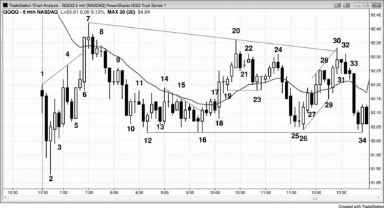

## 第21章　如何交易震荡区间的例子

<!-- Source PDF pages 398–408 -->
<!-- English: Chapter 21: Example of How to Trade a Trading Range -->

<!-- PDF page 398 -->

# 第21章  
# 如何交易震荡区间的例子

当市场处于震荡区间时，交易者应遵循「低买高卖」的格言。此外，把你的交易看作剥头皮而非波段。计划拿小利润，不要抱着希望突破。到顶部的反弹通常看起来会成为进入多头趋势的成功突破，但 80% 失败，80% 到区间底部的强抛售未能突破进入空头趋势。尽量使潜在回报至少与风险一样大，这样你的胜率不必 70% 或更高。由于市场是双边的，入场后离场前常会有回撤，因此若你不愿扛过回撤就不要做交易。若市场在震荡区间中已上行五到 10 根，通常远更好只寻找做空并对多单获利了结。若它已下行一段时间，寻找买入或对空单获利了结。很少在区间中部用止损入场，但有时在那里用限价单入场是合理的。

在最佳交易形态中，初学者应专注于用止损入场，使入场时市场朝他们方向：在区间底部附近买入 High 2。这些常是从底部向上反转市场的第二次尝试，如双底。  
在区间顶部附近卖出 Low 2。这些常是从顶部向下反转市场的第二次尝试，如双顶。  
在震荡区间底部买入，尤其若是空头趋势线上方突破后的第二次入场。  
在震荡区间顶部做空，尤其若是多头趋势线下方突破后的第二次入场。  
在底部附近买入楔形多头旗形。

<!-- PDF page 399 -->

在顶部附近卖出楔形空头旗形。  
在区间底部摆动低点下方突破后买入多头反转K线或反转形态如最后旗形（第三册讨论）。  
在区间顶部摆动高点上方突破后卖出空头反转K线或反转形态如最后旗形（第三册讨论）。  
在区间底部附近向上突破后买入突破回撤（例如，若市场开始上行并回撤，寻找在前一根高点上方买入）。  
在区间顶部附近向下突破后卖出突破回撤（例如，若市场开始下行并回撤，寻找在前一根低点下方卖出）。

用限价单入场需要更多读图经验，因为交易者在与交易相反方向运动的市场中入场。一些交易者用更小仓位，若市场继续对他们不利则分批加仓；但只有成功、有经验的交易者才应尝试。以下是限价或市价单交易形态的一些例子：在区间底部先前摆动低点处或下方市价或限价单买入空头尖峰（在尖峰中入场需要更宽止损且尖峰发生很快，因此这种组合对许多交易者很难）。  
在区间顶部先前摆动高点处或上方市价或限价单卖出多头尖峰（在尖峰中入场需要更宽止损且尖峰发生很快，因此这种组合对许多交易者很难）。  
在区间底部附近大空头趋势K线收盘处或低点下方买入，因为它常是衰竭卖盘高潮与震荡区间抛售的结束。  
在区间顶部附近大多头趋势K线收盘处或高点上方卖出，因为它常是衰竭买盘高潮与震荡区间反弹的结束。  
在震荡区间底部弱 Low 1 或 2 信号K线处或下方限价单买入。

<!-- PDF page 400 -->

在震荡区间顶部弱 High 1 或 2 信号K线处或上方限价单做空。  
在强多头摆动起点买入空头收盘。  
在强空头摆动起点卖出多头收盘。

## 图 21.1　在震荡区间中 fade 极端做剥头皮

有许多方式交易如图 21.1 所示 QQQ 中的震荡区间日，但一般而言，交易者应寻找 fade 极端并只剥头皮。尽管有许多信号，交易者不应担心抓住全部甚至多数。交易者每天只需几个好形态就开始盈利。

我有一位交易了几十年的朋友，在这样的日子做得极好。我看过他实时交易 Emini，在这样的日子他会基于 fade 做约 15 笔盈利一点剥头皮。例如，在 K线 10 到 K线 18 区域，他会试图用限价单在一切下方买入，如市场跌破 K线 10 时、K线 13 走到其前空头K线下方时、K线 15 跌破其前那根时，他会在跌破 K线 13 时加仓。他会在市场刺破 K线 15 下方时再买入，并会试图在市场跌破 K线 12 时买入。重要的是记住他是非常有经验的交易者，有能力发现有 70% 到 80% 成功机会的交易。很少交易者有那种能力，这就是为什么初学者不应在冒约两点风险时剥头皮一点。至少，他们应只做他们认为等距行情成功概率至少 60% 的震荡区间交易。由于他们在该图上必须冒约两点风险，他们应只在持有至少两点利润时交易。这意味着他们应寻找在区间底部附近买入、在顶部附近做空。

<!-- PDF page 401 -->

若交易者在区间底部附近买入，他们应寻找在区间顶部附近获利了结。他们也应寻找在区间顶部附近开空，并在市场移向区间底部时对那些空单获利了结。反转对多数交易者太难，他们应改用止盈目标离场，然后寻找相反方向交易。例如，若他们在 K线 16 走到前一根高点上方并触发双底多头旗形入场时买入，他们可有卖出限价单在到 K线 20 的上行上以 10、15 或 20 美分利润离场。离场后，他们可然后寻找做空形态，如 K线 22 更低高点下方或 K线 24 更低高点下方。后者是更好形态，因为它有强空头反转K线，且与 K线 22 是双顶空头旗形。

那么交易者何时断定这是震荡区间日？每个人不同，但常很早就有线索，随着更多累积，交易者更有信心。从第一根就有双边交易迹象，其他迹象几乎在随后每一根上累积。当日第一根是十字星，这增加了震荡区间日的机会。市场在 K线 3 向上反转但到 K线 4 的上行跟随弱。前三根底部有影线，K线 2 与前一根重叠约一半。K线 3 是做多入场后立即向下反转，下一根向上反转。市场在 K线 4 再次向下反转，在 K线 5 再次向上，在均线处 K线 7 再次向下。每当市场在第一小时有四或五次反转时，震荡区间日的概率增加。

K线 6 是强多头趋势K线但没有跟随。它在均线停顿，下一根是十字星而不是另一根收盘远在均线上方的强多头趋势K线。下一根是空头趋势K线，之后两根也未能收盘在均线上方。尽管有强反弹，多头未在控制，因此市场是双边的。

<!-- PDF page 402 -->

K线 2 是两根多头尖峰的起点，后跟到 K线 7 的三推多头通道。由于 K线 2 是跳空低开与抛售后的强多头反转K线，它是好的开盘反转与可能的当日低点。该日本可成为强多头趋势日但反而横盘。然而，它从未跌破入场K线低点。

K线 2 是两根多头尖峰的第一根，K线 4 与 7 是尖峰后楔形通道中的第二与第三次上推。尖峰与通道形态中的通道是震荡区间的第一段，因此多数交易者此时假设市场至少接下来 10 到 20 根会在震荡区间中，可能当日剩余时间。他们寻找会测试 K线 3 或 K线 5 低点的两段抛售，因为那些K线形成多头通道底部。即便他们相信该日可能成为趋势日，他们暂时把它看作震荡区间，因此只剥头皮。他们的剥头皮强化了震荡区间，因为当许多交易者在高点附近卖出、在低点附近买入时，市场很难突破进入趋势。

交易者会在 K线 2 上方买入，至少测试均线。一些交易者会在当日新高做空 K线 4 空头反转K线，但多数会假设来自 K线 2 反转K线、两根多头尖峰与 K线 4 前多头K线的买盘压力足够强，市场会测试均线，即便有回撤。因此，许多交易者下限价单在 K线 4 低点处与下方买入，并把保护性止损放在 K线 2 后做多入场K线下方或甚至 K线 2 信号K线低点下方。一些会用资金止损，如约今日迄今平均K线高度，或许 10 到 15 美分。一些交易者可能认为空头可从 K线 4 做 10 美分剥头皮下行。那需要 K线 4 下方 12 美分行情，因此他们可能用 13 tick 止损。他们会假设做空会是剥头皮，因此空头会有限价单在 K线 4 低点下方 11 美分回补空单，以便他们在 K线 4 下方 1 tick 止损入场的空单上剥头皮 10 美分。

<!-- PDF page 403 -->

警觉交易者会在 K线 4 后空头入场K线上方放置止损单做多，因为他们知道 K线 4 信号K线足够强吸引空头，那些空头会担心向上反转到均线。他们会把保护性止损放在入场K线上方，在市场到达均线前不再寻找做空。这使在该入场K线上方买入成为出色的做多剥头皮。

多头怀疑 K线 5 后那根不是可靠做空，因此他们下单在其低点上方 1 tick、处与下方买入，预期它是失败的更低高点。只有低点上方 1 tick 的做多限价单成交，意味着多头非常激进。结果是到均线的强多头趋势K线。这是强多头突破，但交易者想知道为何它在均线停顿而不是远在上方。他们需要看到立即跟随，否则会怀疑这会是开盘高点上方的失败突破。或许 K线 6 只是由强交易者暂时靠边站造成的买盘真空。若他们假设市场会测试均线，在刚好均线下方卖出没有意义。强多空的缺席让市场急冲上行。然而，一旦市场到达他们认为可能停顿的区域，他们从天而降并激进卖出，压倒弱多头。强多头获利卖出平多，强空头卖出以开新空。把该日看作可能震荡区间日的空头会有限价单在 K线 6 走到均线上方时卖出，另一些会做空其收盘。一些会愿意在更高处分批加仓，尤其在下一根弱跟随之后。

随着市场交易下行，对多数交易者清晰的是多空都强，市场可能保持双边，双方争夺控制。这意味着震荡区间可能。当市场接近顶部时，多头开始担心太贵而不能买，空头把它看作做空的好价值。这使市场下跌。急于在顶部附近做空的空头对在底部附近做空不感兴趣，因此卖出枯竭。愿意在中部买入的多头把区间底部看作 <!-- PDF page 404 --> 更好价值；他们在那里激进买入，把市场托回向上。

空头愿意在 K线 7 测试均线下方做空。若多头强，本应有均线上方的强行情而不是这种停顿。K线 7 使 K线 6 看起来更像衰竭而非强突破。其他空头在 K线 8 的 ii 形态下方或 K线 7 后空头K线下方做空。从 ii 起的两根空头尖峰合理强，但低点有影线，表明一些买入。此时，市场从当日低点到 K线 7 有强尖峰上行，现在有强尖峰下行。交易者预期震荡区间。

K线 9 是多头陷阱。多数交易者把其前的十字星内包K线看作空头尖峰后的差买入信号，许多人下限价单在十字星K线高点做空。他们寻找回撤到 K线 5 低点附近多头通道底部区域。这也在 K线 2 信号K线高点区域，那是突破回测的磁力位。多头想要双底多头旗形在 K线 3 或 K线 5 低点区域发展，但他们也想要原始入场K线低点守住（K线 2 后那根的低点）。否则，他们可能放弃仍有多头趋势日机会的信念。

K线 10 是从 K线 7 高点起的第三次下推，是强多头趋势K线。多头担心下行在窄通道中且第一次突破尝试可能失败。许多多头会等突破回撤再买入。一些确实买入的人买入更小仓位，以防市场交易到更接近 K线 3 低点，他们计划在第二次向上信号上再买入，他们在 K线 12 得到。其他人认为许多交易者会在多单上有 10 美分止损，因此他们下限价单在低 10 美分再买入，精确在那些弱多头会离场处。他们然后会对整仓放保护性止损或许再低 10 美分，在 K线 2 后入场K线下方，或甚至 K线 2 下方。愿意冒到当日新低风险的交易者可能交易更小，以允许在第一次下方约 10 美分第二次分批加多。

K线 12 多头反转K线是与 K线 3 或 K线 5 低点的大致双底，是第二次信号。这使它成为震荡区间底部附近的 High 2。它是从当日高点起的第四次下推，一些交易者把它看作 High 4 多头旗形。K线 8 后的空头尖峰对许多交易者是第一次下推，K线 12 是第三次。许多尖峰与通道形态以这样的第三次推进结束，然后试图做两段反弹测试空头通道顶部，约在 K线 9 高点。一些交易者认为到 K线 12 的行情在太窄的通道中不能买入，他们会等清晰第二次信号。许多人会等到他们在 K线 12 低点附近得到相对小K线。这些交易者可在 K线 16 为双底多头旗形买入。K线 14 足够强以突破空头通道上方，然后市场有两段回撤。K线 16 也是楔形多头旗形的入场，K线 10 是第一次下推，K线 12 是第二次。其他人把 K线 13 看作第一次下推，K线 15 是第二次。它也是下降三角形，K线 16 是向上突破。由于它是强突破K线，交易者寻找买入突破回撤。他们会有限价单在前一根低点处或下方买入，会在 K线 18 成交。其他人会买入空头 K线 17 的收盘，因为他们认为突破回撤与更高低点比失败突破与跌破震荡区间 K线 16 底部更可能。

交易者用同样逻辑在 K线 12 后那根下方买入，相信它是差的 Low 2 做空，因为它在震荡区间底部，且在第二次向上反转之后，两次反转都有好买盘压力（好多头反转K线）。一些会在 K线 12 后空头K线收盘或 K线 13 空头收盘买入，预期 K线 12 低点守住。其他人会在 K线 13 上方买入，认为有被困空头因此市场可在空头回补时快速上行。

由于这是窄幅震荡区间，它是多空都看到价值的区域。双方都舒适在那里开仓。在多空都已确立的价值区域，突破通常不能走得太远就被吸回区间。它有强磁力，空头会在上方更重做空，多头会在下方更重买入。

<!-- PDF page 406 -->

K线 18 是大多头趋势K线，突破过去一小时左右震荡区间上方。然而，由于整体日在更大震荡区间中且市场现在在该更大区间中部，交易者犹豫买入。这导致 ii 形态。一些交易者买入 K线 12 收盘与 K线 12 上方突破。其他人在 ii 期间与 K线 19 多头内包K线上方买入。交易者试图下限价单在 K线 18 后内包K线低点处与下方买入但未成交。这使他们更愿意买入 K线 19 上方突破。他们看到买单在下方未成交，认为这是多头紧迫感的信号。

K线 18 突破尖峰后跟到 K线 20 的小抛物线高潮，在那里两K线向下反转设置。入场在两根中较低那根下方，直到三根后才触发。相信该日是震荡区间日的交易者寻找在接近当日高点的强反弹上做空。K线 21 是小十字星，因此是弱 High 1 买入形态，尤其在买盘高潮之后。空头在其高点上方做空。其他人在 K线 22 下方做空，多头在那里卖出平多。他们在震荡区间顶部买入，希望有多头突破，当它没有发生时，他们快速离场。他们这样做时，触发了 K线 20 高点的两K线反转做空。

市场跌到均线并形成带多头反转K线的 High 2 买入信号。这在多头趋势中是非常可靠形态，但多数交易者仍把该日看作震荡区间日。许多人在 K线 23 上方买入，希望该日成为多头趋势，但计划若没有强多头突破就快速离场。他们担心 K线 23 后是十字星内包K线，因为他们想要紧迫感，不是犹豫。

他们离场多单，空头在 K线 24 空头反转K线下方做空，与 K线 22 形成双顶空头旗形。一些把它看作与 K线 22 的 Low 2 做空，另一些看作楔形顶，K线 20 是第一次上推，K线 22 是第二次。

有强空头尖峰到震荡区间底部，但 K线 25 有小空头实体，表明犹豫。多头未能创造突破，结果只是震荡区间。震荡区间未能抵抗 K线 10 到 16 窄幅震荡区间的磁力。若这是强空头趋势，市场一旦回到当日更早的窄幅震荡区间就不会犹豫。相反，它会以一系列强空头趋势K线跌破它。这告诉交易者空头不强，这可能只是卖盘真空。强交易者可能靠边站，预期对区间底部的测试。一旦市场到达那里，他们开始激进无情地买入，多头开新多，空头对空单获利了结。他们决心把市场保持在震荡区间低点上方。K线 26 是震荡区间底部的 High 2 与强多头反转K线。K线 25 是 High 1 形态。K线 25 与 26 区域与 K线 12 到 16 区域形成双底多头旗形。该第二底也是 K线 10 到 K线 17 窄幅震荡区间的突破回撤。

K线 26 在下一根有好跟随，交易者预期该向下测试会失败。一些买入 K线 27 空头趋势K线收盘。其他人下限价单在 K线 27 低点处与下方买入。买入如此激进，市场甚至不能到达 K线 27 低点。警觉交易者看到这一点并快速下单在 K线 27 高点上方止损买入。这导致由两根多头趋势K线形成的突破。

K线 28 是空头内包K线，但从 K线 26 起的上行在窄通道中，因此第一次向下尝试应失败。多头下限价单在 K线 28 低点处与下方买入。到 K线 26 的下行是大两段行情，K线 23 结束第一段。这是大多头旗形，到 K线 28 的上行是突破。K线 29 是该突破的回撤，也是从 K线 26 到 K线 28 微型通道底部的失败突破。

K线 30 是对决线形态，多头在市场走到两线上方时获利了结，创造顶部影线。其他人在弱收盘离场，还有人在 K线 31 两K线反转顶下方离场。

K线 31 是十字星，因此是弱 High 1 信号K线。此外，从 K线 26 到 K线 30 的尖峰不够强以买入第二次 High 1（K线 29 是第一次），且该日是震荡区间日，不是清晰多头趋势日。空头把这看作震荡区间顶部的差 High 1 并在 K线 31 高点做空。

<!-- PDF page 408 -->

其他空头在 K线 32 空头反转K线下方做空。一些把 K线 30 与 31 看作两K线反转，另一些忽略 K线 31 并把 K线 30 与 32 看作两K线反转。它也是微型双顶。市场在 K线 30 上行，K线 31 下行，然后 K线 32 再次上行，然后在该K线收盘前下行。市场当日也做了三次上推，K线 7 与 20 是前两次，因此该日是大三角形。K线 32 后入场K线跌破从 K线 26 与 29 起的多头趋势线（尽管未显示），市场在趋势线下方第二根急剧抛售进入收盘。

K线 10 与 16 之间有许多多头三角形。由于形态在到 K线 7 的多头尖峰底部上方形成，许多交易者认为可能有至少测试 K线 7 高点的上行通道。该震荡区间中也有几个多头尖峰，创造买盘压力与多头市场试图形成更高低点的证据。由于没有一个三角形完全清晰，并非所有交易者同意任一个足够强使市场始终做多。K线 10、12 与 16 是三次下推并形成下降三角形。K线 13、15 与 16 也是三次下推与三角形。一些交易者把它看作楔形多头旗形。另一个楔形多头旗形由 K线 14 后两根形成的空头K线、K线 15 与 K线 16 形成。
