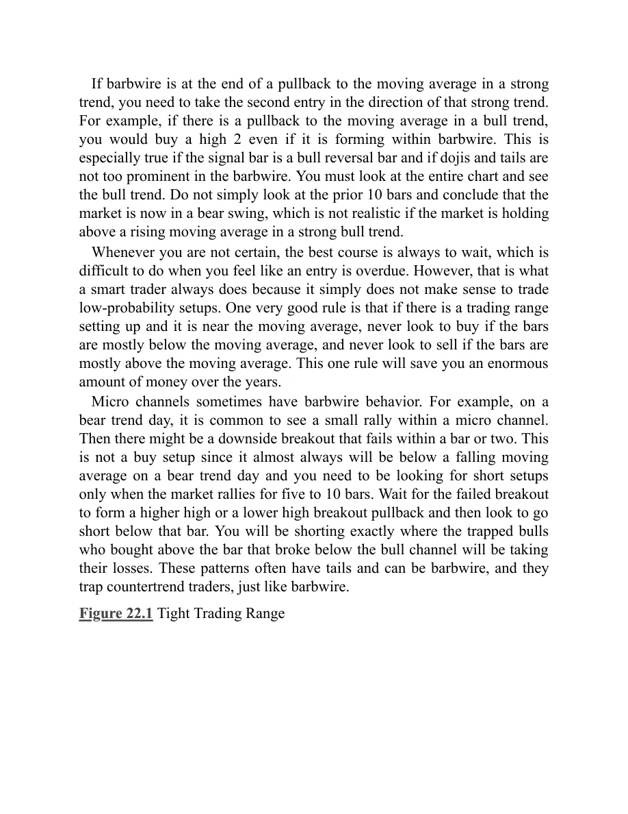
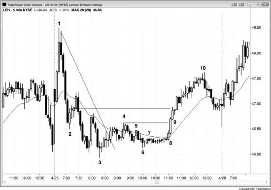
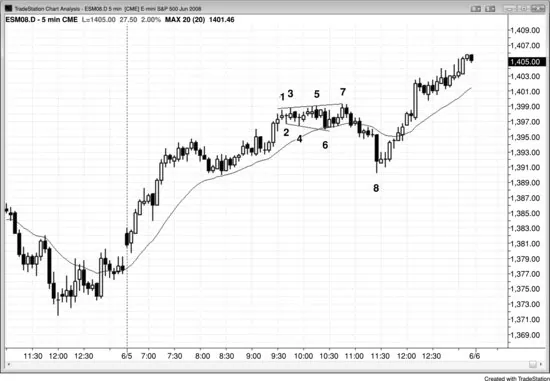
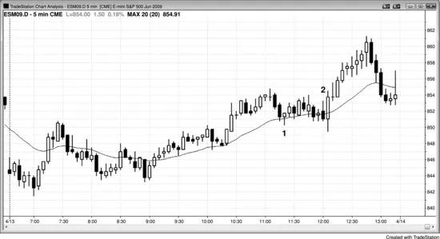
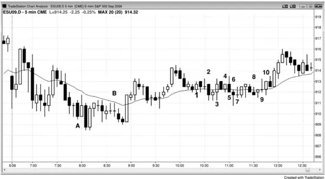
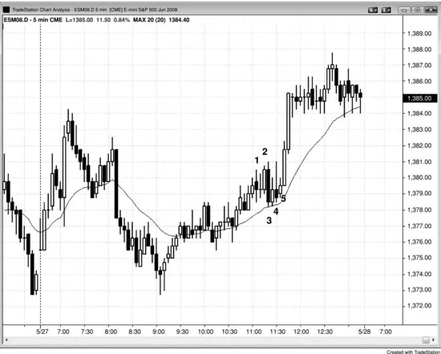
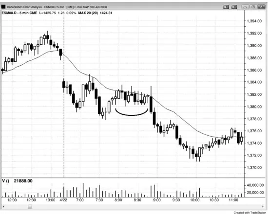
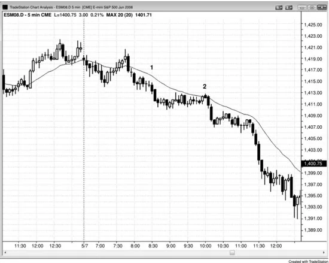
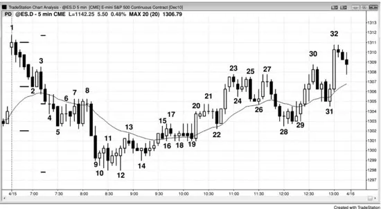
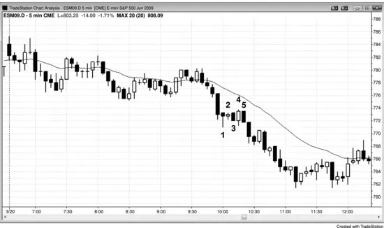

## 第22章 窄幅震荡区间

<!-- English: Chapter 22: Tight Trading Ranges -->
<!-- Source PDF pages 409–438 -->

<!-- PDF page 409 -->

第22章
窄幅震荡区间
窄幅震荡区间是一种常见形态，曾被冠以许多不同名称，但没有一个术语足够描述性。它是任何两根或更多K线的横盘通道，K线大量重叠、多次反转、许多十字星、显著影线，以及多头与空头实体都有，它可以延伸十几根或更多K线。大多数止损入场导致亏损，应避免。若Emini的平均日振幅约为10到15点，则任何三点高或更小的震荡区间很可能是窄幅震荡区间。四点、有时五点的区间若K线很大，有时也可以表现得像窄幅震荡区间。
多头与空头处于平衡，交易者在等待突破以及突破后市场的反应。突破会延续吗，也许在小回撤之后？还是回撤会成长为反转并很快跟随穿过震荡区间对面一侧的突破？仅仅因为市场横盘，不要假定机构大多已停止交易。每根K线内的成交量通常仍然很高，尽管少于其之前趋势K线的成交量。多头与空头都在积极开新仓，双方都在争斗以创造他们方向的突破。一些交易者在进出剥头皮，但另一些在加仓并最终达到其最大规模。最终一方获胜、另一方放弃，新的趋势段开始。例如，若有持续很久的窄幅震荡区间，许多多头已达到他们不想超过的仓位规模，则当市场开始测试区间底部时，没有足够多头把市场抬回区间中部或顶部。市场然后开始向下突破，这些不能或不愿增加其大仓位规模的多头只希望有其他多头有足够 <!-- PDF page 410 --> 买盘力量来反转空头突破。每下跌一个新tick，更多多头卖出其多头并承受亏损，他们至少在再数根K线内不会考虑再次买入。这种卖出把市场进一步压低，导致更多多头带损卖出。随着剩余多头放弃、卖出并等待另一个可能底部，卖出可以加速。这一过程发生在所有震荡区间中，也促成趋势型震荡日中的晚期突破。例如，若有向上突破，部分原因是有太多空头不再能够或愿意增加其仓位规模，没有足够剩余来抵抗对区间顶部的下一次测试。市场突破，空头开始回补空头并至少在再数根K线内不愿再次卖出。空头卖出的缺席，加上他们回补空头时的买入，创造单向市场，迫使剩余空头回补空头。这种空头回补，加上多头的买入，往往导致持久的多头摆动。
失败突破与反转很常见。通常更好不要在突破上入场；相反，等待强跟随然后市价入场，或等待突破回撤然后朝趋势方向入场，或等待失败突破然后朝相反方向入场。虽然没人知道高频交易（HFT）公司量化人员使用的算法，但发生的巨大成交量与带大量反转的小移动，很容易是试图反复剥头皮一到四个tick的程序的结果。数学家甚至不需要看图。他们设计程序利用小波动，窄幅震荡区间看起来像聪明程序员的完美环境。
窄幅震荡区间中的每一次回撤都归因于微型买盘或卖盘真空，正如发生在所有震荡区间顶部与底部附近一样。许多多头与空头会在高点下方一定tick数寻找买入，而另一些会在前一根K线低点下方一定tick数寻找买入。这些是想买入、但不想以当前价格买入的交易者。空头想回补其做空剥头皮，多头想开买入剥头皮。这些买家在当前价格的缺席导致市场被吸下去。一旦到达他们的价格，他们突然 <!-- PDF page 411 --> 积极买入，导致向上反转。空头对空头获利了结，多头开多。一旦市场接近区间顶部，过程反转。多头卖出其做多剥头皮获利，空头开新空。这一相同过程发生在每一种通道中，无论它是水平的（如窄幅震荡区间）还是倾斜的（如尖峰后的通道）。
在窄幅震荡区间中用止损单进出对交易者不利，但对大多数交易者而言，确定限价单入场何时交易者公式有利太困难。对大多数交易者的最佳选择只是等待突破，然后判断它可能成功还是失败，再寻找交易。这对窄通道也一样，它只是倾斜的窄幅震荡区间。虽然市场大部分时间花在通道中，无论它们是横盘震荡区间还是倾斜通道，当通道很窄时在通道内交易尤其困难。当通道或震荡区间很窄时，只有最持续盈利的交易者才应交易，且这些交易者会用限价单入场。大多数交易者应几乎只在止损单上入场。由于那恰恰是交易窄通道的相反方式，大多数交易者不应交易它们。相反，他们应只等待尖峰或更宽通道再交易。
窄幅震荡区间通常是延续形态，但若它在高潮反转之后形成，即使是小的，市场向任一方向突破的概率相等。这是因为高潮反转在相反方向产生了动能，你不会知道这一相反动能是否会延续并导致突破，还是此前趋势的动能会恢复。若没有高潮反转，若窄幅震荡区间在趋势段之后形成，突破朝趋势方向的概率在趋势强时可以高达55%。然而，它可能永远不会更高，否则市场就不会形成窄幅震荡区间。若趋势不那么强，概率可能只有53%。即使市场逆势突破，形态通常会演化为更大震荡区间，概率最终仍偏向顺势突破。记住，所有震荡区间只是更高时间框架图上的回撤。然而，若交易者在窄幅震荡区间期间朝趋势方向入场并 <!-- PDF page 412 --> 使用非常宽的止损，允许演化为更高的震荡区间，交易者公式变得难以确定。风险、回报与概率变得难以评估，每当如此时，更好是不交易。因此，使用宽止损并持有很久通常不是好策略。若交易者在窄幅震荡区间中顺势入场，预期趋势恢复，但市场向错误方向突破，通常更好是离场并等待更大震荡区间发展，再尝试做顺势波段交易。
由于窄幅震荡区间是震荡区间，当它接近区间顶部时市场抛售或接近区间底部时反弹的机会是60%或更高。然而，由于区间很窄，通常没有足够空间做有利可图的交易，因此这一概率无意义。更好只是假定若区间跟随多头段，向上突破概率为51%到55%；若区间跟随空头段，向下突破概率为51%到55%。
窄幅震荡区间压倒一切，这尤其意味着做任何交易的所有绝佳理由。无论你在图上还看到什么都不重要。一旦市场进入窄幅震荡区间，市场在告诉你它已失去方向，向任一方向突破的概率永远不超过约55%。由于它仍是震荡区间，此前趋势恢复的机会略大，但交易者应假定概率仍只在51%到55%之间，取决于此前趋势多强以及窄幅震荡区间之前是否有强反转。
窄幅震荡区间由大量反转构成，每一次来自失败的突破尝试。会有许多“绝佳”买入与卖出信号K线，有些有强支持逻辑。例如，若有绝佳做空信号触发，但市场在一两根K线内形成更好的多头反转K线，多头可能认为空头被强信号困住，因此至少在再几根K线内不愿再次做空。这意味着近期空头更少，市场有高概率出现成功的、运行数根K线的多头突破。逻辑合理，但你需要回到口诀：“窄幅震荡区间压倒一切。”这包括你做交易的每一个 <!-- PDF page 413 --> 美妙、合乎逻辑的理由。反转显示机构在K线上方用限价单卖出、在K线下方用限价单买入。你的工作是跟随他们在做的事，你永远不应做相反的事。在窄幅震荡区间中用止损单进出是亏损策略。由于你无法像高频交易公司那样在窄幅震荡区间中有利可图地剥头皮一到三个tick，你必须等待。他们创造这些窄区间中的大部分成交量，他们以你无法有利可图交易的方式交易。你必须等待，这可能极其困难。有时窄幅震荡区间可以延伸到20根或更多K线，然后它真正成为没有预测价值的形态。由于猜测永远不是合理的交易方法，价格行为交易者必须等待突破再决定做什么。在大多数情况下，突破后一两根K线内有失败，若你基于失败而不是基于突破入场，有利可图交易的概率更高。在大多数情况下，反转尝试失败并成为突破回撤。一旦有来自突破的回撤，在突破恢复时用止损单朝突破方向入场。在多头突破中，等待回撤K线收盘，然后在其高点上方一个tick用买入止损单入场。若预期的回撤K线反而导致反转并冲过窄幅震荡区间对面一侧，或若接下来几根K线之一跌穿区间底部，你可以在窄幅震荡区间下方一个tick用止损单做空，或你可以等待突破回撤再做空。
由于震荡区间日上持久窄幅震荡区间突破后的移动往往不强，市场常常在当日剩余时间大体无趋势。然而，若有强趋势通向窄幅震荡区间，市场表现非常不同，因为该日往往成为趋势恢复日。这里，头一小时左右有强趋势，然后是可持续数小时的窄幅震荡区间，最后从区间朝原趋势方向突破。这一突破往往导致第二段趋势，点数约与第一段相同。较少见地，突破会向相反方向并反转大部分或全部此前趋势。
窄幅震荡区间内通常有两个方向的形态，但大多数交易者一旦相信 <!-- PDF page 414 --> 市场已进入窄幅震荡区间，就不应做任何交易。若他们刚入场且形态成长为窄幅震荡区间，最佳选择是尝试在盈亏平衡离场，或也许带一个tick亏损，然后等待突破再决定下一笔交易。例如，若交易者做空是因为他们认为有60%机会市场在上涨10个tick之前先下跌10个tick，但现在市场处于窄幅震荡区间，数学已改变。交易者现在只有约50%成功机会，只要其风险与潜在回报不变，他们现在有亏损策略。他们的最佳应对是在盈亏平衡离场，若幸运，他们也许能带一两个tick利润离场。
无论你看到什么形态，且在它们设置时总有看起来绝佳的，你必须考虑概率，对等距移动是50%。只有当获胜机会乘以潜在回报显著大于亏损机会乘以风险时，你才能有利可图地交易，但由于窄幅震荡区间是如此强的磁铁，其内移动很小，突破通常失败，即使突破成功，它通常走不远就被区间把市场吸回。这使赚到你风险两到三倍的机会非常小；因此，任何突破策略，如在K线上方买入或在K线下方做空，长期都会亏损。
由于窄幅震荡区间是通道，它可以像任何其他通道一样交易，但由于移动很小且需要许多根K线才到达获利目标，非常乏味，大多数交易者一旦相信市场已进入窄幅震荡区间就应避免任何交易。有时窄幅震荡区间从顶到底有足够点数，可以在顶部对小空头反转K线做空剥头皮，或在底部在小多头趋势K线上方买入。积极交易者在前一根K线低点下方买入或在前一根K线高点上方做空，并以小利润剥头皮离场。若有通向窄幅震荡区间的趋势，顺势交易更可能获胜，部分可以波段持有。例如，若市场在强上涨后进入窄幅震荡区间且区间刚好在移动平均线上方持住，多头会在前一根K线低点下方买入。虽然他们可以在区间顶部附近剥头皮离场，他们也可以持有部分仓位做 <!-- PDF page 415 --> 向上波段。其他交易者（大多是HFT公司）在区间中部下方以及每低一两个tick分批加仓做多。空头在区间中部上方以及每高一两个tick卖出。双方在区间中部附近获利，在最早入场盈亏平衡离场，在较晚入场有利润。
由于交易者应只专注于最佳形态，他们应始终避免最差的；窄幅震荡区间是最差的。窄幅震荡区间是初学交易者的最大单一问题，也是到目前为止阻止他们盈利交易的最重要障碍。例如，新交易者记得在过去几天的趋势中K线计数非常可靠，所以他们开始在区间内用它们入场，预期很快突破，但一个也没来。他们把每一次反转看作新信号，每个在他们下单时看起来都好。可能有强空头反转K线突破看起来不错的Low 2做空形态。但它仍在窄幅震荡区间内，跟随14根重叠K线，移动平均线平坦。在区间内，可能有六次此前反转，没有一次移动得足够远甚至做剥头皮利润。大约一小时后，交易者变得沮丧，因为他们看到自己刚在六笔连续交易上亏损。即使亏损很小，他们现在已亏七点，当日只剩一小时。在几个小时内，他们回吐了过去三天赚到的一切，他们向自己保证永远不会再犯那个错误。然而，几乎总是，他们两天后再犯，然后至少一个月几次，持续数月，直到账户中保证金太少无法交易。
账户中那笔原始资金是给他们自己的礼物。他们在给自己一个机会，看他们是否能为自己和家人创造新的、美好的生活。然而，他们反复允许自己打破交易中最重要的规则：在窄幅震荡区间内交易。他们傲慢地相信自己读市场的能力很强。毕竟，他们连续三天赚钱，必须有技能才能做到。他们相信在六次连续亏损后获胜者早该到来，所以大数定律在他们这边。相反，他们本应接受现实 <!-- PDF page 416 --> ：获胜者永远不会早该到来，市场通常继续做它刚刚在做的事。这意味着第七次亏损比获胜更可能，当日剩余时间不太可能有很好的交易。是的，他们把过去几天的那些大摆动交易得极好，但市场特征日复一日变化，那要求你改变方法。
交易者往往直到在四五根K线内在两三个信号上亏损才接受市场已进入窄幅震荡区间，即使他们接受了，他们犯的错误甚至代价更大。有一种自然倾向假定没有什么能永远持续，每一种行为都向均值回归。若市场有三四笔亏损交易，下一次肯定更可能获胜。这就像抛硬币，不是吗？不幸的是，市场不是那样表现的。当市场处于趋势时，大多数反转尝试失败。当它处于震荡区间时，大多数突破尝试失败。这与抛硬币相反，抛硬币的概率始终是50–50。在交易中，刚刚发生的事情会一次又一次继续发生的概率更像70%或更高。因为抛硬币逻辑，大多数交易者在某个点开始考虑博弈论。
他们考虑的第一个想法是马丁格尔方法，每次亏损后把下一笔交易规模翻倍或三倍。若他们尝试，他们很快看到马丁格尔方法实际上是马丁格尔悖论。若你从一张合约开始，然后亏损后交易两张，并在每次连续亏损交易后继续把仓位规模翻倍，你知道最终你会赢。一旦你赢了，那笔大最终押注会恢复你所有早期亏损并把你带回盈亏平衡。更好的是，每次亏损后把交易规模三倍，这样一旦你最终赢了，尽管有早期亏损，你最终会有净利。马丁格尔方法在数学上站得住，但悖论性地无法应用。为什么？若你从一张合约开始并在六次连续亏损后翻倍，你那时会交易32张合约。若你交易每一次反转，你每周至少会有一次六次连续亏损，常常更多。悖论是：舒适交易一张合约的交易者永远不会交易32张，舒适交易32张的交易者永远不会从一张开始。

<!-- PDF page 417 -->

交易者接下来考虑等待三次（或甚至更多）连续亏损再做交易，因为他们相信四次连续亏损剥头皮不会太常发生。事实上，它几乎每天发生，市场常常有六次甚至更多连续失败反转；当这种情况发生时，市场总是处于窄幅震荡区间。一旦他们发现六次或七次连续亏损有多常见，他们就放弃该方法。
一旦你看到市场处于窄幅震荡区间，不要交易。相反，只是等待好摆动回归，它们会回归，通常到次日。你的工作不是下单。它必须是赚钱，若你继续亏得比赚得多，你无法每月赚钱。若市场看起来在上下摆动且你做了交易，但市场随后在接下来几根K线内开始形成小的、重叠的十字星，假定市场正在进入窄幅震荡区间，尤其若现在是日中中间三分之一。尝试在盈亏平衡或以小亏损离场，只等待摆动回归，即使你必须等到明天。你不能基于亏损是交易一部分的假定来承受回吐资金。你必须把交易限制在最佳形态，即使那意味着你连续数小时不交易。
尝试在盈亏平衡离场的替代方案是持有但使用区间之外的宽止损，但这在数学上是较不稳健的方法。最差的替代是在形态内做若干入场并承受亏损，即使是小的。若你在空头趋势中的窄幅震荡区间买入且市场形成Low 2，你应离场并可能反手做空。若你在该空头窄幅震荡区间中做空且市场随后形成High 2，你应离场并可能反手做多，但只有当信号K线是区间底部的多头K线且到形态顶部有足够空间做剥头皮利润时。然而，这很少是好交易，只有非常有经验的交易者才应尝试。连续数小时看市场而不交易非常困难，但这远好于承受三或四次亏损并耗尽当日回到盈亏平衡的时间。要有耐心。好形态不久就会回归。

<!-- PDF page 418 -->

一种重要类型的窄幅震荡区间通常发生在日中中部、当日区间中部，且通常接近移动平均线，但它可以在任何时间、任何位置发生。它被称为铁丝网，因为大十字星与影线的尖刺外观。若你看到三根或更多大体重叠的K线，且其中一根或更多有微小实体（十字星），这就是铁丝网。作为重叠多少才足够的指引，看三根中的第二根。通常这些K线相对较大，表示更多情绪与更多不确定。若其高度超过一半在其前与后K线的区间内，你应把这三根K线看作铁丝网。在你成为强交易者之前，不要碰铁丝网，否则你会受伤。小实体表明市场离开K线开盘，但持相反意见的交易者到K线收盘把它推了回来。此外，一根K线与前一根大量重叠的横盘K线意味着没有人控制市场，所以你不应赌方向。
与所有震荡区间一样，概率偏向顺势突破，但铁丝网以急剧过山车与给过于急切的突破交易者的反复亏损而臭名昭著。铁丝网在有成功突破之前常常既有失败Low 2又有失败High 2。一般而言，当铁丝网紧邻移动平均线形成时，它通常会朝远离移动平均线的方向突破。因此若它刚好在移动平均线上方形成，概率偏向多头突破；若刚好在下方形成，通常会有空头突破。在较少见的它跨骑移动平均线的情况下，你必须看价格行为的其他方面来寻找可交易形态。由于所有窄幅震荡区间都是多头与空头的一致区域，大多数突破失败。事实上，当窄幅震荡区间发生在趋势中时，它常常成为趋势中的最后旗形，突破往往反转回窄幅震荡区间。反转通常导致至少两段式回撤，有时甚至趋势反转。
重要的是考虑其形成之前的移动。若铁丝网在回撤到移动平均线中发展，但大多留在移动平均线的顺势一侧，它只是回撤的一部分，通常会有顺势突破。例如，若多头趋势中有10根K线回撤到移动平均线，然后铁丝网形成， <!-- PDF page 419 --> 有若干K线刺穿移动平均线，但形态大多在移动平均线上方，寻找多头突破。即使你可能想把到移动平均线的10根K线向下移动看作新空头趋势，若形态大多在移动平均线上方，多头在控制，它很可能只是多头回撤到移动平均线的结束。
然而，若回撤穿过移动平均线，然后铁丝网大多在移动平均线对面一侧形成，这一回撤有足够力量使要么第二段很可能，要么你误读了图表且趋势可能已经反转。无论哪种情况，突破很可能朝通向该形态的移动方向，而不是朝这一移动平均线回撤之前有效的更大移动方向。例如，若有空头趋势，现在有10根K线上涨刺穿移动平均线上方，并形成大多在移动平均线上方的铁丝网，概率偏向多头突破。铁丝网是向上移动中的多头旗形，而不是更大向下移动中空头旗形的终点。
尽管铁丝网可能难以交易，若你仔细分析K线，有经验的交易者可以有效交易它。这很重要，因为它有时随后是持久趋势移动，尤其当它充当突破回撤时。例如，假设市场在抛售到震荡区间底部且铁丝网形成；若Low 2刚好在移动平均线下方发展且信号K线是强空头反转K线，这可以是强做空形态。若铁丝网内影线不太显著、这一空头段顶部有强反转、且铁丝网下方有合理目标，概率偏向成功突破。
有时铁丝网在头一小时数根K线尖峰的末端形成。当它发生在多头趋势中的支撑区域时，它可以成为反转形态与当日低点。当这发生在头一小时多头尖峰之后的阻力区域时，它可以成为当日高点。铁丝网较少在日中较晚形成反转形态。
在铁丝网中交易的首要规则是永远不要在突破上入场。相反，等待趋势K线突破形态。趋势K线是信念的第一个迹象，但由于市场一直是双向的，概率 <!-- PDF page 420 --> 很高突破会失败，所以准备好逆势交易它。例如，若有多头趋势K线向上突破超过几个tick，一旦多头趋势K线收盘，挂单在该突破K线低点下方一个tick做空。有时这一做空入场会失败，所以一旦做空且入场K线收盘，挂单在做空入场K线高点上方一个tick反手做多，那将成为突破回撤买入入场。第二次入场失败是不寻常的。若突破有两根或更多连续趋势K线，不要逆势交易突破，因为那增加突破成功的概率。这意味着任何反转回铁丝网的尝试可能会失败并设置突破回撤。一旦市场开始形成趋势K线，要么多头要么空头很快会控制。当顺势突破在几根K线内失败且市场反转时，铁丝网随后是此前趋势的最后旗形。
你也可以在铁丝网顶部与底部附近对小K线逆势交易，若有入场。例如，若高点附近有小K线，尤其若它是空头反转K线，寻找用止损单在该K线低点下方一个tick卖出做剥头皮做空。你也可以寻找3分钟小K线逆势交易。你应很少、如果有的话，从1分钟K线逆势交易，因为3与5分钟K线提供更好的获胜百分比。
由于铁丝网在成功突破之前可以有许多尖峰，有经验的交易者有时挂限价单在前一根K线低点下方买入，若该低点接近区间底部，但若它在区间中部或顶部则不。空头会在前一根K线高点上方做空，入场接近区间顶部，而不是在高点处于区间下半部的前一根K线高点。尖峰越显著，这越可能奏效。此外，若K线至少与当日平均K线一样大，更有效。若K线太小且区间太窄，则成功剥头皮的概率更小，交易者应等待下单。这是乏味的工作，大多数有经验的交易者通常等待成功概率更高、利润潜力更大的移动。由于铁丝网内成交量往往不错，高频交易公司很可能活跃，正如在所有窄幅震荡区间中一样，剥头皮一到三个tick。计算机不会累，所以乏味对他们不是问题。

<!-- PDF page 421 -->

若铁丝网在强趋势中回撤到移动平均线的末端，你需要朝该强趋势方向接受第二次入场。例如，若多头趋势中有回撤到移动平均线，你要买入High 2，即使它在铁丝网内形成。若信号K线是多头反转K线且铁丝网中十字星与影线不太显著，这一点尤其成立。你必须看整个图表并看到多头趋势。不要只看此前10根K线就断定市场现在处于空头摆动，若市场在强多头趋势中在上升移动平均线上方持住，那不现实。
每当你不确定时，最佳做法始终是等待，当你觉得入场早该到来时这很难做。然而，那是聪明交易者始终做的，因为交易低概率形态根本没有意义。一条非常好的规则是：若有震荡区间在设置且它接近移动平均线，若K线大多在移动平均线下方永远不要寻找买入，若K线大多在移动平均线上方永远不要寻找卖出。这一条规则多年来会为你节省巨额资金。
微型通道有时有铁丝网行为。例如，在空头趋势日，常见看到微型通道内的小反弹。然后可能有一两根K线内失败的向下突破。这不是买入形态，因为它几乎总是在空头趋势日的下降移动平均线下方，当市场反弹五到10根K线时你只需要寻找做空形态。等待失败突破形成更高高点或更低高点突破回撤，然后寻找在该K线下方做空。你将正好在那些在跌破多头通道的K线上方买入的被困多头止损离场的位置做空。这些形态常常有影线并可以是铁丝网，它们困住逆势交易者，就像铁丝网一样。
图 22.1 窄幅震荡区间

<!-- PDF page 422 -->

到图22.1中的K线4，已清楚市场已进入窄幅震荡区间。K线1是三根K线内第二次向下反转尝试，随后是K线2在两K线反转中向上反转的尝试。五根K线内三次方向变化是市场现在强烈双向的强迹象。当市场在K线3后形成小十字星时，交易者必须怀疑它很可能进入窄幅震荡区间。当接下来两根也是十字星时，窄幅震荡区间已生效。
K线5和6都未能突破顶部，窄幅震荡区间演化为三角形，它通常也是顺势形态。由于最后一个趋势是从当日低点向上，向上突破很可能，尤其因为所有K线都在移动平均线上方持住。两次失败突破之后，第三次突破成功的概率高得多。此外，K线7是从K线5高点的High 2回撤，后者有一些动能。积极交易者会买入High 2。
下一个合乎逻辑的买入是在K线5的High 2上方突破，即第一次失败突破。你也可以在当日高点上方一或两分买入。一般而言，买入窄幅震荡区间突破是低 <!-- PDF page 423 --> 概率交易。然而，震荡区间跟随从当日低点的强多头反转，市场两小时内未能在移动平均线下方超过一个tick收盘，表明多头非常强。
最高概率入场是K线9的第一次回撤，它在只比空头反转K线低点低一个tick处向上反转，把空头困在内、多头困在外。
另一个高概率买入是K线10在移动平均线的High 2。入场在K线10上方，即两K线反转的第二根。两根K线前有空头微型通道突破，所以K线10也是更低低点突破回撤买入形态。高概率交易往往导致较小获利，但按定义它们通常有高得多的成功机会。
图 22.2 多头与空头段中的窄幅震荡区间

有时窄幅震荡区间可以既是多头趋势中的回撤，又是空头趋势中的回撤。在图22.2中，从K线6到K线8的窄幅震荡区间是从K线3到K线4上涨中的多头旗形，还是到K线3空头趋势中的空头旗形？两者都是合乎逻辑的可能，每当有 <!-- PDF page 424 --> 有效的多头与空头解读时，就有不确定，意味着市场处于震荡区间并处于突破模式。
在涨到K线4时跌破空头趋势线之后，雷曼兄弟（LEH）在K线6形成更高低点，然后进入窄幅震荡区间。由于到K线3的向下移动是楔形，它很可能随后至少有两段式横盘至向上调整，尤其在从昨日低点向上反转之后。即使震荡区间突破通常失败，这里的向上突破可能有第二段上涨，可能与从K线3到K线4的段一样大。它甚至可能是趋势反转，尤其因为到K线1的向上移动有如此多早期多头力量。向上目标包括K线4最后更低高点、K线2和K线3之后的摆动高点、第二段与第一段一样高的等幅运动向上，甚至对K线1多头尖峰的测试。
到K线4的上涨相当好地被包含在通道中，因此可能只是两段横盘至向上段中的第一段。它也有比空头实体更显著的多头实体，这是买盘压力的迹象。K线6与K线3低点后第三根形成双底。交易者知道若K线6低点要守住，市场可能在K线4上方做出等于K线6低点到K线4高点高度的等幅运动。积极多头因出色的风险/回报比在窄幅震荡区间中买入。他们冒约20分风险到K线6低点下方，在50–50押注上赚一美元或更多，这是出色的交易。
到K线8收盘，市场明确始终做多，当下一根是强多头趋势K线时甚至更确定。多头在市价买入、在微小回撤上、在此前摆动高点上方、以及在多头尖峰中三根K线每一根的收盘买入。现在从三根K线尖峰第一根开盘到第三根收盘有约60%到70%机会大约等幅运动向上，市场最终涨超该目标。
突破后的第一次回撤是K线9的小多头内包K线，所以在K线9高点上方一个tick买入High 1是高概率做多。
到K线10的上涨是从K线1下来空头趋势约65%回撤。斐波那契交易者会把到K线10的上涨称为61.8 <!-- PDF page 425 --> %回撤并说它足够接近，但每一次回撤都足够接近某个斐波那契数字，使斐波那契数字在大多数时候本质上无意义。
图 22.3 窄幅震荡区间演化为更大震荡区间

虽然多头趋势中的窄幅震荡区间是震荡区间因此是多头旗形，它在约45%到49%的情况下先向下突破。形态随后有时演化为更大震荡区间，它通常朝趋势方向突破（在图22.3中，向上）。在K线1之后窄幅震荡区间中买入的大多数交易者本应在跌破K线5下方或K线7之后空头内包K线下方离场，几乎所有人会在跌破K线6的向下突破上离场。替代方案是持有多头并使用宽止损。然而，即使市场没有跌破三小时前太平洋时间上午8:25摆动低点下方，交易者必须冒七点或更多才能保持做多。大多数在窄幅震荡区间中买入的多头反而会在K线8低点形成之前承受亏损。在他们入场时，允许更大震荡区间所需的风险太大，达到足以使交易者公式有利可图的大获利目标的概率对他们持有多头来说太低。当那是 <!-- PDF page 426 --> 情况时，更好是离场然后寻找任一方向的另一笔交易。对那些承受小亏损并在K线8失败空头突破后的多头K线上方再次买入的交易者，交易者公式是合理的。这里，他们在买入双底，因此是多头趋势中更大震荡区间可能的底部。
到K线3，铁丝网已存在，因为三根横盘K线且至少一根是十字星。这意味着大多数交易者应等待突破并评估它看起来强还是可能失败。积极的有经验交易者可以在前一根K线低点下方买入、在前一根K线高点上方做空、在底部小多头反转K线上方买入、在顶部附近小空头反转K线下方做空。
K线6是空头趋势K线突破，随后在移动平均线有ii形态，导致做多剥头皮。市场超过20根K线未触及移动平均线。市场正接近，多头认为在市场几小时前差一个tick错过它之后，触及很可能。由于多头相信市场会跌到移动平均线，他们不愿在其正上方买入，他们拒绝买入使市场单向。结果是市场以强空头尖峰快速跌到移动平均线，多头在那里重新出现并积极买入。
K线7是第一次向下失败突破之后失败的多头趋势K线突破，相反失败是第二次入场，因此特别可靠。K线7的两K线反转设置小扩展三角形做空。K线5也是扩展三角形做空，但那时区间对向下剥头皮太窄。
扩展三角形是强烈双向的，因此对突破有磁力吸引，导致大多数失败，如在K线6和K线7。即使在成功突破之后，市场也常常被吸回，因为它是多头与空头都相信开仓有价值的区域。K线8是大空头趋势K线，变成又一次失败突破。
本图深入讨论
在图22.3中，K线8是卖盘高潮、失败突破，以及与太平洋时间上午8:15左右开始的多头通道底部的双底，其后一根是第一根 <!-- PDF page 427 --> 移动平均线缺口K线形态（实际上是第二次尝试，因为第一次在四根K线前）。
图 22.4 铁丝网中的止损入场代价高昂

图22.4中呈现的图表看起来似乎无害，对吧？但若你仔细看从K线1到K线2的铁丝网，有八次连续反转未能到达剥头皮利润。一旦你看到移动平均线附近的重叠K线，你需要非常小心。一般而言，最好只考虑顺势入场（这里是做多，因为形态大多在指数移动平均线上方），且只有当你能在形态底部附近买入或一方被明确困住时。虽然影线不如大多数铁丝网形态那么大、实体不如那么小，移动平均线处的重叠K线创造危险局面。
在15分钟图上，这一5分钟铁丝网只是回撤到移动平均线的High 2，当有5分钟铁丝网形态时从15分钟图交易当然合理。对大多数交易者的最佳方法只是等待，在形态突破且新形态设置之前不交易。在某些情况下，如这里，没有低风险形态。K线2是差的做空，因为交易者在多头日震荡区间底部大信号K线下方做空。此外，窄幅震荡区间中的空头反转K线没有什么可反转，所以它不充当反转K线。这里它是两K线向上反转的第一根。

<!-- PDF page 428 -->

向上外包K线是第二根，入场在向上外包K线高点上方，即两根中更高那根。仅仅因为某物看起来像反转K线并不意味着它会像反转K线一样运作。此外，某物可以像完美的两K线反转一样运作，即使它看起来不像。不断思考正在发生什么的交易者可以抓住这些交易。该图在其他时间框架上很可能看起来不同——空头反转K线不会出局，两K线反转会看起来完美。然而，若你理解眼前图表上正在发生什么，你永远不必寻找完美时间框架。
图 22.5 止损入场会产生10次连续亏损

十次连续亏损剥头皮对那些认为可以通过在铁丝网中交易赚钱的交易者应是警告。这是若交易者选择不努力理解价格行为、而决定完全机械地交易、在每根反转前一根的K线上反手时，交易者可能遇到的麻烦的极端例子。在图22.5中，K线1是会导致亏损的做多剥头皮。若交易者在K线2反手做空，他们会再次亏损。若他们在每次亏损后继续反手，他们会有10次连续亏损入场，最后一次发生在K线10做空。若他们的第一仓位规模是单张合约，他们使用每次亏损后把仓位规模翻倍的马丁格尔方法，以便最终获胜时回到盈亏平衡，那第11次入场 <!-- PDF page 429 --> 会要求他们交易1,024张合约，哪个一lot交易者能那样做？若他们采取更激进的马丁格尔方法并决定每次亏损后把仓位规模三倍，以便最终有获胜剥头皮时尽管有所有早期连续亏损仍有利润，他们的第二笔交易是三张合约，第三笔是九张，第11次入场是37,179张合约！这就是为什么马丁格尔技术不实用。若你的账户大到足以交易1,024张合约，你永远不会费心在第一笔交易只交易一张，若你舒适地从一lot开始，你永远无法交易1,024张合约。
在这个夏季周五，从K线A的做多到K线B的做空也有八次连续亏损。
交易者可以改为在四或五次亏损后开始交易并提高成功概率、降低整体风险，但这应很少做，且只有能快速准确阅读价格行为的交易者才做。聪明交易者会在铁丝网中避免该方法，尤其当它成长为持久窄幅震荡区间时。任何在连续亏损后盲目翻倍的人都是在赌博而不是交易，赌博是娱乐，总是涉及费用。10笔亏损交易中没有一笔有足够强的形态值得在铁丝网中交易，因此更好是等待。你无法在铁丝网中承受反复亏损并希望当日早些时候的获胜者让你保持盈利。它们不会，你的账户将不可避免地缩减到不再有足够保证金交易，它将成为爆仓账户。
一旦你成为有经验的交易者，你可以考虑在区间底部附近K线低点下方与摆动低点下方买入，在前一根K线高点或区间顶部附近摆动高点上方做空，但这乏味且需要大多数交易者无法持续维持的强度。
图 22.6 倾斜的窄幅震荡区间

<!-- PDF page 430 -->

当窄幅震荡区间略微向上或向下倾斜时，它仍是窄幅震荡区间，应以同样方式对待。多头与空头处于紧密平衡，一般最好等待失败突破与突破回撤。一般而言，所有窄幅震荡区间都是延续形态，如图22.6中在K线1结束的小的那个。
从K线2开始的区间在两段急剧空头段之后，应预期会持久并很可能导致两段上涨（到K线3的移动成为两段中的第一段）。这些形态难以交易，常常有假突破。明智的是最少交易它们，如果有的话，只等待将重新出现的不可避免的清晰。这是微型通道，概率很高一旦突破到来，它会失败。市场向下突破，只是反转回进入收盘。
本图深入讨论
所有震荡区间，尤其是窄的，都是磁铁，突破通常被拉回区间。当水平震荡区间发生在趋势已进行20根或更多K线之后时，该震荡区间常常是趋势中的最后旗形。突破往往失败，市场回到区间内的价格水平。有时有趋势反转。

<!-- PDF page 431 -->

图22.6中在K线1附近结束的到移动平均线的两段式回撤成为最后旗形，市场到收盘被吸回该价格区域。
在K线3结束的窄幅震荡区间也是最后旗形，突破到更高低点。市场然后反转升破窄幅震荡区间，做当日低点卖盘高潮后的第二段上涨。
许多交易者把到K线2的向下移动只看作大的两段式抛售。他们也认为在K线1附近结束的震荡区间可能是最后旗形。在当日低点的卖盘高潮之后，许多人预期两段上涨与回测回该震荡区间。由于移动是逆势的，他们愿意持有在K线2上方第二次入场买入的多头仓位，他们在任何一根K线跌破前一根K线低点时都不离场。在几根强多头趋势K线之后，他们开始把保护性止损拖到强多头K线低点下方，很快能够把止损移到盈亏平衡附近。
图 22.7 带ioi形态的铁丝网

在图22.7中，K线1是大外包K线，随后是十字星内包K线。即使ioi形态常常是可靠突破形态，这里最近K线上的影线太显著。当有三根横盘K线且其中至少一根是十字星时，没有人在控制，最佳方法 <!-- PDF page 432 --> 是等待一方取得控制，以明确突破的趋势K线为证据。若突破看起来疲弱并设置反转，则寻找逆势交易突破。从这些形态出来的大多数趋势K线失败并成为相反方向的形态。这一入场也常常失败，那是第二笔交易的信号。这一第二次入场失败是不寻常的。这类K线计数对大多数交易者在实时中很难做，若他们等待清晰，更可能赚钱。
K线2突破了ioi形态，但在大重叠K线上方买入，尤其在铁丝网中，通常是多头陷阱。事实上，有经验的交易者常常挂限价单在该内包K线高点或上方做空，预期多头突破是陷阱，市场会快速向下反转。
那么，多头在K线2上方被困，在K线2下方做空有意义吗，因为那些多头必须卖出其多头？你面临同样的问题。每当有三根或更多大K线且其中一根是信号K线迫使你在窄幅震荡区间顶部买入或在底部做空时，概率是你会亏钱，因为机构很可能在做相反的事。
K线3之后是多头内包K线，在设置High 2做多，其中K线2是High 1。该K线不如前几根大，你在测试移动平均线的多头趋势K线上方买入，这通常是好交易。虽然这是合理交易，市场仍在铁丝网中，更好是等待第二次信号或突破回撤。K线5是移动平均线处的多头趋势K线；它是三根K线内的第二次入场，且与第一次入场同价。所有这些因素都增加成功概率。到K线收盘，多头高兴看到底部无影线、顶部小影线的大多头突破K线，概率偏向至少从多头尖峰开盘到收盘的等幅运动向上。入场K线随后是另一根非常强的多头趋势K线。
图 22.8 铁丝网失败突破

<!-- PDF page 433 -->

当铁丝网在当日区间中部形成、几乎总是紧邻20周期移动平均线时，最好在失败突破上入场。在图22.8中，市场以High 2突破顶部并立即反转以失败High 2突破底部。交易者在跌破窄幅震荡区间下方、在该K线收盘、以及在其低点下方做空。然而，你必须想到向上失败突破的可能才能挂出卖单。记住，那次向上突破在头一两分钟的某个点是强多头趋势K线，那种多头力量使许多交易者只想着做多。那些交易者让自己被困在做空交易之外。你必须不断思考，尤其当市场开始移动时。你不仅必须寻找入场方式，还必须始终思考若最初移动失败然后快速向另一方向走会发生什么。否则，你会错过绝佳交易，而陷阱属于最佳之列。
图 22.9 作为旗形的窄幅震荡区间

<!-- PDF page 434 -->

当窄幅震荡区间在突破后于当日极端形成时，它通常成为延续形态。寻找顺势入场，有时发生在任一方向的假突破之后。到图22.9中K线13左右，大多数交易者相信市场在升破K线8多头尖峰顶部的突破之后正进入窄幅震荡区间。多头在前一根K线低点及下方买入，并持有部分或全部仓位以等待可能的向上突破。窄幅震荡区间内大多数K线有多头实体，区间在移动平均线上方持住；这两者都是买盘压力的迹象，偏向向上突破。即使K线小且横盘，成交量通常仍很重。许多K线有5,000到10,000张合约成交，代表每分钟约1亿美元股票。
在更低低点之后有尖峰上涨到K线8，然后由六根多头趋势K线形成到K线12新高的突破。市场进入窄幅震荡区间并在K线14向上突破，但突破立即失败。然而，向下反转只持续一根K线，成为突破回撤做多形态，导致强多头趋势。K线14反转把多头困在外、空头困在内；当双方都被困时，下一次移动通常至少持续数根K线。
图 22.10 窄幅震荡区间空头旗形

<!-- PDF page 435 -->

窄幅震荡区间可以是趋势中可靠的旗形。在图22.10中，K线1是尖峰向下到当日新低后铁丝网内Low 2做空形态的入场。它是两段式横盘突破回撤。K线相对较大且重叠，影线显著，形态内有几个十字星。
市场形成长窄幅震荡区间，以K线2对移动平均线的两段式横盘测试结束。有空头反转K线，在空头趋势中移动平均线做空Low 2时始终可取。此外，该K线小且在窄幅震荡区间顶部，所以风险小。由于它是趋势中的入场，潜在回报大。
若你仔细看形态，该交易有额外支持，因为它是横盘Low 4，尽管在这里那不是特别重要。有五根K线长的两段式横盘调整，然后向下调整（四根K线，两段），然后第二次两段式上涨（六根K线，横盘至向上），以小幅升破移动平均线结束。

<!-- PDF page 436 -->

图 22.11 铁丝网反转

在图22.11中，铁丝网在到K线10当日低点的两段向下的每一段底部形成。第一个成为空头旗形，第二个是反转。
今日在昨日高点上方开盘，但立即形成强五根K线尖峰向下到移动平均线正上方。始终持仓仓位明确向下，意味着市场在交易到空头尖峰顶部上方之前很可能交易到K线2低点下方。现实是，鉴于强动能以及刚好在移动平均线与昨日收盘磁铁上方的停顿，概率更像90%而不仅仅是51%。
到K线5的向下移动处于窄空头通道内，因此买入第一次突破通道上方的尝试风险太大。这第一段向下测试了昨日收盘，但向下动能如此强，概率不错市场会进一步向下测试，可能到昨日低点区域。即使大重叠K线、十字星、大影线与两K线反转表明多头开始买入，铁丝网内没有强买入形态。
K线8是移动平均线处的扩展三角形做空形态。扩展三角形空头旗形有三推向上，通常有Low 3信号K线，如此处K线8发生的。

<!-- PDF page 437 -->

由于铁丝网内有强双向交易，当铁丝网在抛售后形成时，它常常成为空头趋势的最后旗形。市场通常会回升到铁丝网价格区域，因为多头与空头都同意在那里开仓有价值。
当市场跌破价值区域时，多头把更低价格看作甚至更好的价值，空头把它看作更差的价值。结果是多头积极买入，空头停止做空。那么，为什么跌破铁丝网的突破由当日两根最强空头趋势K线创造？这是因为一旦第一个铁丝网未能在测试昨日收盘时形成底部，下一个支撑水平是昨日低点。多头非常急切买入，但在他们相信市场很可能不会再跌之前一直在等待，他们在从K线10开始的铁丝网期间重新进入市场。这是当日第三次连续卖盘高潮（到K线2的向下移动与从K线3到K线5的抛售是前两次）。三次连续卖盘高潮之后，市场通常横盘至向上调整至少10根K线且至少有两段。卖盘高潮是情绪性的，通常表明多头在崩盘期间急于以任何价格离场，甚至市价。一旦不再有弱多头，剩余多头愿意熬过更多卖出，一旦没有多头可卖出，市场有买盘失衡。此外，在三次连续卖盘高潮之后，空头变得非常犹豫进一步做空，现在只会在显著回撤后才做空。
K线11是带多头内包K线的ioi形态，为积极多头设置可接受的做多，尤其若他们愿意在更低处分批加仓。大多数交易者本应改为等待更高低点再做多。K线14更高低点有多头实体，是K线10与K线12双底的回撤。
本图深入讨论
每当市场有大趋势K线时，那些K线是尖峰、高潮与突破。突破成分往往导致等幅运动投射，空头会取出部分或全部利润，积极多头会开始买入。在图22.11中，跌破K线2的突破以从K线3到K线5的五根K线空头尖峰发生。市场用从K线7到K线8的四根K线测试突破，K线2低点突破点与K线7突破测试之间的空间是缺口，可能成为度量缺口。从K线1高点到缺口中部的移动常常投射到市场可能找到支撑的水平。这里，市场跌破该目标。总是有许多可能的等幅运动投射选择，许多并不明显。从当日高点到度量缺口内K线4十字星中部的移动给出了在当日低点下方一个tick的投射。一旦市场跌破第一个目标，交易者会寻找其他可能目标。若他们找到合乎逻辑的一个， <!-- PDF page 438 --> 会给他们更多信心至少一两个小时的底部已到位。
从K线1后一根到K线2底部的尖峰也可能导致等幅运动。第一根开盘到最后一根收盘常常是投射高度，第一个铁丝网形态的低点差一个tick错过目标。
图 22.12 作为Low 2的铁丝网

图22.12中的市场在头三小时处于小区间，所以突破很可能。K线1、2和3横盘且重叠。由于K线1和2是十字星，这是铁丝网形态。然而，K线3、4和5有好实体与小影线。这意味着市场正从铁丝网过渡为空头趋势中普通的Low 2做空形态，导致两根K线空头尖峰然后窄空头通道。大多数分批加仓的多头会在空头趋势中的Low 2做空上卖出其多头，尤其若有空头信号K线。他们然后通常至少再几根K线不寻找买入。这就是为什么Low 2做空在空头趋势中如此有效。多头退到一边，空头变得更积极。
