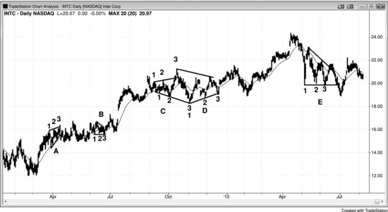

## 第 23 章：三角形

<!-- Source PDF pages 439–444 -->

<!-- PDF page 439 -->

第 23 章
三角形
三角形是震荡区间，因此也是通道，因为它们是被两条线约束的价格行为区域。把震荡区间称为三角形的最低要求是它有三段上推或下推。由于它们有更高低点或更低高点，或在扩展三角形中两者皆有，它们也有一些趋势行为。楔形是上升或下降的三角形。当它们只是略微倾斜时，交易者称之为三角形；当斜率更大时，他们通常称之为楔形。多头或空头旗形可以是楔形，通常只会成为延续形态。楔形也可以出现在趋势末端并形成反转形态。因为它们的表现更像旗形或反转形态，而非传统三角形，它们在那些章节中讨论，而非此处。
扩展三角形被两条发散的线约束，两条在技术上都是趋势通道线，因为上线位于多头趋势中的高点之上（更高高点），下线位于空头趋势中的低点之下（更低低点）。oo（外包-外包）形态——一根外包K线后跟更大的外包K线——是小扩展三角形。收缩三角形被两条趋势线约束，因为市场同时处于小空头趋势与小多头趋势中。ii 形态在更低时间框架图上通常是小三角形。上升三角形上方有阻力线、下方有多头趋势线；下降三角形下方有支撑线、上方有空头趋势线。楔形是趋势线与趋势通道线收敛的上升或下降通道，是三角形的变体，因此也是一种通道。所有三角形在一个方向至少有三段、在另一方向至少有两段，每一个有三段且横向或倾斜、形状像楔形的形态都是三角形。与可以无限延伸的趋势通道和震荡区间不同，当市场处于三角形中时， <!-- PDF page 440 --> 它处于突破模式，意味着突破即将到来。突破可以强或弱；可以有跟随并导致趋势，可以失败并反转，也可以只是横向并演化为更大的震荡区间。
像所有震荡区间一样，三角形是趋势中的停顿，突破通常朝先前趋势的方向。多头趋势中的三角形通常向上突破，空头三角形通常向下突破。楔形可能更复杂。空头楔形是向下倾斜的楔形，像所有空头通道一样，是多头旗形。当向下倾斜的楔形出现在更大的多头趋势内时，向上突破是朝更大趋势方向，符合预期。然而，一个大的空头楔形可以占满整个屏幕，在这种情况下屏幕上的K线处于空头趋势中。向上突破此时是反转，是逆屏幕上趋势的突破。屏幕左侧之外是否有清晰的大多头趋势并不重要。任何向下楔形都会像多头趋势中的大回撤一样表现，这意味着它会像多头旗形一样表现。向上突破是出离屏幕上空头趋势的反转，但它是预期方向，因为每一个空头通道——无论线条是否收敛形成楔形——都像多头旗形一样运作，并应被当作多头旗形。事实上，大多数在更大时间框架图上就是多头旗形。
每一个有三段上推的震荡区间在功能上与三角形完全相同。大多数是三角形，但有些没有清晰的三角形形状。然而，由于它们的表现与三角形完全一样，应按完美三角形来交易。因为它们比一段式回撤（High 1 与 Low 1 回撤）和两段式回撤（High 2 与 Low 2 回撤）更复杂，它们代表更强的逆势压力。由于相反方向的交易者在变强，这些形态往往出现在趋势与波段的晚期，并常成为最后旗形。若三角形有超过三段上推，大多数交易者开始把修正称为震荡区间。
若形态倾斜并有三段上推，许多交易者错误地把它看作楔形并寻找反转。然而，如第 18 章关于楔形所讨论的，若三段式形态处于窄通道中，该形态通常会像通道一样无限延续，而不会像 <!-- PDF page 441 --> 楔形一样反转。若楔形有三段上推，单凭这一点并不是朝相反方向交易的理由。当交易者不确定楔形是否即将反转时，他们不应在突破时入场。例如，若有一条相当陡的下行通道，趋势线与趋势通道线收敛但相当靠近，交易者不应买入第一次向上反转或楔形的多头突破。他们应等到多头突破发生，然后评估其强度。若突破很强（强突破的特征在第 2 章讨论），他们应等待回撤，然后在回撤结束时入场（突破回撤买入）。若数根K线没有回撤，则市场正在形成强多头尖峰，在大多数交易者眼中几乎肯定已变为始终做多。然后他们可以像对待任何其他强突破一样交易它。他们可以买入某根K线的收盘、买入前一根高点上方、用限价单买入任何小回撤，或等待回撤。
由于大多数三角形相对水平，多头与空头处于平衡，这意味着双方都在这一价位看到价值。因此，突破常常走不了多远就反转回区间，三角形常常是趋势中的最后旗形。若突破失败，市场通常会被拉回震荡区间，有时从相反一侧突破，并成为两段式修正甚至趋势反转。这种震荡区间行为在第四部分关于震荡区间的讨论中有更多说明。
由于上升、下降与对称三角形有相同的交易含义，没有必要区分它们，它们都可以称为三角形。所有这些三角形都大体水平。它们略更常朝先前趋势方向突破，但不足以单凭此下单。由于每一种都是震荡区间的一种，每一种都是不确定区域，最好等待突破再下单。然而，当形态足够高时，你可以像震荡区间一样交易它，在极端处逆势，寻找在底部附近买入、在顶部附近卖出。突破常常失败，像任何通道的突破一样，若市场反转回通道，通常会测试对侧。若它朝任一方向突破，突破通常导致大约等于通道高度的等幅运动。

<!-- PDF page 442 -->

若它越过该目标，市场很可能处于趋势中。
扩展三角形可以是趋势末端的反转形态，也可以是趋势内的延续形态。一旦它们突破，突破常常失败，市场随后反转，从另一侧突破，并形成更大的扩展三角形。扩展三角形反转于是成为延续形态，扩展三角形延续形态于是成为反转。例如，若空头趋势底部有扩展三角形，它是反转形态。一旦市场反弹并突破三角形顶部，突破常常失败，市场随后再次转下。结果是大扩展三角形空头旗形。有时扩展三角形可以导致主要反转，但通常它更像震荡区间，并演化为某种其他形态。第三册关于趋势反转形态的章节有更多讨论。
图 23.1 画三角形有许多方式

大多数交易者把三角形简单看作有三段或更多上推或下推的震荡区间。若它开始有超过五段上推，大多数交易者停止使用三角形一词，而只称该形态为震荡区间。你怎么称呼它并不重要，因为所有震荡区间表现相似。

<!-- PDF page 443 -->

大多数 ii 形态，如图 23.1 中 K线 5、K线 24 以及 K线 25 前一根，应被当作小三角形，因为大多数在更小时间框架图上是三角形。
K线 4、7 与 9 的低点是横向形态中的三段下推，形成三角形。K线 4、6 与 8 的高点形成三段上推，因此也形成了三角形。
K线 3、11（或其前两根中的任一）以及 13、15 或 18 中任一的低点形成三段下推，有些交易者把每一个都看作三角形。K线 26 是从 K线 3 到 K线 18 的大三角形在 K线 24 突破后的两K线反转突破回撤买入形态。
K线 18、K线 19 以及 K线 20 之后那根的低点形成三段下推。K线 18 之后十字星的高点、K线 19 之后的多头K线以及 K线 20 形成三段上推并形成三角形。K线 23 是 K线 22 突破三角形上方后的回撤。
图 23.2 三角形

图 23.2 所示英特尔（INTC）日线图有许多三角形，它们几乎从不是完美的。三角形 A 是上升楔形。突破没有动能，形态演化为窄幅震荡区间。当市场在反弹中突破上升楔形却横向而非向下时，这是强势迹象，多头很可能回归。若空头在多头趋势中看到上升楔形却无法把市场向下反转，他们不久就会回补空头并等待 <!-- PDF page 444 --> 再做空。这使市场单边，向上突破会继续到空头再次愿意做空、多头也愿意通过卖出部分或全部多头来止盈的价位。
三角形 B 与 E 都是下降三角形，B 向上突破。三角形 E 先向上突破，突破失败。然后向下突破，突破再次失败。
三角形 C 是扩展三角形。交易者本可以在 K线 3 高点做空。扩展三角形顶部通常演化为扩展三角形底部，反之亦然，这个也是。交易者可以在 K线 3 低点上方买入。
三角形 D 是不完美的对称三角形。由于对称三角形只是震荡区间，交易者本可以在下方多头趋势线的测试处买入，在上方空头趋势线的测试处做空。
