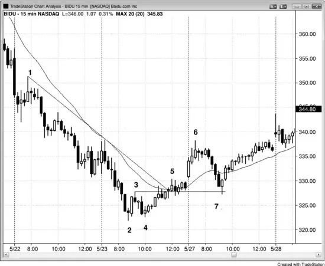
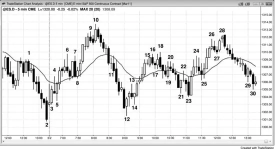

### 第24章 剥头皮、波段交易、交易与投资

<!-- CHAPTER 24 Scalping, Swinging, Trading, and Investing -->

<!-- Source PDF pages 446–466 -->

<!-- PDF page 446 -->

第 24 章
剥头皮、波段交易、交易与投资投资者是基于基本面买入股票、并计划持有六个月至多年的人，以便让有利的基本面反映到股价中。若股价对他们不利，投资者常会加仓，因为他们相信当前价格仍有价值。交易者则依据日线图与短期基本面事件（如财报、产品发布）交易，意图捕捉持续一天到数天的快速行情。交易者会在第一次停顿时部分获利，然后把剩余仓位的止损移到保本；他们不愿让利润变成亏损。交易者有时也被称为剥头皮者，但该术语更常指一类日内交易者。顺便说一句，坚守自己的时间框架很重要。亏损的一个常见原因是：做了一笔交易，看着它变成亏损，不在计划止损处离场，却说服自己把它转成投资也没关系。若你是作为交易开的仓，就按交易离场并接受亏损。否则你几乎总会持有太久，亏损会变成原计划最坏情况的许多倍。此外，它会持续干扰你，影响你下单与管理其他交易的能力。

在使用日线至月线时间框架的交易者或投资者眼中，所有日内交易都是剥头皮。然而对日内交易者来说，剥头皮是持仓约一到十五分钟，通常在利润目标处用限价单离场，试图在剥头皮者所用时间框架上捕捉一小段行情。一般来说，潜在回报（到利润目标的 tick 数）大约与风险（到保护性止损的 tick 数）相当。剥头皮者不想有回撤；若目标到达前价格回撤，会迅速在保本离场；因此剥头皮者可比作日线图上的交易者。

<!-- PDF page 447 -->

日内波段交易者会持有交易穿越回撤。他们试图捕捉当日两到四次较大波段，每次持仓从十五分钟到一整天。其潜在回报通常至少是风险的两倍。他们可比作日线图上的投资者——愿意持有仓位穿越回撤。

1990 年代，媒体与机构投资者嘲笑日内交易者（多为剥头皮者）是赌徒、毫无用处。批评者完全忽略了所有交易者提供的一项重要功能：增加流动性、从而缩小买卖价差，使每个人的交易成本更低。相当一部分批评可能来自华尔街既有机构投资者。他们相信自己拥有这个游戏、自己是王者，不尊重不按他们方式玩的人。他们为 MBA 辛苦奋斗，认为一个高中辍学生理论上只花几个月学简单交易技巧就能发财是不公平的。机构享受公众仰慕带来的敬畏，在某种程度上也怨恨这些“没受过教育的新贵”获得的关注。一旦高频交易（HFT）公司成为华尔街成交量最大的交易者，业绩远超传统机构投资者，媒体才开始关注，并给予它们比自华尔街创立以来统治市场的“恐龙”更多的尊重与敬畏。HFT 公司是终极日内交易者，也使日内交易变得体面。CNBC 的 Fast Money 每天都有交易者——他们常做剥头皮——并被呈现为值得钦佩的成功交易者。现在，一般看法是：做交易者赚钱很难；若你能做到，就值得大量尊重，尤其来自其他交易者。你如何交易并不重要。重要的是业绩；在资本主义社会本应如此。成功的投资者、交易者、日内波段交易者与剥头皮者都应得到同样的尊重与钦佩，因为他们都在做特别的事，而做好需要非凡才能与大量艰苦工作。

如第 25 章关于交易者公式一节所讨论的，波段交易者站在所有剥头皮交易的对手方，但他们也站在反向波段交易者的对手方。剥头皮者的回报大约与风险相当，且概率较高。不可能同时存在方向相反、风险、回报与概率都相同的剥头皮。

<!-- PDF page 448 -->

例如，市场不可能同时有 60% 的概率先上涨两点再下跌两点，又有 60% 的概率先下跌两点再上涨两点。看多头趋势：若多头交易者在 Emini 可靠回撤中、在强信号 K 线上方 1 tick 买入，入场价 1254，则两点止损在 1252、利润目标在 1256。多头只会在认为交易很可能成功时才做，这意味着他至少 60% 确定，也就是市场跌到 1252、止损被打掉的概率为 40% 或更低。若空头剥头皮者站在对手方、在 1254.00 做空，其止损在 1256、利润目标在 1252。既然跌到 1252 的概率是 40% 或更低，空头实现利润的概率也是 40% 或更低。实际上几乎总是更低，因为限价获利单要成交，市场通常还得再走 1 tick，那是更大的运动，更不可能。

由于数学，剥头皮对手方的成功概率必然更低。在非常有效的市场中，机构控制价格行为，每笔成交都必须有一个或多个机构愿意做一方、另一些机构愿意做另一方（没有什么是绝对的，但大体如此）。这意味着合理剥头皮的对手方若要有有利可图的交易者公式，其回报必须大于风险（你必须假定如此，因为他是机构，或是在做机构也愿意做的交易）。这使他成为波段交易者。由于波段交易的概率常常是 40% 或更低，波段交易者可以站在剥头皮者的对手方，仍有正的交易者公式。若市场跌两点的概率是 40%，试图赚超过两点的波段空头，成功概率必须低于 40%。然而若管理得当，仍可用该策略持续盈利。例如，从后文关于分批加仓的讨论可见，他可能用远大于两点的止损，并在市场走高时分批加空数次。

<!-- PDF page 449 -->

若如此，其成功概率可以是 60% 或更高。一旦市场终于下跌，他可在原入场价 1254 平掉全部仓位。若在原做空入场价平掉全部，第一笔入场保本，之后在更高价做的空单都有利润。

要有效剥头皮 5 分钟 Emini 图（当前平均日波幅在八点到十五点之间），你大约要冒两点风险，利润目标通常在一点到三点之间。一点剥头皮上，你必须在超过 67% 的交易上获胜才能保本。对某些交易者这可实现，但对大多数人不现实。一般规则是：只做潜在回报至少与风险一样大、且你对交易有信心的交易。若你有信心，一条经验是假定你认为成功概率至少 60%。在 Emini 中，当平均日波幅为 10 到 15 点时，基于 5 分钟图的大多数交易，两点止损目前是最可靠的止损，因此利润目标也应至少两点。若你认为两点不是现实目标，就不要做这笔交易。顺便说，许多年前我有个朋友，曾一次交易 100 张 Emini，每天约做 25 笔、每笔剥头皮两个 tick。他住在 12,000 平方英尺的房子里，我假定他做得不错。然而这属于高频交易领域，对绝大多数交易者几乎不可能持续盈利。我还有一个朋友，曾告诉我一位共同熟人在华尔街做律师赚了数百万，做交易者却几乎亏光。他大概以为自己比那些做交易赚数百万的客户聪明得多，至少应做得一样好。他剥头皮 100 张 Emini，头几年亏了 200 万美元。他或许聪明，却不明智。看起来容易并不等于真的容易。

“只挑最好的樱桃”这个问题迟早会进入每个人的脑海。与其担心一天做 20 笔、每笔赚一点，不如只剥头皮当日最好的三笔、每笔赚一点？理论上可行，但 <!-- PDF page 450 --> 现实是：若你为完美交易等了这么久，又为学会如何识别如此好的交易辛苦了这么久，就必须确保自己得到足够回报。一点不够。例如，若你相信自己即将买入当日最好的一两次设置之一，应假定市场会认同该设置很强。这意味着始终持仓（always-in）很可能明确翻多，至少会有两段上涨到某种等幅运动或磁吸区，且行情应至少持续 10 根 K 线。与其冒两点风险只剥头皮一点，远更合理的是至少出场两点，甚至四点。若你情感上处理不了，且发现自己在第一次回撤时就保本离场，可在做多后立即挂一取消另一（OCO）括号单：两点保护性止损与两点获利限价单。一旦一方成交，另一方自动取消。然后去散步，约一小时后再回来。这样做几次后，你可试三点或四点利润目标而非两点，或许很快会发现这些交易平均每天能赚四点利润。

有些剥头皮者所有交易都剥头皮，但许多交易者会根据情况剥头皮或做波段。对第二类剥头皮者而言，剥头皮概念隐含的是：他们并非在明确的始终持仓方向上交易。若在剥头皮，他们必须相信要么没有清晰趋势，要么其交易是逆势的；否则他们会做波段。即使市场一直在趋势、交易者在回撤中入场，若他们剥头皮，也意味着他们认为趋势即将结束，至少暂时如此。例如，若他们买入多头旗形却只以剥头皮离场，他们怀疑市场即将进入震荡区间。若他们另有看法，会为更大利润持有仓位。每当交易者看到信号后市场回撤三或四个 tick，这是大交易者认为市场不太可能走远的迹象。因此交易者只会考虑震荡区间交易或逆势交易，而非趋势交易。既然这意味着市场可能处于震荡区间，有经验的交易者会倾向于剥头皮而非波段，并寻找低买高卖。

<!-- PDF page 451 -->

当交易者做逆势交易时，有时会用较小仓位（如半仓），因为他们愿意在市场不利时加仓。若加仓，可能在市场回到第一笔入场价时离场。这样第一笔保本，第二笔有剥头皮利润。每当剥头皮时，利润目标常约为波段最小目标的一半，但风险通常相同。这意味着回报大约与风险相当，因此成功概率至少要 70%，否则该做法是亏损策略。分批加仓可提高胜率，代价是仓位更大、风险更大。剥头皮看起来容易诱人，却是极难持续盈利的方法。

若你在赚到几点后部分获利，并对剩余仓位用保本止损做波段，可降低所需胜率。若在入场 K 线收盘后把止损从信号 K 线极值移到入场 K 线极值（两边各 1 tick 之外），再在走出五 tick 后移到保本，可进一步降低当日盈利所需的胜率。最后，有些剥头皮者用三到五点的较宽止损，在市场不利时加仓，并用较宽利润目标，这再次降低所需胜率。一般而言，若你看到极高概率交易，它很可能是剥头皮而非大波段。因为每当出现如此明显的失衡，市场会迅速纠正，所以极高概率、相对低风险的情形不会持续超过一两根 K 线。

波段交易者使用与剥头皮者相同的设置与止损，但专注于每天少数几笔可能至少有两段行情的交易。他们通常可在每笔交易的一部分仓位上净赚四点或更多，然后把剩余仓位止损移到保本。许多人会让市场反向运行并在更好价格加仓。然而他们始终至少有心理止损；若市场到那一点，他们断定想法不再有效，会带亏损离场。始终关注剥头皮者的止损在哪里，若形态仍有效，可在该位置加仓。若你买入自认为的反转，可考虑让市场走出更低低点，然后在第二次入场加仓。

<!-- PDF page 452 -->

例如，对像苹果（AAPL）这样可靠的股票，若你买入自认为接近行情低点的位置，且大盘并非空头趋势日，可考虑在交易上冒两到三美元风险，并在已有一到两美元浮动亏损时加仓。然而，只有读图能力很强、且能接受读错时大额亏损的有经验交易者，才应尝试。多数日子市场应立即朝你有利的方向走，因此这不是问题。

波段交易者可以建仓，并在已有合理利润后，随每次后续信号加同样规模的仓位。整个仓位的止损是最近一次加仓的止损，通常意味着即使最后一笔亏损，更早入场仍有利润。若市场出现反向信号，他们也会在拖尾止损被打掉前离场。

人人都想要很高的胜率，但极少有人能持续在 70% 或更多交易上获胜。这就是为什么极少交易者能靠在 Emini 上剥头皮一两点谋生，尽管几乎每个人起步时都会试一阵。对大多数交易者而言，要成功就必须学会接受较低胜率，并培养耐心做波段，允许途中有回撤。即使交易者是非常成功的剥头皮者，除非偶尔也愿意做波段，他们通常不会参与某些漫长趋势——那些趋势中成功概率常常只有 60% 或更低。许多很好的交易者在这些时段安静地坐着，只等着高概率剥头皮，错过往往很长的一段行情。这是可接受的交易方式，因为交易的目标是赚钱，不是不断下单。

当 Emini 平均日波幅为 10 到 15 点时，通常每天至少有一笔交易，交易者可用止损入场、用限价单出场赚四点。由于 99% 的日子至少有五点波幅，理论上交易者可用限价单进出赚四点，但在小波幅日没人能持续做到。一般而言，交易者更容易发现可用止损入场、用限价单或 <!-- PDF page 453 --> 拖尾止损出场的设置。90% 的日子至少有一个四点波段，约 10% 的日子会出现约五个四点波段。多数日子有一到三个波段，交易者可从止损入场赚四点。若交易者一天做 10 到 15 笔，则多数是剥头皮。然而强剥头皮者会知道何时设置有合理机会成为四到十点的波段，并在这些情形下通常对四分之一到一半仓位做波段。一旦剥头皮部分离场，若市场继续朝波段方向、出现额外入场，他们通常会在新设置出现时再开剥头皮。

在日终看图时，波段交易看起来远比实际容易。波段设置往往要么不清晰，要么清晰却吓人。多数波段设置有 40% 到 50% 的机会走到交易者的利润目标。在另外 50% 到 60% 的交易中，要么交易者在目标到达前因认为目标不再合理而离场，要么保护性止损被打掉。多数波段交易者在反转处入场，因为若希望赚四点或更多，需要尽早入场。当趋势特别强时，他们常可在回撤中、甚至在强尖峰中某根 K 线收盘入场赚四点，但这些情况一周只出现一两次。多数波段交易者试图买入某种双底、做空某种双顶，或在当日头一两小时做其他可靠的开盘反转设置。他们常要在几次反转后才有一次变成大波段，但总体在未到四点目标的交易上通常仍赚钱。那些交易变成了剥头皮。例如，若交易者在第一小时买入双底，六根 K 线后市场形成合理的双顶，交易者可能反手做空，多头或许赚一两点。正如剥头皮者有时做波段，多数波段交易者最终会有很多剥头皮。一旦波段交易者认为前提不再有效，就会离场，常以剥头皮结束。波段交易者看到合理设置后必须做。波段设置几乎总是比剥头皮设置更不确定，较低的概率常使交易者等待。当有强信号 K 线时，它通常作为非常情绪化的反转的一部分出现，而初学者仍以为旧趋势仍在。

<!-- PDF page 454 -->

初学者通常对此没有准备。他们可能仍认为旧趋势有效，可能今天已在几次逆势交易上亏损、不想再亏。否认使他们错过早期入场。在突破时或突破 K 线收盘后入场很难，因为突破尖峰往往很大，交易者必须迅速决定冒比平常大得多的风险。这就是为什么他们常选择等待回撤。即使他们减小仓位使美元风险与其他交易相同，想到要冒两到三倍 tick 数的风险也会吓到他们。在回撤中入场也困难，因为每次回撤都以小反转开始，他们害怕回撤可能是深度修正的起点。他们最终等到几乎收盘才认定趋势清晰，但已没有时间下单。趋势尽其所能把交易者挡在外面，这是让交易者整天追逐市场的唯一方式。当设置容易清晰时，行情通常是小而快的剥头皮。若行情要走很远，就必须不清晰、难以下手，才能让交易者坐在场边并迫使他们追逐趋势。

波段交易者应始终思考是否应在利润目标到达前提前离场。一个帮助决定的方法是：想象自己空仓，并思考是否应以波段规模仓位、止损恰好放在已在场内的波段交易者的止损处市价入场。若你不会做那笔交易，就应立即平掉波段仓位。因为持有当前波段交易在财务上等同于以该价格、该止损新开同样规模的交易。多数波段交易者若交易未按预期展开会剥头皮离场，多数剥头皮者在最佳设置入场时会对部分仓位做波段，因此两者有大量重叠。根本区别是：剥头皮者做多得多的交易，其中多数不太可能超过剥头皮利润；而波段交易者尽量只做可能至少有两段行情的交易。两者没有高下，交易者选择最适合自己性格的方法。

<!-- PDF page 455 -->

如第 25 章交易者公式一节所讨论，波段交易通常比剥头皮交易更不确定。这意味着成功概率更低。然而做波段的交易者寻找大利润，利润通常至少是风险的两倍。更大的潜在利润补偿了较低的成功概率，可带来有利的交易者公式。最大的波段来自震荡区间的突破与反转，而多数反转形态是震荡区间。这是不确定性最高、成功概率常常 50% 或更低之处。波段交易者需要寻找回报相对风险足够大、以补偿较低成功概率的设置。剥头皮确定得多，但高度确定意味着市场中有显著大失衡，大失衡会被交易者迅速注意到并中和。结果是市场迅速回到混乱状态（震荡区间）。剥头皮者必须快速决定是否交易并获利了结，因为行情通常会在几根 K 线内回到入场价。

波段持续很久是因为不确定性，而不确定性通常是持续许多根 K 线、覆盖许多点的交易的关键组成部分。这就是强多头趋势中常提到的“担忧之墙”，在强空头趋势中以相反形式起作用。趋势交易的困难在第一册讨论。趋势以小或大尖峰开始，然后演化成小或大通道。当突破很小时，交易者不确定是否会有跟随。当突破又大又强时，不确定性换一种形式。交易者不确定为留在交易中要冒多大风险，以及因大风险交易者公式是否有利。他们看到大尖峰，意识到可能要冒尖峰对面的风险。风险增大导致仓位小得多。然后他们在进入通道时追逐市场，因为初始仓位小于他们想要的。通道又有双向市场的不确定性。日终时，初学者看图看到强趋势，纳闷自己怎么错过了。原因是：所有大行情在展开时都是不确定的，这会把交易者困在最强趋势之外。它也常把交易者困进逆势交易，导致 <!-- PDF page 456 --> 反复亏损。即使初学者对概率有感觉，也感觉到趋势是低概率事件——确实如此。最强趋势一个月只出现几次，所以初学者知道今天长成那种强趋势日的几率很小。结果要么否认并被困出场，要么对抗并反复亏损。相反，他们需要学会接受，并跟随市场正在做的事。若它无情地上涨，即使看起来弱，他们也至少要买一小仓，并做波段。

波段交易的交易管理与始终持仓交易相同（第三册讨论），只是波段交易者倾向于在交易朝有利方向时分批减仓。真正的始终持仓交易者持有仓位直到出现反向信号，然后反手做反向交易。对多数交易者，波段交易的入场与止损与第一册讨论的趋势交易相同。一个重要区别是：多数波段交易者对震荡区间中的出场与趋势中的出场不同。在趋势中，他们更可能让部分仓位运行到出现反向信号；而在震荡区间中，他们更可能在接近震荡区间极值时平掉剩余仓位。那时他们决定：运动是否足够弱、反转形态是否足够强，以致应寻找反向波段；还是波段足够强，以致应等待回撤并在原方向第二次腿入场。

当 Emini 平均日波幅为 10 到 15 点、交易者通常可用两点保护性止损而不被多数好交易打掉时，许多波段交易者会根据情况在两到四点部分获利。若交易者认为市场处于震荡区间、并在底部买入向上反转，等距运动的概率通常为 60% 或更高。既然冒两点风险，就有 60% 的机会在止损被打掉前赚两点。这产生最低可接受的交易者公式，因此交易者可在两点部分获利。若交易者相信震荡区间足够高、可赚三或四点，他们可能在该水平部分或全部获利。其他交易者会在阻力位（如等幅运动目标处的次要反转、先前摆动高点上方、以及空头趋势线与多头趋势通道线超调与反转（失败突破））对多头部分获利。

<!-- PDF page 457 -->

他们会在相应支撑位对空头部分获利。所有交易者在有强反转信号时都会平掉最终仓位。记住：他们会在弱反转信号上部分或全部获利，但通常不反手。因为交易者对出场与入场使用不同标准。入场需要更强信号，但在与持仓相反方向的较弱信号上会部分或全部获利。有许多方式可盈利地做波段交易，唯一主要问题是交易者公式。只要数学说得通，方法就有利可图，因此合理。

对有经验的交易者来说，主要在交易 Emini 时做剥头皮（当平均日波幅约 10 到 15 点时寻找两到四点），在交易股票时做波段，是合理的。若你是那极少能在 80% 或更多交易上获胜的交易者之一，则可对一些 Emini 交易剥头皮一点利润。在四点利润后用限价单平掉部分或全部——这通常要求行情延伸到信号 K 线外六个 tick（入场在信号 K 线外 1 tick 的止损单上；然后还需要四个 tick 利润，限价出场单通常要价格越过目标 1 tick 才成交）。Emini 的四个 tick 是一点，相当于 SPY（ETF 合约）的 10 美分（10 tick）运动。

那么初学者该做什么？多数交易者若利润目标小于风险，即使在 60% 的交易上获胜也会亏钱。初学者常会误判他们以为的 60% 设置。许多交易实际上最好只有 50% 确定性，尽管在他们入场时看起来确定得多。他们大概认为只需要再一点经验就能把胜率提到 70% 或 80%，那时数学就站在他们一边。现实是他们永远不会变得那么好，因为即使最好的交易者也极少到达那里。这是简单的真相。

<!-- PDF page 458 -->

另一个极端是利润至少为风险两倍的波段交易。多数这类设置只有 40% 到 50% 确定性，但足以有有利的交易者公式。多数日子每天有一两个设置，有时五个或更多，多数通常是主要趋势反转（第三册讨论）。若交易者愿意做低概率交易（回报至少是风险的两倍，第 25 章讨论），他需要做每一个合理设置，因为若挑樱桃数学对他不利。这些交易对一篮子交易而言交易者公式为正，但因概率低于 50%，任何单笔交易更可能亏损。概率低是因为设置看起来差，入场后交易常仍看起来弱，通常在强趋势最终开始前有几次回撤。许多交易者反而等趋势开始，使概率到 60% 或更高，尽管交易中剩余利润更少。许多波段设置很强，概率 60% 或更高。此时每笔交易都有正的交易者公式，挑樱桃在数学上可接受。而且数学对波段或剥头皮都有利。多数起步交易者会尝试波段与剥头皮以及几乎其他一切，如不同时间框架与指标，看能否成功、以及某种风格是否更适合其性格。没有唯一最佳方式，任何有正交易者公式的方法都好。许多交易者试图每天抓住五到十个可交易波段，利润至少与风险一样大的概率为 60% 或更高。此时他们通常寻找微型双顶做空、微型双底买入。若交易者认为设置强、可能产生至少与风险一样大的回报，则成功概率至少 60%（第 25 章讨论等距运动的方向概率数学）。这使交易者可用与利润目标相同的止损，仍有有利的交易者公式。尽管这是多数成功交易者采用的风格，多数初学者应先寻找强波段设置，即使成功机会常只有 50% 到 60%。因为当回报是风险的两倍或更多时，尽管成功概率较小，交易者公式甚至更强。在 Emini 中，当平均日波幅 <!-- PDF page 459 --> 约 10 到 15 点时，寻找有良好机会出现四点（初始风险的两倍）或更多波段的交易，并在四点部分或全部离场。有经验后，交易者可对部分剥头皮两到四点，然后对余额做波段。若专注这些设置，就给自己成为盈利交易者的合理机会。若交易者发现自己常离场太早，应考虑挂 OCO 单（一方在两到四点获利，另一方以两点或更少亏损止损），走开，一小时后再回来。他或许会惊讶地发现自己突然成了成功交易者。一旦趋势确立，寻找趋势方向的额外入场，多数剥头皮两点、冒约两点风险；若趋势非常强，对部分做波段。尽管听起来简单，交易永远不容易，因为你在零和游戏中与非常聪明的人竞争，日终看起来如此明显的东西在实时通常一点也不明显。学会盈利交易需要很长时间；即使学会了，你每天也要保持敏锐与纪律。这有挑战性，但这正是吸引力的一部分。若你成功，财务回报可以很大。

说到股票，利润目标的大小差异大得多。对平均日波幅 10 美元的 500 美元股票，剥头皮 10 美分很愚蠢，因为你可能要冒约两美元，胜率必须超过 95%。然而在 QQQ 中剥头皮 10 美分或许值得，尤其若你交易 10,000 股。

在高成交量股票（每天至少三百万股，最好七百万或更多）、平均波幅数美元中寻找波段相对容易。你想要最小滑点、可靠形态、每笔至少 1.00 美元利润。尝试剥头皮 1.00 美元，然后对余额用保本止损；持有到收盘或直到出现清晰强劲的反向设置。你或许能整天定期关注约五只股票，有时在不同时段再查最多约五只，但你很少会交易它们。

Emini 剥头皮者一天可能只能做一两笔股票交易，因为 Emini 日内交易需要太多注意力。另外，若你对股票 <!-- PDF page 460 --> 只用柱状图，可在一个屏幕上放六张图。只挑趋势最好的那只股票，然后寻找移动平均线附近的回撤。若看到趋势通道超调与反转，且先前有强趋势线突破，也可交易反转。若 Emini 市场活跃，考虑只交易 15 分钟股票图，需要的注意力更少。

当你预期显著行情或新趋势，或在强趋势的回撤中入场时，在至少等于初始风险一到两倍的剥头皮利润处平掉 25% 到 75% 合约，然后在市场继续朝有利方向时分批减掉剩余合约。在剥头皮部分离场后，把保护性止损移到保本附近。有时若你强烈感到交易仍会有效，而离场再入场会在更差价格，你可能愿意在 Emini 上冒四到六个 tick。好交易不应回来让后来者与在完美时机入场的聪明交易者以同样价格入场。若交易极好，所有错过初始入场的交易者现在都急于入场，愿意在更差价格入场，并在比原入场差一两个 tick 处挂限价入场单，使原交易者的保本止损不被打掉。然而有时最好的交易会回到保本止损之外，把交易者困出场，随后变成巨大、快速的趋势。当这看起来可能时，多冒几个 tick。此外，若它回来扫掉那些止损、然后立即恢复新趋势，在前一根 K 线外 1 tick 重新入场或加仓（在新多头趋势中，是前一根高点上方 1 tick）。

若市场触及利润目标限价单但未越过、订单仍成交，意味着可能有比图上明显更多的趋势压力，市场在随后几根 K 线内越过利润目标的几率增加。若你做多、市场愿意在该腿最高 tick 从你手中买回仓位（你在限价卖出获利），买家积极，并可能在任何回撤中再次出现。寻找再次做多的机会。

<!-- PDF page 461 -->

类似地，若市场触及你的利润目标（例如信号 K 线外九个 tick）但你未成交，这可能是失败。若你做多、市场打到信号 K 线上方九个 tick 却未成交，考虑把止损移到保本。一旦该 K 线收盘，若背景使反转交易可能，考虑在该 K 线下方 1 tick 挂单做空，因为那里很可能是剩余多头剥头皮者离场处，提供卖盘压力。此外，他们在更多价格行为展开前不想再买，从而从市场移除买家，增加空头把市场推低到你可剥头皮离场空单的几率。五或九 tick 失败突破常见于漫长趋势末端，常是反转的第一迹象。

尽管所有股票基本上以同样方式交易，它们之间有细微个性差异。例如，苹果（AAPL）在测试突破时非常“有礼貌”，而高盛（GS）倾向于扫止损，需要更宽止损。

尽管理论上可能靠在 Emini 上剥头皮一点、冒四到八个 tick、使用更小时间框架图（如 1 分钟或 1,000 tick 图）谋生，这就像试图靠淘金谋生、只收集沙粒而非金块。真的很辛苦，即使做得好也只有极少利润，而且不好玩。若你追求更大利润、并使用不大于利润目标的止损，成功并愉快交易许多年的机会大得多。

图 24.1 强劲反弹后的回撤中的波段做多

<!-- PDF page 462 -->

如图 24.1 所示，百度（BIDU）在昨天晚些时候突破 15 分钟趋势线上方，因此可能至少有两段上涨。第二段上涨可能在 bar 5 结束，但今日开盘如此强劲，回撤后可能尝试超过它。跌到 bar 7 很急，但 bar 7 是强多头反转 K 线，反转了移动平均线缺口、跳空高开、以及对 bar 3 高点的测试（它扫掉该高点下方的止损并急剧向上）。对 300 美元的股票，你需要更宽止损；因此交易更少股数以保持风险相同，但在交易的剥头皮部分使用更大利润目标。两美元是合理的初始目标，然后把止损移到保本，并在收盘前离场。由于这是来自空头尖峰与通道的多头反转，有合理机会市场甚至测试空头通道顶部的 bar 1。

若非常成功的剥头皮者相信任何交易的概率低于 70%，他们可能选择不参与跌到 bar 7 的四根空头尖峰中的做空。专门做剥头皮的交易者 <!-- PDF page 463 --> 在较弱尖峰期间若认为概率不足以剥头皮，常会安静地坐着。结果是他们有时错过相对大的波段。然而，对能在 70% 或更多交易上获胜的少数交易者而言，这仍是可接受的交易方法。

图 24.2 上下波段

今日（如图 24.2 所示）为双向波段交易者提供许多机会。市场昨天几乎跌了 2%，但数月来一直处于强多头趋势。抛售只是日线移动平均线下方的刺穿，也是 60 分钟尖峰与通道多头趋势中对多头通道底部的回撤测试。这意味着交易者把这里看作支撑区，并认为昨天急剧抛售可能只是卖盘真空，而非空头趋势的开始。bar 3 与 bar 5 都是强多头趋势 K 线，且都跟随测试昨日低点的尝试。当日第一根 K 线顶部有大影线，意味着它在收盘前下跌。然而，市场没有找到足够空头把市场推到昨日强空头收盘下方，多头如此强，不允许 Low 1 做空触发。bar 4 的 Low 2（有人看作 Low 1）触发了，但被 bar 5 强劲反转向上。交易者认为这可能是当日低点，并在 bar 5 上方用止损单买入做波段向上。bar 7 的双顶从未触发，因为它是两 K 线反转，触发在两根中较低者下方（bar 7 前的多头 K 线），而不仅仅在空头 K 线下方。

<!-- PDF page 464 -->

一些多头在 bar 6 与 bar 7 形成时在这里部分获利（两到三点，取决于买入位置），多头平仓造成 K 线顶部影线。双顶之后是 bar 8 多头趋势 K 线，形成多头波段中移动平均线上方的 High 2 买入信号，这是可靠的买入设置。一些多头在此入场上方两、三或四点部分获利，另一些在三或四点全部获利。许多人直到市场在 bar 10 两 K 线反转给出卖出信号才离场。与许多波段交易一样，卖出设置并不理想，因为从 bar 8 上行的动能很强。这降低了波段做空成功的概率。然而，若这是震荡区间日，空头至少有 50% 的机会测试当日波幅中部，约在入场价下方五点。冒约两点风险，这产生良好的交易者公式。

这是强空头日之后的第二段上涨，因此可能是当日高点。一些空头在这里做空，但其他交易者怀疑在如此强劲反弹后是否还会有另一次向上尝试。一旦市场在 bar 11 前的空头 K 线中强劲向下突破，交易者放弃了市场可能形成到移动平均线的多头旗形回撤的想法。许多交易者在这根大空头 K 线上做空，这就是为什么它是大空头突破 K 线。另一些在 bar 11 收盘做空。由于它没有多头收盘，确认了空头突破。还有一些追逐市场下跌，在随后的空头 K 线上做空。由于交易者知道市场可能在昨日低点附近形成双底，这次抛售可能是卖盘真空而非空头趋势。这使许多交易者不愿在今日与昨日低点的支撑附近做空。

bar 12 是强多头反转 K 线，低点刚好在昨日低点上方，因此是双底做多的信号 K 线。它也跟随当日最大空头实体，那是衰竭卖盘高潮与卖盘真空，而非空头趋势的开始。聪明的空头在这里获利，但许多人从入场价起在两、三或四点部分获利，预期双底，并预期当日变成震荡区间日。他们的预期基于正确的 <!-- PDF page 465 --> 假定：无论尖峰看起来多强，上下突破尝试的 80% 会失败。强多头也买入卖盘真空，建立新多头。记住 bar 10 的反弹中多头看起来多强，结果后来只被看作买盘真空而非新多头趋势。

在发展中的震荡区间底部，bar 13 失败的 Low 1 做空之后有第二次做多入场，然后是 bar 14 的更高低点多头反转 K 线。许多多头在这里再次做多做波段向上。到 bar 15 的尖峰很强，因此交易者预期回撤后还有一次反弹尝试；多数人认为只要市场守住多头尖峰底部上方，该前提仍有效。一些交易者把保护性止损放在 bar 14 下方，另一些用 bar 12 低点。若他们在尖峰顶部附近买入，风险大，因此仓位必须小。初学者会很难在 bar 12 或 bar 14 上方买入，因为抛售如此陡峭。然而当日看起来像震荡区间日。因此，有经验的交易者愿意买入可能只有约 40% 到 50% 成功机会的设置，如 bar 12，他们相信有潜力在冒约两点风险时赚约五点。bar 14 可能有 60% 成功机会，但那时回报略少。两个设置都有有利的交易者公式，即使初学者会很难做。

激进空头在 bar 18 两 K 线反转下方做空，那是双顶与当日更低高点。其他交易者反而等着买入回撤。

bar 19 看起来像 High 2 买入入场，但由于前一根不是好的买入信号 K 线，多数交易者不会在 bar 19 向上外包时买入。多数会等回撤后再买。有些会在 bar 19 上方买入，因为它有强多头实体，突破其高点会确认其对前一根上方的多头突破。市场没有突破回撤，反而向下突破。

bar 21 是强多头反转 K 线与 High 3 买入设置。然而，由于市场仍在从 bar 18 开始的空头通道中，许多多头 <!-- PDF page 466 --> 宁愿等第二次入场，它随 bar 23 的 High 4 两 K 线反转到来。一些买入 High 4，另一些买入 bar 23 之后多头 K 线上方。他们把这看作 bar 12 到 bar 16 尖峰之后的多头旗形，预期第二段上涨，或许到腿 1 = 腿 2 等幅运动上方。一些在 bar 21 上方买入的交易者意识到市场可能形成突破上方后的更低低点回撤，而这正是所发生的。由于这种可能，许多人用更小仓位与更宽保护性止损，或许在 bar 14 或 bar 12 下方，或三到五点。然后这些交易者在 bar 23 两 K 线反转上方的第二次入场上补足剩余多头。一些多头在固定间隔（如两、三或四点）部分获利，另一些等待价格行为利润目标，如 bar 26 第二段上涨下方或 bar 28 楔形反弹下方（bar 24、26 与 28 是三推向上）。

激进空头在 bar 28 下方或其后空头 K 线下方做空，寻找对 bar 23 尖峰之后 bar 25 多头通道的测试。他们在两、三、四点获利，或在 bar 25 多头通道低点上方、处或下方，或在临近收盘时获利。
