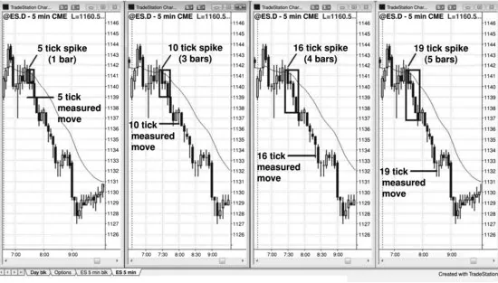
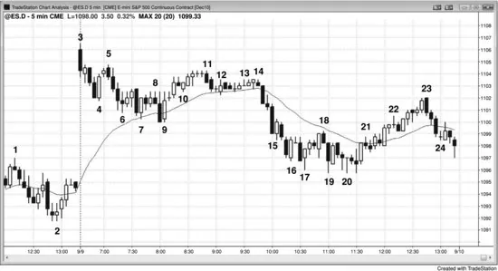
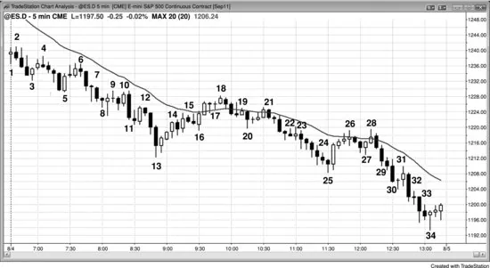

### 第25章 交易的数学：我该做这笔交易吗？做了会赚钱吗？

<!-- CHAPTER 25 Mathematics of Trading: Should I Take This Trade? Will I Make Money If I Take This Trade? -->

<!-- Source PDF pages 467–523 -->

<!-- PDF page 467 -->

第 25 章
交易的数学：我该做这笔交易吗？
做了会赚钱吗？

我有一位交易超过 30 年的朋友，我认为他几乎每天都能在 Emini 上赚到 10 点或更多。他曾对我说，他认为普通初学者应该至少能每天赚 6 点。我告诉他我不同意——多数初学者若能持续每天赚 2 点就会很高兴。谈完后我意识到：有些交易者长期极其成功，以至于完全忘了待在亏损阵营是什么感觉。但这段对话也让我明白：经验足够后，好习惯可以如此深入地成为他们的一部分，交易变得几乎毫不费力。但在每一种情况下，数学仍然必须是他们所做之事的基础。事实上，交易完全就是数学；所有成功的交易者都极好地理解概率与交易者公式。数学随每一 tick 而变，这对不明白发生什么的人是障碍，对明白的人则是巨大优势。

初学者不断寻找完美交易：设置清晰、成功概率高、风险低、回报大。到收盘时，他们纳闷为什么找不到一笔。那些交易肯定存在吧，不然大交易者怎么变富？他们没意识到的是：赚钱非常难，因为市场里满是聪明人，彼此试图从对方手里拿钱。这使任何人永远无法拥有巨大优势。一旦完美设置开始形成，人人都会交易它，它很快就消失，因为没有人愿意站在对手方。错过完美设置的交易者不想追单，只会在回撤时入场。一旦

<!-- PDF page 468 -->

市场在走得不远之后开始回撤，所有以为完美而入场的交易者现在都持有亏损单。他们迅速平仓，完美交易现在朝相反方向走。

作为交易者要赚钱，你需要优势（edge），即基于风险与回报大小、以及利润目标在保护性止损被打掉前到达的概率的数学优势。优势很少很大；因此每当三个变量之一异常好时，会由另外一个或两个变量变差来抵消。例如，若潜在回报远大于风险，即风险相对较小，概率通常也小。若概率高，回报就小，风险也往往高。传统公司的优势是：它们交易量足够大，对市场方向有“投票权”，且同时运行许多交易系统、许多交易者独立交易，从而平滑权益曲线。其目标是小回报，通常每年 10% 到 20% 的利润，风险相对小、成功概率高（它们预期年底赚钱的时间超过 70%）。高频交易（HFT）公司的优势是高度可靠的统计优势，可能只有 5% 或更少（胜率低于 55% 大约就是相对 50–50 纯运气系统 5% 的优势），但它们每周应用数百万次。这给了它们赌场优势。若赌场只有一个客户，他在单次下注上押 10 亿美元，赌场有 47% 的概率因那一注破产。然而，有大量普通规模的下注时，数学极大地有利于其优势带来持续利润。HFT 公司同理。由于许多只试图在每笔交易上赚一两个 tick，其回报极小、每笔风险相对较大，但成功的可靠性高。它们多数大概每天有 90% 或更高的概率盈利，这意味着成功概率高。日内交易者可以拥有的优势是杰出的读图能力，从而有高胜率，可以是 70% 或更高。当与至少与风险一样大的利润目标结合时，他们可以在权益上获得非常高的回报。

<!-- PDF page 469 -->

世界上多数顶尖交易者是主观交易者，用主观评估做决策。为什么超级明星要继续在高盛工作、分享回报，而不是自己出去开对冲基金或自营？极少人会留下，这就是为什么世界最伟大的交易者独立出去，这也是吸引我们所有人的巨大诱惑。华尔街有无数知名交易者靠主观交易每年赚数十亿美元的例子。有些持仓数月或数年，如沃伦·巴菲特；另一些是日内交易者，如“Eurex flipper”保罗·罗特（Paul Rotter）。日内交易者在风险、回报与概率的权衡上有许多选择，有些人愿意接受较低成功概率（比如 40%），以换取是风险三倍或更多的回报。

以下是交易者有优势的一些情形：

成功概率 70% 或更高（回报只需至少是风险的一半即可保本）：
剥头皮——但由于多数交易者无法持续选出成功概率 70% 的交易，他们只有在回报至少与风险一样大时才应做剥头皮。例如，若你认为 Emini 需要两点止损，则只有在至少两点回报合理时才做。

成功概率 60% 或更高（回报至少要与风险一样大才能保本）：
在多头趋势中买入移动平均线处的 High 2 回撤。
在空头趋势中卖出移动平均线处的 Low 2 回撤。
在多头趋势中买入楔形多头旗形回撤。
在空头趋势中卖出楔形空头旗形回撤。
在多头趋势中买入多头旗形突破后的突破回撤。
在空头趋势中卖出空头旗形突破后的突破回撤。
在多头趋势强多头尖峰中买入 High 1 回撤，但不要在买盘高潮之后。
在空头趋势强空头尖峰中卖出 Low 1 回撤，但不要在卖盘高潮之后。

<!-- PDF page 470 -->

在震荡区间顶部做空，尤其是第二次入场。
在震荡区间底部买入，尤其是第二次入场。

趋势反转：
在趋势线被强势跌破后，在测试趋势极值处寻找有良好反转信号 K 线的反转。交易者寻找在底部买入更高低点或更低低点，或在顶部做空更高高点或更低高点。
强最终旗形反转。
在空头阶梯形态中买入第三次或第四次下推，以测试前一次下推的低点。
在多头阶梯形态中卖出第三次或第四次上推，以测试前一次上推的高点。

用限价单入场；这需要更多读图经验，因为交易者是在与交易方向相反的市场中入场。然而，有经验的交易者可以可靠地在这些设置上用限价单或市价单：
在强多头突破的多头尖峰中，以市价、K 线收盘买入，或在前一根 K 线低点或下方用限价单买入（在尖峰中入场需要更宽止损，且尖峰发生很快，因此这一组合对许多交易者很难）。
在强空头突破的空头尖峰中，以市价、K 线收盘卖出，或在前一根 K 线高点或上方用限价单卖出（在尖峰中入场需要更宽止损，且尖峰发生很快，因此这一组合对许多交易者很难）。
在约等幅运动处买入空头突破，若突破不太强——例如，若 Emini 中区间约高 4 点，在区间下方 4 点处用限价单买入，冒 4 点风险，预期测试突破点。只有非常有经验的交易者才应考虑。

<!-- PDF page 471 -->

在约等幅运动处卖出多头突破，若突破不太强——例如，若区间约高 4 点，在区间上方 4 点处用限价单卖出，冒 4 点风险，预期测试突破点。只有非常有经验的交易者才应考虑。
在可能的新多头趋势中（强反转后）或震荡区间底部，在弱 Low 1 或 Low 2 信号 K 线低点或下方用限价单买入。
在可能的新空头趋势中（强反转后）或震荡区间顶部，在弱 High 1 或 High 2 信号 K 线高点或上方用限价单做空。
在移动平均线处安静的多头旗形中，在前一根 K 线低点或下方用限价单买入。
在移动平均线处安静的空头旗形中，在前一根 K 线高点或上方用限价单做空。
在突破多头旗形的多头 K 线下方买入，预期突破回撤。
在跌破空头旗形的空头 K 线上方卖出，预期突破回撤。

成功概率约 50%（回报至少要比风险大 50% 才能保本）：
在震荡区间中分批建仓时的初始入场。
在窄幅震荡区间中买入或卖出，预期突破会使利润是风险的数倍。
在震荡区间中做空更低高点（趋势可能向下反转时），或买入更高低点（趋势可能向上反转时）。由于入场在震荡区间中部，概率是 50%，但回报通常是风险的两倍。

成功概率 40% 或更低（回报至少要是风险的两倍）：
在空头趋势底部买入或在多头趋势顶部做空，反转交易允许小风险与非常

<!-- PDF page 472 -->

大回报——例如，在明确阻力位附近做空反弹，在阻力下方 1 tick 用限价单入场，保护性止损放在其上 1 或 2 tick。限价单入场一章有多个例子。

成功概率 40% 到 60%，视情形而定（概率仅 40% 时，回报至少要是风险的两倍才能保本）：
在多头趋势中市场下跌时用限价单买入突破回测，或在空头趋势中市场上涨时用限价单做空突破回测。
即使信号 K 线不弱，在新多头趋势中或震荡区间底部，在 Low 1 或 Low 2 信号 K 线下方用限价单买入（潜在更高低点）；或在新空头趋势中或震荡区间顶部，在 High 1 或 High 2 信号 K 线上方用限价单做空（潜在更低高点）。例如，若市场可能在多头趋势中完成楔形反转顶并回撤一根或几根 K 线，在 High 1 和 High 2 信号 K 线上方做空，是在你希望的新空头波段中做空。
逆势交易磁吸区，如在多头趋势中等幅运动上涨处做空，或在空头趋势中等幅运动下跌处买入。
在过度空头趋势中、支撑区附近、异常大的空头趋势 K 线收盘附近买入卖盘高潮（高潮在第 3 册讨论）。
在过度多头趋势中、阻力区附近、异常大的多头趋势 K 线收盘附近卖出买盘高潮。

初学者很快学会：交易趋势似乎是赚钱的极好方式。然而他们很快发现，交易趋势实际上与任何其他类型交易一样难。要他们赚钱，别人必须亏钱。市场是零和游戏，双方无数聪明人在玩。这保证了交易者公式中的三个变量总是使优势保持很小且难以评估。交易者要赚钱，必须持续比场上至少一半的其他交易者更好。由于多数竞争对手是盈利的机构，交易者必须非常出色。在趋势中，

<!-- PDF page 473 -->

概率常常比初学者希望的更小，风险更大。在震荡区间中，风险不大，但概率与回报也不大。在反转中，尽管回报可以很大，风险也往往很大，概率则小。在剥头皮中，概率高，但回报相对风险较小。

## 交易者公式

尽管多数交易者不从数学角度思考交易，所有成功的交易者至少在潜意识中使用交易者公式。你常会听到电视上的评论员在决定是否做交易时谈风险/回报比。这很不幸，因为它忽略了同样重要的变量——概率。要做一笔交易，你必须相信交易者公式有利：成功概率乘以回报必须大于失败概率乘以风险。当评论员说一笔交易有良好的风险/回报比时，他只是说：若你正确管理交易，它有优势或数学优势。其建议中隐含的是交易“很可能”会成功，意味着他相信你有超过 50% 的概率盈利。尽管他们不这样想自己的评论，若他们是成功交易者，他们必须这样认为，因为不考虑全部三个变量就无法成功。

对任何交易，你设定回报与风险，因为潜在回报是到利润目标的距离，风险是到止损的距离。解方程的难点是给概率赋值，而概率永远无法确定地知道。一般来说，若你不确定，假定你有 50% 的胜或负概率；若你有信心信号看起来不错，假定你有 60% 的获胜概率与 40% 的亏损概率。甚至不必担心行情可能走多远。只需评估设置看起来是否好；若好，假定任意大小的上涨相对同等大小的下跌有 60% 或更高的概率。这就是等距运动的概率（或方向概率），本章稍后讨论。若潜在回报是风险的许多

<!-- PDF page 474 -->

倍，许多交易者也会考虑做不太可能成功的交易。那种情况下，他们应假定概率为 40%。若成功概率远低于此，无论潜在回报多大，极少交易者会考虑做。

理解这些概率的含义很重要。否则，初学者很容易在市场做出他认为不可能、甚至不可能的事时心烦。无论你多有信心，市场常会做与你认为它应该做的完全相反的事。若你 60% 确信市场会上涨，意味着在 40% 的情形中它反而会下跌，你做这笔交易就会亏。你不应忽视那 40%，正如你不会无视 30 码外朝你开枪、只有 40% 命中率的人。40% 非常真实且危险，所以始终尊重与你看法相反的交易者。

若你因为认为概率只有 50%、而你只做认为概率 60% 的交易而不做，那么在一半情形中你会错过好交易。这只是交易的一部分，也是零和游戏、有大量极聪明的人、一半人相信与另一半人完全相反时，优势必然如此之小的结果。永远不要因市场做任何事而心烦或困惑。只需接受任何事都可能发生，即使你不明白为什么。没有人真正明白为什么，原因也从不重要。你靠数学赚钱，不靠原因；因此若有人只在交易者公式强烈有利时才交易，他就处于持续赚钱的良好位置。

若你期望多年盈利交易，就必须留在舒适区内。有些交易者喜欢回报是风险数倍的交易，并愿意只在 30% 到 40% 的交易上获胜。这一做法有有利的交易者公式，但多数交易的回报大约只与风险相当。这意味着这些交易者会选择错过每天发生的多数交易，因为他们不相信回报大到足以证明低

<!-- PDF page 475 -->

成功概率合理。其他交易者只做高概率设置，并愿意接受只与风险相当的回报。然而，市场在趋势时，回撤往往很小，设置的概率常常低于 50%。例如，若有带明显影线的弱空头通道，在通道底部可能有卖出信号。市场看起来概率偏向形成震荡区间，但愿意在底部做空、寻找是风险两到三倍波段的空头会做得很好。只想要高概率交易的交易者会坐着看空头再延续 10 或 20 根 K 线，等待高概率反转设置买入或回撤做空。这也是可接受的交易方式。有些交易者在所有环境中都舒适，并据市场调整风格。这使他们能全天盈利交易，是每个交易者的目标。现实是多数好交易者有特定风格，并等待与该风格一致的设置。

剥头皮者寻求相对其承担风险较小的利润（他们应追求至少与风险一样大的回报），需要高成功概率才能产生正的交易者公式。不要以为这意味着他们只交易旗形，因为许多人也会交易强突破。在强突破中，止损理论上在尖峰之外，可能很远（例如，在四根多头趋势 K 线突破中，初始止损理论上在第一根 K 线低点下方，尽管多数交易者不会冒那么大风险）。然而，由于突破强，等距运动有 60% 或更高的概率。这意味着他们可以做高风险交易，因为回报同样高、概率也高。为使美元风险与其他交易相同，他们必须用更小仓位。

交易者全天做的最重要决策之一是：在前一根 K 线的高点或低点，多头还是空头会赢。例如，若有强多头趋势 K 线，会有更多空头卖出开空、以及多头卖出多头仓位获利（多在高点与收盘附近，主要用市价单与限价单），还是会有更多多头开新多、空头买入

<!-- PDF page 476 -->

回补空头（主要用止损单）？同样，在低点，是买入更多还是卖出更多？交易者试图评估：在交易中赚到足以抵消所需承担风险的利润的概率。其目标是长期赚钱，他们知道会经常亏损。然而，要长期盈利，他们需要做有有利（正）交易者公式的交易。

一旦看到可能的设置，你首先必须确定保护性止损必须离多远。一旦知道风险，就可以决定可交易的股数或合约数，使总风险在正常限度内。例如，若你买入股票时通常冒 500 美元风险，且认为该交易的保护性止损需约在入场价下方 1.00 美元，则可交易 500 股。然后你决定交易的概率。若无法判断，就假定是 50%。若是 50%，潜在回报应至少是风险的两倍，交易才值得做。若不能合理预期在那笔多头上赚 2.00 美元，就不要做。若成功机会是 60%，回报至少要等于风险；若那 1.00 美元利润目标不合理，就不要做。若你确实做，确保至少用 1.00 美元利润目标，因为当风险是 1.00 美元、概率是 60% 时，这是正交易者公式所需的最小值。

每笔交易都需要数学基础。假定你在 Emini 上必须冒两点风险，且在考虑做空设置。是否 60% 确定你可以在亏两点前赚两点？是否有 70% 机会赚一点，或 40% 机会赚四点？若任一答案是肯定的，则至少有最低限度的数学理由做这笔交易。若全部是否定的，则对多头考虑同样三种可能性。若三个选择中任一答案是肯定的，则考虑做。若对多头与空头答案都是否定的，则此刻用止损单入场不是好方法，市场不清晰。这意味着它处于震荡区间，有经验的交易者可以寻找在 K 线上方做空、在 K 线下方用限价单买入。

<!-- PDF page 477 -->

交易者公式有三个变量，交易者可能因个性而更关注其中之一。例如，需要高胜率才能全天保持专注的交易者会倾向于寻找可能的那种交易，因此必须愿意接受相对更少的回报与更多的风险。当概率高时，失衡很明显，市场会迅速中和它。结果是行情通常只持续几根 K 线，因此回报一般必须较小。由于强剥头皮设置的概率常高、风险小，交易者做强剥头皮时常交易最大仓位。另一极端是希望回报远大于风险的交易者；为达此目标，他们必须舒适地只在约 40% 的交易上获胜。当概率低时，交易者常交易更小仓位，有些在市场朝他们有利方向时加仓。因此波段交易者常比剥头皮交易者初始仓位更小。另一些人可能厌恶风险，希望每笔交易风险最小。为此，交易者必须接受更低回报与更低成功概率的某种组合。还有交易者接受当下出现的任何交易并据情境恰当交易。当概率相对高时，他们更早获利。当交易最重要特征似乎是它提供的回报时，他们接受概率会更低，且必须愿意对更多仓位做波段，才能使策略长期有效。许多交易介于这些极端之间，成功概率约 50%。每当交易者做这种交易时，他应始终争取约是风险两倍的回报，以保持交易者公式为正。

即使低概率交易可以有远大于风险的潜在回报、因此是笔好交易，对多数交易者仍有固有问题。因为波段交易按定义回报大，它们也必须要么概率相对低，要么风险大。不可能存在高概率、相对风险回报大的交易。为什么？记住，必须有人站在你交易的对手方；既然机构控制市场，你就必须相信有机构交易者愿意

<!-- PDF page 478 -->

与你对手。若你的成功概率是 80%，他的是 20%。若你的回报是 6 点，他的风险是 6 点。若你的风险是 2 点，他的回报是 2 点。所以若你认为有 80% 的机会在冒 2 点风险时赚 6 点，你就相信有机构交易者愿意站在你交易的对手方：他们有 20% 的机会在冒 6 点风险时只赚 2 点。在巨大市场中这几乎不可能，你必须假定对变量的评估是错的，交易远没有你想的那么好。没有机构必须做与你完全相反的事，但市场由所有机构组成、基本上是一个大机构，它确实会。因此某种机构组合必须愿意做与你所做一切相反的事；若你的交易如此出色，他们的就很糟，市场永远不会允许它形成。是的，有许多天真的人因误读市场而愿意站在你交易的对手方，但市场由机构非常有效地控制，他们永远不会让优势变得那么大。你应假定几乎每笔成交的双方都是由机构下的，或由个人下的、若个人不下机构也会下的单。个人下很多单，但他们无法推动市场，无论他们的订单多么无知。他们的订单只有在机构愿意下同样订单时才能成交。例如，若 Emini 在 1264，你做多且保护性卖出止损在 1262，除非也有机构愿意在 1262 卖出，否则你的止损无法被打掉。这几乎对所有交易都成立。若市场强势上涨，为什么任何机构愿意在市价下方卖出？因为许多在更低价买入，并在寻找获利理由。若他们认为市场跌到 1262 是部分获利的理由，他们会在那里卖出。若市场打掉你的止损，不是因为在清扫小人物的止损。而是因为有机构认为在 1262 卖出是数学上合理的决策。

当任何交易开始朝高概率、高回报、低风险方向发展时，机构会迅速行动以利用它，

<!-- PDF page 479 -->

防止优势变得很大。同样，处于优势亏损一侧的公司会迅速行动以增加其优势。市场会以一根或多根大趋势 K 线（尖峰）的形式快速且大幅朝利润目标方向移动，在设置变强之前就大大增加风险（所需止损的大小）。弱信号或低概率使多数波段交易难以下手。没有人会把钱送给你，交易永远会很难。若你看到容易的钱，你在误读市场，很快会发现自己把钱送给别人。

大型市场中 90% 或更多的交易由机构完成，这意味着市场实际上是机构的集合。几乎所有机构长期都盈利，少数不盈利的很快会倒闭。既然机构盈利且它们就是市场，你做的每笔交易都有一个盈利交易者（机构集合的一部分）站在对手方。没有一方机构愿意做一方、另一方机构愿意做另一方，交易就无法发生。70% 的成交量由计算机算法产生，个人交易者的小量不足以阻止程序交易的路径。个人的小量交易只有在机构愿意做同样交易时才能发生。若你想在某价买入，市场不会到那一价，除非一个或多个机构也想在那一价买入。你不能在任何价卖出，除非一个或多个机构愿意在那里卖出，因为市场只能到有机构愿意买、另一些愿意卖的价格。若你交易 200 张 Emini，你就在交易机构量、实际上是机构，有时能把市场推动一两个 tick。然而多数个人交易者无论交易多么无知都没有推动市场的能力。市场不会专门打你的止损。市场可能测试你保护性止损所在的价格，但与你的止损无关。它只会在一个或多个机构相信在那里卖出财务合理、其他机构相信在那里买入有利可图时测试那一价。在每一 tick，有机构在买、其他机构在卖，且都有经证明通过下这些单能赚钱的系统。

<!-- PDF page 480 -->

每当交易者做剥头皮时，对手方很可能是波段交易者。然而，许多波段交易者也会站在其他波段交易者的对手方。好的剥头皮者不能站在其他好剥头皮者交易的对手方，因为两个方向的风险与回报大致相同，只有一方能有高成功概率。剥头皮者成功概率高，因此对手方成功概率低。既然他是机构交易者，你必须相信其方法合理且长期盈利。若你在零和游戏中做与他相反的事却赚钱，那怎么可能？因为你并不是。你的入场是相反的，但管理不是。假定你在 Emini 上用两点利润目标与两点止损，并在震荡区间顶部弱 High 1 买入信号 K 线上方做空，正确相信成功机会超过 60%。机构交易者在你卖出时买入，其风险也可能是两点，这是你回报的相反（他在你获利处被止损），但其回报远大于你的风险。你的保护性止损是两点。那是你会买入回补空头亏损离场的地方。然而那不是他会卖出平多的地方。其目标可能大数倍，因此尽管成功概率低，他仍可有正的交易者公式。他也可能用很宽的止损并分批加仓，这两者都可将其概率提高到 60% 或更高，即使初始入场的成功概率可能只有 40%。若你想一想，若无法管理以使交易者公式为正，低概率交易就不可能存在，因为没有机构会做它们，它们也永远不会触发。它们只有在机构愿意做时才能触发，机构不会做除非有办法盈利交易它们。机构有许多方法管理交易以确保正的交易者公式，包括分批加减仓、用宽止损、对冲、以及为远大于风险的回报做波段，以抵消低概率。

市场活动的光谱从极度单边（如强趋势的尖峰阶段）到极度双边（如极窄震荡区间）。多数时候介于其间，

<!-- PDF page 481 -->

更多单边交易的时段与双边交易更主导的时段交替。这在震荡区间中很容易看到：趋势 K 线代表单边交易，反转与影线代表双边交易。当市场处于多头趋势并突破前一根 K 线高点时，它在突破；当跌破前一根 K 线低点时，它在回撤。空头趋势中相反：突破是跌破前一根 K 线低点，回撤是突破前一根 K 线高点。当市场极度单边时，如强趋势的尖峰阶段，回撤主要由于获利了结。例如，若市场处于由五根多头趋势 K 线组成的强多头尖峰，然后跌破第五根 K 线低点，是因为在更低价买入的多头卖出部分仓位以部分获利。记住，每笔交易必须有机构站在对手方，他只会在这是盈利策略的一部分时才做。也存在把市场吸到该 K 线下方的卖出真空。它来自所有急于开多或加多的多头，他们一直在前一根 K 线低点及下方挂限价单，希望以小幅折扣做多。这些多头急于做多，但只在更好价格。若前一根 K 线高 6 tick，许多这些多头只会在该 K 线高点下方 6 tick 或更低处开始买（换句话说，在低点或 K 线下方）。这意味着从下跌 1 到 5 tick 相对缺少买方，价格可被迅速吸下以找到买方，它会在 K 线低点附近成功找到。记住，正在获利的多头在卖出部分多头，他们需要买方站在对手方。一旦获利者决定部分获利，他们必须愿意在有足够交易者愿意买入的价格卖出。一旦市场足够高，唯一愿意买入的交易者将是等待市场跌破前一根 K 线的人。若足够多的多头想获利，市场必须跌破前一根 K 线才能让他们部分平多。其他多头只会在市场跌破前一根 K 线时才开始对多头获利，因此他们会在 K 线下方 1 tick 用止损单卖出。急于买入的多头会站在获利多头的对手方。会有极少空头在该 K 线低点下方做空，因此下跌不是由于寻找波段做空的空头。尽管有些公司可能

<!-- PDF page 482 -->

通过在前一根 K 线下方用止损单做空来分批加空，但在强尖峰的第一次回撤中，这不太可能是重要因素。当市场极度单边时，想做空的公司知道他们可能有 80% 或更高的概率很快在更高处做空，因此在这里做空没有意义。

由于强趋势中的小回撤主要由于获利了结，通常没有好方法让空头在强多头趋势第一次回撤形成时通过在前一根 K 线低点下方做空赚钱，或让多头在强空头趋势第一次回撤形成时通过在前一根 K 线高点上方买入赚钱。然而，当市场在多头趋势中突破前一根 K 线高点，或在空头趋势中跌破前一根 K 线低点时，有盈利的方式管理多头与空头交易。若在强多头趋势中前一根 K 线高点上方买卖双方都无法赚钱，市场就不会到那里，因为只有在一个机构能通过在那里买入获利、另一个能通过卖出获利时，市场才能到那里。那里的卖出是多头获利了结与空头做空的组合；随着市场越来越双边，空头做空成为成交量更大的一部分。若在强空头趋势中市场跌破前一根 K 线时买卖双方都无法赚钱，市场就不会跌破该 K 线。为什么机构会做亏损策略的交易？他们永远不会。买入公司与卖出公司不必每笔都赚钱，但每笔交易必须是盈利策略的一部分，否则他们不会做。

若机构聪明、盈利、并对每一 tick 负责，他们为什么会在多头趋势的最高 tick 买入（或在空头趋势的最低 tick 卖出）？因为他们的算法一路上涨都在盈利地这样做，有些被设计为继续这样做，直到明确多头趋势不再有效。他们在最后一次买入上亏损，但在所有更早交易上赚到的足以抵消那次亏损。记住，他们所有系统在 30% 到 70% 的时间亏损，这是其中一次。也有 HFT 公司会一路剥头皮到多头趋势的最高 tick，甚至只为 1 tick。高点总是在阻力位，许多 HFT 公司会买入一两个 tick

<!-- PDF page 483 -->

在阻力下方，试图捕捉那最后 1 tick，若其系统显示这是盈利策略。其他机构买入是作为另一市场（股票、期权、债券、货币等）对冲的一部分，因为它们认为通过放置对冲，风险/回报比更好。成交量不是来自小个人交易者，因为在主要转折点他们只占不到 5% 的成交量。

市场越双边，每一次突破与回撤就越可能有机构空头与多头同时开仓（而不是像强尖峰第一次回撤中那样一方只是获利了结）。他们基于经测试并证明长期盈利的策略这样做。数亿美元在危险中，因此一切都经仔细审查且必须有效。拥有那些钱的人会要求交易有合理的数学基础，否则会把钱转到交易有数学基础的公司。当主要是双边交易时（多数时候如此），买家与卖家在每一次突破与每一次回撤入场；既然机构盈利，他们都在使用盈利策略，即使许多成功概率是 40% 或更低。

在强多头尖峰那一根回撤的例子中，若突破那根 K 线高点，主要是由于急切的多头在加多或开新多时加码押注。他们从愿意卖出的人那里买入，那些卖家是更低价买入、正在获利的多头与开始做空的激进空头的组合。最初，空头只会是剥头皮者，只预期小回撤。有些 HFT 公司会只为 1 或 2 tick 利润剥头皮，即使在强趋势中强 High 1 买入信号 K 线上方，也常有允许他们这样做的高概率设置。许多使用基于 tick 图的算法，可显示在 5 分钟图上看不见的微小形态。随着市场变得更双边、震荡区间开始形成，空头会开始在反弹中卖出（有些会在市场走高时分批加空），如在区间或通道顶部的弱 High 1 或 High 2 买入信号 K 线上方，并寻求持有波段下跌。市场越双边，越多空头开始做波段，越多多头停止做波段而开始剥头皮。最终多数波段做多的多头会已经

<!-- PDF page 484 -->

获利了结，此时多数多头将是剥头皮者。当买入信号 K 线变弱时，剥头皮者对买入失去兴趣，因为概率下降，他们只做高概率交易。一旦多头剥头皮者与多数波段多头停止买入，而做空更多由波段空头而非空头剥头皮者完成，趋势就反转。

即使市场正进入震荡区间，仍有一些多头在买入那些低概率（约 40%）买入设置，如区间顶部的弱 High 1 与 High 2 信号 K 线。他们是运行算法的波段交易者，这些算法经证明在做这些低概率波段交易时长期盈利。他们知道随着市场越来越像震荡区间，成功概率在下降。然而他们也知道系统是盈利的，即使成功概率是 40% 或更低。他们的一些赢家会是止损的许多倍，足以补偿他们 60% 时间经历的亏损。其程序也可在更低处分批加仓，更低入场可以更大。这使他们能在认为初始前提不再有效、想离场时，以保本甚至小利润离场。多数日子，你通过在震荡区间顶部或弱多头通道顶部那个糟糕 High 1 买入信号 K 线高点做空而获胜。然而，每月有几天市场会强势上涨，产生一系列低概率买入信号 K 线（如十字星或空头趋势 K 线作信号 K 线），每一个后面都有巨大反弹，回报是风险的许多倍。在这些日子，买入这些低概率设置的波段交易程序可以赚到足以补偿所有小亏损的财富。另一方面，剥头皮者常错过这些趋势的大部分，因为他们不愿做低概率设置。当市场强势上涨时，多数剥头皮者会看到强度并避免在弱买入信号 K 线上方做空。他们知道在多头趋势顶部卖出有风险。“有风险”只意味着交易者公式不好；逆势交易的风险是任何低概率顺势设置都可能导致巨大行情。低概率通常是高回报的另一面，正如高概率通常意味着回报小（剥头皮）。因为他们看到多头趋势，他们想买入。然而，由于买入信号看起来弱，因此

<!-- PDF page 485 -->

是相对低概率设置。剥头皮者最终不买入，错过可持续数小时、覆盖许多点的趋势。剥头皮者会等待更深回撤买入，偶尔会买入他认为会有一根左右跟随的强突破，但在这种趋势日上他赚的钱远少于波段交易者。在多数其他日子，好的剥头皮者会比波段交易者赚更多。记住，由于剥头皮者做高概率交易，且因利润目标更小而有更多可选设置，理论上他比波段交易者有更多盈利交易，意味着更平滑的权益曲线与更多盈利日。

每当你交易低概率系统时，系统有正的交易者公式，但任一单笔交易的获胜机会小。每笔单独交易成功机会小，但若你做所有设置，这组的交易者公式为正。这意味着你不能在成功概率低的交易中挑挑拣拣，无论回报比风险大多少。人们有不可思议的能力挑到所有坏樱桃而没有好的，常错过那一笔克服更早亏损所需的伟大交易。他们最终说服自己不做带来巨大利润的低概率交易，却去做所有看起来更容易做的亏损单。结果是他们亏钱。要交易低概率系统，你必须做每一个强信号，因为若你挑拣，你必然挑错樱桃，并常错过那一笔克服更早亏损所需的伟大交易。多数交易者通常无法做每一笔交易。这使他们暴露于这一风险，并使低概率交易如此难持续盈利。

另一极端是高概率交易，交易者牺牲回报大小以换取每笔交易高得多的获胜机会。若系统概率 60% 或更高，且回报至少与风险一样大，则每笔单独交易都有正的交易者公式。交易者不需要用一堆其他交易来平均每一笔才能盈利。每笔都有正交易者公式，因此交易者可以尽情挑拣仍赚钱，即使连续错过 10 笔好交易也没关系。若交易者错过许多交易，但

<!-- PDF page 486 -->

设法做了几笔高概率交易，其盈利机会仍然不错。由于不每笔都做的自然倾向，若交易者发现自己在波段交易中挑拣，他们应考虑多数交易者应专注于做更多高概率交易。事实上，我有一位朋友交易 10 年期美国国债期货，他希望每笔交易风险尽可能小。为此，他交易 50 tick 图，许多 K 线只有 2 tick 高，并寻求每笔只冒 3 或 4 tick 风险。他试图在交易上赚 8 或更多 tick；由于他是非常好的读图者，他告诉我他在 90% 的交易上获胜。我假定这意味着他并非所有赢家都达到 8 tick 目标，许多赢家只有 1 或 2 tick 利润。若他认为 10% 亏损等同于 90% 获胜，他甚至可能把保本交易算进胜列。无论如何，他强调的是风险，并假定若仔细选单，胜率与回报会自己照顾好。

高频交易公司可能每天在数千只股票篮子上做数十万笔交易，交易基于统计而非基本面。例如，若公司发现：当股票连续 6 个 tick 下跌时，卖出 1 tick 反弹以赚 1 tick 利润并冒 3 tick 风险是盈利的，他们可能把它作为程序之一。你认为其策略有多有效？他们有最聪明的数学家设计与测试，所以你会以为他们肯定要在 70% 或更多时间获胜。我严重怀疑并非如此，因为其程序在与其他公司的算法竞争，如此大的优势极不可能持续超过极短时间而不被其他公司发现并中和。一切都是权衡，其目标是有极可靠的系统，几乎每天都赚钱。若公司每天做 500,000 笔交易，每笔试图赚 1 或 2 tick，我怀疑它在 70% 的交易上获胜。我怀疑是因为优势短暂且小，极不可能每天找到 500,000 笔成功机会 70% 的交易。我怀疑其胜率是 55% 或更低。记住，赌场的优势约 3%，但赌场每天都赚钱。怎么可能？若你 99% 确定优势是

<!-- PDF page 487 -->

真实的，且游戏玩数千次，数学压倒性地有利于你会赢。HFT 公司同理。它接受小优势与相对大风险，以换取持续利润。若 HFT 公司交易 70% 确定的设置，岂不是赚更多？显然会，若它能数学证明设置实际上是 70% 确定。这意味着它做不到，但这不意味着这些设置不存在。它们存在，但是主观的，显然很难编程。这种主观性给个人交易者优势。若他们发展主观判断能力与少犯错误的能力，他们就有优势。有这么多聪明人在交易，优势总是会小且主观，持续利用它们总是会很难；但可以做到，这是每个交易者的目标。

你入场越早，潜在利润越大，但成功概率越低。有些交易者更喜欢更高胜率，愿意稍晚入场若能更确定交易会盈利。例如，若市场可能向上反转，交易者可能买入。另一交易者可能等待几根强多头趋势 K 线与清晰的始终持仓做多买入信号再买入。交易更确定，但交易者错过了部分行情，潜在赚得更少。交易者用部分潜在利润为更好的赔率付了钱，相信这是好的权衡。有些交易者对非常高的胜率更舒适，即使这意味着在交易上赚得更少。其他交易者更喜欢潜在回报是风险许多倍的交易，即使这意味着可能只赢 40% 的时间。成功概率越高，设置越明显。当设置特别明显时，许多聪明交易者会做，失衡只会持续一两根 K 线。市场会迅速到达预期目标，然后要么反转要么进入震荡区间。这就是为什么最好的剥头皮利润潜力有限但成功概率高。然而，由于多数交易者无法持续只挑高概率剥头皮，他们应坚持潜在回报至少与风险一样大、概率约 60% 的交易。

<!-- PDF page 488 -->

在任何给定时刻，有无数可能的回报、风险与概率组合，交易者需要有清晰计划。他们不能在实际计划以 1 点利润出场时，却用冒 2 点风险赚 2 点的概率来评估。使交易数学合理所需的最低概率对两笔交易不同；若交易者过度渴望做交易，有时会把两种情景搞混。这对起步交易者是常见问题，却是通向爆仓账户的确定路径。你需要从好交易中得到尽可能多，因为在坏交易上你总会亏掉尽可能多，你需要大利润来弥补那些亏损。

是否存在成功概率 90% 或更高的情形？每一笔交易上都有，且是盈利策略的一部分。例如，若你做多且市场触及你的获利限价单但未成交，你仍会至少短暂持有多头，因为你认为订单很快被成交的机会很大。你的止损可能在前一根 K 线低点下方，约 6 tick 远。为了为那额外 1 tick 利润继续持有多头、同时冒 6 tick 风险，意味着你至少在那一刻相信有 90% 的成功机会。若你持有仓位，你就相信“机会很大”订单会在止损被打掉前成交。尽管多数交易者从不想实际数学，他们不能继续认为交易好，除非成功概率约 90%。他们是对的，至少在那一瞬间。若市场迅速回撤 3 tick，你那时到止损冒 3 tick、试图到限价单赚 3 tick，你就不再 90% 确定了。

还有另一种交易者可以 90% 或更多确定行情的情形，但这不是合理交易。例如，在一天中的任何时候，很可能有 95% 的确定性：市场会在下跌 200 tick 前先上涨 1 tick，也有 95% 的确定性：市场会在上涨 200 tick 前先下跌 1 tick。然而，无论成功赔率如何，你永远不会冒 200 tick 风险去赚 1 tick。一次亏损会抹掉 200 次赢家，这意味着你需要 99.5% 的成功机会才能保本，且必须连续 200 次完美执行。

<!-- PDF page 489 -->

同样，是否存在成功机会只有 10% 的合理数学策略？是的，例如，若市场处于强空头趋势，从更高低点反弹后现在再次下跌，交易者可能在更早低点上方 1 tick 挂限价单买入，保护性止损低 1 tick。成功机会可能只有 10%，但若市场强势向上反转，他们可能在半点风险上赚 10 点。这意味着若他们做 10 次，可能在 9 次亏损上亏 18 tick，在 1 次赢上赚 40 tick，平均每笔利润 2.2 tick。

记住，决定是否做交易需要纳入概率、风险与回报，而不只是一两个变量。一般来说，每当交易概率非常高时，你应将大部分或全部作为剥头皮交易。这是因为极高概率情形不会持续超过一两根 K 线，市场就会纠正它们。若某事看起来非常确定，你可以相当确定它不会持续到足以做波段。成功机会越低，回报相对风险就必须越大。最好的交易是成功机会 60% 或更高、回报至少与风险一样大、最好约两倍的交易。这些交易在多数市场每天都出现，但你必须在它们形成前预期它们，一旦形成就做，并管理好。

一旦找到设置，你接下来必须决定是否该做这笔交易。决定基于需要三个输入的数学计算：风险、回报与概率。不幸的是，有只考虑概率的自然倾向。许多初学者会看到他们觉得有 60% 机会成为成功剥头皮的设置，他们可能是对的，但仍然亏钱。怎么可能？因为决定必须基于不只是概率。你必须考虑你能赚多少、以及为实现该收益必须冒多少风险。记住，你需要成功概率乘以回报大于失败概率乘以风险。例如，若你在看今天的 Emini，看到强空头市场中下跌移动平均线下方的 Low 2，并根据经验决定做空它有约 70% 的机会导致

<!-- PDF page 490 -->

两点利润目标限价单在两点止损被打掉前成交，则你有 70% 的机会赚两点、30% 的机会亏两点。若你做这种交易 10 次，你会赚 7 × 2 = 14 点，亏 3 × 2 = 6 点。10 笔交易净利是 14 − 6 = 8 点，因此平均利润是 0.8 点，或每笔 40 美元。若佣金低约 5.00 美元往返，则实际平均利润约每笔 35 美元。听起来可能不多，但若你能每天做两次、交易 25 张合约，那大约是每天 1,700 美元、每年约 350,000 美元。

若你改用两点止损与四点利润目标，并做你认为好于 50–50 的交易，我们仍只用 50% 概率做数学。若你做 10 笔，你会在 5 笔上各赢 4 点，共 20 点利润。你会在另外 5 笔上各亏 2 点，共 10 点亏损。净利则是 10 笔交易 10 点，平均利润约每笔 1 点。若减去 0.1 点佣金，你平均约每笔 45 美元。显然，会有很多交易你会在止损或利润目标被打掉前离场，但合理假定那些大致相互抵消，因此该公式在指导选单上有用。若你在设置上非常挑剔，只做有 70% 成功机会的交易，若做 10 笔你会赚 7 × 4 = 28 点，亏 3 × 2 = 6 点。扣除佣金后的利润平均约每笔 2.1 点。

尽管你可以尝试用市价单出场，多数用利润目标的交易者用限价单出场，会在确切价格成交。你可以通过选择保护性止损与利润目标控制风险与回报。若你选择用 10 tick 止损，在多数情况下那就是你的风险。你有时会遇到显著滑点，尤其在较薄市场，你也必须把它算进去。例如，若你交易小盘股且该股止损单通常有约 10 美分滑点，并用 50 美分保护性止损，则风险约 60 美分加佣金。若你交易 Emini 且不是在报告前刚入场，通常不会有滑点，但仍有约 0.1 点的佣金。

<!-- PDF page 491 -->

方程中最难的部分是评估：利润目标限价单会在保护性止损被打掉前成交的概率。尽管你知道风险与潜在回报因为是你选的，却永远无法精确知道概率。然而，你常可以做有根据的猜测。若你对猜测没有信心，就用 50%，因为不确定意味着市场处于震荡区间，上涨与下跌的概率大致相同。

然而，若你在强多头趋势中两腿回撤到移动平均线的顶部买入，成功概率可能是 70%。若你改在强空头市场中、刚好在移动平均线下方的震荡区间顶部买入，成功概率可能只有 30%。这意味着若你做 10 笔，你会亏 7 × 2 = 14 点。既然你只有 3 个赢家，那些赢家必须平均各 5 点才能保本！由于那极不可能，你应极少考虑这笔交易。

若你因相信有 60% 概率在亏 10 tick 前赚 10 tick 而做交易，但接下来几根 K 线市场进入窄幅震荡区间，你的成功概率现在降到约 50%。既然成功机会只有 50% 时冒 10 tick 赚 10 tick 是亏损策略，你应尽可能接近保本离场。若幸运，你甚至可能赚 1 或 2 tick。这是交易管理的一部分。市场随每一 tick 变化；若成功策略突然变成亏损策略，就离场，不要指望希望。一旦前提不再可行，就离场寻找另一笔交易。你必须交易你现在拥有的市场，而不是几分钟前的市场，也不是你希望接下来几分钟会形成的市场。希望在交易中没有位置。你在与没有情绪、冷酷客观的计算机交易，你也必须如此。

那么 Emini 中用止损入场的 1 点剥头皮呢？若你冒 2 点风险赚 1 点，则必须赢的次数是亏的两倍才能保本。若加上佣金，则需要 70% 的时间获胜才能保本。要盈利，

<!-- PDF page 492 -->

你必须 80% 或更多时间正确；即使多数有经验、盈利的交易者长期也无法做到。你然后必须得出结论：这根本不是盈利策略。若你这样做，几乎肯定会长期亏损；既然你必须以持续赚钱为压倒性目标交易，你不能这样交易。是的，可能每天有几笔交易，在亏 2 点前赚 1 点的概率超过 80%，若你是非常好的读图者、非常有纪律、能及时发现最好设置下单、并把 1 点剥头皮限制在那些少数设置，理论上你可以赚很多钱。这可以是盈利策略，但所有这些“若”构成的障碍对多数交易者不可逾越。远更好的是寻找更少交易，但那些你只需 50% 到 60% 时间正确就能盈利的交易。问题之一是：在 60% 的 1 点剥头皮上获胜相当容易，这一高胜率强化你的行为，使你相信离成功如此之近。然而，那 80% 的要求对多数交易者就是不可能达到，无论他们多接近。

概率、风险与回报对每一时间框架上的每一笔交易随每一 tick 变化。例如，若交易者在 Emini 买入 High 2 多头旗形，并认为它有 60% 机会在亏 2 点前赚 2 点，三个变量都随每一 tick 变化。若市场冲高 6 tick，所有回撤只有 1 或 2 tick，其原始前提正确的概率现在可能是 80%。既然他们只需再 4 tick 就能以 2 点利润剥头皮出场，回报现在是 4 tick。他们可能在 K 线收盘前就把保护性止损提高到当前 K 线低点下方 1 tick，这可能只在入场价下方 3 tick。这把原交易的风险减到 3 tick。他们现在可能有 80% 的机会在冒 3 tick 风险时赚剩余 2 tick，这是极好的交易者公式。然而，若他们空仓看到这发生，不应以市价买入、冒 3 tick 赚 2 tick。交易动量、支付极小佣金的机构可以盈利做那笔交易，但个人交易者几乎肯定会亏钱，因为他们无法执行交易

<!-- PDF page 493 -->

足够快、足够正确、足够频繁使其有效。此外，佣金极大降低几乎所有回报少于 1 点的交易的盈利能力。在每一刻，有持有多头与空头交易、带有每一种可想象的风险、回报与概率组合的交易者。尽管日内交易者关心每一 tick，用日线或周线交易的交易者会忽略小运动，因为它们对交易者公式影响太小。

若入场后市场没有立即上涨，而是下跌 4 tick，则剥头皮者剩余风险 4 tick、回报 12 tick，这是极好的风险/回报比，但概率会大幅下降到也许 35%。这仍是合理策略，但长期远不那么盈利。因为它仍有有利的交易者公式，交易者不应提前离场，除非原始前提已变、概率变成也许 30% 或更低。

另一方面，若交易者公式曾变得勉强，他应尽快以尽可能多利润离场。若交易者公式变成负的，他应立即离场，即使最终亏损。交易者若市场表现不如预期，会定期以更小利润提前离场，那是正确做法。然而，若你发现多数交易以比原计划更小的利润离场，你可能会亏钱。为什么？因为你用一个利润目标解了交易者公式，但若你对自己诚实，那不是你实际计划用的。你更小的目标可能导致更不利的交易者公式，最可能是负的，意味着你的做法会亏钱。是的，以更小利润目标出场有更大成功机会，但当你开始用小于风险的利润目标时，概率必须不切实际地高。高到你几乎肯定无法维持，这意味着你会亏钱。

每当交易者考虑做交易时，他们必须找到某种概率、风险与回报的组合，产生正的交易者公式。例如，若他们在 Emini 多头趋势中买入回撤且必须冒 2 点风险，他们然后必须考虑行情到达利润目标的概率。若目标是 1 点，

<!-- PDF page 494 -->

他们必须 80% 确定成功，否则交易会长期亏钱。若他们认为 2 点利润目标合理，必须 60% 确定才有正交易者公式。若他们认为多头趋势非常强、可以赚 4 点，只需 40% 成功机会就有盈利策略。若这些可能性中至少有一个在数学上说得通，他们可以做交易。一旦入场，每一新 tick 都改变全部三个变量。若入场时他们只 40% 确定市场会到 4 点，而不是 60% 确定赚 2 点或 80% 确定赚 1 点，但入场 K 线非常强，他们可以重新评估所有潜在利润目标。一旦入场 K 线收盘，若它是强多头趋势 K 线，他们可以收紧止损，现在可能只在入场下方 4 tick。他们现在可能认为有 60% 机会在冒那 4 tick 时赚 2 点，这意味着以 2 点剥头皮出场变成合理选择。若他们认为赚 4 点的机会现在是 50%，这也有强交易者公式，尤其因为风险现在只有 4 tick，他们可以继续持有到 4 点。

尽管只做回报至少与风险一样大的交易如此重要，成功交易者实际上每天多次冒是潜在收益 5 倍或更多的风险。所有试图在获利限价单出场的交易者，一旦市场到订单几 tick 之内，就是剥头皮者，前面已讨论。例如，若交易者在 Emini 多头上挂限价单获利 8 tick（2 点），市场到达 6 或 7 tick 且他们认为订单会成交，他们会稍长持有仓位以弄清。然而，他们可能有保护性止损在下方 4 到 6 tick（要么在最近 K 线低点下方，要么在保本），因此在市场到成交订单 1 tick 之内的那一瞬间，他们在为那最后 1 tick 冒约 5 tick 风险。这实际上是极端剥头皮，但合理吗？只有他们有约 90% 成功机会才合理。若没有，他们应离场，至少理论上如此。实践中，若市场上涨并到成交限价单 1 tick 之内，交易在那一瞬间可能有约 90% 成功机会，

<!-- PDF page 495 -->

尤其若向上动量强。交易者通常会持有看下一 tick 是上（成交订单）还是下。通过持有仓位，他们相信成功机会是 90%。他们可能不从数学角度想，但若他们认为值得继续持有交易，那必须是他们的信念。只有在数学上说得通时才值得，而那数学必须包括 90% 的概率，因为当风险约是回报的 5 倍时，那是保持交易者公式为正所需的。若市场下跌几个 tick，他们那时试图赚 3 tick 利润，风险到前一根 K 线低点或保本，此时约 3 或 4 tick。成功概率可能仍是 70% 或更高，使交易者公式仍为正，尽管不是强烈为正。

程序员意识到这一点，因此有算法会在市场到逻辑目标 1 或 2 tick 之内然后回落几个 tick 时买入。在这些情形中，他们可能必须冒约 3 tick 赚 3 tick。其佣金小到在决策中不是因素。高频交易公司算法可能在明显目标下方 1 或 2 tick 买入，但若市场回落几个 tick 可能会离场。程序员知道若风险是潜在回报的数倍，数学很糟，不会允许发生（除非他们在分批加仓）。所有这些程序创造买压，增加目标到达的机会。

个人交易者在冒 5 tick 赚 1 tick 时只持有多头几分之一秒，在那短暂时刻他们押注有 90% 机会在冒 5 tick 时再赚 1 tick（他们可能是对的）。否则他们会离场。若他们试图以 7 tick 而非 8 tick 利润出场，且市场到成交这新获利限价单 1 tick 之内，那一瞬间他们在冒约 4 tick 赚 1 tick。他们需要约 80% 成功机会，否则应离场。为什么不以 6 tick 利润出场？他们的风险总是会到前一根 K 线低点下方，因此总是要冒约 4 到 6 tick 去赚那最后 1 tick。风险是回报许多倍的极差交易者公式

<!-- PDF page 496 -->

只存在几分之一秒。多数交易者愿意冒那短暂风险，因为他们知道几秒后交易者公式会好得多。要么交易者有利润且不再有风险，要么市场回落几个 tick，他们那时会在通常 60% 或更高的押注上冒约 3 tick 赚 3 tick。

个人交易者是否应在市场到信号 K 线上方约 10 tick 运动 1 tick 左右时，用限价单买入 1 或 2 tick 回撤，风险到最近 K 线低点下方？（多数时候，市场必须到信号 K 线上方 10 tick，交易者才能以 8 tick 利润出场。）逻辑合理，但这可能是交易者会找到的最低限度正的交易者公式，他们更明智的是寻找更强交易。此外，佣金在微小剥头皮上变得显著，使个人交易者几乎不可能靠交易它们赚钱。这是否意味着在信号 K 线上方用止损单买入的交易者应在市场回撤 1 或 2 tick 时立即离场？可能数学上合理，但多数交易者会简单持有多头，风险不差于保本，并给市场更多时间成交获利限价单。计算机没有处理情绪与需要思考时间的问题，但多数算法可能仍会持有，短暂冒那约 5 tick 风险同时试图赚最后 1 或 2 tick。

记住，一旦市场回撤几个 tick，交易者从那一点试图赚 3 tick，可能只冒 3 tick，成功概率可能 60% 或更好。在那一刻，他们有盈利的交易者公式。没有仓位的交易者可能考虑在那时买入，冒约 3 tick 赚 3 tick，但佣金然后变得不成比例地大。例如，他们可能付 5.00 美元往返佣金赚 37.50 美元（3 tick），把净利润减到 32.50 美元，同时冒 42.50 美元（3 tick 加佣金），或比潜在利润大约 30%。回报小于风险时，交易者公式可能为负。在极端情况下，若交易者试图用与回报同样大小的风险剥头皮 1 tick，即使成功概率 80%，他们也会亏钱。这是因为 5.00 美元往返

<!-- PDF page 497 -->

佣金使风险（1 tick 的 12.50 美元加 5.00 美元佣金，总风险 17.50 美元）远大于回报（1 tick 的 12.50 美元减 5.00 美元佣金，净利润 7.50 美元）。从实践角度看，交易者应坚持原计划并依赖止损。若到限价单的上涨吃力，他们可能改变计划、试图以 1 点利润出场，但多数交易者无法那么快读市，最好只依赖括号单。

当交易者公式表明交易不好时，对用限价单逆势做该行情的交易者往往是好的。例如，若用止损入场单做 Low 1 做空设置会导致亏损的交易者公式，交易者应考虑改为在那根做空信号 K 线低点买入。若在 Low 1 信号 K 线下方用止损做空的交易者有约 50% 机会在冒 8 tick 时赚 4 tick，其策略长期是亏损的。若不同交易者在 Low 1 低点买入，他们也有约 50–50 的机会：市场在跌到空头交易者利润目标 6 tick 前先涨到那些做空交易者止损的 7 tick。若他们冒 6 tick 并用 6 tick 利润目标，他们会有保本策略。若他们选特别看起来弱的 Low 1 设置，如震荡区间底部的十字星信号 K 线，成功概率可能是 70%，其策略会盈利。这在第 28 章限价单中更多讨论。

初学者常犯只考虑方程中一两个变量、否认概率、甚至欺骗自己相信风险比实际更小或回报比实际更大的错误。例如，若 5 分钟 Emini 上有强多头趋势，所有买入设置的入场都在当前腿高点几 tick 内，交易者可能害怕电脑屏幕顶部没有足够空间让他们在多头上获利，所以不买入。他们看到到图表底部有如此多空间，认为做空有更好成功机会。为最小化风险，他们在 1 分钟图上做空。做空后，他们把保护性止损放在信号 K 线上方 1 tick，冒约 6 tick 风险赚 4 tick 剥头皮。然而他们持续亏钱。风险如此小怎么可能？他们亏是因为他们不

<!-- PDF page 498 -->

理解市场惯性与趋势反转倾向失败，并错误假定其逆势交易的成功概率好于 50%。事实上，当有趋势时，多数反转尝试失败，因此成功赔率可能更像 30%。70% 确定的交易是多头，在多头趋势顶部附近买入！

这些交易者以为他们在冒 6 tick 风险，回报是到图表底部的 40 tick，因此即使成功机会只有 30%，他们仍会赚钱。现实是：若市场开始下跌，他们会只以 4 tick 剥头皮出场，永远不会持有到 40 tick。他们会本能感到自己侥幸逃脱，会迅速拿走小利润，尤其若前三笔做空刚亏损。这意味着他们在方程中也错误地用 40 作为回报，而事实上他们真正计划只拿 4 tick 回报。此外，若市场上涨而非下跌，他们可能取消止损，在初始入场上方 6 tick 再做空加仓一张合约，以为第二次入场在“该回撤了”的市场中更可靠。其风险然后从第一笔入场是 12 tick，从第二笔是 6 tick。这意味着他们初始假定 6 tick 风险也是错的。平均风险已增加到 9 tick。他们现在想在原入场价附近平掉两笔空单。当市场开始下跌时，他们开始觉得到不了目标；因此在目标上方 2 tick 平掉两笔交易，第二笔赚 2 tick，第一笔亏 2 tick。净利是零，因此平均利润也是零，意味着方程中的回报变量是零。所以他们不是冒 6 tick 赚 40 tick、有 30% 成功机会（潜在盈利策略），而是冒 9 tick 赚 0 tick、只有 30% 成功机会。这就是为什么他们的账户在慢慢消失。

交易者常通过告诉自己会用远大于风险的回报（低概率交易需要的）来欺骗自己做低概率交易，而实际上预期以小得多的利润目标出场。例如，若交易者在铁丝网形态中部买入，

<!-- PDF page 499 -->

需要冒 2 点风险到信号 K 线下方，他们有约 50% 机会在止损被打掉前赚 2 点。那是亏损策略。然而他们知道若持有到 4 点，概率可能降到 40%，但那时会有正的交易者公式。他们然后做交易，并为仔细考虑数学感到自豪。然而，一旦有 1 或 2 点利润，他们就离场，害怕多数铁丝网突破走不远。他们为小利润高兴，却没意识到若用这策略交易 10 次会亏钱。他们可能在下月实际做这种交易 10 次，连同另外一百笔交易，却发现月底是亏损的。他们会困惑地回顾，记得所有做对的聪明事，却对现实一无所知：他们做了许多有正交易者公式的交易，但管理错误，以有负交易者公式的方式交易它们。交易者必须对自己诚实。这不是梦。钱非常真实，亏了就永远没了。若你做有有利交易者公式的交易，必须正确管理它，让数学为你而非对你工作。

在每一瞬间，买入与卖出都有数学优势，即使在最强尖峰中。这怎么可能？通过推断。多数交易由机构计算机完成，它们使用经证明长期盈利的算法。所以即使市场自由落体，也有计算机在市场崩塌时买入。每一空单，无论多大，必须有买方站在对手方。当成交量巨大时，买方必须是机构，因为根本没有足够小交易者抵消巨大空单量。有些买入程序买入是因为程序员有统计证明：足够多的大突破会失败并急剧反转，使他们通过买入强空头突破赚钱。其他程序在从高得多的价格回补空头。这些程序把快速下跌看作在市场向上反转前以极好价格锁定利润的潜在短暂机会。高频交易公司也在买入做小剥头皮，其他公司买入以对冲其他市场的做空。当市场不在

<!-- PDF page 500 -->

异常强的多头或空头尖峰中时，每一 tick 都有机构买方与卖方，这只有在其策略基于交易者公式数学合理有证明时才可能发生。每家公司对每笔交易有自己的风险、回报、概率与预期持续时间组合，许多分批加减仓。市场不可能存在，除非有大量大参与者，且他们多数必须长期盈利。否则他们会倒闭，市场会不再作为如此巨大的市场存在。这意味着他们多数在交易逻辑、合理的策略，且在赚钱，即使有时在空头趋势中买入或在多头趋势中做空。个人交易者缺乏运行复杂策略的雄厚资金，但有足够有效的简单策略让有经验交易者长期赚钱。

强（即机构）多头要成交，需要对手方足够成交量，这只能来自强空头。合理假定强空头与强多头都长期赚钱，否则他们不会投入足够多钱使他们被视为强。有无数可能策略，包括对冲与分批加减仓，不同的强多头与空头会用一切可想象的方法赚钱。然而，即使没有复杂策略，数学合理的多头与空头设置共存也很常见。例如，若有过度且可能回撤的强多头趋势，强多头可以市价买入并持有穿越回撤，然后在市场恢复上涨趋势并到达新高时获利。在强多头买入的同时，强空头可能做空，在市场回落到移动平均线时赚钱。另一例子是市场处于窄幅震荡区间。假定 Emini 处于只有 5 tick 高的区间。向上或向下突破的概率约 50%。若多头在区间中部买入或空头在区间中部卖出，每人可能只需冒 3 tick 就能在小突破上赚 4 或更多 tick。既然每人回报大于风险且约 50% 成功机会，他们每人有数学合理的交易，即使他们同时做，即使每人站在对方交易的对手方。

<!-- PDF page 501 -->

数学可能具有欺骗性，除非你完全理解概率分布，仅凭数学下单有风险。例如，假定你测试过去 10 年每年每个交易日，看给定日期收盘是否很可能高于开盘。若你发现不久将来的某天，也许 3 月 21 日，在过去 10 年中有 9 年收盘高于开盘，你可能断定有某种市场力量在起作用，也许与即将到来的季末有关，使那天如此经常收高。那结论是错误的，因为你不理解分布。若你把一副牌扔到空中 10 次，然后记录哪些牌正面朝上，你会发现有些牌在 10 次中有 9 次正面朝上。也许红桃 8 是其中之一。你是否 90% 确定第 11 次抛掷它会正面朝上，还是怀疑赔率其实是 50–50，只是运气使有些牌在 10 次中 8 或 9 次正面朝上，其他只 1、2 或 3 次？若你抛硬币 10 次、8 次正面，你是否愿意给人赔率说下一次会正面，还是认为只是运气？信息很清楚。若你测试足够多想法或系统中足够多输入，你会发现有些在 10 次测试中成功 8 次，其他失败 8 次。那只是钟形曲线下结果的分布，与实际可能性无关，这就是为什么许多设计出伟大回测系统的交易者在实时交易时亏钱。他们相信 80% 可能的其实只有 50–50，既然那是现实，他们需要远大于风险的利润目标才有赚钱机会。但在 50–50 市场中，利润目标总是大致等于风险，因此充其量其系统会至少亏佣金而不赚钱。

多数交易者应寻找可以赚波段利润的交易。当 Emini 平均日波幅约 10 到 15 点时，交易者通常可在交易上冒约 2 点风险，波段交易是任何利润 4 点或更多的交易。尽管多数这些交易成功概率通常只有 40% 到 50%，这类交易给多数交易者最好的机会以交易为生。

<!-- PDF page 502 -->

通常每天约有 5 个设置，交易者可能必须每天至少做 3 笔交易，以确保每人至少捕捉到 1 个大赢家。若他们耐心且有纪律，在没有导致 4 点或更多利润的交易上会大约保本。那些交易中有些是 1 到 3 点赢家，其他是 1 到 2 点亏损。然而，他们需要 4 点赢家使系统盈利。想每天做更多交易的交易者必须愿意接受更小利润目标，如 2 点，因为很少有一天 5 到 10 笔交易者能赚 4 点的交易。然而，通常有那么多交易，熟练交易者可以在冒 2 点时赚 2 点。这些交易者因此需要至少 60% 时间正确才能盈利。这更难，但对特别擅长读价格行为的交易者是合理目标。

在实际交易中，多数成功交易者有例程，下单时不必想数学。例如，若你每天只寻找几笔 4 点波段，总是用 2 点止损，且用这方法盈利几年，你可能只看设置并问自己是否看起来好，而不想概率。你从经验知道用 2 点止损与 4 点利润目标做这些特定设置会使月底账户更大，你不需要想别的。作为一般规则，初学者应使用至少与保护性止损一样大的利润目标，因为他们那时只需约 50% 胜率就能保本。没有人应长期以保本为目标做交易。然而，那是交易者在通往盈利路上必须采取的步骤之一。到那里后，他们然后可以尝试通过更挑剔设置来提高成功概率，也通过用更大利润目标。这可能是他们需要的全部，以变得持续盈利。

关于反转信号还有一点。若信号不清晰，你不应做它，但可用它退出你当前持有的部分或全部仓位。例如，若你做多且市场现在试图反转，但近期强度太多以至于不能考虑反手做空，你应考虑退出部分或全部仓位。弱

<!-- PDF page 503 -->

反转信号是获利的好理由，却是逆当前趋势开仓的坏理由。

在交易中，你要想的越少，越可能成功，因此有一些指南可以使交易稍容易。若你相信至少 60% 的方向概率，行情大小与所需风险相同或更大，你可以用风险或回报作为起点。在你相信会成功并有跟随的突破中，你通常必须至少 60% 确定才能得出该结论，因此若你冒的风险与预期回报相同或更少，你就有盈利策略。例如，若你在苹果（AAPL）强 2.00 美元多头尖峰顶部买入，合理风险是到尖峰底部。既然你冒 2.00 美元风险，且尖峰常导致等幅运动上涨，你可以在高 2.00 美元处部分或全部获利。若这比你舒适冒的风险大，只需交易更少股数。你也可以等待买入 50 美分回撤，把风险减到 1.50 美元，同时把潜在回报增加到 2.50 美元。

若 AAPL 有 3.00 美元震荡区间顶部的突破且你认为突破会成功，你可以冒到震荡区间底部的风险，可能在下方 4.00 美元，或在作为突破的尖峰底部下方，可能 2.00 美元。既然用震荡区间高度的等幅运动上涨可能，你可以在区间顶部上方 3.00 美元寻找部分或全部获利。

若 AAPL 跌破高 3.00 美元的震荡区间，且下方约 3.00 美元处有支撑，也是基于区间高度的等幅运动区域，你可以寻找在突破下方约 3.00 美元买入，以 3.00 美元反弹测试突破。若下跌是可能有空头通道形式跟随的强 2.00 或 3.00 美元尖峰，你不应在限价单上买入，而应等待第二次入场做多，或等待可做空的回撤。然而，若震荡区间下方的抛售有两或三根强多头趋势 K 线、大量重叠 K 线带影线、以及两或三段清晰下跌，你可以考虑在下方 3.00 美元用限价单买入并冒 3.00 美元风险，因为测试突破上方 3.00 美元的赔率可能至少 60%。若有第二次入场买入设置

<!-- PDF page 504 -->

且信号 K 线只有 30 美分高、其低点在突破点下方 3.00 美元，则你只冒 32 美分风险，有约 60% 机会在反弹回震荡区间底部时赚 2.70 美元。

## 方向概率

交易者总想找到可能会赚钱的交易。然而，还有另一类概率可以帮助交易者选单。在每一时刻，下一 tick 的方向都附有概率。会更高还是更低？一天中多数时候，概率徘徊在 50% 左右，意味着下一 tick 更高的机会与更低的机会相同。这是大小为 1 tick 的等距运动的当前方向概率。事实上，任意大小的等距运动上涨对下跌的方向概率一天中多数时候徘徊在 50% 左右。因此通常接近 50% 的机会：市场在下跌 10 tick 前先上涨 10 tick，也有 50% 的机会在上涨 10 tick 前先下跌 10 tick。对 20 tick 或 30 tick 同样。无关紧要，只要运动大小相对你看的图不太大；此外，运动大小相对最近 5 到 10 根 K 线波幅越小，概率越准确。显然，若你看的是 10 美元交易的股票，下跌 20 美元的方向概率无意义，因为你亏 20 美元的概率是零。然而，对基于图表在合理范围内的运动，所有交易者在每笔交易上都用方向概率，尽管多数从不从这些术语想交易。交易者可能在回撤到日线移动平均线时买入 IBM，因为他们相信赔率有利于 5.00 美元反弹先于 3.00 美元下跌。说“赔率有利于”时，他们意味着相信有远超 50% 的机会实现目标，否则他们不会做交易。他们最可能相信赔率是 60% 或更好。若交易者极度看多，他们可能相信有 70% 的赔率 IBM 会在下跌 3.00 美元前反弹 10 美元，若他们对了，就做了笔伟大交易。

<!-- PDF page 505 -->

最后这一观察重要且正确。若 IBM 在 5 分钟图上强多头趋势中、在移动平均线与多头趋势线处的楔形多头旗形回撤，50 美分反弹先于 50 美分抛售的方向概率可能是 60%，但 1.00 美元反弹先于那 50 美分抛售的赔率可能只稍低，比如也许 57%，这给交易者巨大优势，并解释为什么在回撤中入场是如此好的策略。

同样，若有人交易 Emini，在空头波段最终空头旗形后、从长期（也许 50 到 200 根 K 线）多头趋势线强势向上反转时买入，该交易者可能相信赔率是 60–40：市场会反弹 4 点到其获利限价单，先于下跌 2 点到其保护性止损。若交易者做这笔交易 10 次，他 6 次净赚 4 点共 24 点，4 次亏 2 点共 8 点，总利润 16 点，或每笔 1.6 点。对风险 2 点的日内交易，这是好的平均。亏损最常见原因之一是对交易的数学基础思考不够。

几乎所有交易者应只做回报至少与风险一样大的交易，等距运动的方向概率（回报与风险同样大小的运动）是做任何交易前值得考虑的好东西。我是否可能至少赚到我可能亏的那么多？换句话说，在 Emini 买入设置上用 2 点保护性止损时，是否有 60% 或更好的机会赚 2 点？在用 1.00 保护性止损做空 AAPL 时，是否有 60% 机会赚 1.00？若是，则交易有正交易者公式，因此是合理交易。若否，就不要做。尽管有许多风险、回报与概率组合可导致正交易者公式，从等距运动方向概率的角度思考是帮助决定是否该做交易的好、快速方法。交易时事情发生很快且常不清晰，因此有可在市场给你的有限时间内可靠帮助你决定的逻辑框架很有用。若你能对问题回答“是”，就可以做交易。你最终可能想持有大于风险的回报，但最低起点应始终是回报等于

<!-- PDF page 506 -->

风险。若你能看任何设置并迅速相信设置好，则你很可能相信赚至少与风险一样大利润的概率是 60%，因此交易有正交易者公式，是合理交易。

当等距运动的方向概率徘徊在 50% 左右时，这意味着若 IBM 在 100 美元交易，你不看图、完全不了解基本面与整体市场，只是买入 100 股 IBM，然后挂一取消另一（OCO）订单在 101 美元用卖出限价单或在 99 美元用卖出止损出场，看哪个先到，你会有约 50% 机会赚 1 美元、50% 机会亏 1 美元。若你最初做空 100 股并也用 OCO 1.00 美元括号单（在下方 1.00 美元限价买入或上方 1.00 美元止损买入），你仍有约 50% 机会赚 1 美元、50% 机会亏 1 美元。上涨有稍好赔率，因为 IBM 是成长中的公司。若它每年上涨约 8%，这大约是每天 3.5 美分，只可忽略地提高有利于上方目标的赔率，因此仍约是 50–50 押注。

你可以通过分批加仓或减仓（第 31 章讨论）在等距运动方向概率是 50% 时买入或做空赚钱。若有利于你的大运动方向概率约 50% 且该运动足够大于风险，你也可以赚钱。若等距运动方向概率低于 50%，但交易上你能赚到的金额足够大，你也可以赚钱。例如，若你在震荡区间顶部附近买入，市场在下跌 10 tick 前反弹 10 tick 的方向概率可能只有 30%（记住，多数突破震荡区间的尝试失败）。假定成功突破会反弹到高 60 tick 的磁吸区，你在只有 30% 成功机会的交易上只冒 10 tick 风险；若你做这笔交易 10 次，你预期在 3 笔上各赚 60 tick 共 180 tick 利润，在 7 笔上各亏 10 tick 共 70 tick 亏损。净利会是 110 tick，或每笔 11 tick。

<!-- PDF page 507 -->

对多数交易者最容易的情形是寻找等距运动方向概率高于 50% 的设置，多数交易者应专注于找到这些短暂设置。它们短暂是因为市场会迅速识别失衡，价格会快速移动使市场回到中性。失衡存在于市场趋势的每一刻以及市场在震荡区间顶部或底部时，这些时候有多数交易者能看到并用来盈利交易的优势。例如，假定你在强空头趋势中移动平均线处 Low 2 回撤上做空；就在你入场前，市场在小震荡区间顶部附近（每个回撤都是小震荡区间），有约 60% 的等距运动方向概率下跌而非上涨。假定信号 K 线高 6 tick，你在其低点下方 1 tick 用止损入场，保护性止损在 K 线上方 1 tick 因此总风险 8 tick。在这突破中，市场在打掉保护性止损前下跌 8 tick 到你利润目标（若那是你目标所在）的方向概率可能是 70% 或更高。这意味着你有 70% 机会在亏 8 tick 前赚 8 tick。若你在 10 笔交易上这样做，你预期赚 56 tick、亏 24 tick，净 32 tick，或每笔 3.2 tick 利润，对剥头皮者可接受。

这如何帮助起步交易者？它给他们决定做哪些交易的逻辑基础。他们应始终从评估风险开始。若 AAPL 信号 K 线高 48 美分，则若他们在 K 线高点上方 1 tick 用止损入场、止损在下方 1 tick，初始风险是 50 美分。若他们交易 Emini 且 K 线高 6 tick，止损会在入场价 8 tick 处，他们应使用至少 8 tick 远的利润目标。初学者永远不应以赚得少于所冒风险的预期入场，因此他们然后假定在那笔 AAPL 交易上回报至少 50 美分（或那笔 Emini 交易 8 tick）。他们在寻找等距运动（止损与利润目标都在入场价 50 美分处）。最后，他们看设置。若他们认为看起来好，用任何“好”的定义，他们应假定市场在打掉保护性止损前成交获利限价单的机会至少

<!-- PDF page 508 -->

60%。只要他们读图相当好，认为设置看起来好就意味着他们认为它更可能导致盈利交易。若好到足以让他们持有该信念，就必须超过 50% 确定。若只有 55% 确定，他们可能不会有信心。若他们有信心，则很可能相信至少 60% 确定。他们有时可能 58% 确定，另一些时候 80%，但平均确定水平至少是 60%，因此在评估交易者公式时可以用 60%。既然概率至少 60%、潜在回报至少与风险一样大，交易者公式为正，他们可以做交易。他们知道可能在最多 40% 的交易上亏多达 50 美分（他们会在一些交易上用拖尾止损以少于 50 美分亏损提前离场），但平均利润会大于零。因为他们用 60% 而非 50%，即使考虑滑点与佣金后，仍可能为正。

尽管震荡区间以不确定为特征，意味着多头与空头都在积极交易，因为双方都相信在其入场价有价值，当市场测试极值时，等距运动的方向概率可以短暂远高于 50%。例如，假定 IBM 的 5 分钟图一直处于高 1.00 美元的震荡区间，区间顶部与底部被反复测试使区间定义良好；若你在区间底部小多头反转 K 线上方买入，50 美分上涨先于 50 美分下跌的方向概率可能是 60% 或更高，若入场后急剧上涨，可能短暂增加到 70%。当反弹移向区间中部时，方向概率迅速回落到 50%，但那确切中部在事前无法知道。市场通常必须过度冲过它，交易者才决定它明显走得太远。市场花很长时间锁定那 50% 价格，但迅速识别摆动何时走得太远。这一价格会在某个阻力区，并成为震荡区间顶部。一旦交易者决定方向概率现在明显有利于空头，市场可能就在震荡区间顶部。当 IBM 接近

<!-- PDF page 509 -->

区间顶部时，50 美分上涨先于 50 美分回撤的概率可能降到 40%，意味着 50 美分下跌现在更可能（事实上，若上涨先发生的机会是 40%，它有 60% 概率）。IBM 然后会下跌，常会过度冲过中性区域到明显走得太远的程度，并上下摆动寻找不确定与中性方向概率。这一上下运动过程持续到多头与空头就价值区域达成一致。那时摆动变小，形成窄幅震荡区间或三角形顶点，最终会在震荡区间中部。一旦多头与空头察觉价值对一方不好，市场会突破并再次趋势，直到找到新的价值区域。

当震荡区间非常窄时，如 IBM 中 20 美分，若你只赚 10 美分同时冒 10 美分风险，方向概率短暂跳到 70% 也无关紧要，因为滑点与佣金然后变得重要。这是坏剥头皮。若它们合计 4 美分，则你的 10 美分收益实际只有 6 美分净收益。即使赔率 60% 有利于你，若做这笔交易 10 次，你会赚 36 美分、亏 40 美分。既然你永远无法确定概率，且高概率只持续短暂，你做那笔交易会亏钱。只有 HFT 公司能在这情形中持续赚钱，因为其基础设施允许它们快速做以只 1 tick 利润为目标的盈利交易。

窄幅震荡区间有时可以基于数学提供极好的波段交易机会，若突破可能导致大行情。窄幅震荡区间是突破模式情形，突破通常导致是区间高度数倍的运动。既然任一方向突破的赔率约 50–50，视情形而定，若你在区间底部几 tick 内买入并冒约 5 tick 风险，或在区间顶部几 tick 内做空并冒约 5 tick 风险会怎样？若你持有到突破并用 15 到 20 tick 利润目标，你在冒 5 tick 赚 20 tick，有 50% 成功机会。这是极好的理论交易，因为若做 10 次，你会在 5 笔上各赚 20 tick、在 5 笔上各亏 5 tick，

<!-- PDF page 510 -->

净利 75 tick，或每笔 7.5 tick。然而，多数交易者无法处理长期持有 50–50 交易的压力，看着市场反复朝他们有利方向走，只是反转并对他们不利。

若你看震荡区间的 Market Profile，你会看到在区间顶部与底部——高概率存在的地方——花的时间很少，这意味着你必须长时间紧张盯盘，然后在市场测试区间顶部或底部时迅速行动，这比听起来难得多。当市场测试区间顶部时，通常用一根或多根强多头趋势 K 线，它们有足够动量使你考虑突破可能成功。此外，向下反转常带大信号 K 线，因此你的入场接近区间中部，方向概率接近 50%。

当市场测试区间顶部或底部并威胁突破时，反转概率可能是 60% 或更高，但若突破发生，X tick 上涨或下跌运动的方向概率在接下来几根 K 线上迅速变化。若突破 K 线不太大，且在趋势通道线与其他阻力区停滞，失败突破与反转的方向概率可能短暂增加到 65%。若下一根是强反转 K 线，概率可能变成 70%。这意味着交易者有优势，但优势总是短暂且通常相当小。一旦交易者相信近期方向有 60% 或更好的确定性，人人入场，市场迅速移回不确定区域，优势消失。当你相信有优势时，就有机会，你必须迅速入场，在它蒸发前。然而，若突破 K 线看起来强，反转机会可能降到 50%；若接下来几根有强跟随，反转的方向概率可降到 30%，意味着尖峰方向 X tick 运动相对反方向的方向概率会是 70%。所以若 AAPL 有三根 K 线多头尖峰正在突破多头旗形，尖峰当前高 2.00 美元，有 70% 机会 AAPL 会在下跌 2.00 美元到尖峰底部前再反弹 2.00 美元。若尖峰长到 4.00 美元，则进一步反弹 4.00 美元的概率

<!-- PDF page 511 -->

在尖峰底部被打掉前仍至少是 60%。在尖峰只有 2.00 美元高时买入的交易者现在有 2.00 美元利润，冒 2.00 美元风险到尖峰底部，有 60% 机会再赚 4.00 美元。这就是为什么一旦你确信有利于你的强方向概率（换句话说，一旦有清晰的始终持仓方向）且相信它会朝你有利方向再持续几根 K 线，尽早入场如此重要。

这是作为交易者赚钱的最重要方式之一。当你看着过去五次突破尝试失败、现在面对一次看起来可能成功的突破时，在实时做这些决定有压力。此外，你可能被哄入自满，什么都不做的惯性使迅速变成必须快速、积极行动的心态很难。然而，若你能训练自己这样做，你就处于做最盈利类型交易之一的位置。记住，优势短暂。人人都看到它们，市场迅速中和它们，所以你必须快。若你发现做这些交易难，就用非常小的仓位。例如，若你通常喜欢交易 500 股 SPY、冒 20 美分风险，但突破尖峰的大小要求你冒 40 美分，只需市价买入 100 股并放那 40 美分保护性止损。这就像从很高的跳水板跳下。前几秒你吓坏了，绷紧身体每一块肌肉，闭眼、屏息、捏鼻子。但几秒内运动结束，你感到安全。当你做这些情绪化突破交易时，情形类似，但你必须学会跳并相信很快一切会好、你可以收紧止损。在几根 K 线内，你可能有 40 美分浮动利润与保本止损，你会做成当天最好的交易。

你怎么能信任强尖峰中等距运动的方向概率实际是 60% 或更多？回到那个 AAPL 多头突破。一旦 AAPL 在非常强买入信号后有强 2.00 美元多头尖峰，机构在尖峰生长时买入。你可以看到 K 线形成时回撤很小。若它在高点收盘且

<!-- PDF page 512 -->

市场开始形成另一根多头趋势 K 线然后又一根，买方一侧的机构远强于卖方一侧，市场可能有更多跟随。若那初始 2.00 美元多头尖峰看起来强到足以让你断定始终持仓方向现在是多，你应断定等距运动的方向概率至少 60%。这是因为机构相信初始止损在尖峰下方，多数尖峰至少延续等幅运动。若尖峰高 2.00 美元，他们在冒 2.00 美元赚 2.00 美元，若赔率只有 50–50 他们无法盈利这样做。他们几乎肯定不会做交易，除非有容错空间，这意味着他们赚 2.00 美元而非亏 2.00 美元的概率至少 60%。若你认为概率低于 60% 你会做交易吗？可能不会，你应断定他们感觉一样。

在趋势中尽早入场的好处之一是：一旦趋势朝你有利方向走，你交易的数学大大改善。若尖峰长到 3.00 美元，你的风险仍是 2.00 美元，但在尖峰底部被测试前等幅运动上涨的赔率仍至少 60–40。若尖峰然后长到 4.00 美元，仍至少有 60% 机会 AAPL 会在跌破尖峰底部前再上涨 4.00 美元。此时，你有 2.00 美元利润，仍只冒 2.00 美元，但再上涨 4.00 美元的赔率至少 60%。这意味着你现在有 60% 机会在只冒 2.00 美元时总共赚 6.00 美元。此时，你可能已部分获利，可能已把保护性止损移到保本。这就是为什么尽早进入趋势如此重要，即使那意味着在尖峰阶段入场而不等待回撤。这是机构在做的，你也应如此。

尽管数学每天、每个市场、每个时间框架都不同，且不可能事前知道，在多数图表上多数交易会有 40% 到 60% 的成功机会。“多数”也模糊，它意味着约 90% 的时间。这可能令人困惑，但对你的成功重要。若你在任何时候因任何理由买入或卖出，你会有 90% 的确定性：赚某点数的机会与

<!-- PDF page 513 -->

亏同样点数的机会大致相同。然而，另外那 10% 的时间至关重要，因为若你确信市场不在那 40% 到 60% 带中，你就有优势。例如，若 AAPL 在 5 分钟图上强尖峰下跌，在亏 1.00 美元前做空赚 1.00 美元的机会可能是 70% 或更多。你越擅长理解价格行为，就越擅长发现像这样的短暂失衡。它们每天、每张图、每个时间框架都来，但关键是学会发现它们并耐心等待它们。一旦你熟练，就处于作为交易者赚钱的位置。

方向概率不能长期远高于 50%，因为必须有机构在对手方，它会迅速意识到交易者公式为负并改变仓位。在强尖峰中，有高水平的方向确定性。例如，若 AAPL 在 5 分钟图上有强三根 K 线 3.00 美元多头尖峰，市场在下跌 3.00 美元前再上涨 3.00 美元的概率可能是 60% 或更高。一旦尖峰结束、通道开始，随着市场接近等幅运动目标或对市场施加磁吸的任何阻力位，概率缓慢侵蚀。在前往目标途中，方向概率降到约 50%，但一旦到目标，方向概率过度冲过 50%，现在实际有利于下跌。为什么？因为市场通常必须走得太远，交易者才意识到它已过度冲过中性。市场善于知道何时走得太远，但不太善于知道何时走得够远。当市场实际在发展中区间中部时，交易者不确定，他们要到那明显是区间顶部时才确定它在顶部。通道顶部是下跌的起点与初期震荡区间的顶部。每当市场在震荡区间顶部，等距运动的方向概率有利于抛售，因为多数突破尝试失败并反转回区间。因此下跌概率也许 60%，一旦市场跌入发展中震荡区间中部，等距运动的方向概率再次回到约 50%。若上涨趋势非常强，当市场在区间中部时赔率可能略有利于上涨，

<!-- PDF page 514 -->

若市场漂移到通道底部，上涨赔率进一步增加，因为市场那时在震荡区间底部，向下突破不太可能。

市场常在区间中部上下振荡，试图找到中性与不确定。这是多头与空头都感到有新仓价值的地方。然而，在某一点一方会决定那里不再有价值，远更少交易者会在那一价朝那一方向建仓。市场然后会趋势，直到找到多头与空头都感到有价值的新价格，那会在另一震荡区间中。

一旦市场最初到达通道顶部，若它在底部上方 3.00 美元，市场现在有约 60% 机会在再上涨 3.00 美元前下跌 3.00 美元到通道底部。你可以选任何数字，如 2.00 或 1.00 美元；无关紧要，只要对屏幕上的图不太大。市场有约 60% 机会在上涨 1.00 美元前下跌 1.00 美元，反之亦然。通道底部是通常被测试的磁吸，它在下方 3.00 美元。由于测试通道底部的回撤通常动量远小于通道前的尖峰，测试通道底部后上涨的方向概率会小于市场在尖峰中时，可能与多头通道的相当。若向下修正的斜率平缓，回撤底部（因此也是发展中震荡区间底部）的等距运动方向概率有利于多头，可能是 60%。你永远无法确定，但下跌腿是某种趋势，正如上涨通道是弱趋势，每当有趋势时，它延续的方向概率高于 50%，直到它走得太远。一旦回撤到达支撑位，相反方向（上涨）的方向概率再次升到约 60%。若支撑看起来弱，概率更低，但仍大于 50% 会反弹上涨。例如，可能有 56% 机会 AAPL 在再下跌 1 美元前反弹 1 美元。

<!-- PDF page 515 -->

无论如何，当概率接近 50% 时，回报必须大于风险你才能做交易。若风险与回报相同，若你完美执行并忽略佣金，交易理论上保本。既然你两者都做不到，系统会亏钱。例如，若利润目标是 1.00 美元，你把止损增加到任何大小，比如 2.00 美元，若 1.00 美元上涨与 1.00 美元下跌的概率相同，你会亏钱。为什么？假定你做 4 次。在其中 2 次，你的 1.00 美元获利限价单会成交。然而，在另外 2 笔，市场会在打掉你 1.00 美元利润目标前下跌 1.00 美元。现在它已跌 1 美元，概率仍是 50%：在再下跌 1.00 美元打掉你 2.00 美元止损前会上涨 1.00 美元。这意味着 4 笔中 1 笔亏 2.00 美元，4 笔中 2 笔赚 1.00 美元。那剩余一笔是市场下跌约 1 美元然后反弹回保本。那时过程重新开始，你有 50% 机会赚 1.00 美元、25% 机会亏 2.00 美元。你可以无限次迭代，会得到同样结果：你赚 1.00 美元的可能性是亏 2.00 美元的两倍。这意味着期望净利是零。一旦减去佣金与一些人为错误，你会得出结论：这是亏钱的做法。你可以用更大止损重复数学，结果相同。

为什么等幅运动目标常如此精确有效？因为它是机构有正交易者公式所需的最小值，否则他们不会做交易。既然他们盈利，其所有交易的篮子有正交易者公式，这意味着对平均交易的每一美元，最小运动必须至少是等幅运动。或者，概率必须远大于 60%，这不太可能。结果是许多交易精确打到目标，因为许多公司会在那里获利，知道若这样做，他们在做使交易篮子盈利所需的最低限度。多数目标失败因为它们是最小值，当市场强时，公司会在远超目标处持有才获利。

<!-- PDF page 516 -->

关于交易数学还有最后一点，我从数学家查尔斯·路特维奇·道奇森（Charles Lutwidge Dodgson）那里取，那就是：生活的许多方面并非表面那样。事实上，道奇森并非表面那样，他更广为人知的名字是刘易斯·卡罗尔。我们在爱丽丝梦游仙境的世界中工作，没有什么真正是表面那样。上涨不总是上涨，下跌不总是下跌。只需看多数震荡区间的强突破——它们通常失败，上涨其实是下跌的开始，下跌其实只是上涨的一部分。此外，60% 只在 90% 的情形中是 60%，有时可以是 90%，另一些时候 10%。若好设置是 60%，你怎么能 80% 或更多时间获胜？嗯，在强趋势中支撑上方的回撤，设置可能 60% 时间有效；但若你用更宽止损，或能在市场走低时分批加仓，尤其若后续入场更大，你可能发现在那些 60% 设置中有 80% 或更多时间获胜。既然 80% 的趋势反转尝试失败并变成只是回撤，这些回撤常有 80% 机会做顺势盈利交易。此外，若你用很宽止损并愿意坐几个小时大回撤，Emini 中在亏 2 点前赚 2 点的 60% 机会可能是在亏 8 点前赚 4 点的 90% 机会。若你灵活并对不断变化的概率与许多共存概率感到舒适，成功机会大得多。

**图 25.1** 随着尖峰生长，利润目标也增长

<!-- PDF page 517 -->

随着尖峰大小增加，利润潜力增加。尽管有些交易者认为尖峰从尖峰第一根 K 线高点开始、到尖峰最后一根 K 线低点结束，通常只看 K 线实体而非影线更可靠。若基于第一根 K 线开盘到最后一根收盘的等幅运动下跌被超越，交易者应看市场在基于第一根高点到最后一根低点的等幅运动处如何表现。

在图 25.1 左图中，当尖峰只是一根实体高 5 tick 的空头趋势 K 线时，下跌的投影目标在该 K 线收盘下方 5 tick。在右图中，尖峰已长到四根 K 线，第一根开盘在最后一根收盘上方 19 tick。投影目标然后在最后一根收盘下方 19 tick。若你在尖峰刚形成时尽早买入，尽管风险保持不变（止损仍在尖峰第一根 K 线高点上方 1 tick），随着等幅运动目标继续下跌，潜在回报增加。你可以在市场有一两根大空头趋势 K 线后把风险减到保本，甚至把保护性止损移到那些 K 线之一高点上方。若这样做，你会锁定至少小利润，同时仍处于赚大利润的良好位置。

**图 25.2** 寻找更高概率的短暂时刻

<!-- PDF page 518 -->

尽管等距运动上涨或下跌的方向概率通常约 50%，一天中多次短暂更高，交易者应在那发生时寻找交易。如图 25.2 所示，在到 K 线 15 的强三根空头尖峰期间任何时候做空，可能有 70% 机会市场会再下跌 X 点先于反弹同样数量。较不明显的是 K 线 20 处的底部。当日是趋势震荡区间日，K 线 9 低点与 K 线 11 高点之间的上方区间约 4 点。由于下方区间通常会测试 K 线 9 突破点，且底部区间可能与上方震荡区间高度大致相同，在 K 线 9 下方 4 点或更多处买入，也许有 60% 机会导致 4 点反弹先于下方 4 点止损被打掉。在 K 线 15、16、17、K 线 19 后那根、以及 K 线 20 的反复多头反转 K 线后，概率可能高达 70%。空头反复试图把市场推到昨日收盘下方并在失败。每一次尝试都代表买压，且是累积的。一旦达到临界质量，多头会接管。在前三或四次底部尝试后，你可以在 K 线 9 下方 4 点用限价单买入，冒 4 点风险，并有 OCO 限价单在高 4 点处获利。

在 K 线 14 下方做空只有约 50% 机会导致好波段交易，因为它在窄幅震荡区间中，任一方向波段的概率只有约 50%。

<!-- PDF page 519 -->

设置是小楔形空头旗形，以及 K 线 11 两根空头尖峰后的更低高点。当日早些时候有强卖压，因此向下突破的概率也许略高于 50%。风险少于 2 点，回报是某种等幅运动下跌的大小，比如也许基于 K 线 3 到 K 线 9 运动的腿 1 = 腿 2 运动，或 K 线 5 到 K 线 9 震荡区间的高度。无论哪种，交易者有约 50% 机会在冒约 2 点时赚约 4 点，产生合理的交易者公式。一旦市场在到 K 线 15 的强空头尖峰中突破，交易者对部分仓位持有基于 K 线 14 到 K 线 15 空头尖峰高度的等幅运动下跌。

这是趋势震荡区间日，是为什么注意正在展开的日型明智的好例子。当日上半场的震荡区间约是平均日波幅的一半。当突破在头一两个小时后发生时，市场通常到达约等幅运动下跌，然后反弹，开始形成更低震荡区间。理解这一点的交易者对在 K 线 16 到 20 之间买入更有信心，许多交易者在最近摆动低点或下方用限价单买入。这就是为什么那里有那么多带下影线的 K 线。例如，在 K 线 19 的反弹上涨后，激进交易者挂限价或市价单在 K 线 19 低点、稍下或稍上买入。他们在 K 线 20 做多，持有以测试上方震荡区间底部、即 K 线 9 低点。许多人会用约等于最近平均 K 线 tick 数的保护性止损。

一旦市场从 K 线 16 到 K 线 18 前那根开始形成强多头 K 线，买压强到足以让交易者预期测试 K 线 9 下方的突破。他们把最近 tick 与 K 线 9 低点之间的空间看作缺口，预期它会回补。它在 K 线 18 到 3 tick 之内，但交易者通常预期测试到 2 tick 或更近。以当日有过的买压，多数交易者相信市场会交易到 K 线 9 低点上方。有些人在基于 K 线 9 低点到 K 线 11 高点震荡区间高度（约 4 点）的约等幅运动下跌处用限价单买入。其他人开始

<!-- PDF page 520 -->

在前一根 K 线低点下方或前低下方买入，如当市场跌破 K 线 19 低点时。这些交易者可能用等于回报的风险，预期约 60% 成功机会。

若空头突破非常强，交易者会做相反的事。他们会在空头尖峰底部区域做空，冒到尖峰上方的风险，相信有约 60% 机会到达等于风险的回报。例如，有些人在 K 线 15 收盘附近做空，预期约 60% 机会赚到与必须冒的 tick 数一样多（K 线 14 高点上方 1 tick 到入场价，或约 4 点）。一旦市场在他们获利限价单上方几个 tick 开始形成买压，他们不再认为前提有效。即使他们收紧了保护性止损，也不愿在买压面前冒 2 到 3 点去赚那剩余 1 点；他们开始买入回补空头，增加买压。既然这些空头刚从最终比预期弱的做空交易离场，在再向上几根 K 线前他们不会愿意再做空。他们只会在更高价格考虑做空，比如也许在 K 线 9 低点，若有合理卖出设置。那时市场处于紧多头通道中、可能走得更高，因此没有足够空头在那里做空使市场转下，这导致到 K 线 23 的紧多头通道上涨，市场被真空吸上去测试 K 线 12 低点。

剥头皮者需要高概率交易才有正交易者公式，因为其回报常约与风险同样大小。然而，有些趋势会在多头通道顶部有一系列弱买入设置（或在空头通道底部有弱卖出设置），因此成功概率低。许多波段交易者仍会做这些交易，常赚到是风险许多倍的利润，但多数剥头皮者常会错过可持续 10 根或更多 K 线、覆盖许多点的趋势。例如，剥头皮者可能不在 K 线 21 后的空头十字星上方买入，或不在 K 线 22 后的空头反转 K 线上方买入，发现自己错过到 K 线 23 的反弹。这对看着趋势在没有高概率回撤情况下上涨的初学者可能令人沮丧，但这是数学合理的决定。有经验后，他会看到有一些他本可以做的高概率设置，如买入 K 线 21 与 22 之间任一根多头趋势 K 线的收盘，或在 K 线 22 低点买入，

<!-- PDF page 521 -->

因为回撤是强多头微型通道中的第一次。每月有几天，多头通道顶部的低概率买入设置或空头通道底部的弱卖出设置可导致巨大趋势，波段交易者赚到足以补偿其多数其他类似交易亏损的大利润。他们也做许多其他交易，有些有高成功概率。

剥头皮者能否用大于目标的止损盈利？能，但需要交易管理，多数交易者不应尝试。例如，若他用 1 点利润目标与 2 点止损，市场迅速成交获利限价单且没有任何回撤，他实际只冒几个 tick 赚 4 tick。若市场在朝他有利方向走前回撤 7 tick，他那时必须冒 8 tick，然后会把利润目标至少增加到 8 tick 以有盈利的交易者公式，因为概率可能仍约 60%。

**图 25.3** 当设置不是高概率时，剥头皮者常错过趋势

剥头皮者通常回报约等于风险，这要求设置至少有 60% 成功概率。在某些趋势日，许多设置看起来不够可靠，结果是剥头皮者常错过可持续 10 根或更多 K 线、

<!-- PDF page 522 -->

覆盖许多点的趋势。另一方面，波段交易者可以对成功机会只有 40% 或更低、但回报是风险许多倍的设置感到舒适。

从 K 线 18 下跌行情中的几个设置，在许多剥头皮者眼中可能没有 60% 成功机会，那些剥头皮者会错过大部分巨大空头趋势。许多人会选择在 K 线 18 与 25 之间的两小时里交易很少或不交易。波段交易者可以在 K 线 18 移动平均线缺口 K 线下方、K 线 21 两根 K 线反转与更低高点下方、或 K 线 28 双顶更低高点与空头旗形下方做空，赚到超过足以补偿相对低成功概率的点数。他们可以在 K 线 31 下方加仓，即使它有多头实体且是楔形做多的入场 K 线（K 线 13、25、以及 K 线 31 前的小十字星是三次下推）。它是空头趋势中六根空头微型通道的第一次回撤，顶部有明显影线，增加市场会下跌的机会。波段的概率仍相对低，但潜在回报非常大，因为市场可能在跌破楔形底部，可能下跌约等幅运动，而它确实如此。

多数剥头皮者不会在 K 线 18 下方做空，因为它有多头实体且处于紧多头通道中。尽管下一根有空头实体因此形成两根 K 线反转，它有明显影线，使其成为更低概率信号，尤其在紧多头通道中的强反弹之后。

尽管 K 线 21 是更低高点，在当日那一点，多数交易者在 K 线 13 强卖盘高潮后寻找第二段上涨，因此许多剥头皮者会犹豫在三角形底部（K 线 16 与 20 是前两次下推，K 线 21 后的十字星 K 线可能成为第三次）或震荡区间下方做空，这始终是相对低概率交易。

K 线 22 是突破回撤做空，但它跟随小十字星，那可能是第二段上涨的开始，因此许多剥头皮者不会在可能很快成为第二段上涨底部的位置做空。

<!-- PDF page 523 -->

从 K 线 23 到 K 线 25 的所有空头 K 线都有明显影线，意味着交易者在 K 线低点买入，因此通道弱。剥头皮者不喜欢在弱空头通道底部做空。

从可能的 K 线 25 更低低点与抛物线通道底部（在到 K 线 13 的三根空头尖峰之后，以及 K 线 20 与 K 线 21 后两根处的较小尖峰）到 K 线 26 的上涨有四根多头实体，包括一根大多头趋势 K 线。它强到足以让许多交易者认为市场已翻转为始终持仓做多，并倾向于寻找做多设置而非做空。K 线 27 是强多头反转 K 线与两腿更高低点。赔率有利于更多横盘或上涨交易。K 线 28 有多头实体，因此不是强卖出信号 K 线。下一根有空头实体因此形成两根 K 线反转，但其低点远在 K 线 28 低点下方，使剥头皮者不愿做空，因为有太大风险与 K 线 27 低点形成双底。

一旦市场有到 K 线 29 的强突破下跌，剥头皮者可能在其收盘做空，或在确认始终持仓翻空的下一根收盘做空。

K 线 31 是突破回撤，但有多头实体与明显影线，使剥头皮者怀疑市场可能进入小震荡区间。概率大到足以使许多人不在其低点下方做空，但有些人会。他们也可能在它突破十字星 K 线上方时、以及在收盘时做空，一旦他们看到顶部的大影线，表示卖压。尽管对剥头皮者有所有这些困难设置，尤其是 K 线 18 高点后的做空，他们仍有大量高概率机会赚钱。他们可以在 K 线 2、4、6、12、或许 21 下方做空（有些人不会做这笔空），他们可以在 K 线 6 后那根、K 线 12 后那根、K 线 29、K 线 30、K 线 31 及其后那根的收盘做空，以及在 K 线 1、K 线 17、K 线 20 后那根、K 线 22 前那根、K 线 30 后那根上方用限价单做空。他们可以在 K 线 3、K 线 5、K 线 13 后那根上方买入，在 K 线 25 后那根或再后那根的收盘买入，以及在 K 线 27 上方买入。
