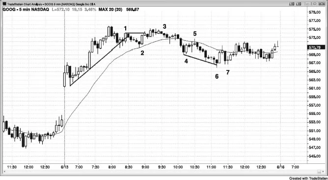
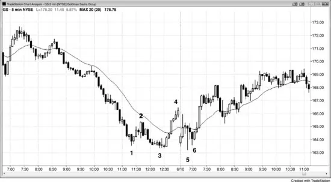
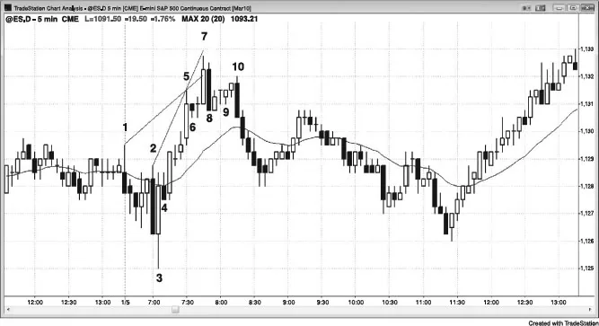
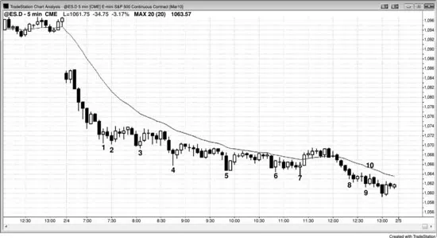

## 第26章　需要两个理由才做一笔交易

<!-- Source PDF pages 524–532 -->
<!-- English: Chapter 26: Need Two Reasons to Take a Trade -->

<!-- PDF page 524 -->

# 第26章  
# 需要两个理由才做一笔交易

一些基本规则使交易更容易，因为一旦规则满足，你可毫不犹豫地行动。最重要的规则之一是：你需要两个理由才做一笔交易，任何两个理由都够好。一旦你有了它们，下入场单；一旦入场，只需遵循基本止盈目标与保护性止损规则，相信到当日结束你会盈利。一个重要说明是：若有陡峭趋势，绝不要逆势交易，即便有 High 或 Low 2 或 4，除非先有先前显著趋势线突破或趋势通道超调与反转。此外，若趋势线突破有强动能而不是只是横盘漂移，要好得多。记住K线计数形态不是趋势反转形态。例如，High 2 是多头趋势中或震荡区间底部的入场，而不是空头趋势中的，因此若有陡峭空头趋势，你不应寻找 High 2、High 3 或 High 4 买入形态。

学会预期交易，以便你准备好下单。例如，若有主要摆动低点下方突破然后两段下行，或趋势通道线超调，寻找向上反转；或若在过度延伸的一段中有 ii 突破，寻找反转。一旦你看到外包K线或铁丝网形态，在极端处寻找小K线作为可能的 fade 交易。若有强趋势，准备好第一次均线回撤、任何到均线的两段回撤，以及第一次均线缺口回撤。

只有少数情况你只需要一个理由入场。第一，任何时候有强趋势，你必须在每一个不跟随高潮或最后旗形反转的回撤上入场，即便回撤只是强多头尖峰中的 High 1 或强空头尖峰中的 Low 1。此外，若有趋势线超调与好的反转K线，你可以 fade 该行情并预期趋势恢复。唯一其他

<!-- PDF page 525 -->

只需要一个理由入场的时候——无论在震荡区间还是趋势中——是有第二次入场时。按定义有第一次入场，因此第二次入场是第二个理由。

以下是入场的一些可能理由（记住，你需要两个或更多）：

好的信号K线形态，如好的反转K线、两K线反转或 ii。  
趋势中的均线回撤，尤其若是两段的（多头趋势中的 High 2 或空头趋势中的 Low 2）。  
突破回撤。  
清晰始终持仓市场（强趋势）中的回撤。  
任何类型支撑或阻力的测试，尤其是趋势线、趋势通道线、突破回测与等幅运动目标。  
对决线。  
多头趋势中或震荡区间底部的 High 2 买入形态（每当你看到双底，它是 High 2 买入形态）。  
空头趋势中或震荡区间顶部的 Low 2 做空形态（每个双顶是 Low 2 做空形态）。  
多数多头反转（底部）来自微型双底、双底或最后空头旗形反转。  
多数空头反转（顶部）来自微型双顶、双顶或最后多头旗形反转。  
多头趋势中横盘到下行的 High 3 回撤，即楔形多头旗形。  
空头趋势中横盘到上行的 Low 3 回撤，即楔形空头旗形。  
High 4 多头旗形。  
Low 4 空头旗形。  
当你寻找做空时，震荡区间顶部的弱 High 1 或 High 2 信号K线。  
当你寻找买入时，震荡区间底部的弱 Low 1 或 Low 2 信号K线。  
任何事物的失败（市场在预期走得那么远之前反转）：

<!-- PDF page 526 -->

先前高点或低点的突破。  
旗形突破（最后旗形在第三册讨论）。  
趋势线或趋势通道线超调的反转。  
未能到达止盈目标，如市场在 Emini 剥头皮中在五或九 tick 处反转。

## 图 26.1　至少两个理由才做一笔交易

如图 26.1 所示，K线 2 是强多头趋势中到均线的两段回撤（每个双底是 High 2 买入形态），理由足以做多。另一理由是：它是跳空高开的开盘即趋势中超过 20 根内第一次触及均线。它也是第一次好的趋势线突破，因此预期对高点的测试。

K线 3 跟随第二次失败的 K线 1 上方突破尝试。有 ii 形态，第二根有空头收盘。它也是萌芽中震荡区间里的 Low 2，到 K线 1 的行情是第一段上行。

K线 5 是强三根空头尖峰后空头摆动中均线处的 Low 2。强尖峰后市场可能有空头通道。

<!-- PDF page 527 -->

K线 6 是空头趋势通道线超调与反转，以及对第一小时窄幅震荡区间（三角形）的突破回测。然而，它在三小时空头通道底部，通道可以走得很远并沿途有许多回撤。几乎总是更好等通道的突破回撤再做逆势交易。该第二次入场在 K线 7 更高低点出现，是突破从 K线 5 起下行趋势线（未显示）上方后的回撤。

尽管 K线 6 是反转K线，其收盘勉强在中点上方，因此是弱信号K线。

## 图 26.2　扩展三角形

如图 26.2 所示，昨日以急冲至 K线 4 收盘，完成萌芽中扩展三角形的四段，还需要一个新低来完成。若你意识到该可能性，你会在 K线 3 下方突破后寻找做多入场。K线 5 跌破 K线 3，完成扩展三角形底部，你只需等待入场形态，即 K线 6 两K线反转与小更高低点高点上方 1 tick。

## 图 26.3　两个理由做一笔交易

<!-- PDF page 528 -->

如图 26.3 所示，K线 1 是测试昨日高点后的第二次入场做空。急涨很强，因此最好等第二次入场。交易者可在该K线跌破前一根低点并变成向下外包时做空，或在两根前空头K线低点下方做空。一般而言，在强空头K线下方做空总是更可靠。

K线 2 是大内包十字星后的 High 2，但下行动能很强。当强空头尖峰后有窄空头通道时，最好等趋势线突破再买入。同样，K线 3 是差的第二次做多入场，因为它跟随强空头趋势K线，你仍应在寻找买入前等待空头趋势线突破。

K线 4 是均线处的 Low 2，但它跟随四根几乎完全重叠的K线。在这样的窄幅震荡区间中，你在以下事件之一之前绝不应任一方向入场：大趋势K线至少以三 tick 突破形态且你已等待该K线失败，或有你可在震荡区间顶部或底部附近 fade 的小K线。这是与至少一根其他K线重叠的两K线反转，信号K线大，迫使交易者在震荡区间底部做空。如第一册第5章关于反转K线所讨论，

<!-- PDF page 529 -->

这是可能的空头陷阱而非顺势形态。有经验的交易者不会在那里做空，激进交易者会下限价单在其低点买入。

许多像 K线 2 与 3 这样的 1 tick 假突破发生在逆势 5 分钟入场K线的第一或两分钟内。发生在K线最后一分钟的突破往往更可靠，因为你在K线结束时就有动能。它延续到下一根的机会大于若它早四分钟发生且此后已回撤。

交易低概率交易会抹掉你全部盈利还有余。

## 图 26.4　均线回撤做空

当股票处于强趋势时，在前几次均线测试上限价单入场是合理的，或者你可用价格行为止损入场在 1 分钟图均线处入场。在图 26.4 中，5 分钟图是较小图，1 分钟图上的均线是 5 分钟均线，但画在 1 分钟图上。在 AAPL 的 K线 1 与 2，1 分钟图上 5 分钟均线处的第二次入场约有 25 美分风险，5 分钟图（插图）上的价格行为入场约有 45 美分风险。你也可在第一次 5 分钟收盘在均线上方时市价做空，

<!-- PDF page 530 -->

并用约 20 美分止损。此处，在 5 分钟图的 K线 1 与 2，市场在反转向下前只走到收盘上方 4 美分。一般而言，要么等第二次 1 分钟入场，要么用传统 5 分钟价格行为入场（在测试指数移动平均线的那根下方止损）更好，因为其他方法获益很少，且只涉及更多思考，会分散你在更高时间框架图（如 5 分钟）上的主要交易。

## 图 26.5　当通道很窄时，等第二次信号

如图 26.5 所示，Emini 以 K线 1、5 与 7 形成楔形。由 K线 2、5 与 7 形成的楔形是较不可靠的反转形态，因为通道太陡。当有窄通道时，最好等更低高点再做空，如 K线 10 处出现的。

K线 8 是两K线反转，因此入场在两根中较低那根下方，即在 K线 8 低点下方而非仅在 K线 7 下方。多数交易者会等做空 K线 10 更低高点，而不是在 K线 8 跌破 K线 7 低点时做空。向下反转也来自小 K线 6 最后旗形。楔形与最后旗形顶部通常后跟至少两段横盘到下行调整，楔形高点通常在调整完成前不会被超过。知道这一点，在 K线 9 的 iii 形态上方一两个 tick 下限价单做空是合理的。保护性止损会在

<!-- PDF page 531 -->

K线 7 高点上方，那将涉及六 tick 风险。当顶部有强空头趋势K线时，在其下方做空通常是好交易，即便入场晚几根发生。因为 K线 10 是如此强的空头趋势K线且收盘在 K线 8 低点下方，这里就是这样发生的。

## 图 26.6　在空头趋势中买入新低

尽管图 26.6 所示价格行为既是强尖峰与通道空头趋势，也是开盘即趋势空头日，做空本可赚更多钱，有经验的交易者在收盘前强趋势之前买入每一个新低。这不适合初学者，因为在你有足够经验对正在发生的事有信心之前，情感上很难这样做。初学者在这种清晰空头趋势中应只做空。

一种逆势方法是在先前摆动低点水平下限价单买入半仓，并在低两点再下一个限价单加仓（你试图分批加多）。若你的一点止盈目标在第二买单成交前成交，你获利了结，取消那另一个买单，并寻找买入新的摆动低点。例如，你会在 K线 2 期间精确在 K线 1 低点成交，并可剥头皮一点利润。你的第二单不会成交，你会在此时取消它并寻找买入下一个摆动低点。若你在 K线 4 期间在位于 K线 3 低点的限价单入场，你可在

<!-- PDF page 532 -->

低两点加第二半仓，并对整仓使用该第二次入场下方两点的止损。一旦市场反弹到你的原始入场，你可平掉全部仓位，在较低入场上赚两点利润，在第一次买入上保本。

这种方法甚至在当日尾盘市场进入强空头趋势通道时也有效。若交易者在 K线 8 期间在 K线 7 低点做多，然后在 K线 9 期间低两点再买入，他们可在 K线 10 期间离场。K线 10 高点比 K线 7 低点高 1 tick，因此他们会在第二次入场上赚两点利润，在第一次上保本离场。
