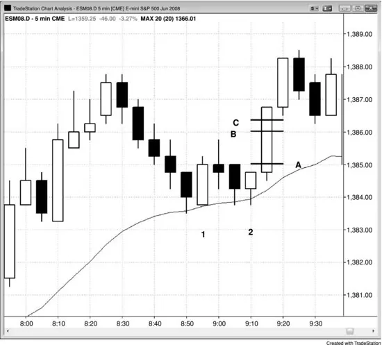

## 第 27 章：用止损单入场

<!-- Source PDF pages 533–534 -->

<!-- PDF page 533 -->

第 27 章
用止损单入场
价格行为交易者在寻找入场理由，完成形态的那根K线称为信号K线。你实际入场的那根称为入场K线。用价格行为交易的最佳方式之一是用止损单入场，因为你是被市场动能带入交易的，因此至少是在顺着一个极小的趋势（至少 1 tick 长）方向交易。这是最可靠的单一入场方法，初学者在持续盈利之前应把自己限制在这种方法上。例如，若你在空头趋势中做空，可以在前一根K线低点下方 1 tick 处挂止损卖单，订单成交后那根就成为你的信号K线。保护性止损的合理位置是信号K线高点上方 1 tick。入场K线收盘后，若它有强空头实体，把止损收紧到入场K线上方 1 tick。否则，把止损留在信号K线上方，直到市场开始强劲朝你的方向运动。
图 27.1 需要 6 tick 的运动才能赚到 4 tick

<!-- PDF page 534 -->

在 Emini 中，通常需要信号K线之外 6 tick 的运动才能净赚 4 tick 的剥头皮，需要 10 tick 的运动才能赚 8 tick 的剥头皮。在图 27.1 中，买入止损入场位于 A 线处的 K线 2 信号K线高点上方 1 tick，你会在那里成交。剥头皮 4 tick 利润的限价卖单在其上方 4 tick，即 B 线。你的限价单通常要等市场再越过它 1 tick 才会成交。那就是 C 线，它在信号K线高点上方 6 tick。
