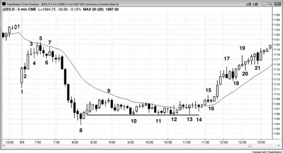
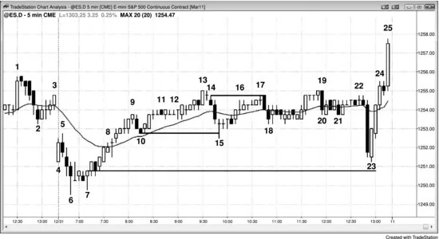
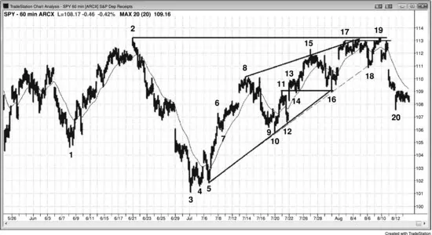
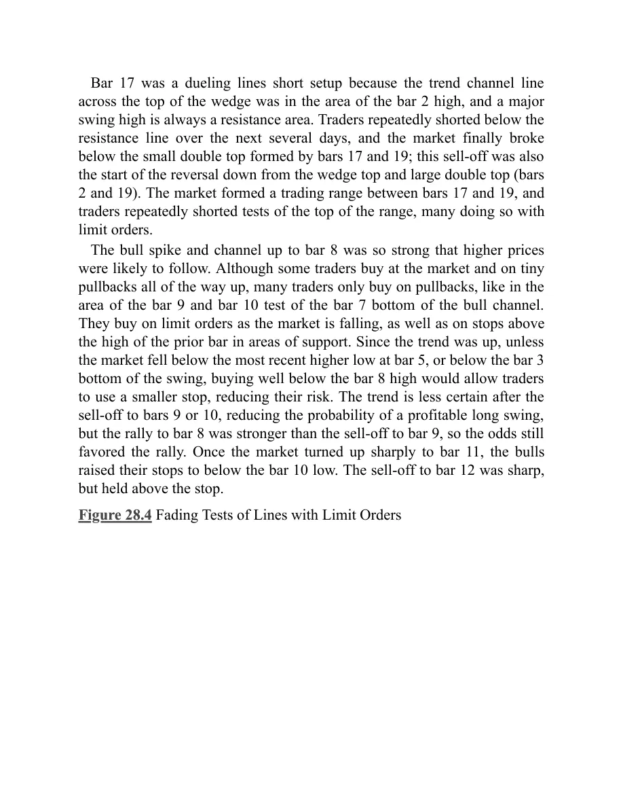
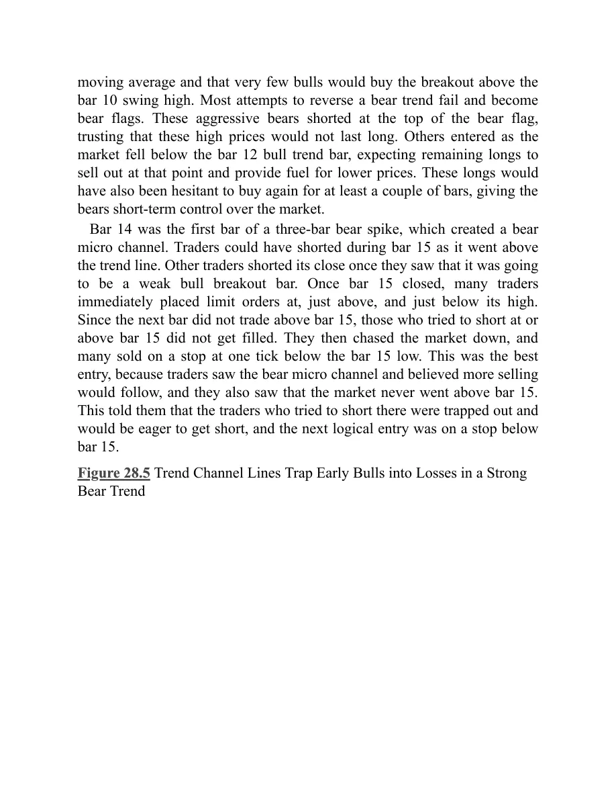

### 第28章 限价单入场

<!-- English: Chapter 28: Entering on Limits -->

<!-- Source PDF pages 535–564 -->

<!-- PDF page 535 -->

第 28 章
限价单入场有经验的交易者会根据情况用止损单或限价单入场。当市场处于强趋势时，用止损单入场是合理做法。当市场更像通道时，他们更倾向于用限价单入场。例如，若出现强劲的多头尖峰，交易者会在 K 线上方用止损单买入，并在 K 线顶部附近市价买入。一旦市场转入通道阶段，它仍处于多头趋势中，但趋势已经变弱，随时可能结束并向下测试通道底部。早期，交易者仍会在 High 1 与 High 2 买入信号上用止损单入场。当通道已延续一段时间（或许 10 根或更多 K 线）后，许多有经验的交易者会改为在前一根 K 线低点及其下方用限价单买入，而不是在前一根 K 线高点上方用止损单买入。一旦通道延续很久（或许 20 根 K 线）并接近阻力区，交易者会停止寻找买入，转而开始在前一根 K 线高点及其上方用限价单卖出。他们会卖出以兑现多单利润，有些人还会分批加空。一旦出现空头突破，这一过程会反向开始。若空头趋势强劲，他们会在 K 线下方用止损单做空；但若空头一段较弱，有经验的交易者不会在低点附近用止损单做空。相反，他们更愿意在回撤上用止损单做空，例如在移动平均线附近的 Low 1 或 Low 2 形态下方，以及在前一根 K 线高点及其上方用限价单做空。

在交易者持续盈利之前，他们应只用止损单入场，因为入场时市场正朝着他们有利的方向运动，这会提高交易盈利的机会。限价单入场的成功概率也可以同样好，但判断形态是否强劲更困难，这需要经验。从情绪上说，看到交易立刻朝有利方向走，也比限价单入场时常常先继续对你不利要容易得多。

<!-- PDF page 536 -->

限价单意味着你在押注市场即将反转方向。你可能是对的，但过早了。因此，许多用限价单入场的交易者会用更小的仓位。若市场继续对他们不利，而他们仍相信市场很快会反转，他们会寻找加仓机会。

以下是一些限价单入场可能有用的情形（全部例子见三本书的相应章节）：

- 若你晚了几秒、错过了原始止损入场，想以原价入场，则在原价或差一个 tick 的更差价格挂限价单。
- 若前一根是强多头尖峰中的强多头趋势 K 线，则在其收盘处挂限价单买入。
- 若前一根是强空头尖峰中的强空头趋势 K 线，则在其收盘处挂限价单卖出。
- 在强多头尖峰中，于 K 线收盘前买入小回撤，例如在当前 K 线高点下方 2 个 tick 挂限价买单。
- 在强空头尖峰中，于 K 线收盘前卖出小回撤，例如在当前 K 线低点上方 2 个 tick 挂限价卖单。
- 当出现可能形成微型缺口的多头突破 K 线时，在突破点——即突破 K 线之前那根 K 线的高点——稍上方买入。
- 当出现可能形成微型缺口的空头突破 K 线时，在突破点——即突破 K 线之前那根 K 线的低点——稍下方卖出。
- 在强多头尖峰中，在前一根 K 线低点或其下方用限价单买入。
- 在强空头尖峰中，在前一根 K 线高点或其上方用限价单卖出。
- 在强多头趋势中，在 ii 形态底部上方 1 个 tick 用限价单买入，风险 2 个 tick，目标 4 个或更多 tick，因为成功率约 60%。
- 在强空头趋势中，在 ii 形态顶部下方 1 个 tick 用限价单卖出，风险 2 个 tick，目标 4 个或更多 tick，因为成功率约 60%。

<!-- PDF page 537 -->

- 当一根并不特别大的多头趋势 K 线把市场翻转为始终做多时，在其之前那根 K 线高点上方 1 个 tick 用限价单买入，预期形成度量缺口（若该 K 线未跌破突破前那根 K 线的高点，则是强度信号）。
- 当一根并不特别大的空头趋势 K 线把市场翻转为始终做空时，在其之前那根 K 线低点下方 1 个 tick 用限价单卖出，预期形成度量缺口（若该 K 线未升破突破前那根 K 线的低点，则是强度信号）。
- 开盘区间形成过程中，若出现两根连续、实体强劲的多头趋势 K 线，则在前一根 K 线低点买入，预期多头尖峰的低点至少能支撑一次向上剥头皮。
- 开盘区间形成过程中，若出现两根连续、实体强劲的空头趋势 K 线，则在前一根 K 线高点卖出，预期空头尖峰的高点至少能支撑一次向下剥头皮。
- 在震荡区间底部，对空头尖峰市价买入或用限价单买入。
- 在震荡区间顶部，对多头尖峰市价卖出或用限价单卖出。
- 当多头市场中出现空头尖峰，且空头需要下一根是空头 K 线才能确认始终持仓翻转为向下时，在跟随 K 线形成之前买入尖峰中最后一根空头趋势 K 线的收盘、在其低点及其下方买入，并在下一根若没有空头实体时在其收盘买入（以及在其高点上方用止损买入）。回撤比空头尖峰与通道更可能。
- 当空头市场中出现多头尖峰，且多头需要下一根是多头 K 线才能确认始终持仓翻转为向上时，在跟随 K 线形成之前卖出尖峰中最后一根多头趋势 K 线的收盘、在其高点及其上方卖出，并在下一根若没有多头实体时在其收盘卖出

<!-- PDF page 538 -->

（以及在其低点下方用止损卖出）。回撤比多头尖峰与通道更可能。
- 当一根大型空头趋势 K 线很可能是空头趋势末端、或是多头趋势中回撤末端的卖盘高潮时，在其收盘、在其低点下方、以及下一根收盘买入（以及在其高点上方用止损买入）。
- 当一根大型多头趋势 K 线很可能是多头趋势末端、或是空头趋势中回撤末端的买盘高潮时，在其收盘、在其高点上方、以及下一根收盘卖出（以及在其低点下方用止损卖出）。
- 当多头趋势中一根多头尖峰之后出现回撤时，在多头尖峰底部上方 1 或 2 个 tick 用限价单买入，预期是突破回撤而非失败突破。
- 当空头趋势中一根空头尖峰之后出现回撤时，在空头尖峰顶部下方 1 或 2 个 tick 用限价单卖出，预期是突破回撤而非失败突破。
- 当多头尖峰之后很可能有第二段上涨时，在原始信号 K 线高点上方 1 或 2 个 tick 用限价单买入，即使测试在几十根 K 线之后才到来。
- 当空头尖峰之后很可能有第二段下跌时，在原始信号 K 线低点下方 1 或 2 个 tick 用限价单卖出，即使测试在几十根 K 线之后才到来。
- 在多头通道中，在前一根 K 线低点下方买入，尤其是通道早期。
- 在空头通道中，在前一根 K 线高点上方卖出，尤其是通道早期。
- 在空头通道晚期、卖盘压力已在累积时，在前一根 K 线低点下方以及最近摆动低点下方买入。
- 在多头通道晚期、买盘压力已在累积时，在前一根 K 线高点上方以及最近摆动高点上方卖出。
- 在多头微型通道中，在前一根 K 线低点下方买入，预期第一次向下突破会失败。

<!-- PDF page 539 -->

- 在空头微型通道中，在前一根 K 线高点上方卖出，预期第一次向上突破会失败。
- 当存在尖峰与通道多头趋势，并出现低动能回撤至通道底部时，在测试通道底部时买入。
- 当存在尖峰与通道空头趋势，并出现低动能回撤至通道顶部时，在测试通道顶部时卖出。
- 在强劲多头一段的起点，在至少两三根强多头趋势 K 线之后，买入空头收盘。
- 在强劲空头一段的起点，在至少两三根强空头趋势 K 线之后，卖出多头收盘。
- 在区间底部，在前一个摆动低点或其下方买入。
- 在区间顶部，在前一个摆动高点或其上方卖出。
- 用限价单在多头 ledge（底部由两根或更多相同低点的 K 线构成的小震荡区间）底部上方 1 或 2 个 tick 买入。
- 用限价单在空头 ledge（顶部由两根或更多相同高点的 K 线构成的小震荡区间）顶部下方 1 或 2 个 tick 卖出。
- 在震荡区间底部，或在强劲向上反转之后的新多头趋势中（可能是更高低点），对弱势 Low 1 或 Low 2 信号 K 线用限价单在其低点或其下方买入。
- 在震荡区间顶部，或在强劲向下反转之后的新空头趋势中（可能是更低高点），对弱势 High 1 或 High 2 信号 K 线用限价单在其高点或其上方做空。
- 在强多头趋势中，对空头剥头皮做 fade，因为大多数会失败。当强多头趋势中出现空头剥头皮形态时，在空头剥头皮者打算止盈的位置上方 2 或 3 个 tick 挂限价单买入。例如，若 Emini 在强多头趋势中出现空头形态，可在空头信号 K 线下方约 4 个 tick 挂限价买入，风险约 3 个 tick，

<!-- PDF page 540 -->

预期下跌达不到空头完成 1 点剥头皮所需的 6 个 tick。
- 在强空头趋势中，对多头剥头皮做 fade，因为大多数会失败。当强空头趋势中出现买入剥头皮形态时，在多头剥头皮者打算止盈的位置下方 2 或 3 个 tick 挂限价单做空。
- 在非常强的多头趋势中，若市场尚未跌破移动平均线超过两三个 tick，则在第一根收盘在均线下方 1 或 2 个 tick 的小空头趋势 K 线收盘处买入。
- 在非常强的空头趋势中，若市场尚未升破移动平均线超过两三个 tick，则在第一根收盘在均线上方 1 或 2 个 tick 的小多头趋势 K 线收盘处卖出。
- 在均线处安静的多头旗形中，用限价单在前一根 K 线低点或其下方买入。
- 在均线处安静的空头旗形中，用限价单在前一根 K 线高点或其上方做空。
- 在均线处安静的多头旗形中，买入空头收盘。
- 在均线处安静的空头旗形中，卖出多头收盘。
- 在强多头趋势中买入均线回撤，例如 20 缺口 K 线买入形态。
- 在强空头趋势中卖出均线回撤，例如 20 缺口 K 线卖出形态。
- 在陡峭上升的移动平均线回撤时买入，并在均线下方按间隔分批加仓。
- 在陡峭下降的移动平均线回撤时卖出，并在均线上方按间隔分批加仓。
- 在突破多头旗形的多头 K 线下方买入，预期突破回撤。
- 在跌破空头旗形的空头 K 线上方卖出，预期突破回撤。
- 在多头趋势中做波段时，在突破回测（试图触发更早多头入场的保本止损）处买入或加仓。

<!-- PDF page 541 -->

- 在空头趋势中做波段时，在突破回测（试图触发更早空头入场的保本止损）处卖出或加空。
- 当回撤形成可能的双底多头旗形时，在前一摆动低点附近用限价单买入。
- 当回撤形成可能的双顶空头旗形时，在前一摆动高点附近用限价单卖出。
- 在你认为前提仍然强劲的任何交易中分批加仓。
- 若市场处于阶梯形态，对回撤到前一阶梯用限价单入场。例如，若 Emini 平均日波幅约 12 点，而今日是空头阶梯形态，可考虑在前一摆动低点下方 4 点挂限价买单，目标反弹测试该摆动低点。
- 在趋势型震荡日，在极端处挂限价单，预期测试最近震荡区间的另一侧。例如，在多头趋势型震荡日且卖盘压力在累积时，可考虑在等幅运动目标（基于下方震荡区间高度）稍下方 1 个 tick 左右用限价单做空，目标测试上方区间底部或进入下方区间。
- 在震荡日、区间顶部附近的多头尖峰中，卖出空头收盘，尤其是若收盘在前一根 K 线区间上半部，且是第二次向下反转尝试。
- 在震荡日、区间底部附近的空头尖峰中，买入多头收盘，尤其是若收盘在前一根 K 线区间下半部，且是第二次向上反转尝试。
- 在多头趋势型震荡日，在等幅运动目标附近的大型多头趋势 K 线收盘处及其高点上方卖出，尤其是若该 K 线相对较大、因此可能是买盘高潮，且最近 5 到 10 根 K 线有一定卖盘压力。
- 在空头趋势型震荡日，在等幅运动目标附近的大型空头趋势 K 线收盘处及其低点下方买入，尤其是若该 K 线相对较大、因此可能是

<!-- PDF page 542 -->

卖盘高潮，且最近 5 到 10 根 K 线有一定买盘压力。
- 在多头趋势型震荡日、日波幅将约 10 点时，在下方区间高点上方 4 到 6 点用限价单做空，目标测试突破。
- 在空头趋势型震荡日、日波幅将约 10 点时，在上方区间低点下方 4 到 6 点用限价单买入，目标测试突破。
- 在强空头通道中，当市场形成两 K 线向上反转时，在第二根反弹到第一根高点时做空，风险几个 tick，预期市场不会升破第二根并触发多头。
- 在强多头通道中，当市场形成两 K 线向下反转时，在第二根跌到第一根低点时买入，风险几个 tick，预期市场不会跌破第二根并触发空头。
- 在多头趋势中，用限价单买入对多头趋势线的测试（尽管通常更好的做法是在测试该线的多头反转 K 线上方买入）。
- 在空头趋势中，用限价单卖出对空头趋势线的测试（尽管通常更好的做法是在测试该线的空头反转 K 线下方卖出）。
- 在多头趋势或震荡区间中，在下跌楔形（楔形多头旗形）测试向下倾斜的趋势通道线时买入（尽管通常更好的做法是在测试该线的多头反转 K 线上方买入）。
- 在空头趋势或震荡区间中，在上升楔形（楔形空头旗形）测试向上倾斜的趋势通道线时做空（尽管通常更好的做法是在测试该线的空头反转 K 线下方卖出）。
- 在多头趋势的回撤（小空头趋势）中，在摆动低点下方买入，预期向下新低的突破会失败，并成为 High 2 或楔形多头旗形买入信号。
- 在空头趋势的回撤（小多头趋势）中，在摆动高点上方卖出，预期向新 <!-- PDF page 543 --> 高的突破会失败，并成为 Low 2 或楔形空头旗形卖出信号。
- 在多头趋势中，买入相对当前高点 60% 到 70% 的回撤，风险设到更低低点，在新高或其上方止盈（回报约是风险的两倍，概率约 60%）。
- 在空头趋势中，卖出相对当前低点 60% 到 70% 的回撤，风险设到更高高点，在新低或其下方止盈（回报约是风险的两倍，概率约 60%）。

一般而言，当市场处于多头趋势时，多头预期空头的每一次尝试都会失败，因此会寻找买入每一次尝试。他们会在每一根空头趋势 K 线的收盘附近买入，即使该 K 线很大并收在最低点。他们会在市场跌破前一根低点、任何前一摆动低点以及任何支撑位（如趋势线）时买入。他们也会在市场每一次试图走高时买入，例如在多头趋势 K 线高点附近，或在市场升破前一根高点或阻力位时。这与强空头市场中的做法完全相反——那时交易者在 K 线上方与下方、阻力与支撑上下都卖出。他们在 K 线上方（以及各种阻力附近）卖出，包括强多头趋势 K 线，因为他们把每一次上涨看作反转趋势的尝试，而大多数趋势反转尝试都会失败。他们在 K 线下方（以及各种支撑附近）卖出，因为他们把每一次下跌看作恢复空头趋势的尝试，并预期大多数会成功。

市价单只是一种限价单的变体：交易者急于进场或出场，不在意节省一两个 tick。许多想市价交易的交易者只是在价格阶梯上点击限价价位，因此许多限价单交易实际上意图就是市价进出。例如，若 QQQ 在 $51.10 且处于多头尖峰中，想市价做多的交易者往往会在价格阶梯上点击高于卖价的限价买价，如 $51.14，并以市价成交。因此，我对限价单写的大部分内容，对偏好市价单的交易者同样适用。

每一次市场升破前一根高点或跌破前一根低点时，都会发生一件非常重要的事。市场正在突破前一根 K 线的区间，但关键的是：大多数突破尝试都会失败。

<!-- PDF page 544 -->

不幸的是，新手会被所有突破的情绪裹挟，以为市场正要开启大行情。他们不理解突破是一种测试。市场在寻找价值，突破只是多空之间的较量，通常并不是大趋势的起点。市场几乎每根或每两根 K 线、在每个时间框架上都会运行这种测试。若交易者用止损单在每根高点上方买入、在每根低点下方做空，就会吃下每一次突破并亏钱。为什么？因为止损入场是突破交易，而大多数突破会失败。市场通常会被拉回震荡区间，例如前一根的实体，然后再决定下一步方向。尽管对起步交易者而言止损进出仍是最佳选择，但他们必须有所选择。

假设当前 K 线刚反弹到前一根高点上方 1 个 tick。大多数个人交易者要么什么都不做，要么在前一根高点上方 1 个 tick 用止损买入，要么在前一根高点用限价单卖出。若突破成功且市场向上跑得足够远让多头获利，则他们做对了。然而，若升破前一根只是买盘真空，市场很快会回落，空头会获利。若趋势向下，许多空头会等待反弹做空，而一个受青睐的形态是升破任何东西的反弹——空头趋势线、前一摆动高点，甚至仅仅是前一根高点。若有足够多强大的空头等到市场升破某物才做空，这种买盘真空很容易导致前一根高点上方只有 1 或 2 个 tick 的突破。市场在那里找到的不是许多强多头，而是许多强空头——他们正等着市场再高一点点、例如升破前一根，才做空。

多头趋势中的多头则相反。他们想买入回撤；若足够多的强多头相信空头能把市场推到当前 K 线低点之下，他们何必在那之前买入、而不是很快买得更低？他们干脆退到一边，在前一根低点挂限价买单，等待空头把市场推到当前 K 线低点之下。卖盘真空会把价格 <!-- PDF page 545 --> 吸入他们的买入区，他们积极买入，困住很快就得回补空单的空头（给反弹添燃料），市场快速向上反转。

多数时候，在前一根上方用止损买入，或在前一根高点用限价单做空，概率大约各 50%，但往往有 60% 或更高偏向止损或限价。有经验后，交易者能识别这些 60% 的情形，并按有优势的方向下单。由于大多数突破尝试会失败，成功的限价入场往往更可靠，但更难执行，因为你在赌一次运动在打到你的保护性止损之前会失败并朝你的方向反转。在交易者有大量经验之前，等待市场反转并朝自己有利方向走非常有压力。正如盲目吃下每一个止损信号是亏损策略一样，用限价单盲目 fade 每一个这类信号也是亏损策略。在任何一天，可能有大约 10 个合理的止损入场形态和 20 个或更多限价单形态，尽管许多对无经验的交易者并不明显。正因为可靠的限价形态如此之多，交易者必须能够评估它们。

当你试图用限价单入场时，你是想以比当前价更好的价格入场。例如，若你想用限价单买入，你的单在当前价下方，需要价格下跌才能成交。一般来说，用止损单入场更安全，因为入场时市场正朝你的方向运动，跟随概率更高。对初学者，这是最佳方法。然而，有许多情形可以用限价单而不是止损单入场。事实上，如前所述，限价形态通常大约是止损入场形态的两倍，但它们风险更大、通常更难执行，因为至少逆着短期趋势。例如，若你刚在跌破空头趋势线并出现强多头反转 K 线之后的回撤中买入第二次入场，而接下来一两根 K 线几次精确测试入场 K 线低点，可考虑在入场 K 线低点上方 1 个 tick 挂限价买单把仓位加倍，风险仅 2 个 tick（到原始止损，即入场 K 线稍下方）。若你试图在入场 K 线低点用限价单买入， <!-- PDF page 546 --> 通常不会成交，因为市场通常必须穿越限价价位订单才会成交。每个人都知道入场 K 线低点下方 1 个 tick 有许多保护性止损——为什么聪明钱不去扫它？因为若这些止损被打中，市场性质就变了。它不再是强劲的第二次入场，图表现在有了失败的第二次入场，那是顺势形态，很可能再向下两段。若聪明钱在底部大量建仓，他们不想看到市场再跌两段，所以会像你一样：继续累积多头以捍卫底部。最终卖方会放弃并开始回补，市场会远超剥头皮目标。

用限价单入场至少是逆短期趋势交易，一般会制造不必要的焦虑，干扰你当天晚些时候的交易能力。仅有一个强尖峰并不是开始用限价单在回撤上入场的理由。例如，若 Emini 出现强多头尖峰到达震荡区间顶部，或在多头趋势末端可能是买盘高潮，交易者可能把它看作强度信号，并在或许低 1 到 4 点处分批加多。然而，他们需要考虑多头尖峰是衰竭买盘高潮的可能。有任何怀疑时，交易者不应在市场下跌时用限价单买入，因为下跌可能持续至少 10 根 K 线与两段，并可能是向下反转的起点。仅有强多头尖峰并不足以用限价单买入回撤；交易者必须考虑多头尖峰的背景。空头尖峰则相反。

此外，若市场已上涨几小时，但现在下跌一小时且无底部迹象，而你在斐波那契 62% 回撤或布林带、肯特纳带或任何其他带状处挂限价买单，你入场时市场正在下跌，因此你在逆当前趋势交易，寄望更早的趋势会回来。市场经常在 62% 回撤区域反弹，但不够频繁、也不够远，与用止损入场相比不值得。若市场在约 62% 回撤处向上反转，只需等待该 K 线收盘，看它是否有多头 <!-- PDF page 547 --> 收盘。若有，在其高点上方 1 个 tick 挂买单。这样入场时市场正朝你的方向运动，多头已通过多头收盘以及把市场推升破前一根高点展示了强度。你仍然有 62% 回撤在你这边。若交易本来就好，现在成功的可能性大得多。是的，你可能因等待止损入场而少赚几个 tick，但你会避开多得多的亏损和不必要的压力。

有少数情形，限价单入场的胜率可与良好的止损入场相当。若你因某种原因错过了看起来很棒的止损入场，并在几秒内能在止损价或差一两个 tick 的更差价挂限价单，这可以有效。但仅用于非常强的交易，因为一般来说，你已经错过原始入场后，你不想进入一笔让你以“好价”进场的交易。绝佳交易很少会回来解救不够敏锐的交易者。

在强多头趋势中，你不能寻找做空 Low 1 或 Low 2，尤其是信号 K 线很弱时。当出现停顿 K 线或弱势空头 K 线时，许多交易者会退到一边，等到市场跌破该 K 线再买入。这会形成微型卖盘真空。在该 K 线低点或其下方买入往往是好交易，预期 High 1 或 High 2 会在高几个 tick 处触发。其他交易者会在尖峰高点下方按固定间隔买入，例如低 1 或 2 点，而这往往与那些 Low 1 和 Low 2 信号 K 线的低点重合。记住，在强多头趋势中，Low 1 和 Low 2 信号并不存在，只是陷阱。强多头趋势中的顶部约 80% 会变成多头旗形。强空头趋势则相反，在 High 1 与 High 2 信号 K 线高点或其上方做空往往是好策略。

若你做反转入场，尤其是在震荡区间中，途中经常会有回撤，往往在入场后一两根 K 线内。若你对价格行为的解读有信心，你可以 fade 这些回撤。这些通常是你认为会失败的 Low 或 High 1 或 2 形态。例如，若在震荡日出现楔形底部而你买入向上反转，你可以预期楔形低点会守住。你相信趋势现在向上，所以想买入回撤。回撤 <!-- PDF page 548 --> 可以小到只有一根 K 线。由于很可能有两段上涨，第一段下跌不应走远。那个 Low 1 做空应失败，并成为新多头一段中的回撤，因为接下来 10 根或更多 K 线的趋势已反转为向上。Low 1 做空唯一可靠的时刻是在强空头趋势的尖峰阶段，绝不是在反转形态之后。那个 Low 1 空头入场很可能无法跌破楔形低点，反而会在两段式向上修正中形成小的更高低点。因此，你可以在那个做空信号 K 线的低点、或低点下方 1 到 3 个 tick 挂限价买单，预期形成小的更高低点，而不是盈利的 Low 1 做空。在 Emini 中你通常可以只冒 4 个 tick 的风险。

随着向上反转继续，你可能认为会形成 Low 2 做空形态。然而，既然你相信趋势已反转为多头趋势，你预期那个 Low 2 也会失败并跟随更高价格。你仍处于买入回撤模式，这可以包括小回撤，如 Low 2。同样，你可以在 Low 2 信号 K 线低点或其下方挂限价买单，在 Emini 中风险约 4 个 tick。你预期这个空头旗形不会突破超过几个 tick，反而会继续向上发展成多头通道。这是一种最后旗形，因为它是空头趋势的最后旗形。空头曾把它看作空头旗形，但当他们无法把它跌破空头信号 K 线超过 1 或 2 个 tick 时，旗形会继续向右上方生长，直到交易者意识到它已变成多头通道。在某个时刻，当足够多交易者意识到发生了什么，空头会回补，通常会出现向上突破，然后是等幅运动上涨。一旦空头相信市场已到达震荡区间顶部，或是多头趋势正在向下反转，他们会寻找 High 1 与 High 2 信号 K 线，并在那些 K 线高点或其稍上方挂限价单做空。他们在寻找卖出反弹，即使是非常小的反弹，如 High 1 或 High 2。多头会在震荡区间底部、以及在他们感觉市场正在反转为多头一段的空头趋势底部，寻找买入 Low 1 与 Low 2 入场。

如第三本书趋势反转章节所讨论，大多数顶部是某种双顶，并涉及失败的 High 1、High 2 或三角形突破，而那个 High 1、High 2 或三角形随后成为反弹中的最后多头旗形。

<!-- PDF page 549 -->

当向上一段与顶部很小时，双顶是微型双顶。当交易者预期反转时，他们会在多头旗形信号 K 线及其上方挂限价卖单，预期它会失败。底部通常来自失败的 Low 1、Low 2 或三角形突破，形成空头一段中的最后旗形。当双底只在几根 K 线上形成时，它是微型双底。预期旗形会失败并导致向上反转的交易者，会在卖出信号 K 线低点及其下方挂限价买单。

回到那个楔形底部：若它以大型多头反转 K 线结束，然后出现第二根影线很小的强多头趋势 K 线，两段式反弹的概率就很好。若下一根是小多头 K 线或十字星，则在任何情况下这都是弱势的 Low 1 做空形态，而在可能的楔形底部之后，尤其不可能带来盈利的做空。至少，空头应等待至少 Low 2，但若趋势已反转，那也很可能失败。聪明的多头会看到弱势的 Low 1 形态，预期它无法为做空者带来剥头皮利润；他们会在该 K 线低点或或许再低几个 tick 挂限价买单，在 Emini 中或许风险 6 个 tick。交易者在所有市场中一直这样做，限价单与保护性止损的位置取决于市场。例如，假设 Google（GOOG）最近平均日波幅是 $10；若 5 分钟图上从空头楔形向上反转，且最初几根 K 线自低点延伸 $3，交易者可能在第一段顶部下方约 50% 处挂限价买单，或许在第一段顶部下方 $1.50，或许在 Low 1 信号 K 线低点下方 50 美分甚至 1 美元，然后风险再 $1.50 或 $2.00，或到楔形低点之下。

限价单入场在一些铁丝网形态与小震荡区间中也可以有效，那里 K 线较大且大多重叠，形态大体水平。这有风险，需要快速决策，只有最好、最有经验的交易者才应尝试。

交易者经常用限价单与市价单 fade 各类通道，在顶部做空、在底部反手做多。最安全的通道是支撑与阻力清晰、已被测试多次的震荡区间。由于假突破常见，在测试极端时通过在上方阻力线做空或在下方支撑线买入来 fade 的交易者，会把保护性止损放在线外足够远， <!-- PDF page 550 --> 以允许失败突破之后市场朝他们方向反转并测试区间另一侧。交易者在趋势通道中也这样做。例如，若有多头趋势通道，当市场触及或接近趋势通道线时，他们会市价做空或用限价单做空，并在通道内最近摆动高点上方做空，并在市场走高时分批加空。这不是日内最后两小时的好策略，因为你太常会时间不够，不得不亏损回补大量空仓。

多头会在测试通道底部的趋势线时市价买入或用限价单买入，并把保护性止损放在线下方足够远，以允许对线的小幅超调。他们也会在前一根低点或其下方用限价单买入。由于他们顺势交易，更可能波段持有仓位，并在后续形态上加仓。在多头通道中，你不应寻找 Low 1、2、3 或 4 形态，因为那些只是空头趋势与震荡区间中的形态。若你在多头趋势中看到一个，由于它很可能会失败并打中上方的保护性买入止损，做相反交易更合理。不要在前一根低点下方寻找做空，而应在该 K 线低点或其下方挂限价买单。你会在那些空头做空的地方买入；既然他们很可能亏，你就很可能赢。

若通道内有更宽的摆动，如趋势通道或阶梯形态，双向交易更强，因此 fade 通道顶部与底部更可靠。若交易者仓位足够小，能在市场继续对初始入场不利时分批加仓，所有通道 fade 都尤其可靠。例如，若市场处于空头通道，你可以在每个前一摆动低点下方用限价单买入，并寻找稍低处加仓，使用宽止损。若市场在第一次入场后到达你的利润目标，你止盈。若趋势继续且你的第二笔限价单也成交，你可以在第一次入场价退出两笔仓位。你的第一笔大约保本，第二笔有利润。对逆势分批加仓的交易者有一个重要警告： <!-- PDF page 551 --> 你应在第二次对你不利的运动时退出或反手到顺势方向。这意味着，若你在多头趋势中分批加空，在 High 2 时退出甚至反手做多，尤其是在移动平均线附近。同样，在空头趋势中分批加多时若形成 Low 2，尤其是在均线附近，若 Low 2 触发则退出甚至反手做空。

Emini 中的剥头皮者通常需要信号 K 线之外 6 个 tick 的运动才能剥到 4 个 tick 利润。因为入场止损在 K 线外 1 个 tick，然后你需要再 4 个 tick 利润，而利润目标限价单通常不会成交，除非市场穿越你的订单 1 个 tick。有时你的订单会在市场未穿越时成交，但那时市场通常很强，会在你成交后几分钟内越过该价。同样，要在 QQQ 中剥 10 个 tick，通常需要 12 个 tick 的运动。

当形态看起来很弱时，最好不要做，等待下一个机会。若它很弱，很可能失败，你不应承担不必要的风险。弱势形态常常会有第二次入场，那时它就变成强形态。

若交易者相信突破强劲并预期测试会成功，也可以在突破区域的回撤上用限价单入场。突破回测的存在是为了看交易者是否会在更早入场的地方再次入场。例如，若 5 分钟 Emini 在空头一段的最后旗形后以强多头反转 K 线向上反转，且反弹持续几小时，市场常见会回测到该多头信号 K 线高点的 1 或 2 个 tick 之内。交易者曾在该 K 线上方积极买入，现在市场回测到该价位。若多头趋势强劲，买方会在同一价区回来，多头一段会恢复。许多机构经常在该水平挂限价与市价单，它为交易者提供出色的风险/回报比。他们或许只需风险 4 到 6 个 tick，就有超过 50% 的机会赚 4 点或更多。例子见第 5 章关于失败突破、突破回撤与突破回测。

尽管大多数交易应用止损入场，当存在强趋势时，任何时候入场都安全，而在移动平均线用 <!-- PDF page 552 --> 限价单入场在股票中尤其好，因为股票往往表现更规矩。这允许更小的风险与更大的潜在回报，胜率基本不变。在多头趋势中，交易者常把风险设到最近更高低点之下，因此买入回撤意味着保护性止损更小。同样，在空头趋势中，交易者常把保护性止损放在最近更低高点之上，并在回撤上做空。

**图 28.1 限价单入场**

图 28.1 的图表显示了几个良好的限价单入场交易例子。上涨到 bar 3 很强劲，市场在移动平均线稍下方停顿，而均线是磁铁。市场已足够接近，处于均线的磁吸拉力之内。由于 bar 3 是十字星，因此在强劲上涨后是糟糕的做空信号 K 线，市场在再次向上推升测试均线之前很可能不会走太低。激进的多头可以在 bar 3 低点或其稍下方用限价单买入，目标测试均线，或许风险 6 个 tick。

在 bar 5 测试均线之后，市场很可能横盘到向下修正。敏锐的交易者看到多头无法创造连续的强多头趋势 K 线。这增加了他们做空的意愿。Bar 5 是测试均线底部的空头 K 线。由于它发生在第二次买盘高潮之后（由当日第一根与第三根大型多头趋势 K 线形成），很可能跟随 <!-- PDF page 553 --> 两段横盘到向下。因此，在 bar 6 高点或其上方 1 个 tick 用限价单做空是良好的风险/回报交易。一些多头认为很可能有 High 2 买入信号，因此在 bar 5 低点及其下方挂限价买单。然而，鉴于最近 K 线的双向性质，这是有风险的策略。其他交易者看到 bar 5 的空头收盘，预期在均线处有 Low 2 做空信号。在 bar 5 收盘后，他们市价做空或在 bar 5 收盘处用限价单做空。

随着市场从均线崩塌，交易者在三根大型趋势 K 线的收盘做空，并在空头 K 线形成时在小回撤上做空。例如，许多人在最近低点上方 1、2 或 3 个 tick 挂限价单做空。

从 bar 1 到 bar 5 的开盘区间约为平均日波幅的一半，因此一旦市场跌破 bar 1，一些交易者会把等幅运动目标看作可能的当日低点。Bar 8 低点是从 bar 1 开盘到 bar 5 高点的精确等幅运动下跌。交易者知道，此时当日开盘正好在日波幅正中，市场可能在收盘前尝试回测开盘。这会在日线图上形成十字星，开盘与收盘都在当日中部。若市场能反弹回高点，当日会变成多头反转日。一些多头愿意在等幅运动目标上方 1 个 tick 用限价单做多，然后持有到测试开盘。成功测试当日开盘的机会大概 30% 到 40%。他们可以用或许几点的保护性止损，然后等待看发生什么。由于下跌动能在减弱，利润了结者足以让市场在他们的保护性止损被打中之前反弹的概率很好。若市场跌破他们的入场价但未打中止损，若他们感觉前提已不再有效，可以在保本退出。一旦市场出现两 K 线向上反转，他们可以把保护性止损移到保本，然后耐心等待看反弹是否发展，而它确实发展了。

下跌到 bar 8 的空头尖峰有七根连续空头趋势 K 线。把这看作强度信号的交易者可能在高 1 到 4 点处分批加空挂限价单。然而，他们需要 <!-- PDF page 554 --> 考虑空头尖峰是衰竭卖盘高潮的可能。有任何怀疑时，交易者不应在市场反弹时用限价单做空，因为反弹可能持续至少 10 根 K 线与两段，并可能是向上反转的起点，尤其是在当前环境下。仅有强空头尖峰并不足以用限价单在反弹上做空。交易者必须看空头尖峰的背景。

低点处的窄幅震荡区间是理解交易数学如何带来绝佳交易的好例子。区间太窄，无法用止损入场剥头皮。你不能在这种窄区间中在 K 线上方买入或在 K 线下方做空，并预期持续获得盈利的剥头皮。然而，对波段交易者有绝佳机会。当日是趋势型震荡日，若向上突破窄幅震荡区间，约有 70% 的机会测试上方区间底部，即 bar 1 低点。一旦双底多头旗形被升破 bar 11 所确立，多头会捍卫其低点。因此，在其上方 1 个 tick 用限价单买入，风险在其下方 1 或 2 个 tick，是良好的风险/回报交易。你的限价单会在 bar 12 成交，它精确回测了 bars 10 与 11 的双底。你风险约 3 个 tick，目标至少到 bar 1 低点的 4 点，若市场向上反转并测试上方区间高点甚至约 12 点，而它确实做到了。由于你在窄幅震荡区间底部买入，你有 60% 的机会测试区间顶部。然而，你需要成功的向上突破，而窄幅震荡区间任一方向突破的机会是五五开。因此在你买入时，你有 50% 的机会赚 4 点或更多，而风险不到 1 点。这是绝佳的风险/回报交易，但只有理解数学的交易者才能那样看它。

一旦市场在 bars 13 与 14 开始形成更高低点，你可以把保护性止损移到最近更高低点下方 1 个 tick。在 bars 13 与 14 的测试以及 bar 16 的突破回撤之后，至少 4 点运动的概率从或许 50% 升到 70%。此时你已锁定几个 tick 利润，并有 70% 的机会至少赚 4 点，或许 50% <!-- PDF page 555 --> 的机会市场走到上方震荡区间顶部。在 bar 16 开始五根多头趋势 K 线突破之后，市场至少有 60% 的机会到达等幅运动上涨，因为强尖峰突破时通常如此。等幅运动会基于 bar 16 之后那根的开盘到尖峰第三根的收盘，再加到那第三根的收盘上。尖峰中最强的实体往往导致等幅运动。这意味着你有 60% 的机会再赚约 5 点。你会把保护性止损放在尖峰底部，这将保护你未实现利润中的约 2 点。

Bar 17 是强多头尖峰中的空头反转 K 线。多头预期在一或两根回撤后会形成成功的 High 1 买入形态。然而，那个买入信号 K 线的高点很可能高于 bar 17 做空信号 K 线的低点，因此激进的多头在 bar 17 低点买入。Bar 17 之后是多头 K 线，且上升趋势强劲。若再下一根是空头趋势 K 线——它确实是——会形成两 K 线反转做空。由于多头趋势强劲，激进的多头会在那根多头 K 线低点挂限价买单。他们预期若空头 K 线跌破多头 K 线低点，两 K 线反转做空不会跌破两 K 线反转顶部的两根 K 线，也不会在 bar 18 触发。

由于上涨到 bar 17 时市场明显始终做多，而 bar 18 之前的空头 K 线是第二次向下反转尝试，许多多头认为市场很快会恢复向上。他们怀疑不会有跟随，并在 bar 18 一开盘就在前一根（空头趋势 K 线）收盘处挂限价买单。

**图 28.2 安静日上的限价单入场**

<!-- PDF page 556 -->

在 12 月下旬的安静交易中，用限价单入场往往是最佳方法。在图 28.2 中，下跌到 bar 6 有买盘压力迹象，如 bar 4 多头 K 线以及 K 线底部影线增大。因此这不是强空头尖峰，因而到 bar 7 的 Low 1 突破很可能失败。由于 bar 6 也在两日扩展三角形底部，并刺破两周长的多头趋势线，交易者在寻找对决线买入形态。激进的多头在 bar 7 跌破 iii 形态时买入，更保守的交易者在其高点上方买入。

多数交易者在 bar 8 之前的多头突破 K 线收盘时把市场看作始终做多，因此在寻找买入回撤。由于上涨到 bar 8 处于多头微型通道中，他们相信第一次跌破前一根低点的突破会失败并成为空头陷阱，即使一些交易者把它看作均线附近的 Low 2 做空。这些多头会在前一根低点及其下方挂限价买单，并在 bar 8 之后那根成交。

由于 bar 8 之前那根把市场翻转为始终做多，多头希望市场守在 bar 8 之前那根高点之上。一些人在该 K 线高点上方 1 个 tick 挂限价买单，并在 bar 8 之后的十字星成交。一些人只风险 2 个 tick。其他人用更宽的保护性止损，有些人还会 <!-- PDF page 557 --> 在更低处加仓。尽管用 2 tick 止损的成功概率或许只有 30% 到 40%，潜在回报是来自这个度量缺口的等幅运动上涨，或至少 6 个 tick 利润。现实最差情况是 6 个 tick 利润与 30% 成功概率，这是保本策略；最好情况或许是 60% 成功概率与 10 或 12 个 tick 利润。这是出色结果。由于实际结果可能介于两者之间，数学仍然良好，这是合理的买入形态。这个假期交易期间的平均日波幅只有约 5 到 6 点。由于市场一年只有几天波幅小于 5 点，今日波幅应至少达到那么大。

从 bar 7 到 bar 8 是多头微型通道。由于多头微型通道的第一次向下突破通常失败，多头持续在前一根低点挂限价买单。他们在 bar 8 之后那根成交。

微型通道继续上涨到 bar 9，多头在下一根跌破 bar 9 时再次成交。一些人在多单上风险 4 到 8 个 tick，但其他人会分批加仓，在第一次入场下方约 4 到 6 个 tick 再买。

尽管 bar 11 可能是最后旗形做空与更高高点，多数交易者认为向上动能足够强，空头一段不太可能。要么市场继续上涨，要么只跌一点、形成震荡区间，然后走到新高。由于概率偏向更高价格，他们愿意在前一根低点及其下方用限价单买入，并在 bars 11 与 12 下方成交。

从 bar 14 开始的两 K 线空头尖峰可能对一些交易者把市场翻转为始终做空，但多数人想看到下一根有强跟随卖出以确认向下突破。一旦他们看到下一根是十字星收盘而不是强空头收盘，他们就在该收盘附近用限价单买入。

市场很可能测试 bar 7 到 bar 9 多头尖峰之后的多头通道底部 bar 10。之后，小震荡区间很可能出现，市场在决定下一步。空头在从 bar 15 的上涨中做空，止损在 bar 14 空头尖峰顶部上方 1 个 tick。敏锐的空头在 bar 14 <!-- PDF page 558 --> 高点下方 1 个 tick 挂限价单做空，保护性止损再高 2 个 tick。他们在 bar 17 成交。由于风险只有 2 个 tick，且他们在震荡区间中做空，等距运动成功的机会至少 50%，在 2 tick 止损被打中之前有 4 tick 下跌的机会大概也超过 50%。由于这是小波幅日上的震荡区间，这些空头处于剥头皮模式，乐意做 1 点、4 tick 利润。他们的潜在回报是风险的两倍，概率至少 50%，因此交易者公式很强。

到 bar 21 时，交易者把这看作震荡日，预期突破尝试会失败。尽管 bar 22 之后的强空头尖峰令人印象深刻，若无跟随卖出且下一根无空头收盘，它更可能是空头陷阱，而不是通向通道的尖峰。激进的交易者买入其收盘，也在其低点用限价单做多。他们也看到 bar 23 是对当日开盘以及 bar 7 上方原始多头的测试。他们或许为向上波段风险约 4 个 tick。即使概率只有 30% 到 40%，潜在回报可能是风险的四或五倍，因此值得考虑。更保守的交易者在确认失败空头突破的 bar 23 多头反转 K 线上方买入。他们在离底部更高处买入，因此潜在回报更小、风险更大，但大幅提高的成功概率足以抵消这些问题。

当交易者看到 bar 23 之后入场 K 线的强收盘时，他们在该 K 线收盘买入。其他人等到下一根开盘，然后立刻在前一根收盘挂限价买单。当这下一根也变成强多头趋势 K 线时，他们在 bar 24 重复这一过程。

到 bar 24 收盘时市场始终做多，因此一些多头会尝试买入第一根空头收盘，即下一根。然而，市场从未跌破那根空头 K 线的收盘，所以他们的限价单大多大概不会成交。这是收盘前紧迫感的信号，警觉的多头也会在那根空头 K 线上方挂止损单做多，因为它是突破回撤买入形态。许多人不够快，会在下一根 <!-- PDF page 559 --> 追涨，在 K 线形成时用限价单买入 1 或 2 个 tick 的回撤。

在市场反弹到 bar 13 时，趋势明显向上。一些交易者挂限价单买入斐波那契 62% 回撤，或任何约 60% 到 70% 的回撤，止损在 bar 6 多头低点之下。他们在寻找回报约为风险两倍或更多的买入。在约三分之二处买入以测试多头高点，是在冒约三分之一的风险，使目标是风险的两倍，这总是好的。在他们下单时趋势向上，因此买入回撤至少有 60% 的等距运动概率（上涨等于止损大小），并可能有 60% 的新多头高点机会（回报是风险的两倍）。通过在回撤上入场以降低风险是许多交易者使用的方法，并有强交易者公式。

**图 28.3 限价单形态**

图 28.3 所示 SPY 的 60 分钟图显示了许多机构与交易者几乎肯定用限价或市价单入场的例子。Bar 3 是空头通道（那是多头旗形）的高潮底部，以及可能的扩展三角形底部。Bar 1 是第二次向下推动，其前的摆动低点是第一次。在 bar 3 低点之后，交易者对下跌到 bar 5 的那一段市场会走高非常有信心，以至于他们在 bar 4 <!-- PDF page 560 --> 低点上方市价买入并挂限价单。每当双底多头旗形看起来像这样时，是因为多头如此害怕错过新趋势，以至于把订单放在 bar 4 低点上方许多 tick，而不是在它上面或上方 1 个 tick。这导致尖峰上涨到 bar 6，然后通道到 bar 8。交易者也可以在该区域用限价单入场，风险约 1 点到 bar 4 低点之下，持有测试通道内震荡区间顶部 105、108，或许甚至 110。这些每一个都是空头尖峰之后通道下跌的起点，它们是磁铁。交易者风险 1 点赚 3 到 7 点，概率至少 40%，这使这成为合理交易。或者，他们可以在 bar 5 高点上方用止损入场。这把成功概率提高到约 60%，因为他们当时在买入已确认的震荡区间底部（双底）。风险到信号 K 线之下约 1 点，第一利润目标高 2 点，再次构成稳健策略。

Bar 6 是强多头尖峰的顶部，因此任何回撤后跟随更高高点的机会约 70%。许多交易者因此在其低点下方买入。其他交易者在 bar 7 High 1 高点上方 1 个 tick 用止损买入。当市场再次测试该价区时，他们在 bar 9 买入一些，但未能把市场抬高多少。然而，当 bar 10 跌破 bar 7 低点时，多头用限价与市价单（以及止损单）积极买入。

Bar 14 是对升破 bar 11 的小突破回测，许多交易者在那里用限价单买入，抬高市场。

上涨到 13 的尖峰之后是到 15 的通道，然后是在 16 对通道底部的测试，市场在那里像在尖峰与通道多头趋势中常做的那样创造了双底多头旗形。买方再次在与 bar 14 相同的价格用限价单市价买入，这创造了双底多头旗形。Bar 16 跌破从 bar 5 到 bar 10 的趋势线，许多交易者在这次测试时市价买入并用限价单买入。他们然后重画趋势线，并在 bar 18 测试它并测试到其下时再次用限价与市价单买入。买方在他们升破 bar 11 与回撤到 bar 14 时买入的同一价格积极回来。

<!-- PDF page 561 -->

Bar 17 是对决线做空形态，因为楔形顶部的趋势通道线在 bar 2 高点区域，而主要摆动高点始终是阻力区。交易者在接下来几天反复在阻力线下方做空，市场最终跌破 bars 17 与 19 形成的小双顶；这次下跌也是从楔形顶部与大双顶（bars 2 与 19）向下反转的起点。市场在 bars 17 与 19 之间形成震荡区间，交易者反复在区间顶部测试时做空，许多人用限价单。

上涨到 bar 8 的多头尖峰与通道如此强劲，更高价格很可能跟随。尽管一些交易者一路上市价买入并在极小回撤上买入，许多交易者只在回撤上买入，例如在 bar 9 与 bar 10 测试 bar 7 多头通道底部的区域。他们在市场下跌时用限价单买入，也在支撑区前一根高点上方用止损买入。由于趋势向上，除非市场跌破最近更高低点 bar 5，或跌破摆动底部 bar 3，在 bar 8 高点下方较远处买入会允许交易者用更小止损，降低风险。在跌到 bars 9 或 10 之后趋势确定性较低，降低了盈利多头波段的概率，但上涨到 bar 8 强于跌到 bar 9，因此概率仍偏向反弹。一旦市场急剧向上转到 bar 11，多头把止损上移到 bar 10 低点之下。跌到 bar 12 很急，但守在止损之上。

**图 28.4 用限价单 fade 对线的测试**

<!-- PDF page 562 -->

许多交易者 fade 对趋势线与趋势通道线的测试，但多数交易者通过在市场从线反转离开后用止损入场赚更多钱。权衡是利润稍少但确定性高得多，这通常使交易者公式更强。

如图 28.4 所示，Freeport-McMoRan（FCX）中 bar 6 是对空头趋势线的测试，一些交易者在市场测试该线时用限价单做空。在 bar 5 卖盘高潮之后的三 K 线窄幅震荡区间中，这是有风险的策略，高潮很可能有两段式修正。市场处于均线的磁吸拉力之内，很可能测试得更近。更好的策略是在均线处 bar 7 Low 2 低点下方 1 个 tick 用止损做空。

交易者也在从 bar 9 到 bar 10 的空头趋势线测试上用限价单做空。更好的策略是在 Low 2 信号 K 线下方做空，如 bar 11 之后那根，但那个做空从未触发。市场然后在 bar 13 均线处出现楔形空头旗形。交易者在均线与趋势通道线用限价单做空，但更好的策略是在 bar 13 下方做空，或在空头趋势 K 线下方，如 bar 13 之前或之后那根。当交易者看到 bar 11 更高低点时，他们预期任何升破摆动高点的突破都会失败。一些人在 bar 10 上方 1 个 tick 挂限价单做空。他们也相信会有更多空头在均线下方 1 个 tick 做空， <!-- PDF page 563 --> 而很少有多头会买入升破 bar 10 摆动高点的突破。大多数反转空头趋势的尝试会失败并成为空头旗形。这些激进的空头在空头旗形顶部做空，相信这些高价不会持续太久。其他人在市场跌破 bar 12 多头趋势 K 线时入场，预期剩余多头会在那时卖出，为更低价格提供燃料。这些多头至少几根 K 线内也会犹豫再次买入，给空头短期控制市场的机会。

Bar 14 是三 K 线空头尖峰的第一根，创造了空头微型通道。交易者可以在 bar 15 升破趋势线时做空。其他交易者在看到它将是弱势多头突破 K 线时做空其收盘。一旦 bar 15 收盘，许多交易者立刻在其高点、稍上方与稍下方挂限价单。由于下一根未升破 bar 15，试图在 bar 15 或其上方做空的人没有成交。他们然后追跌，许多人在 bar 15 低点下方 1 个 tick 用止损卖出。这是最佳入场，因为交易者看到空头微型通道并相信会有更多卖出，也看到市场从未升破 bar 15。这告诉他们，试图在那里做空的交易者被困在场外、急于做空，下一个合乎逻辑的入场是在 bar 15 下方的止损。

**图 28.5 趋势通道线在强空头趋势中困住抢先做多者亏损**

<!-- PDF page 564 -->

在空头市场中在趋势通道线买入、指望楔形底部，是亏损策略。每当你发现自己在市场下跌时反复画趋势通道线，你通常完全错过了强趋势，并在错误方向寻找交易。

在图 28.5 中，bar 3 崩穿从 bar 1 到 bar 2 画出的趋势通道线，在市场跌到该线时买入的交易者立刻发现自己被困。当市场强烈始终做空时买入是亏损策略。交易者应只寻找做空，并尝试波段持有部分仓位。在 bars 6、8 与 9 测试其他趋势通道线时买入的交易者也很可能亏钱。尽管交易者可能在 bar 10 跌到趋势通道线时买入赚到钱，但风险很大，概率与潜在回报很小，因此那是糟糕策略。然而，在大型 bar 10 卖盘高潮之后的强多头内包 K 线上方买入，作为到均线附近的向上剥头皮，是可接受的多头。

之后是 bar 12 均线附近的楔形空头旗形做空。Bar 12 是第二次入场，且因为它是靠近均线的空头反转 K 线，在强空头趋势中这是特别可靠的做空形态。
