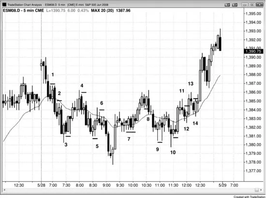
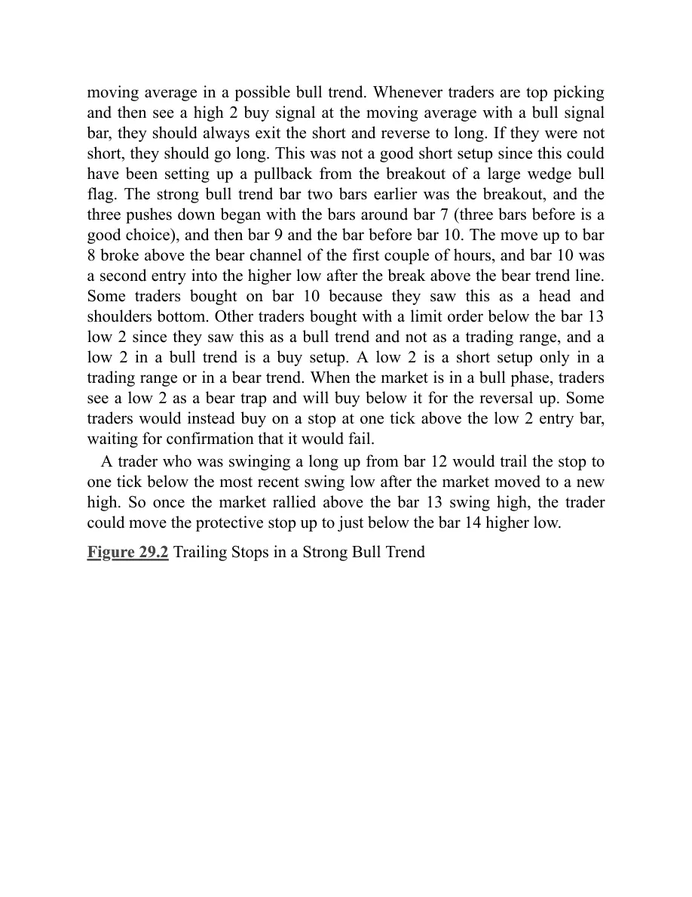
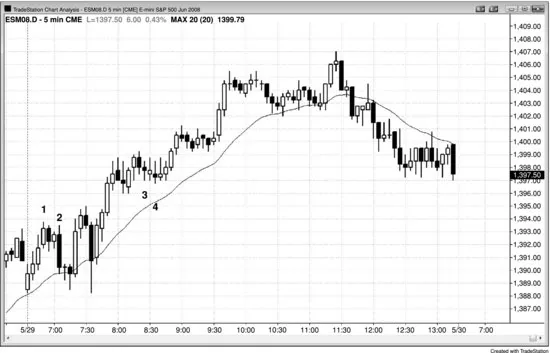
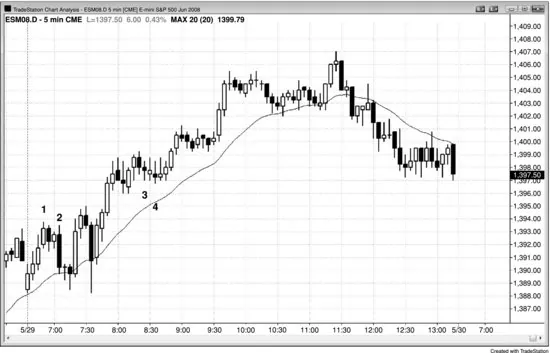
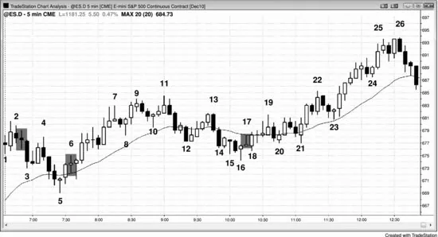

### 第29章 保护性止损与移动止损

<!-- English: Chapter 29: Protective and Trailing Stops -->

<!-- Source PDF pages 565–586 -->

<!-- PDF page 565 -->

第 29 章
保护性止损与移动止损由于大多数交易最多只有 60% 的确定性，你必须始终为另外 40%——交易未按预期发展的时候——制定计划。你不应忽视那 40%，就像你不应对 30 码外朝你开枪、只有 40% 命中率的人掉以轻心一样。40% 非常真实且危险，因此始终要尊重持相反看法的交易者。你计划中最重要的部分是在市场对你不利时，市场中要有保护性止损。最好让止损真正挂在市场中，因为许多使用心理止损的交易者在最需要时会找到太多理由忽视它们，结果小亏损不断变大。放置止损有几种方法，任何一种都可以。最重要的考虑是：止损单要真正在市场中工作，而不只是在你脑子里。

保护性止损的两种主要类型是资金管理止损（你冒一定数量的 tick 或美元）与价格行为止损（若市场越过某根价格 K 线或某个价位你就离场）。许多交易者两者都用或视情况选用。例如，在大多数交易中对 Emini 用 2 点止损的交易者，若 K 线很大可能会用 3 点止损。刚做多的价格行为交易者最初可能在信号 K 线低点下方 1 个 tick 放保护性卖出止损。然而，若该 K 线异常大，如 6 点高，她可能要么交易少得多的合约，要么改用约 3 点的资金管理止损。一般来说，大多数或全部时间用同一种方法最好，因为它会成为你程序的一部分，使你在任何交易入场后立刻都有保护性止损在工作。这使你免于在注意力需要放在是否交易的决策上时，还要分心思考不同情况下该用何种类型与大小的止损。

<!-- PDF page 566 -->

对大多数小剥头皮，交易者不想看到任何回撤，往往一出现就退出。然而，若他们相信市场已进入趋势通道，通常会允许小回撤。例如，若当日是震荡日，市场刚从区间低点出现尖峰上涨，现在可能形成可测试区间顶部的小多头通道，做多交易者的利润目标有限，因此交易是剥头皮。由于市场处于多头通道，它很可能有回撤，意味着某根 K 线可能跌破前一根低点几个 tick，但不会跌破通道内最近的摆动低点。既然交易者怀疑市场可能进入通道却仍做多，他必须愿意持有度过那些回撤，并把保护性止损放在通道内最近摆动低点之下。激进、有经验的交易者甚至可能在前一根低点用限价单再买，因为他们知道通道通常有一或两根回撤 K 线却继续向上工作。

若交易者买入做波段，他们预期多头趋势。由于多头趋势是一系列更高高点与更高低点，在市场创出新摆动高点后，把保护性止损移到最近摆动低点之下是合理的。这称为移动止损。若市场上涨 5 或 10 根 K 线，回撤到入场价之下，再上涨到新摆动高点，交易者不想让市场跌破那个回撤的低点，会把保护性止损移到其低点下方 1 个 tick。许多交易者不想让止损被第二次测试，会干脆把止损移到保本。

一旦交易者看到市场突破进入他们认为将是趋势型震荡日的形态，他们必须准备好在市场开始形成第二个震荡区间时改变交易风格。例如，若有持续几根 K 线的多头突破，随后一根回撤，再是更弱的反弹，那个回撤 K 线的低点很可能成为上方震荡区间的低点。由于市场通常会回测进入突破缺口，并常到下方震荡区间顶部，概率是它会跌破那个回撤 K 线的低点。因此，多头不应把止损移到该低点之下，因为会被打出。若他们曾考虑在那里放保护性止损， <!-- PDF page 567 --> 更合理的是在接下来几根内某根多头趋势 K 线的收盘退出，这样他们在正在发展的震荡区间顶部附近止盈，而不是在底部之下。一旦市场演化成震荡区间，交易者不应再把它当作仍在强趋势中来交易。

一些交易者会允许越过信号 K 线的回撤，只要他们相信波段交易的前提仍然有效。例如，若他们买入多头趋势中的 High 2 回撤，且信号 K 线约 2 点高，即使市场跌破信号 K 线低点，他们也可能愿意持有，认为它可能演化成 High 3，即楔形多头旗形买入形态。其他交易者若市场跌破信号 K 线会退出，然后若强劲的 High 3 买入信号形成再买入。一些人甚至会买入是第一次两倍大的仓位，因为他们把强劲的第二次信号看作更可靠。这些交易者中许多人若认为 High 2 买入信号看起来不太对，会在 High 2 上只买半仓。他们允许 High 2 失败并演化成可能看起来更强的楔形多头旗形的可能。若发生这种情况，他们会对通常的满仓感到舒适。

其他交易者在看到可疑信号时交易半仓，若保护性止损被打中就退出，然后若第二次信号强劲就用满仓。在交易对你不利时分批加仓的交易者显然不用信号 K 线极端作为初始保护性止损，许多人正好在其他交易者保护性止损止损出场的地方加仓。一些人干脆用宽止损。例如，当 Emini 平均日波幅小于约 15 点时，趋势中的回撤很少超过 7 点。一些交易者会认为，除非市场下跌超过平均日波幅的 50% 到 75% 之间，趋势仍在生效。只要回撤在他们的容忍范围内，他们会持有仓位并假定前提正确。若他们买入多头趋势中的回撤，且入场在当日高点下方 3 点，他们可能风险 5 点。既然他们相信趋势仍在生效，他们相信至少有 60% 的等距运动机会。这意味着他们至少 60% 确定市场会至少上涨 5 点 <!-- PDF page 568 --> 才会跌 5 点到他们的保护性止损，这创造了盈利的交易者公式。若他们在多头回撤中的初始买入信号在高点下方 5 点，他们可能只风险 3 点，并在测试高点时寻找退出多单。由于回撤相对较大，趋势可能稍弱，这可能使他们在测试趋势高点时止盈。他们会尝试至少得到与所冒风险相当的利润，但若担心市场可能转入震荡区间或甚至反转为空头趋势，他们可能愿意在旧高点稍下方离场。

一旦市场终于开始进入震荡区间，交易者应在区间高点附近至少部分止盈，而不是依赖移动止损。因为市场很可能开始出现跌破前一摆动低点的回撤。一旦交易者相信他们的止损很可能被打中，在那之前退出就合理，尤其是若他们已达到大部分利润目标。

大多数交易的初始价格行为止损是信号 K 线之外 1 个 tick，直到入场 K 线收盘；若入场 K 线强劲，则收紧到入场 K 线之外 1 或 2 个 tick。若入场 K 线是十字星，则依赖原始止损。记住十字星是单 K 线震荡区间，若你刚买入，你不想在你认为是多头趋势中的震荡区间下方退出（卖出）（或若你刚做空，你不想在新空头趋势中的震荡区间上方买入）。

事实上，有经验的交易者可以考虑在可能的新多头趋势中小十字星入场 K 线下方 1 或 2 个 tick 加仓（或在新空头趋势中十字星入场 K 线上方），对加仓合约依赖初始止损位置。他们在 Low 1 做空信号 K 线下方买入，因为他们认为市场向上而非向下。Low 1 是空头趋势中强空头尖峰底部的做空形态，或震荡区间顶部附近（在震荡区间中更好等待 Low 2 做空），而不是震荡区间底部或新多头趋势底部。由于在那里做空很可能失败，放在 Low 1 信号 K 线下方的 2 点保护性买入止损比 6 tick 止盈限价单更可能被打中。这意味着在 Low 1 信号 K 线下方买入之后，市场很可能至少上涨 2 点才会跌 6 个 tick。既然交易者认为这是新多头趋势或至少是震荡区间， <!-- PDF page 569 --> 他们认为市场会至少上涨 3 或 4 点，因此这是合乎逻辑的多头交易。

若入场时的 K 线是相反方向，你必须做决定。例如，假设你刚买入强多头市场中的回撤，信号 K 线是回撤到均线的两段式末端的强多头反转 K 线。若入场 K 线变成空头反转 K 线，你通常应把保护性止损保持在信号 K 线下方。然而，若你在强空头趋势中买入向上反转，若市场跌破那根空头入场 K 线，你通常应退出。在某些情况下，若背景合理，你甚至应反手做空。一般来说，若你相信失败的多头会成为做空形态，你不应在强空头趋势中买入。很少有交易者能在这种情况下反手；若空头趋势仍强到做空 Low 1 形态合理，那么它可能太强而不应寻找多头。相反，多头应等待强劲反弹，然后寻找更高低点回撤买入。在空头趋势中、在有证据表明多头能控制市场之前买入，是亏损策略。由于大多数多头反转会变成空头旗形，远更好的是不买入而寻找做空，除非反转形态特别强（这在第三本书趋势反转章节讨论）。

若任何交易入场时 K 线太大，更明智的是用资金管理止损，如 Emini 5 分钟图上 8 个 tick，或约 70% 回撤（斐波那契 62% 回撤之外几个 tick）。例如，在大型多头信号 K 线上方做多时，你会把保护性止损放在从信号 K 线底部到入场价距离约 30% 的位置。资金管理止损的大小与 K 线大小成比例。在市场到达第一利润目标并锁定部分利润后，把保护性止损移到大约保本（入场价，即信号 K 线极端之外 1 个 tick）。最好的交易不会打中保本止损，在 5 分钟 Emini 上很少会越过入场超过 4 个 tick（例如，做多后信号 K 线高点下方 3 个 tick）。

若你因大型强劲反转 K 线与其他因素汇聚而对反转非常有信心，你可以用越过那根大型 <!-- PDF page 570 --> 信号 K 线的止损，并允许入场后的回撤，只要不打中你的止损。你甚至可能允许信号 K 线之外几点的止损，但若这样做，计算你的风险并减小仓位，使风险与其他交易相同。另外，若你有信心反转强到很可能有两段，且在你剥出部分仓位后市场回穿原始入场几个 tick，你可以持有度过回撤并依赖原始止损，尽管有几个 tick 的浮亏。否则（例如在新多头中）你会在保本退出波段部分，然后在打掉你止损的那根高点上方再买，放弃你认为极高概率的第二段中的两点或更多。

若你在进入你认为即将结束的安静回撤且 K 线较小，你可以考虑用通常的资金管理止损，即使这意味着风险到信号 K 线之外几个 tick。例如，若当日是空头趋势日，有低动能多头通道上涨到均线形成 Low 4 做空形态，且信号 K 线是 3 tick 高的十字星，相信回撤即将结束的交易者可能风险他们通常的 8 个 tick，即使止损会在信号 K 线上方 4 个 tick。Low 4 形态常形成于窄通道中，入场是窄通道下方的突破。窄通道突破通常有回撤，有时会越过信号 K 线。这里，更高高点突破回撤并不令人意外。只要交易者相信前提仍然有效，他们可以给交易一些空间。或者，他们可以在市场升破入场或信号 K 线时退出，然后在市场再次向下时再卖；但若他们对自己的分析有信心，可以依赖原始 8 tick 止损并允许更高高点回撤。一般来说，若你处于亏损交易中，问问自己若你现在空仓是否还会做这笔交易。若答案是否，就离场。若你的前提不再有效，即使亏损也要退出。

当你担心市场可能波动且 K 线很大时，你应只交易通常仓位的一小部分。把仓位减半或减到四分之一再下单。若你在买入并对低点会守住有信心，但多头交易 <!-- PDF page 571 --> 需要比你通常用的大得多的资金管理止损，你可以用更大止损然后等待。若市场在没有太大回撤的情况下打到利润目标，止盈。然而，若它只越过你的入场一两个 tick，回撤几乎到你的止损，然后再次升破入场价开始向上，提高你的利润目标。一般规则是，市场会反弹到足以等于它要求你持有交易所需的止损大小。因此若市场在入场下方下探 11 个 tick 后反转向上，只有 12 个 tick 的止损才会有效；因此市场很可能到入场价上方约 12 个 tick 或更多。明智的是在比这少 1 或 2 个 tick 处挂限价单止盈，当接近目标时把止损移到保本，等待看利润目标订单是否成交。例如，假设回撤是 11 个 tick，你越过信号 K 线的止损未被打中（或许它是 12 甚至 18 个 tick），现在市场再次朝你的方向走；计算为避免被止损出局你本来必须冒的总 tick 数。此时你必须冒 12 个 tick（回撤之外 1 个）。现在把利润目标提高到比风险少 1 或 2 个 tick，即 11 个 tick。你还应在这一点把保护性止损调整到那个回撤之外 1 个 tick，因此你现在风险 12 个 tick。

当保护性止损在做出剥头皮利润之前被打中时，你被困进了坏交易，因此在止损上反手偶尔是好策略。这取决于背景。例如，当认为市场正反转为多头趋势时，失败的 Low 2 做空是反手做多的好反转。然而，窄幅震荡区间中的止损扫荡不是反转。花时间确保你正确解读图表，再考虑相反方向的交易。若你没有时间立刻重新入场，等待下一个形态，它总是会在不太久之后到来。

在研究一个市场后，你会看到合理的止损是什么。当 Emini 5 分钟图平均日波幅是 10 到 15 点时，8 个 tick 在大多数日子效果很好。然而，密切关注第一小时所需的最大止损大小，因为这往往成为当天其余时间最好用的止损。若止损超过 8 个 tick，你很可能也能增加利润目标的大小。

<!-- PDF page 572 -->

然而，除非 K 线异常大，这最多只提供适度优势。

有几种常见形态通常需要大止损，这意味着交易更小仓位。两者都涉及在趋势中强尖峰收盘附近入场，但两笔交易方向相反。当趋势开始时有强尖峰且有几根连续趋势 K 线时，交易者会在 K 线形成时与收盘时顺势入场。例如，若有强多头突破且有两根大型多头趋势 K 线，多头会买入第二根的收盘及其高点上方。若随后有第三、第四与第五根连续多头趋势 K 线，多头会在多头尖峰生长时继续买入。他们所有入场的理论止损在尖峰底部之下，那很远。若交易者用那个作止损，他们需要交易非常小的仓位以把风险保持在舒适区内。现实中，多数交易者在尖峰晚期入场时会考虑用更小止损剥更大仓位。因为回撤变得更可能，然后允许他们在更低价格、用更小止损（如信号 K 线下方）建立波段仓位。

交易者在大型趋势 K 线期间入场并需要大止损的第二种情形是逆势入场。例如，若有第三次连续卖盘高潮且无显著回撤，而第三次有当日最大的空头趋势 K 线并收在最低点附近，激进的多头会买入该 K 线收盘，预期它是或接近该段的低点；他们也预期强劲反弹会跟随。这种情形下可靠的保护性止损位置从不确定，但作为规则，既然交易者预期反弹至少到大型空头趋势 K 线的高点且对交易 60% 确定，他们应风险大约与空头趋势 K 线中 tick 数相当。这在第 3 本书高潮章节讨论更多。若他们是非常有经验的交易者，这可以是可靠交易。这些情形中成交量往往巨大，意味着机构也在大量买入。空头在兑现空单利润，多头在积极买入。双方往往等待一根进入支撑的大型空头趋势 K 线作为衰竭信号，然后大量买入。因为他们预期底部很快形成， <!-- PDF page 573 --> 他们退到一边，停止在支撑稍上方买入，这以大型空头趋势 K 线的形式创造了卖盘真空。

还有许多其他特殊情形，交易者可能用异常宽的保护性止损。我有一个朋友寻找弱势通道并对它们分批逆势加仓，预期反转。例如，若市场在多头尖峰后处于多头通道且通道并不特别强，他在通道内前一摆动高点用限价单做空，用约四分之一正常仓位，并在通道继续时在接下来两三个摆动高点上方加仓。当 Emini 平均日波幅约 10 到 15 点时，他的最终止损距第一次入场约 8 点，目标是测试第一次入场。一旦反转进行中，若他认为它很强，他往往会把部分仓位波段持有到原始入场之下。

交易者可以在阶梯形态或趋势型震荡日上 fade 突破时用宽止损。若 Emini 平均波幅约 10 到 15 点且有约 5 点的突破，交易者可能 fade 突破并风险约 5 点以赚 5 点，预期测试突破。在典型情形中，这笔交易有超过 60% 的成功机会，因此有正的交易者公式。

交易者有时 fade 大趋势末端一根最后旗形的大型趋势 K 线突破，预期趋势 K 线是衰竭高潮（这在第 3 本书高潮反转章节讨论）。例如，若有持续 30 根左右 K 线且只有小回撤的多头趋势，然后有一根大型多头趋势 K 线，随后一或两根回撤，若下一根也是大型多头趋势 K 线，多头与空头都会卖出其收盘。多头卖出止盈，激进的空头卖出开空。空头会风险约该 K 线高度（若 K 线 10 个 tick 高，他们用约 10 tick 止损），初始利润目标是测试该 K 线底部。下一个目标是等幅运动下跌。

我另一个朋友在 Emini 回撤入场时常规使用 5 点止损。他觉得自己无法持续预测回撤的结束，而是在认为趋势正在恢复时入场。他只是假定自己有时入场过早， <!-- PDF page 574 --> 回撤可能在趋势恢复前再走远一点，宽止损允许他留在交易中。他的利润目标是测试趋势极端，可能有 3 到 5 点远。若恢复很强，他会波段持有，寻找 5 点或更多。尽管这种方法有许多变体，平均风险一般大约等于平均回报，且由于是顺势策略，概率至少 60%。这意味着该策略有正的交易者公式。

每当交易者使用宽止损时，一旦市场开始朝他们的方向转，他们通常能收紧止损并大幅降低风险。一旦波段交易到达利润目标大约一半，许多交易者会把保护性止损移到保本。若市场强烈朝他们方向运动，成功概率上升，潜在回报可以保持不变或他们可能增加它，风险变小。这增强了交易者公式的强度，也是为什么许多交易者偏好等到市场能到达这一点再入场。然而，若反转很弱，尽管交易者可以收紧止损并降低风险，成功概率会更低，他们也可能降低回报（收紧止盈限价单）。若交易者公式足够弱，他们可能尝试以小利润剥出并等待另一笔交易。

目标是赚钱，这需要正的交易者公式。若 K 线大小需要大止损，你必须用它，但你也必须调整目标以保持交易者公式为正。你还应减小仓位。

在大型市场中，可能有一百家机构积极交易，每家贡献总成交量约 1%。其余 99% 成交量中，只有 5% 来自个人交易者。机构会试图从其他机构那里赚钱，后者占市场 94%，而不是在家交易的人那 5% 的美元。机构不在乎我们，也不在那里扫我们的止损、试图吞噬小人物。若你的止损被打中，与你无关。例如，若你做多且保护性卖出止损被打中，你应假定至少有一家机构也想在那个价格卖出。只有极少数情况下，足够多的小交易者做 <!-- PDF page 575 --> 同样的事才能提供足够成交量吸引机构，因此更好的假定是：市场只会在既有机构愿意在那里卖出、又有另一家愿意在那里买入时才交易到任何价格。

**图 29.1 初始止损就在信号 K 线之外**

图 29.1 中初始止损是信号 K 线之外 1 个 tick。一旦入场 K 线收盘，若该 K 线强劲，把止损移到入场 K 线之外 1 个 tick。若风险太大，用资金管理止损或风险约信号 K 线高度的 60%。

若你在 bar 1 在空头内包 K 线下方突破时做空，初始止损会在信号 K 线上方。Bar 1 入场 K 线在入场后立刻向上反转，但未超过信号 K 线顶部，因此这最终会成为盈利的空头剥头皮。一旦入场 K 线收盘，若它是多头或空头趋势 K 线而非十字星，把止损上移到其高点上方 1 个 tick。在这个例子中，信号与入场 K 线有相同高点，因此止损不必收紧。

Bar 3 之前那根是开盘三次向下推动后的多头反转 K 线。尽管买入窄空头通道的第一次突破通常 <!-- PDF page 576 --> 不是好交易，第一小时的反转通常可靠，尤其是前一日有强收盘时（看进入昨日收盘的均线陡峭斜率）。Bar 3 入场 K 线立刻下跌，但未跌破信号 K 线低点，也未跌破其高度约 70%（若你用资金管理止损，认为这根信号 K 线太大而不能用其低点下方的价格行为止损）。一旦入场 K 线收盘，保护性止损应上移到其低点下方 1 个 tick。若市场跌破其低点，许多交易者会做空，因为这是突破回撤做空形态。然而，由于这不是强空头尖峰，它不是可靠的 Low 1 做空。或者，交易者可以把止损保持在信号 K 线下方，但在强空头趋势中抄底时，若市场跌破作为 Low 1 做空信号 K 线的强空头趋势 K 线，持有多单有风险。

两根之后有回撤 K 线，但未打中止损。它精确测试了入场 K 线低点，形成双底。由于这个楔形底部很可能有两段上涨，有经验的交易者持有度过入场后两根的回撤并依赖入场 K 线下方的止损是合理的。否则，你会以 7 个 tick 被止损，然后在回撤 K 线高点上方买入以捕捉第二段；你的入场价会差 3 个 tick，因此总体上你会差 10 个 tick。

回撤到 bar 4 的均线与 bar 1 区域形成双顶，它是小楔形空头旗形。其他交易者会把它看作均线处简单的 Low 2。Bar 4 Low 2 做空的初始保护性止损未被打中，尽管入场后两根有回撤 K 线。止损在信号 K 线上方，在市场朝你方向运动约 4 个 tick 之前，或在市场有合理强空头实体之前，你不应收紧到最近 K 线高点之上。给交易时间去工作。另外，当入场 K 线是十字星时，通常可以安全允许 1 或 2 个 tick 回撤。十字星是单 K 线震荡区间，在震荡区间上方买入有风险，所以不要在那里买回你的空单。依赖你的原始止损，直到市场至少朝你方向运动几个 tick。

<!-- PDF page 577 -->

Bar 5 多头立刻下跌测试信号 K 线低点（这在未显示的 1 分钟图上可见），形成微型双底，然后成功的多头剥头皮。依赖你的止损，忽略 1 分钟图。当做 5 分钟入场时，依赖 5 分钟止损，否则你会亏得太频繁，并在试图降低每笔交易风险时被止损出局许多好交易。

Bar 7 是强多头尖峰后的 High 2 多头。市场测试了信号 K 线下方的止损但差 1 个 tick 未打中，然后测试了入场 K 线下方收紧的止损，但两个止损都未被打中。入场前的十字星增加了交易风险，但在从当日新低冲高后有六次收在均线之上，这是可接受的多头形态，因为你必须预期第二段上涨。

Bar 8 的 ii 形态是 High 1 买入形态。然而，它不在强多头趋势中强多头尖峰的顶部，因此不是好交易。事实上，它在从当日低点尖峰之后的多头通道顶部；它大约在等幅运动上涨处，并可能与 bar 4 形成双顶。由于大多数震荡区间突破尝试会失败，市场向下交易的机会有 60%，突破成功的机会只有 40%。不可能确定地知道概率，但谈到震荡区间突破尝试时，60–40 是好的经验法则。激进的交易者会在 ii 形态高点用限价单做空，预期它是多头陷阱。若交易者反而在 bar 8 ii 形态上方买入，保护性止损在入场 K 线被打中；这会是好的反转，像大多数失败的 ii 形态一样。

若你在这个震荡日顶部附近 bar 11 摆动高点做空，你可以在测试均线的 bar 12 反转 K 线上反手，或在 bar 11 做空后的入场 K 线上方 1 个 tick 用买入止损反手。

从 bar 13 摆动高点、Low 2 的做空变成五 tick 失败与失败的 Low 2。你应在 bar 14 在入场 K 线（bar 13 信号 K 线之后那根）上方 1 个 tick 反手做多，因为有被困空头，你应预期至少再两段上涨。若你未在那里买入，你应在 bar 14 之后那根买入，因为 bar 14 是两 K 线向上反转，且是可能多头趋势中均线上方的 High 2 买入信号。

<!-- PDF page 578 -->

每当交易者在顶部抄顶然后看到均线处有多头信号 K 线的 High 2 买入信号时，他们应始终退出空单并反手做多。若他们没有空单，他们应做多。这不是好的做空形态，因为这可能是在设置大型楔形多头旗形突破的回撤。两根之前的强多头趋势 K 线是突破，三次向下推动始于 bar 7 附近的 K 线（前三根是好选择），然后是 bar 9 与 bar 10 之前那根。上涨到 bar 8 升破前几小时的空头通道，bar 10 是升破空头趋势线后更高低点的第二次入场。一些交易者在 bar 10 买入，因为他们把这看作头肩底。其他交易者在 bar 13 Low 2 下方用限价单买入，因为他们把这看作多头趋势而非震荡区间，而多头趋势中的 Low 2 是买入形态。Low 2 只有在震荡区间或空头趋势中才是做空形态。当市场处于多头阶段时，交易者把 Low 2 看作空头陷阱，会在其下方买入以向上反转。一些交易者会改为在 Low 2 入场 K 线上方 1 个 tick 用止损买入，等待确认它会失败。

从 bar 12 波段持有多头上涨的交易者会在市场创出新高后，把止损移到最近摆动低点下方 1 个 tick。因此一旦市场升破 bar 13 摆动高点，交易者可以把保护性止损上移到 bar 14 更高低点稍下方。

**图 29.2 强多头趋势中的移动止损**

<!-- PDF page 579 -->

在强多头趋势中，交易者往往在市场刚创出新摆动高点后，把保护性止损移到最近摆动低点之下。一旦市场看起来将进入震荡区间，交易者应部分止盈，并考虑以更小利润剥头皮。

如图 29.2 所示，今日有大向上跳空与当日第一根强多头趋势 K 线，因此很有机会成为开盘即多头趋势日。若交易者在 bar 2 或 bar 4 上方买入，一旦 bar 5 升破最近摆动高点 bar 3，他们就可以开始移动保护性止损。上涨到 bar 5 的三 K 线多头尖峰使多数交易者相信始终持仓方向是做多且强劲，因此许多交易者想让利润奔跑。一旦 bar 7 升破 bar 5，他们可以把保护性止损收紧到 bar 6 下方 1 个 tick；当市场升破 bar 9 时，他们可以上移到 bar 10 下方 1 个 tick。

交易者知道趋势通常在某个时刻有更大回撤，许多交易者会在相信更复杂回撤即将来临时部分或全部止盈。等幅运动目标往往能提示机构可能在哪里止盈，意味着回撤可能在哪里开始。由于初始强多头尖峰始于 bar 4 并在 bar 8 附近结束，从那里的等幅运动上涨会是利润了结可能发生的水平。从 bar 10 到 bar 19 的上涨也有三段，而三段式运动是楔形的变体 <!-- PDF page 580 --> （即使像这样处于陡峭通道中），之后可以跟随更大回撤。初始目标是移动平均线。Bar 18 是大型多头趋势 K 线，随后又是一根大型多头趋势 K 线，这两 K 线买盘高潮跟随了延长的趋势。当发生这种情况时，市场往往修正至少 10 根 K 线与两段，尤其是像这里一样远离均线时。当 bar 19 变成空头反转 K 线时，许多交易者止盈。其他交易者假定第一次回撤后会至少再创一个新高，并持有度过回撤。然而，当市场在接近收盘时升破 bar 19 时，bar 30 上有积极的利润了结，因此许多交易者在新高处与市场向下转时止盈。

今日是非常强的多头趋势日，很可能在回撤到均线后测试高点。下跌到 bar 24 的空头通道动能低且 K 线小。在 bar 24 上方买入的交易者可能考虑依赖通常的 8 tick 止损，以防窄空头通道（所有空头通道都是多头旗形）上方的突破后跟随更低低点突破回撤。市场强劲向上突破但立刻形成大的两 K 线空头反转。在强多头趋势回撤到均线时，这不是可靠的做空形态。有经验的交易者会依赖他们的止损，即使止损在信号 K 线下方几个 tick。止损不会被打中，交易者然后可以在当日高点附近退出多单。或者，交易者可以在 bar 25 两 K 线反转下方退出，然后在 bar 26 微型通道突破回撤上方再买。

在强多头趋势中、直到 bar 19 买盘高潮之前任何时点买入的波段交易者，理想情况下会用最近摆动低点下方的保护性止损，这意味着风险超过 2 点并用宽止损。一旦 bar 19 买盘高潮形成，市场很可能进入震荡区间，交易者会切换到震荡区间交易风格，意味着剥头皮而不是波段。由于市场正在进入震荡区间，它很可能跌破前一摆动低点，因此不再合理把保护性止损放在那里。一旦因震荡区间形成而止损很可能被打中，交易者应在那之前很早就退出多单。敏锐的 <!-- PDF page 581 --> 交易者会在可能发展的区间顶部、如 bar 19 下方，在强势时退出。激进的交易者会在那一点开始做空，寻找到均线的剥头皮。

多数波段交易者会把保护性止损移到最近摆动低点之下。有些交易者偏好用利润目标，而不是让波段交易一直跑到趋势结束。那些人往往在市场到达利润目标一半时，把保护性止损移到不差于保本。

**图 29.3 回报往往等于风险**

市场往往用与它迫使交易者所冒风险相当的 tick 利润来回报交易者。一般来说，在空头趋势日大型信号 K 线上方买入有风险，这里基于图 29.3 图表描述的交易充其量存疑，但它们说明了一个观点。

若交易者在 bar 5 上方买入，认为它是第二次连续卖盘高潮与抛物线运动的底部，因此很可能跟随两段式反弹，他们的初始止损会在 bar 5 低点下方。Bar 7 测试了低点但未打中止损。然而，一旦市场升破 bar 7，交易者会把止损移到 bar 7 低点下方 1 个 tick，那在入场价下方 16 个 tick。市场然后精确反弹到 bar 8 高点，在入场价上方 16 个 tick（以及对均线的测试，空头在那里进来）。理解这种倾向的交易者会在入场上方 15 个 tick 挂止盈 <!-- PDF page 582 --> 限价单。由于他们在他们认为会成为小震荡区间底部的地方买入，他们相信至少有 60% 的机会市场有等距向上运动。这是勉强可接受的交易。

同样的事再次发生在 bar 12 与 bar 16 强多头趋势 K 线上方的多头上。一旦有回撤然后再次向上，交易者看到市场迫使他们冒了多少风险，就可以把止盈限价单放在比该风险少 1 个 tick 处。

在从 bar 2 到 bar 3 的空头尖峰期间任何时点做空、并计划波段持有的交易者，会用宽保护性止损，可能在尖峰顶部上方。多数交易者会冒比那少的风险，但他们也会比剥头皮多冒两到三倍。

在 bar 16，假设多头买入第三次向下推动后的向上反转，寻找最后旗形趋势反转。由于从 13 下跌的通道很窄，若交易者等待看突破是否强劲，然后买入强尖峰或随后的回撤，成功多头的概率会更高。然而，为了说明，假设交易者只是在 bar 16 上方买入。他可能假定有 50% 的机会市场升破 bar 13 高点并到达等幅运动上涨，使他的回报远大于风险（到 bar 16 买入信号 K 线下方）。然而，他可能因上涨到 bar 17 十字星时多头缺乏紧迫感而担心，并决定前提已改变。他可能确信市场只是在空头通道中再做一个更低低点而不是趋势反转，然后干脆剥出多单。若他认为市场正在见顶，继续持有多单对他毫无意义。若他认为可能有第二段上涨但打不中保本止损，他可能把保护性止损移到保本。若他认为市场可能跌破入场价但守在信号 K 线低点之上并形成更高低点，他可以保持原始止损，或退出并买入突破回撤到更高低点。交易者不断做这些决定，他们做得越好，就越能赚钱。若他们始终坚持原始前提， <!-- PDF page 583 --> 即使市场没有做他们预期的事，他们会很难通过交易赚钱。他们的工作是跟随市场，若它不朝他们认为应去的地方走，他们应退出并寻找另一笔交易。

波段交易者允许回撤，并耐心等待到趋势充分进行再收紧止损。在 bar 20 下方做空、预期它是对震荡区间顶部的测试并将导致开盘空头趋势恢复的波段交易者，可能在寻找至少是风险两倍的回报。一旦他看到强空头入场 K 线，他可能把止损收紧到其高点之上，或可能把它留在 bar 20 信号 K 线高点之上，直到从 bar 24 双顶向下转之后。信号 K 线高 3 点（12 个 tick），因此初始风险是 14 个 tick。若他的利润目标是风险的两倍，他在寻找入场下方 28 个 tick 止盈，即 1,305.25，而他的止盈限价单会在 bar 27 前两根成交。Bar 24 升破 bar 23 之前强空头趋势 K 线 1 个 tick，困出没耐心的弱势空头，但未升破入场 K 线或信号 K 线。

**图 29.4 止损大小往往由当日第一笔交易设定**

<!-- PDF page 584 -->

市场反弹到昨日高点之上然后向下转，如图 29.4 所示。在 bar 1 下方做空的交易者会把初始保护性止损放在 bar 1 上方。在 bar 2 市场向下转后，他们可以算出市场在朝他们有利方向走之前曾对他们不利 8 个 tick。这意味着他们要留在交易中必须用的最小初始保护性止损是 9 个 tick，他们会整天记住这一点。

若你在 bar 3 买入失败的 Low 2 并把初始止损放在信号 K 线低点下方 1 个 tick，你会风险 8 个 tick。1 tick 止损扫荡常见，而你知道当天早些时候需要 9 tick 止损，因此冒那额外 1 个 tick 是明智的。这不是很棒的买入，因为它跟随微小突破，且最近七根 K 线大体横盘。第二次入场会更好。Bar 4 是 High 2 买入形态，两根之后的多头内包 K 线是突破回撤买入形态（内包 K 线是 High 2 多头突破的回撤）；两者都是更强的形态。

一旦 K 线变小，你可以把止损大小调整到适合当前市场状况的大小。然而，市场在当天晚些时候往往有需要更大止损的交易。不要担心止损被打中并亏损。这通常比整天不断调整止损、目标与仓位、结果错过交易或犯错更容易。

**图 29.5 不要过早收紧止损**

<!-- PDF page 585 -->

不要在入场后几根内形成的小十字星之后收紧保护性止损。它们是单 K 线震荡区间，市场常见会越过它们反转 1 或 2 个 tick。你不想在前提仍然完整时被止损出局。

若交易者在 bar 2 下方做空并看到入场 K 线的十字星收盘，他们应把保护性止损保持在信号 K 线高点之上，直到市场朝他们方向做出强劲运动。他们可以在 bar 3 下挫时剥出部分，若他们认为均线陡峭且有反弹风险，然后可以把它收紧到保本或 bar 3 上方一根。若他们这样做，会在 bar 4 被止损，但那仍是明智决定。然而，在大向上跳空日当有接近均线的回撤时，往往有第二段下跌测试得更近；这往往设置当日低点，如这里 bar 5。

若交易者在 bar 5 均线缺口 K 线与 High 2 以及楔形多头旗形测试上方买入，一旦入场 K 线收盘且明显是强多头趋势 K 线，他们可以把波段部分的保护性止损移到保本。他们不会在 bar 6 十字星低点下方退出。

若他们在 bar 16 多头反转 K 线上方买入，把它看作 High 2 多头或楔形多头旗形（其中 bar 8 或 bar 10 形成第一次向下推动），他们不会在入场 K 线变成 <!-- PDF page 586 --> 十字星后收紧止损。然而，一旦 bar 18 变成强多头趋势 K 线，他们应把止损移到其低点下方。
