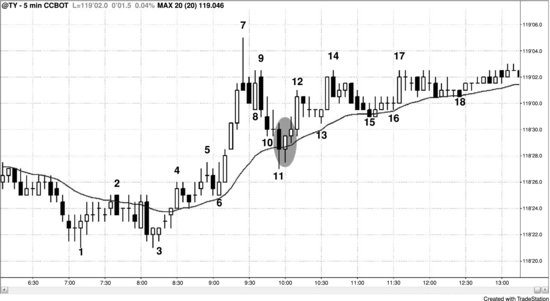
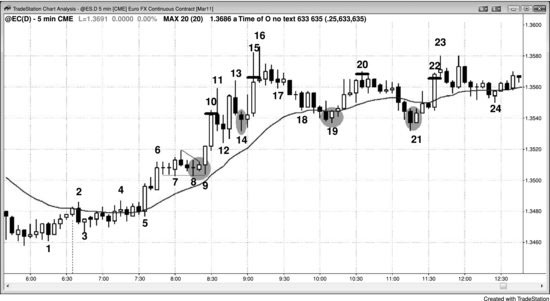

## 第30章　获利了结与止盈目标

<!-- Source PDF pages 587–595 -->
<!-- English: Chapter 30: Profit Taking and Profit Targets -->

<!-- PDF page 587 -->

# 第30章  
# 获利了结与止盈目标

所有回撤与反转都以获利了结开始。有经验的交易者寻找在强处离场，然后在回撤时重新入场。例如，若多头趋势刚开始且特别强，多头会在市场突破最近摆动高点上方时加多。然而，随着趋势成熟并发展更多双边交易，他们不再在最近摆动高点上方止损买入。相反，随着反弹减弱，他们会寻找在该高点上方或甚至略下方部分获利了结。若多数多头在先前高点附近获利了结且不在突破上加多，市场会开始有回撤。这意味着多头宁愿在更低价格买入，并相信会有回撤让他们这样做，因此他们不再愿意追市场向上、在先前高点上方买入。若获利了结非常重，且也有激进、无情的做空，回撤会成长为大调整（震荡区间）甚至反转。多头也会在任何强的迹象上寻找获利了结，如在大多头趋势K线收盘与刚好上方，或在下一两根收盘——尤其若它是小K线或有空头收盘。他们会在下一根低点下方更多获利了结。这就是为什么这么多突破尝试的大趋势K线后跟小K线与回撤，意味着突破失败。交易者也会在前一根低点下方、最近更高低点下方或保本处有止损单。这是因为若市场在到达其目标前强反转，他们可能开始相信能离场然后以更好价格再买入。开空的空头看到同样的事，通常开始通过在新高或在强多头趋势K线收盘附近卖出来寻找剥头皮。随着回撤变深，他们会开始波段持有部分仓位。最初，他们通常会被打掉 <!-- PDF page 588 --> 波段部分的止损，但最终当调整变深或趋势最终反转时，他们会获得大波段利润。

交易者在空头趋势中行为类似。空头会在趋势强时在摆动低点下方做空，但随着它减弱，他们会改为在最近摆动低点附近与下方回补空单，并寻找在更高处再做空。多头剥头皮者会买入新低并在小反弹上剥头皮离场，大约在空头再次做空处。多空都等待相对大的空头趋势K线突破至新低，此时两者都会在其收盘附近买入。随着空头反弹变强，多头会更愿意波段持有部分仓位。在某一点，市场会过渡到大多头摆动或趋势，过程会在相反方向开始。理解创造突破的趋势K线是交易者能获得的最重要技能之一。交易者需要能评估突破是否可能成功、是否会遇到获利了结与回撤，还是后跟反转。这些在三本书的其他地方详述。

当你入场交易时，你的目标是市场在触及保护性止损之前到达你的止盈目标。与保护性止损不同——只要你持有仓位就应始终在市场中工作——止盈目标可以在市场中或在你头脑中。例如，若你在强趋势中波段交易，你可能沿途对部分仓位获利了结（这是分批减仓）并可能选择持有部分仓位直到有相反方向信号。一旦该相反信号触发，你应离场。很少交易者有能力通过同时离场盈利波段仓位并在相反方向开新仓来反转仓位。

剥头皮者常在入场后立即有 OCO（一单取消另一单）订单工作。例如，他们可能买入 AAPL 做 100 美分剥头皮并在买入回撤时冒 50 美分风险，他们 60% 或更多确定交易会成功。一旦他们入场，他们的初始订单可能自动生成入场价下方 50 美分的保护性卖出止损单与入场价上方 100 美分的卖出限价单。由于该括号单是 OCO，一旦 <!-- PDF page 589 --> 一对中的一个成交，另一个自动取消。无论你如何管理订单，你应在每次入场与离场后检查账户，确保当前仓位与订单是你认为应有的。你不想空仓却仍有买入限价单在工作，而你以为它应已自动取消。永远不要假设经纪商软件会 100% 按预期工作，或你正确下了交易与订单。一切都有不可避免的失败率，你应始终在相信应已完成后确认预期已完成。

所有交易都应基于交易者公式做出，初学者应寻找成功概率 60% 或更高、回报至少与风险一样大且最好约两倍风险的交易，尽管有那么强交易者公式的形态在平均日只发生几次。例如，若欧元外汇期货或外汇等价物 EUR/USD 的平均日波幅最近约 100 tick（常称 pip），且每天有几次 20 tick 行情而 10 tick 保护性止损不会被打，交易者可能寻找在均线回撤上进入趋势，使盈利交易概率可能 60% 或更高。仔细选择形态的交易者约有 60% 机会在冒约 10 tick 风险时赚 20 tick，这有出色的交易者公式。在 10 年期美国国债期货中，若平均日波幅约 32 tick（1 点的 16/32）且许多信号K线高四 tick，交易者可再次寻找在均线回撤上入场，冒约六 tick 风险并用八 tick 止盈目标。这再次有强交易者公式。

交易管理对剥头皮与波段不同。做剥头皮的交易者相信利润潜力有限，要么因为没有趋势，要么因为他在逆势交易。在震荡区间中剥头皮可以是盈利策略，但只有最有经验的交易者应考虑逆势交易。若交易者能耐心等待回撤并顺势方向入场，赚钱的机会远大于希望逆势 <!-- PDF page 590 --> 交易成功。一旦你相信有趋势，你必须接受 80% 的反转尝试会失败并演化成旗形。这使多数交易者几乎不可能在止损上逆势入场并持续盈利。例如，若你认为强多头趋势顶部的小空头反转K线后会跟有回撤至均线，并在该K线低点下方 1 tick 止损做空，你必须意识到非常聪明的多头有限价单在该K线低点买入，概率站在他们一边。若你交易 Emini，你需要市场跌到该K线低点下方十 tick 才能在空单上赚八 tick 利润，但强多头趋势中多数回撤会在那之前变成 High 1 或 High 2 买入形态，你会亏钱。若你看到有强趋势并想买入回撤，不要骗自己相信有足够才能在等待买入形态形成时盈利交易做空剥头皮。你几乎总会在做空剥头皮上亏钱，并在买入形态形成时不做。你会希望更多下行并否认回撤即将结束，你会错过可能有数点利润的做多。

在趋势变成震荡区间后，逆势交易实际上不是逆势，因为趋势已暂时结束。然而，许多交易者试图抄多头趋势顶或空头趋势底，相信市场即将进入震荡区间并认为风险小，结果看着账户慢慢融化。

每当交易者入场任何交易时，他们需要获利了结计划，因为否则市场最终会转对他们，利润会变成亏损。交易管理完全取决于交易者公式，任何导致持续利润的风险、回报与概率组合都是有效策略。作为一般规则，多数交易者应把自己限制在高概率交易，其中风险至少与潜在回报一样大。理想情况下，交易者应寻找成功机会至少 60% 且潜在回报约两倍风险的形态，但通常他们不得不满足于回报约与风险相同或略大。这 <!-- PDF page 591 --> 最常发生在趋势中的回撤。

当在强趋势中波段交易时，很容易过早获利了结，因为很难相信交易可能运行五倍或更多于你的止损大小。然而，当趋势强时，情况可以如此。若你相信趋势强，在市场朝你方向走了约两倍于原始保护性止损大小的距离后平掉约一半仓位是合理的。例如，若你在 Emini 中的初始止损是两点，且你在强空头趋势中接近你认为将是大波段下行起点处做空，在入场下方四点的限价单上平掉一半仓位。那时，移动你的止损。你可能在三倍于原始止损大小、六点处再平掉四分之一，然后让最后四分之一运行，只有在强买入信号发展时或在当日收盘离场，以先到者为准。然而，若你对分批减仓不舒服，在两倍风险处平掉全部仓位是合理方法。你总可在下一个信号再入场。

每笔交易的交易者公式随每一 tick 变化。若交易者公式仍有利但不像之前那么强，有经验的交易者常会收紧保护性止损或以更小利润离场。若交易者公式变得勉强，交易者应尽快离场，以尽可能大的利润或尽可能小的亏损。若它变成负的，他们应立即市价离场，即便这意味着承受亏损。决定是否应离场的一种方式是想象你没有持仓。然后看市场并决定你是否认为市价入场并用该保护性止损是明智的。若你不会，则你当前仓位的交易者公式弱或负，你应离场。

记住，止盈目标是保护性止损的另一面，用来保护你免受自己伤害。它迫使你在交易者公式仍为正时获利了结，防止你持有太久然后在交易一路回到入场价时离场，或更糟，一旦它变成亏损者。正如对多数交易者更好始终使用实际在市场中的保护性止损，也更好使用始终在市场中的获利了结限价单。

## 图 30.1　回撤结束于多种支撑类型的汇合

<!-- PDF page 592 -->

当有趋势时，在回撤至均线入场是可靠方法，成功概率通常至少 60%，潜在回报大于风险。在图 30.1 中，从 K线 6 起的强四根多头尖峰后跟急剧回撤至均线，K线 11 后的多头内包K线是合理的做多信号K线。由于该K线高四 tick，初始风险是六 tick。一些交易者把形态看作 High 2，另一些看作窄楔形，K线 8 与 10 的低点是前两次下推。斐波那契交易者把它看作 62% 回撤，它也是对 K线 4 高点的突破回测，差 1 tick 未打到保本止损。每当回撤结束时，通常有数学上逻辑的理由汇合于回撤底部的位置。不同公司会用不同理由，但当有许多在场时，足够多公司会在该区域买入，压倒空头，回撤结束。

市场可能在 K线 9 高点找到阻力，空头把那看作从 K线 7 到 K线 8 低点尖峰下行后通道下行的起点。他们希望有双顶空头旗形，许多人等到市场测试 K线 9 高点再做空。这种空头的暂时缺席增加了该位会到达的机会。K线 9 高点精确在信号K线高点上方 10 tick，那正是多头需要能在限价单上以八 tick 利润离场所需的 tick 数 <!-- PDF page 593 --> （1 点的 4/32）。主要市场中的一切都是数学的，因为这么多交易由计算机完成，它们必须依赖数学做决定。

## 图 30.2　在多头趋势中买入回撤

在欧元外汇期货（或外汇等价物 EUR/USD）中买入回撤是可靠的交易方法。在欧元中，若交易者仔细选择形态，他们常可有约两倍于止损的止盈目标。注意图 30.2 中 K线 9 三角形突破如何毫不犹豫地急冲上行。小多头内包K线是买入信号，其高点刚好在壁架低点上方八 tick，因此风险是 10 tick。由于内包K线是买入信号，在 K线 9 走到其上方并变成外包时买入是合理的。交易者可有位于入场价上方 20 tick 的获利了结限价单，并会在 K线 10 顶部附近成交（在小水平黑线处）。

交易者然后可买入 K线 14 双底（它也是与 K线 12 High 1 的 High 2，以及 K线 12 小多头旗形上方突破后的突破回撤）并在 K线 15 以 20 tick 利润离场，刚好在 K线 13 高点上方。K线 14 信号K线高 14 tick，因此初始风险是 16 tick。由于这是趋势中的回撤，成功机会被假设为至少 60%。

<!-- PDF page 594 -->

K线 19 是多头反转K线，是强多头趋势中第一次回撤至均线。该K线高八 tick，因此风险是 10 tick，交易者可在刚好 K线 20 顶部下方离场，那精确在信号K线高点上方 22 tick。由于限价单在信号K线高点上方 21 tick，多头可以 20 tick 利润离场。市场此时可能在震荡区间中，因为 K线 16 是向下尖峰（十字星顶是同一根内先向上尖峰然后向下尖峰），到 K线 19 的行情在通道中。市场可能测试通道顶部并形成双顶，震荡区间可能扩大，它确实如此。因此，更好在 K线 19 上方剥头皮做多。有空间让 20 tick 止盈目标在通道顶部下方成交，因此这是离场全部做多剥头皮的合理位置。

交易者可在 K线 21 两K线反转上方再次买入，因为它是与 K线 19 的双底以及第一次均线缺口K线（趋势中第一根高点在均线下方的K线）。风险是 11 tick，交易者可在刚好 K线 22 高点下方以 20 tick 利润离场。

若交易者买入 K线 9 三角形突破，一旦他们看到两根多头尖峰的强度，他们可改变计划。不是在 20 tick 处离场全部仓位，他们可在那里离场一半，然后可能下限价单再离场四分之一于再高 10 或 20 tick。他们然后可让剩余运行到当日收盘或直到有清晰做空信号。K线 16 的卖盘高潮可能导致回撤至均线，交易者在 K线 16 下方（或两根后空头内包K线下方）离场并在均线再买入是合理的。然而，若他们一直在分批减仓且只剩四分之一仓位，他们也可持有到收盘，因为他们会知道买家可能在均线回来，可能在收盘前把市场推至新高。

K线 21 做多仍在震荡区间中，但它是与 K线 19 的双底多头旗形；因此有合理机会市场可能在收盘前到达新高。尽管交易者可在 20 tick 处剥头皮离场全部仓位，正确假设多数突破震荡区间顶部的尝试会失败， <!-- PDF page 595 --> 这两段调整有更高机会导致成功突破，强多头趋势日常在当日尾盘反弹至新高。因此交易者可波段持有四分之一到一半多单，以防万一。
