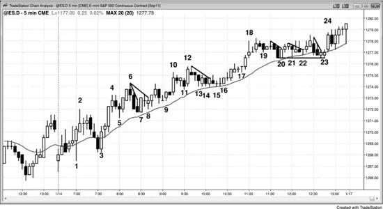
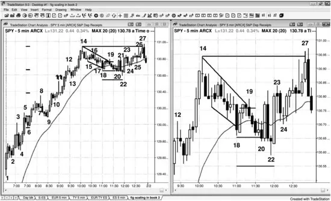
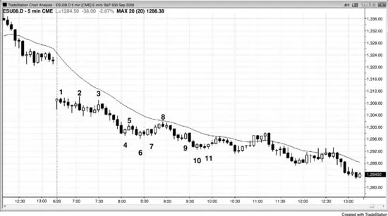
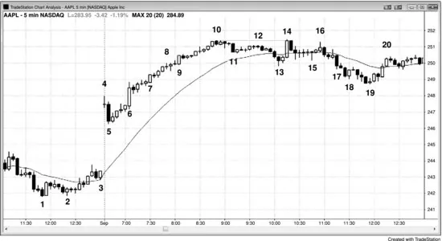
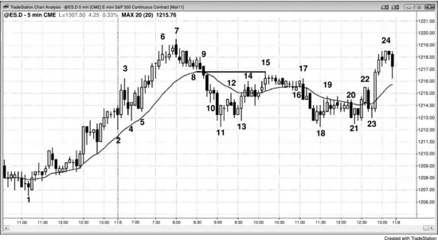
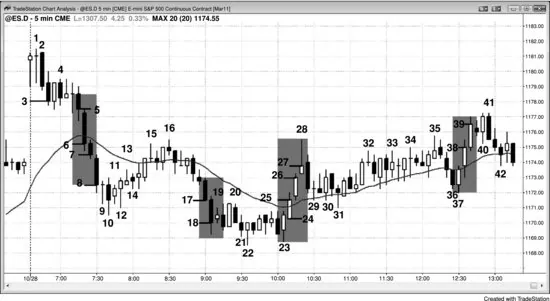
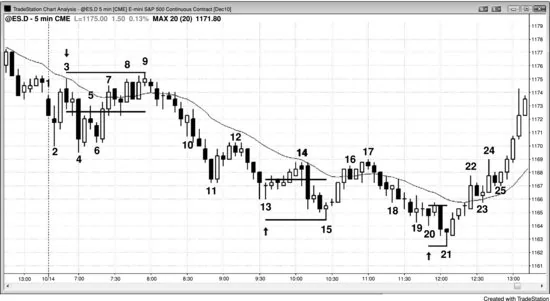

### 第31章 分批加仓与分批减仓

<!-- English: Chapter 31: Scaling Into and Out of a Trade -->

<!-- Source PDF pages 596–617 -->

<!-- PDF page 596 -->

第 31 章
分批加仓与分批减仓分批加仓只是意味着你已经在仓位中再次入场，分批减仓意味着当你退出时，你只退出部分仓位并寻找稍后退出其余。愿意分批减仓的交易者多于愿意分批加仓的；事实上，许多交易者经常分批减仓。例如，若你对部分仓位做剥头皮退出，然后对余额做波段退出，你就是在分批减仓。

分批加仓意味着你在增加仓位。共同基金等机构必须不断分批进出仓位，因为他们每天收到新资金与赎回请求。个人交易者通常在趋势方向于回撤中入场时、在 fade 震荡区间极端时、以及在美元成本平均时使用分批加仓。对潜在反转分批加仓风险很大；通常更好的是若市场对你不利就退出，然后寻找第二次入场。

你可以在交易对你不利时或朝你有利方向运动时分批加仓。若你在已有利润后再加仓，这也称为加仓，或加压你的交易。例如，若市场处于多头通道，多头会在市场走高时的每一次回撤上加仓。强多头尖峰也是如此。许多交易者在尖峰一根接一根快速生长时迅速加多。强尖峰始终创造交易者公式出色的短暂机会，一些交易者擅长在这些快速市场中加压交易。每一次额外买入通常在更高价格，而他们所有更早的入场都盈利。在多头通道中市场走高时做空的空头，是在前一根高点上方分批加空，并在交易继续走高时加仓。每一个更早的入场都有扩大的亏损，但空头预期一旦市场反转，他们 <!-- PDF page 597 --> 会有净利润。我有一个朋友是在 Emini 通道中分批逆势加仓、寻找反转的专家。他寻找市场测试通道起点，在那里止盈。例如，若 Emini 最近平均波幅约 10 到 15 点，而今日有尖峰与通道多头趋势，已有几次向上推动且并不特别强，他会在最近摆动高点用限价单开始做空，并在通道中接下来一两个新高处加仓，只要每一次新入场至少比前一次高 2 点。他的一到三次入场每次约 10 手。多年前我在他做这些交易时与他聊过多次，市场从未在反转并朝他有利方向走之前远超第二次或第三次入场，因此止损在我们谈话中从未成为问题。然而，我假定它必须至少在最终入场之外几点。按我的计算，我相信他愿意为 30 手风险 5,000 到 10,000 美元。我讲这个故事不是为了提倡他在做的事，因为很少有人有经验那样交易。然而，他是专门做某种分批加仓并以此谋生的交易者的有趣真实例子。

对正对你不利的交易分批加仓的关键前提是，你相信市场很快会朝你的方向转，并且你能获利。除非你对大图景有信心，你绝不应分批加仓亏损仓位；最佳情形是你相信自己在对强趋势中不断扩大的回撤分批加仓，且有清晰的始终持仓方向。多数交易者从不对亏损仓位加仓，而是让自己被止损出局，然后若有另一个信号再寻找重新入场。然而，许多交易者觉得自己永远无法确定趋势或震荡区间的精确底部或顶部，但在市场接近反转时有信心。那些交易者中一些人做反转交易并用宽止损。其他人用紧止损，若市场对他们不利，他们被止损然后寻找另一次入场。分批加仓交易者最初用小得多的仓位，若市场继续对他们不利，只要他们相信前提仍然有效，就会加仓。若市场立刻朝他们有利方向走，许多人会通过 <!-- PDF page 598 --> 加压押注把仓位建到满仓。他们愿意在更好或更差价格分批加仓。例如，若他们从大型震荡区间底部买入向上反转，并愿意在更低处分批加仓，但市场反而立刻朝他们有利方向走，他们可能在市场继续向震荡区间顶部反弹时的回撤上加仓。其他交易者可能交易半仓，在更低处加第二半，然后在向上反转时在保本退出第一半，并对第二半用保本止损波段持有。若你在对亏损仓位分批加仓，然后决定大图景已变且前提不再有效，你必须退出交易并接受亏损。即使市场开始朝你有利方向转，若你觉得原始目标已变得不现实，也不要死扛并寄望前提会再次有效。你必须始终交易眼前的市场，而不是你想要的、或几根 K 线前你拥有的那个。市场随每个 tick 变化，若你的原始目标现在不现实，寻找新目标并在那里离场，即使意味着亏损。例如，若你在始终做多的市场中分批加仓，然后它翻转为始终做空，你应退出并寻找做空，而不是寄望始终做多的市场会再次回来。希望永远不是持仓的合理基础，因为市场基于数学，而不是运气、公平、情绪、因果或宗教。

“永远不要对亏损仓位加仓。”这是华尔街最基本的规则之一。然而，它有误导性，因为机构一直这样做，它是许多盈利策略的一部分。这怎么可能？因为那句格言指的是逆势交易，而机构是在顺势交易上分批加仓。每当机构觉得市场向上或向下走得太远，它就看到做相反方向的价值。因为没有人能经常精确抄到转折点，许多机构在许多 K 线过程中分批入场。他们不在乎一些入场信号形成时更早的入场是否有浮亏。只要他们看到价值并有大仓位要建，他们就会努力以尽可能好的价格成交，无论是在更早入场之上还是之下。这类似于个人投资者的美元成本平均。若投资者有一些现金想买股票，他可能在接下来 10 个月每月 1 日用 10% 的现金买入， <!-- PDF page 599 --> 无论更晚的入场是否在更低价格。美元成本平均是成功方法，且往往要求投资者对亏损仓位加仓。然而，这与在强空头尖峰底部买入、认为很快必须有反弹的交易者大不相同。当市场再直跌两根时，他再买，然后在更低处再买，试图降低平均成本。很快，他寄望任何反弹到接近平均入场价，以便保本离场。不可避免地，他的仓位变得如此之大，以至于他决定必须在下一根空头趋势 K 线上离场。那根通常是大型卖盘高潮，他以巨大亏损退出，许多倍于他试图从买入剥头皮赚取的原始利润，而他的退出在市场底部，就在大反弹之前。

分批进出交易有坚实的数学基础，但许多交易者这样做只是因为他们发现它有效，不在乎理由。专业交易者在日线与周线图上一直这样做。它对日内交易者也有效。若你在并不全天持续跟踪的股票上做日内波段交易，且你有经验解读价格行为，并有信心入场靠近一段的起点，你可以用宽保护性止损，并在市场继续对你不利时寻找加仓。你的初始交易可以是通常仓位的一半或三分之一，你可以在市场对你不利时寻找分批加仓一或两次。

分批加仓通常最好发生在始终持仓市场（清晰趋势）中不断扩大的回撤上——至少在更高时间框架上——以及在 fade 震荡区间极端时。交易者可以分批：

- 在强多头尖峰的小回撤上加多（回撤是小逆势通道）。
- 在强空头尖峰的小回撤上加空。
- 在空头通道下跌时加多，或在多头通道上涨时加空。
- 在回撤进一步下跌时加多（回撤是小趋势，因此处于通道中），或在空头反弹上涨时加空。例如，若有陡峭上升的移动平均线，多头会在均线下方回撤上分批加多。

<!-- PDF page 600 -->

- 在任何强趋势的回撤中按固定间隔，基于前次回撤大小与最近平均日波幅。
- 在震荡区间中加多或加空。
- 在突破期间若很可能回撤到突破点，如宽通道日、趋势型震荡日或阶梯形态中，加逆势仓位。

有许多方式分批进出仓位，因为变量如此之多，包括：

- 你将分批加仓的次数。你可以加仓一次或多次。
- 仓位大小。若你允许市场对你不利时分批加仓的可能，确保初始仓位足够小，使最终仓位上的风险在你通常容忍范围内。
- 每个水平入场的股数。你的第一次入场可以是 100 股，第二次 200，第三次 500 或任意数量。然而，多数交易者每次用相同股数分批加仓。
- 不同入场的价格。步长不必固定，意味着你可以在第一次入场下方 20 美分加多，再在其下 30、70 或任意美分处加。或者，你可以在第一个反转信号入场，若趋势继续，你可以在下一个反转信号加仓，或许再下一个也加。
- 风险。这是保护性止损距平均入场价有多远。
- 回报。这是止盈限价单距平均入场价有多远。
- 概率。从不确定地知道，且随风险、回报与平均入场价的量而变。例如，在风险 30 美分时赚 30 美分的概率，大于在风险 20 美分时赚 30 美分的概率，但小于在风险 40 美分时赚 30 美分的概率。

分批涉及不确定性，这是双向交易发生的通道与震荡区间所固有的。交易者在赌 <!-- PDF page 601 --> 短期运动正在结束，更大运动即将开始。即使在震荡区间中也是如此，例如当交易者在空头一段期间分批加多，相信更大图景是震荡区间，而小空头一段很可能无法把震荡区间转变为空头趋势。任何使获胜机会乘以潜在回报大于亏损机会乘以风险的变量组合，都是有效策略。你始终知道风险与潜在回报，因为你在放置保护性止损与止盈限价单时设定了它们。你从不确定地知道概率，但你通常知道它何时是 60% 或更高；若你不确定，则假定它是 50%。

每当你逆势分批加仓时，作为一般规则，若市场做出第二次对你不利的运动，你应退出。这意味着若你在空头趋势中抄底，而市场形成 Low 2 做空，尤其是在均线附近且有空头信号 K 线，你应退出多单，甚至考虑反手做空。若你仍相信底部接近，你可以寻找在更低处再次开始分批加仓。另外，在日内最后一小时左右逆势分批加仓有风险，因为你太常会发现自己持有必须在收盘前回补的大额亏损仓位。时间对你不利。最后，对任何强趋势分批逆势加仓都有风险。例如，若你相信市场处于强空头趋势，那么你必须相信它很快会更低。若你相信它很快会更低，那么开始买入还太早。当趋势强劲时，你应考虑的唯一分批加仓类型是对你的顺势仓位加仓。

分批进出仓位有数学基础，但这并不意味着分批进出是你资金最明智的用途。例如，假设你相信现价 $20 的股票跌到零的机会是 1% 或更少，因此你买入 100 股；若你在每次下跌 $5 时分批加仓，你会在 $15 再买 100 股，在 $10 再买 100，在 $5.00 再买 100。你然后做多 400 股，平均价 $12.50。是的，股票可能不会跌到零，但你现在需要 150% 的反弹才能回到保本，而几乎可以肯定，若你以亏损退出全部股份， <!-- PDF page 602 --> 改用资金买入处于强上升趋势中的股票，你会赚更多钱。

交易者也可以从盈利与亏损交易中分批减仓。在那个多头通道例子中，在多头通道上涨时分批加多的那些多头会在某个时刻停止买入并开始止盈。若他们拿走部分交易，他们就是在分批减仓。空头可能决定他们预期的反转不会像原先想的那样强，他们可能买回一些刚卖出的空单。若市场再对他们不利 10 个 tick，他们可能买回更多，并寻找在更高处再做空。他们在从亏损仓位中分批减仓，尽管他们可能计划稍后再次分批加回。

你可以用的一个确定第二次入场位置的指南是：想想若你不分批加仓，保护性止损会有多远。例如，若你在美国银行（BAC）的多头趋势回撤中买入，并考虑用 30 美分止损，你可能改为在那个价格再买，并把全部仓位的保护性止损放在再低 30 美分处，或第一次入场下方 60 美分。

有许多方式对正对你不利的交易分批加仓，你可以分批任意次数。你可以在固定间隔、在不同支撑或阻力位、或在每个后续反转形态处分批加仓。你可以使每一次后续入场与原始相同大小，或更大或更小。最重要的一点是：若你允许分批加仓的可能，你必须在一开始就有计划。若你不舒服制定计划，就不要对亏损仓位分批加仓，即使你在强多头趋势中买入回撤或在强空头趋势中卖出空头反弹。你必须知道最终保护性止损在哪里以及平均入场价是什么，因为你需要把总风险保持在正常范围内。若不小心，你可能发现自己持有通常数量的合约，但止损距平均入场价如此之远，以至于风险是你通常承受的好几倍。

若交易者决心尝试分批加仓，风险最小的方法是：若他们仍在交易中且前提仍然有效时出现第二次入场，就接受它。例如，假设他们做多， <!-- PDF page 603 --> 市场横盘或稍下但不足以打中保护性止损，或稍上但不够高成交止盈限价单；若市场创造另一个有良好交易者公式的买入信号，交易者也可以接受那个入场，并把两次入场当作独立交易。他们可能有不同的止损与利润目标，但只要每一个都有有利的交易者公式，交易者可以把它们当作独立交易，并根据各自特征管理每一笔。若出现第三个好信号，他们可以再买，但在某个时刻仓位变得太复杂，不值得付出。由于一次只管理一笔交易压力更小，多数交易者不应分批加仓，即使后续信号看起来很好。

**图 31.1 分批加仓不适合多数交易者**

初学者不应分批加仓交易，因为它可能把风险增加到超出舒适水平，任何错误都可能导致巨大亏损。然而，有经验的交易者可能在强趋势回撤上接受第二次或第三次入场，或在强尖峰的每一根 K 线期间加仓，如从 bar 3 到 bar 4 的上涨。

多数交易者在 bar 4 收盘时把图 31.1 所示市场看作强烈始终做多，那是四 K 线多头尖峰，重叠很少且实体很大。它跟随开盘时更早的买盘压力，以及 bar 1 处两 K 线尖峰再次。Bar 7 是有效的两 K 线 <!-- PDF page 604 --> 反转与 High 2 买入信号（其中 bar 5 是 High 1）。其他交易者把 bar 7 看作 High 1 买入形态。入场 K 线是 bar 7 之后的小十字星，那构成多头旗形的突破。市场然后在 bar 8 有突破回撤买入形态，那也是有效信号。一些交易者把它与 bars 6 与 7 一起看作三角形。入场价与 bar 7 上方多头相同。由于前提仍然有效，且 bar 8 是市场试图走高的更强证据，交易者可以在那个信号上买入第二仓。从那里的两 K 线反弹是五 tick 失败，可能未成交止盈限价单，但多头趋势仍完整，保护性止损未被打中。然而，上涨升破另一条小空头趋势线，因此又是多头旗形的另一次突破。Bar 9 是突破回撤买入形态。由于趋势仍完整且这个新形态也有良好交易者公式，交易者可以在这里买入第三仓，并作为独立交易管理，使用适当的保护性止损与利润目标。交易者可以在 bar 10 尖峰上对所有三笔入场以 1 点利润剥出。

Bars 14、15 与 16 提供了用三次独立入场分批加多的类似机会。

Bars 20、21、22 与 23 有四个有效买入形态，四个都可以在 bar 24 多头尖峰上以 1 点利润退出。

**图 31.2 分批加多**

<!-- PDF page 605 -->

如图 31.2 所示，5 分钟 SPY 处于强多头趋势，多头可以在从 bar 9 到 bar 14 之前那根的多头尖峰期间，或在 bar 14 高点开始的复杂回撤期间，分批加多。右边的图是左边的特写，但只标注了回撤中的相关 K 线。多头可以买入到均线的小楔形多头旗形回撤，目标在旧多头高点（bar 14）止盈。他们可以在 bar 18 之后多头内包 K 线上方 1 个 tick 挂买入止损。或者，他们可以在两 K 线反转高点（bar 18 高点）上方入场。若他们在多头内包 K 线上方买入 200 股，他们在 $130.76 做多。保护性止损在 bar 18 低点 $130.66 下方 1 个 tick，他们计划在当日新高用限价单在 bar 14 高点 $130.94 止盈。他们风险 11 美分赚 18 美分，由于这是均线处的多头旗形，他们大概至少有 60% 的成功机会与 40% 的失败机会。在这个例子中，当 bar 20 跌破 bar 18 时他们会亏 11 美分。由于他们买了 200 股，他们亏 $22 加佣金。

其他交易者可能同样有信心趋势足够强，回撤应跟随当日新高，但他们可能担心到 bar 18 的回撤处于相对窄的通道中。通道往往只是两段中的第一段， <!-- PDF page 606 --> 有合理风险在多头趋势最终恢复前可能有第二段横盘到向下。然而，趋势如此强劲，若趋势仍然良好，市场不应跌破均线太多。由于这种不确定性，分批加仓交易者可能在 bar 18 之后多头内包 K 线上方买入半仓。他们可能不在 bar 18 下方止损出局，而在那里买入另一半仓位，在第一次入场下方 10 美分。他们然后可以把全部仓位的止损放在再低 11 美分处，是初始保护性止损的两倍大小。他们会在 bar 20 以 $130.66 成交，把 200 股的平均入场价降到 $130.71；风险然后是 $130.55。他们风险 16 美分赚 23 美分，由于这是多头旗形，至少有 60% 的成功机会。市场在 bar 20 之后那根强劲向上反转，但很快向下反转成两 K 线反转。初学者可能在那时以亏损退出，甚至可能反手做空。然而，有经验的交易者绝不会在多头趋势震荡区间底部做空，而会依赖止损。市场在 bar 23 以均线缺口 K 线买入形态再次向上反转，然后工作到当日新高。上涨有几次回撤，表明多头不强，市场在新高向下反转，显然许多多头，包括分批加仓交易者，在那里止盈。

当天早些时候买入的多头可以在趋势推进时分批减仓。有几次合理的买入机会，如 bars 2、4 与 6 的 High 1 形态。假设多头在 bar 6 上方 1 个 tick、$130.10 买入 400 股，并把保护性止损放在下方 1 个 tick、$129.96，风险 14 美分。有许多止盈方式，一种流行的是约两倍初始风险。交易者可以在 28 美分处拿走 100 股。这是在从 bar 9 的尖峰上涨越过 bar 8 时。其他交易者按固定间隔部分止盈，如每 20 美分。那样做的交易者会在 bar 8 退出，它顶部有大影线，表明许多交易者在那里部分止盈。多头应把保护性止损移到最近摆动低点稍下方，因此这个多头的止损仍在 bar 6 下方。一旦市场升破 bar 8，交易者会把止损移到 bar 9 稍下方。他 <!-- PDF page 607 --> 可以在四倍初始风险、$130.52 处再拿走 100 股，在 bar 12 前两根的多头趋势 K 线上，当市场升破 bar 11 时。Bar 11 高点精确是 $130.52，因此许多交易者把限价单放在明显目标下方 1 个 tick。这是一种失败，往往导致更大回撤，但这里它导致 K 线顶部的利润了结影线，然后趋势中只有一根小停顿。交易者可以继续在入场上方再 72 与 96 美分（或在 60 与 80 美分利润）处退出 100 股，或可以在市场可能有更大回撤的第一个迹象、如 bar 14 下方 1 个 tick 退出第三批 100 股。然后他可以寻找在收盘前退出最后 100 股，或许在回撤后的当日新高运动上。最终退出会在 bar 27 的 $130.94，在初始入场上方 84 美分。

**图 31.3 机构在市场对他们不利时分批加仓**

当机构在震荡区间底部买入时，他们会在每一个小下探上再买，以捍卫止损，试图把市场转向上。

如图 31.3 所示，今日有大向下跳空，因此当日很可能向上或向下趋势。在 bar 3 之后，市场强劲下跌进入下方区间，到 bar 6 形成时，当日是趋势型震荡日。通常可以安全地在每个区间底部附近买入、在顶部附近做空。

<!-- PDF page 608 -->

Bar 5 升破陡峭趋势线。Bars 4 与 6 是强多头反转 K 线，bar 6 设置第二次入场多头（升破微型通道后的更低低点回撤）。入场 K 线是空头趋势 K 线，这是弱势信号。若市场交易到其低点下方 1 个 tick，这会是失败，市场很可能在再一或两段中快速下跌（再一段可能设置小楔形底部）。由于聪明钱交易者相信这是趋势型震荡日并买入第二次入场，他们会通过继续加多、买入到入场 K 线低点来捍卫它。他们不想让市场再低 1 个 tick，因为那样他们会有亏损交易。市场在接下来 15 分钟多次差 1 个 tick 未打中那些保护性止损，耐心的多头得到回报。

当日也可以看作开盘即空头趋势、小回撤空头趋势、或趋势恢复空头趋势，其中从太平洋时间上午 8:00 到 11:00 的震荡区间向下倾斜，这是空头强劲的信号。

**图 31.4 在强多头通道中，交易者一路向上分批加仓**

当多头有信心市场会走高，并怀疑很快会有允许他们买得更低的回撤时，他们开始市价买入并一路向上继续买入。在图 31.4 中，苹果（AAPL）有大向上跳空，然后回撤，然后在 bar 6 有多头突破。

<!-- PDF page 609 -->

概率偏向多头趋势日，交易者相信即使有回撤，市场很快会到达新高。因此，在数学上合理的是开始市价买入并在任何极小回撤上买入，如或许 10 美分。交易者与机构继续无情买入，但没有足够紧迫感或规模来造成巨大多头趋势 K 线与可能的高潮反转。他们一路向上分批加仓到 bar 10，因为他们相信第一次回撤不会走太远，且会被足够积极地买入以把市场推到新高。

当趋势如此强劲时，你必须相信市场很快会更高。若你相信它很快会更高，开始分批加空就不合理，因为若你等待，你可以在更好价格做空。当通道强劲时，你绝不应逆势分批加仓。

市场有约 $1.00 的尖峰与通道空头回撤到 bar 13 的均线，多头终于压倒空头。他们把市场推到名义新高，即使在 bar 10 买入的交易者也可以保本离场。那些交易者中许多人是动量交易者，他们持续买入直到趋势改变，并乐意在 bar 13 第一根均线缺口 K 线上加仓。他们然后在保本退出 bar 10 的多单，并以 60 美分利润退出 bar 13 的多单。

多头也可能在下跌到 bar 19 时分批加仓，相信多头趋势如此强劲，回撤应导致测试高点。Bar 18 是强多头反转 K 线，多头可能在其高点上方买入。由于空头通道陡峭，这些多头知道市场可能进一步下跌，但他们想确保至少抓住他们认为会是趋势恢复的一部分。因为回撤可能尚未结束，一些人只会买半仓，并寻找或许再低 50 美分处加仓。他们会在下跌到 bar 19 时成交。其他人会干脆寻找另一次底部尝试，然后在信号 K 线上方再买，如 bar 19 高点上方。Bar 19 是大的两段式横盘到向下修正，其中 bar 13 是第一段，且大约是从 bars 10 与 14 双顶的等幅运动下跌。尽管 <!-- PDF page 610 --> 他们可能在测试第一次入场、bar 18 高点时分批减掉一些仓位，多数人会为更大利润持有。他们可能在上涨到 bar 20 的多头尖峰后的停顿 K 线上拿走一半，然后把余额的保护性止损移到保本。

**图 31.5 在回撤中分批加仓**

当移动平均线陡峭向上时，交易者会买入到均线的回撤，并在更低处分批加仓。在图 31.5 所示图表中，有限价单买入触及均线的交易者在 bar 9 成交，但对他们不幸的是，市场向下尖峰。许多交易者会在更低处分批加仓，因为他们有信心市场很快会反弹回均线，且往往一路反弹到他们的初始买入。Bar 15 高点精确是 bar 9 多头买入均线回撤的价格。为什么市场在 bar 15 向下转？因为许多在下跌到 bar 11 时分批加多的交易者在初始入场保本附近卖出多单，那是 bar 9 触及均线的地方。他们在更低入场上获利，并在第一次入场上保本离场。他们的目标是基于陡峭上升均线的盈利多头，一旦达到目标，他们卖出多单，没有人再买。

当有可能的反转时，许多交易者不在第一次触及均线时买入。相反，他们会开始在均线下方买入。

<!-- PDF page 611 -->

例如，在 bar 9 买入的交易者可能在每低 1 点处分批加多。其他交易者可能改为在低 1、2 甚至更多点处开始买入，然后从那里每跌 1 点分批加仓或许两三次。他们可以在第一次入场下方风险或许平均波幅的一半，或约 5 点。例如，若他们在 1,219 买入，再在 1,218 买入，他们可以在原始价格退出两笔仓位，在第二次入场上赚 1 点，在第一次上什么都不赚。若他们更激进，可以在更高入场上方 1 点、在均线、或在测试 bar 9 原始均线入场价时止盈。

**图 31.6 在尖峰期间分批加仓**

交易者可以在趋势的尖峰阶段入场或分批加仓。如图 31.6 所示，今日以大向上跳空开盘，但前两根是十字星，表明对高开有不确定性。多头没有积极买入。他们在两根底部买入，创造影线，但若市场向下转，若两次尝试失败，多头会停止买入。强 bar 2 空头趋势 K 线使多头相信市场在下跌。交易者在其收盘做空，多头在其收盘与当日第一根下方的止损上退出。一旦下一根有强空头 K 线，空头有信心尖峰正在进行，并至少会有 <!-- PDF page 612 --> 等幅运动下跌。他们做空 bar 3 的收盘。由于两 K 线尖峰在前 30 分钟常见，且往往跟随回撤，一些空头会把保护性止损保持在 bar 2 上方，以允许可能的更低高点。其他空头把 bar 3 看作如此强的空头趋势 K 线与入场 K 线（对在 bar 2 信号 K 线下方做空的交易者），以至于他们会把止损放在 bar 3 上方。

下一根是强多头反转 K 线，但由于两根强空头趋势 K 线后更低高点很可能，多数交易者会持有空单。市场升破该 K 线 1 个 tick，困出弱势空头、困入弱势多头，然后在 bar 4 向下反转。

一些交易者会在 bar 4 下方用止损做空，并在两根之后入场。入场 K 线的十字星收盘会让他们紧张，然后空头尖峰开始。

Bar 5 有强空头实体，因此一些交易者会做空其收盘，其他人会在其低点下方做空。

Bar 6 是尖峰中的第二根，有大型空头实体。此时，许多交易者把它看作从开盘区间的突破。多头终于放弃，空头非常有信心当日波幅会向下扩展，到达最近几天的平均日波幅附近。交易者做空其收盘。激进的交易者会继续做空收盘，直到出现有大影线或多头实体的 K 线。即使形成一根，它是第一次停顿或回撤，市场通常会在几根内再次下跌，使做空前一根收盘的交易者仍能做出剥头皮利润。一旦几根尖峰后形成停顿 K 线，多数交易者停止在收盘入场。

市场反弹到 bar 16，交易者想知道它是否可能形成更高低点，然后有第二段上涨。Bar 17 强空头趋势 K 线跌破任何可能的多头旗形，使交易者认为当日新低很可能。交易者做空其收盘与 bar 18 跟随 K 线的收盘。Bar 19 是停顿 K 线，因此空头停止做空收盘。

Bar 23 是强多头反转 K 线，是当日第三次向下推动上的两 K 线反转，交易者把它看作可能的楔形底部或更高时间框架楔形多头旗形。由于其低点远在 <!-- PDF page 613 --> 昨日低点之上，许多交易者把今日整个下跌看作多头旗形。一些交易者在其高点上方买入，其他交易者买入 bar 25 入场 K 线的收盘。市场现在在良好底部后有两 K 线多头尖峰，交易者知道它应至少有两段上涨。

Bar 26 有另一个强多头收盘，交易者买入收盘。

Bar 28 顶部有大影线，因此交易者停止买入收盘。

Bar 31 有楔形多头旗形，多头假定这是第二段上涨的起点。

市场跌破从 bar 31 到 bar 35 的多头通道，交易者认为第二段上涨可能已结束，空头趋势可能在恢复。一些交易者做空 bar 36 收盘，但市场在 bar 37 向上反转成两 K 线反转，空头会退出。他们会认为这是空头陷阱与多头通道的假突破，并看到市场在更高低点（bar 31 之上）向上反转，想知道多头趋势是否会恢复。多头在 bar 37 两 K 线反转上方买入，并在 bars 38 与 39 的收盘再买。下一根是停顿 K 线，因此他们停止买入收盘。在 bar 39 收盘买入的交易者在 bar 41 空头 K 线上退出。他们为剥头皮买入，市场在下一根未能上涨；然后再次失败，因此很可能下跌。

那么这些尖峰与分批交易有什么关系？假设你舒适地交易 2 手，1 手剥 1 点，另一手波段持有到趋势结束。若你在 bars 2、3 或 4 的任何早期做空入场上入场，你会在 bar 5 期间剥出 1 手。在 bar 5 收盘，你可以把剥头皮那手加回，再次做空 2 手。你会在 bar 8 期间剥出 1 手，并在 bar 8 收盘加回。取决于第一次入场在哪里，你可能在 bar 12 全部退出，或若原始做空在 bar 3 附近，你可能用保本止损持有空单。

作为在 bar 5 收盘只加 1 手的替代，你可以在那里再做空 2 手，然后做空 3 手，这超过你通常的风险，但对第一手放保本止损，使总风险与通常总风险相同。你可以在 bar 7 收盘与 bar 8 收盘再次这样做。那时，你的 <!-- PDF page 614 --> 波段仓位会是 4 手，但你会有 3 手的保本止损。你也会有 1 手剥头皮，因此总仓位是 5 手，但总风险与你通常交易 2 手时相同。

你可以在当天其他尖峰上用同样方法。只要你不超过通常 2 手仓位上的正常风险水平，就会有一些日子你可以持有 5 手或更多并获得意外利润。

**图 31.7 在通道中分批加仓**

当市场形成通道时，交易者会对逆势仓位分批加仓，但这只有在当日不是强趋势日时才可靠。在图 31.7 中，下跌到 bar 2 约为平均波幅的一半，因此始于 bar 6 的向上突破可能导致等幅运动上涨，然后是上方区间，创造趋势型震荡日。市场然后很可能回落到测试 bar 1 或 bar 5 突破点。理解这一点的交易者愿意在 bar 9 高点上方做空并在更高处分批加空。他们可以在其他摆动高点上方加空，如 bar 9 上方，或按固定间隔，如再高 1 与 2 点。他们在通道顶部附近做空，那是做空的理想位置。他们可以在下跌到 bar 21 的尖峰上发生的突破回测处止盈。

多头会在强尖峰上涨到 bar 7 之后，在前一根低点下方分批加仓。他们会在 bar 7 之后内包 K 线下方买入， <!-- PDF page 615 --> 并再次在 bars 9、11、或许 13 下方。由于 bar 13 是通道中第三次向上推动，而通道在三次推动后往往修正至少 10 根 K 线，多数多头此时会止盈而不是分批加仓。另外，正如他们会在上涨途中在 K 线下方分批加仓一样，他们会在前一根高点上方、摆动高点上方、以及强多头趋势 K 线收盘处部分或全部止盈。这些都会在通道顶部附近，那是多头倾向退出、空头倾向入场的地方。

多头把上涨到 bar 13 看作强度信号，因此他们可能愿意在下跌到 bar 22 的空头通道中分批加仓。他们可能先在 bar 19 多头反转 K 线上方买入，然后可以在 bar 22 上方的第二次信号上加仓，当市场试图与 bar 8 多头通道底部形成双底时。或者，他们可以按固定间隔分批加仓，如在 bar 19 上方原始多头入场下方 1 与 2 点。他们可以在那里的原始入场处分批减掉部分，并在 bar 26 测试 bar 18 通道顶部时拿走其余，或可以按固定间隔分批减仓，如部分在保本，然后在高 1 点与再高 2 点处更多。

**图 31.8 在弱势交易者退出的地方入场**

市场往往精确打中明显的保护性止损然后反转。若交易者只在寻找每天几次主要反转，他们必须 <!-- PDF page 616 --> 愿意用更宽的止损，因为市场往往精确打中距入场价 2、3、4 或 5 点的整数保护性止损然后反转。若交易者在图 31.8 中 bar 3 下方做空并用 3 点止损，它会在 bar 9 高点被精确打中。然而，若交易者愿意分批加仓，他可能有订单在弱势交易者正好被止损出局的地方再做空。因为这里 3 点止损是合乎逻辑的——它适合最近价格行为的大小且在当日新高——寻找分批加仓的敏锐交易者会在第一次入场上方 11 个 tick、3 点止损下方 1 个 tick 挂限价单再做空。

在 bar 13 买入更低低点或在 bar 20 第二次向上反转的交易者对 3 点止损有同样经历。它会被精确打中。替代方案再次是在明显止损稍前方分批加仓。

初始震荡区间约为平均日的一半，因此当交易者看到突破下跌到 bar 11 时，他们知道约有 60% 或更好的机会这会是趋势型震荡日，并会有对 bar 4 突破点的测试。交易者可以在 bar 4 下方 2、3 与 4 点用限价单买入。他们只会成交第一笔订单，并可以在上涨到 bar 12 时以 2 点利润退出，bar 12 升破 bar 4 突破点几个 tick。

看到趋势通道的交易者认识到，每一次向新低的突破都跟随回撤到旧低之上。因此，他们可以计划在每个低点下方分批加仓。Bar 13 在 bar 11 下方 5 个 tick，因此交易者会假定下一个新低会延伸到 bar 13 下方约 5 个 tick。有时下一个突破稍小，市场转入收缩阶梯形态。他们可以在 bar 13 低点下方约 3 个 tick 挂限价买单，并在再低 1 点与再低 1 点处分批加仓订单。他们的分批订单不会成交，他们可以在第一次入场上赚 1 或 2 点。若他们已分批加仓，可以在第一次入场价退出全部仓位，对第一次入场做保本交易，对第二次入场赚 1 点。

<!-- PDF page 617 -->

或者，他们可以等待更多，在第一次上赚 1 或 2 点，在第二次上赚 2 或 3 点。

他们可以在市场跌破 bar 15 时重复这一过程。他们可能成交也可能未成交第二次入场，因为 bar 21 低点精确在限价价位、bar 15 低点下方 8 个 tick。

若交易者认为从 bar 11 到 bar 17 的震荡区间会守住，他们可能愿意在下跌中分批加仓，第一次入场在 bar 18 附近。然而，一旦 bar 20 之后形成 Low 2，更好的是退出并可能反手做空，然后寻找在更低处再买。
