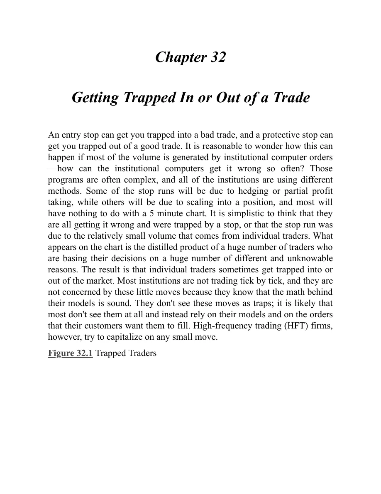

## 第 32 章：被困进场或出场

<!-- Source PDF pages 618–620 -->

<!-- PDF page 618 -->

第 32 章
被困进场或出场
入场止损可以把你困进坏交易，保护性止损可以把你困出好交易。人们可能会疑惑：若大部分成交量由机构计算机订单产生，这怎么会发生——机构计算机怎么会如此频繁地出错？那些程序往往很复杂，所有机构使用不同的方法。有些止损扫盘源于对冲或部分止盈，另一些源于分批加仓，大多数与 5 分钟图无关。认为它们都错了、都被止损困住，或认为止损扫盘源于个人交易者相对较小的成交量，是过于简化的。图表上呈现的是大量交易者基于大量不同且不可知理由做决策的蒸馏产物。结果是个人交易者有时被困进或困出市场。大多数机构并非逐 tick 交易，他们不在意这些小运动，因为他们知道其模型背后的数学是可靠的。他们不把这些运动看作陷阱；很可能大多数根本看不到它们，而是依赖其模型以及客户要他们成交的订单。然而，高频交易（HFT）公司会试图从任何小运动中获利。
图 32.1 被困交易者

<!-- PDF page 619 -->

如图 32.1 所示，今天充满了把交易者困进坏交易、困出好交易的形态，但若你仔细阅读价格行为，本可以通过挂限价单押注相反方向，从每一个陷阱中获利。
K线 2 是跳空高开上的空头趋势K线，可能是当日高点，但鉴于 K线 1 如此强劲，在做空前最好等待更多信息。一旦做空被触发，警觉的交易者会在 K线 2 上方用止损买入，既因为有被困空头，也因为市场在跳空高开日越过强多头趋势K线，当日可能成为开盘即趋势的多头趋势日。
K线 5 是从可能的当日高点下行尖峰中的第三根空头K线，因此即便市场交易到其高点上方，更低高点以及到移动平均线的第二段下行仍很可能。交易者本可以在 K线 5 高点挂限价卖单做空，保护性止损放在当日高点，或放在跟随 K线 4 卖出信号的空头入场K线上方。
下行至 K线 7 的空头通道很陡，因此即便它是回撤到移动平均线的 High 2 且是多头趋势K线，多头明智的做法是等待突破回撤再做多。激进的交易者会在 K线 7 高点用限价单做空剥头皮。
下行至 K线 9 非常强劲，因此买入第一次反弹尝试是坏交易。交易者本可以改在 K线 9 高点挂限价单 <!-- PDF page 620 --> 做空，预期接下来几根内出现新低。
K线 12 是大空头趋势K线，因此是卖盘高潮，它跟随下行至 K线 9 的卖盘高潮。K线 11 的 Low 2 可能是空头趋势中在更大修正开始前的最后旗形。K线 13 是 Low 1 做空形态，但由于市场已不再处于强空头尖峰中，这是坏做空。交易者本可以改在 K线 13 低点挂限价单买入做剥头皮。
K线 14 是弱 Low 2 做空，因为在连续卖盘高潮之后，至少持续 10 根K线的修正很可能。多头本可以买入 K线 14 的低点，预期失败的 Low 2 与向上突破。K线 15 成为向上外包K线，把空头困进 Low 2 做空。由于该K线形成得太快，许多多头没有时间理解发生了什么；他们被困出场，被迫追赶市场上行。
K线 16 是五根多头趋势K线之后的 Low 1 做空形态，因此很可能失败。多头会在该K线低点买入。
K线 17 是 High 1 做多形态，但多头尖峰的K线实体小、有影线。这不是强多头尖峰，因此 High 1 应失败。空头在 K线 17 高点用限价单做空。
K线 18 是 Low 2 做空形态，但市场仍处于强多头通道中，且现在已横向六根K线。这个 Low 2 很可能失败，因此多头在其低点买入做剥头皮。
K线 19 是失败的 Low 2，因此是买入形态，但市场开始横向并出现小K线，这将是第三段上推。空头在其高点做空。
K线 23 是 High 1 买入形态，但这不是强多头尖峰，因此空头在其高点做空。
K线 27 是 High 1 买入形态，但尖峰再次不强。K线很小，影线突出。空头在其高点做空。
K线 28 是震荡区间中部的 High 1 与更高低点，形成于一根前的强空头反转K线之后。空头在其高点做空。
K线 30 是大十字星空头反转K线与 High 2 买入形态，但它处于震荡区间中部，大信号K线迫使交易者在顶部附近买入，这从来不好。十字星是弱信号K线。空头在其高点做空。
