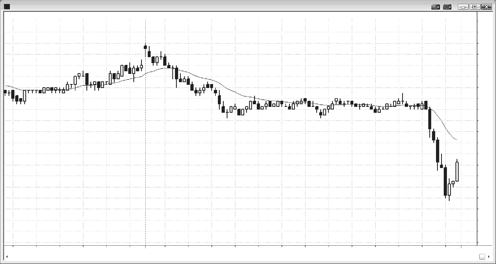

### CHAPTER 1 The Spectrum of Price Action: Extreme Trends to Extreme Trading Ranges

<!-- Source PDF pages 87–90 -->

<!-- PDF page 87 -->

C H A P T E R 1
The Spectrum of
Price Action:
Extreme Trends
to Extreme
Trading Ranges
W
henever anyone looks at a chart, she will see areas where the market is
moving diagonally and other areas where the market is moving sideways
and not covering many points. The market can exhibit a spectrum of price
behavior from an extreme trend where almost every tick is higher or lower than
the last to an extreme trading range where every one- or two-tick up move is followed by a one- or two-tick down move and vice versa. Only rarely will the market
exist in either of these extreme states, and when it does, it does so only briefly,
but the market often trends for a protracted time with only small pullbacks and it
often moves up and down in a narrow range for hours. Trends create a sense of certainty and urgency, and trading ranges leave traders feeling confused about where
the market will go next. All trends contain smaller trading ranges, and all trading
ranges contain smaller trends. Also, most trends are just parts of trading ranges
on higher time frame (HTF) charts, and most trading ranges are parts of trends on
HTF charts. Even the stock market crashes of 1987 and 2009 were just pullbacks
to the monthly bull trend line. The following chapters are largely arranged along
the spectrum from the strongest trends to the tightest trading ranges, and then deal
with pullbacks, which are transitions from trends to trading ranges, and breakouts,
which are transitions from trading ranges to trends.
An important point to remember is that the market constantly exhibits inertia
and tends to continue to do what is has just been doing. If it is in a trend, most
attempts to reverse it will fail. If it is in a trading range, most attempts to break out
into a trend will fail.

<!-- PDF page 88 -->

PRICE ACTION
Figure 1.1

FIGURE 1.1
Extreme Trading Range and Trends
Figure 1.1 has two extreme trends and one extreme trading range. This day began
with a strong bear trend down to bar 1, then entered an unusually tight trading
range until it broke out to the upside by one tick at bar 2, and then reversed to a
downside breakout into an exceptionally strong trend down to bar 3.
Two-legged moves are common, but unfortunately the traditional nomenclature is confusing. When one occurs as a pullback in a trend, it is often called an
ABC move. When the two legs are the first two legs of a trend, Elliott Wave technicians instead refer to the legs as waves 1 and 3, with the pullback between them as
wave 2. Some traders who are looking for a measured move will look for a reversal back up after the second leg reaches about the same size as the first leg. These
technicians often call the pattern an AB = CD move. The first leg down begins with
point A and ends with point B (bar 1 in Figure 1.1, which is also A in the ABC
move), and the second leg begins with point C (bar 2 in Figure 1.1, which is also B
in the ABC move) and ends with point D (bar 3 in Figure 1.1, which is also C in the
ABC move).
Some corrections go for a third or even a fourth leg, so I prefer a different
labeling system to account for this and discuss it later in the books. In its simplest
form, it counts the legs of a pullback. For example, if there is a down leg in a bull
trend or in a trading range and a bar then goes above the high of the prior bar, this

<!-- PDF page 89 -->

Figure 1.1
THE SPECTRUM OF PRICE ACTION
breakout is a high 1. If the market then has a second leg down and then a bar goes
above the high of a prior bar, the breakout bar is a high 2. A third occurrence is
a high 3, and a fourth is a high 4. In a bear leg or in a trading range, if the market
reverses back down after one leg, the entry is a low 1. If it reverses back down after
two legs up, the entry is a low 2 entry and the bar before it is a low 2 setup or signal.
Since measured moves are an important part of trading and the AB = CD terminology is inconsistent with the more commonly used ABC labeling, the AB = CD
terminology should not be used. Also, I prefer to count legs and therefore prefer
numbers, so I will refer to each move as a leg, such as leg 1 or the first push, and
then leg 2, and so forth. After the chapter on bar counting in the second book, I will
also use the high/low 1, 2, 3, 4 labeling because it is useful for traders.
Deeper Discussion of This Chart
The day broke out above yesterday’s high on the open and the breakout failed, leading to a “trend from the open” bear trend day. This was also a trend resumption bear
trend day. Whenever there is a strong trend on the open and then a tight trading range
for several hours, the chances for a trend resumption day are good. There is often a
false breakout between approximately 11:00 a.m. and noon PST, trapping traders into
the wrong direction, and that failed breakout is a great setup for a swing trade into
the close.

<!-- PDF page 90: no extractable text (likely figure-only) -->

