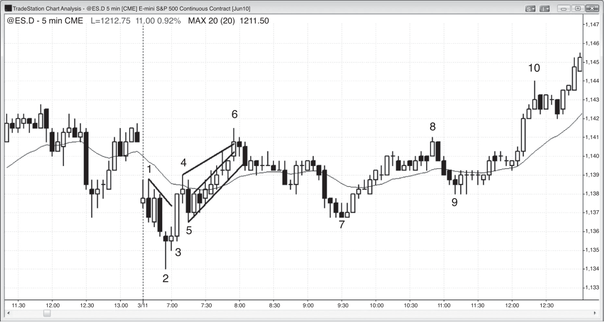

### CHAPTER 3 Breakouts, Trading Ranges, Tests, and Reversals

<!-- Source PDF pages 109–114 -->

<!-- PDF page 109 -->

C H A P T E R 3
Breakouts,
Trading Ranges,
Tests, and
Reversals
J
ust like a bar can be a trend bar or a trading range bar, any segment of a chart
can be classified as trending where either the bulls or the bears are dominant,
or two-sided where both the bulls and the bears alternately assume relative
control. When the market breaks out into a trend, there is usually a trend bar, which
can be small or large, followed by many bars that are trending as the market spikes
away from the trading range. One of the most important skills that a trader can develop is the ability to reliably distinguish between a successful and a failed breakout
(a reversal). Will the breakout lead to a swing in the direction of the breakout or
in the opposite direction? This is discussed in detail in the second book. In thinly
traded markets, the breakout can appear as a gap rather than a trend bar, and that
is why a trend bar should be thought of as a type of gap (discussed in detail in book
2). At some point, the market begins to have pullbacks and then the trend slows into
a shallower slope and becomes more of a channel where a trend line and a trend
channel line can be drawn. As the trend continues, the lines should be redrawn to
contain the developing price action. Usually the slope becomes shallower and the
channel becomes wider.
Some form of this spike and channel behavior happens to some extent every
day in all markets. The start of the channel usually becomes the start of an incipient
trading range. For example, if there is a spike up (an upside breakout) that lasts
several bars, there will then be a pullback. Once the pullback ends and the trend
resumes up, it usually does so in a channel rather than a nearly vertical spike, and
there is usually more overlap of the bars, more small pullbacks, more bars with
tails, and some bear trend bars. The bottom of the channel phase of the trend will
usually be tested within a day or two. Once that pullback begins and the market

<!-- PDF page 110 -->

PRICE ACTION
is moving down toward the start of the channel, traders will suspect that a trading
range is forming, and they are right. Price action traders will anticipate that trading
range as soon as the spike ends and the channel begins, and a few bears will begin
scaling into shorts on that first pullback after the spike. Since they are confident
that the low of the channel will soon be tested, they will scale in shorts on other
pullbacks and above the highs of prior bars as the market continues up. Later in the
channel, more bears will scale in above bars. Once the market turns down into a
larger pullback that tests the bottom of the channel, they will exit all of their shorts
with profits on later entries and at breakeven on their first. Since many traders will
cover their shorts around the bottom of the channel, their buying along with bulls
returning to buy where they bought earlier (at the bottom of that first pullback after
the spike up) will lift the market once again, and the trading range will broaden.
After this bounce, the effect of the spike and channel has played out and traders
will look for other patterns.
Because channels usually get retraced eventually, it is helpful to look at all bull
channels as bear flags and all bear channels as bull flags. However, if the trend is
strong, the breakout may go sideways and be followed by more trending. Rarely,
the breakout can be in the trend direction and the trend can accelerate sharply.
For example, if there is a bull spike and then a bull channel, rarely the market will
break out above the trend channel line and the bull trend will accelerate. Usually
the breakout will fail within five bars or so and the market will then reverse.
Although most trading ranges are flags on higher time frame charts, and most
of them break out in the direction of the trend, almost all reversals begin as trading
ranges, which will be discussed in the section on reversals in the third book.
A test means that the market is returning to an area of support or resistance,
like a trend line, a trend channel line, a measured move target, a prior swing high
or low, a bull entry bar low or a bear entry bar high, a bull signal bar high or a bear
signal bar low, or yesterday’s high, low, close, or open. Traders often place trades
based on the behavior at the test. For example, if the market had a high, a pullback,
and then a rally back up to that high, the bulls want to see a strong breakout. If
one appears to be developing, they might buy at one tick above the old high or they
might wait for a pullback from the breakout and then buy at one tick above the high
of the prior bar, expecting a resumption of the breakout. The bears are looking for a
reversal. If the rally up to the old high lacks momentum and then the market forms
a reversal bar in the area of the old high, they will short below the reversal bar.
They don’t care if the test forms a higher high, a double top, or a lower high. They
just want to see the market reject the prices in this area to validate their opinion
that the market is too expensive up here.
A reversal is a change from one type of behavior to an opposite type of behavior, but the term is most often used to describe a change from a bull trend to a
bear trend or from a bear trend to a bull trend. However, trading range behavior is

<!-- PDF page 111 -->

BREAKOUTS, TRADING RANGES, TESTS, AND REVERSALS
arguably opposite to trending behavior, and when a trend is followed by a trading
range, the market’s behavior has reversed. When a trading range becomes a trend,
the market’s behavior has reversed as well, but that change is called a breakout.
No one calls it a reversal, although it is technically reversing two-sided trading into
one-sided trading.
Even though most traders think that a reversal is from a bull trend to a bear
trend or a bear trend to a bull trend, most reversals fail to lead to an opposite trend
and instead become a temporary transition from a bull or bear trend into a trading
range. Markets have inertia and are very resistant to change. When there is a strong
bull trend, it will resist change; almost every attempt at a reversal will end up as a
bull flag, and the trend will then resume. Each successive bull flag will tend to get
larger as the bulls become more concerned at new highs with taking profits and less
interested in buying heavily, and the bears will start becoming increasingly aggressive. At some point, the bears will overwhelm the bulls, the trading range will break
to the downside, and a bear trend will begin. However, this usually happens after
several earlier reversal attempts resulted in increasingly larger bull flags where the
bulls overpowered the bears and a bear trend failed to develop. Even though most
reversals simply lead to trading ranges, the move is usually large enough to result
in a swing trade, which is a large-enough move to create a substantial profit. Even
if an opposite trend eventually unfolds, traders will take at least partial profits at
the first reasonable targets, just in case the reversal only leads to a trading range,
which is usually the case.
Reversals have different appearances, depending on the chart that you are using. For example, if you see a large bear reversal bar on a monthly chart, it might be
a two-bar reversal on a weekly chart, and it might be a three-bar bull spike, which
is a buy climax, and then a 10-day trading range, and finally a two-bar bear breakout on the daily chart. It does not matter what chart you are using as long as you
recognize the pattern as a reversal, and all of these patterns are reversal patterns.

<!-- PDF page 112 -->

PRICE ACTION
Figure 3.1

FIGURE 3.1
Breakouts, Trading Ranges, and Tests
The 5 minute Emini chart in Figure 3.1 shows examples of breakouts, trading
ranges, and tests. Every swing is a test of something, even though most traders
don’t see what is being tested. Many of the tests are related to price action on other
time frames and other types of charts, and include tests of different types of moving
averages, bands, Fibonacci levels, pivots, and countless other things.
The market tested yesterday’s low, but the breakout failed and formed a lower
low as it reversed up sharply in a spike up to bar 4. Every breakout, whether it is
successful or fails, is eventually followed by a trading range, as it was here. A failed
breakout to a new low indicates that the bulls and the bears agree that the price is
too low. The bears will take profits and not sell very much at these low prices and
the bulls will continue to buy aggressively until both believe that the market has
reached a new area of equilibrium, which is a trading range.
Bar 1 was the signal bar for the sell-off on the open, and the market should not
have been able to go above its high if the bears were still in control.
Bar 4 was a higher high test of the bar 1 high, and the upward momentum was
so strong that the market would likely test up at least one more time before the
bulls would give up. The double top (double tops and bottoms are rarely exact)
resulted in only a one-bar pullback before the breakout above bar 1 succeeded.
Bar 5 tested the high of the bar 2 signal bar and formed a higher low.

<!-- PDF page 113 -->

Figure 3.1
BREAKOUTS, TRADING RANGES, TESTS, AND REVERSALS
Every sharp move and every strong reversal should be thought of as a breakout
of something. It does not matter if you view this sharp move up from bar 2 as a
breakout above the small bear trend line drawn from bar 1 or as a breakout above
the bar 2 reversal bar. What does matter is that during this spike, the market agreed
that the price was too low and it was trending quickly to find an area where both
the bulls and the bears were comfortable placing trades. This resulted in a channel
up from bars 5 to 6, and within the channel, there were many bars that overlapped
with the bar before or after. This overlap of bars represents a hesitation by the bulls
where the market was now able to trade down for a few ticks and a few minutes
before moving higher. Some bulls were taking profits as the market was working
higher, and bears were beginning to short. Many were adding to their shorts (scaling in) as the market went up, just as many bulls were taking more and more off
(scaling out). This channel is a weaker bull move, and channels are usually the start
of a trading range. As you can see, the market retraced back to around the start of
the channel by bar 7.
Bar 7 was a higher low test of the bar 5 swing low and a second test of yesterday’s low, and the market reversed up in a double bottom.
Bar 8 was a lower high test of the bar 6 high and of yesterday’s close, and
formed a double top instead of a breakout. It also tested the high of the bear inside
bar that followed bar 6, and that bar was the signal bar for the sell-off that followed.
The reversal down to bar 9 tested the moving average and became simply a
pullback from the breakout attempt; it was followed by a successful breakout to a
new high of the day. Bar 9 also tested the long entry above the bull bar that followed
bar 7, and it missed the breakeven stop by a tick. When the bulls are able to prevent
their breakeven stop from being hit, they are strong and a new high usually follows.
Deeper Discussion of This Chart
When a chart discussion runs for multiple pages, remember that you can go to the John
Wiley & Sons website at www.wiley.com/go/tradingtrends and either view the chart or
print it out, allowing you to read the description in the book without having to repeatedly
flip pages back to see the chart.
In Figure 3.1, bar 3 was a large bull trend bar that was the start of a bull trend, and
it should be thought of as a breakout and a breakout gap.
The market broke below the bull channel into yesterday’s close, and a bull channel
is a bear flag. The breakout had some follow-through, but there were bull bodies and
overlapping bars, indicating that the bulls were active. The market then broke out below
yesterday’s swing low, and the breakout failed and became the low of the day. If you
did not buy the bar 2 reversal up from yesterday’s low, the bar 3 strong bull trend bar
showed you that the always-in position was up and you should look to buy either at
the market or above the bar 5 pullback. Always in is discussed in detail in the third

<!-- PDF page 114 -->

PRICE ACTION
Figure 3.1
book, but it basically means that if you have to be in the market at all times, either
long or short, the always-in position is whatever your current position is. This is a very
important concept, and most traders should trade only in the always-in direction. The bar
7 double bottom pullback was another chance to get long, hoping for a second leg up into
the close.
This type of pattern is a spike and channel bull trend. It is useful here because
it shows a market transitioning from one-sided trading (a strong trend) to two-sided
trading (a trading range). It does not matter if you view bar 3 alone as the spike or
the entire sharp move from bars 2 to 4 as the spike. The market pulled back to bar 5
and then rallied in a less urgent fashion. The bars mostly overlapped one another, and
a trader could draw a channel that contained prices fairly well. You could also draw a
trend channel line across the highs and highlight a wedge type of channel, which is also
discussed later. Some traders would have shorted below the low of bar 4 and then scaled
in more shorts at other pullbacks as the market moved up. Other traders would wait for
the wedge top, where they would take profits on longs or initiate shorts. As soon as
the spike is followed by the pullback to bar 5 and then channel type behavior begins to
form, traders will see this bull channel as a possible bear flag and expect that the low of
the channel will get tested. In small patterns like this one, the test usually is later in the
same day; but in larger patterns, the test might come a day or two later.
The market had the expected two-legged correction from the wedge top to the bottom of the channel, where the bears will take profit on all of their entries. Their earlier
entries will be only approximately breakeven trades, but their later entries will be profitable. Also, bulls will again look to buy around the low of bar 5 where they bought earlier
at the end of the first pullback, and that becomes the start of the channel. The buying
by the bulls and by the short-covering bears usually results in a bounce. That bounce
can be a rally from a double bottom (bars 5 and 7) bull flag, or it could be followed by a
protracted trading range or even a bear trend.
Also notice that the bar 2 low was the third push down and therefore a wedge
reversal.
Bar 6 was a double top bear flag (the first top was the final bar of yesterday) and
bars 5 and 7 created a double bottom bull flag. This was followed by the bar 9 double
bottom pullback. You could describe the price action between bars 5 and 9 as a triangle
that could break out in either direction, but that would overlook the bullishness that the
market was showing you.
Bar 7 was a wedge bull flag because it was the third push down from the bar 6 high.
Bar 8 was a final flag reversal after the six-bar bull flag that preceded it.
