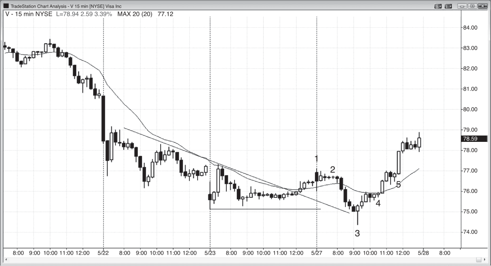

### CHAPTER 4 Bar Basics: Signal Bars, Entry Bars, Setups, and Candle Patterns

<!-- Source PDF pages 115–120 -->

<!-- PDF page 115 -->

C H A P T E R 4
Bar Basics:
Signal Bars,
Entry Bars,
Setups, and
Candle Patterns
T
raders look for setups all day long. A setup is a chart pattern composed of one
or more bars that leads a trader to believe that an order can be placed that has
a good chance of resulting in a profitable trade. In practice, every bar on the
chart is a setup because the next bar always can be the start of a strong move in
either direction. If the trade is in the direction of the recent or prevailing trend, it
is with trend, and if it is in the opposite direction, it is countertrend. For example,
if the recent trend is up and you buy, the setup was a with-trend setup. If instead
you shorted, the setup that you used as the basis for your trade was a countertrend
setup and your short was a countertrend trade.
A signal bar is always labeled in hindsight, after the bar has closed and after
a trade is entered. As soon as your entry order is filled, the prior bar becomes a
signal bar instead of just a setup bar and the current bar is the entry bar. The bar
after entry is the follow-through bar, and it is always better when there is a second
bar in the direction of your entry. Sometimes the market will go sideways for a bar
or two before there is a follow-through bar, and this is still good because as long as
there is follow-through, the odds of making more from your trade increase.
There are both bulls with buy stops above the high of the prior bar and bears
with sell stops below the low of that same bar. There are also bulls with buy limit
orders at and below the low of the prior bar and bears with sell limit orders at and
above the high of the prior bar. That means that every bar is a signal bar for both
long and short trades, with both bulls and bears entering on the breakout of both
the top and the bottom. Also, every bar can be thought of as a one-bar trading range.
If the next bar goes above or below it, breakout traders will expect this breakout to
have enough follow-through for them to make at least a scalper’s profit. However,

<!-- PDF page 116 -->

PRICE ACTION
equally smart traders will expect the breakout to fail and will trade in the opposite
direction. If the market goes one tick above the high of the prior bar, there will
be bulls who will buy on a stop order, and the prior bar is the signal bar for their
long. There will also be bears who will short on a limit order at the high of the prior
bar, expecting the breakout to fail. They hope that the market will trade below
the low of their entry bar on the bar after they short, and their entry bar will then
become a signal bar for a short trade. One of the most important things to realize
about trading is that no matter how convinced you are that you are right, there is
someone just as smart and just as convinced that the opposite will happen.
The single most important skill that a trader can develop is the ability to determine the times when there will be more buyers or sellers above or below the prior
bar. Signal bars in the right context are times when there is such an imbalance. For
example, when there is a bull signal bar in a pullback in a bull trend, there are probably more buyers than sellers above the bar, so looking to buy above the bar makes
more sense than looking to short there. Whenever a trader believes that there is
an imbalance, he has an advantage, but it is always very small because there are
always smart traders who believe the opposite (someone has to take the opposite
side of your trade, or else your order will not get filled). As traders, our edge is our
ability to read price action, and the better we become, the greater our edge, and the
greater the probability that we can make a living from trading. Here are common
signal bars and setups (they are discussed further in the next couple of sections):
Continuation signal in the spike phase of a strong trend: A continuation
signal can be buying at the top of a bull trend or selling at the bottom of a
bear trend.
r Strong bull trend bar in a bull spike.
r Strong bear trend bar in a bear spike.
Reversal signals: A reversal pattern can be a trend reversal or a pullback that
is ending and reversing back into the direction of the trend.
r Reversal bar.
r Two-bar reversal.
r Three-bar reversal.
r Small bar:
r An inside bar.
r An ii (or iii) pattern.
r A small bar near the high or low of a big bar or trading range.
r An ioi pattern.
r Outside bar and an oo pattern (an outside bar followed by a larger outside bar).
r Double top and bottom.
r Failed reversal attempt, including a reversal bar failure.

<!-- PDF page 117 -->

BAR BASICS: SIGNAL BARS, ENTRY BARS, SETUPS, AND CANDLE PATTERNS
r Failed continuation attempt, like buying below a low 1 signal bar in a
bear trend that appears to be bottoming or shorting above a high 1 signal
bar in a bull trend that appears to be topping.
r Shaved bar: a bar with no tail at either the top or the bottom.
r Trend bar: A bull trend bar can be a sell setup in a rally in a strong bear
trend and near the top of a trading range, and a bear trend bar can be a
buy setup in a pullback in a strong bull trend and near the bottom of a
trading range.
r Any pause or pullback bar in the spike phase of a strong trend.
r All bars in a channel: Buy at or below prior bar, sell at or above prior bar.
r Any bar that forms a higher low in a bull trend and a lower high in a bear
trend.
A beginning trader should enter only when the signal bar is also a trend bar in
the direction of the trade, and should trade only in the direction of the trend. For
example, if they are shorting, traders should restrict themselves to signal bars that
are bear trend bars in bear trends, because then the market has already demonstrated selling pressure and the odds of follow-through are higher than if the signal
bar had a close above its open. Similarly, when beginners are looking to buy, they
should buy only when the signal bar has a close above its open and when there is a
bull trend underway.
In general, traders should require signal bars to be stronger for trend reversal entries than for trend pullback and trading range trades. This is because most
countertrend trades fail and you need to do everything possible to improve your
chances of success. The very strongest trends usually have terrible-looking signal
bars, but the trades are still excellent. If a setup is too obvious, the market will
quickly correct the discrepancy. The move will be fast and small, as is the case with
most scalps. Swing trade setups, in contrast, usually have a probability of success
of only 50 percent or less, which is discussed more in the second book. They often
look like they are just part of a trading range that will continue for many more bars.
Strong trends do everything possible to keep traders out, forcing them to chase the
trend as it progresses relentlessly. Second-entry reversal setups at the tops of trading ranges often have signal bars with bull bodies, and buy setups at the bottom
often have signal bars with bear bodies. However, since most attempts to reverse a
trend fail, traders should consider a reversal trade only if everything looks perfect,
including the signal bar, to reduce the chances of failure. Beginners should avoid
all but the absolute strongest countertrend trades, and any trader should consider
taking one only if the overall chart pattern is supportive of a reversal. At a minimum, traders should wait for a pullback from a strong break of the trend line and
take the trade only if there is a strong reversal bar, because most successful reversal trades begin with a strong signal bar. Otherwise, the odds of success are too

<!-- PDF page 118 -->

PRICE ACTION
small and traders will lose over time. Incidentally, the pullback from the trend line
breakout can reach a new extreme, like a higher high at the end of a bull trend
or a lower low at the end of a bear trend. Because trading countertrend is such a
low-probability approach, the best traders will take those trades only when there is
substantial evidence that the trend is about to reverse.
Trends tend to continue much longer than most traders believe is possible,
and this results in most trades in the opposite direction failing and ultimately just
setting up another pullback in the trend and another with-trend entry.
Likewise, if traders are looking to trade with trend, they are eager to enter and
will not wait for a strong signal bar to develop. For example, if traders are looking
to buy a small pullback to the moving average in a strong trend, and the pullback
also is testing a prior swing low, a trend line, and maybe a Fibonacci retracement,
the trader will buy even if the signal bar is a bear trend bar. The result is that most
successful signal bars in strong trends look bad. As a general rule, the stronger the
trend, the less important the appearance of the signal bar is, and the more countertrend that your entry is, the more important it is to see a strong signal bar. In
strong trends, most signal bars look bad and very few are trend bars in the direction of the trend.
Almost every bar is a potential signal bar, but the majority never lead to an
entry and therefore do not become signal bars. As a day trader, you will place many
orders that never get filled. It is usually best to enter on a stop at one tick above
or below the prior bar and if the stop is not hit, to cancel the order and look for a
new location for an order. For stocks, it is often better to place the entry stop at a
couple of ticks beyond the potential signal bar because one-tick traps are common,
where the market breaks out by only one tick and then reverses, trapping all of the
traders who just entered on stops.
If the entry stop order is hit, you based the trade in part on the prior bar so that
bar is called the signal bar (it gave you a signal that you needed to place an order).
Often a bar can be a setup bar in both directions, and you will place entry stops
beyond both extremes and will enter in the direction of either bar breakout.
Much has been written about candle patterns, and it feels as if their unusual
Japanese names must mean that they have some mystical power and that they are
derived from special ancient wisdom. This is just what novice traders are looking
for—the power of the gods telling them what to do, instead of relying on their own
hard work. For a trader, the single most important issue is determining whether the
market is trending or in a trading range. When it comes to analyzing an individual
bar, the issue is also whether it is trending. If either the bulls or the bears are in
control, the candle has a body and is a trend bar. If the bulls and bears are in a state
of equilibrium and the body is small or nonexistent, it is a doji. Many candle traders
use the term wick to refer to the lines that usually extend above and below the
bodies, presumably to be consistent with the concept of candles. Others call them

<!-- PDF page 119 -->

BAR BASICS: SIGNAL BARS, ENTRY BARS, SETUPS, AND CANDLE PATTERNS
shadows. Since all of us are constantly looking for reversal bars and reversal bars
look more like tadpoles or small fish, a tail is a more accurate descriptive term.
You should only think of bars in terms of price action and not a collection of
meaningless and misleading candle names (misleading to the extent that they convey imagery of a mystical power). Each bar or candle is important only in relation
to price action, and the vast majority of candle patterns are not helpful most of the
time because they occur in price action where they have no high-probability predictive value. Therefore, candle pattern names will complicate your trading by giving
you too much to think about and they take your mind off the trend.
It is common to see a signal bar beginning to form in an area that is a good
location for a trade. Maybe three minutes into the 5 minute bar, it has a great shape,
like a bull reversal bar just after breaking out of a final bear flag. Then, with five to
10 seconds before the bar closes, it suddenly increases in size by four or more ticks.
When the bar closes, it still has the shape of a good bull reversal bar, but now its
high is near the high of the bear flag. You have seconds to decide if you still want to
buy above its high with the realization that you would be buying at the top of a bear
flag. Until you are consistently profitable and able to read quickly, it is best to not
take the trade and to wait for a second entry instead. However, if you are confident
that there are lots of trapped bears, then you can take the trade, but the risk is
significant whenever there are several large range bars in a row with lots of overlap.
All reversals involve climaxes, but the terminology is often used differently by
different traders. Remember, every trend bar is a climax or part of a climax and the
climax ends with the first pause bar. For example, if there are three consecutive
bull trend bars and then the next bar is a small bull trend bar with a prominent tail
on the top, or an inside bar, a doji, or a bear trend bar, then the climax ended with
the three bull trend bars.

<!-- PDF page 120 -->

PRICE ACTION
Figure 4.1

FIGURE 4.1
A Typical Buy Signal Bar
The 15 minute chart of Visa (V) shown in Figure 4.1 shows a break above the bear
trend line and then a two-legged sell-off to a lower low below yesterday’s low. The
point of this chart is to show what signal and entry bars are, and the particular setup
patterns will be discussed later in the book. The first leg was completed by the iii
ending at bar 2. Bar 3 was a strong bull reversal bar that reversed both yesterday’s
low and a test of the bear trend line, setting up a possible long. A buy stop at one tick
above this bar would have been filled and then bar 3 became a signal bar (instead of
just a setup bar) and the bar in which the trade was entered became the entry bar.
There was a decent bull trend bar two bars after entry, and it is a follow-through
bar. Since this was a countertrend trade, traders needed a strong bull reversal bar
like bar 3 before buying; otherwise the chance of a successful trade would have
been significantly less.
Bar 4 was an entry bar off of an ii setup (discussed later) for a second leg up.
Bar 5 was an entry bar off of an inside bar breakout pullback (the market barely
broke above the bar 2 iii). The bodies of the two pause bars were each inside bodies,
so this setup effectively was the same as an ii pattern.
