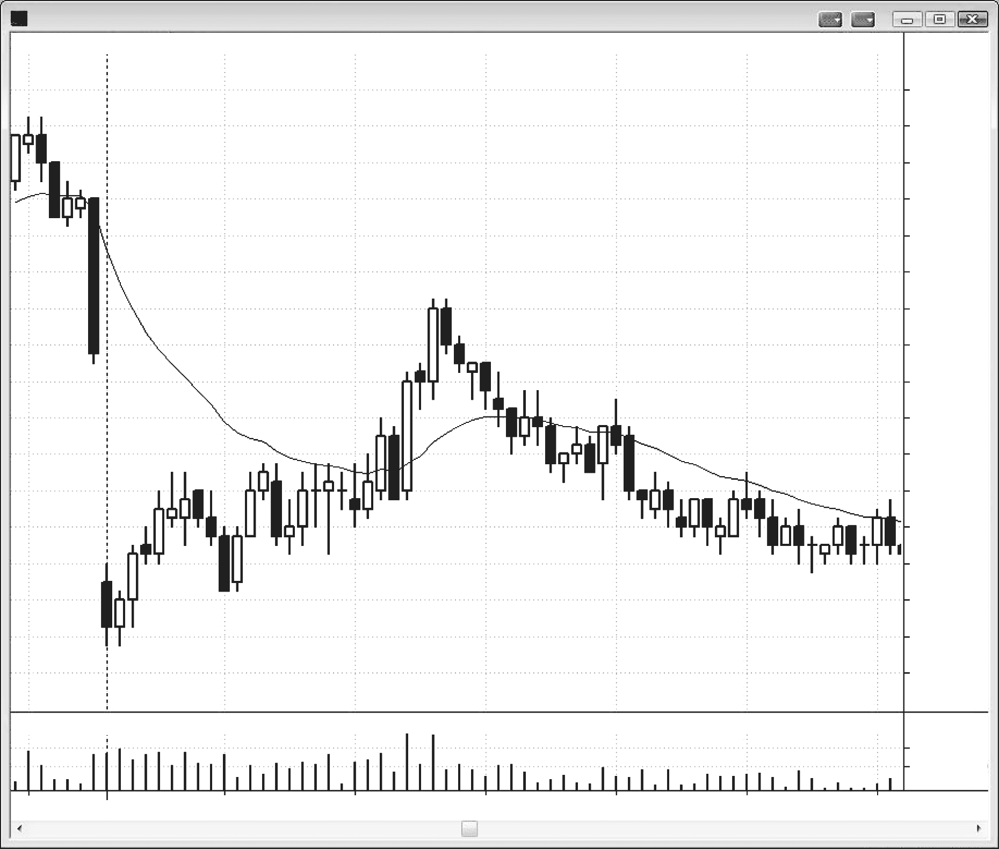
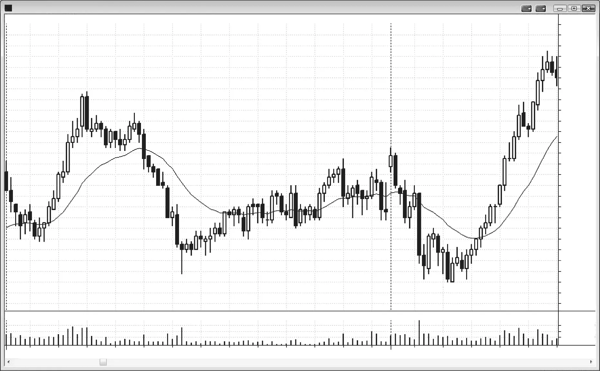
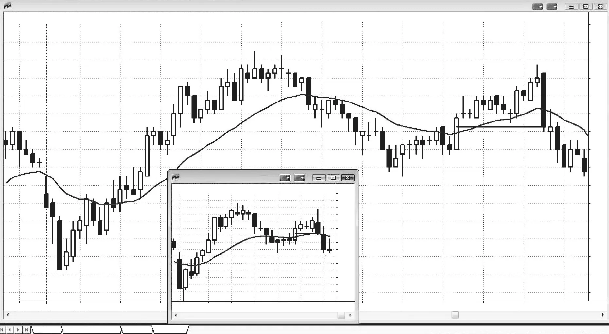

### CHAPTER 5 Signal Bars: Reversal Bars

<!-- Source PDF pages 121–132 -->

<!-- PDF page 121 -->

C H A P T E R 5
Signal Bars:
Reversal Bars
A
reversal bar is one of the most reliable signal bars, and it is simply a bar
that reverses some aspect of the direction of the prior bar or bars. If you
look at smaller time frame charts, you will see that every bull reversal bar
is made up of a bear trend bar and then a bull trend bar, but they don’t have to be
consecutive. The market had a sell climax followed by a bull breakout (remember,
all trend bars are simultaneously spikes, breakouts, and climaxes, but the context
determines which property is dominant at the moment). The opposite is true of a
bear reversal bar, where there is a smaller time frame bull trend bar, indicating that
a buy climax took place, followed by a bear trend bar, indicating that the market
broke out to the downside.
Most traders want a reversal bar to have a body in the opposite direction of
the old trend, but that is not necessary and there are many other components of a
reversal that should to be considered.
The best-known signal bar is the reversal bar and the minimum that a bull
reversal bar should have is either a close above its open (a bull body) or a
close above its midpoint. The best bull reversal bars have more than one of the
following:
r An open near or below the close of the prior bar and a close above the open
and above the prior bar’s close.
r A lower tail that is about one-third to one-half the height of the bar and a small
or nonexistent upper tail.
r Not much overlap with the prior bar or bars.

<!-- PDF page 122 -->

PRICE ACTION
r The bar after the signal bar is not a doji inside bar and instead is a strong entry
bar (a bull trend bar with a relatively large body and small tails).
r A close that reverses (closes above) the closes and highs of more than one bar.
The minimum that a bear reversal bar should have is either a close below its
open (a bear body) or a close below its midpoint. The best bear reversal bars have:
r An open near or above the close of the prior bar and a close well below the
prior bar’s close.
r An upper tail that is about one-third to one-half the height of the bar and a small
or nonexistent lower tail.
r Not much overlap with the prior bar or bars.
r The bar after the signal bar is not a doji inside bar and instead is a strong entry
bar (a bear trend bar with a relatively large body and small tails).
r A close that reverses (closes below) the closes and lows of more than one
bar.
This final property is true of any strong trend bar, such as a strong breakout
bar, signal bar, or entry bar. For example, at the bottom of a bear leg, if there is a
bull reversal bar and its close is above the close of the past eight bars and its high
is above the high of the past five bars, this is usually stronger, depending on the
context, than a reversal bar that has a close above only the close of the prior bar
and is not above the high of any of the recent bars.
The market can trend up or down after any bar, and therefore every bar is a
setup bar for both a long entry and a short entry. A setup bar becomes a signal bar
only if a trade is entered on the next bar, which becomes the entry bar. A setup
bar in and of itself is not a reason to enter a trade. It has to be viewed in relation
to the bars before it and it can lead to a trade only if it is part of a continuation
or reversal pattern. One of the most difficult things for new traders is that a signal
bar often seems to suddenly appear out of nowhere in the final seconds before the
bar closes and at times and locations that just don’t make sense until several bars
later. A key to trading is to be open to the idea that the market can start a swing
up or down on the next bar. Just like the best chess players think several moves
in advance, the best traders are constantly thinking about reasons why the market
might go up or down on the next bar and next several bars. This puts them in a
position to anticipate signal bars so that they are ready to place orders if a good
setup quickly develops.
Since it is always wisest to be trading with the trend, a trade is most likely
to succeed if the signal bar is a strong trend bar in the direction of the trade. Remember, you are looking for times when there will likely be an imbalance between
buyers and sellers above or below the prior bar. A reversal bar in the right context

<!-- PDF page 123 -->

SIGNAL BARS: REVERSAL BARS
is often such a time, giving traders an edge. Even though you are entering after only
a one-bar trend, you are expecting more trending in your direction. Waiting to enter
on a stop beyond the signal bar requires the market to be going even more in your
direction, increasing your odds of success. However, a trend bar that is in the opposite direction can also be a reasonable signal bar, depending on other price action
on the chart. In general, signal bars that are doji bars or trend bars in the opposite
direction of your trade have a greater chance of failure since the side of the market
that you need to be in control has not yet asserted itself. However, in a strong bull
trend, you can pretty much get long for any reason, including buying above the high
of a strong bear trend bar, especially if you use a wide enough stop. The stronger
the trend, the less important it is to have a strong signal bar for a with-trend trade
and the more important it is to have a strong signal bar for a countertrend trade.
It is always better to get into a market after the correct side (bulls or bears) has
taken control of at least the signal bar. That trend bar will give traders much more
confidence to enter, use looser stops, and trade more volume, all of which increase
the chances that their scalper’s target will be reached.
Reversal bars can have characteristics that indicate strength. The most familiar
bull reversal bar has a bull body (it closes well above its open) and a moderate tail
at the bottom. This indicates that the market traded down and then rallied into the
close of the bar, showing that the bulls won the bar and were aggressive right up to
the final tick.
When considering a countertrend trade in a strong trend, you must wait for
a trend line to be broken and then a strong reversal bar to form on the test of
the extreme, or else the chances of a profitable trade are too small. Also, do not
enter on a 1 minute reversal bar since the majority of them fail and become withtrend setups. The loss might be small, but if you lose four ticks on five trades, you
will never get back to being profitable on the day (you will bleed to death from a
thousand paper cuts).
Why is that test of the extreme important? For example, at the end of a bear
market, buyers took control and the market rallied. When the market comes back
down to the area of that final low, it is testing to see whether the buyers will again
aggressively come in around that price or they will be overwhelmed by sellers who
are again trying to push prices below that earlier low. If the sellers fail on this
second attempt to drive the market down, it will likely go up, at least for a while.
Whenever the market tries to do something twice and fails, it usually then tries
the opposite. This is why double tops and bottoms work and why traders will not
develop a deep conviction in a reversal until the old trend extreme has been tested.
If a reversal bar largely overlaps one or more of the prior bars or if the tail
extends beyond the prior bars by only a couple of ticks, it might just be part of a
trading range. If so, there is nothing to reverse, because the market is sideways and
not trending. In this case, it should not be used as a signal bar and it even might turn

<!-- PDF page 124 -->

PRICE ACTION
into a setup in the opposite direction if enough traders are trapped. Even if the bar
has the shape of a perfect bull reversal bar, since no bears were trapped there will
likely be no follow-through buying, and new longs will spend several bars hoping
that the market will come back to their entry price so they can get out at breakeven.
This is pent-up selling pressure.
When the signal bar is large and it has a lot of overlap with the prior two or three
bars, it is part of a trading range. This is a common situation in bull and bear flags,
and it traps overly eager with-trend traders. For example, consider a market that
has been in a trading range day until it reverses up strongly to just above the moving
average. Then it goes sideways for three bars and forms a strong bull reversal bar.
If the entry would be maybe a tick or so below the top of the bull flag, it is tempting
to buy; but about 60 percent of the time, this is a bull trap and the market will turn
down soon after entry.
How much overlap is acceptable? As a guideline, whenever the midpoint of a
bull reversal bar is above the low of the prior bar in a possible bull reversal (or if the
midpoint of a bear reversal bar is below the high of the prior bar in a possible bear
reversal), the overlap might be excessive and be indicating that a trading range is
developing instead of a tradable reversal. This is far more important when you are
looking to enter countertrend (attempting to pick the reversal of a trend), instead
of with trend at the end of a pullback, when you have to be much less fussy about
perfect setups.
If the body is tiny so that the bar is a doji but the bar is large, it usually should
not be used as a basis for a reversal trade. A large doji is basically a one-bar trading
range, and it is not wise to buy at the top of a trading range in a bear trend or sell
the low of a trading range in a bull trend. It is better to wait for a second signal.
If a bull reversal bar has a large tail at the top or a bear reversal bar has a large
tail at the bottom, the countertrend traders lost conviction going into the close of
the bar and the countertrend trade should be taken only if the body looks reasonably strong and the price action is supportive (like a second entry).
If the reversal bar is much smaller than the prior several bars, especially if it
has a small body, it lacks countertrend strength and is a riskier signal bar. However,
if the bar has a strong body and is in the right context, the risk of the trade is small
(one tick beyond the other side of the small bar).
In a strong trend, it is common to see a reversal bar forming and then seconds
before the bar closes the reversal fails. For example, in a bear trend, you could see
a strong bull reversal bar with a big down tail, a last price (the bar hasn’t closed
yet) well above its open and above the close of the prior bar, and the low of the bar
extending below or overshooting a bear trend channel line, but then in the final few
seconds before the bar closes, the price collapses and the bar closes on its low. Instead of a bull reversal bar off the trend channel line overshoot, the market formed
a strong bear trend bar and all of the traders who entered early in anticipation of

<!-- PDF page 125 -->

SIGNAL BARS: REVERSAL BARS
a strong bull reversal are now trapped and will help drive the market down further
as they are forced to sell at a loss.
A big bull reversal bar with a small body also has to be considered in the context of the prior price action. The large lower tail indicates that the selling was
rejected and the buyers controlled the bar. However, if the bar overlaps the prior
bar or bars excessively, then it might just represent a trading range on a smaller
time frame, and the close at the top of the bar might simply be a close near the
top of the range, destined to be followed by more selling as the 1 minute bulls take
profits. In this situation, you need additional price action before entering a countertrend trade. You don’t want to be buying at the top of a flag in a bear trend or
selling at the bottom of a bull flag.
Computer programs allow traders to use charts based on a wide range of characteristics of price action. Traders use every time frame imaginable as well as
charts where each bar is based on any number of ticks (each individual trade of
any size is one tick) or contracts traded as well as many other things. Because of
this, what appears to be a perfect reversal bar on a 5 minute candle chart might not
look anything like a reversal bar on many other charts. And even more important
is that every reversal on any chart is a perfect reversal bar on some other chart.
If you see a reversal setting up but there is no reversal bar, don’t waste your time
looking around at dozens of charts for one where there is a perfect reversal. Your
goal is to understand what the market is doing, not to find some perfect pattern.
If you see that the market is trying to reverse, even if it is doing so over a dozen
bars, you need to find some way to enter the market, and that has to be your focus.
If you waste time searching other charts for a perfect reversal bar, you are allowing
yourself to be distracted from your goal and you are likely not mentally prepared
at the moment to be trading.
Most reversal bars on the daily chart come from trending trading range days
(discussed in Chapter 22) on the intraday charts, but a few come from climactic
intraday reversals. Whenever traders see a trending trading range day, they should
be aware that it might have a strong reversal later in the day.

<!-- PDF page 126 -->

PRICE ACTION
Figure 5.1

FIGURE 5.1
Reversal Bar in a Trading Range
As shown in Figure 5.1, reversal bar 1 largely overlapped the four prior bars, indicating a two-sided market so there was nothing to reverse. This was not a long
setup bar. Reversal bar 2 was an excellent bear signal bar because it reversed the
breakout of reversal bar 1 (there were trapped longs here off that bull reversal bar
breakout) and it also reversed a breakout above the bear trend line down from the
high of the day. The trapped longs were forced to sell to exit, and this added to
the selling pressure of the shorts. Astute traders knew that there were more sellers
than buyers below the low of bar 2, and shorted there, expecting at least enough
follow-through selling to be able to make a scalper’s profit. When the market is in
a trading range in a downswing, it is forming a bear flag. Smart traders will look to
sell near the high, and they would buy near the low if the setup was strong. As trite
as the saying is, “Buy low, sell high” remains one of the best guiding principles for
traders. When I say buy low, I mean that if you are short, you can buy back your

<!-- PDF page 127 -->

Figure 5.1
SIGNAL BARS: REVERSAL BARS
short for a profit, and if there is a strong buy signal, you can buy to initiate a long
position. Likewise, when the market is toward the top of the range, you sell high.
This selling can be to take your profit if you are long, or if there is a good short
setup, you can sell to initiate a short position.
Deeper Discussion of This Chart
The market broke below yesterday’s low in Figure 5.1, but the breakout failed and reversed up into a trend from the open bull day. The bull trend ended with a strong breakout that failed at 7:48 a.m. PST with a moving average gap bar short setup. The move
down to bar 1 was a tight bear channel, and the first breakout above a tight channel usually reverses within a bar or two. At that point, it might form a lower low or higher low
pullback from the breakout and then the rally will resume, or the breakout will simply
fail and the bear trend will resume, as it did here.

<!-- PDF page 128 -->

PRICE ACTION
Figure 5.2

FIGURE 5.2
Reversal Bar with Big Tail and Small Body
Reversal bars with big tails and small bodies must be evaluated in the context of
the prior price action. As shown in Figure 5.2, reversal bar 1 was a breakout below
a prior major swing low in a very oversold market (it reversed up from a breakout
below the steep trend channel line of the prior eight bars). There had also been
very strong bullish activity earlier in the day, so the bulls might return. Profit takers
would want to cover their shorts and wait for the excess to be worked off with time
and price before they would be eager to sell again.
The next day, reversal bar 2 overlapped about 50 percent of the prior bar and
several of the bars before that, and it did not spike below a prior low. It likely just
represents a trading range on the 1 minute chart, and no trades should be taken
until more price action unfolds.
Although a classic reversal bar is one of the most reliable signal bars, most reversals occur in their absence. There are many other bar patterns that yield reliable
signals. In almost all cases, the signal bar is stronger if it is a trend bar in the direction of your trade. For example, if you are looking to buy a possible reversal at the
bottom of a bear trend, the odds of a successful trade are significantly increased if
the signal bar has a close well above its open and near its high.

<!-- PDF page 129 -->

Figure 5.2
SIGNAL BARS: REVERSAL BARS
Deeper Discussion of This Chart
Today (the most recent day on the chart), shown in Figure 5.2, broke out above
yesterday’s trading range, but the breakout failed and the day became a trend from the
open bear. The second breakout below yesterday’s low also failed and became the low
of the day.
When the market goes sharply up and then down, it usually enters a trading range,
and the bulls and bears then fight for control of the market. The move to the new low
of the day accelerated at the end. There were a couple of large bear trend bars, which
were consecutive sell climaxes. This usually is followed by at least two legs and 10 bars
up. Because the sell-offto a new low had no follow-through, it was simply due to a sell
vacuum and not strong bears. The strong bulls expected the market to test below the
low of the day, so they simply stopped buying until the target was reached. Their lack
of buying during the several bars leading to bar 1 caused the market to collapse. It did
not make sense for them to buy just above the low when they believed that the market
was going to fall below the low. Why buy when you can buy lower if you just wait for a
few minutes? However, once it reached their buy zone, they bought relentlessly, and the
market rallied in a bull channel into the close.

<!-- PDF page 130 -->

PRICE ACTION
Figure 5.3

FIGURE 5.3
Reversal Bars Can Be Unconventional
A bear reversal bar does not have to have a high that is above the high of the prior
bar, but it does need to reverse something about the price action of the prior bar or
bars. In Figure 5.3, bar 29 was a strong bear trend bar in a bull leg, so its body reversed the direction of the market. Its close reversed the closes of the prior 13 bars
and the lows of the prior 12 bars, which is unusual but a sign of strength. All of the
traders who bought on the close of bar 24 and during any of the next 12 bars now
quickly were holding losing positions and if they did not exit as the bar was forming, they would likely have exited on its close or once the next bar traded below
its low. The strongest bulls hold through pullbacks and will hold until they believe
that the trend has flipped. A single strong reversal that reverses many closes and
lows, like bar 29, can flip the always-in direction. It can also lead those strong bulls
to believe that the market will likely trade low enough so that they could exit their
longs and then look to buy again much lower, probably as much as a measured
move down based on the height of the bar. These disappointed bulls will look for
any opportunity to exit their longs. They expect to get out with a loss at this point,
but would like to get out with as small a loss as possible and will place limit orders
above the close of bar 29 and above the high of prior bars. Some traders will see
the prior bar as a high 1 buy setup, but this is a situation where traders believe that
the always-in direction has reversed to down. They therefore think that high 1 and

<!-- PDF page 131 -->

Figure 5.3
SIGNAL BARS: REVERSAL BARS
high 2 entries will fail to yield even a scalper’s profit. Both the bulls and bears will
place limit orders to sell above these high 1 and high 2 signal bars (entering on limit
orders on high or low 1 and 2 signals that you expect them to fail is discussed in
book 2). The bulls will be relieved to get out with a smaller loss, and the bears see
this as a great opportunity to short above the high of the prior bar in a new bear
trend (it might be a bear channel), but if the market falls below the high 2 buy signal
bar’s low, even the most diehard bulls will give up, and the market will often break
out into a bear spike and then at least a measured move down.
If there is no pullback that would allow the trapped bulls to exit with a smaller
loss within a few bars, they will exit at the market and on the closes of bars that
have bear closes, and on stops below the low of the prior bar. Bears understand
what is happening and will look for those same opportunities to sell, but their
selling will be to initiate shorts, not to exit longs. The bulls who held through the
close of bar 29 are the swing bulls, because they were willing to hold through pullbacks. Swing traders are generally the strongest participants, because many are institutions with deep pockets and have the ability to tolerate pullbacks. Once these
strongest bulls decide that the market will fall further, there is no one left to buy,
and the market usually has to fall for about 10 bars and two legs to some support
level before they will consider buying again. They will not buy until a strong buy
setup appears, and if one does not come, they will continue to wait. Here, there
were not enough bars left in the day for them to look to buy again, and therefore
there were not enough buyers left to lift the market before the close of the day.
Bar 29 was a signal bar, and many traders shorted below its low. It was also an
entry bar, and many traders shorted during it as it fell below the low of the prior
bar and as it was expanding down, because they believed that the breakout above
the trading range of the past 12 bars was failing. It was also a breakout bar because
it broke out of that trading range to the downside. It formed a reversal with bar 27
or with the entire bull spike from bar 26 to bar 29. From the inset, you can see that
it was part of a large reversal bar on the 15 minute chart.
Bar 21 reversed the closes of the prior three bars but since it was in a steep bear
channel, it was safer to wait to buy a breakout pullback after the market broke
above the channel. Also, it overlapped the prior two bars and might be forming
a trading range instead of a reversal. Bar 23 was a reasonable breakout pullback
signal bar, since the market just made two attempts to sell off and both failed (bar
11 and the bar before bar 23). Because the day had such a strong rally in the first
couple of hours, the market was likely to try to rally again after a pullback. This
increased the chances of success for traders who bought above bar 21, especially
since it tested the initial breakout above the opening range (the high of bar 1) and
reversed up.
Bar 21 was signal bar but the bar that followed was a doji bar, which shows a
lack of urgency by the bulls. Bar 25 was also a signal bar and the next bar was a

<!-- PDF page 132 -->

PRICE ACTION
Figure 5.3
doji inside bar. Whenever the bar after the signal bar is a small doji bar, the market
lacks urgency for a reversal. If the bar is an inside bar, like after bar 25, it is usually
better to not take the trade unless the setup is otherwise especially strong. If the
doji is the entry bar like after bar 21, you have a few choices. You can try to get out
at breakeven or with a one-tick loss, or, if the setup otherwise looks good, you can
keep your stop below your signal bar. Since this looked like a good setup, it made
sense to hold long with a stop below the signal bar.
The bar after bar 19 was a doji, but bar 19 was a weak signal. When the entry
bar after a weak signal is also weak, it is better to try to get out around breakeven.
In general, raising the stop to just below a doji entry bar is not a good choice
because the odds are 50–50 it will get hit. If that is what you are inclined to do, it
is probably better to try to get out around breakeven. Whenever there is a doji bar
within a few bars of a reversal, the market has about a 50 percent chance of trading
below it. Also, when you are trading reversals, you are trading countertrend and the
odds of a pullback are high. If you take the trade and it looks strong, you have to be
willing to allow pullbacks or else you should not take the trade. If the setup instead
is weak, you want a very strong entry bar and if you do not get one, consider trying
to get out with a scratch (breakeven or maybe a one- or two-tick loss).
There was a strong bull trend bar two bars after bar 13, and since it is a reversal
bar, it can be viewed as a signal bar. It was followed by an inside bar, which can be
thought of as a breakout pullback. However, since that strong bull signal bar has
so much overlap with the two prior bars, it probably had a 60 percent chance of
being a bull trap, which it turned out to be. Bull flags just above the moving average
where there are three or more large bars that mostly overlap are usually traps. The
same is true for a bear flag just below the moving average where there are three or
more large bear bars that largely overlap. Even if there is a strong bear trend bar
for a signal bar, the odds are that a short below will result in a loss.
Between bars 10 and 15 there were several bars with strong bear bodies and
this was a sign of selling pressure. The pressure is cumulative, and it eventually led
to a sell-off.
