### CHAPTER 6 Signal Bars: Other Types

<!-- Source PDF pages 133–186 -->

<!-- PDF page 133 -->

C H A P T E R 6
Signal Bars:
Other Types
R
emember, a signal bar is a setup bar that led to an entry. However, not all
trades are worth taking, and just because a stop was triggered and turned
the prior bar into a signal bar, that does not make the trade worth taking
(for example, many signals in a tight trading range, which is described later,
are best avoided). All signal bars are meaningless in the absence of price action
that indicates that the breakout of the bar will likely go far enough for at least a
profitable scalp.
STRONG TREND BAR
A very important signal bar is a strong trend bar, especially during the spike phase
of a trend. For example, if the market just broke above a bottom at an area of major
support on a major news item that will affect the market for days, traders will look
for any reason to get long. One common approach is to wait for a bar to close and
if the bar is a strong bull trend bar, traders will buy at the market as soon as the bar
closes. Many will try to quickly place a limit order at the price of the close, and if
their order is not filled within a few seconds, they will change it to a market order.
Other traders will enter on a stop at one tick above the high of the bar. This urgency
results in a series of bull trend bars and an increasingly larger bull spike.
REVERSAL PATTERNS
Traders are always looking for a change of direction, and they rely on reversal
patterns as the earliest sign that a change might be taking place. The risk is to the

<!-- PDF page 134 -->

PRICE ACTION
opposite end of the bar and the reward is often several times greater. For example,
if a trader buys on a stop at one tick above a bull reversal bar that is eight ticks tall,
he might put a protective stop at one tick below the bar and the total risk would
then be 10 ticks. However, the trader might be planning on taking profits at 20 or
more ticks above the entry.
When there is a strong trend that might be reversing into a trading range or into
an opposite trend, traders will want a strong reversal setup, which is often simply called a reversal. This is because trends are resistant to change and if traders
are to bet on a move in the opposite direction, they will want a strong sign that
the market is about to reverse. However, if there is a strong trend and then a pullback, traders are so confident that the trend will resume that they will not require a
strong reversal setup at the end of the pullback. In fact, the majority of signal bars
for trend pullback trades look weak. If a pullback setup looks perfect and easy, it
usually means that the trend is not strong. So many traders would take it that it often becomes the final flag in the trend, leading to a bigger correction. Trends require
traders to keep missing entries so there is a constant tension, a constant desire to
get in, and one of the ways that trends accomplish this is through weak signal bars.
For example, if there is a two-legged pullback to the moving average in a strong bull
trend, traders might be willing to buy above the high of the prior bar even if it is a
bear trend bar and not a strong bull reversal bar. They are afraid that the pullback
will reverse back into the direction of the bull trend and the rally might quickly accelerate. They wanted a pullback so they could buy at a lower price, and now that
they have one, they want to be sure that they buy before the breakout from the bull
flag goes very far. All traders have this sense of urgency, which is why the rally to
a new high is often very fast. Traders who did not take the trade because the signal
looked weak will remain eager to buy, and many will keep buying in small pieces
all the way up, just to be certain that they have at least a small position. Trapped
shorts keep waiting for a deeper correction and a clearer buy signal to let them out
with a smaller loss, but one never comes and they have to keep buying back their
shorts in pieces as the trend continues higher. Most trends eventually have at least
a minor climax before a deeper correction comes, and the climax is usually due to
the weak traders finally entering late and the last traders on the wrong side finally
exiting. When no traders are left on the wrong side, the sense of urgency disappears
and the market usually enters a trading range, at least for a while.
Besides a classic reversal bar, other common reversal setups (some are two- or
three-bar patterns) include the following.
Two-Bar Reversal
Two-bar reversals are one of the most common reversal setups and therefore are
very important. It is useful to think of every reversal as a type of two-bar reversal

<!-- PDF page 135 -->

SIGNAL BARS: OTHER TYPES
because the phrase reminds traders that the market made a strong move in one
direction and then a strong move in the opposite direction. The strongest moves
usually begin with either a reversal bar or a two-bar reversal for the signal. This
is why it is so important to be ready to place a trade when the setup occurs at a
time when a strong move might follow. Two-bar reversals have many variations
and are a part of every reversal, but they may not be apparent on the chart you are
using. However, as long as you understand that the market is reversing, it is not
necessary to look at many types of charts to find a perfect two-bar reversal or a
perfect reversal bar, although they both are present in every reversal.
The best-known version is a pair of consecutive 5 minute trend bars of approximately the same size but opposite directions. A long setup is a bear trend bar
immediately followed by a bull trend bar, and a bear setup is a bull trend bar immediately followed by a bear trend bar. These two bars create a 10 minute reversal bar,
but the reversal bar is evident on the 10 minute chart only 50 percent of the time
because only half of the 5 minute two-bar reversals will end at the same time as the
10 minute bar. The other half will result in some other usually less clear reversal on
the 10 minute chart.
It is important to realize that all climactic reversals, all reversal bars, and all
two-bar reversals are exactly the same and all are present at all reversals, and you
will be able to see them if you look at enough different types of charts. If you think
about it, even a classic reversal bar is actually a two-bar reversal on some smaller
time frame or on some other type of chart, like a tick or volume chart that uses the
right number of ticks or shares per bar. Also, the two bars in opposite directions
do not have to be consecutive, and most of the time they are not. However, if you
look at all possible higher time frame charts, you will be able to find one where the
setup actually is a perfect two-bar reversal. You can almost always find one where
it becomes a single reversal bar. Always be open to all possibilities because you
will then find many more setups that you understand and have confidence to trade.
The key is to recognize that a reversal is taking place, and you need to be aware
of the many ways that it can appear. A bear reversal always has a bull trend bar,
which is acting as a buy climax, followed before long by a bear trend bar, which is
acting as a breakout to the downside. A bull reversal is the opposite, with a bear
trend bar that is acting as a sell climax and then a bull trend bar that is acting as a
bull breakout.
A reversal bar can be the second bar of a two-bar reversal. When it overlaps
more than about 75 percent of the prior bar, it is better to regard the two bars as
a two-bar reversal setup rather than as a reversal bar. If you do so, the odds of
a successful reversal trade are higher. For example, if the market is rallying and
forms a bear reversal bar with a low that is one tick above the low of the prior bar,
this is often a bear trap. The market frequently falls one tick below the bear reversal
bar but not below the bull trend bar that preceded it, and then rallies to a new high

<!-- PDF page 136 -->

PRICE ACTION
within a couple of bars. This happens much less often if that bear entry bar falls
below the low of both bars and not just below the low of the bear reversal bar. When
the reversal bar overlaps the prior bar by too much, they form a two-bar trading
range and the breakout entry is beyond the entire trading range. Since the trading
range is only two bars long, the entry is beyond both bars, not just the second bar.
If that bear reversal bar falls below the prior bull trend bar, treat it like an
outside bar, even if its high is below the high of the bull trend bar. In general, it is
then better to wait for a pullback to a lower high before going short. Otherwise you
are shorting so far below the top of the bull leg that there is too much risk that you
might be shorting at some support level, like the bottom of a developing trading
range, and the market might rally.
There is a special type of two-bar reversal that signals a trade in the opposite
direction. If there is a two-bar reversal that is sitting on or touching the bottom
of the moving average and the two bars almost entirely overlap one or more prior
bars, the breakout usually fails. If the market is in a strong trend, however, the
signal will usually work, since almost any with-trend entry works in a strong trend.
When there is not a strong trend, the signal usually fails even if there is a perfect
two-bar reversal. Any three or more large, overlapping bars will do. For example,
if there is a two-bar bull reversal just above the moving average and the bars are
relatively large and mostly overlap a third or fourth bar, do not buy above the high
of the signal bar. The market has formed a small trading range, and traders who are
confident in their read of the overall price action can often short the market at or
above the bull signal bar for a scalp down.
Three-Bar Reversals
A three-bar reversal is just a variation of a two-bar reversal where there are three
consecutive bars, with the first and third being the bars of a two-bar reversal and
the middle bar being an unremarkable bar, like a small bar or a doji. This creates a
15 minute reversal bar when the third 5 minute bar closes at the same time as the
15 minute bar. When that happens, it is likely more reliable because it would then
bring in traders who are trading off of 15 minute charts. In the two out of three times
that it does not, the 5 minute signal usually results in some other 15 minute reversal
pattern. When looking for any 5 minute reversal entry, it is helpful to think about
whether there are three consecutive bars that might also be forming a 15 minute
reversal bar. If so, this should give you more confidence in your trade since a higher
time frame signal is more likely to be followed by a larger move, and you might be
more comfortable swinging more of your position and using a wider profit target. In
general, traders should view them as simple two-bar reversals and not worry about
whether they are also creating a 15 minute reversal bar.

<!-- PDF page 137 -->

SIGNAL BARS: OTHER TYPES
Small Bars
A bar that has a small range compared to the prior bars can be a reversal signal bar.
Here are common examples:
r An inside bar, which is a bar with a high below the high of the prior bar and a
low at or above the low of the prior bar, or a low above the low of the prior bar
and a high at or below the high of the prior bar. It is more reliable if it is small
and has a body in the opposite direction of the current trend and less reliable
if it is a large doji bar. In fact, a large doji is rarely a good signal bar even if it
is an inside bar, and since it is a one-bar trading range, it is usually followed by
more two-sided trading.
r An ii (or iii) pattern, which is two consecutive inside bars with the second being
inside of the first (an iii is made of three consecutive inside bars).
r A small bar near the high or low of a big bar (trend bar or outside bar) or trading
range (especially if its body is in the direction of your trade, indicating that your
side has taken control).
r An ioi pattern, which is an inside bar followed by an outside bar and then another inside bar (inside-outside-inside). If it occurs in an area where a breakout
seems likely, traders can enter on the breakout of that second inside bar. These
are often breakout mode setups, meaning that the move can be in either direction, and it is often prudent to place a sell stop below and a buy stop above that
second inside bar and enter in the direction of the breakout. The unfilled order
then becomes the protective stop.
Note that doji bars are rarely good signal bars because they are one-bar trading
ranges and when the market is in a trading range, you should not be looking to
buy above the high or go short below the low. They can be decent signal bars for
reversal trades if they occur near the high or low of a trading range day, or if they
are a with-trend setup in a strong trend. In a trading range, it can be fine to sell
below a doji if the doji is at the high of the range, especially if it is a second entry.
The bigger trading range trumps the tiny trading range represented by the doji bar,
so selling below the doji bar is also selling at the top of a large trading range, which
is usually a good trade.
Outside Bar
An outside bar is a bar with either its high or its low beyond that of the prior bar
and the other extreme of the outside bar at or beyond the prior bar’s extreme. See
Chapter 7.

<!-- PDF page 138 -->

PRICE ACTION
Micro Double Bottom
A micro double bottom is consecutive or nearly consecutive bars with identical or
nearly identical lows. When it forms in a bear spike and it is a bear trend bar closing
on or near its low and then a bull trend bar opening on or near its low, it is a onebar bear flag. If the lows are identical, consider selling at one tick below the low. At
all other times, it is more likely a reversal pattern, since most small bull reversals
come from some type of micro double bottom (discussed in book 3).
Micro Double Top
A micro double top is consecutive or nearly consecutive bars with identical or
nearly identical highs. When it forms in a bull spike and it is a bull trend bar closing
on or near its high and then a bear trend bar opening on or near its high, it is a
one-bar bull flag. If the highs are identical, consider buying at one tick above the
high. At all other times, it is more likely a reversal pattern, since most small bear
reversals come from some type of micro double top (discussed in book 3).
Reversal Bar Failure
A reversal bar failure is the bar after a reversal bar that breaks out of the wrong
side of the reversal (e.g., if there is a bear reversal bar in a bull trend and the next
bar trades above its high instead of below its low).
Shaved Bar
A shaved bar has no tail at one or both of its extremes. It is a setup only when it
forms in a strong trend (e.g., in a strong bull trend, if there is a bull trend bar with
no tail on its top or bottom, then it is a buy setup).
Exhaustion Bar
An unusually large trend bar in the direction of the trend can often represent an
emotional exhaustion of a trend. All trend bars are spikes, breakouts, gaps, and
climaxes or exhaustion bars, and sometimes the exhaustive component can be the
dominant feature.
Trend Bars
Besides being signal bars for with-trend entries in strong trends, trend bars can also
be signal bars for reversal trades, like a pullback reversing back in the direction of

<!-- PDF page 139 -->

SIGNAL BARS: OTHER TYPES
the trend, and for reversal trades in trading ranges. For example, if there is a strong
bull trend and at least 20 consecutive bars have been above the moving average,
and the market drifts sideways to the rising moving average, look to buy the close
of the first small bear trend bar with a close that is only a tick or two below the
moving average. Also, look to buy above its high. You are expecting the sideways
to down correction to end and reverse back into the direction of the trend.
If there is a clearly defined trading range with multiple reversals and there is a
two-legged, two bull trend bar spike to a slightly new high in the middle of the day,
this is often a good signal to go short at the market, especially if you can scale in
higher and especially if it is a part of another pattern, like if it is at the top of a small
wedge or if it is a test of a bear trend line. Also, if there is a two-legged sell-off in
the trading range that forms a bear trend bar that closes below an earlier swing low
in the trading range in the bottom half of the range, this can also be a signal to buy
at the market, especially if you can add on lower or if it is part of another pattern,
like the bottom of a wedge bull flag.
ALL BARS IN A CHANNEL
When there is a strong bull channel, bulls will place limit orders to buy at or below
the low of the prior bar, and bears will place limit orders to short at or above the
high of every bar and above every swing high. Bulls will also place buy stop orders
above the highs of pullback bars, and the bears will place sell stop orders below
the lows of bars at the top of the channel. The opposite is true in a bear channel.
There are many types of small bars and many different situations in which they
occur, and all represent a lack of enthusiasm from both the bulls and the bears.
Each has to be evaluated in context. A small bar is a much better setup if it has a
body in the direction of your trade (a small reversal bar), indicating that your side
owns the bar. If the small bar has no body, it is usually better to wait for a second
entry since the probability of a successful trade is much less and the chance of a
whipsaw is too great.
An inside bar does not have to be totally inside (high below the prior bar’s high,
low above the prior bar’s low). One or both of its extremes can be identical to that
of the prior bar. In general, it forms a more reliable signal when it is a small bar and
when its close is in the direction of the trade you want to take (it is always better
to have bull signal bars when you are looking to buy and bear signal bars when you
are looking to sell).
When an inside bar occurs after a big trend bar that breaks out of a trading
range, it could be simply a pause by the trend traders, but it could also be a loss
of conviction that will lead to a reversal (failed breakout). A reversal is more likely

<!-- PDF page 140 -->

PRICE ACTION
when the small bar is an inside bar and it is a trend bar in the opposite direction
of the large breakout bar. A with-trend inside bar increases the chances that the
breakout move will continue, especially if the market had been trending in that
direction earlier in the day (for example, if this might be the start of the second leg
that you were expecting).
Small inside bars after breakout trend bars are somewhat emotional for traders
because they will consider entering in either direction on a stop and will have to
process a lot of information quickly. For example, if there is a bull breakout during
a down day, the trader will often place an order to buy at one tick above the high of
the inside bar and a second order to sell at one tick below its low. Once one order
is filled, the other order becomes the protective stop. If the order was filled on a
breakout failure (i.e., on the sell order), the trader should consider doubling the
size of the buy stop order, in case the failed breakout becomes a breakout pullback
(opposite failures means that both the bulls and the bears were trapped, and this
usually sets up a reliable trade). However, if the trader was first filled on the buy
(with trend) order, he usually should not reverse on the protective stop, but might
if the day had been a bear trend day. Once there has been a second or third bar
without a failure, a failure that then occurs has a higher chance of simply setting up
a breakout pullback entry in the direction of the new trend rather than a tradable
failure. In general, good traders make quick, subjective decisions based on many
subtle factors and if the process feels too confusing or emotional, it is better to not
place an order, especially complicated orders like a pair of breakout orders or an
order to reverse. Traders should not invest too much emotion in a confusing trade
because they will likely be less ready to take a clear trade that may soon follow.
An inside bar after a swing move might mark the end of the swing, especially
if its close is against the trend and other factors are in play, like a trend line or
trend channel line overshoot, an ABC two-legged correction (a high or low 2), or
a new swing high in a trading range. Also, any small bar, whether or not it is an
inside bar, near an extreme of any large bar (trend bar, doji, or outside bar) can set
up a reversal, especially if the small bar is a small reversal bar. In general, traders
should be looking to buy low and sell high. In a trading range (a trading range day
or a trading range in a trend day), the only small bar entries should be fades at the
extremes. For example, if a small bar is a swing high, or follows a bear trend line
test or a bull trend channel line overshoot and reversal, only look for a short entry.
If it is a swing low, only look for a buy.
In a trend (even one during a trading range day), a small bar can set up an entry
in either direction. For example, if there is a strong bull move and no prior break
of a significant bull trend line, an inside bar near the high of a large bull trend bar
or a small bar that extends above the high of the trend bar should only be viewed
as a buy setup. If it is an inside bar, especially if it is a bull trend bar, it is a great
long setup. If it is simply a small bar that extends above the high of the bull trend
bar, it might be a safe long setup if the trend is strong enough. In general, it would

<!-- PDF page 141 -->

SIGNAL BARS: OTHER TYPES
be better to wait for a pullback, unless the small bar is a bear reversal bar, in which
case it could trap bears and it might make sense to buy on a stop at one tick above
its high.
An ii pattern is an inside bar that follows a larger inside bar. It is two in a row
with the second being inside the first and of the same size or smaller (an iii is even
stronger, with three in a row). After a protracted move, especially if there has been
a trend line break, a with-trend breakout from an ii pattern is often just a scalp and
has a good chance of reversing before or after the profit target is reached (a final
flag, as described in book 3). However, a countertrend breakout (or a reversal from
a final flag) often leads to a large reversal. The pattern often develops in a final flag
because it finally indicates balance between the bulls and the bears; the strength of
the weaker side has caught up to that of the stronger side, at least temporarily. As
such, if the with-trend side takes control, the odds are high that the countertrend
side will try to take it back after the with-trend breakout. The stop on an ii pattern
is beyond the opposite side of both bars (not just the second bar, which technically
is the signal bar), but sometimes you can use a smaller stop (beyond the second
of the two bars instead of beyond both bars) if the bars are relatively large. After
the entry bar closes, tighten the stop and consider reversing at one tick beyond
the entry bar. Keep looking to reverse on any failure in the next several bars since
failures are common soon after ii breakouts, especially if the pattern forms in the
middle of the day’s range.
A 5 minute ii pattern is often a 1 minute double bottom pullback in a bull trend
or a double top pullback in a bear trend (described in book 2), which are reversal
patterns and might explain why a small ii can lead to a large countertrend move.
When there is a strong bull trend, there will sometimes be two consecutive bars
with identical highs, and usually with small tails at the tops of the two bars. This is
a two-bar double top buy setup and is a double top on the 1 minute chart. Place a
stop to go long at one tick above the high of the bars because you will be buying a
failed double top and there will be protective stops there from traders who shorted
it, adding fuel to the move. Likewise, in a strong bear trend, look to short on a stop
at one tick below a two-bar double bottom sell setup.
Two-bar reversal setups go by several names, and each is an overlapping pair
of trend bars with opposite directions and bodies of about the same size. In a twobar reversal top setup, the first bar is a bull trend bar and the second is a bear trend
bar, and this combination is a sell setup if the market is not in a trading range. A
two-bar reversal bottom is a bear trend bar and then a bull trend bar and forms a
buy setup. They are each basically a two-bar reversal pattern and they correspond
to a 10 minute reversal bar (just imagine how the two 5 minute bars would look
when combined into a single 10 minute bar).
A two-bar reversal can be a continuation pattern (a one-bar flag) or a reversal
pattern, depending on the context. For example, if the market is in a strong bear
spike and then has a bear bar and then a small bull trend bar with a low that is close

<!-- PDF page 142 -->

PRICE ACTION
to the low of the bar before it, this is a two-bar reversal. However, since the market
is in a steep trend, you should never look to buy above it. Instead, you should view
the bull bar as a one-bar bear flag and consider shorting below it. In contrast, if the
identical two-bar pattern formed in a bull trend at the end of a two-legged pullback
to the moving average, this is a two-bar reversal and a good setup for a buy setup.
The pullback is ending and reversing back into the bull trend.
When a trend bar in a strong trend has a shaved body (no tail at one or both
ends), it usually indicates that the market is one-sided and strong. However, a
shaved top on a 5 minute bull trend bar in a runaway bull trend is stronger than
a shaved bottom, because the extreme strength is right into the close of the bar
and it is more likely to continue the strength that occurred five minutes earlier.
Therefore, a shaved top is a good setup for a long. If the bar has a one-tick tail at
its high or a shaved bottom, it is still strong, but in general that alone would not be
reason enough to buy above its high. Also, the bar has to be analyzed in context.
If the bar is in a trading range, it would be foolish to buy above its high, because
trading ranges tend to test the extremes repeatedly and you should not be buying
near the high when the odds of the bar being a test are greater than the odds of the
bar being a successful breakout. Similarly, a bear trend bar with a shaved bottom
in a runaway bear trend is a setup to short at one tick below its low.
When the market is quiet and the volume is low, shaved tops and bottoms are
sometimes common and are not a sign of strength. When you see many shaved tops
and bottoms in an hour or so and they are in a trading range, be very selective
about trading. Each of those bars is a trap, fooling traders into believing that there
is strength when there is none.
Not all small bars are good fade setups. There is one particular situation where
they should not be used as signal bars, and that is when the bar is a small doji
(small relative to the recent bars), especially if it has no body, it is near the moving
average, and it occurs approximately between 10:00 a.m. and 11:00 a.m. PST. These
have a very high failure rate and always require more price action before placing
a trade.
Although most large trend bars that are with trend are strong, if a bar is unusually large, it often represents a climactic exhaustion (a buy climax). For example,
in a bull trend, it often means that the last buyers bought and they bought in a panic
because they just had to get in at any price, or if they were short, they just had to buy
back their losing shorts at any price. If there are no more buyers, the market will
go down. Any standard reversal setup can serve as a signal bar, but a second entry
with a strong reversal bar is always the safest setup when trading countertrend.
Big trend bars on breakouts often fail on the next bar, trapping traders into the
wrong side of the market. This is especially common on quiet trading range days,
when the market is always surging to the top and bottom of the range and fooling
na¨ıve traders into expecting a successful breakout.

<!-- PDF page 143 -->

Figure 6.1

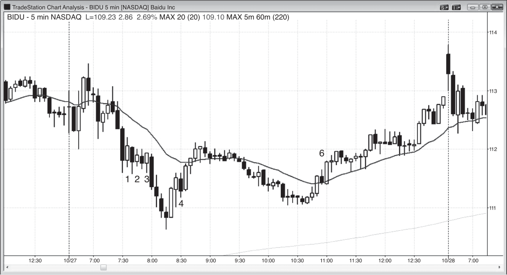

SIGNAL BARS: OTHER TYPES
FIGURE 6.1
Small Signal Bars
A small bar can be a with-trend or countertrend setup. In a trend, a small bar on a
pullback is only a with-trend setup. As shown in Figure 6.1, bars 7, 9, 12, 14, 17, and
21 were small bars in pullbacks and the only trade they offered was a short on a stop
at one tick below their lows. Even though they were mostly doji bars, they were
with trend and therefore reasonable shorts. Most signal bars in a strong trend look
weak, and that is one of the reasons why the trend just keeps working lower. Bears
are eager to short and bulls want to exit with a smaller loss, and both keep waiting
for a strong sell setup. This would make them confident that the market is not going
to rally and that they need to get out immediately. The perfect setup never comes,
and the bears are trapped out and the bulls are trapped in. This creates a constant
sense of tension and urgency that keeps driving the market down. Both keep selling
in small pieces all day long, just in case their perfect setup never comes . . . and it
usually doesn’t. The setups never look strong, so it is easy for traders to assume
that the trend is weak and that there will soon be a good rally that will allow them
to sell at a better price. They see the market staying below the moving average, but
it never falls fast enough to make them panic, so they keep hoping for a bigger rally
to sell. The weak signal bars are an important ingredient in strong trends.
A small bar can also set up a countertrend trade against a trend if it occurs
at a swing low and there are other reasons for trading countertrend, like a prior
trend line break. Bar 16 was a small bear bar that set up a long after a break above

<!-- PDF page 144 -->

PRICE ACTION
Figure 6.1
the bear trend line and the high 4 bottom of the bear channel from bars 7 to 13.
There was a two-legged pullback from the bar 14 test of the moving average, and
the market was likely to have a second leg up.
The only time that a trader should sell a small bar at a low is in a bear trend,
and preferably during a strong bear spike. Bar 29 was not particularly small, but
it was an inside bar, which functions like a small bar, and it was a bear trend bar,
making it a safe short at the low of the day.
Bar 13 was the middle bar of a three-bar reversal up, and bar 17 was the middle of a four-bar reversal down. All multiple bar reversals are just variations of
two-bar reversals. There were several other reversals on the chart, as there are on
all charts.
Deeper Discussion of This Chart
The day began with a large gap down in Figure 6.1, so traders had to be looking for a
possible trend from the open up or down and they needed to watch closely for a setup.
Bar 3 was a bull reversal bar and a good buy setup for a failed breakout and reversal up,
but the entry bar had a bear body, which is never good if a trader is looking for a bull
trend. This failed breakout failed and became a breakout pullback short setup, and it led
to a resumption of the bear breakout. Longs exited on the reversal down below bar 4 and
many reversed to short. The next bar was also a doji bar and now the market was in a
tight trading range on a large gap down day. This was a great breakout mode pattern for
a big trend up or down. Bar 5 went one tick above that doji and likely trapped premature
bulls who did not wait for a breakout above the bar 4 top of the opening range. The best
trade of the day was the short below bar 5 or on the next bar as it broke below the low
of the tight trading range, or on its close when it was clear that the market was always
in short. The spike down to bar 6 had three large bear trend bars and was likely to be
followed by a measured move down, probably in a bear channel. The trend went much
further than that.
Bar 13 was a small bull inside bar at a new swing low and a reversal up from a
low 2 final flag short, and the second leg down of a second leg down, making it a high
4 long setup. It was also the third or fourth push down (depending on how you want to
count the pushes) in a bear channel in a spike and channel bear. The spike was made
of three bear trend bars that started at bar 5. Channels often end on the third push
and are usually followed by a two-legged move sideways to up, as happened here. The
correction often reaches the top of the channel, but here the bear trend was so strong
that the correction could only go sideways and not up. That usually means that lower
prices will follow.
Bar 16 was a high 2 buy setup in a developing trading range after a relatively strong
move up to bar 14 that was strong enough to break the bear trend line. This strength
made a second leg up likely.

<!-- PDF page 145 -->

Figure 6.1
SIGNAL BARS: OTHER TYPES
Bar 14 was close to being a 20 gap bar short setup since the prior 20 bars all had
highs below the moving average. Close is close enough, and a test of the bear low was
likely. The rally to bar 14 was also the first breakout of a tight channel and was therefore
likely to be followed by at least a test down.
Bar 17 was an actual 20 gap bar short setup. The market traded below it and then
above it and then it sold offto a new low of the day. Bar 17 was a doji moving average
gap bar short setup but with the move up from bar 16 being a strong bull spike, most
traders would have waited for a second signal before shorting. The entry was below the
outside up bar that followed bar 17. The entry bar was a strong bear trend bar and it
became the first bar in a strong bear spike.
There are many micro double top and bottom reversal patterns on all charts, and
these are discussed in book 3 in the chapter on reversals. Bars 20 and 21 formed an
example of a micro double top reversal pattern.

<!-- PDF page 146 -->

PRICE ACTION
Figure 6.2

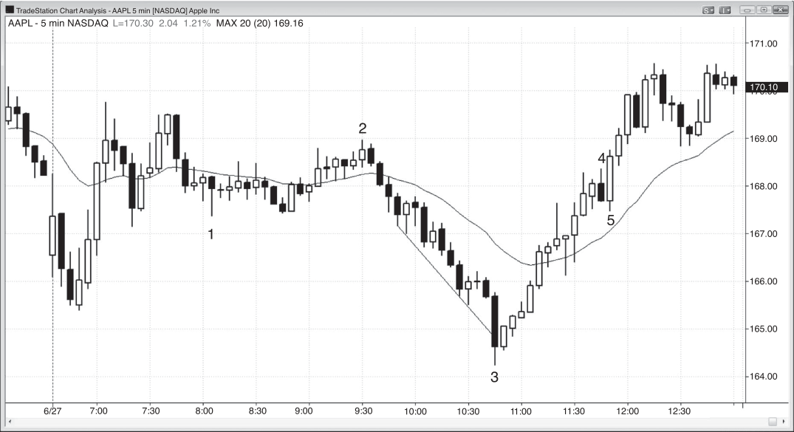

FIGURE 6.2
A Reversal Bar Can Be a Continuation Setup
When a trend is strong, the market often trades below instead of above a bull reversal bar or above instead of below a bear reversal bar. As shown in Figure 6.2, on
this 5 minute chart of Baidu, Inc. (BIDU), bar 3 was the third attempt to reverse the
market up and it was a strong bull reversal bar. However, instead of moving above
it, the market broke out below it. Perhaps there were early longs who entered on
the reversal bar before it triggered a buy signal (the next bar did not trade one tick
above its high), and these overly eager bulls were now trapped. They would exit at
one tick below the bull reversal bar, which was where smart traders went short.
The opposite happened at the bar 6 bear reversal bar, where traders who
shorted before the market traded below the low of the bar were trapped and had
to cover on the next bar as it traded above the bear reversal bar. A reversal bar
alone is not enough reason to enter, even if it is in an area where a reversal might
reasonably take place.

<!-- PDF page 147 -->

Figure 6.3

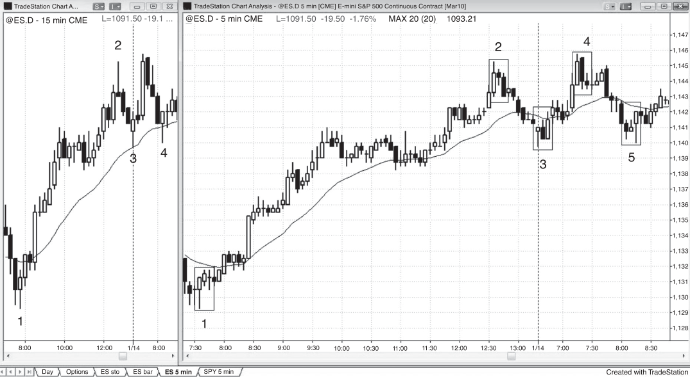

SIGNAL BARS: OTHER TYPES
FIGURE 6.3
A Big Trend Bar Can Indicate Exhaustion
An unusually large trend bar that forms in a trend that has lasted for 10 or more bars
usually means that the market is exhausted and will correct for at least 10 bars, and
sometimes it leads to a reversal.
In Figure 6.3, bar 3 was a huge trend bar that collapsed below the low of the
open and through a trend channel line and was followed by a bull inside bar with
a shaved top, meaning that buyers were aggressively buying it right into its close.
This is a great setup for a long. The large bear trend bar was acting as a sell climax,
and the breakout above the bull inside bar was a bull breakout. This is a spike down
and then a spike up, which is a reversal, and if you looked at various higher time
frame charts, you could find one or more where this bottom was a perfect two-bar
reversal and others where this formed a single reversal bar.
Bar 4 was a bear reversal bar but the bar 5 short entry bar immediately reversed
up above the bar 4 high, running the stops on those shorts. It is important to note
that shorting below the bar 4 bear reversal bar would not have been a wise decision
because the upward momentum was too strong. There were 11 consecutive bull
trend bars, so traders should not be shorting below the first bear bar. Buying above
the bear reversal bar or above the bar 5 bull outside up bar was a reasonable trade
since there were stopped-out bears who would wait for more price action before
looking to short again. If the bears were not ready to short, the bulls could push the
market higher.

<!-- PDF page 148 -->

PRICE ACTION
Figure 6.3
Deeper Discussion of This Chart
The day opened with a strong bull trend bar on a gap down in Figure 6.3, but it immediately reversed down in a breakout pullback short setup. With the large tails and bodies
of the first two bars and the small gap down on the open, the odds of more sideways
action were high and it would be better to wait and not take the short trade. However,
this was followed by a two-bar reversal signal for a failed breakout setup and a possible
low of the day. There was a four-bar bull spike but no follow-through. At some point over
the next couple of hours, traders would have taken at least partial profits and may have
exited the balance on a breakeven stop during the late sell-off, if they did not reverse
to short.
Bar 3 was also the bottom of a spike and channel bear trend, and the reversal should
test the bar 2 start of the channel, which it did. The five-bar sell-offdown to bar 1 was
the spike, and the channel down began at the pullback to bar 2. The sell-offdown to bar
3 was climactic because it had about a dozen bars with lows and highs below those of
the prior bar. The actual number is not important. What is important is that there were
many bars, and the more there are, the more unsustainable and therefore climactic the
behavior is. A large bear trend bar like bar 3 after a strong bear trend is a sell climax.
This usually leads to a two-legged sideways to up correction, and less often to a trend
reversal like the one that developed here.
The failed bar 4 reversal bar was a failed low 2 buy setup. The low 2 trapped na¨ıve
traders who sold under the reversal bar but failed to wait for a prior demonstration of
bearish strength. You should not sell in a strong bull trend if the market is in a tight
channel where there has not been a prior bull trend line break.
The four-bar spike up to the 7:05 bar could have been followed by a channel up.
The spike down to bar 1, however, created the possibility that there might be a channel
down instead, which was the case. It was appropriate to buy the pullback that ended
around 8:45, expecting the spike up, and equally appropriate to reverse to short below
the bear inside bar that followed bar 2.
Note that none of the dojis before and after bar 1 are good signal bars, because
they are in the middle of the day’s range and next to a flat moving average.
The swing high that occurred five bars before bar 1 formed a three-bar reversal,
which would look like a 15 minute reversal bar with a one-tick-tall bull body on the
15 minute chart since the third bar closed at the same time as the 15 minute bar.

<!-- PDF page 149 -->

Figure 6.4

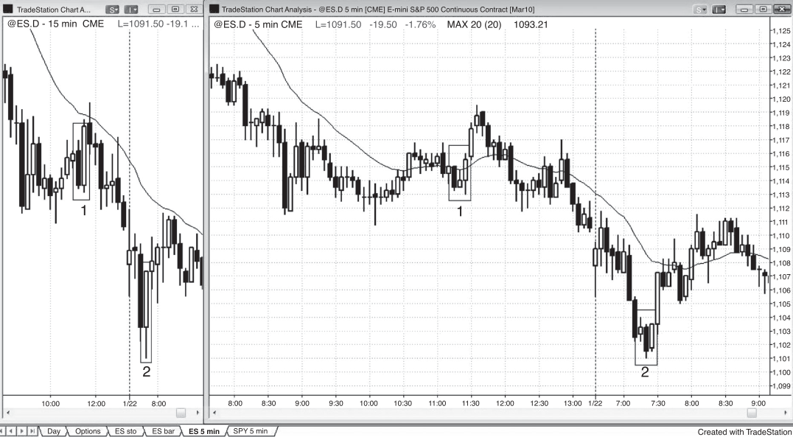

SIGNAL BARS: OTHER TYPES
FIGURE 6.4
A 15 Minute Reversal on 5 Minute Chart
Note that 15 minute reversals can be seen on a 5 minute chart. In Figure 6.4, the
15 minute chart on the left had several reversal bars and the corresponding threebar patterns were within the boxes on the 5 minute chart on the right. In general, a
15 minute reversal is more likely to result in a longer move than a 5 minute reversal
is. When you are looking to take a 5 minute trade, if you see three-bar combinations
that also create 15 minute reversals, you usually can feel more confident about
your trade.
In general, it is a good idea to look at any trend bar that is followed within the
next 10 bars or so by an opposite trend bar with a close near the open of the first
bar as a reversal. The reversal will be a two-bar reversal on some higher time frame
chart, and a reversal bar on an even higher time frame chart.
Deeper Discussion of This Chart
The market broke below the moving average in Figure 6.4, and the breakout failed and
led to a trend from the open bull trend. Bar 3 was a moving average gap bar in a strong
trend, and the move down to bar 3 broke the bull trend line. A moving average gap bar
often leads to the final leg of the trend before a larger correction. Bar 4 was a two-bar
reversal short setup at the higher high.

<!-- PDF page 150 -->

PRICE ACTION
Figure 6.5

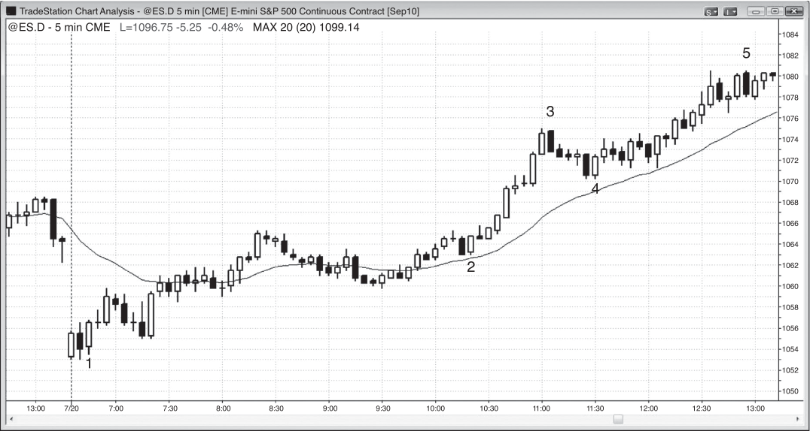

FIGURE 6.5
Three-Bar Reversals
Some three-bar patterns on the 5 minute chart do not create good reversals on
the 15 minute chart, but they still lead to acceptable reversals. In Figure 6.5, the
5 minute chart on the right had a couple of three-bar patterns that looked like they
should form perfect 15 minute three-bar reversals. However, since the third bar in
both cases closed at 25 minutes after the hour instead of at 30 minutes after the
hour, when the 15 minute bar closed, the 15 minute pattern did not show the same
strength. Traders could trade the 5 minute pattern if it was a perfect 15 minute
reversal and buy at one tick above the high of the three bars, or earlier if there was
an earlier 5 minute entry. For example, in the second example on the 5 minute chart,
the second and third bars formed a two-bar reversal, so it would be acceptable to
enter at one tick above the two-bar reversal instead of two ticks higher, above the
top of the three bars. In general, traders should not spend time looking for three-bar
reversals, because they occur only a couple of times a day and you should not risk
missing other more common setups.
Bar 2 was the first bar of a two-bar reversal, and you could find some time frame
where the three large bear trend bars that led to the bottom and the two large trend
bars that followed bar 2 comprised a two-bar reversal, like the 15 minute chart
on the left. You could also find a chart where those bars created a perfect single
reversal bar. Because of this, all reversal setups are closely related. Don’t be too

<!-- PDF page 151 -->

Figure 6.5
SIGNAL BARS: OTHER TYPES
particular and don’t lose sight of the goal. You are trying to see when the market is
trying to reverse and then look for some way to get in once you believe the reversal
will likely have follow-through.
Deeper Discussion of This Chart
The market broke below yesterday’s low with a small gap in Figure 6.5, and the first bar
was a failed breakout buy setup for a possible trend from the open bull trend. When the
reversal is within a steep bear channel like this, it is better to wait for a pullback after
the reversal up before buying. There was a higher low a few bars later, but the bars were
sideways and had big tails, so bulls should wait for more strength. Instead, there was
a low 2 short that was also a breakout pullback short, but most traders prefer to wait
for the breakout of the entire opening range when the opening range is a small trading
range that is less than about a third of an average day’s range. The large bear trend bar
that broke out below the low of the opening range shows that most traders waited for
that breakout before going short.
Bar 2 was a two-bar reversal for an opening reversal long. It followed a one-bar final
flag, and there was earlier buying strength in the strong first bar of the day.

<!-- PDF page 152 -->

PRICE ACTION
Figure 6.6

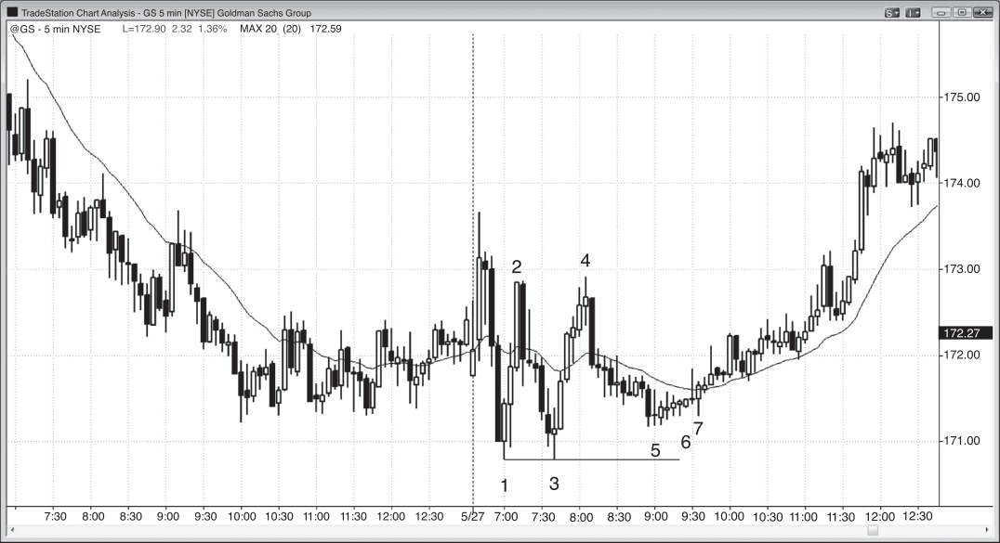

FIGURE 6.6
Two-Bar Reversal
A two-bar reversal is a setup composed of two bars and the entry is one tick beyond
both. In Figure 6.6, even though bar 5 was a bear trend bar, its low was one tick
above the low of the bar before it. When a reversal bar almost entirely overlaps
the bar before it, it should be considered to be a two-bar reversal setup. Here, for
example, the safest short entry was below the lower of either bar 5 or the bar before
it. The market fell one tick below bar 5, but it formed a double bottom with the low
of the bar before it. Traders who thought that it was safe to short below a large bear
bar were stopped out with a loss.
Bar 3 was a similar situation, and if a trader was thinking of shorting, it would
be safer to short below the low of the bar before it and not just below the bar 3. In
any case, this was a risky short since the market had been trending up strongly for
nine bars. It would be much better to not short and instead look to buy a pullback,
like above the bar 4 two-bar reversal.
Bar 1 was the second bar of a two-bar buy reversal where the second bar was
above the high of the first bar. The entry is above the high of that second bar.
Bar 2 was a two-bar reversal where the highs of both bars were the same.

<!-- PDF page 153 -->

Figure 6.6
SIGNAL BARS: OTHER TYPES
Deeper Discussion of This Chart
There was a large gap down and a bull trend bar in Figure 6.6. The market then formed
a two-bar reversal down that did not trigger a short and instead became a two-bar
reversal up. The long above bar 1 had good follow-through two bars later. Since this
was a possible trend from the open bull trend and there were signs of buying strength,
traders should rely on their initial stop below the low of the day until after the higher
low. Once the market turned up from the higher low with a strong bull trend bar, they
could move their stop up to below the higher low and hold long into the close.

<!-- PDF page 154 -->

PRICE ACTION
Figure 6.7

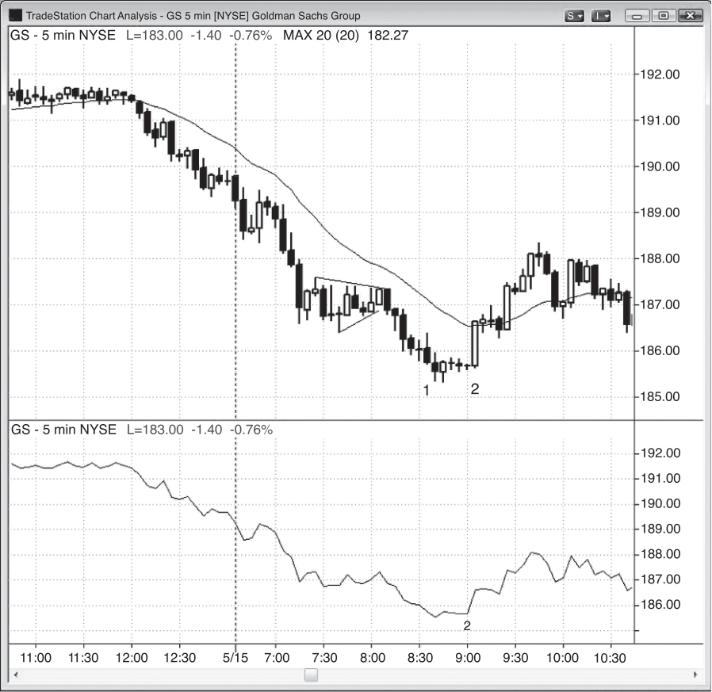

FIGURE 6.7
First Hour Reversal
Always be ready for a reversal in the first hour or so. Goldman Sachs Group (GS)
was in a bear trend yesterday and had a strong rally off the open today so traders
were looking for a pullback to a lower low or higher low and a possible trend reversal. As shown in Figure 6.7, there was a lower low at bar 1, which was tested by
bar 3 and they created a double bottom. This was followed by a higher low at bar 5,
and bulls were looking for a buy setup for a possible new bull trend. Bar 5 was an
inside bar and the bar after it was inside of bar 5, with its low above the low of bar 5
and its high below the high of bar 5. This is an ii setup, and traders would buy on a
stop at one tick above the second bar. Bar 6 was a second ii setup since it was an
inside bar and the bar before it was also an inside bar.
Deeper Discussion of This Chart
There was a tricky open in Figure 6.7, and when in doubt, stay out. The market broke
above the trading range of the final couple of hours of yesterday, but the breakout failed
on the third bar. The market then broke out below the trading range and that breakout
failed and reversed up at bar 1. Bar 3 was an acceptable double bottom long setup, but
traders who waited could buy the double bottom pullback above bar 6.
This was a double bottom pullback buy setup. Double bottom pullbacks have a
pullback that typically extends more than 50 percent and often almost the entire way

<!-- PDF page 155 -->

Figure 6.7
SIGNAL BARS: OTHER TYPES
to the double bottom. This double bottom was exact to the tick. The higher low often
forms a rounded bottom, and traditional stock traders would describe it as an area of
accumulation. The name is irrelevant; what is important is that the market failed to put
in a lower low on this second attempt down (bar 3 was the first), so if it can’t go down,
the bears will step aside and the market will probe up (in search of sellers willing to sell
at a higher price). Instead of finding sellers, the market found buyers willing to buy at
the higher price.
Bar 7 set up a third entry on the back-to-back, opposite failures. The market failed
on the upside breakout above bar 6 and then failed on the downside on the next bar,
meaning that both the bulls and bears were trapped. Bar 7 became just a pullback from
the breakout above bar 6 and is therefore a breakout pullback long setup.
Bar 4 was a double top bear flag short setup. The rally on the open was followed by
a lower high at bar 2, which was tested by bar 4, creating a double top. Since the double
top was below the high of the open, there is a possible bear trend and any pullback in a
bear trend should be thought of as a bear flag.

<!-- PDF page 156 -->

PRICE ACTION
Figure 6.8

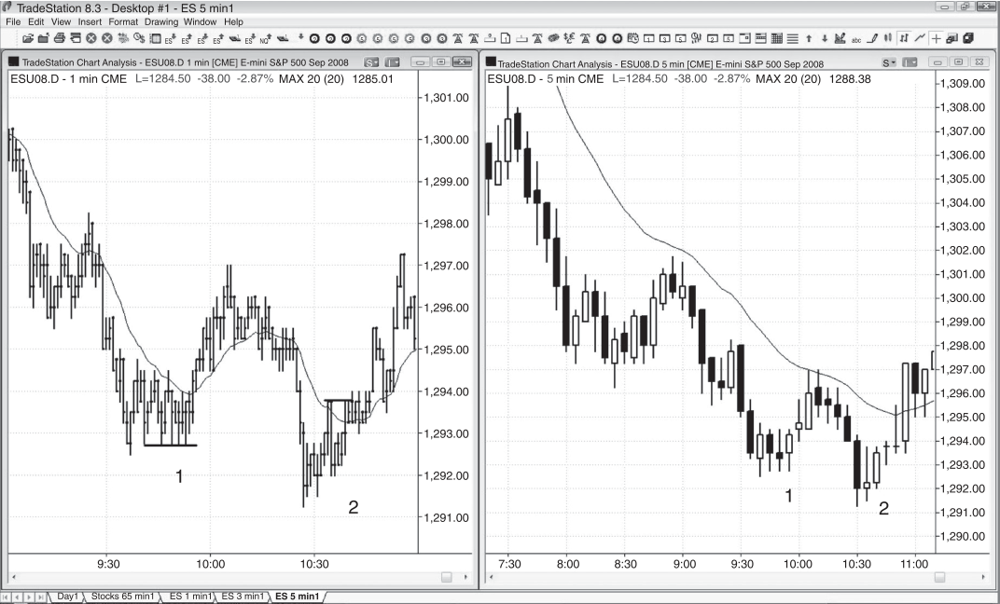

FIGURE 6.8
Bars That Are Tiny Can Still Be Helpful
Sometimes the bars are so tiny that they appear to be insignificant but they still can
be telling you something that is very important. In Figure 6.8, the bar 2 signal bar
was a tiny bar (11 cents in a $185 stock), but if you look at a line chart of the closes,
the small higher low was clear at point 2.
Bar 2 was the second half of a reversal setup, and the large bear trend bar that
formed three bars before bar 1 was the start of the down part of the reversal. You
could find some higher time frame chart where this collection of 10 bars formed a
two-bar reversal.

<!-- PDF page 157 -->

Figure 6.8
SIGNAL BARS: OTHER TYPES
Deeper Discussion of This Chart
The day opened on the high tick in Figure 6.8 and had a two-bar spike down as it broke
out of a two-bar bear flag from yesterday’s close. The market tried to reverse up on the
fourth bar but there was no long entry since it was an outside up bar without followthrough. The shorts would hold with a stop above the signal bar or maybe above the
outside up bar. The next bar was a bear inside bar that set up a low 2 short entry in a
trend from the open bear trend.
The bull reversal bar three bars before bar 2 was a riskier entry since the market
had been in a tight bear channel for the seven prior bars. It is safer to wait for the
breakout from the channel and then buy the breakout pullback. This pullback was more
of a sideways pause and it ended with the bar 2 higher low buy signal. Second entries in
general are more reliable. It was very close to being an iii pattern, which often leads to
reversals at the ends of swings.
Bar 1 was not a good setup for the reversal up from the final flag breakout because
the signal bar was a doji. Instead, you should wait for a bull trend bar for a signal bar when
bottom picking in a strong bear trend. Also, the prior four bars were bear trend bars,
so there was too much downward momentum to be buying the first attempt to reverse,
especially when the signal bar is a doji, which does not represent strong buying.

<!-- PDF page 158 -->

PRICE ACTION
Figure 6.9

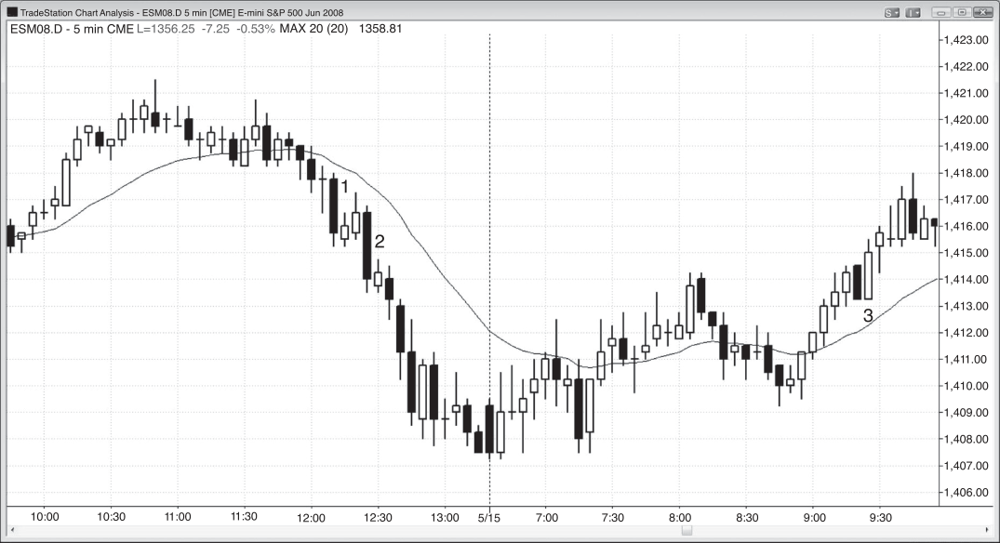

FIGURE 6.9
An ii Pattern Is a Smaller Time Frame Reversal
Because an ii pattern always represents a clear reversal setup on a smaller time
frame chart, you never have to check that chart to confirm it. In Figure 6.9, on
the 5 minute chart on the right, there were two ii patterns (the first is an iii). These
often are clearer reversal patterns on smaller time frame charts, like the 1 minute
chart on the left. The bar 1 iii on the 5 minute chart was a higher low that was tested
repeatedly on the 1 minute chart. The bar 2 ii on the 5 minute chart was a higher
low after a higher low, so the market was making trending higher lows, which is a
component of a bull trend.
In both cases, the bull trend bar at the end of the ii pattern was a great setup for
a long entry. Even though small bars have less directional significance, it is always
better to have the final one be a trend bar in the direction of your intended entry.
Bar 2 on the 5 minute chart formed a reversal with the bear trend bar that
formed two bars earlier.
Deeper Discussion of This Chart
The bar 1 setup on the 1 minute chart in Figure 6.9 was a double bottom pullback buy
pattern, and the bar 2 setup was a failed low 2.

<!-- PDF page 159 -->

Figure 6.10

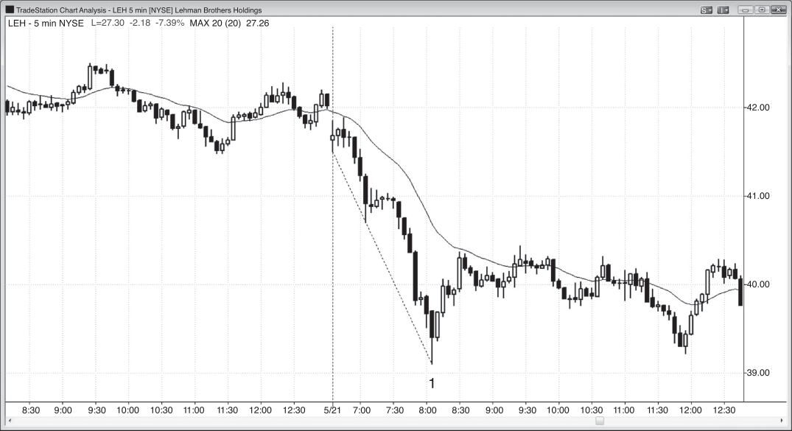

SIGNAL BARS: OTHER TYPES
FIGURE 6.10
Two-Bar Double Bottoms and Tops
Double bottoms and tops can be as small as two consecutive bars and still be important.
In Figure 6.10, bar 1 was a micro double bottom bear flag setup, since it is a
bear trend bar immediately followed by a bull trend bar in a bear spike and they
have identical lows. Sell at one tick below its low. You could also sell below the
low of the one-bar pullback on the next bar, giving you an earlier entry.
Bar 2 was another example.
Bar 3 was a micro double top entry bar for a long trade, since the bear trend
bar is a one-bar bull flag in a bull spike (a high 1 buy setup in a bull spike). It is
also a micro double bottom and a two-bar reversal with the bar before it. Traders
could therefore also buy above the high of bar 3, although this is a riskier entry
since it is four ticks worse. Also, buying above a large bar after a breakout of
three overlapping bars is risky because those three bars might be the start of a
trading range.
Deeper Discussion of This Chart
The first bar of the day in Figure 6.10 broke out below yesterday’s low and the breakout
failed. Since the market was still within the trading range from the final hour of yesterday

<!-- PDF page 160 -->

PRICE ACTION
Figure 6.10
and the two-bar reversal up on the open had large bars, this would force traders to buy
at the top of a trading range that had many bars with large tails. Instead, traders should
wait. The move up to the moving average was a bear flag and it broke out at 7:15 a.m.
PST, but the breakout failed and reversed up on the next bar in a two-bar reversal, which
was a reasonable buy.
At 8:50 a.m. there was a double bottom pullback long setup.

<!-- PDF page 161 -->

Figure 6.11

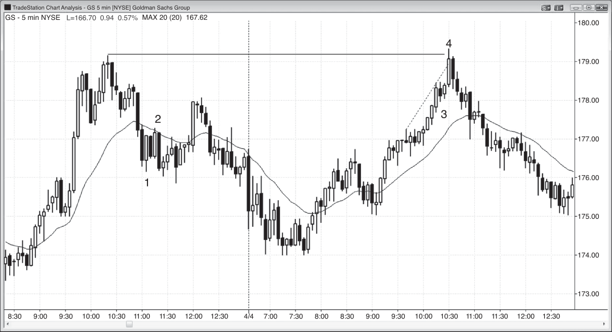

SIGNAL BARS: OTHER TYPES
FIGURE 6.11
A Strong Two-Bar Reversal
Although it is usually better to not buy the first reversal attempt in a strong bear
trend, a strong two-bar reversal can be a reliable buy setup after a sell climax.
As shown in Figure 6.11, Lehman Brothers Holdings (LEH) had a two-bar reversal
bottom on a test of the bear trend channel line and after consecutive sell climaxes.
The sell-off was climactic because it was unsustainable behavior. Sixteen of the
prior 17 bars each had a high that was below the high of the bar before. Also, there
were three occurrences of a large bear trend bar that followed a series of smaller
bear trend bars. A climax is usually followed by a two-legged correction that lasts
for many bars (at least an hour on a 5 minute chart).
Bar 1 was the first bar of a two-bar reversal. It is usually risky to buy the first
reversal in a strong bear trend, but after several signs of climactic behavior and a
very strong two-bar reversal, this was a reasonable buy setup. Bar 1 was another
large bear trend bar and therefore another sell climax, and the second bar was a
strong bull trend bar. It was large and it opened on its low and closed on its high.
Deeper Discussion of This Chart
The market in Figure 6.11 opened with a breakout of a bear flag over the last 90 minutes
of yesterday and it tested yesterday’s low. The third bar tested the moving average and

<!-- PDF page 162 -->

PRICE ACTION
Figure 6.11
the next bar set up a low 2 short for a possible trend from the open bear and breakout
pullback short. Many traders waited for the breakout below the first bar of the day to go
short, and this resulted in a bear trend bar that became the first bar of a three-bar bear
spike. Traders could also get short below the bear flag that followed.
Bar 1 had a big range and followed a strong bear leg, and it was therefore a sell
climax. There was another large bear trend bar four bars earlier and it, too, was a sell
climax. When a trend is particularly strong, it often will not correct until after a second
sell climax, and rarely after a third.
The small inside bar that formed two bars before bar 1 turned into a one-bar
final flag.
There were three large consecutive bear trend bars with very little overlap offthe
open, and they constitute a spike down. A strong spike down is commonly followed by a
bear channel and then a pullback and sometimes a reversal. That initial spike down was
followed by a sideways low 2 and then even stronger selling. Even though this followthrough selling was almost vertical, it should be thought of as the bear channel that
followed the initial spike down. That low 2 is a type of final flag, even though the market
fell far before trying to pull back.
Spike and climax bears (a type of spike and channel bear trend) usually test to around
the start of the channel within a day or two, but when the selling is this strong, they may
not, and a higher time frame pattern might be controlling the market. For example, the
entire sell-offdown to bar 1 might be a large spike on the 60 minute chart and the trading
range that followed might become the pullback that leads to a large bear channel move
down to much lower prices.

<!-- PDF page 163 -->

Figure 6.12

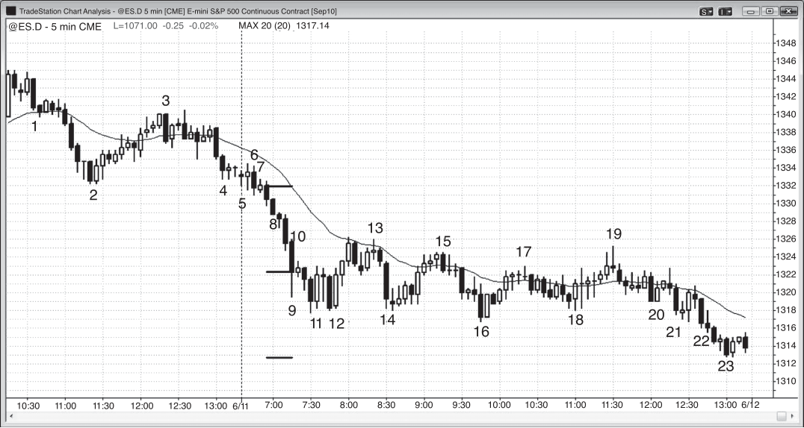

SIGNAL BARS: OTHER TYPES
FIGURE 6.12
Two-Bar Reversal Buy Climax
The first attempt to reverse a strong bull channel can be a reliable short if it is at
the end of a buy climax and the two-bar reversal is strong.
In Figure 6.12, bar 4 was a large two-bar reversal top on a break above yesterday’s high and a bull trend channel line, and after the breakout of a small flag
(bar 3). When two bars overlap so much, the chances of a profitable trade are
greater if you short below the lower of the two bars and not below the other (bar 4
in this case). Also, the second bar had a large bear body, and when a bull trend is
strong, you should short only below a strong bear bar and never below a strong
bull bar.
Bar 1 and the bear bar before it did not provide a good two-bar reversal buy
setup because there was too much downward momentum in those two large bear
trend bars on their breakout from the lower high. The bars barely overlap one another and they have small tails.
This was immediately followed by another two-bar reversal buy setup (back-toback patterns happen occasionally), but four overlapping bars after a spike down
there is a bear flag and you should not buy at the top of a trading range in a
bear trend, especially just below the moving average. Two-bar reversals are countertrend signals only if there is a reason to expect a reversal.

<!-- PDF page 164 -->

PRICE ACTION
Figure 6.12
Bar 2 is an acceptable entry bar for a short based on the two-bar reversal top
created by the prior two bars. It was reversing the small correction up to the moving
average. However, whenever there is a two-bar reversal sell setup just below the
moving average and the bars are relatively large and overlap one or more other
bars, you usually can buy at or below the low of the signal bar for a long scalp.
This is a small trading range and it is usually better to buy at the bottom of a small
trading range.
Bar 4 was the first bar of a two-bar reversal.
Deeper Discussion of This Chart
The bar 4 two-bar reversal in Figure 6.12 followed a small final flag at bar 3, and it was
the third push up after the bull spike that began at 9:10 a.m. Spike and channel patterns
often correct after three pushes up. The spike is the first push and then there are often
two more spikes followed by a correction that usually tests to around the bottom of
the channel.
The first bar of today was a breakout below the double bottom bull flag of the final
90 minutes of yesterday. Traders could have shorted below the double bottom on a stop
or below the ii breakout pullback setup three bars later.
There was a large two-legged move down from yesterday’s high that ended in a
triple bottom on today’s open. There was a second chance to go long on the higher low
at 9:05 a.m. PST, after the initial strong leg up that tested the high of the open. This
was also a breakout pullback buy setup (even though the market had not yet broken out
above the high of the open).
Bar 1 was an up bar, and it was followed by a down bar and then a second up
bar that tested the moving average. This is a small two-legged correction to the moving average and therefore a low 2 short setup. There were also trapped bulls who
bought above the back-to-back two-bar reversal bottom attempts, and once the low
2 triggered, they would exit their longs with a loss. Their selling adds to the selling
of the new bears and increases the chance of success. Also, since they just lost, they
will be hesitant to buy, and the losses of buyers increase the chance of a successful
short scalp.
A series of overlapping bars is a tight trading range, which is a magnet, and breakouts often fail and the market is drawn back into the tight trading range. This is because
both bulls and bears feel that there is good value in that range. When the market drifts
toward the bottom of the range, the bulls feel that there is even better value and they
buy more aggressively. The bears prefer to short in the middle or top of the range.
Their absence at the bottom of the range and the increased buying by the bulls lifts
the market back up. The opposite happens at the top of the range, where bears become
more aggressive and the buyers stop buying and wait for slightly lower prices. The entire

<!-- PDF page 165 -->

Figure 6.12
SIGNAL BARS: OTHER TYPES
process is amplified on a breakout. Here, the bears were able to overwhelm the buyers
and break the market to the downside. However, instead of finding new sellers down
there who could push the market down further, the buyers saw these lower prices as an
even better value than that in the tight trading range. The result was that the market was
pulled back into the range.
The market later tried to break out of the top and again was pulled back into the
range. However, there will always be an successful breakout eventually.

<!-- PDF page 166 -->

PRICE ACTION
Figure 6.13

FIGURE 6.13
No Tails Means Strength
A bar with no tail at either end in a strong trend is a sign of strength, and traders
should enter with trend on its breakout. In Figure 6.13, bar 8 was a bear bar in a
strong bear trend, and it had no tail at both its high and its low, indicating severe
selling pressure (they sold it from start to finish). It was likely that there would
be more selling to come. Traders have to be fast in placing their sell stop orders
because the market is moving fast. Alternatively, they can just short at the market
or on a one- or two-tick bounce using a limit order.
The bar after bar 10 had a shaved top in a bear trend but since the market was
not in free fall at this point, that alone was not enough reason for a short.
The bar after bar 16 was a bull trend bar with a shaved top and bottom, but
it was not in a bull trend and therefore it does not function as a buy setup based
solely on the absence of tails.
The bar after bar 17 and the bar before bar 20 were not shaved bar sell setups
because they were not in a free-fall bear trend.
There were many two-bar reversal setups on this chart, as there are on all
charts.
Deeper Discussion of This Chart
There was a quiet open in Figure 6.13 that continued the tight trading range of the close
of yesterday. Bar 8 was a two-bar breakout and traders could have shorted on the close

<!-- PDF page 167 -->

Figure 6.13
SIGNAL BARS: OTHER TYPES
of the bar because of a likely trend from the open bear trend, or below bar 10, the first
pause, or on the bar 13 double top bear flag test of the moving average.
Bar 11 was the second bar of a two-bar reversal and the market might have been
trying to turn up after the sell climaxes. The next bar was a doji inside bar and a low
1 short setup. However, when there is a bear flag where the signal bar mostly overlaps
with the two prior bars and the market might be in a trading range, the odds are high
that the short will fail and will become a bear trap. Do not take these short signals.
The three-bar rally from bar 12 led to a 20 gap bar short, but since the upward
momentum was strong, it was better to wait for a second signal, which occurred at
bar 13.
Bar 19 was a moving average gap bar short and it led to a new low of the day. It was
also a failed breakout above the bars 15 and 17 swing highs and a test of the top of the
trading range. It is common for a trend day to have a strong countertrend move between
11:00 a.m. and noon PST, trapping traders into the wrong direction as it did here. It is
important to realize this so that you will be mentally prepared to take the with-trend
trade, which was a short here.
Since the bar before bar 10 was a large range bar in a trend that had gone on for
a while, it is a sell climax and the market might try to correct sideways to up soon. The
first pause in a strong trend is usually a successful short scalp, even in a strong bear
trend, but it might become a final flag and lead to a correction up (the breakout below
its low may reverse up within a bar or two). Whenever there is a strong spike down, it is
usually followed by a measured move down based on some aspect of the spike, usually
the distance from the open or high of the first bar to the close or low of the last bar of
the spike. The low of the day was a perfect measured move down from the open of the
first bar to the close of the final bar. Traders should continue to hold short at least until
the market reaches the general area of these targets.
Bar 16 was a large bull inside bar reversing up from a new low of the day, and the
market was now in a trading range. It was also a high 2 in a trading range and therefore
an acceptable long setup. The high 1 formed two bars earlier.
The two-bar spike down into the close of yesterday led to the bear channel that
ended on the bar before bar 11 today. However, the entire channel was steep enough to
likely function as a spike on either the 15 or 60 minute chart, and the market might be
in the process of channeling down into the close of the day.
The bar 21 strong bear trend bar or the bar before bar 20 might have served as a
small spike down that led to the bear channel into the close of the day.

<!-- PDF page 168 -->

PRICE ACTION
Figure 6.14

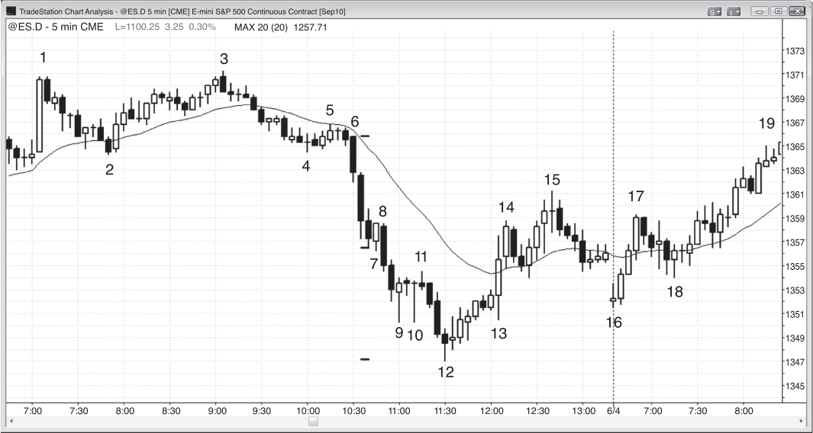

FIGURE 6.14
Signal Bar Examples
Apple (AAPL) demonstrated many common signal bars on the 5 minute chart
shown in Figure 6.14. Even though bar 1 was a Hammer doji bar at the bottom
of a swing down and it would make many candle worshipers want to buy, especially since it was a double bottom with the first bar of the day, this was a bad setup
for price action traders. It was the third overlapping doji, meaning that the market
traded both up and down in all three bars. This was an area of two-sided trading
and therefore a trading range, and whenever there is a trading range just below the
moving average, the odds favor a downside breakout. There are always sellers on
any test of the moving average from below, and there was not enough room between the high of the bar and the moving average to make even a scalper’s profit.
If you were to buy above bar 1, you would have to pay attention to the size of the
bars, all of which had relatively large ranges. This increases the risk of the trade
because your protective stop location should be in part determined by the size of
the current bars. If you wanted to keep your risk the same on all of your trades, you
would have to trade fewer shares.
Bar 2 was a much better reversal bar setup because it had a decent-size bull
body and it was the second attempt to reverse up from below yesterday’s low and

<!-- PDF page 169 -->

Figure 6.14
SIGNAL BARS: OTHER TYPES
from a new low of the day (bar 1 was the first attempt). The bull bodies of the first
two bars of the day showed some prior bull strength. The tail at the top showed
some weakness, but this was erased by the trend bars that followed it.
Bar 2 was the second bar of a two-bar reversal and the middle of a large two-bar
reversal on some higher time frame chart. You can find a chart where the bar before
or after formed a two-bar reversal, and you could find an even higher time frame
chart where the two bars before and the two bars after formed a two-bar reversal.
As with all two-bar reversals, you can find an even higher time frame chart where
the five bars formed a single bull reversal bar.
Bar 3 was an outside up bar (an outside bar with a bull body) after a pause bar,
which followed the breakout to a new high of the day, and was an entry bar for
the purchase above the high of the small bar. Outside bars in new trends often trap
traders out of great trades because they happen so quickly. Many traders don’t have
enough time to reverse their perspective fast enough from bearish to bullish, and
then they have to chase the market up. The bar before bar 3 was a doji, so it was
not a strong setup for a short, even though the market might reverse down after a
breakout to a new high of the day. Only scalpers and weak shorts would be shorting
below its low because of the signs of bull strength that were accumulating. The bar
before that doji had the largest bull body of the day and closed on its high, and it
was also the third consecutive up bar. All three bars had decent-size bodies, and the
second and third did not overlap more than half of the prior bar. It was likely that
traders were aggressively looking to buy any pullback and had limit orders to buy
both below the low and above the high of the doji, and the buying was so strong
that both sets of buy orders were filled in one bar.
Bar 4 was a bear doji at a new high, but the upward momentum was so strong
and the reversal bar was so weak that a short could be considered only on a second
entry. This was the first bear body after seven consecutive bull bars and the market
rarely reverses very far on the first attempt, especially when the signal bar has a
close in the middle instead of at its low. The bears were not even strong enough to
close the bar on its low so they will unlikely be able to push the market down very
far before the bulls overwhelm them again.
Bar 5 was another outside up bar that tested the moving average and the breakout from the opening range, and it was the end of first pullback in a strong up move.
Bar 6 was a bear reversal bar and a second entry short setup (the first was two
bars earlier) after taking out the bar 4 swing high and yesterday’s high. Since the
bears had enough strength to test the moving average with bar 5 and the bull trend
is even more overdone, the bears should be able to correct to the moving average
or even below it this time. As a trend wears on, the bulls typically will want deeper
pullbacks before looking to buy again.
Bar 7 was an entry bar on an ii short setup at a time when you were expecting
a test of the moving average. Both ii bars had bear bodies, which increases the

<!-- PDF page 170 -->

PRICE ACTION
Figure 6.14
chance of success for a short trade. Although a bull body on a bear entry bar is not
good and the bar after it traded above it, the market did not trade above either of
the ii bars where the protective stop would be. If you are going to take a trade in a
tight trading range, you have to give it a little room. That entry bar became a small
bull reversal bar, but small reversal bars are rarely good and when one forms in
a tight trading range, it should not be looked at as a reversal bar because there is
nothing to reverse. The ii breakout reversed back up a couple of bars later, which is
expected when an ii is in the middle of the day’s range. Also, the market completed
its goals of two legs down and a penetration of the moving average.
Bar 8 was a doji bar at close to a double top in what was now a trading range.
Doji bars are never good signal bars for shorts in strong bulls, but they are acceptable signal bars for shorts in trading ranges, depending on the context. Since the
market was testing the top of the range, it was an acceptable signal bar for a short
since the market might test the bottom of the range.
Bar 9 was a two-bar reversal after a new swing low and test of the bar 5 low. The
entry was above the high of the higher of the two bars, which would be above bar
9. However, this is risky because there will always be shorts at the moving average
when the market tests it from below. Also, the two bars are large, forcing buyers to
come in too high above the low of a down leg. When the risk is greater, it is better
to not take the trade and to wait for a strong setup.
Bar 10 was a two-bar reversal following four bear trend bars with good-size
bodies, small tails, and very little overlap, and therefore a good short setup in a
strong bear trend.
Bar 11 was a bull reversal bar after a third push down and it was an attempt to
hold above the low of the day. The bear trend had gone on for a long time and there
were many pullbacks along the way, so the odds were high for a test of the moving
average. Since it is countertrend, you have to be willing to allow for pullbacks in
the move up to the moving average, so do not tighten your stop too soon.
Deeper Discussion of This Chart
The market broke below the moving average on the open in Figure 6.14, but the breakout
failed with a strong bull reversal bar. The second bar had a bull body but it also had
prominent tails and it failed to get above the moving average. There was also no followthrough buying on the third bar, which also tested the moving average and failed to get
above it. Bulls should have considered exiting their longs and waiting since the market
was now in a small tight trading range below the moving average and the bars were
large with tails. A tight trading range below the moving average usually breaks out to
the downside, but there was no reliable short setup. Instead, traders should wait for a
better setup. Bar 2 was a strong bull reversal bar that set up a long of the failed breakout
of that tight trading range, which became a final flag.

<!-- PDF page 171 -->

Figure 6.14
SIGNAL BARS: OTHER TYPES
Once the market broke above the opening high, a measured move up was likely.
Bar 2 was also a bear micro wedge that overshot the trend channel line that could
be drawn across the bottoms of the prior three bars. Notice how there is a tail at the
bottom of the bar that followed bar 1. That means the buyers came in around the low
of the bar. The bears were hoping to find sellers on the breakout below the low of the
bar and for the close to be well below the low of the bar, but instead there were some
buyers. This happened on the next bar as well and even more so with bar 2. The bears
were finally able to drive the price even further below the low of the prior bar, but the
bulls became especially aggressive and reversed the market and closed the bar above its
open and near the top of the bar. Although micro wedges by themselves don’t usually
lead to major reversals, the other factors at work here created the low of the day.
Bar 2 along with the bar before it and the bar after it also created a three-bar reversal
and a 15 minute reversal bar because the bar before it would have the same open as the
15 minute bar, the bar after it would have the same close as the 15 minute bar, and that
close is above the open. The next bar would then trigger a 15 minute long entry.
The move down from bars 4 to 5 had several overlapping bars and could be a final
flag. Bar 5 and the bar that followed it both had very large bodies and small tails and
therefore formed a two-bar buy climax. When a climax occurs after a trend has been
going on for many bars, the odds of a two-legged sideways to down correction lasting at
least 10 bars increase. The next bar was a bear inside bar after a buy climax and might
become a one-bar final flag.
Bar 6 was the second leg up from the bar 5 first pullback and from the bar 2 low,
and second legs are often reversals. Also, it was a low 4 and a wedge with the three
pushes being bar 4, the bar after bar 5, and bar 6. It was additionally a larger wedge
with the three pushes being the third bar of the day, bar 4, and bar 6. With this many
factors operating, a trader should expect at least two legs down. It also followed two
buy climaxes, the first being the two-bar climax of bar 5 and the next bar and the second being the bar before bar 6. A second consecutive buy climax usually results in
at least a two-legged correction that penetrates the moving average and lasts at least
an hour.
The two-legged pullback that followed the bar 6 short penetrated the moving average and ended with a moving average gap bar. Since it formed in a strong trend, a test
of the trend’s high was likely. It was also a wedge bull flag buy setup with the first push
down being the bar before bar 6 and the second push down being the third bar after bar
6. A moving average gap bar often leads to the final leg of the trend before the market
has a larger pullback and even a reversal.
Bar 8 was a lower high or double top after a moving average gap bar, which always
breaks the trend line, and therefore a possible trend reversal. There is a good risk/reward
setup for a swing down, and shorts should swing part of their position. It also formed
a one-bar final flag reversal, and a micro double top reversal with the tails at the top of
either of the two bars before it.

<!-- PDF page 172 -->

PRICE ACTION
Figure 6.14
Bar 9 was a wedge bull flag with the three pushes down from bar 8, but because the
sell-offwas in a relatively tight bear channel and the market might have reversed into
a bear trend, it is better to wait to see if there will be an acceptable breakout pullback
buy setup. Five bars later, there was an outside up bar but that is not an acceptable long
entry in either a trading range or a bear trend, and therefore buyers would have to wait
some more. Bar 9 was also an attempt to form a double bottom bull flag with bar 5, at
a price level where the market found buyers earlier in the day. Finally, it was the end
of a large two-legged correction from the bar 6 high and therefore a high 2 long and
probably a clear high 2 long on a higher time frame chart, like the 15 minute chart.
Bar 10 was a breakout pullback from the breakout below the bar 9 wedge bull flag
low and the failed high 2, and it followed a breakout below the double top bear flag that
formed after bar 9. The four-bar breakout was a spike down, and the market bounced
back up to test the bar 10 top of the channel by the close. There was a double top bear
flag short setup with the high of bar 10 and the bar that formed four bars later. All
breakouts are spikes and climaxes, and there was a second sell climax two bars before
bar 11; a second consecutive sell climax usually leads to at least a two-legged pullback. A
breakout spike often leads to a measured move down. Take the number of ticks between
the open of the first of the four bars and the close of the fourth bear bar and project
down from the top of the first pullback (the high of bar 10).
Bar 11 was similar in appearance to bar 1, which earlier found buyers in this price
area and they may be willing to buy again. Since there has not yet been a break of the
bear trend line, the odds of a trading range are greater than the odds of a significant
reversal. The move down from bar 6 was in a channel, and a bear channel should be
thought of as a bull flag, so there might be a strong move up before long. Also, the
entire move down from bar 6 is a complex two-legged move with the second leg down
beginning at bar 8; it might be a simple two-legged correction on a higher time frame
chart, like the 60 minute chart.
Bar 11 was a micro double bottom reversal with the tail of the bull doji bar that
preceded it.

<!-- PDF page 173 -->

Figure 6.15

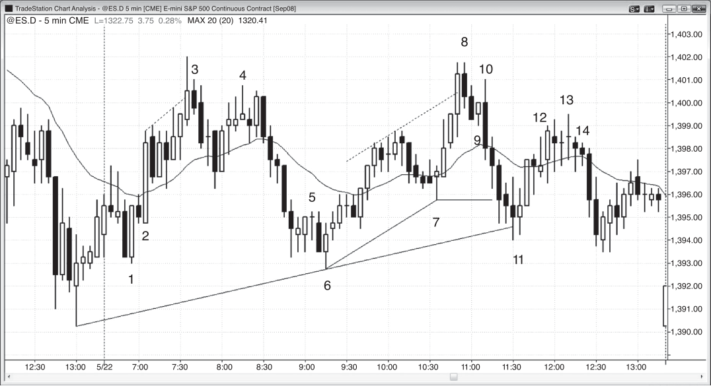

SIGNAL BARS: OTHER TYPES
FIGURE 6.15
One-Bar Bear Flag
A bull reversal bar in a bear spike can be a one-bar bear flag. In Figure 6.15, bar 8
was a break below a bull reversal bar (failed reversal bar) in a strong bear trend
and is a great short because the early bulls who bought will be trapped and forced
to sell below its low.
Bars 8 through 14 created a two-bar reversal on a higher time frame chart and
a single reversal bar on an even higher time frame chart.
Bars 9 and 10 formed a small double bottom and bar 11 was the entry bar for
the long, but a doji is not a good signal bar for a countertrend trade against a strong
trend. There were no prior bull pullbacks in the sharp sell-off, and since the first
pullback in a strong trend usually fails, smart traders expected this bottom to fail.
They placed sell stop orders to go short exactly where the losing longs would sell
out of their positions, which was one tick below bar 11.
A doji is a one-bar trading ranges and bars 9 and 10 created a pair of large dojis
with a small doji in between. These three bars formed a small sideways trading
range in a strong bear trend, which is a bear flag, so a downside breakout was
likely. Since bar 11 was the second attempt to rally (the first attempt was two bars
earlier but it could not even get above the bull doji just before it), the longs would
almost certainly exit below bar 11 and not look to buy again until the market moved
down for a bar or two. As these longs sold their positions, their selling added to the
selling pressure from the smart traders who expected this weak bottom to fail and

<!-- PDF page 174 -->

PRICE ACTION
Figure 6.15
therefore shorted below bar 11. The only traders willing to buy just bought and lost,
so the market became briefly one-sided and destined to fall.
Deeper Discussion of This Chart
Bar 7 formed a micro double bottom with the tail at the bottom of the large bear bar
two bars earlier (the bottoms do not have to be exactly at the same price). Since the
market was in a bear spike, selling the breakout below the bar 7 double bottom low was
a reasonable short. This is different from the bar 18 micro double bottom (with the tail
of the doji bar two bars earlier), which was in a pullback from a four bar bull spike, and
not in a bear spike. It was reasonable to buy above bar 18 (most minor bull reversals
come from some type of micro double bottom, as discussed in book 3 in the chapter on
reversals), but not good to short below it. Bar 11 formed a micro double top with the
high of the bar two bars earlier, and became a low 2 bear flag sell signal bar.
Bar 15 strongly broke above the bear trend line in Figure 6.15, and the gap down
opening to bar 16 was a higher low buy setup for an expected second leg up. The market
broke below the moving average and below the double bottom bull flag of the final hour
of yesterday and the breakout failed.
Bar 18 was a breakout pullback long for the breakout of the bull flag from bar 15 to
bar 16.
Bar 6 and the next bar were large bear trend bars that broke out below the bars 2
and 4 double bottom. The tails were small and the bodies were large, and more selling
was likely. Every large bear breakout is a sell climax but that does not mean that the
market will reverse. This breakout looked strong and the bulls could generate only a
two-bar pause after the sell climax before they were overwhelmed again by the bears.
A breakout is not only a climax but a spike as well, and when the breakout is strong
like this, it is usually followed by a channel down before a tradable bottom develops.
Bears will be aggressively shorting every pause and every little pullback until a possible
bottom forms. The bottom will usually be at some measured move target, and the first
one to consider is a measured move down from the top to the bottom of the trading
range before the breakout. Next, look at the open of the breakout bar to the close or
low of the final strong bear trend bar of the breakout, which might be the bar before bar
7 or the bar before that. It turns out that the bear trend bottomed at a measured move
using a projection down from the top of the spike to the low of the third and final bear
bar of the spike. You should also look for other possible measured move projections
as well, because if the market tries to reverse within a couple of ticks of one of these
magnets, it should increase your confidence to take the trade. However, you cannot take
the countertrend trade on a measured move alone since most fail and you have to keep
looking at others. The odds of success are too small. However, if there are other reasons
to take the trade, like a trend channel line overshoot and reversal or a final flag reversal,
the odds of success increase considerably.

<!-- PDF page 175 -->

Figure 6.15
SIGNAL BARS: OTHER TYPES
After a strong spike down, the most likely follow-up will be some type of channel
down and eventually a test up to the top of the channel. Traders would keep shorting
all the way down the channel and then buy at the bottom for the pullback to the top of
the channel.
Bar 8 and the bar after it were large bear trend bars with little overlap and therefore
constituted a second sell climax. Although a second sell climax usually leads to two legs
sideways to up and lasts at least 10 bars, the move down to bar 9 was so steep that
buyers were unwilling to buy and sellers were still willing to sell more.
Bar 11 was the end of a four-bar barbwire pattern, and barbwire after a long trend
often becomes a final flag, which was the case here. Traders were expecting any breakout
below the small tight trading range to soon fail and the market to be pulled back into
the range. Because of this, they would likely only scalp the short below bar 11 instead
of holding it for a swing down. The two bars after bar 11 were again large bear trend
bars and formed a third spike, which is always also both a breakout of something (here,
barbwire and therefore a potential final flag) and a climax. A third consecutive sell climax
is fairly unusual and the odds were therefore high that there would be at least a twolegged sideways to up correction lasting at least 10 bars. This is even more likely after
a final flag breakout and a measured move.
Even though the bar 12 signal bar at the low had a bear body, its close was above
its midpoint so the buyers showed some strength. It was also the third push down after
the spike breakout (bars 7 and 9 were the first two), and the channels that follow spikes
often end with a third push. In the context of a final flag, a third consecutive sell climax, a
wedge bottom, and a measured move, it was a good setup for a rally. The first objectives
were tests of the top of the barbwire around the bar 11 high and a test of the moving
average. Another objective was a two-legged move sideways to up lasting about 10 bars
or about an hour. The final objective was a test of the top of the channel after the initial
spike, and that was the top of the bar 7 bull bar. Although the move up to bar 15 had
two legs, it was mostly contained in a channel and therefore more likely to be a complex
first leg in a larger two-legged pattern, which it was. The second leg up began on the
bar 16 open of the following day.

<!-- PDF page 176 -->

PRICE ACTION
Figure 6.16

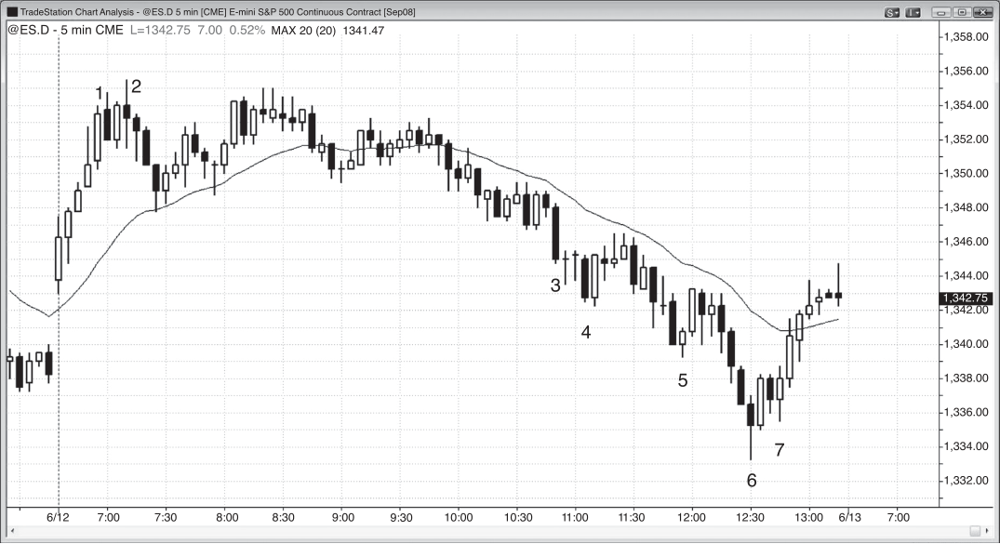

FIGURE 6.16
Good Setups Are Common
There are many good setups every day on every chart, and the more experience
you have in spotting them as they form, the better chance you have of being able to
profit from them.
In Figure 6.16, bar 1 was a two-bar reversal buy setup after taking out the low
of the open, and it was a higher low compared to yesterday’s low.
The small bear reversal bar before bar 2 tested the moving average and was
an attempt to make the two-bar reversal fail. It failed and became just a pullback
from the breakout above bar 1. When the market is trying to go up, it is good to buy
above pullbacks.
Bar 3 was a bear inside bar after an attempt to break above a bull trend channel line and yesterday’s high. This set up a short because if the market traded below its low, traders would think that the breakout had failed and there should be
a pullback.
Bar 4 was a doji bar after two other dojis, and a bar with a tiny body and a micro
wedge top made of dojis is rarely a reliable setup. The overlapping dojis represent
two-sided trading and therefore uncertainty. However, the three tails on the tops
of the bars were a sign of building selling pressure. A second entry setup came
two bars later in the form of a two-bar reversal, and the short entry was below the
lower of the two bars. That entry below that bear trend bar was also a break below
a micro double bottom formed by that bear bar and the doji bar two bars earlier.

<!-- PDF page 177 -->

Figure 6.16
SIGNAL BARS: OTHER TYPES
Bar 5 was a failed upside breakout above an ii.
Bar 6 was a bull reversal bar and a second attempt to rally on a test of the low
of the day.
Bar 7 was a doji but it was a pullback to the moving average with a bull body
after a strong move up, and it was the second attempt to rally (the first was the bar
before it).
Bar 8 was a bear inside bar, but it followed three strong bull trend bars. With
that much upward momentum, it is better to wait for a second entry before shorting.
Bar 8 was a two-bar reversal and in the middle of a two-bar reversal on a
higher time frame chart. The bull component of that higher time frame reversal
was formed by the three bull trend bars before bar 8, and the bear component was
the series of bear trend bars that ended at bar 11. Some higher time frame charts
would use all of those bars, and others would use most of the trades that took place
during those bars.
Bar 9 was a bull reversal bar but it was relatively small compared to recent
bars and therefore less likely to lead to a successful long. It was better to wait for
a second entry but one never came. Instead, the longs who bought above bar 9
were immediately trapped as the market reversed into an outside down bar. Selling
below the bar 9 low was acceptable because it would be capitalizing on those longs
who would have to sell out of their now losing positions. However, a trader would
have to think quickly to realize this and place an order.
Bar 11 was an ioi and a second-entry long setup on the push below the bar 7
swing low. On trading range days, the market often reverses breakouts above and
below prior swing points, and second signals are especially reliable. The first signal
was two bars earlier, but the downward momentum at that point was so strong
that it would have been unwise to buy there. Bar 13 was a risky long entry because
whenever there are three or more overlapping, relatively large bars sitting on the
moving average, the bull breakout is usually a trap.
Deeper Discussion of This Chart
On the open in Figure 6.16, the market continued the rally from yesterday’s close, pulling
back to the moving average and setting up a moving average pullback short. However,
the upward momentum was strong, so it was better not to take the first entry short and
instead to wait to see if there would be a second. The market fell below the open of the
day, and the breakout to the new low failed. This reversal up was a possible low of the
day, and it formed a double bottom with the first bar of the day and a higher low.
Bar 1 was a failed low 2 buy setup with the low before yesterday’s close being the
first push down.
Bar 2 was a strong follow-through bar for the long entry above bar 1, and it became
a large breakout bar after the failed low 2. A failed low 2 usually is followed by either one
more push up and a wedge bear flag short setup, or two more pushes up and a low 4

<!-- PDF page 178 -->

PRICE ACTION
Figure 6.16
short. If the breakout is strong, as it was here, the low 4 is more likely. Since it was such
a strong spike up, a channel up was also likely. The channel assumed the shape of a
wedge. Once either a wedge or a channel reverses, the first target is a test of the start
of the pattern.
Bar 3 was the expected low 4 short setup after the failed low 2. It was also the setup
for a reversal down from two wedge tops. The smaller one had the bar after bar 2 as the
first push, and the second push up occurred three bars later. The larger wedge began
with the second bar of the day and the second push was the bar after bar 2. Both wedges
should be followed by at least two legs sideways to down and they should test the start
of each wedge. The test of the start of the smaller wedge occurred three bars after bar 3.
It had two small legs, with the tail of the doji that formed two bars after bar 3 being the
first leg down. The bar bounced up into its close and the second push down came on the
next bar. This was a double bottom bull flag with the swing low that formed three bars
after bar 2, and this is a common setup when the market tests the bottom of a channel
or wedge.
These two small legs were just the first leg down for the larger wedge top, and bar 6
was the end of the second leg and the reversal up from the test of the bottom of that
wedge and a five-tick failed breakout.
Bar 5 was the third small sideways bar after a sell-off, and any sideways pattern
after a move can become a final flag, as it did here. Because it did so with a five-tick
failure, there were trapped bears who bought back their shorts above bar 6, adding to
the buying pressure. Bar 6 also formed a double bottom bull flag with the low of bar 1,
leading to the expected bounce. It also was the setup for the long from the wedge bull
flag that had its first push down three bars after bar 3 and its second push down three
bars before bar 5.
Bar 7 was a wedge bull flag in a strong up move. The first push down was the bar
just before 10 a.m. PST, and the second push down ended two bars before bar 7. Even
though dojis in general are not reliable signal bars, they can be for pullbacks in trends
or in strong legs in trading ranges.
Bar 8 was an inside bear trend bar that was the end of the second leg up in a trading
range day and a test of the high of the day, both of which often lead to a reversal. It also
followed a trend channel line breakout and the third push up in a bull channel (bar 5 was
the first).
Bar 11 was technically a high 3, but should be expected to behave like a high 2,
since the bar 10 outside bar bull trap should be considered the start of the downswing
(not the bar 8 actual swing high).

<!-- PDF page 179 -->

Figure 6.17

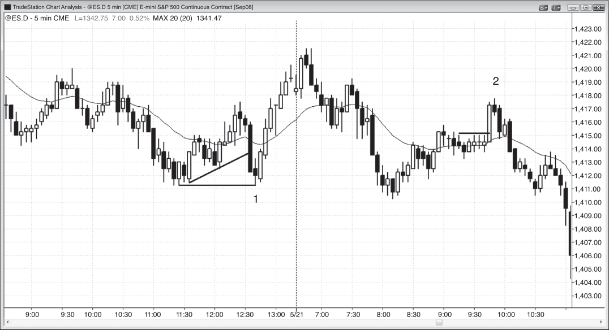

SIGNAL BARS: OTHER TYPES
FIGURE 6.17
A Bear Reversal Bar Can Lead to a Bull Flag
A bear reversal bar in a bull trend is not enough reason to go short and it sometimes
becomes a bull flag. In Figure 6.17, the bar after bar 1 was a strong bear reversal bar
but it followed five strong bull trend bars. In the absence of no prior strength by the
bears, it was not a short setup. Only a second entry could have been considered,
which was a short below bar 2. However, bar 2 was a doji and there were four
largely overlapping bars in a strong bull trend. Rather than short, it was better to
wait for a pullback to buy. The two-bar reversal at the moving average four bars
later was a good setup.
Although buying above a bear trend bar in a bull spike is often a good trade,
buying above the bear trend bar here or above the bull reversal bar that followed it
was risky. Bar 1 was a large bull trend bar after several other bull trend bars and it
was therefore climactic. There was too much risk of a sideways to down correction
after a buy climax. If you look at the highs of the bars up to bar 1, the slope was
increasing. This parabolic curvature is also a sign of climactic behavior and that
makes the risk of a correction significant. Buying a pullback or looking for a short
was a safer approach.
Bar 4 was a two-bar reversal following a breakout below two small doji bars
and the bar 3 breakout below a seven-bar horizontal bear flag near the moving
average. Because the trend down for the past 15 bars or so had only very small
pullbacks, this was a scalp long at best, despite the large outside up bull trend bar.

<!-- PDF page 180 -->

PRICE ACTION
Figure 6.17
Bar 5 was a small bull reversal bar with a close near its high and it was the third
push down in the past six bars, so buyers were starting to come in. Although the
market was still in the bear channel of the past couple of hours, this is a good long
scalp setup.
Bar 6 was a large bear trend bar with a big bottom tail and a close above the
midpoint of the bar, which can be enough of a show of strength by bulls to reverse
the market, especially after a collapse at the end of the bear trend. It was also an
overshoot of several bear trend channel lines (not shown). With four large bear
trend bars in a row, only a second-entry long can be considered, which came on the
bar 7 outside up bar. The bar 7 low was a small higher low, which is the start of the
second leg up. It is acceptable to buy above bar 6 but better to buy above the high
of a bull bar, like the bar after bar 6, and best to buy at a second signal. Bar 7 was
that second signal and you could buy either as soon as it went outside up, because
it went above the high of that strong bull bar that followed bar 6, or above the high
of bar 7.
Deeper Discussion of This Chart
In Figure 6.17, the market opened with a gap up and a bull trend bar, creating a bull
spike, and then pulled back a little on the second bar, trading as low as below the middle
of the first bar. This was the only pullback before the market went parabolic, creating a
gap spike and channel bull trend and a trend from the open bull trend. Parabolic means
that the trend accelerated after already being strong. Here, if you draw a trend channel
line across the highs of the first three bars, highlighting the slope of the trend, you will
see that the fourth bar broke above that trend channel line. If you continue to draw trend
channel lines across the highs of successive bars, you will see that the lines get steeper,
and then flatter at the high. This is a parabolic shape, and a parabolic move is a type of
buy climax. Since the market was still in a trend from the open bull trend, you should not
sell the first attempt at a pullback, because the first pullback is almost always followed
by a test of the high within a few bars.
As strong as the upward momentum was, traders should always be aware that the
market can reverse at any time, especially in the first hour. The market often races to
some magnet that often is not evident, and once it is tested, the market is then free to
do anything, including reverse.
Whenever there is any type of climax, once the market begins to correct, it usually
corrects in two legs and for at least 10 bars.
Just before bar 3, there was a seven-bar horizontal bear flag, and tight trading ranges
after a trend has gone for 10 or more bars often become final flags. There was a low 2
short signal with a bear signal bar, but because of the possibility of a final flag reversal,
it is better to only scalp the short. The breakout of the bear flag was the large bar 3 bear
trend bar, which is always a spike and a sell climax. When a sell climax forms after a

<!-- PDF page 181 -->

Figure 6.17
SIGNAL BARS: OTHER TYPES
protracted trend, it can fail and lead to a two-legged sideways to up correction lasting
about ten bars. However, there has been no significant sign of strength in the bear trend,
so if the market does try to reverse, it is better to look only for a scalp.
The spike was followed by a wedge bear flag that was formed by the doji after bar
3, the outside up bar after bar 4, and the small doji two bars later. It can also be viewed
as a low 2 short, with bar 4 being the first push down and the short being below the
small bull inside bar four bars later.
The move consisting of four strong bear trend bars down to bar 6 was another
spike and therefore another sell climax, and it was the third push down after the bar 3
spike. Channels that follow spikes often end with three pushes, but when the downward
momentum is so strong, it is better to wait for a second signal before looking to buy,
and this occurred with bar 7. A bear channel is a bull flag, so the market should rally
once it breaks above the bear channel. Also, it should test the start of the channel after
the bar 3 spike down, but sometimes the rally will not be completed until the next day.

<!-- PDF page 182 -->

PRICE ACTION
Figure 6.18

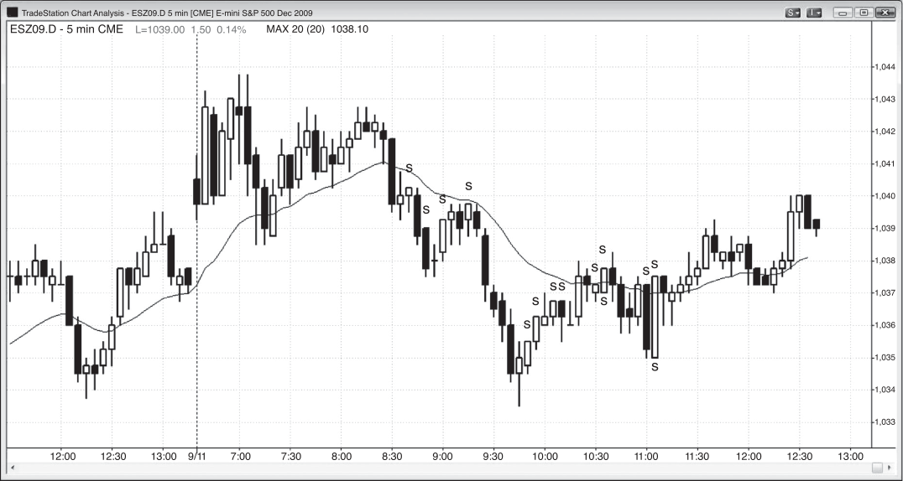

FIGURE 6.18
Weak Reversal Bars Need More
When a reversal bar is not particularly strong, it can still be a good setup if there is
an additional reason to take the trade.
In Figure 6.18, bar 1 was a relatively small bar after a big bear trend bar broke
out of a large flag, and might have been setting up a failed breakout of the flag. It
was also an exact test of the earlier low. On a trading range day with bar 1 setting
up these two reversals, it was a reasonable long setup, especially since the next bar
created a two-bar reversal buy setup. The rally up from bar 1 and the sell-off down
to the same price area the next day formed a two-bar reversal top on some higher
time frame chart, and a single reversal bar on an even higher time frame chart.
Bar 2 was a small bear reversal bar after a large bull trend bar that broke
out of a small trading range. This was an acceptable failed breakout short
signal bar.
Deeper Discussion of This Chart
The market broke out above yesterday’s high in Figure 6.18, but the breakout failed and
led to a trend from the open bear day.

<!-- PDF page 183 -->

Figure 6.18
SIGNAL BARS: OTHER TYPES
Bar 2 was a final flag sell setup after the failed breakout from a tight trading range.
Tight trading ranges after 10 or more bars of a swing often become final flags. It also was
a double top bear flag with the 7:30 a.m. PST high. Remember, close is close enough.
The bear trend that followed was huge and the market closed 30 points lower, but the
rest of the day is not shown because it would shrink this bull trend bar to the point of
looking unremarkable instead of how it appeared in real time.

<!-- PDF page 184 -->

PRICE ACTION
Figure 6.19

FIGURE 6.19
Shaved Bars Can Be Meaningless
Shaved tops and bottoms are not always a sign of strength. When many shaved tops
and bottoms occur close together, traders should be very careful because they may
represent low volume in a trading range instead of strength in a trend. In the first
cluster of four shaved tops in Figure 6.19 (indicated by “s”), the bear trend was still
strong. However, in the second cluster, the market was in a trading range and they
may just indicate that the volume was low. Be very careful about trading under
these circumstances.
Deeper Discussion of This Chart
The market broke out above yesterday’s high with a gap up in Figure 6.19, but the first
bar was a bear trend bar and therefore a sign of weakness by the bulls. The market could
have traded down in a failed breakout but instead broke to the upside with a strong bull
trend bar. This could have led to a strong trend from the open bull day but instead was
followed by a large bear trend bar. This set up a two-bar reversal for a failed breakout
short, but the short was never triggered and the longs were still holding their positions.
The market then broke to the upside out of the ii pattern; however, the breakout failed,
setting up a failed breakout short and a possible high of the day.

<!-- PDF page 185 -->

Figure 6.19
SIGNAL BARS: OTHER TYPES
When there are several bars with large ranges that form a tight sideways trading
range, entering on a breakout is risky because most breakouts will fail due to the magnetic effect of a tight trading range. The market broke out to the upside and then to the
downside, and then rallied offthe moving average back into the range. The spike down
to the moving average was followed by a lower pullback that formed a lower high and
then it evolved into a double top bear flag. The pullback to test the high of the day had
low momentum, indicated by many overlapping bars, several bear bars, and many bars
with tails. That is not how a strong bull leg looks.

<!-- PDF page 186: no extractable text (likely figure-only) -->

