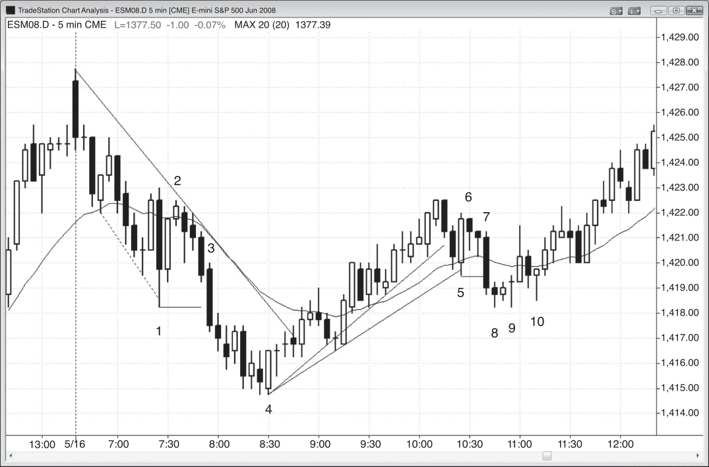
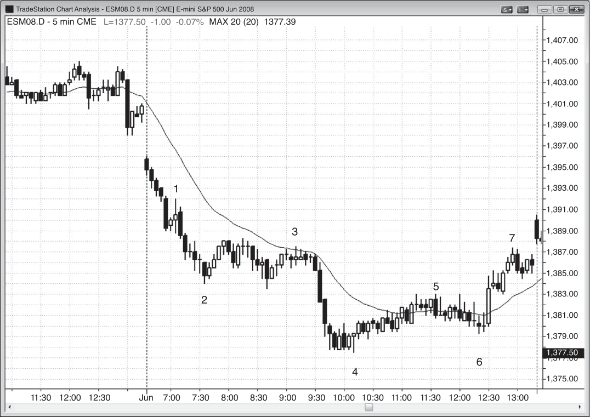
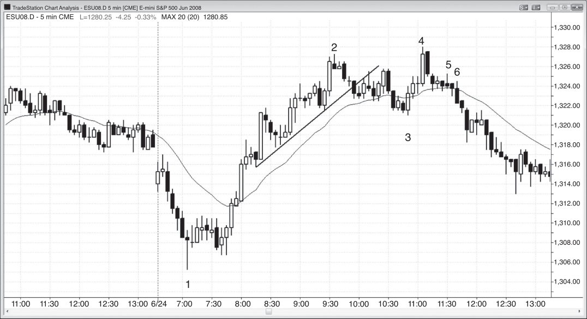

### CHAPTER 7 Outside Bars

<!-- Source PDF pages 187–200 -->

<!-- PDF page 187 -->

C H A P T E R 7
Outside Bars
I
f the high of the current bar is above the high of the previous bar and the low is
below the low of the previous bar, then the current bar is an outside bar. Outside bars are complicated to read because both the bulls and the bears were
in control at some point within the bar or the prior bar, and there are many subtleties in their analysis. The increased size of the bar means that bulls and bears
are willing to be more aggressive, but if the close is near the middle, it is essentially a one-bar-long trading range. In fact, by definition, since an outside bar totally
overlaps the prior bar, every outside bar is a part of a trading range, which is two
or more bars that largely overlap. At other times, they can act as reversal bars or
trend bars. Traders must pay attention to the context in which they occur.
Traditional technical analysis teaches that outside bars are setup bars for a
breakout in either direction, and that you should put an entry stop above and below. Once filled, double the size of the unfilled stop and make it a reversal order.
However, it is almost always unwise to enter on a breakout of a 5 minute outside
bar, especially if the outside bar is large, because of the greater risk that the distant stop entails. Sometimes they occur when you are looking for a major reversal
and you are very confident that there will be a large, strong reversal. When that
happens, it makes sense to enter as soon as the bar takes out the extreme of the
prior bar. If you are less certain, you can wait for the bar to close and then enter on
the breakout of the outside bar. If you did enter on the breakout of an outside bar
and the protective stop is too large, consider using a money stop (like two points
in the Emini) or trading fewer contracts. Since an outside bar is a one-bar trading
range and it is better to not buy at the top of a sideways market or sell below it, it
is usually best to not enter on a breakout of the bar.

<!-- PDF page 188 -->

PRICE ACTION
Outside bars can be reliable entry bars if the bar before them was a good signal
bar. For example, if a trader is looking to buy at the bottom of a bear swing and
the market forms a strong bull reversal bar but the next bar trades below the bar,
the trader should consider leaving the buy stop in the market. If the bar suddenly
reverses back above the bull signal bar, the buy stop will be triggered and the current bar will become an outside bar and an entry bar. In general, traders should
not enter a reversal trade on an outside bar unless the bar before it was a decent
signal bar.
Sometimes you have to enter on an outside bar (not on its breakout) because
you know that traders are trapped. This is especially true after a strong move. If an
outside bar occurs as the second entry in a strong reversal from a trend line break
or trend channel line overshoot, it can be an excellent entry bar. For example, if the
market just sold off below a swing low for the second time and reversed up from a
trend channel line overshoot, you are likely looking to buy and you keep moving a
buy stop order to one tick above the prior bar’s high until you get filled. Sometimes
the fill will be on an outside up bar. This is usually a good reversal trade and it is
due to strong buyers.
If an outside bar is in the middle of a trading range, it is meaningless and should
not be used to generate trades, unless it is followed by a small bar near the high
or low of the outside bar, setting up a fade. An outside bar in a trading range just
reaffirms what everyone already knows—that both sides are balanced and both will
sell near the top of the range and buy near the bottom, expecting a move toward
the opposite end of the outside bar. If the market instead breaks out in the other
direction, just let it go and look to fade a failed breakout of the outside bar, which
commonly happens within a few bars. Otherwise, just wait for a pullback (a failed
breakout that fails is a breakout pullback setup).
If the bar after the outside bar is an inside bar, then this is an ioi pattern (insideoutside-inside) and can be a setup for an entry in the direction of the breakout of
the inside bar. However, take the entry only if there is a reason to believe that the
market could move far enough to hit your profit target. For example, if the ioi is at
a new swing high and the second inside bar is a bear bar that closes near its low, a
downside breakout could be a good short since it is likely a second entry (the first
entry probably occurred as the outside bar traded below the low of the bar before
it). If it is in barbwire (a tight trading range), especially if the inside bar is large and
near the middle of the outside bar, it is usually better to wait for a stronger setup.
When a with-trend outside bar occurs in the first leg of a trend reversal and the
prior trend was strong, it functions like a strong trend bar and not a trading range
type of bar. For example, in a bear trend, if there is a strong reversal up, traders
might start looking for more of a rally. Many traders will be looking to buy above
the high of a higher low, and fewer traders will short below the low of the prior

<!-- PDF page 189 -->

OUTSIDE BARS
bar. If the bulls are especially aggressive, they will buy below the low of the prior
bar instead of waiting to buy above its high, and they will keep buying for the next
several minutes as more and more traders see that the bulls have taken control of
the market. This will make the bar extend above the high of that prior bar. Once it
does, it becomes an outside up bar and those bears who just shorted below the low
of the prior bar will likely cover and not be eager to short again for at least a couple
of bars. With very few bears and many aggressive bulls, the market is one-sided and
likely to go up at least for a bar or two. Everyone suddenly agrees about the new
direction and therefore the move will have so much momentum and extend so far
that it will likely get tested after a pullback, creating a second leg up. This higher
low, and not the actual bear low, is the start of the up leg because it is when the
market suddenly agreed that the next leg is up and not down. There will usually be
two legs up from the bottom of the outside bar. Although the swing up will appear
as three legs up from the actual bear low on the chart, it functionally is only two
legs up since the market did not agree about the bull move until the higher low
formed rather than at the actual low. This is where it became clear that the bulls
had seized control.
Why is the move often strong? The old bears who shorted below the low of the
prior bar, in what they thought would be just another bear flag, became trapped.
Then their entry bar quickly reversed to an outside bar up, trapping the bears in
and trapping the bulls out. Many bulls were trapped out because they don’t like
entering as outside bars are forming since many outside bars just lead to trading
ranges. Invariably, the market will trend up hard for many more bars as everyone
realizes that the market has reversed and they are trying to figure out how to position themselves. The bears are hoping for a dip so they can exit with a smaller loss,
and the bulls want the same dip so they can buy more with limited risk. When everyone wants the same thing, it will not happen because both sides will start buying
even two- or three-tick pullbacks, preventing a two- or three-bar pullback from developing until the trend has gone very far. Smart price action traders will be aware
of this possibility at the outset, and if they are looking for a two-legged extended
up move, they will watch the downside breakout of that bear flag carefully and anticipate its failure. They will place their entry orders just above the high of the prior
bar, even if it means entering on an outside bar up (especially if it is the entry bar
for the shorts).
If you think about this from an institution’s perspective, you will want the bear
flag short to trigger so that there will be longs who are trapped out and who will
chase the market up, and also new shorts who will be trapped in and will have to
cover if the bear breakout fails. This is an ideal situation for the institution that
wants and expects a rally. So, as an institution, what can you do to contribute to
this? Don’t buy aggressively until after the trap. In fact, you try to create the trap

<!-- PDF page 190 -->

PRICE ACTION
by selling until the short entry is triggered and then you buy aggressively as all
those bear traders get short and the longs exit with losses just below the low of
the prior bar. You take the opposite side of their positions and buy heavily below the low of the prior bar! Once you’ve trapped them all, you can buy aggressively all the way up; they will chase the market up once they see the trap, and
this will propel the market upward with everyone in agreement that the market is
heading higher.
The single most important thing to remember about outside bars is that whenever a trader is uncertain about what to do, the best decision is to wait for more
price action to develop.

<!-- PDF page 191 -->

Figure 7.1

OUTSIDE BARS
FIGURE 7.1
Outside Bars Are Tricky
Outside bars are risky, and traders have to pay careful attention to the price action
that led to them.
In Figure 7.1, bar 1 was an outside up bar in a strong bear trend, so traders
would be looking to enter only on a downside breakout. You could either short
below bar 1 or wait to see what the breakout bar looks like after it closes. Here,
it was a strong bear trend bar, and trapped longs will likely exit below such a
strong bear trend bar. Because of this, it makes sense to short below the low of that
bear bar.
Bar 5 was an outside down bar but the market was basically sideways with lots
of overlapping bars, so it was not a reliable setup for a breakout entry. The inside
bar that followed it (ioi) was too large to use as a breakout signal, because you
would be either selling at the bottom of a trading range or buying at the top and
you only want to buy low or sell high.

<!-- PDF page 192 -->

PRICE ACTION
Figure 7.1
Deeper Discussion of This Chart
The market broke out below yesterday’s low in Figure 7.1, and the first bar was a bear
trend bar and the first bar of a trend from the open bear trend. Bar 1 and the bar before
it formed the first pullback, and there is usually at least a scalp down after that first
pullback. There was a two-legged pullback to the moving average at bar 3, which was
also a 20 gap bars short setup.

<!-- PDF page 193 -->

Figure 7.2

OUTSIDE BARS
FIGURE 7.2
An ioi Pattern
Outside bars are tricky because both the bulls and bears were in control at some
point during the bar or during the prior bar, so the movement over the next few
bars can have further reversals. In Figure 7.2, bar 1 was an outside bar that formed
an inside-outside-inside (ioi) pattern. The bar 2 breakout of the inside bar following bar 1 failed, which is common, especially when the inside bar is large. This is
because longs were forced to buy near the top of the ioi pattern, which is a trading
range, and that is never a good thing, particularly when the market is falling.
Bar 2 was a small bar near the top of the trading range, which is a good area
in which to look for a short entry. Since traders expected bulls to exit with a loss
below the low of bar 2, their entry bar, they shorted at one tick below bar 2, which
was a failed ioi breakout at the top of a trading range. Since the ioi bars were so
large, there was plenty of room below bar 2 for at least a scalp down.
Bar 4 was almost an outside up bar, and in trading if something is almost a
reliable pattern, it will likely yield the reliable result. Bar 4 was the third bull trend
bar in the prior five bars, and therefore was reversing up from a third push down. It

<!-- PDF page 194 -->

PRICE ACTION
Figure 7.2
was also the strongest, with the biggest range and smallest tails, indicating that the
bulls were gaining strength.
Bar 5 was an outside bar followed by a small inside bar near its high. Again,
this yielded a great short with minimal risk, especially since the inside bar was a
bear bar.
Deeper Discussion of This Chart
The first bar in Figure 7.2 broke out above yesterday’s high and the breakout failed. The
bar became a strong bear trend bar and it set up a trend from the open short.
Bars 8 and 9 formed a small double bottom, which was not the downward momentum
that traders were expecting after the bar 7 bear breakout bar. This loss of downward
momentum was followed by the bar 10 double bottom pullback long.
Bar 9 was also a high 2 long on the two-legged pullback from the rally up from bar 4.
This formed a higher low on the day after the break of the bear trend line, setting up a
possible trend reversal.

<!-- PDF page 195 -->

Figure 7.3

OUTSIDE BARS
FIGURE 7.3
Outside Bars Depend on Context
Outside bars have to be evaluated in context. In Figure 7.3, the doji inside bar after
bar 1 was not a good short signal bar since there were three sideways bars and
bar 1 just reversed the bear bar before it. The odds were that the market would go
sideways or up for at least a bar or two after that opening reversal, especially with a
relatively flat moving average. There was room up to the moving average for a scalp,
and it is best to buy above bull bars. The inside bar was a pause and therefore a type
of pullback after the reversal up, so buying above its high and above the bar 1 high
was reasonable. A trader could place a buy stop one tick above bar 1, and when
bar 2 traded below the inside bar it was wise to keep the stop in place. The logic
behind the long remained, and now there were trapped shorts who had made the
mistake of selling below a weak signal bar and would cover above the signal bar.
This made entering long on bar 2 as soon as it went outside up a good trade. As long
as the bar before the outside bar is a decent signal bar, entering on the outside bar
can be a sensible trade.
Bar 3 was a bear reversal bar near the moving average and an acceptable short,
but it was small compared to the bull bodies of bars 1 and 2 so the market might
form a higher low and then rally some more, which often happens when there is
a strong outside trend bar at a possible trend reversal. Therefore, whether or not

<!-- PDF page 196 -->

PRICE ACTION
Figure 7.3
traders shorted below bar 3, they had to be ready to buy a higher low, and the small
bull ii two bars later was a good signal.
Bar 4 was an outside bar, but the market was sideways for five bars. Therefore
it was just part of the trading range and not a signal bar.
Bar 5 was an even larger outside bar, forming an oo or outside-outside pattern.
This is usually just a larger trading range. Here, the bar had a large bear body and
closed below the low of bar 4; traders who mistakenly shorted below the bar 4
outside bar were trapped. In general, it is not good to short a breakout of a trading
range when many of the bars in the trading range are relatively large and have big
tails, because the odds that the breakout will fail are high. The small bull doji bar
that followed was a good signal bar for a failed reversal long.
Bar 6 set up a short following the breakout of the top of an outside up bar.
Bar 7 broke to a swing high and reversed down as an outside bar that closed
on its low. This is an instance where there were trapped bulls and a strong bear
reversal after a rally. However, this was a trading range day and any time a leg
lasts more than five bars, traders will be looking for a reversal (“Buy low, sell high”
on trading range days). Although it was acceptable to short as the bar traded below the small bear bar before it, it would be better to sell below the low of bar 7
since you would be shorting below a strong bear reversal bar as it is getting some
follow-through.
Deeper Discussion of This Chart
The market broke out to the downside with a large gap down and a bear trend bar in
Figure 7.3, but instead of trading down and creating a trend from the open bear trend,
the breakout to the downside failed and the market reversed up into a trend from the
open bull day.
Bar 2 was an outside bar up and a possible low of the day since the market was
reversing up from a big gap down. This means that it was on bar 2 that the market
decided that the trend was up and therefore it should be considered the start of the
move up. Although bar 3 was a low 2 short, it was seen by the market as just a low 1
because it was the first pullback in the move up from the bar 2 start of the rally, and
therefore likely to just lead to a higher low. Traders were expecting it to fail, and it does
not matter whether you see the move up as a failed low 2 or a failed low 1 because both
are good buy setups in a possible bull trend.
Bar 5 was a breakout of a barbwire pattern; most breakouts from barbwire fail, so
traders should look for the fade setup. Barbwire is an area of intense uncertainty and
two-sided trading. Bulls buy aggressively near the low and stop buying near the high.
Bears sell aggressively near the high but stop shorting near the low. There are large buy
and sell programs at work here, as can be seen by the good volume being traded during
each bar. Both bulls and bears are comfortable trading here, and if one side is able to

<!-- PDF page 197 -->

Figure 7.3
OUTSIDE BARS
briefly overwhelm the other and create a breakout, usually the magnetic effect of the
pattern will pull the market back. Once the market broke to the downside, the bulls,
who were happy to buy higher in the middle of that trading range, were even happier
buying lower. Also, the bears, who were happy selling at the top of the trading range,
would be quick to buy back their shorts if there was not immediate follow-through on the
breakout. These factors led to the high probability that the breakout would fail and get
pulled back into the barbwire, as was the case here. Sometimes the market then breaks
out of the other side and other times the trading range continues. Eventually there will
be a move out of the pattern.
The first bar of the day and the first several bars often foreshadow what the next few
hours, and often the entire day, will look like. The day started with a two-bar reversal,
and then a doji, which is an intrabar reversal, and then an outside up bar reversal. There
was then a bear reversal and several small bars with tails, indicating uncertainty. Multiple
reversals, big tails, and uncertainty are all characteristics of trading range days, which
was what the day became. With that suspicion early on, traders were more comfortable
placing trades in both directions, scalping a larger portion of their positions, and less
inclined to swing.
At 11:25 a.m. PST, there was a bull outside bar that formed a two-bar reversal, and
therefore, created a buy setup. This pattern also formed a micro double bottom with the
doji bar before it.

<!-- PDF page 198 -->

PRICE ACTION
Figure 7.4

FIGURE 7.4
An Outside Bar as an Entry Bar
An outside bar can sometimes be a reasonable entry bar. In Figure 7.4, bar 3 was
an outside up bar and an acceptable entry bar because it was a reversal up after a
two-legged correction in a strong bull trend, and there was a bull trend bar a couple
of bars earlier, showing strength. Traders would buy as soon as the bar went above
the high of the prior bar, but it would be safer to wait a few more ticks until it went
above the high of that bull trend bar from two bars earlier. Buying above a bull bar
usually has a higher chance of leading to a profitable trade. Finally, traders could
wait for the close of the outside up bar to see if it closed near its high and above the
prior bar, which it did. Once they see that strength, they could buy above the high
of the outside bar.
Bar 6 was an outside down bar and five of the six prior bars had bear bodies.
It closed on its low, and aggressive traders could have shorted below it after such
bear strength, especially since it trapped bulls into buying the old bull trend, which
now may be over.
Deeper Discussion of This Chart
The market in Figure 7.4 broke out below the trading range of the final hour of yesterday.
The first bar was a bull trend bar but it had a large tail on the top, indicating that the

<!-- PDF page 199 -->

Figure 7.4
OUTSIDE BARS
bulls were not strong enough to close the bar on its high. You could either buy above this
bar or wait. The second bar was a setup for a breakout pullback short for a trend from
the open bear day. The move down to bar 1 was a parabolic sell climax and therefore
a possible low of the day. Since the selling was strong, it would be better to wait for a
second signal before buying, and it came eight bars later in the form of a higher low and
a failed breakout of a bear flag.
The sell-offto bar 3 broke a major trend line, alerting traders to short a test of the
bar 2 high. The bar before bar 3 was a moving average gap bar buy setup in a strong
trend, so buying above it, even with an outside up bar, was a good trade. The move down
to a 20 gap bars setup almost always breaks a trend line, and the move up from the bar
usually tests the high of the trend with either a higher high or a lower high. If there is
then a reversal down, it usually leads to at least two legs lasting at least 10 bars and
often a trend reversal.
Bar 3 was also the second bar of a two-bar reversal with the bear bar before it and
with the bear bar from two bars earlier, so many bulls bought above the high of bar 3.
Bar 4 was a large bull trend bar (climactic) that formed a higher high, and it was
followed by a strong bear inside bar that was the signal for the short. Traders were expecting two legs down from such a strong setup. As such, smart traders will be watching
for the formation of a high 1 and then a high 2 and readying themselves to short more
if these long setups fail and trap the bulls.
Bar 5 was a short setup for a failed high 1, and bar 6 was a great bull trap. It was a
failed high 2, and the long entry bar reversed into an outside bar down, trapping longs
in and bears out. This outside bar acted like a bear trend bar and not just an outside bar.
Because it was an outside bar, the entry bar and its failure happened within a minute
or two of each other, not giving traders enough time to process the information. Within
a bar or two, they realized that the market in fact had become a bear trend. The longs
were hoping for a two- or three-bar pullback to exit with a smaller loss, whereas the
bears were hoping for the same rally to allow for a short entry with a smaller risk. What
happened was that both sides started selling every two- or three-tick pullback, so a twoor three-bar rally did not come until the market had gone a long way.
Note that the high 2 long was a terrible buy setup because five of the six prior bars
were bear bars and the other bar was a doji. A high 2 alone is not a setup. There first
has to be earlier strength, usually in the form of a high 1 leg that breaks a trend line, or
at least an earlier strong bull trend bar.

<!-- PDF page 200: no extractable text (likely figure-only) -->

