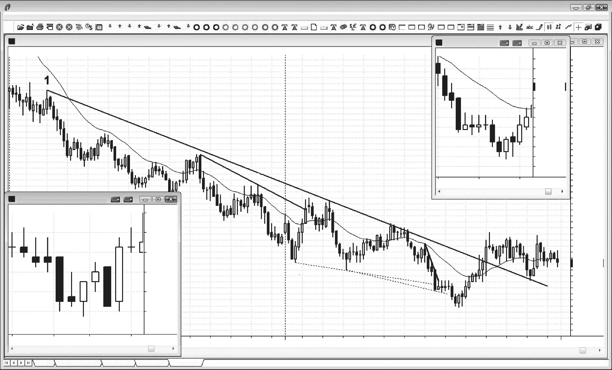

### CHAPTER 8 The Importance of the Close of the Bar

<!-- Source PDF pages 201–204 -->

<!-- PDF page 201 -->

C H A P T E R 8
The Importance
of the Close of
the Bar
A
5 minute bar usually assumes something similar to its final appearance seconds to a minute or more before the bar closes. If you enter before the bar
closes, you might occasionally make a tick or so more on your trade. However, once or twice every day, the signal that you thought was going to happen does
not and you will lose about eight ticks. That means that you need about eight early
entries to work as planned for every one that does not, and that simply won’t happen. You can enter early with trend in a strong trend and you will likely be fine.
However, when there is a strong trend, you have so much confidence in the signal
that there is no downside to waiting for the bar to close and then entering on a stop
beyond the bar. You cannot be deciding on every bar if an early entry is appropriate, because you have too many other important decisions to make. If you add that
to you list of things to think about, you will likely end up missing many good trades
every day and forgo far more in missed opportunities than you could gain on an
occasional successful early entry.
This holds true for all time frames. For example, look at a daily chart and you
will see many bars that opened near the low but closed in the middle. Each one of
those bars was a strong bull trend bar with a last price on the high at some point
during the day. If you bought under the assumption that the bar was going to close
on its high and bought near the high and instead it closed in the middle, you would
realize your mistake. You are carrying home a trade that you never would have
entered at the end of the day.
There are two common problems that regularly occur on the 5 minute chart.
The most costly is when you try to pick a bottom in a strong trend. Typically you
will see a lower low after a trend line break and traders will be hoping for a strong

<!-- PDF page 202 -->

PRICE ACTION
reversal bar, especially if there is also a bear trend channel line overshoot. The bar
sets up nicely and is a strong bull reversal bar by the third minute or so. The price is
hanging near the high of the bar for a couple of minutes, attracting more and more
countertrend traders who want to get in early so that their risk will be smaller
(their stop will be below the bar), but then with one to five seconds remaining
before the bar closes, the price collapses and the bar closes on its low. All of those
early longs who were trying to risk a tick or two less end up losing two points or
more. These longs let themselves get trapped into a bad trade. A similar situation
happens many times a day when a potential signal bar is forming just before the
bar closes. For example, a trader might be looking to short below a bear reversal
bar that has seconds to go before it closes, and the current price is on the bottom
of the bar. With less than a second before the bar closes, the close bounces up two
or three ticks from the low of the bar, and the bar closes off its low. The market is
telling the trader that the signal is now weaker, and the trader needs to avoid getting
trapped into trading based on the expectation and hope that she had just three
seconds ago.
The other common problem is getting trapped out of a good trade. For example, if you just bought and your trade has had three to five ticks of open profit but
the market just can’t hit six, allowing you to scalp out with four ticks of profit, you
start to become nervous. You look at the 3 or 5 minute chart with about 10 seconds
before its bar closes and it is a strong bear reversal bar. You then move your protective stop up to one tick below that bar, and just before the bar closes, the market
drops and hits your stop, only to pop up several ticks in the final two seconds of
the bar. Then, within the first 30 seconds of the next bar, the market quickly goes
up to six ticks where smart traders took partial profits while you are sitting on the
sidelines. Good entry, good plan, bad discipline. You just let yourself get trapped
out of a good trade. If you had followed your plan and relied on your initial stop
until the entry bar closed, you would have secured your profit.
There is one other point about bar closes. Pay very close attention to the close
of every bar, especially for the entry bar and the bar or two later. If the entry bar
is six ticks tall, you would much prefer seeing the body suddenly increase from a
body that was two ticks to one that was four ticks in the final seconds of the bar.
You will then likely reduce the number of contracts that you will scalp out. This is
true for the next couple of bars as well. If there are strong closes, you should be
more willing to swing more contracts and hold them for more points than if these
bars had weak closes.
Another reason why the close is important is that many institutional traders
place orders based on value and not price action, and when they look at charts, the
charts are line charts, which are based on the close. They would not look at charts
at all if the charts did not influence their decision making, and the only price they
are considering is the close, which increases its importance.

<!-- PDF page 203 -->

Figure 8.1

THE IMPORTANCE OF THE CLOSE OF THE BAR
FIGURE 8.1
Smaller Time Frame Charts Result in More Losses
Smaller time frame charts allow for smaller stops but have a greater risk of stopping
a trader out of a good trade. In Figure 8.1, the insert on the left shows that traders
using the 3 minute chart were stopped out, but traders who relied on the 5 minute
chart did not get stopped out.
The 5 minute Emini had been in a strong bear trend for weeks and was now
starting to have bigger pullbacks. Each new lower low was being bought, and the
longs were profitable countertrend trades. The bulls were more confident and the
bears were becoming more willing to take profits. The thumbnail on the left is a
3 minute chart and the one on the right is a close-up of the 5 minute chart.
Bar 11 was a strong bull reversal bar and a two-bar reversal, and it was the
second attempt to reverse up from a lower low (the ii after bar 10 was the first)
and it was the third push down on the day (a possible wedge bottom). This was
a high-probability long, but the stop would have had to be beneath its low, three
points below the entry price. This was more than what was typically required in
the Emini (two points worked recently and when the average daily range had been
about 10 to 15 points), but that was what the price action showed was needed. If

<!-- PDF page 204 -->

PRICE ACTION
Figure 8.1
traders were nervous, they could have just traded half size, but they must take a
strong setup like this one and plan on swinging half.
This is a perfect example of a common problem that traders face when they
try to reduce risk by watching a smaller time frame chart. The risk is smaller but
the probability of success also drops. Since there are more trades on a 3 minute
chart, there is more risk of missing the best ones, and this can lead to the overall
profitability of 3 minute trades being less for many traders.
Just like on the 5 minute chart, the 3 minute chart also had a reversal bar at
bar 11. However, the stop below the entry bar was hit by a bear trend bar with a
shaved top and bottom, indicating strong sellers. At this point, it would have been
very difficult to reconcile that with the 5 minute chart where the stop had not been
hit. The large size of the stop required on the 5 minute chart would make traders
more willing to exit early and take a loss. If traders were also watching the 3 minute
chart, they almost certainly would have exited with a loss and would have been
trapped out of the market by that strong bear trend bar. The next bar on the 3
minute chart was a very strong outside bull trend bar, indicating that the bulls were
violently asserting themselves in creating a higher low, but most of the weak hands
who were stopped out would likely be so scared that they would not take the entry,
and instead wait for a pullback.
Stop runs on the 3 minute chart are much more common than on the 5 minute
chart at important reversals, and smart traders look at them as great opportunities. This is because they trap weak longs out of the market, forcing them to chase
the market up. It is always better to just watch and trade off one chart because
sometimes things happen too quickly for traders to think fast enough to place their
orders if they are watching two charts and trying to reconcile the inconsistencies.
Deeper Discussion of This Chart
Bar 5 broke above a trend line in Figure 8.1, and bar 8 exceeded another by a fraction
of a tick. Both breakouts failed, setting up with-trend shorts.
