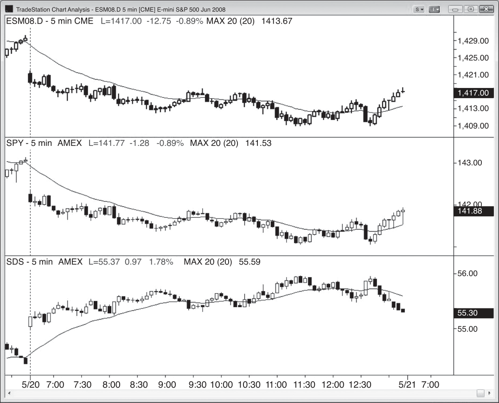

### CHAPTER 9 Exchange-Traded Funds and Inverse Charts

<!-- Source PDF pages 205–208 -->

<!-- PDF page 205 -->

C H A P T E R 9
Exchange-Traded
Funds and
Inverse Charts
S
ometimes the price action becomes clearer if you change something about
the chart. You can switch to a bar or line chart, a chart based on volume
or ticks, or a higher or lower time frame, or you can simply print the chart.
Several exchange-traded funds (ETFs) are also helpful. For example, the SPDR
S&P 500 ETF (SPY) is almost identical in appearance to the Emini chart and sometimes has clearer price action.
Also, it can be helpful to consider the chart from an opposite perspective. If
you are seeing a bull flag but something doesn’t seem quite right, consider looking
at the ProShares UltraShort S&P 500 (SDS), which is an ETF that is based on the
inverse of the SPY (but with twice the leverage). If you look at it, you might discover
that the bull flag that you were seeing on the Emini and SPY might now look like a
rounding bottom on the SDS. If it does, you would be wise not to buy the Emini flag
and instead to wait for more price action to unfold (like waiting for the breakout
and then shorting if it fails). Sometimes patterns are clearer on other stock index
futures, like the Emini Nasdaq-100, or its ETF, the QQQ, or its double inverse, the
QID, but it is usually not worth looking at these and it is better to stick with the
Emini and sometimes the SDS.
Since an ETF is a fund, the firm that runs it is doing so to make money and
that means that it takes fees from the ETF. The result is that the ETFs don’t always
track exactly with comparable markets. For example, on triple witching days, the
SPY will often have a much larger gap opening than the Emini, and the gap is due
to a price adjustment to the SPY. It will still trade pretty much tick for tick with the
Emini throughout the day, so traders should not be concerned about the disparity.

<!-- PDF page 206 -->

PRICE ACTION
Figure 9.1

FIGURE 9.1
The Emini and the SPY Are Similar
As shown in Figure 9.1, the top chart of the Emini is essentially identical to that
of the SPY (the middle chart), but the price action on the SPY is sometimes easier
to read because its smaller tick size often makes the patterns clearer. The bottom chart is the SDS, which is an ETF that is the inverse of the SPY (with twice
the leverage). Sometimes the SDS chart will make you reconsider your read of the
Emini chart.

<!-- PDF page 207 -->

Figure 9.2

EXCHANGE-TRADED FUNDS AND INVERSE CHARTS
FIGURE 9.2
SPY Adjustment on Triple Witching Days
As shown in Figure 9.2, on a triple witching day the SPY’s price gets adjusted, and
this often results in a gap opening that may be much larger than that on the Emini
(the SPY is on the left and the Emini is on the right). However, they then pretty
much trade tick for tick, like on any other day, so don’t be concerned by the gap
and just trade the price action as the day unfolds.

<!-- PDF page 208: no extractable text (likely figure-only) -->

