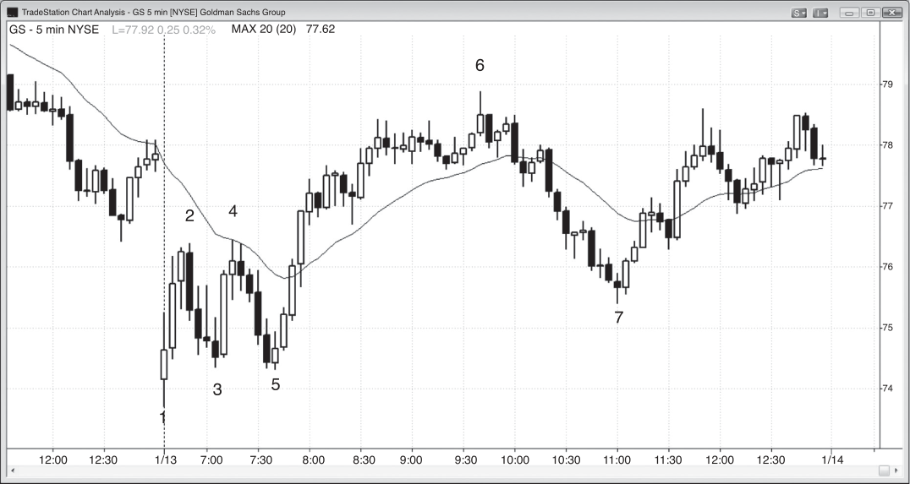

### CHAPTER 12 Pattern Evolution

<!-- Source PDF pages 217–222 -->

<!-- PDF page 217 -->

C H A P T E R 1 2
Pattern Evolution
I
t is important to remember that the current bar can always be the start of a big
move in either direction, and you have to watch carefully as the price action
unfolds to see if a pattern is changing into something that will lead to a trade
in the opposite direction. Patterns frequently morph into other patterns or evolve
into larger patterns, and both can result in trades in the same or in the opposite direction. Most of the time, if you read the price action correctly, the original pattern
will provide at least a scalper’s profit. Likewise, the larger pattern should as well. It
does not matter whether you label the larger pattern as an expanded version of the
original pattern. Names are never important. Just make sure that you read correctly
what is in front of you and place your trade, ignoring the pattern that completed a
couple of bars earlier.
The most common example of a morphed pattern is a failure, where a pattern
fails to yield a scalper’s profit and then reverses into a signal in the other direction. This traps traders on the wrong side of the market, and as these traders are
forced to exit with losses, they will then provide the fuel that will drive the market
to at least a scalper’s profit in the opposite direction. This can happen with any
pattern, since all can fail. If the failure just goes sideways for a number of bars and
then a new pattern develops, it makes more sense to simply regard the new pattern as being independent of the first. Ignore the first one because there will not
be many trapped traders left who will drive the market as they are forced to exit
with losses.
Although it is not important at this point to be familiar with all of the patterns
in the book, in later chapters you will see common examples of pattern evolution.
An expanding triangle sometimes expands from five legs to seven. A micro trend

<!-- PDF page 218 -->

PRICE ACTION
line breakout usually fails and then has a breakout pullback. When a final bear flag
fails to reverse the market, it usually morphs into a breakout pullback sell setup. It
then often enlarges into a wedge reversal setup, or into a larger trading range that
often becomes a larger final flag. A bull spike and channel trend pattern usually
evolves into a trading range and then a double bottom bull flag. In the first hour,
double top bear flags often evolve into double bottom bull flags and vice versa. If
you are aggressively trading the market in question, you should look to take both
entries, and swing part of them, because a big move is common from either the first
or second of these patterns.

<!-- PDF page 219 -->

Figure 12.1

PATTERN EVOLUTION
FIGURE 12.1
Setups Can Evolve into More Complex Patterns
Reliable patterns fail about 40 percent of the time and often evolve into larger patterns that set up entries in either direction. Figure 12.1 is the 5 minute EWZ, which
is the iShares MSCI Brazil Index Fund. Here, the low 2 short setup below bar 2
failed but the pattern evolved into a larger wedge top with an entry below the bar
that followed bar 3.
The bar 19 low 2 bear flag evolved into a more complex low 2 short setup below
the bar 21 two-bar reversal. The first push up was bar 18.
Deeper Discussion of This Chart
The high 2 after bar 6 in Figure 12.1 evolved into a wedge bull flag above bar 8 at the
moving average. It was also a spike and channel bear where bar 8 was the third push
down in the channel, which is often the end of the channel.
The low 2 at bar 10 was likely to fail since the spike up to bar 9 was strong. The
low 1 entry was two bars before bar 10. The pattern became a failed low 2 buy at bar 11
and then a spike and channel top at bar 12, where the channel ended in the third push
up, which is common.
The bar 15 high 2 failed and the pattern turned into a second attempt to reverse
down at a new high of the day. The entry was below the high 2 entry bar that followed
bar 15.

<!-- PDF page 220 -->

PRICE ACTION
Figure 12.2

FIGURE 12.2
Breakout Mode in the First Hour
In the first hour, it is common to see both a double top and a double bottom, putting
the market in breakout mode. In Figure 12.2, the double top in GS evolved into a
double bottom bull flag. This is a common pattern, and you should take both entries
(short below bar 4 and then go long above bar 5) and swing part because a big move
commonly follows either the first or the second pattern. Remember, one extreme
usually forms in the first hour, which means that the market will then usually move
away from that price for much of the next couple of hours, and possibly all day if
the day becomes a trend day. Here, GS had a large gap down that broke below a
trend channel line from yesterday and reversed up on the first bar of the day. The
market formed a low 2 and a double top bear flag at the falling moving average at
bar 4, only to reverse up at the bar 5 double bottom bull flag. The market then ran
up $3 to the bar 6 high of the day.
Deeper Discussion of This Chart
Large gap openings often lead to trend days in either direction. With the first three bars
strongly up in Figure 12.2, a bull trend was more likely, especially after a reversal up
from the overshoot of the bear trend channel from yesterday. However, the bear trend
tried to reassert itself at the moving average but when the market came down to bar 5,
it again found strong bulls in the area of the low of bar 3. The bar 4 second attempt to

<!-- PDF page 221 -->

Figure 12.2
PATTERN EVOLUTION
create a bear trend day failed, and the market then proceeded to create a bull channel
once the bar 5 second attempt to form a bottom succeeded.
The market had bull spikes up to bar 2 and bar 4 and bear spikes down to bar 3
and bar 5. This often results in a trading range as the bulls and bears continue to trade
in an attempt to generate a channel in their direction. Here, the market formed a very
strong five-bar bull spike up from bar 5 and then a three-push channel up to bar 6. Some
traders will look at this chart and say that the move up to bar 2 was a spike and the
trading range to bar 5 was a pullback that led to a channel up to bar 6. Other traders
will say that the spike up from bar 5 was the dominant feature of the day and that the
bull channel began once that five-bar bull spike ended. There is no one clear answer and
both traders have valid interpretations. The important thing is to see that the bull spikes
up from bar 1 and bar 5 were stronger than the bear spikes down from bar 2 and bar 4,
and therefore the odds favored a bull channel.
This could have been a trend from the open bull trend day but instead became a
trending trading range day. Bar 7 tested down into the lower trading range and then
reversed up into the close, near the high of the higher trading range.

<!-- PDF page 222: no extractable text (likely figure-only) -->

