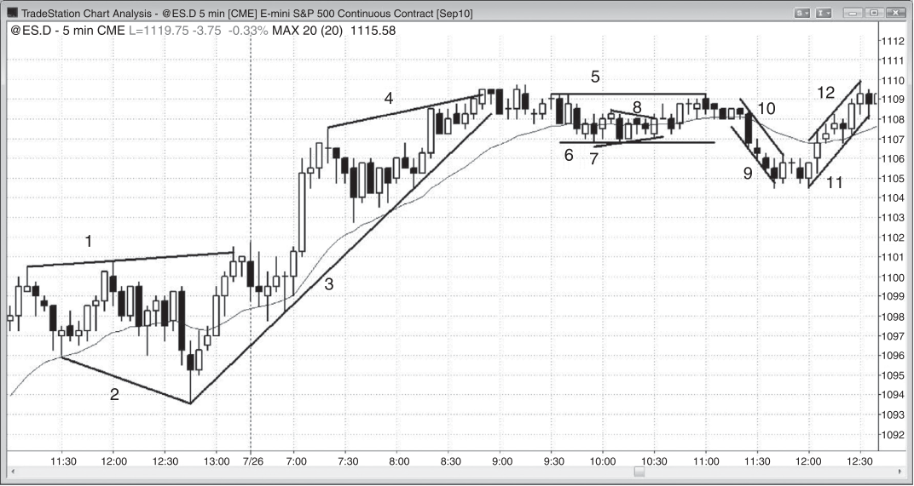

## PART II Trend Lines and Channels

<!-- Source PDF pages 223–226 -->

<!-- PDF page 223 -->

P A R T II
Trend Lines
and Channels
A
lthough many traders refer to all lines as trend lines, it is helpful to traders
to distinguish a few subtypes. Both trend lines and trend channel lines are
straight, diagonal lines that contain the market’s price action, but on opposite sides, forming a channel. In a bull trend, the trend line is below the lows and the
trend channel line is above the highs, and in a bear trend, the trend line is above the
highs and the trend channel line is below the lows. The lines defining the channel
most often are parallel or roughly parallel, but are convergent in wedges and most
other triangles, and divergent in expanding triangles. Trend lines most often set up
with trend trades, and trend channel lines are most helpful finding tradable countertrend trades. Curved lines and bands are too subjective and therefore require too
much thought when you are trying to place trades quickly.
A channel can be up, down, or sideways, as is the case in a trading range. When
the channel is sideways, the lines are horizontal and the line above is the resistance line and the line below is the support line. Some stock traders think of a
resistance line as an area of distribution, where traders are exiting their longs, and
support lines as an area of accumulation, where traders are adding to their longs.
However, with so many institutions now shorting as much as they are buying, a resistance line is just as likely to be where they are initiating a new short as it is that
they are exiting or distributing their longs. Also, a support line is just as likely to be
an area where they are exiting or distributing their shorts as it is a place where they
are initiating longs.

<!-- PDF page 224 -->

TREND LINES AND CHANNELS
Figure PII.1

FIGURE PII.1
Lines Highlight Trends
Lines can be drawn to highlight the price action, making it easier to initiate and
manage trades (see Figure PII.1).
Line 1 is a trend channel line above an expanding triangle, and line 2 is a trend
channel line below an expanding triangle. Because the channel was expanding,
there was no trend and therefore no trend line.
Line 3 is a trend line below the bars in a bull trend and is a support line, but line
10 is a trend line above the highs in a bear trend and is a resistance line.
Line 4 is a trend channel line in a bull trend and is above the highs, and line 9 is
a trend channel line in a bear trend and is below the lows.
Lines 5 and 6 are horizontal lines in a trading range, which is just a horizontal
channel. Line 5 is above the highs and is a resistance line and line 6 is below the
lows and is a support line.
The channel formed by lines 3 and 4 is convergent and rising and therefore
a wedge.
Lines 7 and 8 are trend lines in a small symmetrical triangle, which is a convergent channel. Since there is both a small bear trend and a small bull trend within a
symmetrical triangle, the channel is made of two trend lines, and there is no trend
channel line. A convergent triangle can be subdivided into symmetrical, ascending, and descending types, but since they all trade the same way, these terms are
not necessary.

<!-- PDF page 225 -->

Figure PII.1
TREND LINES AND CHANNELS
Deeper Discussion of This Chart
The first bar of the day broke above yesterday’s high in Figure PII.1, but the breakout
failed. Since the final six bars of yesterday were bull trend bars, only a second-entry short
could be considered, but there was no reasonable signal. The market entered a small
trading range for the first seven bars, and therefore the market was in breakout mode.
Traders would buy on a stop at one tick above the high and go short at one tick below
the low of the opening range. The market broke to the upside and a minimal target was
a measured move up equal to the height of the expanding triangle.

<!-- PDF page 226: no extractable text (likely figure-only) -->

