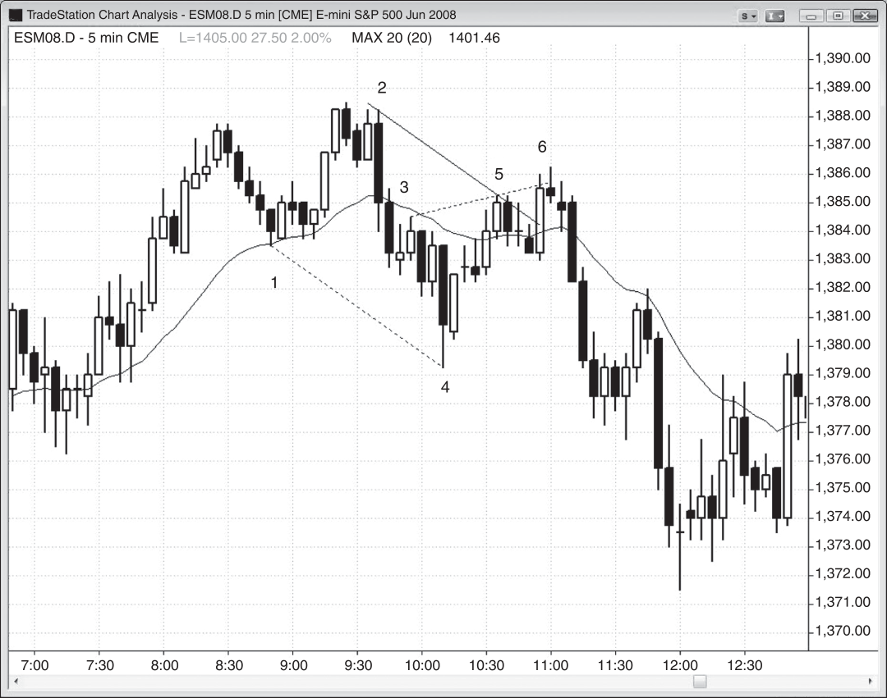
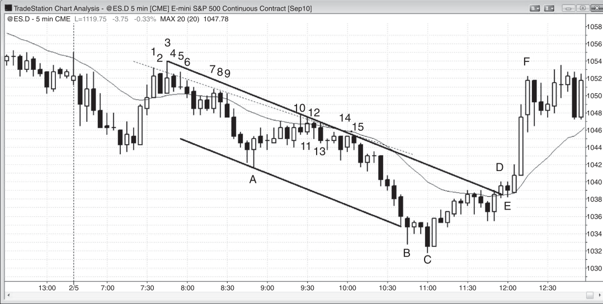
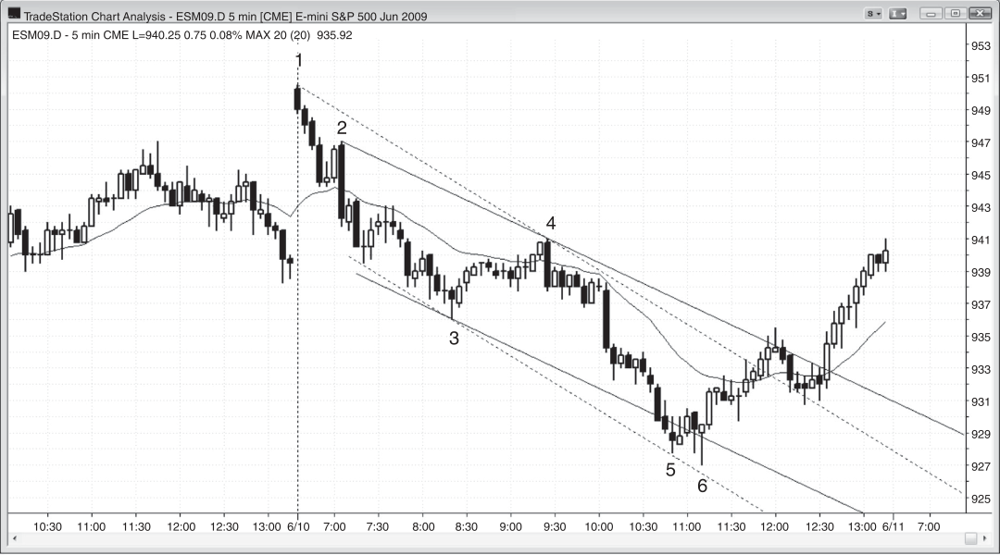

### CHAPTER 13 Trend Lines

<!-- Source PDF pages 227–240 -->

<!-- PDF page 227 -->

C H A P T E R 1 3
Trend Lines
A
bull trend line is a line drawn across the lows of a bull trend, and a bear trend
line is drawn across the highs of a bear trend. A trend line is most helpful
when looking for entries in the direction of the trend on pullbacks and in the
opposite direction after the trend line is broken. Trend lines can be drawn using
swing points or best fit techniques such as linear regression calculations or simply
quickly drawing a best approximation. They also can be created as a parallel of
a trend channel line and then dragged to the trend line side of the bars, but this
approach is rarely needed since there is usually an acceptable trend line that can
be drawn using the swing points. Sometimes the best fit trend line is drawn just
using the candle bodies and ignoring the tails; this is common in wedge patterns,
which often do not have a wedge shape. It is not necessary to actually draw the line
when it is obvious. If you do draw a line, you usually can erase it moments after
you verify that the market has tested it, because too many lines on the chart can be
a distraction.
Once a trend has been established by a series of trending highs and lows, the
most profitable trades are in the direction of the trend line until the trend line is
broken. Every time the market pulls back to the area around the trend line, even if
it undershoots or overshoots the trend line, look for a reversal off of the trend line
and then enter in the direction of the trend. Even after a trend line breaks, if it has
been in effect for dozens of bars, the chances are high that the trend extreme will
get tested after a pullback. The test can be followed by the trend continuing, the
trend reversing, or the market entering a trading range. The single most important
point about a trend line break is that it is the first sign that the market is no longer
being controlled by just one side (buyers or sellers) and the chances of further

<!-- PDF page 228 -->

TREND LINES AND CHANNELS
two-sided trading are now much greater. After every trend line break, there will be
a new swing point on which to base a new line. Typically, each successive line has
a flatter slope, indicating that the trend is losing momentum. At some point, trend
lines in the opposite direction will become more important as control of the market
switches from the bears to the bulls or vice versa.
If the market repeatedly tests a trend line many times in a relatively small number of bars and the market cannot drift far from that trend line, then either of two
things will likely happen. Most of the time, the market will break through the trend
line and attempt to reverse the trend. However, sometimes the market does the
opposite and moves quickly away from the trend line as traders give up trying to
break through it. The trend then accelerates rather than reverses.
The strength of the trend line break provides an indication of the strength of the
countertrend traders. The bigger and faster the countertrend move, the more likely
that a reversal will occur, but there will usually first be a test the trend’s extreme
(for example, in the form of a lower high or a higher high in the test of the high of
the bull trend).
It is helpful to consider a gap opening and any large trend bar to be effectively
breakouts and each should be treated as if it is a one-bar trend, since breakouts
commonly fail and you need to be prepared to fade them if there is a setup. Any
sideways movement over the next few bars will break the trend. Usually, those
bars will be setting up a flag and then be followed by a with-trend move out of the
flag, but sometimes the breakout will fail and the market will reverse. Since the
sideways bars broke the steep trend line, you can look to fade the trend if there is
a good signal bar for the reversal.

<!-- PDF page 229 -->

Figure 13.1

TREND LINES
FIGURE 13.1
All Trend Lines Are Important
Which trend lines were valid? Every one of them that you can see has the potential
to generate a trade. Look for every swing point that you can find and see if there is
an earlier one that can be connected with a trend line, and then extend the line to
the right and see how price responds when it penetrates or touches the line. Notice
how each successive trend line tends to become flatter until some point when trend
lines in the opposite direction become more important.
In actual practice, when you see a possible trend line and you are not certain
how far it is from the current bar, draw it to see if the market has hit it and then
quickly erase the line. You don’t want lines on your chart for more than a few seconds when trading, because you don’t want distractions. You need to focus on the
bars and see how they behave once near the line, and not focus on the line.
As a trend progresses, countertrend moves break the trend lines and usually
the breakouts fail, setting up with trend entries. Each breakout failure becomes the
second point for the creation of a new, longer trend line with a shallower slope.
Eventually a failed breakout fails to reach a new trend extreme. This creates a
pullback in what may become a new trend in the opposite direction, and this allows
for the drawing of a trend line in the opposite direction. After the major trend line
is broken, the trend lines in the opposite direction become more important, and at
that point the trend has likely reversed.

<!-- PDF page 230 -->

TREND LINES AND CHANNELS
Figure 13.1
Figure 13.1 illustrates one of the most important points that everyone needs to
accept as reality if they are to become successful traders—most breakouts fail! The
market repeatedly races toward a trend line with very strong momentum, and it is
easy to get caught up in the strength of the bar and overlook what just took place
over the past 20 bars. For example, when the market is trending up, it has many
very strong sell-offs that quickly drop to the bull trend line. This makes beginners
assume that the market has reversed and they sell just above, at, or below the trend
line, believing that with so much downward momentum, they will ride that wave
to a big profit and be entering the new bear trend near the very beginning. At the
very worst, the market might bounce a little before having at least a second leg
down that would allow them to get out at breakeven. When they are making their
decision to trade against the trend with the hope that a new trend is starting, all they
are considering is the reward that they stand to gain. However, they are ignoring
two other essential considerations for every trade: the risk and the probability of
success. All three must be evaluated before placing a trade.
While beginners are shorting on those strong sell-offs near the bull trend line,
experienced traders are doing the opposite. They have limit orders to buy at and
just below the trend line, or they will buy there with market orders. The market
usually has to go at least a little below the trend line during a sharp sell-off to find
information. It needs to know if there will be more sellers or more buyers. Most of
the time, there will be more buyers and the bull trend will resume, but only after
there has been a big break below the trend line and then another rally that tests the
old bull high by forming either a higher high as it did here, or a lower high.

<!-- PDF page 231 -->

Figure 13.2

TREND LINES
FIGURE 13.2
Monthly Trend Lines
Trend lines are important on all time frames, including the monthly chart of the
Dow Jones Industrial Average (INDU). Note in Figure 13.2 how the 1987 crash at
bar 3 ended on a test of trend line B drawn from bars 1 and 2. The 2009 bear market
reversed up from trend line A, drawn from the 1987 crash and the 1990 low, but
since the 2009 bear trend was so strong, there is a reasonable chance that the market will again test line B. It is unlikely that the market will come all the way back
to the line C breakout, which coincided with the Republican takeover of the House
and Senate in 1994. Normally, when a breakout is followed by a protracted trend, it
is unlikely to be touched again, but it usually gets tested. Since we never adequately
tested it, it may remain as somewhat of a magnet, drawing the market down. However, it was many bars earlier and likely has lost some or all of its magnetic pull.
Incidentally, the market’s direction is usually only about 50 percent certain because the bulls and bears are in balance most of the time. However, when there
is a strong trend, traders can often be 60 percent or more certain of the direction.
Since the 2009 crash was so strong, it is probably 60 percent certain that its low will
be tested before the all-time high is exceeded. Bears will probably start looking at
the current bear rally as a potential right shoulder of a head and shoulders top, a
double top with the 2007 high, or an expanding triangle top (if the market reaches
a new all-time high). Price action traders see each of these as simply a test of the
top of the 12-year-long trading range.

<!-- PDF page 232 -->

TREND LINES AND CHANNELS
Figure 13.3

FIGURE 13.3
Trend Line Created as Parallel
A trend line can be drawn using a parallel of a trend channel line, but this rarely
provides trades that are not already apparent using other more common price action analysis.
In Figure 13.3, a bear trend channel line from bars 1 to 4 was used to create a
parallel, and the parallel was dragged to the opposite side of the price and anchored
at the bar 2 high (because this then contained all of the prices between the bars 1
and 4 beginning and end of the trend channel line).
Bar 6 was a second attempt to reverse the break above that line and therefore
a good short setup.
The trend line created as a parallel to the bar 1 to bar 4 trend channel line was
almost indistinguishable from the trend line created from the highs of bar 2 and

<!-- PDF page 233 -->

Figure 13.3
TREND LINES
bar 5 (not shown) and so added nothing to a trader looking for a short. It is shown
only for completeness.
Deeper Discussion of This Chart
Bar 6 in Figure 13.3 was also a failed overshoot of the bars 3 and 5 trend channel line,
making the bar 6 short an example of a dueling lines trade. This is where a trend channel
line in a pullback or a leg of a channel intersects the channel’s trend line. Here, the
pullback to the trend line was in the form of a wedge bear flag created by bars 3, 5, and 6.

<!-- PDF page 234 -->

TREND LINES AND CHANNELS
Figure 13.4

FIGURE 13.4
Trend Channel Line Creating a Channel
After the first couple of pushes, sometimes the trend channel line that they generate can be used to create a channel. Figure 13.4 is the daily chart of the Russian
communications company Mobile Telesystems (MBT).
The push up to bar 6 was strong and there was a second strong move up to
bar 8. After the wedge bottom at bar 4, the market might have been developing a
trend reversal and a bull channel. Traders could have used the trend channel line
from bar 6 to bar 8 to create a parallel, and then they could have dragged it to
the bar 7 swing low in between them to create a channel. Traders then watched the
sell-off from bar 8 to see if it was followed by a reversal up at the bottom of the
channel. The bar 9 bull reversal bar was the buy setup.
Similarly, bar 10 was in the area of the bar 1 high, so traders were aware of a
possible double top. The market gapped down on bar 11 and had a second leg down
to the bar 12 low. Traders could have drawn a trend channel line across their lows
and then they could have dragged it to the high in between them, which happened
to be the top of bar 11. They would then wait for a rally off the bar 12 low to see
if it found resistance at the top of this potential new bear channel. When they saw
the strong bear reversal bar at bar 13, they could have shorted, expecting that the
market might have been in the process of channeling down.

<!-- PDF page 235 -->

Figure 13.5

TREND LINES
FIGURE 13.5
Head and Shoulders Using Trend Channel Line
As shown in Figure 13.5, when a possible head and shoulders pattern is setting up
(the area around bar 4 is the head), a trend channel line drawn across the neckline (bars 3 and 5) and dragged to the left shoulder (bar 2) sometimes gives an
approximation of where the right shoulder might form (bar 6). When the market
falls to that level, traders will begin to look for buy setups, like the strong bull inside bar that followed the bar 6 sell climax. This is of minor importance since the
most recent bars are always much more important in deciding where to enter. This
is the 60 minute chart of Infosys Technologies (INFY), one of the leading software
companies in India.

<!-- PDF page 236 -->

TREND LINES AND CHANNELS
Figure 13.6

FIGURE 13.6
Trend Channel Line Creating a Channel
In Figure 13.6, the dotted trend channel line that runs from the bar 3 low to just
below the bar 5 low was created as a parallel of the dotted bear trend line drawn
across the highs of bars 1 and 4. Although neither bar 5 nor bar 6 touched it, they
were close enough and many bulls would have been satisfied that the bottom of the
channel was adequately tested and therefore the market could be bought. However,
many traders prefer to see a penetration of the channel before looking for a reversal
up that should penetrate the top of the channel as a minimum target.
When a trend channel line is so steep that it is tested but not broken, it is wise to
look for other possible ways to draw the line. Maybe the market is seeing something
that you have not yet seen. Since the bear trend began in earnest with the bar 2 large
bear trend bar, it is reasonable to consider that as a starting point for a trend line.
If you draw a trend line from bars 1 to 4 and then create a parallel and drag it to the
bar 3 low, you would discover that bar 6 was the second reversal up from an overshoot of the bottom of that channel (bar 5 was the first). The market, as expected,
rallied and broke above the top of the channel. It then pulled back and ran even
further up.

<!-- PDF page 237 -->

Figure 13.6
TREND LINES
Deeper Discussion of This Chart
Today broke above yesterday’s high with a gap up in Figure 13.6, and the breakout failed.
The market trended down for four bars, creating a trend from the open bear trend. Bar 2
was the first pullback, and that is usually a reliable entry into the bear trend. It was a
breakout to the downside and therefore a spike down and was followed by a bear channel
that ended with three pushes down to bar 3. Since a spike and channel pattern is a type
of climax, the reversal usually has two legs up and the rally usually tests the top of the
channel where it often sets up a double top bear flag short, as it did here.
Bar 4 was another spike down, and there was an even larger bear spike eight bars
later. It was followed by a bear channel, and the top of that channel was tested by a
bull spike and channel that ended just after 12:00 p.m. PST. There was then a four-bar
sell-offthat tested near the bottom of that bull channel, setting up a double bottom bull
flag, and it was followed by a strong rally that tested the bar 4 high. This was a potential
double top bear flag setup going into the next day.
The average daily range was about 20 points, so once the market got down to about
20 points below the open, this gave traders another reason to look for a bounce.

<!-- PDF page 238 -->

TREND LINES AND CHANNELS
Figure 13.7

FIGURE 13.7
Repeated Tests of a Trend Line
As shown in Figure 13.7, the dotted bear trend line was repeatedly tested about 15
times and eventually the bulls gave up. The trend line was a best fit line across the
highs to illustrate all the tests of the resistance line. The bulls finally stopped trying.
They sold out of their longs, adding to the selling pressure, and stopped looking to
buy again until the market fell for many more bars. The market was therefore very
one-sided and the bears were able to accelerate the trend downward. Usually when
the market repeatedly tests a trend line and is unable to fall from it, it breaks above
it. Other times, like here, it accelerates downward and ends in a climax around
the bottom of a channel. The trend line drawn across the highs of bars 3 and 15
contained all of the highs and therefore was a reasonable choice for the top of the
channel. A parallel was anchored to the bar A low, and both bars B and C broke
through the bottom of the channel and reversed up. Once the reversal was confirmed by the two-bar reversal at bar C and the bar after, the first objective of the
rally was a test above the top of the channel. There was a breakout on bar D, then
a one-bar pause, which is a type of pullback. Instead of finding resistance and sellers at the bear trend line, the market found strong buying and had a strong bull
breakout above the bear channel.

<!-- PDF page 239 -->

Figure 13.7
TREND LINES
Deeper Discussion of This Chart
Today tested the moving average in Figure 13.7, and then broke out below yesterday’s
swing low. Traders could short below the first bar, since it was a low 2 short (it was a
small two-legged pullback to the EMA) or below the fourth bar of the day. However, the
second, third, and fourth bars were large and almost entirely overlapping, and this is a
sign of uncertainty, one of the hallmarks of a trading range. This makes shorting below
that fourth bar more likely to be followed by a breakout that would not go far before
getting pulled back by the magnetic force of that tight trading range.
The market remained in a trading range for several hours and then broke down to a
new low of the day. The two-sided forces continued to control the market and the market
reversed up into the close, ending the day about where it began.

<!-- PDF page 240: no extractable text (likely figure-only) -->

