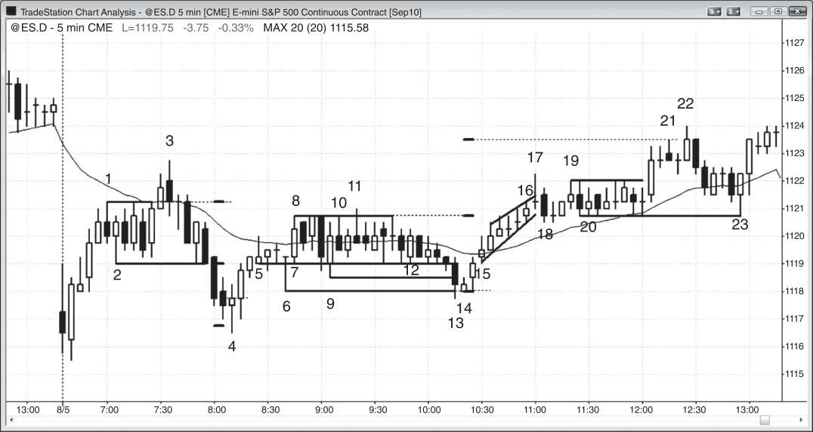
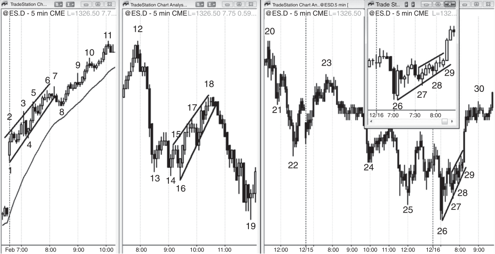
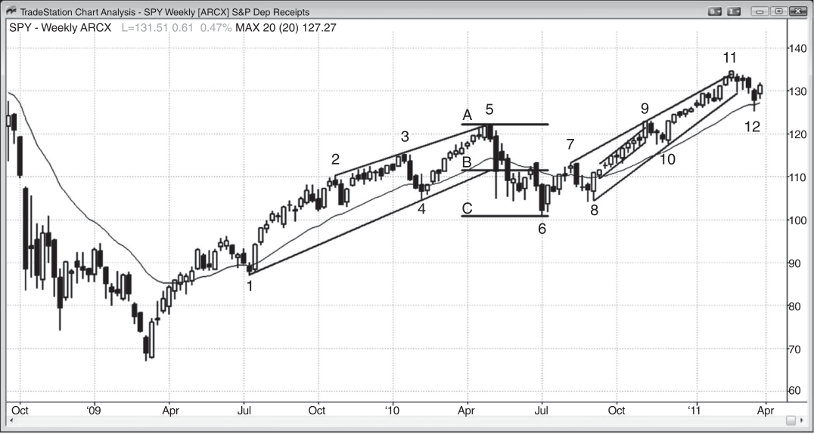
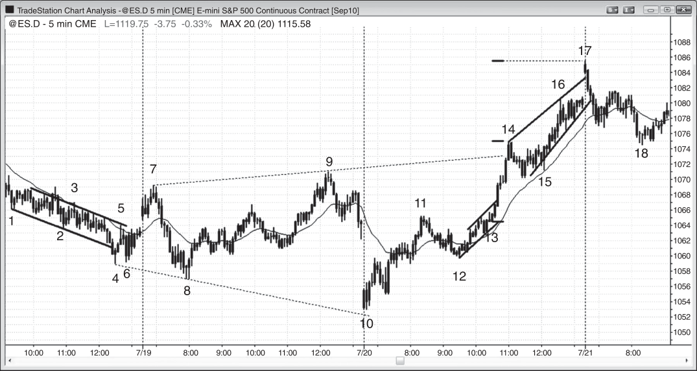
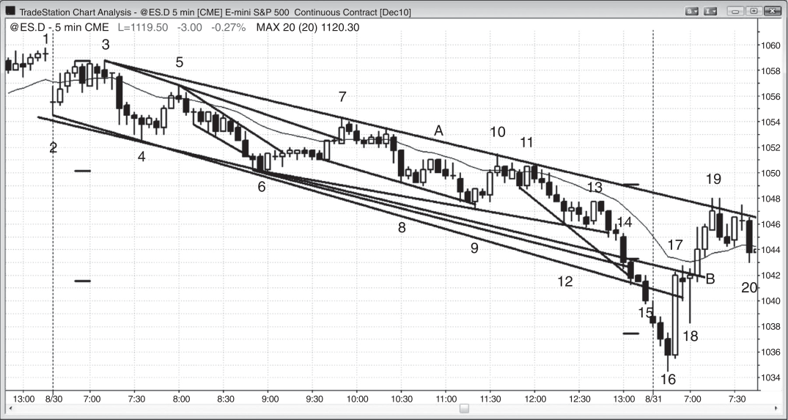
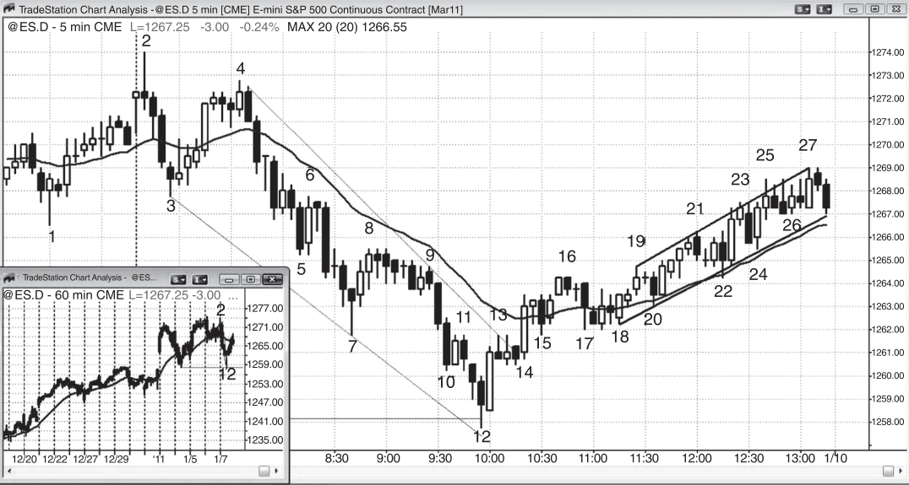
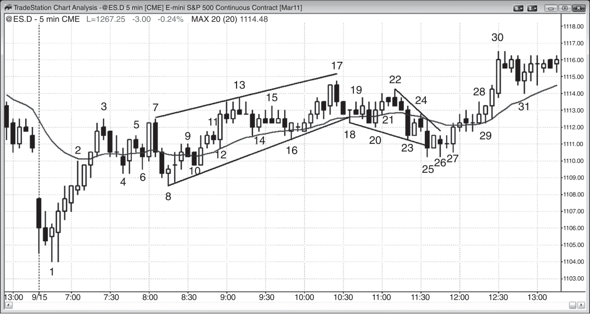

### CHAPTER 15 Channels

<!-- Source PDF pages 251–280 -->

<!-- PDF page 251 -->

C H A P T E R 1 5
Channels
W
hen trading is mostly confined to between a pair of lines, it is in a channel.
The market is always in some kind of channel if you look hard enough
to find one, and it usually is simultaneously in several, especially if you
look at other time frames. A trend channel is a channel that is diagonal and is contained by a trend line and a trend channel line. For example, a bear channel has
a descending trend line above (a bear trend line) and a descending trend channel line below (a bear trend channel line). A trading range is contained between
a horizontal support line below and a resistance line above. Sometimes a trading
range can be slightly rising or falling, but if so, it is better to think of it as a weak
trend channel.
Triangles are also channels, since they are areas of price action contained between two lines. Since they have either higher highs or lower lows, or both in the
case of an expanding triangle, they have some trending behavior in addition to their
trading range behavior. An expanding triangle is contained between two diverging
lines, both of which are technically trend channel lines. The line below is across
lower lows, so it is below a bear trend and therefore a trend channel line, and the
line above is across higher highs and therefore a bull trend channel line. A contracting triangle is contained between two trend lines, since the market is both in a small
bear trend with lower highs and a bull trend with higher lows. An ascending triangle
has a resistance line above and a bull trend line below, and a descending triangle
has a support line below and a bear trend line above. A wedge is an ascending or
descending channel where the trend line and trend channel line converge, and it is
a variant of a triangle. An ABC correction in a bull trend is a small bear channel,
and when it is in a bear trend it is a small bull channel.

<!-- PDF page 252 -->

TREND LINES AND CHANNELS
Although the moving average often functions as support or resistance in a
strong trend and many traders create curved channels and bands based on the
moving average and many other factors, straight trend lines and trend channel lines
consistently provide more reliable setups and profitable trades.
A bull channel can be in a trading range, a bull trend, a bear trend, or at a
possible bottom of a bear trend as the market begins to reverse up. When it is in a
trading range, traders can consider buying when in the lower half of the range, but
the odds of success become less as the channel progresses into the upper half of the
range. When a channel is in a bull trend, higher prices are more certain, and traders
should look to buy near the bottom of the channel. The chance of a successful long
remains good until the channel begins to have prominent selling pressure, or until
it approaches significant resistance. When a channel is especially tight, meaning
that the trend line and trend channel lines are close together and the pullbacks are
small, it is a sign that the trend is strong, and it can be a spike on a higher time frame
chart. A broader channel may follow, which might reach a measured move target,
based on the height of the tight channel. A channel that is so tight that it has no
pullbacks or only one or two tiny pullbacks is a micro channel, which is discussed
in the next chapter.
When a bull channel forms in a bear trend, it is a bear flag, and traders should
look to short near the top, or on the pullback from a downside breakout. Sometimes
when a bear trend begins to reverse up, the first five to 10 bars are in a weak bull
channel, with lots of overlapping bars and one or more attempts to break below
the bear flag, but these fail and quickly reverse up. After a failed low 2 or low 3,
the market then sometimes breaks out to the upside from the bear flag, the market
suddenly becomes always-in long, and a bull reversal begins. When traders suspect
that a bear flag might be the start of a bull trend, many will buy below the low 1, 2,
or 3 signal bars, expecting them to fail and for the market to reverse up.
As a channel is forming, traders are uncertain if there will actually be a channel
or just a two-legged move and then a reversal. In fact, you usually cannot even draw
channel lines until after the market begins to reverse from the two-legged move and
the reversal fails, and the third leg begins. For example, if the market just completed
two legs up and has started to reverse, many traders will short the reversal if the
rally is not a strong bull trend. However, if the leg down ends and is comparable
in size to the first leg down (the leg after the first leg up), and then it reverses up
again, traders will now begin to assume that a bull channel is underway rather than
a reversal down into a bear leg. Once that second leg ends, traders will draw a
trend line from the bottom of the first leg down to the bottom of this second leg
and extend it to the right. They will look to buy whenever the market again comes
back to the trend line. They will also create a parallel of the line and drag it to the
top of the first leg up, and this is their first creation of a channel. Whenever the
market rallies up to that trend channel line, traders will take profit on their longs,
and look to short. Since a bull channel needs at least those first two legs down to

<!-- PDF page 253 -->

CHANNELS
confirm the existence of the channel and the market will usually then test above
the top of the second leg up, bull channels usually have at least three pushes up.
Traders will usually not look for a reversal and a downside breakout of the channel
until after that third leg up forms. However, once it does, especially if there is an
overshoot of the trend channel line and a strong bear reversal bar, traders will short
aggressively because the odds of a successful downside breakout have increased.
Because of this, many bull channels end after a third push up. Likewise, many bear
channels end after a third push down.
Why does the market race toward the top and bottom of the channel? This is
because of a vacuum effect. For example, if there is a bull channel and there is a leg
that is approaching the trend channel line above, the traders believe that the market
will likely touch that line and may even go a tick or two above it. Since they believe
that the market will go at least a little higher than it is right now, they will hold back
on their selling. The bulls want to sell out of their longs eventually to take profits,
and the bears want to sell to initiate new shorts. The current relative absence of
selling creates a buy imbalance, and whenever there is any imbalance, the market
moves quickly. The result is that there is often a large bull trend bar or two that
form as the market tests the top of the channel. This often attracts overly eager
bulls to buy at the top of the spike since they think the market is forming a new,
stronger bull leg. However, most breakout attempts fail, and this one will likely fail
as well. Why? Because of the institutional traders. The strong bears want to short,
but they believe that the market will touch that upper trend channel line, so they
wait. Once the market is there, they short heavily and overwhelm the bulls. They
like to see a strong bull trend bar because they believe that the market will go lower
and there is no better price to short than at the point of maximum bullishness. The
market might pause for a small bar at the top of the bull trend bar as both the bulls
and the bears decide if the breakout will fail, but it will usually then quickly fall
since both the institutional bulls and bears know that the odds are strongly in favor
of all breakout attempts failing.
So what do those strong institutional bulls do? They stop buying and they
quickly sell out of their longs, capturing a brief windfall profit. They know that
this opportunity will likely be brief because the market does not stay at an extreme
for long, so they exit and they won’t look to buy again for at least a bar or two. The
relative absence of these institutional bulls and the aggressiveness of the institutional bears force the market down quickly to the bottom of the channel, where the
opposite process begins. Both the bulls and the bears expect the trend line below
to be tested; the bears will keep shorting until the market gets there and then they
will buy back their shorts as they take their profits, and the bulls won’t buy until
the market gets there. This creates a brief, sharp move down that will entice beginning traders into shorting, expecting a bear breakout, but they are doing the exact
opposite of the institutions. Remember, your job is to follow what the institutions
are doing. You should not be doing what you hope they will soon do, and you should

<!-- PDF page 254 -->

TREND LINES AND CHANNELS
never do the exact opposite of what they are doing. Each of these small pullbacks
is a micro sell vacuum. Once the market gets close to the bottom of the channel,
both the bulls and the bears expect the market to reach the bull trend line and they
stop buying until it gets there. Once there, the bulls buy to initiate new longs and
the bears take profits on their short scalps. Both expect a new channel high and a
test of the top of the channel, where the process begins again. This takes place in
all channels, including in trading ranges and triangles.
Even in a trend channel, there is two-sided trading taking place and this is trading range behavior. In fact, a trend channel can be thought of as a sloping trading
range. When the slope is steep and the channel is tight, it behaves more like a trend,
and trades should be taken only in the direction of the trend. When the slope is less
steep and there are broad swings within the channel, some lasting five or even 10
bars, the market is behaving more like a trading range and can be traded in both
directions. As with all trading ranges, there is a magnetic pull in the middle of the
trading range that tends to keep the market in the range. Why does the market stay
in a channel and not suddenly accelerate? Because there is too much uncertainty,
like with all trading ranges.
For example, in a bull channel, the bulls want to buy more, but at a lower
price. The weak shorts want a sell-off so they can exit with a smaller loss. Both
the bulls and the weak bears are concerned that there may not be a pullback that
will allow them to buy all of the shares that they want to buy (the weak shorts are
buying back their losing short positions) at a better price, so they continue to buy in
pieces as the market goes up, and this adds to the buying pressure. They buy even
more aggressively on any small dip, like with a limit order below the low of the
prior bar or at the moving average or near the trend line that forms the bottom of
the channel.
In general, when a channel is beginning it is better to trade with the trend, and
as it is approaching a target area and as it develops more two-sided trading, experienced traders will often to start trading countertrend. So at the start of a bull
channel, it is better to buy below the lows of bars, but as the channel reaches resistance areas and starts to have more overlapping bars, bear bars, deeper pullbacks,
and prominent tails, it is better to consider shorting above bars instead of buying
below bars.
However, for traders just starting out, whenever they see a channel, they should
trade only with the trend, if at all. Trading channels is very difficult because they are
always trying to reverse, and have many pullbacks. This is confusing to beginning
traders and they often take repeated losses. If there is a bull channel, they should
only look to buy. The most reliable buy signal will be a high 2 with a bull signal bar
at the moving average where the entry is not too close to the top of the channel.
This kind of perfect setup does not occur often. If traders are just starting out,
they should wait for the very best setups, even if that means missing the entire

<!-- PDF page 255 -->

CHANNELS
trend. More experienced traders can buy on limit orders below weak sell signals
and near the moving average and near the bottom of the channel. If traders are not
consistently profitable, they should avoid taking any sell signals in a bull channel,
even if there is a small lower high. The market is always-in long and they should not
be looking to short, even though there will be many signals that look acceptable.
Wait for the market to become clearly always-in short before looking to short. That
will usually require a strong bear spike that breaks below the channel and below
the moving average and has follow-through, and then has a lower high with a bear
signal bar. If the setup is any weaker than that, beginners should wait and only
look to buy pullbacks. Do not fall into the regression toward the mean mind-set
and assume that the channel looks so weak that a reversal is long overdue. The
market can continue its unsustainable behavior much longer than you can sustain
your account as you bet against that very weak-looking trend.
Many bulls will be scaling into their long positions as the market goes up, and
they will be using every conceivable logical approach to do this. Some will buy on a
pullback to the moving average, or below the low of the prior bar, or on pullbacks
at fixed intervals, like every 50 cents below the most recent high in AAPL. Others
will buy as the market appears to be resuming the channel up, like every 25 cents
above the prior low. If you can think of an approach, so can some programmer,
and if she can show that it is effective mathematically, her firm will probably try
trading it.
With both the bulls and trapped bears wanting lower prices but afraid that they
will not come, both continue to buy until they have nothing left to buy. This always
happens at some magnet like a measured move or a higher time frame trend line or
trend channel line. Since channels usually go much further than what most traders
expect, the trend usually continues up beyond the first one or more obvious resistance levels until it reaches one where enough strong bulls and bears agree that the
market has gone far enough and will likely not go much higher. At that point, the
market runs out of buying pressure and the strong bulls take profits and sell out of
their longs, and the strong bears come in and sell more aggressively. This results in
a reversal into a deeper correction or into an opposite trend. The bull trend often
ends with a breakout of the top of the channel as the last desperate bears buy back
their shorts in despair, and the weakest bulls who have been waiting and waiting
for lower prices finally just buy at the market. The strong bears expect that and will
often wait for the strong breakout and then begin shorting relentlessly. They believe that this is a brief opportunity to short at a very high price and that the market
won’t stay here for long. The strong bulls see the spike up as a gift and they exit
their longs and will now buy again only after at least a two-legged pullback lasting
at least 10 bars. They often will not buy until the market gets down to the beginning of the channel, where they originally bought into a profitable trade. The strong
bears know this and will look to take profits exactly where the strong bulls will be

<!-- PDF page 256 -->

TREND LINES AND CHANNELS
buying again; the result usually is a bounce and then often a trading range as both
sides become uncertain about the direction of the next move. Uncertainty usually
means that the market is in a trading range.
Or at least that is the conventional logic, but it is probably more complicated,
sophisticated, and unknowable. All institutions are familiar with this pattern, and
you can be certain that their programmers are constantly looking for ways to capitalize on it. One thing an institution might do is try to create a buy climax. If it
has been buying all the way up and is ready to take profits but it wants to be sure
that the top is in, it could suddenly buy a final big piece with the realization that it
might even take a small loss on it, but with the goal of creating a climactic reversal
on the charts. If the firm is successful, and it might be if several other institutions
are running programs that are doing similar things, it can exit all of its longs, most
with a profit, and then even reverse to short, confident that the sellers now control
the market.
Does this happen with every climax? It is unknowable and irrelevant. Your goal
is to follow what the institutions are doing, and you can see it on the charts. You
never have to know anything about the programs behind the patterns, and the institutions themselves never know what types of programs the other institutions are
running. They only know their own programs, but the market rarely goes far unless many institutions are trading in the same direction at the same time, and they
have to be trading with enough size to overwhelm the other institutions that are
doing the opposite. The only time that the vast majority of the institutions are on
the same side is during the spike phase of a strong trend, and that occurs in fewer
than 5 percent of the bars on the chart.
It is not just bulls and weak shorts who are placing trades as the channel continues up. Strong shorts are also selling as the market moves higher, scaling into
their positions, believing that the upside is limited and ultimately their trade will be
profitable. Their selling begins to create selling pressure in the form of more bars
with bear bodies, larger bear bodies, tails on the tops of the bars, and more bars
with lows below the low of the prior bar. They are looking for a downside breakout of the channel and maybe even a test to the beginning of the channel. Since
they want to short at the best possible price, they are selling as the market is going
up rather than waiting for the reversal. This is because the reversal might be fast
and strong and then they would end up shorting much further below the top of the
channel than they believe is likely to be profitable.
They have several ways to add to their short position, like selling on a limit
order above the high of the prior bar or above a minor swing high in the channel, at
every test of the top of the channel at the trend channel line, at measured move targets, at a fixed interval as the market goes up (like every 50 cents higher in AAPL),
or on each potential top. Once the market reverses, they might hold their entire
position with the expectation of a significant reversal, or they might exit at a profit
target, like on a test of the trend line at the bottom of the channel or even at the

<!-- PDF page 257 -->

CHANNELS
entry price of their first short, which is often near the start of the channel. If they do
that, their first entry will be a breakeven trade and they will have a profit on their
higher entries.
If you are scaling into shorts in that bull channel, it is best to do this only in the
first two-thirds of the day. You do not want to find yourself heavily short in a bull
channel with your breakeven entry so far below that you don’t have enough time
left to get out without a loss, never mind with a large profit. In general, if you are
trading a channel in the second half of the day, it is far better to only trade with the
trend, like buying below the low of the prior bar, or above every bull reversal bar
at the moving average.
If the market continues higher than the shorts believe is likely, they will buy
back their entire position at a loss, and this is probably a significant contributor to
the climactic upside breakout that sometimes comes at the end of a channel. They
no longer expect a pullback any time soon that would allow them to buy at a better
price, and instead buy at the market and take losses on all of their short entries.
Since many are momentum traders, many will switch to long. All the momentumtrading bulls will aggressively buy as the market accelerates upward because they
know that the math is on their side. The directional probability of the next tick being
higher and not lower is more than 50 percent, so they have an edge. Even though the
breakout might be brief and the reversal sharp, their buy programs will continue to
buy as long as the logic supports doing so. However, this is like musical chairs; as
soon as the momentum music stops, everyone quickly grabs a chair, which means
that they exit their longs very quickly. As they are selling out of their longs, there
are aggressive bears shorting as well and this can create a strong imbalance in favor
of the bears. If the bears take control, the sell-off will usually last at least 10 bars
and there will usually be a reversal back below the trend channel line and into the
channel, and then a breakout of the downside of the channel.
The television pundits will attribute the sharp upside breakout to some news
item, and there are always many to choose from, because they see the market only
from the perspective of a traditional stock trader who trades on fundamentals. They
don’t understand that many things that happen, especially over the course of an
hour or so, have nothing to do with fundamentals and are instead the result of large
programs doing the same thing at once with no regard for the fundamentals. Once
the market quickly reverses on the climactic blow-off, they move on to the next
story. They never address the fact that they just gave a report that was foolishly
na¨ıve, and they remain completely oblivious to the powerful technical forces that
drive the market in the short run. Every few years there is an exceptionally huge
intraday move, and that is pretty much the only time that they will acknowledge
that technical factors were at work. In fact, they invariably blame it on programs,
as if the programs suddenly briefly appeared. There is nothing to blame. The vast
majority of all intraday price movement is due to programs, yet the reporters don’t
have a clue. All they see are earnings reports, quarterly sales, and profit margins.

<!-- PDF page 258 -->

TREND LINES AND CHANNELS
Since a channel is a sloping trading range, just like with other trading ranges,
most attempts to break out of either the top or the bottom fail. Yes, one side is
stronger, but the principle is the same as for any trading range. For example, in a
bull channel, both bulls and bears are active but the bulls are stronger and that is
why the channel is sloping up. Both the bulls and the bears are comfortable placing
trades in the middle of the channel, but when the market gets near the top of the
channel, the bulls become concerned that the upside breakout will fail; and as soon
as they think that a failure is likely, they will sell out of some of their longs. Also, the
bears were comfortable shorting in the middle of the channel and will short even
more aggressively near the top, at a better value. When the market gets near the
bottom of the range, the bears are less interested in shorting at these lower prices
and the bulls, who were just buying moments ago at higher prices, will buy even
more aggressively here. This leads to a bounce up off of the trend line. The market
usually pokes below the channel one or more times as it is forming, and you have
to redraw the trend line. The result is usually a slightly broader and flatter channel.
Ultimately, the downside breakout will be strong enough to be followed by a lower
high and then a lower low, and when that happens, traders will begin to draw a bear
channel, even if the bull channel still exists, albeit much wider.
It is important to realize that most bull breakouts of bull channels fail. If the
bulls are able to create a bull breakout and they can overwhelm the bears, they
usually will be able to do so for only a few bars. At that point, the bulls will see
the market as too overdone and will take profits; they won’t want to buy until the
market has corrected for a while. The magnetic effect of the middle of the channel
will usually pull the market back into the channel and cause the breakout to fail,
making the breakout a buy climax. Once back in the channel, the market usually
pokes through the bottom of the channel as its minimum objective. The buy climax
usually leads to a two-legged correction that lasts about 10 bars and usually breaks
below the channel. Once the downside breakout happens, if the selling continues
the next objective is a measured move equal to about the height of the channel.
The bears also know that the buy climax will likely be followed by a correction and
they will short aggressively. With the bulls selling out of their longs, there is strong
selling pressure and the market corrects down and can even become a bear trend.
Sometimes an upside breakout of a bull channel is strong and does not fail
within a few bars. When this is the case, the market will usually rally to a measured
move target, and the breakout will become a measuring gap. For example, if the
bull channel has a wedge shape, and breaks to the downside, but the downside
breakout fails within a few bars, and then the market races up and breaks above
the top of the wedge, the rally will usually reach a measured move up that is equal
to about the height of the wedge. The trend bar or bars that break above the wedge
then become a measuring gap. Gaps, measured moves, and breakouts are discussed
in book 2.

<!-- PDF page 259 -->

CHANNELS
If instead of an upside breakout, there is a downside breakout but without a
failed upside breakout, buy climax, and bear reversal, the market usually goes sideways for a number of bars. It may form a lower high and then a second leg down,
or the trading range might become a bull flag and lead to a resumption of the bull
trend. Less commonly, there is a strong spike down and a strong bear reversal. The
opposite of all of this is true for bear channels.
Since a trend channel is simply a sloping trading range, it usually functions like
a flag. If there is a bull channel, no matter how steep or protracted, it usually will
have a downside breakout at some point and therefore can be thought of as a bear
flag even if there was no bear trend preceding it. At some point, the strong bulls
will take profits and they will be willing to buy again only after a significant pullback. That pullback often has to go all the way to the beginning of the channel,
where they began buying earlier, and this is part of the reason why channels often lead to a correction all the way to the bottom of the channel, where there is
usually a bounce. The strong bears are as smart as the strong bulls, and generally
just when the strong bulls stop buying, the strong bears begin to aggressively short
and will not be shaken out higher. In fact, they will see higher prices as an even
better value and they will short more. Where will they take profits on their shorts?
Near the bottom of the channel, just where the strong bulls might try to reestablish
their longs.
Because a bull channel behaves like a bear flag, it should be traded like a bear
flag. Similarly, any bear channel should be viewed as a bull flag. There may or may
not be a bull trend that precedes it, but that is irrelevant. Sometimes there will be
a higher time frame bull trend that might not be evident on the 5 minute chart,
and when that happens, the bear channel will appear as a bull flag on that chart.
Although a higher time frame trend might increase the chances of a bull breakout
and the chances that the breakout will be strong and go further, you will so often
see huge bull breakouts from bear channels that it is not necessary to look for a
higher time frame bull trend to trade the channel like a bull flag. The opposite is
true of bull channels, which are functionally bear flags.
Since a bull channel is a bear flag, there is usually a bear breakout eventually.
Sometimes, however, there is a bull breakout above the channel. In most cases,
this breakout is climactic and unsustainable. It might last for just a bar or two,
but sometimes it lasts for five or more bars before the market reverses down. Less
often, the bull trend will continue in a very strong trend. If it reverses, it usually
reenters the channel, and with any channel breakout that reenters the channel, it
usually tests the opposite side of the channel. After a failed breakout of the top
of a bull channel, since this is a type of climax, the reversal should have at least
two legs down and last at least 10 bars, and it often becomes a trend reversal. The
opposite is true of a downside breakout of a bear channel. It usually is a sell climax
and reverses back above the channel and has at least two legs up.

<!-- PDF page 260 -->

TREND LINES AND CHANNELS
All channels eventually end in a breakout, which can be violent or have very
little momentum. Trend channels usually last much longer than what most traders
suspect and they often trap traders into prematurely taking reversal trades. Most
channels usually have at least three legs before they end. This is especially clear
in triangles, and in wedges in particular. With triangles, the breakout is usually
imminent but the direction is often not clear.
The steeper the slope and the closer together the lines are, the stronger the
channel is and the stronger the momentum is. When a channel is steep and tight, it
is a special type of channel called a tight channel. When it is horizontal, it is a tight
trading range, which is discussed in book 2. When a channel is strong, it is risky
to trade the first breakout against the trend, and it is likely that the entire channel
will be a spike on a higher time frame chart. So if there is a steep bear channel and
most of the pullbacks within the channel have been only a single bar, it is better not
to buy one of those breakouts above the prior bar, even if it breaks above the bear
trend line. Instead, it is better to wait to see if there is a breakout pullback, which
can be a lower low or a higher low. If there is and the reversal up looks strong
(for example, maybe there were two or three good-sized bull trend bars within the
past several bars), then you can consider buying the breakout pullback. If there is
no pullback and the market races upward, then the odds of even higher prices are
good and you can wait for any pullback, which should come within five bars or
so. The odds of the long being profitable are better if the rally up goes above the
moving average and that first pullback stays above the moving average. This is a
sign of strength. If the first pullback forms below the moving average, the bulls are
weaker and the chance of a second leg up is less. If the market continues to sell off
after the upside breakout, the breakout failed and the bear trend is resuming.
The strength of a channel is especially important when the market might be in
the process of reversing. For example, if there is a strong bull trend and then there
is a strong sell-off that breaks well below the bull trend line, traders will study
the next rally carefully. They want to see whether that rally will simply be a test
of the bull high or will instead break out strongly above the high and be followed
by another strong leg up in the bull trend. One of the most important considerations is the momentum of that test of the bull high. If the rally is in a very tight,
steep channel with no pullbacks and very little overlap between the bars, and the
rally goes far above the bull high before having any pause or pullback, the momentum is strong and the odds are increased that the bull trend will resume, despite
the strong sell-off and breakout below the bull trend line. Usually the first breakout of a tight, prolonged channel will fail. The trend will then resume and often
break out to a new extreme and reach a measured move equal to about the height
of that initial breakout.
By contrast, if the rally has many overlapping bars, several large bear trend
bars, two or three clear pullbacks, maybe a wedge shape, and a slope that is noticeably less than the slope (momentum) of the original bull trend and of the sell-off, the

<!-- PDF page 261 -->

CHANNELS
odds are that the test of the bull high will result in either a lower high or a slightly
higher high and then another attempt to sell off. The market might be reversing into
a bear trend, but at a minimum a trading range is likely.
Whenever there is a breakout of any channel and then a reversal back into the
channel, the market will try to test the other side of the channel, and will usually try
to break out of it, at least by a little. If there is a successful breakout of the channel
in either direction, the next minimum objective is a measured move equal to about
the height of the channel. For example, a double top is a horizontal channel and if
there is a successful breakout of the downside, the minimum target is a measured
move equal to the height of the channel. However, the breakout can become a trend
reversal and the move can be much greater. If instead the breakout is to the upside,
the target is again a measured move up equal to the height of the double top. If
AAPL is forming a double top and the top of the pattern is $5.00 above the bottom,
the initial target of any breakout to the upside is $5.00 above the top. If the breakout
instead is to the downside, the initial objective is $5.00 below the low of the pattern.
The same is true for a wedge bottom. The first objective is a test of the top of the
wedge. If the market continues up, the next target is a measured move up. If the
rally continues, the market might then be in a bull trend. Even when a channel is
sloping, the initial objective is a move equal to the height of the channel. In a bull
channel, for example, pick any bar and look at the channel lines directly above and
below. Simply measure how far apart they are to get the measured move projection.
The measured move targets are only approximate, but the market often hits them
exactly and then pauses, pulls back, or reverses. If the market goes much beyond
the target, a new trend is likely underway.
As with all breakouts, three things can then happen: it can be successful and
be followed by more trading in that direction; it can fail and become a small climactic reversal; or the market can just go sideways and the pattern can evolve into
a trading range. Most breakouts have an attempt to reverse within a few bars. If
the reversal bar is strong compared to the breakout bar, the odds of a failed breakout and a successful reversal are good. If the reversal bar is weak compared to
the breakout, the odds are that the reversal attempt will fail and set up a breakout pullback within a bar or two, and the breakout will resume. If the breakout
and the reversal are about equally strong, traders will then look at the bar after
the reversal signal bar. For example, if there is a strong bull trend bar that breaks
out of a bull flag, and the next bar is an equally impressive bear reversal bar, the
bar that follows becomes important. If it trades below the bear reversal bar, the
breakout has failed, at least for the moment. If it then has a strong bear close
and is a strong bear trend bar, the chance that the reversal will continue down
increases. If instead it is a strong bull reversal bar, chances are that the failed
breakout will not succeed, and this bull reversal bar then becomes a signal bar
for a breakout pullback buy at one tick above its high. Breakouts are discussed
in book 2.

<!-- PDF page 262 -->

TREND LINES AND CHANNELS
Figure 15.1

FIGURE 15.1
Nested Channels
Channels are common on all charts, and some smaller channels are nested inside of larger channels. In Figure 15.1, notice that the lines do not always have
to be drawn to contain all of the highs and lows in the channel. Drawing them
with best fit lines helps to make the channel behavior clearer and often makes it
easier to anticipate signals. Since most trading is institutional and placed by computer programs, it is reasonable to assume that each small, tight channel is due to
program trading. Since there are so many firms running programs all day long, a
channel probably can develop only when several firms are running programs in the
same direction and with enough volume to overwhelm the programs that are trying to make the market move in the opposite direction. For example, in the channel down from bar 4, there were enough sell programs going on to overpower any
buy programs, and the market moved down. When the buy and sell programs are
largely in balance, the market moves sideways in a tight trading range, which is a
horizontal channel.
Bull channels are indistinguishable from bear flags, and bear channels should
be thought of as bull flags. When the channel is tight like from bars 2 to 3, buyers should wait until there is a failed breakout and reversal up before looking for
longs, as occurred at bar 3. They could also wait for a pullback after the breakout,
like the buying above the high of the small bar that formed five bars after bar 3.

<!-- PDF page 263 -->

Figure 15.1
CHANNELS
Until either of these develop, traders should only be shorting. When a channel has
broader swings like the channel from bars 3 to 8, trades can be taken in both directions, since it more clearly resembles a sloping trading range and trading ranges
are two-sided markets that give both buy and sell signals.
Most of the channels in the chart were tight, and since several had no pullbacks
or small (only one- to three-tick) one-bar pullbacks and lasted about 10 bars or less,
they were also micro channels.

<!-- PDF page 264 -->

TREND LINES AND CHANNELS
Figure 15.2

FIGURE 15.2
Failed Channel Breakouts
When there is a breakout of a channel and then a reversal back into the channel, the
market usually tests the opposite side of the channel and often breaks out of the
other side, at least minimally. If the breakout has follow-through, the first target is
a measured move equal to the height of the channel. In Figure 15.2, bar 3 broke out
of the top of a trading range and reversed back down. After breaking through the
bottom of the channel, the bar 4 low was one tick below a perfect measured move.
Bar 11 broke above the top of a trading range and then the market tested the
bottom of the range with bar 13. Sometimes there are several bars to choose from
when drawing the lines, and it is usually worth being aware of all of the possibilities because you may not know which is best until several bars later. The widest
channel is the most certain.
The bull inside bar that followed the bar 13 breakout set up a failed breakout
buy. Since the market was again reversing into the channel, the first target was a
test of the top of the channel. The breakout of the top was successful and the next
target was a measured move up. Bar 22 went one tick above that target. Sometimes
a trend will begin and carry much further.
Bar 17 broke above a bull micro channel or wedge and reversed back down
on the next bar. Since the channel was so tight, the objective of testing the lower
end of the channel was met on that next bar, but there was not enough room for a
profitable short and no trade should be taken.

<!-- PDF page 265 -->

Figure 15.2
CHANNELS
The measured move up for the breakout of the channel formed by bars 19 and
20 was at the same price as the measured move up from the trading range defined by
bars 6 and 10. When multiple targets are around the same price, any reversal there
has an increased chance of success. Bar 21 was a valid short setup but it failed on
the bar after entry. There was a second entry below bar 22 and the market tested
the bottom of the channel. There, it formed a bull reversal bar and the market then
tested the top of the channel.
Deeper Discussion of This Chart
The market broke below a closing trading range with a large gap down in Figure 15.2,
but the first bar was relatively large and had good-sized tails above and below. This is
trading range behavior and not a good signal bar for a trend from the open buy or short.
The second bar was a strong bull reversal bar and signaled a long for a failed breakout
and a trend from the open bull trend. The market entered a tight trading range just
below the moving average, and it became a final flag with a failed breakout and reversal
down. Although traders could short as soon as bar 3 went below the low of the prior
bar, it was safer to wait until the bar closed to confirm that it would have a bear body,
and then short below its low.
The rally to bar 1 was in a micro channel, so the bar 2 downside breakout was likely to
not go very far without a pullback. When the market moved above the high of the bar 2
breakout bar, the breakout failed. At that point, the market went sideways as traders
fought for control. The bears were looking for a higher high or lower high pullback from
the bar 2 breakout, and the bulls simply wanted a failed breakout and then another
leg up.
The bears won and the market fell in a micro channel down to bar 4, where the
process reversed. Bar 5 was the signal bar for the failed breakout, but the four-bar bull
spike was strong enough for traders to believe that the market would likely test higher,
which it did in the move up to bar 8.
The move from bar 14 to bar 17 was another bull micro channel, and bar 18 was the
breakout. The market then went sideways before the small trend resumed in the move
up to bar 22.

<!-- PDF page 266 -->

TREND LINES AND CHANNELS
Figure 15.3

FIGURE 15.3
Bull Channels in Bull and Bear Markets
A bull channel can occur in any type of market. In Figure 15.3, the 5 minute Emini
chart on the left had a bull channel in a strong bull trend, where the market gapped
up and became a trend from the open bull trend day. The pullbacks were small,
and the market worked higher all day. Because the day was a strong bull trend day,
traders were buying small pullbacks, like at and below the low of the prior bar.
The bull channel in the middle chart was a wedge bear flag in a bear trend, and
traders should not have been looking for longs. They could have shorted below the
ii pattern at bar 18, or on any of the several following bars, as the market became
always-in short.
The bull channel on the right was a small bear flag in an overdone bear trend. It
formed after the large bear trend bar on the open, which was the third push down.
Bar 26 (see insert) set up a strong two-bar reversal up from yesterday’s low. Even
though the channel from bar 26 to the bar before bar 29 was a bear flag, traders
believed that the market was reversing up, and bought below the lows of the prior
bars, expecting the low 1 and low 2 sell setups to fail. Bar 29 was a strong bull
trend bar that broke out of the top of the bear flag and turned the market into a
clear always-in long. Not all bear flags break out to the downside. Some become
the final flag of the bear trend, break out to the upside, and lead to a bull trend, as
happened here.

<!-- PDF page 267 -->

Figure 15.4

CHANNELS
FIGURE 15.4
Channel Breakout and Measured Move
When the market successfully breaks out of any channel, the first target is a measured move. In Figure 15.4, a weekly chart of the SPY, the trend line was drawn
across the lows of bars 1 and 4 and the trend channel line drawn from the highs of
bars 2 and 3 was touched at bar 5. This is a bull channel and the lines are slightly
convergent. Horizontal line A is across the bar 5 high and line B is the bottom of
the channel directly below bar 5. Line C is a measured move down from lines A to
B. Bar 6 found support at the measured move and a rally followed.
A similar target would have been projected using an Andrew’s Pitchfork, but
since basic price action analysis gives the same result, it is all that you need. There
were probably countless reasons why bears were taking profits around the bar 6
low and why aggressive bulls were buying. None of them is important since there is
never any way to know how many dollars are being traded for each reason. All that
you know is that the chart is the distilled result of all of those dollars being traded
for countless reasons, and understanding recurring patterns puts you in a position
to know when to take profits and when to consider reversal trades.
The move down to bar 1 was the first breakout below a tight, strong bull channel and was therefore likely to fail. When a first breakout fails and the trend resumes, it often extends up to a measured move that is approximately equal to the
height of that initial reversal attempt. Here, the rally extended much further.

<!-- PDF page 268 -->

TREND LINES AND CHANNELS
Figure 15.4
The channel that began after the bar 1 bull spike was also very tight, and the
spike down to bar 4 was the first strong breakout. The reversal failed and the trend
resumed. The bulls tried to extend the rally for about a measured move up. That
measured move was equal to the height of bar 3 to bar 4, added to the top of bar 3,
but the market did not quite reach the target.
The rally to bar 7 broke above the two-legged bull flag down to bar 6, and bar 8
was the breakout pullback. It was also the start of another bull channel, and the
move down to bar 12 broke below the channel, reaching about a measured move
down, based on the height of the channel and the height of the first leg down (bar 11
and the bar after it). Bars 3, 5, and 7 formed a head and shoulders top, and like most
reversal patterns, became a large bull flag and not a reversal.
Deeper Discussion of This Chart
The bar before bar 6 in Figure 15.4 was a breakout pullback short setup and a low 2
short at the moving average. The bar after bar 5 had a large tail, as did several of the
next bars, and that trading range below the moving average was a barbwire pattern,
which often becomes a final flag, as it did here.
There was a one-bar spike up on the low of the chart, which was followed by a very
tight channel. In fact, there were three or four tight channels in the rally (some traders
saw the second spike from bar 1 to bar 3 as a single steep channel or spike, and others
saw it as two). When a channel is tight, it often functions like a spike, and is followed
by a channel. The pullback to bar 1 was followed by a two-bar spike and then another
channel that again was so tight that it was likely to function as part of the initial spike.
After the pullback from bar 2, the channel up had several bear bodies, which was a sign
of building selling pressure. The result was a strong four-bar bear spike down to bar 4.
The selling pressure was building, and bulls were likely to take profits on the test of
the high. Although the channel up from bar 4 was tight and therefore possibly another
spike, a spike can also function as a climax. This was the third or fourth consecutive
buy climax (every spike, whether it is one bar or many bars, is a climax), and it followed
a strong bear spike. Consecutive climaxes usually lead to a larger correction, as they
did here.

<!-- PDF page 269 -->

Figure 15.5

CHANNELS
FIGURE 15.5
Climactic Bear Breakout of Bear Channel
A bear channel that breaks out of the bottom of the channel can be followed by
an even stronger bear trend, but the breakout usually soon becomes a climax and
is typically followed by at least two legs up, as shown in Figure 15.5. Bar 4 broke
below the bear channel but became a sell climax, as expected, and was followed by
a two-legged rally that ended at bar 7.
There was a bull spike up to bar 14 that was followed by a pullback to bar 15,
and then a wedge-shaped channel developed. The market broke out to the upside
on the gap up to bar 17, but this breakout was just a buy climax that reversed back
into the bull channel and then broke out of the downside. The correction had two
legs, ending at bar 18. Many channels have three pushes in them before reversing,
and bars 14, 16, and 17 were three pushes up.
The small bull channel that started at bar 12 broke out to the upside, and the
breakout was very strong. All breakouts are climaxes, but climaxes don’t always
lead to reversals. Some can become very strong breakouts, like this one. Once they
finally finish correcting and the trend then resumes, it usually does so with less
momentum (the slope is less) and there are usually more overlapping bars, which
is a sign of increased two-sided trading.
When a bull trend is strong, traders will buy tests of the moving average, like
at bars 13 and 15. The moving average therefore contains the trend, and functions
like the lower line of a channel. You can write indicators to create a parallel of

<!-- PDF page 270 -->

TREND LINES AND CHANNELS
Figure 15.5
the trend line and place it above the highs, creating a channel, but usually curved
channel lines or bands of any type do not provide as many reliable trades as do
straight channel lines.
Deeper Discussion of This Chart
The strong move up from bar 13 to bar 14 in Figure 15.5 was almost vertical, and all
strong bull breakouts should be thought of as spikes up and as buy climaxes. When the
spike is composed of two or more large bull trend bars, it is particularly strong and more
likely to have some type of measured move up before there is a significant correction.
Measured moves using the open or low of the first bar of the spike and the close or
high of the last bar often are good areas for the bulls to take partial or full profits and
sometimes are good areas for bears to initiate shorts. Bar 13 had no tail on the bottom
and closed near its high; it was the first of many bull trend bars, so it is the bottom of
the spike. The height of the spike using the open of bar 13 and the high of the bar 14
top of the spike projected a measured move up to the exact high of the channel, the bar
17 high.
Bar 7 was a second-entry moving average gap bar short in a bear trend, which often
leads to the final leg in the bear trend before a larger reversal develops. The rally to bar
7 broke the bear trend line and was followed by a lower low trend reversal at bar 8.
Bar 10 was another lower low in what at that point was a trading range, but it was
also an expanding triangle bottom. Expanding triangles often rally to a new high and
set up an expanding triangle top. The market attempted to do that at bar 14, but the
momentum was so strong that anyone thinking about shorting would have to wait for a
second entry, which never set up. It was far better to be looking to buy a pullback than
to consider taking a short after such a strong bull breakout. The expanding triangle
top failed, as expected, and the breakout of the top of the trend channel line and the
bar 9 high of the prior day was followed by a two-legged sideways breakout pullback
correction to the moving average at bar 15.

<!-- PDF page 271 -->

Figure 15.6

CHANNELS
FIGURE 15.6
Reversals at Lines
Once the market appears to be trending, look for all possible trend lines and trend
channel lines because they are areas where the market might reverse. Traders will
use every technique to draw the lines, like connecting swing points, creating parallels, and using best fit lines. Figure 15.6 shows some of the more obvious lines, but
there were many others. Some would have been based on related markets like the
cash index, and others were based on other types of charts like volume and tick
charts. The shorts can take partial profits on the tests of the bottom of the channels
near the trend channel lines, and aggressive bulls can initiate long scalps there. At
the top of the bear channel, bulls will take profits on their scalps and bears will
initiate shorts for swings and scalps.
The line A bear trend line created by the bar 3 to bar 7 high was tested to
the tick six bars after bar 7 and again at bar 10 and bar 11, and it contained all of
the upside price action. This made it clear that it was important today. Because
it was important, creating a parallel (line B) and anchoring it at a swing low that
contained all of the sell-offs would likely create a channel that traders would feel
was significant. Bar 6 was the logical choice for the anchor.
Once bar 14 broke below the bottom of the channel, traders would look at a
measured move down using the height of the channel at the time of the breakout
for a possible measured move projection. The move was exceeded on the open of

<!-- PDF page 272 -->

TREND LINES AND CHANNELS
Figure 15.6
the next day. When a bear channel breaks out of the downside instead of the top,
even if the breakout is sharp as it was here, it usually goes only a few bars before
reversing. Once it reversed back into the channel on bar 17, the objective was a
poke above the channel, which occurred at bar 19.
The sell-off from bar 13 to bar 16 had 10 bear trend bars with little overlap
and large bodies with small tails, all signs of bear strength. This was unsustainable
behavior and therefore climactic; it had to be an unusually large bear trend bar on
some higher time frame chart, although nothing is gained by looking for the perfect
higher time frame chart. Any large bear trend bar is a spike, a breakout, and a sell
climax. The strong move up to bar 19 had to create a two-bar reversal with that
sell-off from bar 13 on some higher time frame chart, and even a bull reversal bar
on an even higher time frame chart. Never lose sight of the big picture, and don’t
become frightened by an unusually strong sell-off. Yes, a huge bear spike is a strong
sell climax and will often be followed by a protracted bear channel, but it can also
represent exhaustion and lead to a big reversal, as it did here.
The market usually races to the top and bottom of the channel due to the vacuum effect. For example, bar 7 was a strong bull trend bar and there was another
strong bull bar two bars earlier. Weak bulls saw a three-bar spike and a strong reversal up on the day and bought as bar 7 was forming and on its close and on the
high 1 three bars later. Strong bulls instead exited their longs on the test of the top
of the bear channel.
So why was the market vacuumed up with such force on a bear trend day when
bears clearly controlled the day? It was because the bears believed that the trend
line was going to get tested, so as the market got closer and closer to it, they became
more confident that the price would soon reach the bear trend line. There is no
incentive for them to short when they believe they can short at an even better price
a few minutes later. This absence of the strongest of the bears creates an updraft
that sucks the market up quickly to the trend line. The momentum traders kept
buying until the momentum stopped and since there were fewer bears willing to
short, the market quickly moved up to a price that represented value to the bears.
Once there, the bears, who had been waiting for the test, shorted aggressively. They
had been able overwhelm the bulls all day, as seen by the bear trend day, and both
the bulls and bears knew that the bears were in control. There was a bear channel
and the market was spending most of the day below the moving average.
Since everyone except novice traders knew that the odds strongly favored the
failure of any attempt to break above the trend line, it was a great location to put
on shorts. Also, shorting when the bulls were at their strongest gave the bears a
great entry. They saw the market as overextended and not likely to go much higher.
Since they believed that the market might not go another tick higher, they finally
came back into the market and shorted heavily and relentlessly, even though they
were on the sidelines for several bars. The bulls used the test as a place to take

<!-- PDF page 273 -->

Figure 15.6
CHANNELS
profits on their scalps. Both the bulls and the bears knew that the market would
be at the top of the channel only briefly, so both acted quickly. The bulls quickly
scalped out of their longs because they did not want to risk the market reversing
down quickly below their average entry price, and the bears began shorting heavily
and continued to short all the way down to the test of the bottom of the channel.
There, some took partial profits and others continued to hold short until they saw
a strong trend reversal, which did not come until the next day.
Deeper Discussion of This Chart
The market formed a wedge bear flag with bars 2, 4, and 6 in Figure 15.6, and once the
market broke below the flag, it fell to a measured move down, reaching the target three
bars before the close.
The day opened with a small gap down but the first bar was a doji and therefore a
weak setup for a failed breakout long. By bar 3, the day was a trading range so it was
acceptable to short below the bar 3 low 2, especially since the high or low of the day
usually forms in the first hour and this was a possible high of the day. The market might
have been forming a lower high and was failing to hold above the moving average.
Bar 5 was a test of the breakeven stops of the traders who shorted below bar 3, and
set up another low 2 short at the moving average. The market was forming lower highs
and lows and might have been in the early stages of a bear trend.

<!-- PDF page 274 -->

TREND LINES AND CHANNELS
Figure 15.7

FIGURE 15.7
Channels Are Always Trying to Reverse
When the market is in a channel, the reversal setups often don’t look quite right.
That is because they are not reversal setups, but just the beginning of flag pullbacks.
In Figure 15.7, the Emini completed a wedge bull flag down to bar 12, which poked
a couple of ticks below an earlier low on the 60 minute chart (insert) and set up
a large double bottom bull flag. Traders saw the market as flipping to always-in
long on the bar after bar 12, on bar 14, or on the breakout above the bar 18 signal
bar for the bull breakout of a small triangle (bars 15, 17, and 18 were the three
pushes down).
A bull trend is either in a spike or in a channel. Since the market was not in a
strong spike, traders assumed that it was in a bull channel, which meant that there
would be pullbacks. Anything that looked like a low 1 or low 2 signal bar was then a
buy signal. Instead of shorting below those bars, there would likely be more buyers
at and below the lows of the signal bars. This is what happened with the low 1 short
signal bar that followed bar 17. Traders bought the breakout below the bear inside
bar, because they saw the market as always-in long and in a bull channel, and not
in a bear leg. They wanted to buy at and below the low of the bar before bar 18,
expecting the low 2 sell signal to fail. However, the bulls were so eager to get long
that they placed their buy limit orders one tick above the low of the bar. They were
afraid that there would not be enough bears left to push the market below the low
of the sell signal bar, and they did not want to get trapped out of what they saw as

<!-- PDF page 275 -->

Figure 15.7
CHANNELS
the early stage of a bull trend. They saw the market as always-in long, and believed
that the bears were wrong and that any sell signal would fail. They expected any
sell-off, along with any opportunity to buy on a markdown in price, to be brief.
They were happy to see any bear trend bar, especially a low 1 or low 2 that might
trap bears, who would then be forced to buy back their losing shorts as the market
reversed up. These bears would then be buyers, helping to lift the market, and they
would be hesitant to short again for at least a few bars. This would make the market
one-sided in favor of the buyers, giving them at least a scalper’s profit, and possibly
a swing profit.
Because the three pushes up to bar 16 were in a tight bull channel, many traders
saw that wedge as a single spike up and were looking for a bull channel to follow
after a pullback. Since the three prior pullbacks in the rally were between five and
nine ticks, bulls would have placed limit orders to buy pullbacks of about that size.
The pullback to bar 20 was seven ticks, the pullback to bar 22 was eight ticks, and
the pullback to bar 24 was also eight ticks. Other traders just buy with limit orders
at one to three ticks below the low of the prior bar in a channel, risking to below
the most recent swing low. For example, they bought as bar 20 fell below the small
doji before it, or below bar 19, and had their protective stops below bar 17. To a
beginner, this is counterintuitive, but to experienced traders, this is an opportunity.
They know that 80 percent of attempts to break below the bottom of the channel
will fail, so buying as the market is making an attempt is likely to be a good trade.
Bears who saw the entire move up from bar 12 as an overdone bear rally were
unhappy with how weak the short signals were at bar 13, the bar before bar 15,
bar 16, the bar after bar 19, the bar before bar 21, bar 23, and the bar after bar 25.
Whenever the market is working higher in a relatively tight channel, all of the sell
signals tend to look bad, because they are not really sell signals—they are just the
start of small bull flags. Since the strong bulls are buying below the lows of the
prior bars and on limit orders that are located between maybe five and 10 ticks
below the most recent swing high, it is a low-probability bet to short exactly where
the strong bulls are buying. In a tight bull channel, it is rarely wise to short below
the low of a bar unless there has been a strong climactic reversal after a breakout
of the top of the channel, and even then it is often better not to short below a bar
until after a sell-off that is then followed by a lower high. Remember, the market is
always-in long and it is always better to only buy until the market flips to always-in
short. It is easy to look at the channel and see it as weak, and to look at the sell-off
down to bar 12 and assume that the bears will return, but you have to trade the
market in front of you, not the one that just ended or the one that you think should
soon begin.
When a channel has relatively small bars, bars with prominent tails, and trend
bars in the opposite direction, there is significant two-sided trading taking place,
even though the channel is a trend. This creates an opportunity for countertrend

<!-- PDF page 276 -->

TREND LINES AND CHANNELS
Figure 15.7
scalpers. The channel up from bar 18 is an example. Bears will short the closes of
bull trend bars above prior swing highs, like the bar after bar 22, and the closes of
small bull bars that follow, like bar 23, for scalps. Many are willing to scale in higher
(scaling into trades is discussed in book 2). For example, if they shorted the close
of the bull trend bar after bar 20 and one or more of the closes of the small bull bars
that followed, or a point or so above their first entry, they would then take profits
on their entire position at their original entry. That original entry would then be a
breakeven trade and their later entries would give them a scalper’s profit. These
profit-taking bear scalpers bought back their shorts on the low of bar 22, since its
low fell below the entry price of their first entry (the close of the bull trend bar after
bar 20). That bar was also a test of the moving average, so there were also bulls who
bought the test, in addition to the profit-taking bear scalpers who exited because
the market reached whatever profit target they were using, such as the close of the
bull trend bar after bar 20, the moving average, a breakout test of the 16 high, or five
ticks below the high of the doji bar after bar 20 (as discussed in book 2, that was a
weak buy signal bar, so bears would have shorted with a limit order at its high, and
they would have scalped out one point lower; this meant that the market had to fall
five ticks, which it did at the bar 22 low). There are always many different traders
entering or exiting at every tick all day long for every conceivable reason. The more
reasons that line up in the same direction, the more likely the market will trend.

<!-- PDF page 277 -->

Figure 15.8

CHANNELS
FIGURE 15.8
Entering on Limit Orders in Channels
In addition to entering on stops, entering on limit (or market) orders can be an
effective approach whenever the market is in any type of channel, including triangles and trading ranges. In Figure 15.8, the market had eight consecutive bull
trend bars in the strong bull spike up to bar 3, so the market was likely to have
a test of the high after a pullback. Although bears shorted below the bar 3 bear
reversal bar, bulls were scaling in on limit orders below the low of the bar. Some
bought on a limit order at the low of bar 3, but because the next bar was a strong
bear trend bar, there were far more sell orders. Other bulls bought on a limit order
at one tick above the moving average, since the market might have only touched
the moving average and not filled a buy limit order exactly at the moving average.
Some bulls scaled in lower, maybe buying more at one-point intervals. If they did,
they could have then put a limit order to exit both positions at the entry price of
the first order, at or just below the low of bar 3. They would have been filled on
bar 5, would have broken even on the first entry, and would have made a profit on
their second. This profit taking by these bulls contributed to the bear reversal bar
at bar 5.
Traders saw the doji inside bar after the bear trend bar that followed bar 3, and
many thought that this was not a good short setup. Since they believed that shorting
below the bar would likely not yield a profitable scalp, some traders instead bought

<!-- PDF page 278 -->

TREND LINES AND CHANNELS
Figure 15.8
on a limit order at or one or more ticks below its low. This buying contributed to
the tail at the bottom of bar 4. Bar 4 was the fourth consecutive down bar, which
is enough bearish momentum to make traders hesitant to buy above its high, even
though they believed the market would test the bar 3 high. They expected the first
attempt up would likely fail and they preferred to wait for a two-legged pullback
to buy. Bears realized this and thought that the traders who bought above bar 4
would likely lose money. This made shorting on a limit order at or just above the
high of bar 4 a reasonable scalp. They exited with a one-point profit as bar 6 fell
five ticks below the high of bar 4. Why was the low of bar 6 exactly five ticks below
the high of bar 4? In large part because those short scalpers became buyers as they
took their profits down there, and their buying helped create the tail at the bottom
of bar 6.
Since most traders still believed that the market should test the bar 3 high, they
were still looking to buy. Since the market clearly became always-in long in the
spike from bar 1 to bar 3 and there was not yet a clear flip to short, the always-in
position was still long. Therefore, they did not believe that shorting below the low
of bar 5 was a good trade. Given that they thought it would be a losing trade, many
traders did the opposite and bought on a limit order at or below the low of bar 5.
Their buying, in addition to the buying by the shorts who were taking profits from
their scalp down from above bar 4, created the tail at the bottom of bar 6.
Bar 6 was a two-legged sideways correction down from the bar 3 high, and
many traders bought above bar 6 on a stop for the test of the bar 3 high. At the
same time, many of the traders who bought below bar 5 sold out for a profitable
scalp on the rally.
Although the market formed a double top at bar 7, many traders did not expect a trend reversal and instead expected a trading range and then a bull channel
because that is what usually happens after such a strong spike on a day where a
strong case could be made that bar 1 was likely going to remain as the low of the
day. Bar 7 formed a two-bar reversal with the bar before it and the better entry is
below the lower of the two bars. The problem with entering below the low of the
bar 7 bear bar is that the market often has a one-tick bear trap. This means that it
falls one tick below the bear bar but not below the low of both bars of the two-bar
reversal, and then the rally resumes. This risk is less if you enter below the low of
both bars, and that is why the market reversed up six ticks later. The bears bought
back their shorts on a profit-taking limit order located five ticks below the signal bar
low, which usually requires the market to fall six ticks. The bar 8 low was exactly
six ticks below the bottom of the two-bar reversal.
If this was a strong bear trend, traders could short on a stop below the prior
swing low at bar 4. Since most traders thought that the low of the day was in and
that the market would likely form a bull channel, they thought that shorting below

<!-- PDF page 279 -->

Figure 15.8
CHANNELS
the bar 4 low was a bad idea. This means that buying below its low might be a good
long, especially if the traders could scale in lower if need be. Also, since the market
was likely to form a channel that could last for hours and the market might not again
come down to this level, these bulls could swing some or all of their positions.
Other bulls saw bar 8 as the second leg down from bar 3 (bar 4 was the first leg
down) and they bought above the high of bar 8 on a stop. The bar after bar 8 was a
doji bar, which indicates that the market is still two-sided. Bar 8 was not a strong
bull reversal bar, and the two-bar spike down from bar 7 made traders wonder if
the market might be reversing. Traders had to decide if they thought that bar 9 was
going to be the lower high pullback that would lead to a bear channel, or if always
in was still long and that the market was in the early stages of a bull channel.
The traders who thought that the bottom was in believed that bar 9 was a bad
short setup and they placed limit orders to buy at and below the low of bar 9. Many
of these bulls would have added on if the market fell below the bar 8 low. The bears
who shorted below bar 9 bought back their shorts when the market reversed above
the bar 10 entry bar. Bulls also bought, believing that this failed short was more
evidence that a bull channel was forming.
Channels have lots of pullbacks along the way, and the bulls would not let
themselves be stopped out by a pullback. Instead, they would buy on a limit order
at or below the low of the prior bar, like below bars 9 and 11. Since channels have
two-sided trading, as long as the channel is not too tight and too steep, bears will
short at or above swing highs. For example, they would have shorted as bar 12
went above the bar 7 high and some would have added on one point higher. This in
part was the reason that the high of bar 13 was exactly five ticks above bar 7. They
would also have shorted on the move up to bar 17 as the market went above the
bar 13 high. Some bears would even have shorted the sharp rally up to bar 30 as it
moved above the bar 17 high and they would have added on one point higher. They
could have bought back both shorts at the original entry price as the market fell to
bar 31. Their original short would have broken even and their add-on would have
made a one-point profit.
The bulls would have looked at the rally up to bar 29 as having trending highs,
lows, and closes, and therefore would have believed that it was strong. Some would
have bought more on a stop at one tick above the bar 17 high. They could have
exited with a profit on bar 30. Whenever a breakout trade results in a profit, it is a
sign that the trend is strong. However, it is not absolute and if the market is mostly
in a trading range, as it was today, there may not be follow-through.
There was two-sided trading throughout the day and both bulls and bears were
entering on limit orders and on stops. For example, once the always-in position
flipped to short at the bar 17 wedge top (wedge reversals are discussed later), bears
began shorting above the high of the prior bars, like above bars 18, 20, and the bar

<!-- PDF page 280 -->

TREND LINES AND CHANNELS
Figure 15.8
after bar 24. Bulls were buying below prior swing lows, like below bars 20 and
bar 23. There were many other setups during this day, as there are on all days, but
the purpose of this chart is not to show every possible trade. Instead, it is to make
the point that when the market is in a bull channel, bulls are buying below the low
of the prior bar and bears are selling above swing highs. In bear channels, they do
the opposite—bulls buy below swing lows and bears short above the high of the
prior bar.
