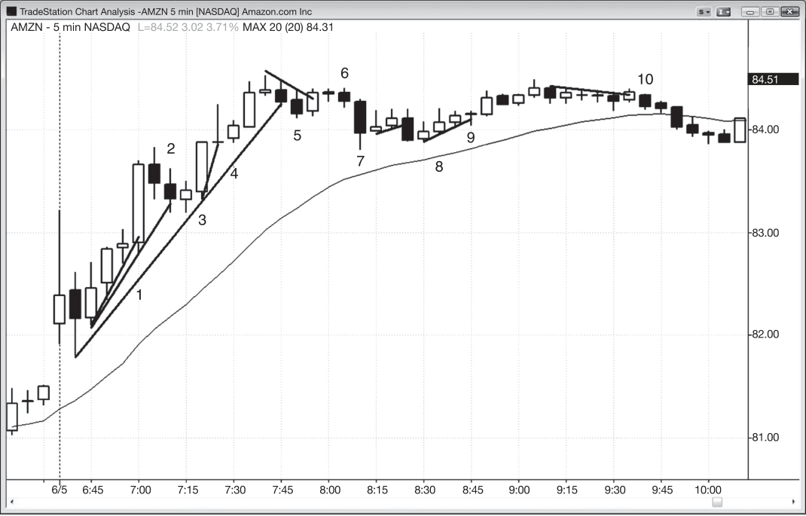
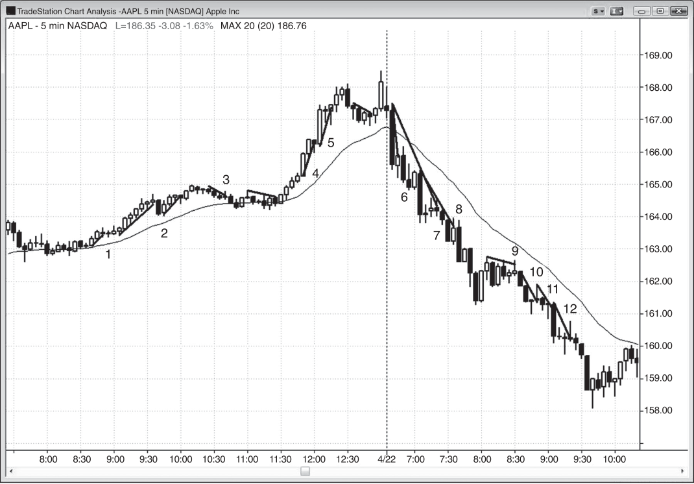
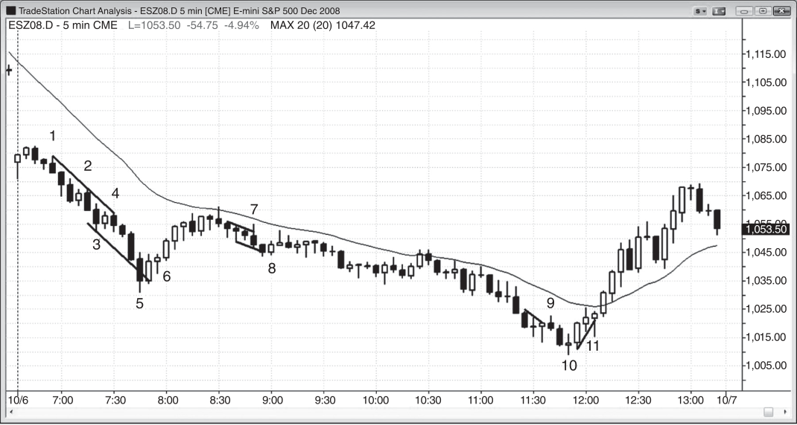
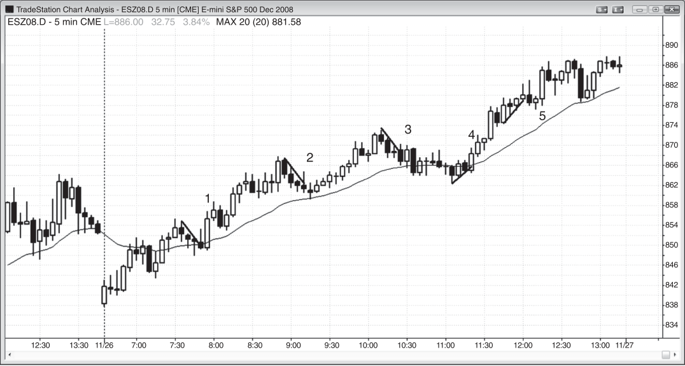

### CHAPTER 16 Micro Channels

<!-- Source PDF pages 281–300 -->

<!-- PDF page 281 -->

C H A P T E R 1 6
Micro Channels
A
micro trend line is a trend line on any time frame that is drawn across from
2 to about 10 bars where most of the bars touch or are close to the trend line
and the bars usually are relatively small. Typically a trend channel line can
be drawn along the opposite ends of the bars as well, and the result is a very tight
channel called a micro channel. Unlike a conventional channel where pullbacks are
common, a micro channel progresses with no pullbacks, or rare, small pullbacks,
making it an extremely tight channel.
The more bars, the stronger the bars (like bars with big trend bodies in the
direction of the micro channel), and the smaller the tails, the stronger the micro
channel, and the more likely that the first pullback will fail to reverse the trend. A
micro channel can last for 10 or more bars, and other times it will run for about
10 bars, have a small pullback, and then resume for another 10 bars or so. It does
not matter whether you view the entire channel as one big micro channel (a micro
channel is a type of tight channel), two consecutive micro channels separated by a
small pullback, or a large tight channel, because you will trade it the same way. The
trend is very strong and traders will look at reversal attempts to fail and become
pullbacks and for the trend to continue.
Ten years ago, traders saw micro channels as a sign of program trading. Now,
since most trading is done by computers, it adds nothing to say that micro channels
are signs of program trading, because every bar on the chart is due to program
trading. A micro channel is just one particular type of program trade, and it is likely
due to many firms running programs simultaneously. One or more firms will start
it, but once the momentum is underway, momentum programs will detect it and
begin trading in the same direction, adding to the strength of the trend. Once the

<!-- PDF page 282 -->

TREND LINES AND CHANNELS
trend begins breaking above resistance levels, breakout programs will start trading.
Some will trade in the direction of the trend and others will begin to scale in against
the trend, or scale out of longs that they bought lower.
Eventually one of the bars penetrates through the trend line or the trend channel line, creating a breakout. Bull and bear micro channels can develop in bull or
bear trends, and in trading ranges. The environment in which they occur determines
how to trade them. Both bull and bear channels can have breakouts to the upside
or the downside. As with all breakouts, three things can then happen: it can be successful and be followed by more trading in that direction, it can fail and become
a small climactic reversal, or the market can just go sideways and the pattern can
evolve into a trading range.
As with any breakout, traders will trade either in the direction of the breakout,
expecting follow-through, or in the opposite direction, if they expect the breakout
to fail. Breakouts, failed breakouts, and breakout pullbacks are closely related and
are discussed in book 2. As a guide, traders compare the strength of the breakout
with that of the reversal attempt. If one is clearly stronger, the market will likely go
in that direction. If they are equally strong, the trader needs to wait for more bars
before deciding where the market is likely to go next.
When a bear micro channel forms in a bull trend, it is usually a bull flag, or the
last leg of a bull flag, and traders will look for a signal bar and then place a buy stop
above its high to enter on the breakout of the bear micro channel and of the bull
flag. When a bull micro channel forms in a bear trend, it is usually a bear flag or the
final leg of a bear flag and traders will short below any signal bar.
If instead of a bear micro channel forming in a bull flag, the micro channel is a
rising micro channel (a bull micro channel) in a bull trend, the first downside breakout (the first pullback) will usually not go far, and it will be bought aggressively. The
more bars in the bull micro channel, the more likely that the bear breakout will not
reverse the bull trend. For example, if there is a five-bar bull micro channel in a bull
trend, there will probably be far more buyers at and below the low of that fifth bar
than sellers. If the market trades below that fifth bar, the bar creates a bear breakout of the bull channel. However, it is unlikely to lead to more than a bar or two of
selling because the bulls will be eager to buy the first pullback from the strong micro channel bull trend. Remember, many traders have been watching the rally for
five bars, waiting for any pullback to buy. They will be eager to buy below the fifth
bar and above the high of the pullback bar, which is a failed breakout buy signal
bar (a high 1 buy setup). If the market triggers the long but creates a bear reversal
bar within a bar or two, this then sets up a micro double top sell signal. It can also
be thought of as a pullback from the breakout below the bull micro channel, even
if its high is above the highest bar in the micro channel. It would then be simply a
higher high reversal, which is a micro version of a major trend reversal (reversals
are discussed in book 3).

<!-- PDF page 283 -->

MICRO CHANNELS
It is important to realize that traders do not have to wait for a pullback to get
long. Many experienced traders understand what is happening after the second or
third bar of the bull micro channel in a bull trend. They think that the market is
in the early stages of a very strong buy program where momentum buy programs
are also buying aggressively. These traders will try to copy what the computers
are doing and will buy every bull close, and place limit orders one or two ticks
below the close of every bar, and one or two ticks above the low of the prior bar. If
the biggest pullback in the micro channel has been five ticks, they will place limit
orders to buy any three- or four-tick pullback. They expect that the first time a bar
falls below the low of the prior bar will attract even more buying, so they know
that their most recent buy will likely be profitable, despite the pullback. Since they
made money all the way up, they are not worried about getting out at breakeven or
with a small loss on their final entry when a pullback finally does come.
As with any channel, a bull micro channel can form in a trading range, or within
a bull or bear trend. When it is in a bull trend, higher prices are more certain, and
traders should look to buy near the middle or bottom of the prior bar. When the
micro channel is especially tight, it can be a spike on a higher time frame chart; a
broader channel may follow, and it might reach a measured move target based on
the height of the tight micro channel. When a bull micro channel is in a bear trend,
it is a bear flag, and traders should look to short the downside breakout or the pullback from a downside breakout. When a bull micro channel forms after a possible
low in a bear trend, it can become the final flag in the bear trend and break out to
the upside instead of to the downside, and the breakout can be the spike that leads
to a bull trend. When a bull breakout occurs, it usually follows a failed low 1, 2, or 3.
A micro channel is a sloping tight trading range, and therefore it has a strong
magnetic pull that tends to prevent breakouts from going very far. It is also often
tight enough to sometimes act as a spike, and it can be followed by a broader channel, creating a spike and channel trend. When there is a breakout from a micro
channel, it is usually just for a bar or two and is mostly due to profit taking. For
example, if there is a bull micro channel (an upwardly sloping micro channel) and
a bar trades below the low of the prior bar, that is a breakout below the micro
channel. This is primarily due to bulls taking profits, although there are some bears
who are shorting. Within a bar or two, other buyers come in, some bears exit, and
the market usually trades above the high of the prior bar. Some traders will see
this as a failed breakout of the micro channel, and they will buy as the market goes
above the high of the prior bar. For them, this is a high 1 buy setup. Others will assume that the trend is reversing down; they will wait for the market to form either
a higher high or lower high breakout pullback over the next couple of bars, and
then they will short below the low of the prior bar. The overall context can give a
clue to which outcome is more likely. For example, if the market is in a strong bear
trend and the bull micro channel is just a pullback, the odds favor that the breakout

<!-- PDF page 284 -->

TREND LINES AND CHANNELS
below the micro channel will be followed by more selling. If the market trades
above the breakout bar, bears will place stop orders to short below the low of the
prior bar. If instead the bull micro channel is forming as a breakout from a trading range in a bull market, the odds favor the breakout below the micro channel
becoming a pullback in the bull trend, and bulls will place buy orders at one tick
above the high of the prior bar.
A breakout of the trend line sets up a with-trend entry. For example, if there
is a bull micro channel and the market is always-in long, and then there is a bar
with a low below the micro bull trend line, then buying the high of that bar can be a
reliable trade. This is a tiny but strong one-bar bull flag (a high 1 buy setup) and it is
a failed breakout buy signal. It might be a two-legged correction on a smaller time
frame chart; however, it is better to not look, because you will find yourself with
too much information to process in a short time and you will likely mismanage or
not take the trade.
If the bull micro channel is within a trading range or in a bear trend instead of in
a strong bull trend, you have other things to consider before buying above the failed
bear breakout. If the channel is at the top of a trading range, it is often better not
to buy the failed breakout and instead to wait to see if the reversal back up stalls
and becomes a higher high pullback from the breakout. If it only goes up for a bar
or two and then forms a bear reversal bar, this can be a reliable short setup when
it is near the top of a trading range (a micro double top, discussed in book 3). If the
bull micro channel is a bear flag just below the moving average, you should only
look to short, since the odds are that the shorting by the bears will overpower the
bulls who bought the pullback. Wait for the breakout below the channel and then
for the failure and one more push up. If that reversal back up forms a bear reversal
bar at the moving average within a bar or two, this is usually a reliable breakout
pullback short setup (a low 2). The market broke out of the downside of the bull
micro channel and then pulled back to a small higher high. Finally, if it reversed
back down, it set up a breakout below what has become a bear flag.
As with any breakout below a bull channel, there might be a pullback and then
a resumption of the selling. That pullback can be a lower high or a higher high (a
higher high means that the high of the bar goes above the high of the most recent
swing high, which is likely the highest bar in the bull channel). Because most attempts at reversing a trend fail, the odds are in favor of the bear breakout failing
and becoming just a pullback in the bull trend, followed by the bull trend resuming.
Traders should place an order to go long at one tick above the high of the breakout
bar, in case the bear breakout fails and the bull trend resumes.
However, they must be aware that their long might be a bull trap, trapping them
into a losing long trade. Remember, although most attempts to reverse a trend fail,
some succeed. Instead of the breakout to the downside failing, the market might be
just briefly pulling back from the bear breakout and forming a small higher high or

<!-- PDF page 285 -->

MICRO CHANNELS
lower high before the selling resumes. This could be followed by a successful trend
reversal into a bear leg or trend. Because of this, the trader has to be prepared to
reverse to short below his long entry bar, if the overall price action makes a reversal
seem appropriate. In this case, this is a breakout pullback short setup. Whenever
a breakout fails, this failure sets up a trade in the direction of the original trend. If
that also fails, then it becomes a breakout pullback from the original bear breakout
(opposite failures create a breakout pullback) and a second attempt to reverse the
trend to down.
If the breakout pullback short triggers (by the bar going one tick below the
low of the prior bar, which is usually the bull breakout bar), look at the size of the
bodies of the recent few bars. If the bars are bull or bear trend bars, then this second
failure has high odds of being a successful second entry short. Remember, the first
failure was when the bears lost on the failed downside breakout, trapping them out
of their short trade. The second failure was when the bulls were trapped into their
losing trade, which was set up by the failed bear breakout below the channel. If
the market now turns down again, you have just had bears trapped out and bulls
trapped in. In general, if both sides get trapped in or out, the odds of success of
the next setup increase. If the bars have more of a doji look, then the market will
likely enter a trading range, but the odds still favor a downside breakout. If you are
not certain, then wait because it is likely that most traders will not be certain and a
trading range will usually follow.
Although the vast majority of micro trend line breakouts are one- and twolegged pullbacks on the 1 minute chart, you should avoid trading off that chart
because you will likely lose money. Most traders are unable to take all of the signals
and invariably pick too many losers and not enough winners. The best trades often
set up fast and trigger quickly and are therefore easy to miss. Many losing trades
are often slow to set up and give traders plenty of time to enter, trapping them in
the wrong direction.
That bull micro channel could instead have a breakout to the upside, above the
trend channel line, in an attempt to form an even steeper bull trend. If it fails and
there is a strong bear reversal bar, this buy climax is a potential short setup.
When a micro trend line extends for about 10 or more bars, the odds increase
substantially that there will soon be a tradable reversal. This type of trend is unsustainable and therefore a type of climax, which is usually followed eventually by a
pullback or a reversal. After such climactic behavior, be ready to take a breakout
pullback entry. This is the second attempt to reverse the trend, with the original
trend line breakout being the first.
A micro trend line break is important not only when the micro trend line is
part of a micro channel, but also whenever there is any strong trend underway. If
there is a strong bear trend with large bear trend bars and little overlap between
consecutive bars and there are no pullback bars for four or five bars, you are likely

<!-- PDF page 286 -->

TREND LINES AND CHANNELS
eager to get short. Look for any bear micro trend line and then sell below the low of
any bar that pokes above any bear micro trend line. Any poke through it is a setup
for a failed breakout short entry. Enter at one tick below the bar that breaks above
the bear micro trend line (a low 1 short setup).
Small, steep trend lines, even drawn using two consecutive bars, often provide
setups for with-trend trades. If the trend is steep, sometimes a small pullback bar
or a pause bar can penetrate a tiny micro trend line. When it does, it can become
a signal bar for a with-trend entry. Some of the penetrations are smaller than one
tick in the Eminis, but are still valid.
When there is a trend and then it has a pullback, it is common to see a micro
trend line in the pullback. For example, in a pullback in a bull trend, if there is a
bear micro trend lasting about three to 10 bars, and then there is a break above
that bear micro trend line, this theoretically sets up a short on the failed breakout.
Since this is occurring during a bull trend and it almost always happens above or
near the moving average, you should not be shorting this pattern. You would find
yourself holding a short at the bottom of a bull flag near a rising moving average
in a bull trend, which is a very low-probability trade. As this short will likely fail,
you should anticipate this and be ready to buy the failure, getting in exactly where
the trapped shorts will get out. Your long will be a breakout pullback buy since
the market broke above the bear micro trend line and then pulled back to either a
small lower low or a higher low, and then the market resumed in the direction of
the breakout, which is also the direction of the major trend of the day.
It is critical to remember that micro trend lines should only be used to find withtrend setups. However, once the trend has reversed, for example after a bull trend
line break and then a reversal down from a higher high, you should be looking for
micro trend line short setups, even if they are at or just above the moving average.
As with any chart pattern, a micro channel’s appearance is different on both
smaller and higher time frame charts. Even though the trend bars in a micro channel
or any other type of tight channel are usually not large and there is usually a lot of
overlap between adjacent bars, the trend is strong enough to be a large trend bar
or a series of trend bars on a higher time frame chart. This means that it often
functions as a spike, and is often followed by a broader channel, like any other
spike and channel trend. Also, even though there are no pullbacks in the micro
channel, there are many pullbacks if you look at a small enough time frame chart.

<!-- PDF page 287 -->

Figure 16.1

MICRO CHANNELS
FIGURE 16.1
Micro Trend Lines
Small trend lines can generate many scalps during the day, especially on the
1 minute chart, which is seldom worth trading. In Figure 16.1, the chart on the left
is a 1 minute Emini chart and the numbers correspond to the same bars on the
5 minute chart on the right. Both show that failed breakouts from tiny trend lines
can result in profitable fades. There are other trades on the 1 minute chart that are
not shown because the purpose of this figure is only to show how 5 minute micro
trend lines correspond to more obvious, longer trend lines on the 1 minute chart,
so if you can read the 5 minute chart, you do not have to additionally look at the 1
minute chart to place your orders. Many of these trades could have been profitable
scalps on the 1 minute chart.
Note that several breaks of micro trend lines on the 5 minute chart are easy to
overlook and are less than one tick in size. For example, bars 3, 5, 6, and 7 were
failed micro trend line breaks on the 5 minute chart that would have been invisible
to most traders, but the one at bar 5 was particularly significant and led to a good
short scalp. It was the second failed attempt to break above a bear trend line (bar 3
was the first).

<!-- PDF page 288 -->

TREND LINES AND CHANNELS
Figure 16.1
The failed breakout below the bull micro channel at bar 7 was a risky long and
a scalp at best. Since it was a bear flag pullback to the moving average, it was better
to expect the move up to stall and become a breakout pullback sell setup, which it
became here.
Price action trading works even at the tiniest level. Note how bar 8 on the 1
minute chart was a higher high breakout test (it tested the high of the bar that
formed the low of the bear trend) long setup and that although the market came
down to test the bar 8 signal bar low two bars after entry, the protective stop
below the signal bar would not have been hit. Also note that there was also an
even smaller major reversal in this segment of the 1 minute chart. There was a tiny
bull trend, indicated by the bull micro trend line up from the low of the chart, then
a break of the trend line at bar 7, and then a higher high test of the tiny bull trend
extreme. Since the pattern is so small, the trend reversal down to bar 8 was just a
scalp, as expected.
On the 5 minute chart, bar 8 did not set up a long. Why? Because it was a pullback in a bear trend. You should not be buying the top of a pullback in a bear trend
day. Instead, once you see the micro trend line buy trigger, get ready to short its failure, entering exactly where the trapped longs will be forced out with their losses.

<!-- PDF page 289 -->

Figure 16.2

MICRO CHANNELS
FIGURE 16.2
Failed Breakouts of Micro Trend Lines
Even trend lines created using just two or three consecutive bars in a steep trend
can set up with trend entries when there is a small break that immediately reverses.
Each new break becomes the second point in a longer, flatter trend line until eventually trend lines in the opposite direction become more important, and at that
point the trend has reversed.
In Figure 16.2, bar 1 dipped below a three-bar trend line and reversed up, creating a long entry at one tick above the prior bar.
Bar 2 dipped below a six-bar trend line. Traders would have placed buy stops
above its high. When not filled, they would move their buy stops to the high of the
next bar and would have been filled on bar 3. This was a high 1 buy entry, and most
bear breakouts of bull micro channels in a bull trend fail and become high 1 buy
setups. Since the micro channel is usually breaking above something, like a prior
high, as it did here when it moved above the first bar of the day, the high 1 is usually
also a breakout pullback buy setup. Incidentally, the bar before bar 2 was a possible
short setup based on a failed breakout of a micro trend channel line (not shown)
that is a parallel of the three-bar micro trend line leading up to bar 1. The upward
momentum was too strong for a short without a second entry, but this illustrates
how micro trend channel lines can set up countertrend trades.

<!-- PDF page 290 -->

TREND LINES AND CHANNELS
Figure 16.2
Bar 4 was a small inside bar that extended below a two-bar trend line (the
penetration is not shown). The buy is on a stop at one tick above the high of the
small inside bar.
Bar 5 broke the major trend line of the day (any trend line lasting about an hour
or so is more significant), so traders would be thinking that a two-legged pullback
was more likely. After the break above the bear trend line on the bar following
bar 5, a short would be triggered on the bar 6 lower high. When bars are small doji
bars like those following bar 5, it is usually best to wait for bigger trend bars before
taking more trades, but these trend line reversals still led to profitable scalps of 30
to 50 cents in Amazon (AMZN). Since bar 5 was the first breakout of a fairly tight
bull channel, it is better not to short it and instead to wait for a breakout pullback
to short.
Bar 6 was a reasonable lower high breakout pullback short entry for a scalp
down toward the moving average. This was not a good trend reversal trade because
there had yet to be a test of the moving average followed by a test of the bull
trend high.
Bar 6 was a micro trend line short in a bull trend, which is a bad trade when
it occurs close to the moving average. Here, however, there was plenty of room
down to the moving average; in addition, it was following a wedge top and therefore
would likely be part of a two-legged correction down.
Unlike a conventional channel, where pullbacks are common, in a micro channel the lack of pullbacks is one of its defining characteristics. For example, in the
bull micro channel that started on the bar before bar 8, the first leg ended with
the small bar 9 pullback. Some traders saw the next four bars as part of the same
channel, with bar 9 as a pullback, and other traders saw bar 9 as the start of a second micro channel. It really does not matter, because the sideways move to bar 10
broke below both.
Deeper Discussion of This Chart
The market gapped up in Figure 16.2 and therefore broke out above the close of yesterday and the first bar was a bull trend bar. The body was reasonably strong and there
was a tail below, both showing buying pressure. Yesterday closed with some bull bodies,
again showing strength by the bulls, so this bar was not a strong signal bar for a short
on the basis of a possible failed breakout setup. The second bar had a bear body and
dipped below the low of the first bar and was a reasonable breakout pullback long setup
for a possible trend from the open bull day. There were four bull trend bars, creating a
spike up, but the final one had a large range and might indicate some exhaustion. This
led to the first pullback long setup, and bar 3 was a strong entry bar. This was also a
breakout pullback long from the breakout above the opening high. Since the first bar of
the day was unusually large, it could and did lead to about a measured move up.

<!-- PDF page 291 -->

Figure 16.3

MICRO CHANNELS
FIGURE 16.3
Micro Trend Lines in Strong Trends
Small trend lines in strong trends, even when drawn using adjacent bars, often have failed breakouts that set up good with-trend entries. Many of these are
two-legged pullback setups (ABC corrections) on 1 minute charts, but you don’t
need to look at the 1 minute chart when you see the false breakouts on the
5 minute chart.
When trading, you do not have to actually draw the trend lines on the chart very
often because most trends are visible without the help of the drawn lines.
There were many good with-trend entries in AAPL on this 5 minute chart in
Figure 16.3 based on failed breakouts of micro trend lines. When the trend is steep,
you should only be looking to trade with the trend and you should not be trading
small reversals. For example, even though bar 3 broke above a bear micro trend
line, the bear trend was actually a bull flag in a strong bull trend where the market
has been above the moving average for more than 20 bars. You should only be
looking to buy and not short, especially not just above the moving average.

<!-- PDF page 292 -->

TREND LINES AND CHANNELS
Figure 16.3
Bar 2 was a breakout below a bull micro channel in a strong bull trend, and it
should be expected to fail. This set up a reliable high 1 buy setup.
Bars 10 and 12 were first breakouts above steep, tight channels and therefore
not good long entries. Although bar 12 was the second breakout to the upside on
the way down, the move down from bar 10 lasted several bars and was steep; it
therefore created a new small micro channel, and bar 12 was the first attempt to
break out of the new channel (both bars 10 and 12 were low 1 sell signal bars).
Bar 9 was a bear reversal bar and a signal bar for the downside breakout of
the small triangle. A triangle is a mostly sideways trading range with three or more
pushes in one or both directions. The bar before bar 9 was the third of three small
pushes down, and was the point at which the trading range became a triangle. Since
the market was in such a tight bear channel from the first bar of the day, it was
unreasonable to believe that the triangle would be a reliable buy setup. In fact,
most traders did not see the pattern as a triangle yet, and were continuing to look
for shorts. Once the bar 9 bear reversal bar formed the third push up, traders were
confident that the pattern was a triangle in a bear trend, and a reliable sell setup.
Even though bar 9 had a bull body, it was a small doji and therefore did not have
much buying pressure. However, it was still a reversal bar since it closed below its
midpoint. Bar 9 would have been a stronger signal if it had bear body.
The tight bear channel that ended three bars after bar 8 had several smaller
micro channels within it. It does not matter whether a trader sees the tight channel
as a large micro channel with a couple of small pullbacks, three consecutive micro
channels, or as a large tight bear channel, because he would trade the market the
same way. The move down is very strong and is probably a strong spike on a higher
time frame chart. Smart traders were looking for any pullback to short, expecting
that any pullback would simply be profit taking by the bears, and would be followed
by lower prices and not a trend reversal. In a strong trend such as this, traders will
short above the high of the prior bar and below the low of any pullback, like below
bars 9, 10, and 12.
Many bull trends that have only small pullbacks but result in large profits have
low probability short setups. For example, both bars 10 and 12 were doji bars in
areas of other bars with tails, and therefore were signs of two-sided trading. When
the market begins to develop signs of two-sided trading, it often is evolving into a
trading range, which means shorting near its low and hoping for a breakout of the
developing trading range is a low probability short. The probability of a successful
swing down might be only 40 percent. However, since the reward is several times
the risk, the trader’s equation is still very positive. Traders who prefer to take only
high probability trades would not have shorted below bars 10 or 12, and instead
would have waited for high probability reversals to buy (like the bull reversal bar
after a series of sell climaxes at the low of the day; reversals are discussed in book
3), or pullbacks to short (like the bar 9 triangle), or strong bear spikes to short (like

<!-- PDF page 293 -->

Figure 16.3
MICRO CHANNELS
the bar 11 close, since it was a breakout below a wedge bottom; the low of the bar
before bar 11 and the high of bar 12 formed a measuring gap, which is discussed in
book 2).
Deeper Discussion of This Chart
In Figure 16.3, yesterday closed with a strong bull trend bar breakout of a largely horizontal bull flag after a protracted bull trend. This was a final flag short setup and it
triggered on the first bar of today. Traders could short below the bull trend bar or below
the first bar, which had a small bear body, or below the bottom of the final flag. The
entry bar was a large bear spike and was followed by a tight and therefore very strong
bear channel. The day was a trend from the open bear trend day.
The first reversal attempt of micro channels is due to profit taking. For example,
when the bear bar before bar 2 fell broke below the bull micro channel, it was due
mostly to bulls taking profits. Other bulls were eager to get long, since this was in a bull
trend, and bought using limit orders as that bear trend bar fell below the low of the prior
bar, and others bought one to several ticks below. Some bought on the close of the bear
bar, expecting it to become a failed breakout. Limit order entries are discussed in book
2. Traders who prefer stop entries bought above the bar 2 two-bar reversal, which was
a high 1 and a breakout pullback buy setup.

<!-- PDF page 294 -->

TREND LINES AND CHANNELS
Figure 16.4

FIGURE 16.4
Micro Trend Lines Are Just Trend Lines on Smaller Time Frames
What appear as micro trend line setups on a 5 minute chart are usually 3- to 10-bar
pullbacks on the 1 minute chart (see Figure 16.4). The 1 minute Emini provided
entries on trend line tests and trend channel overshoots and reversals all day long.
Many of the penetrations were less than one tick but still meaningful. The lines
shown are just some of the ones that could be drawn on this chart; there are many
others. Just because it looks easy when you look back at a 1 minute chart at the
end of the day does not mean that it is easy to make money trading the chart in real
time. It is not. Invariably the best setups look bad but set up and trigger too fast to
take them, whereas the losers give you plenty of time to get in. The result is that
you end up taking too many bad trades and not enough good ones to offset your
losses and you lose money on the day.
Each successive trend line in Figure 16.4 gets shallower until trend lines in the
other direction dominate the price action.
A micro channel is usually a trend bar (a spike) on some higher time frame
chart, and a channel with many pullbacks on a smaller time frame chart.

<!-- PDF page 295 -->

Figure 16.5

MICRO CHANNELS
FIGURE 16.5
Micro Trend Lines When the Dow Is Down 700 Points
There were many micro trend line and channel trades in the Eminis on the day
charted in Figure 16.5 (only four are shown), a very unusual day when the Dow
was down over 700 points but rallied into the close to make back half of the loss.
Bar 5 was a micro trend channel overshoot that became the first bar of a twobar reversal. The channel line was a parallel of the bars 1 to 4 micro trend line.
You could also have drawn the channel line using the lows (the low of the bar after
bar 1 and the low of bar 3). There was a great ii setup where both bars had bull
closes, which is always desirable when fading a strong bear trend. The bar after bar
5 formed a two-bar reversal with bar 5.
When a micro channel starts having five to 10 bars like the channel from the
open that ended at bar 5, you can just as accurately simply refer to it as a channel.
The term does not matter because a micro channel is simply a channel and the only
reason to distinguish it from larger channels is because micro channels often set
up reliable with-trend scalps in trends.
Bars 7 and 9 were micro trend line failed breakout short scalps and both were
quickly followed by buy scalps as the failures failed, creating breakout pullback buy
setups (even though both were lower lows). Bar 7 was the first breakout above the
micro channel and therefore not a good long setup. Instead, it became an outside
down entry for a short. You could also have waited for bar 7 to close to be sure that

<!-- PDF page 296 -->

TREND LINES AND CHANNELS
Figure 16.5
it had a bear body and then short the breakout below the bar 7 outside down bar
for a scalp.
Bar 11 was a classic trap to get you out of a strong rally. If you exited, you
needed to buy again on the high 1 above the bar 11 micro trend line false breakout.
Bar 9 was a breakout above the bear micro channel, and bar 10 was a lower low
breakout pullback, so traders were wondering if a larger rally was likely. Bar 10
had a small bear body and the next bar was a strong bull trend bar. The following
bar also had a bull body. The buying pressure was building, and that made that
third bull bar a weak low 1 sell setup. Traders expected it to fail and bought at and
below its low. They did not know that a bull trend would follow, but believed that
the market would rally enough for at least a long scalp. Within a bar or two after
bar 11, traders saw the market as always-in long, and swung the remainder of their
longs, and even added to them.
Many of the bars today had a range of over 6 to 8 points. It would be prudent
to reduce your position size to half or less, and increase your stop to 4 points and
your profit target to 2 points. Otherwise, it was just another well-behaved price
action day.
Deeper Discussion of This Chart
The day opened with a large gap down in Figure 16.5, but the first bar was a strong
bull reversal bar and therefore set up a trend from the open buy signal based on the
failed breakout below the close of yesterday. The third bar was a strong bear bar and
therefore a spike down, but the market might just be forming a higher low before the
rally resumes. Instead, the market traded above the higher low and then reversed down
in an outside bar down (bar 1), triggering a breakout pullback short entry. The gap
down was the breakout, and the failed breakout and attempt to rally failed and became
a breakout pullback for a resumption of the bear breakout. Traders reversed to short
as the bar went outside down. Other traders shorted below the low of the outside down
bar, and others shorted below the low of the bull reversal bar (the first bar of the day).
The day became a large trend from the open bear day as the market traded in a tight
channel down to bar 5. The channel was so tight that it was effectively just a spike. The
market pulled back to the moving average and then a bear channel unfolded down to
the bar 10 low of the day.
Most failed micro trend line trades are low 1 entries in bear trends and high 1 entries
in bull trends. Bar 9 was a low 1 sell setup. Bar 11 was a high 1 buy setup; it was the first
higher low in the new bull leg, and a higher low after a possible trend reversal into a bull
is a good buy setup. The low 1 signal bar before bar 11 was a doji bar and it followed two
bull trend bars. The first was a strong bull trend bar that might have turned the always
in direction to long (it was a two-bar reversal with the bar after bar 9, after the bar 9

<!-- PDF page 297 -->

Figure 16.5
MICRO CHANNELS
one-bar final flag). Aggressive bulls would have bought with limit orders at the low of
the low 1 signal bar, expecting the short to fail.
Breakout pullback trades that have higher highs or lower lows are small final flag
reversals. For example, bar 9 was a breakout above a micro trend line, and the breakout
failed and sold offto a lower low at bar 10. Bar 10 can be thought of as a pullback
from the bar 9 breakout, and it pulled back to a lower low, which breakout pullbacks
sometimes do. Since it reversed up, bar 9 became a one-bar-long final flag.
The sell-offdown to bar 5 was in a tight channel, but it was so strong that it had
to be a spike down on a higher time frame chart. The market then rallied to the moving
average, where there was a 20 gap bars sell signal. This was followed by a long channel
down to bar 10, completing the bear spike and channel pattern. The first target of the
reversal was the top of the first strong buy setup, which was the bar 5 two-bar reversal.
After that, the next target was the start of the bear channel, which was the moving
average test at 8:30.

<!-- PDF page 298 -->

TREND LINES AND CHANNELS
Figure 16.6

FIGURE 16.6
Micro Trend Lines in a Bull Trend
On a strong bull trend day, shorts should be avoided, including micro trend line
shorts, especially near or above the moving average. In Figure 16.6, shorting on
bars 1, 2, and 3 would have been selling against the bull trend in the area of the
moving average or above the moving average. Yes, the downward-sloping micro
trend line indicated that there was a small bear trend, but each occurred as part
of a pullback in a very strong bull trend, and you should have been only looking to
buy. These were bull flags and they were above the moving average, which is a sign
of bull strength. There had been no break of a significant bull trend line followed
by a reversal down from a higher high or lower high test of the bull high. The only
value of bear micro trend lines on a bull trend day is to alert you to buy the breakout
pullback that will form as the micro trend line short fails. In other words, don’t short
on bars 1, 2, and 3, and instead go long where those shorts would have covered. The
failure would form a small lower low (like after the bars 2 and 3 failed micro trend
line breakouts) or a small higher low (like on the bar 1 failed breakout), and would
just become a pullback in the bull breakout of the bear micro trend line (a breakout
pullback long setup).
With-trend micro trend line entries are high-probability trades, like the longs at
bars 4 and 5.

<!-- PDF page 299 -->

Figure 16.6
MICRO CHANNELS
Deeper Discussion of This Chart
The chart in Figure 16.6 shows a trend from the open bull day, so shorts should be
avoided, including micro trend line shorts, especially near or above the moving average.
The market broke out below the moving average but immediately reversed up in a failed
breakout. The bears tried to turn the rally into a breakout pullback short at the moving average, but the rally had several strong bull bodies, which meant that traders should short
only on a second entry. There was none. The sell-offwas brief and became a higher low.

<!-- PDF page 300: no extractable text (likely figure-only) -->

