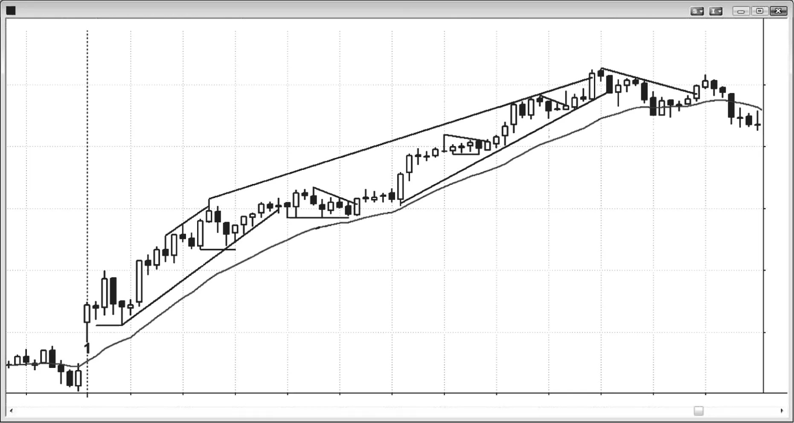

### CHAPTER 18 Example of How to Trade a Trend

<!-- Source PDF pages 321–338 -->

<!-- PDF page 321 -->

C H A P T E R 1 8
Example of How
to Trade a Trend
W
hen the market is in a trend, traders should look for any reason to enter.
The simple existence of a trend is reason enough to enter at least a small
position at the market. Here are some other reasonable approaches that
use stop entry orders:
r Buying a high 2 pullback to the moving average in a bull trend.
r Selling a low 2 pullback to the moving average in a bear trend.
r Buying a wedge bull flag pullback in a bull trend.
r Selling a wedge bear flag pullback in a bear trend.
r Buying a breakout pullback after a breakout from a bull flag in a bull trend.
r Selling a breakout pullback after a breakout from a bear flag in a bear trend.
r Buying a high 1 pullback in a strong bull spike in a bull trend, but not after a
buy climax.
r Selling a low 1 pullback in a strong bear spike in a bear trend, but not after a
sell climax.
r When a bull trend is very strong, buying on a stop above a prior swing high.
r When a bear trend is very strong, selling on a stop below a prior swing low.
Entering using a limit order requires more experience reading charts, because
the trader is entering in a market that is going in the opposite direction to the trade.
However, experienced traders can reliably use limit or market orders with these
potential setups:
r Buying a bull spike in a strong bull breakout at the market, at the close of every
bull trend bar in the spike, or on a limit order at or below the low of the prior

<!-- PDF page 322 -->

TRENDS
bar (entering in spikes requires a wider stop and the spike happens quickly, so
this combination is difficult for many traders).
r Selling a bear spike in a strong bear breakout at the market, at the close of
every bear trend bar in the spike, or on a limit order at or above the high of the
prior bar (entering in spikes is difficult for many traders).
r Buying the close of the first bear bar in a bull spike.
r Selling the close of the first bull bar in a bear spike.
r In a bull trend, buying at a bull trend line or at a prior swing low (a potential
double bottom bull flag).
r In a bear trend, selling at a bear trend line or at a prior swing high (a potential
double top bear flag).
r Buying at or below a low 1 or 2 weak signal bar on a limit order in a possible
new bull trend after a strong reversal up or at the bottom of a trading range.
r Shorting at or above a high 1 or 2 weak signal bar on a limit order in a possible
new bear trend after a strong reversal down or at the top of a trading range.
r Buying at or below the prior bar on a limit order in a quiet bull flag at the moving
average.
r Shorting at or above the prior bar on a limit order in a quiet bear flag at the
moving average.
r Buying below a bull bar that breaks above a bull flag, anticipating a breakout
pullback.
r Selling above a bear bar that breaks below a bear flag, anticipating a breakout
pullback.
r When trying for a swing in a bull trend, buy or buy more on a breakout test,
which is an attempt to run breakeven stops from an earlier long entry.
r When trying for a swing in a bear trend, sell or sell more on a breakout test,
which is an attempt to hit breakeven stops from an earlier short entry.
r Buying at a fixed number of ticks down from the high in a bull trend. For example, buying a two-, three-, or four-point pullback in a bull trend in the Emini
when the average daily range has been about 12 points. Also, if the biggest pullback in the first couple of hours was 10 ticks, buying about an eight- to 12-tick
pullback.
r Selling at a fixed number ticks up from the low in a bear trend. For example,
selling a 50 cent bear rally in GS when the average daily range has been about
$2.00. If the largest pullback in the first couple of hours was 60 cents, selling
about a 50 to 70 cent pullback.
r Scaling into the direction of the trend as the market moves against you. If you
scale in, plan out in advance what size each order has to be to keep your total
risk the same as with a typical trade. It is easy to find yourself with too large a
position and a protective stop that is too far away, so be very careful.

<!-- PDF page 323 -->

EXAMPLE OF HOW TO TRADE A TREND
r In a bull trend that has not pulled back to the moving average in 20 or more bars,
buy at the moving average on a limit order, and scale in lower. For example, if
there is a strong bull trend in the Emini where the market has been above the
moving average for 20 or more bars, buy with a limit order at one tick above the
moving average. Buy more one, two, and maybe three points lower. If scaling
in, consider exiting the entire position at the first entry price, but if the bull
trend is strong, look to exit on a test of the high.
r In a bear trend that has not pulled back to the moving average in 20 or more
bars, sell at the moving average on a limit order and scale in higher. For example, if there is a strong bear trend in the Emini where the market has been
below the moving average for 20 or more bars, sell with a limit order at one tick
below the moving average. Sell more one, two, and maybe three points higher.
If scaling in, consider exiting the entire position at the first entry price, but if
the bear trend is strong, look to exit on a test of the low.
r In a strong bull trend, buy on the close of the first bear trend bar that has a
close below the moving average.
r In a strong bear trend, sell on the close of the first bull trend bar that has a close
above the moving average.
r In a strong bull trend, a pullback is a small bear trend. The bulls will expect
that a breakout below a prior swing low in this small bear trend will fail, and
they will buy there with a limit order.
r In a strong bear trend, a pullback is a small bull trend. The bears will expect
that a breakout above a prior swing high in this small bull trend will fail, and
they will short there with a limit order.
r A trader can always be long, short, or flat. At any moment during a trend, only
two of those choices are compatible with being a successful trader. If the market is in a bull trend, successful traders are only long or flat. If it is in a bear
trend, they are either short or flat. A tiny fraction of traders have the ability to
consistently make money by trading against a trend, and you should assume
that you are not part of that group. Unfortunately, most traders starting out go
for years believing that they are, and they consistently lose money month after
month and wonder why. You now know the answer.
Every type of market does something to make trading difficult. The market
is filled with very smart people who are trying as hard to take money from your
account as you are trying to take money from theirs, so nothing is ever easy. This
includes making profits in a strong trend. When the market is trending strongly with
large trend bars, the risk is great because the stop often belongs beyond the start
of the spike. Also, the spike grows quickly, and many traders are so shocked by the
size and speed of the breakout that they are unable to quickly reduce their position

<!-- PDF page 324 -->

TRENDS
size and increase their stop size, and instead watch the trend move rapidly as they
hope for a pullback. Once the trend enters its channel phase, it always looks like
it is reversing. For example, in a bull trend, there will be many reversal attempts,
but almost all quickly evolve into bull flags. Most bull channels will have weak buy
signal bars and the signals will force bulls to buy at the top of the weak channel. This is a low probability long trade, even though the market is continuing up.
Swing traders who are comfortable taking low probability buy setups near the top
of weak bull channels love this kind of price action, because they can make many
times what they are risking, and this more than makes up for the relatively low
probability of success. However, it is difficult for most traders to buy low probability setups near the top of a weak bull channel. Traders who only want to take high
probability trades often sit back and watch the trend grind higher for many bars,
because there may not be a high probability entry for 20 or more bars. The result
is that they see the market going up and want to be long, but miss the entire trend.
They only want a high probability trade, like a high 2 pullback to the moving average. If they do not get an acceptable pullback, they will continue to wait and miss
the trend. This is acceptable because traders should always stay in their comfort
one. If they are only comfortable taking high probability stop entries, then they are
correct in waiting. The channel will not last forever, and they will soon find acceptable setups. Experienced traders buy on limit orders around and below the lows
of prior bars, and they will sometimes take some short scalps during the bull channel. Both can be high probability trades, including the shorts, if there is a strong
bear reversal bar at a resistance level, and some reason to think that a pullback
is imminent.
With so many great ways to make money, why do most traders lose? It is because there are even more ways to make mistakes. One of the most common is that
a trader begins with one plan and, once in the trade, manages it based on a different
plan. For example, if a trader just lost on his past two long swing trades and now
buys a third, he might be so afraid of losing again that he scalps out, only to watch
the trade turn into a huge trend. Swing traders need these big wins to make up for
the losses, since swing trading often is less than 50 percent successful. If traders
do not hold on for the swing, they will not be getting the big wins that they need,
and they will lose money. Something opposite to this can happen to scalpers. They
might have taken a profitable scalp, but became sad when the trade turned into
a huge trend and they watched from the sidelines. When they see another scalp,
they take it, but once it reaches their profit target, they decide that the trade could
turn into a swing trade, just like last time, and they do not exit. A few minutes
later, the market comes back, hits their stop, and they take a loss. This is because
most scalps are high-probability trades, and when the edge is large and obvious,
the move is usually small and brief, and not the start of a big swing. The best way

<!-- PDF page 325 -->

EXAMPLE OF HOW TO TRADE A TREND
to make money is to have a sound strategy, and then stick to the plan. For most beginning traders, the plan should be some kind of swing trade, because the winning
percentage needed to be a successful scalper is much higher than most traders can
maintain for the long term.
Once traders take a position, they then have to decide how to manage it. The
most important decision that they have to make is whether they are looking for
a scalp or for a swing, both of which are discussed in detail in the second book,
as is trade management. Only the most experienced traders should consider scalping, because the risk is sometimes greater than the potential reward. This means
that they have to win about 70 percent of the time, which is impossible for anyone
except an extremely good trader. You should assume that you will never be that
good, because that is the reality. However, you can still be a very profitable trader.
If traders are trading the Eminis at a time when the average daily range is about 10
to 15 points, they generally have to risk about two points. For example, if they are
buying in a bull trend, their protective stop should be about two points below their
entry price. Alternatively, their stop can be one tick below the low of the signal bar,
which usually is still about two points. Some traders will risk five points or more on
a swing trade if they feel confident that the trend will eventually resume. This can
be a profitable approach for traders who understand the trader’s equation: trade
only when the chance of success times the potential reward is significantly greater
than the chance of failure times the risk.
If a trader is scalping, then he is trying to make between one and three points
on the trade. However, some scalpers think that two- and three-point trades are
small swings, and consider a scalp to be a one-point trade. Although there are many
trades every day where a trader can risk two points to make one point and have an
80 percent chance of success, there are many other setups that look similar but
have only a 50 percent chance of success. The problem that most traders have is
distinguishing between the two, and even a couple of mistakes a day can mean the
difference between making money and losing money. Most traders simply cannot
draw the distinction in real time, and end up losing money if they scalp. A trader
who scalps only the two or three best setups a day and trades enough volume might
be able to make a living as a scalper, but he might also find it difficult to watch the
market for hours and be ready to quickly place a trade when one of the rare, brief
setups unfolds.
The better way for beginning traders to make money is to swing their trades.
They can enter all at once, or can press their trades by scaling in as the market continues in their direction. This means that they are adding to their positions as their
earlier entries have growing profits. They can either exit all at once, or scale out
as the trade goes their way. For example, if they buy early in a bull trend, their initial stop is two points, and they are confident that the trade will work, they should

<!-- PDF page 326 -->

TRENDS
assume that the probability of success is at least 60 percent. Because of that, they
should not take any profits until the trade has gone at least two points. The mathematics of trading are discussed in the second book. A trader should exit a trade only
when the chance of success (here, 60 percent or higher) times the potential reward
is significantly greater than the chance of failure (here, 40 percent or less) times
the risk. Since the protective stop is two points below the entry price, the risk is
two points. This means that the trader’s equation begins to become favorable only
when the reward is two points or more. Therefore, if traders take a smaller profit,
they will lose money over time, unless they believe that their probability of success
is about 80 percent, which is rarely the case. When it is, an experienced trader can
scalp part out at a one-point profit and still make money while using a two-point
stop. Most traders should never risk more than their reward.
So, how should traders swing their trades in that bull trend? This is addressed
more in the second book. Swing trading is much more difficult than it appears when
a trader looks at a chart at the end of the day. Swing setups tend to be either unclear
or clear but scary. After a trader sees a reasonable setup, he has to take the trade.
These setups almost always appear less certain than scalp setups, and the lower
probability tends to make traders wait. A trend begins with a breakout either from
a trading range or after a reversal of the current trend. When there is a potential
reversal and it has a strong signal bar, it usually comes when the old trend is moving
fast in a strong, final, climactic spike. Beginning traders invariably believe that the
old trend is still in effect, and they probably lost on several earlier countertrend
trades today and don’t want to lose any more money. Their denial causes them to
miss the early entry on the trend reversal. Entering as the breakout bar is forming,
or after it closes, is difficult to do because the breakout spike is often large, and
traders have to quickly decide to risk much more than they usually do. As a result,
they often end up choosing to wait for a pullback. Even if they reduce their position
size so that the dollar risk is the same as with any other trade, the thought of risking
two or three times as many ticks frightens them. Entering on a pullback is difficult
because every pullback begins with a minor reversal, and they are concerned that
the pullback might be the start of a deep correction, their stop will be hit, and they
will lose money. They end up waiting until the day is almost over. When they finally
decide that the trend is clear, there is no longer any time left to place a trade. Trends
do everything that they can to keep traders out, which is the only way they can keep
traders chasing the market all day. When a setup is easy and clear, meaning it has
a high probability of success, the move is usually a small, fast scalp. If the move is
going to go a long way, it has to be unclear and difficult to take, to keep traders on
the sidelines and force them to chase the trend.
Since a bull trend has trending highs and lows, then every time the market
reaches a new high, traders should raise their protective stop to one tick below
the most recent low. This is called trailing their stop. Also, if their profit is large

<!-- PDF page 327 -->

EXAMPLE OF HOW TO TRADE A TREND
enough, they should consider taking partial profits as the market goes above the
most recent high. Lots of traders do this and that is why trends often pull back
after reaching a new high. The pullback very often goes below the original entry price, and inexperienced swing traders will have tightened their stops to the
breakeven price and will get stopped out of a great trend trade. Once the market
tests the original entry price and then goes to a new high, most traders would then
raise their stops to at least their entry price because they would not want the market to come back to test it a second time after reaching a new high following the
first test. Others would put it below the low of the pullback that just tested their
original entry.
Some traders will allow pullbacks below the signal bar as long as they believe
that their premise of a bull trend is still valid. For example, assume that the average range in the Emini has been about 10 to 15 points lately, and they bought
a high 2 pullback in a bull trend on the 5 minute chart. If the signal bar was two
points tall, they might be willing to hold on to their position even if the market
falls below the low of the signal bar, thinking that the pullback might evolve into
a high 3, which is a wedge bull flag buy setup. Other traders would exit if the
market falls below the signal bar and then buy again if a strong high 3 buy signal sets up. Some might even buy a position that is twice as large as their first,
because they see the strong second signal as more reliable. Many of these traders
would have bought just a half-size position on the high 2 buy signal if they thought
that the signal did not look quite right. They were allowing for the possibility of
the high 2 failing and then evolving into a wedge bull flag, which might even look
stronger. If it turned out to be, they would then feel comfortable trading their usual
full size.
Other traders trade half size when they see questionable signals, exit if their
protective stop is hit, and then take the second signal with a full size if the signal
is strong. Traders who scale in as a trade goes against them obviously do not use
the signal bar extreme for their initial protective stop, and many look to scale in
exactly where other traders are taking losses on their protective stops. Some simply use a wide stop. For example, when the average daily range in the Emini is less
than about 15 points, a pullback in a trend is rarely more than seven points. Some
traders will consider that the trend is still in effect unless the market falls more
than between 50 to 75 percent of the average daily range. As long as a pullback is
within their tolerance, they will hold their position and assume that their premise
is correct. If they bought a pullback in a bull trend and their entry was three points
below the high of the day, then they might risk five points. Since they believe that
the trend is still in effect, they believe that they have a 60 percent or better chance
of an equidistant move. This means that they are at least 60 percent certain that
the market will go up at least five points before falling five points to their protective stop, which creates a profitable trader’s equation. If their initial buy signal in

<!-- PDF page 328 -->

TRENDS
the bull pullback came at five points below the high, then they might risk just three
points, and they would look to exit their long on a test of the high. Since the pullback was relatively large, the trend might be a little weak, and this might make them
take profits below the trend high. They would try to get at least as much as they had
to risk, but they might be willing to get out just below the old high if they were concerned that the market might be transitioning into a trading range, or possibly even
reversing into a bear trend.
At some point, selling pressure will be strong enough to convert the trend into
a trading range, which means that a pullback might fall below the most recent low.
Experienced traders have a good sense of when the market is transitioning from a
trend into a trading range, and many will exit the remainder of their positions when
they believe that it is about to happen. They might then trade the trading range
using a trading range approach, which means looking for smaller profits. This is
discussed in the second book. They might instead hold on to part of their long
positions until either the close or when the market flips into always-in short. If it
does, they would then either exit their longs or reverse to short. Very few traders
can reverse consistently, and most prefer to exit their longs and then reassess the
market, and maybe take a break before looking to go short.

<!-- PDF page 329 -->

Figure 18.1

EXAMPLE OF HOW TO TRADE A TREND
FIGURE 18.1
Strong Trend Day in GS
There are countless ways to trade any day, but when there is a trend like the bull
trend in GS shown in Figure 18.1, traders should try to swing at least part of their
trade. I had extensive discussions years back with a trader who excelled on days
like this. He bought early and then determined his initial risk (how far his protective
stop was from his entry price). He then took half of his position off once the market
reached twice his initial risk and held the other half until there was a clear reversal.
If there never was a strong reversal, he exited in the minutes before the close. After
every new high, he tightened his stop to below the most recent higher low, since as
long as the trend kept making higher highs and lows, it was still strong. If it stopped
making higher lows, it was beginning to weaken.
There is one sure way to consistently lose money on a day like this, and all
traders know it. Successful traders avoid it, but beginners are irresistibly drawn to
it. They see the market as constantly overdone. The most recent bar is always at the
top of the computer screen and there surely can’t be enough room up there to go
higher, and there clearly is a lot of room below. Also, they know trends have pullbacks, so why not short every reversal for a scalp, and then go long on the pullback?
Even if the trade is a loser, the loss is not big. They don’t buy the pullback when it
finally comes, because the market might be reversing into a bear trend, and the buy
setup does not look strong enough. Also, since they were short and the market did
not quite reach their scalper’s profit target, they were rooting for the market to go

<!-- PDF page 330 -->

TRENDS
Figure 18.1
down just a little bit more, and therefore were not expecting, and actually not wanting, the pullback to end just yet. They saw bars 7, 10, 18, 20, 21, and 24 as reversals
that were likely to fall far enough to offer at least a scalper’s profit and as potential
highs of the day. However, experienced traders know that 80 percent of reversal
attempts fail and become bull flags, and they held long, took some profits on their
earlier longs, or bought more as the pullback progressed. The beginners don’t accept this premise and they take small losses all day, and by the end of the day are
shocked that they have lost so much. They have been successful all their lives in
other careers and are very smart. They see trading gurus on television who look
more like clowns and used car salesmen than like formidable adversaries, so they
are confident that they can trade at least as well as those so-called experts. They
are right in their assessment of the abilities of those pundits, but wrong in their
assumption that those people are successful traders. They are entertainers, and the
networks hire them to create an audience that will result in advertising dollars. The
networks are companies, and like all companies, their goal is to make money, not
to help the viewer in any way. Beginners do not stop losing until they are able to
stop themselves from looking for shorts in bull trends (or bottoms in bear trends).
They can start winning only when they accept that each top is the start of a bull flag.
Some of the material that follows will be covered later in books 2 and 3, and is
included here because it is important in trend trading.
Great swings usually begin with weak setups, like the two-bar reversal that began at bar 3. Both bars were small dojis, and they followed a large two-bar reversal
top. The setup that leads to the breakout is usually weak enough to trap traders
out. Traders wait for a higher-probability setup after the breakout occurs, and miss
the initial breakout. Entering either on the low-probability setup or on the higherprobability ones after the breakout are both mathematically sound approaches.
Most traders would have decided that the always-in direction was up by either
bar 2 or bar 4. That means that they believed that the market was in a bull trend and
they therefore would look for sensible reasons to buy, and there were many. They
could have bought as bar 4 broke above bar 2, on the close of bar 4, or at one tick
above its high. They could have placed a limit order to buy at or below the low of the
next bar and the lows of the next several bars. They would have been filled below
bar 5. Some would have placed orders to buy a small pullback to the midpoint of the
prior bar, maybe 20 cents down. They also would have looked to buy a bear close
because they believed that attempts to reverse should fail. The move from bar 4 to
bar 5 was a tight channel, so an attempt to break to the downside was likely to fail.
They could have bought below bar 5, on the close of the small bear trend bar that
followed, or above it as a failed breakout below a bull micro channel. Bar 7 was
a breakout pullback short but traders expected it to just lead to a pullback. The
market broke below the bull micro channel on the move below bar 5, and the rally
to bar 7 was a breakout pullback higher high. Traders expected the reversal to fail

<!-- PDF page 331 -->

Figure 18.1
EXAMPLE OF HOW TO TRADE A TREND
and some had limit orders maybe 50 cents down and in the area of the bar 6 low,
expecting a double bottom bull flag. Some traders had their protective stops below
bar 6 since it was a strong bull trend bar, and a strong bull trend usually would
not fall below such a bar. Therefore, buying just above its low was a low-risk, highreward trade with at least a 50 percent chance of success. They also could have
bought above the bull reversal bar that followed bar 8 since it was a double bottom
bull flag setup and a high 2 long (bar 6 was the high 1).
Bar 9 was another break below a bull micro channel, and traders expected it
to fail. Some would have had limit orders to buy at the low of the prior bar as the
micro channel was growing, and they would have been filled on bar 9. Other traders
bought above the bar 9 high as a failed breakout below the bull micro channel.
Bar 11 was another high 2 buy setup, but the market had been mostly sideways
for over 10 bars, and the bars were getting small. Although this was also a double
bottom buy signal, the tight trading range could have continued, so many traders
would have waited to see if there was a third push down and then looked to buy
above the wedge bull flag, which some traders would have seen as a triangle, since
it would have been sideways instead of down. These traders got long on bar 12 and
above bar 12. After the breakout from this bull flag, the market went sideways for
several bars and created a breakout pullback buy entry above bar 13 and again on
the bar 14 outside up strong bull trend bar. This was a high 2 entry bar since bar 13
was a high 1 entry and the pullback below the next bar was a second leg down in
this four-bar-long tight trading range.
Some traders bought as the market broke above bar 10, which they saw as a
breakout of a trading range in a bull trend. Traders also bought the close of bar 14
and above its high. The next bar had good follow-through, which was a sign of
strength, and traders therefore bought its close and above its high. There was a
two-bar pause, creating a small breakout pullback bull flag, and traders bought the
breakout above the bar after bar 15.
Bar 16 was a doji top but there was no prior bear strength and no significant
selling pressure, and the bar was small and weak compared to the bar 14 bull spike.
Traders expected the reversal attempt to fail and therefore placed limit orders to
buy at and below its low. Bar 17 was a failed top buy signal, and bar 19 was a small
second push down and therefore a high 2 buy setup. Traders bought as the market
went above its high and above the high of the bull bar that followed it, which was a
two-bar reversal buy setup.
The move up to bar 20 was another strong bull spike. Traders would have
bought at and below the low of the prior bar, on the close of the bull trend bars, and
on the close of the first bear trend bar, like the bar after bar 20. Since bar 20 was an
especially large bull trend bar in a mature trend, it was enough of a buy climax to
warrant a larger correction, one that might go sideways or down to the moving average. There was less urgency for the bulls, who were expecting a high 2 or a triangle.

<!-- PDF page 332 -->

TRENDS
Figure 18.1
Bar 21 was a one-bar final flag reversal attempt but the up momentum was
strong. Traders expected another bull flag and not a reversal. Some bought below
its low while others waited to see if there would be a high 2, a wedge bull flag,
or a triangle. Bar 22 was another double bottom and therefore a high 2 buy setup.
Traders placed stop orders to go long above its high and above the high of the inside
bar that followed it. Some saw bar 23 as a high 2 buy setup with the bar after bar
20 as the signal for the high 1. Others saw it as a wedge bull flag with the first push
down as the bear bar after bar 20. It was also a breakout pullback buy setup for the
breakout above the bull flag that occurred on the prior bar.
Bar 24 was a very important bar. It was the third push up and third consecutive
buy climax after the spike up from bar 14 (the top of the spike was the first push).
The channel in a spike and channel bull often ends on a third push up and is then
followed by a correction. Also, bar 24 was a particularly strong bull trend bar in a
protracted bull trend. This is just the bar that strong bulls and bears were waiting
for. Both saw it as a possible temporary end of the trend, and they expected it to
be a brief opportunity to sell before a larger pullback developed. Both expected
a correction to have at least two legs and 10 bars and to penetrate the moving
average. The bulls were selling to take profits and the bears were selling to initiate
shorts. Both sold at the close of bar 24, above its high, at the close of the next bar,
and below its low.
The bulls thought that the market might be transitioning into a trading range,
and that there was a reasonable chance that they could buy again lower. Bar 28 was
a two-legged correction to the moving average and therefore a high 2 buy setup. It
was also the first touch of the moving average all day, and therefore a 20 gap bar
buy setup, and was likely to be followed by a test of the bull high. The bears took
profits on their shorts here and the bulls bought for another leg up.
The biggest prior pullback of the day since the rally began at bar 3 was 75 cents
on the pullback to bar 8. Some traders expected the largest pullback of the day to
come after 11:00 a.m. or so and therefore had limit orders to go long at 75 cents
below the most recent swing high. They might have scaled in at 75 cents below that
and maybe risked up to a little more than twice the size of that first pullback, or
about $1.60. Throughout the day, traders would have expected pullbacks to remain
less than the first and they would have had limit orders to buy any pullback that
was about half as big, or maybe 40 to 50 cents. The pullback to bar 11 was 40 cents,
which meant that traders tried to buy a 50 cent pullback and when they did not
get filled on the second attempt on the bar before bar 12, they decided to chase
the market up and bought above the high of bar 12. Some traders saw the bars 9
and 11 double bottom and would have placed limit orders to buy just above its low,
maybe 30 cents down from the high. Traders would then have to determine where a
worst-case protective stop would be. They should pick a level where they would no
longer want to be long. An obvious location would have been below the bar 8 low,

<!-- PDF page 333 -->

Figure 18.1
EXAMPLE OF HOW TO TRADE A TREND
since a bull trend has a series of higher highs and lows, and after each new high,
the bulls expect the next pullback to stay above the most recent higher low. Since
they were planning to get long at $161.05, 30 cents down from the high, and they
would need to risk to around $160.35 or 70 cents lower, they had to determine the
position size. If they normally risk $500 or less on a trade, they could have bought
600 shares of GS. Since they were risking 70 cents and they always should have a
reward that is at least as large as their risk, their profit target should have been at
least 70 cents above their entry. This was clearly a strong trend day at this point
and the probability of success was therefore at least 60 percent, and maybe higher.
On a strong trend day like this, it was far better to use a generous profit target.
Traders should not have tried to take any profit until the market went to at least
twice their risk, or $1.40 above their entry price. They would have placed a limit
order to sell half of their position at $162.45. After the bar 12 strong bull trend bar
broke above the triangle (some thought of it as a wedge bull flag), they could have
tightened their protective stop to just below its low at $161.05, reducing their risk
to less than 20 cents. After the bar 14 strong bull trend bar breakout, they could
have tightened their stop to just below its low, reducing their risk to a penny. Their
limit order to take profits on 300 shares would have been filled on bar 20, giving
them $420. At that point, they could have tightened their protective stop to below
the bar 19 start of that most recent bull spike. If the stop was hit, they would have
made about 80 cents on their remaining 300 shares. At this point, they would have
held their position until there was a clear reversal down or until the close. When
you have a large profit, it is usually wise to exit in the final hour or so on any setup
that could lead to a larger pullback and then maybe look to get long again once
that two-legged pullback is complete. The bear reversal bar at bar 24 was a third
push up and was followed a buy climax bar, so the market could finally have been
getting ready to pull back to the moving average. If traders exited below its low,
they would have made $2.00, or $600, on their remaining 300 shares. If they held
until the close, they would have made $375 on those shares. The market never even
clearly became always-in short.
Many traders would have bought on a limit order at one tick above the moving
average as bar 27 tested the moving average, since it was a 20 gap bar buy setup,
and held for a test of the high. Some traders would have bought on the close of
bar 27 because it was the first bear trend bar with a close below the moving average.
Although it was the second bar of a two-bar bear spike and a breakout below bar 25,
the bears needed follow-through before believing that the market had flipped to
always-in short, and instead got a bull inside bar for the next bar. This was the
bottom of a developing trading range and the test of the beginning of the channel
up from the bar 22 pullback from the four-bar bull spike up to bar 20. The bull bar
that followed bar 27 also closed above the moving average. Some bulls would have
bought on the close of that bull bar, while others would have bought at one tick

<!-- PDF page 334 -->

TRENDS
Figure 18.1
above its high. Their entry would have been three bars later. Traders would also
have bought above the high of the inside bar that followed bar 28, since it was a
high 2 buy signal, ending two legs down from the high of the day. It was also a small
wedge bull flag where bar 25 was the first push down and bar 27 was the second.
A pullback is a minor trend in the opposite direction, and traders expect it to
end soon and for the major trend to resume. When GS began its second leg down
from the bar 24 high, it formed a lower high at bar 26 and the bears needed it to form
a series of lower highs and lows to be able to convince the market that the trend had
reversed to down. Some therefore shorted as the market broke out below the bar 25
swing low, hoping for a series of large bear trend bars. Instead, bar 25 was a small
bear trend bar and there was no follow-through. In fact, the rally up showed that
most traders instead bought the breakout below bar 25 because they believed that
the sell-off was only a pullback and doomed to be a failed attempt at reversing the
major trend into a bear trend. Since most reversal attempts fail, the first pullback
in a strong bull trend that has a second leg down usually is bought aggressively as
it breaks below the prior swing low, and many bulls bought this one, even though
it took several bars before they could turn the market up again. This was a sign
that they were not as aggressive as they could have been. This told traders that the
pullback might evolve into a larger trading range, which it ultimately did.
Many traders use trend lines for entering and exiting. Some would have taken
partial profits near the high of bar 7 as it moved above the trend channel line. They
also would have bought as bar 9 fell below the bull trend line and above the bar 9
high, since they saw bar 9 as a failed channel breakout. Bar 12 broke above a small
bear trend line, and traders bought as the bar moved above the line since they saw
that as the end of the pullback and the resumption of the bull trend. Bar 24 was
the third push up in the channel that followed the two-bar bull spike that began at
bar 14, and some traders would take profits on their longs above that line, even on
the strong bull close of bar 24. The bar was an especially large bull trend bar and
the third consecutive bull climax since bar 14, and the market was likely to have a
more complex correction. What better place to take profits than on a buy vacuum
test of a trend channel line on the third consecutive buy climax? The move down to
bar 28 broke below the bull trend line and held below it for many bars, so traders
wondered if a larger correction might be starting. This made many quicker to take
profits. When the move up from bar 28 could not produce any strong bull trend
bars, traders thought that the market might be in a trading range and therefore
took profits on the bar 29 test of the bar 26 lower high. This was a potential double
top bear flag and lower high trend reversal. The next bar was a bear trend bar,
which indicated that the bulls were becoming less aggressive and the bears were
becoming stronger.
When a bull trend is very strong, traders can buy for any reason if they use a
wide enough stop, and many traders like to buy on breakouts above prior swing

<!-- PDF page 335 -->

Figure 18.1
EXAMPLE OF HOW TO TRADE A TREND
highs. However, buying pullbacks before the breakout generally offers more reward, smaller risk, and a higher probability of success. The breakout traders will
place buy stops at one tick above the old high and will be swept into their longs
as the market breaks above the old high. The most common reason for traders
failing to buy a pullback is that they were hoping for a larger or better-looking pullback. Many pullbacks have bear signal bars or follow two or three bar bear spikes,
making traders believe that the bull trend needs to correct more before resuming.
However, it is important to get long when there is a strong bull trend, and a trader
should place a buy stop above the prior swing high when the trend is very strong,
in case the pullback is brief and the trend quickly resumes. Reasonable entries included the bar 4 breakout above the bar 2 high and the breakouts up to bar 10 as it
moved above bar 7, the bar 14 spike as it went above bar 10, and the bar 20 spike
as it moved above bar 16. These old highs are often the highs of higher time frame
bars, like on the 15 or 60 minute charts, so the entry is usually a breakout above the
high of a prior bull trend bar on these higher time frame charts. Since higher time
frame charts have larger bars and the protective stop is initially below the signal
bar, the risk is greater and traders should trade smaller size, unless they are only
looking for a quick, small scalp. After the trend has gone on for a while, the pullbacks become deeper and last for more bars. Once the two-sided trading becomes
apparent, the strong bulls begin to take profits above swing highs rather than buying new positions, and the strong bears begin to scale into shorts as the market
goes above the old highs. For example, the bear bar after bar 20 and the bar 22 bear
bar were signs of selling pressure, so most traders would have used the move above
the bar 21 high to take profits rather than to buy more. At some point, most traders
will see new highs as shorting opportunities and not simply as areas to take profits.
Although many traders shorted below the bear bar after bar 24, most traders still
believed that the trend was up and that there would be a test of the bull high after
a pullback. Until there has been a strong bear move that breaks well below the bull
trend line, the strong bears usually will not dominate the market.
Since this was a trend day, a trader would ideally swing part, take profits along
the way, and then go back to a full position size on every pullback. However, most
traders cannot continue to hold part of their trade for a swing and also repeatedly
scalp the other part. Traders instead should try to put on a full position early and not
take additional signals, and instead scale out of their profits as the market works
higher. There are many ways to do this. For example, if they bought early on and
had to risk about $1.00 (probably less), they might have taken a quarter off after a
$1.00 profit and another quarter off at $2.00, and maybe a third quarter at $3.00, and
held onto the final quarter until either a strong sell signal formed or until the end of
the day. It was better if they instead waited until the market rallied $2.00, or twice
their initial risk, before taking their initial profit, because they had to sure that they
were adequately compensated for taking that initial $1.00 risk. It does not matter

<!-- PDF page 336 -->

TRENDS
Figure 18.1
how they did it, but it was important to have taken some profit along the way in
case the market reversed down. However, since traders subjected themselves to
risk, they must resist the temptation to exit with too small a reward. As long as
the trend is good, it is always best to try to resist taking profits until the market
has gone at least twice as far as your initial risk. If traders are out of half of their
position but then see another strong buy signal, they might put part or all of the
other half back on, at least for a scalp; but most traders should simply stick to their
original plan and enjoy their growing profit.
With all of these buy signals, traders could have accumulated an uncomfortably large long position if they kept adding new longs, which they should not have
done. Instead, they should have simply held their position until a possible end of
the trend, like at bar 24, or they could have scalped out part after each new high
as soon as a bar had a weak close, like at bars 16, 21, or 24. Then they could have
put the scalp portion back on when they saw another buy signal. They would have
continued to hold their swing portion until the end of the trend.
When did traders see this day as a trend day? Aggressive bulls thought that the
gap up and strong bull trend bar had a reasonable chance of leading to a trend from
the open bull trend day, and they might have bought on the close of bar 1 or one
tick above its high. Their initial protective stops were one tick below the bar 1 low,
and they planned on holding part or all of the position until the close or until a clear
short signal formed.
Other traders always look for double bottoms on gap up days, and they would
have bought above the two-bar reversal that began at bar 3, which formed an approximate double bottom with bar 1 or with the low of doji bar that followed it.
Bar 4 was a strong bull trend bar that broke above the opening range and closed
above the bar 2 high. Some traders bought at one tick above the bar 2 high, and
others bought on the close of bar 4 or one tick above its high. This breakout bar
was a statement by the bulls that they owned the market, and most traders at this
point believed that the market was always-in long. For the time being, the best place
for a protective stop was one tick below its low, but since that was almost a dollar
lower, traders had to choose a small enough position size so that they were trading
within their comfort zone.
Most traders saw the day as a bull trend day by bars 5 or 7, and probably as
soon as bar 4 closed. Once traders believe the day is a trend day, if they are flat, they
should buy a small position either at the market or on any small pullback. Traders
could have placed limit orders to buy below the low of the prior bar and to buy at
a certain number of cents down, like maybe 20, 30, or 50 cents. Others would have
looked to buy above a high 2 on a stop or on a moving average pullback. Buying
above the bar 8 two-bar reversal was a reasonable long, as was the wedge bull flag
(some saw it as a triangle) that ended in a two-bar reversal at bar 12. The protective
stop would still have been below the bar 4 low or maybe below its midpoint. Traders

<!-- PDF page 337 -->

Figure 18.1
EXAMPLE OF HOW TO TRADE A TREND
need to trade small enough so that their risk is within their normal risk tolerance.
Other traders had their stops below the bars 6 and 8 double bottom, and if they got
stopped out but the market then formed another buy signal and they believed that
the bull trend was still intact, they would have bought again.
The most important thing that traders must force themselves to do, and it is
usually difficult, is as soon as they believe that the day is in a trend, they must take at
least a small position. They must decide where a worst-case protective stop would
be, which is usually relatively far away, and use that as their stop. Because the stop
will be large, their initial position should be small if they are entering late. Once the
market moves in their direction and they can tighten their stop, they can look to
add to their position, but they should never exceed their normal risk level. When
everyone wants a pullback, it usually will not come for a long time. This is because
everyone believes that the market will soon be higher, but they do not necessarily
believe that it will be lower anytime soon. Smart traders know this and therefore
they start buying in pieces. Since they have to risk to the bottom of the spike, they
buy small. If their risk is three times normal, they will buy only one-third of their
usual size to keep their total dollar risk within their normal range. When the strong
bulls keep buying in small pieces, this is buying pressure, and it works against the
formation of a pullback. The strong bears see the trend, and they too believe that
the market will soon be higher. Since they think it will be higher soon, they will stop
looking to short. It does not make sense for them to short if they think that they can
short at a better price after a few more bars. So the strong bears are not shorting and
the strong bulls are buying in small pieces, in case there is no pullback for a long
time. What is the result? The market keeps working higher. Since you need to be
doing what the smart traders are doing, you need to buy at least a small amount at
the market or on a one- or two-tick pullback or a 10 or 20 cent pullback, and risk to
the bottom of the spike (the low of bar 4 for most traders, but some would have put
their stops below the low of bar 3). Even if the pullback begins on the next tick, the
odds are that it won’t fall far before smart bulls see it as value and buy aggressively.
Remember, everyone is waiting to buy a pullback, so when it finally comes it will
only be small and not last long. All of those traders who have been waiting to buy
will see this as the opportunity that they wanted. The result is that your position
will once again be profitable very soon. Once the market goes high enough, you can
look to take partial profits or you can look to buy more on a pullback, which will
probably be at a price above your original entry. The important point is that as soon
as you decide that buying a pullback is a great idea, you should do exactly what the
strong bulls are doing, and buy at least a small position at the market.
After the market moved above the bar 7 high, many traders trailed their protective stops below the most recent swing low, which was at bar 8. As long as the
market holds above the most recent swing low, the trend is likely still very strong. If
it starts to make lower lows, the market could be transitioning into a trading range

<!-- PDF page 338 -->

TRENDS
Figure 18.1
or even a bear trend. In either case, traders would then trade it differently from how
they would trade a one-sided market (a trend).
Bulls would continue to buy pullbacks all day long, and after the market went
to another new swing high, they would move their protective stop to below the
most recent swing low. For example, once the market moved above the bar 16
high, traders tightened their protective stops to below the bar 19 low. Many traders
moved their stops to breakeven once there was a pullback that tested their entry
price and then the market reached a new high. They did not want the market to
come back down to their entry price a second time, and if it did, they would have
believed that the trend was not strong.
Bar 24 was the third push up from the spike up to bar 15 (bar 21 was the second
push up), so the market was likely to correct for a couple of legs sideways to down.
The bar after it was a bear inside bar so the market might have reversed down at
this point, especially since this would have been a failed breakout above the trend
channel line. The market made a couple of attempts to pull back to the moving
average earlier in the day, so it was reasonable to assume that it might succeed this
time. This was a good place to take profits on the swing longs. Aggressive traders
might have gone short for a scalp, but most traders would have waited to see if a
20 gap bar buy signal formed at the moving average.
Should traders try to take most of these entries? Absolutely not. However, if
they are watching on the sidelines, wondering how to get in, all of these setups are
reasonable. If they take just one to three of these swing entries, they are doing all
that they need to do and should not worry about all of the others.
