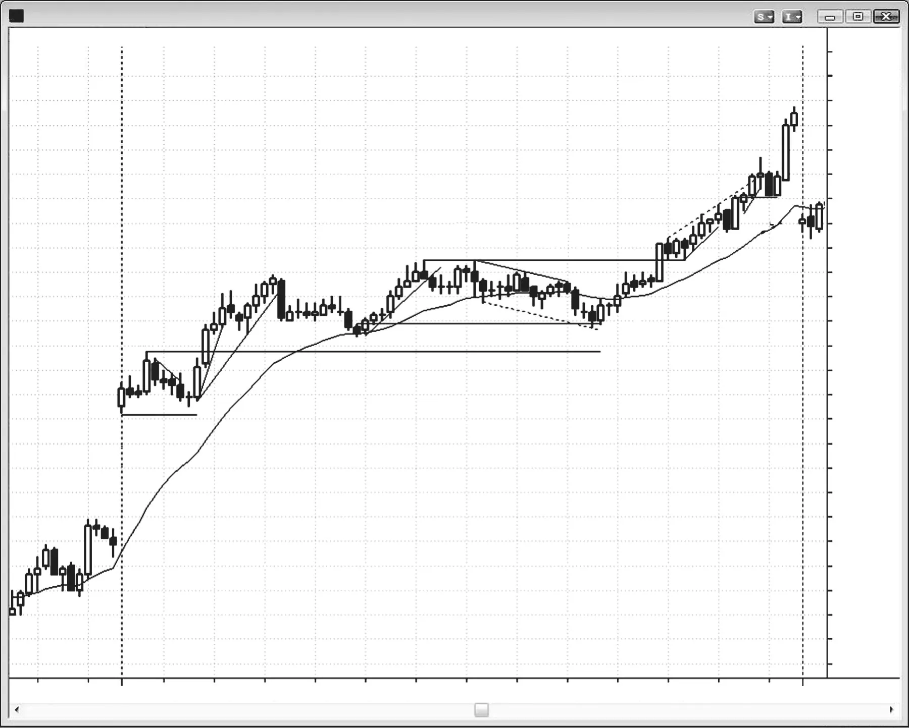
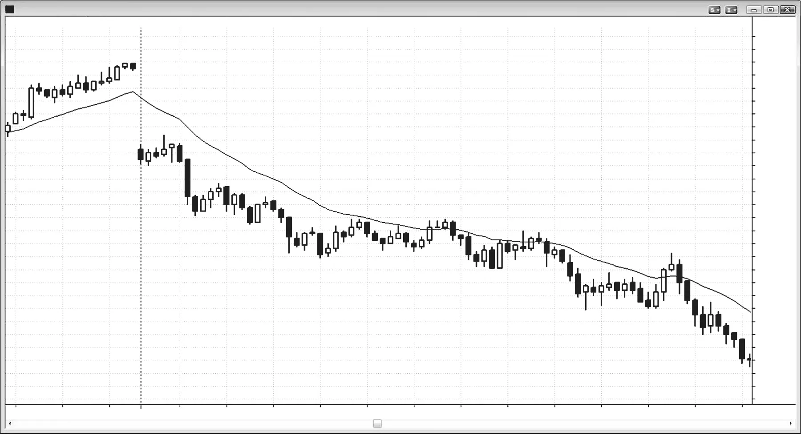
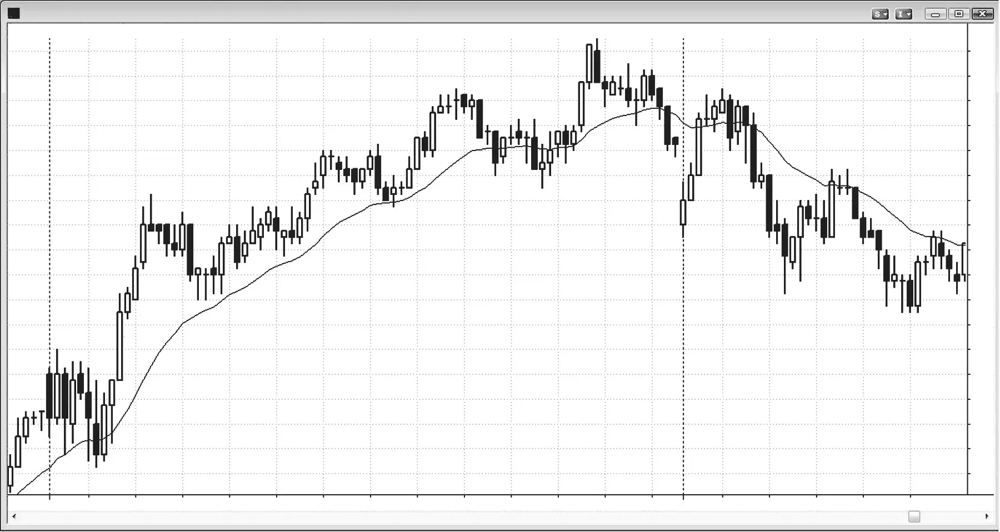

### CHAPTER 19 Signs of Strength in a Trend

<!-- Source PDF pages 339–350 -->

<!-- PDF page 339 -->

C H A P T E R 1 9
Signs of Strength
in a Trend
T
here are many characteristics of strong trends. The most obvious one is that
they run from one corner of your chart to the diagonally opposite corner with
only small pullbacks. However, in the early stages of a trend, there are signs
that indicate that the move is strong and likely to last. The more of these signs that
are present, the more you should focus on with-trend entries. You should start to
look at countertrend setups only as great with-trend setups, with you entering on a
stop exactly where those countertrend traders will be forced to exit with a loss.
One interesting phenomenon in trend days is that on many of the days, the best
reversal bars and the biggest trend bars tend to be countertrend, trapping traders
into the wrong direction. Also, the lack of great with-trend signal bars makes
traders question their entries, forcing them to chase the market and enter late.
Finally, once you realize that the market is in a strong trend, you don’t need a
setup to enter. You can enter anytime all day long at the market if you wish with a
relatively small stop. The only purpose of a setup is to minimize the risk.
Here are some characteristics that are commonly found in strong trends:
r There is a big gap opening on the day.
r There are trending highs and lows (swings).
r Most of the bars are trend bars in the direction of the trend.
r There is very little overlap of the bodies of consecutive bars. For example, in a
bull spike, many bars have lows that are at or just one tick below the closes of
the prior bar. Some bars have lows that are at and not below the close of the
prior bar, so traders trying to buy on a limit order at the close of the prior bar
do not get their orders filled and they have to buy higher.

<!-- PDF page 340 -->

TRENDS
r There are bars with no tails or small tails in either direction, indicating urgency.
For example, in a bull trend, if a bull trend bar opens on its low tick and trends
up, traders were eager to buy it as soon as the prior bar closed. If it closes on or
near its high tick, traders continued their strong buying in anticipation of new
buyers entering right after the bar closes. They were willing to buy going into
the close because they were afraid that if they waited for the bar to close, they
might have to buy a tick or two higher.
r Occasionally, there are gaps between the bodies (for example, the open of a
bar might be above the close of the prior bar in a bull trend).
r A breakout gap appears in the form of a strong trend bar at the start of the trend
(a trend bar is a type of gap, as discussed in book 2).
r Measuring gaps occur where the breakout test does not overlap the breakout
point. For example, the pullback from a bull breakout does not drop below the
high of the bar where the breakout occurred.
r Micro measuring gaps appear where there is a strong trend bar and a gap between the bar before it and the bar after it. For example, if the low of the bar
after a strong bull trend bar in a bull trend is at or above the high of the bar
before the trend bar, this is a gap and a breakout test and a sign of strength.
r No big climaxes appear.
r Not many large bars appear (not even large trend bars). Often, the largest trend
bars are countertrend, trapping traders into looking for countertrend trades
and missing with-trend trades. The countertrend setups almost always look better than the with-trend setups.
r No significant trend channel line overshoots occur, and the minor ones result
in only sideways corrections.
r The corrections after trend line breaks go sideways instead of countertrend.
r Failed wedges and other failed reversals occur.
r There is a sequence of 20 moving average gap bars (20 or more consecutive
bars that do not touch the moving average, discussed in book 2).
r Few if any profitable countertrend trades are found.
r There are small, infrequent, and mostly sideways pullbacks. For example, if
the Emini’s average range is 12 points, the pullbacks will all likely be less than
three or four points, and the market will often go for five or more bars without
a pullback.
r There is a sense of urgency. You find yourself waiting through countless bars
for a good with-trend pullback and one never comes, yet the market slowly
continues to trend.
r The pullbacks have strong setups. For example, the high 1 and high 2 pullbacks
in a bull trend have strong bull reversal bars for signal bars.
r In the strongest trends, the pullbacks usually have weak signal bars, making
many traders not take them, and forcing traders to chase the market. For

<!-- PDF page 341 -->

SIGNS OF STRENGTH IN A TREND
example, in a bear trend the signal bars for a low 2 short are often small bull
bars in two or three bar bull spikes, and some of the entry bars are outside
down bars. It has trending “anything”: closes, highs, lows, or bodies.
r Repeated two-legged pullbacks are setting up with trend entries.
r No two consecutive trend bar closes occur on the opposite side of the moving
average.
r The trend goes very far and breaks several resistance levels, like the moving
average, prior swing highs, and trend lines, and each by many ticks.
r Reversal attempts in the form of spikes against the trend have no followthrough, fail, and become flags in the direction of the trend.
When a trend is in runaway mode, there will likely be no pullbacks for many
bars and the bars will be good-sized trend bars with mostly small tails. Since you
want to keep scalping more as the trend continues while still holding on to the
swing portion of your position, you might consider looking at the 3 minute chart
for additional with-trend setups. It often has more pause bars (countertrend inside
bars and one-bar pullbacks) that allow for with-trend entries. The 1 minute chart
also has with-trend entries but in addition it has some countertrend setups, which
can be confusing when you are trying to trade only with trend. This, along with the
speed of the reading required, can create too much stress during a runaway trend
and can interfere with your ability to trade effectively. Since you need to be making
sure that you catch every with-trend entry, it is best to trade only off the 5 minute
chart in a runaway trend. Once you become experienced and successful, you might
consider also looking at the 3 minute chart.
Over time, the trend weakens; more signs of two-sided trading develop and the
signs of strength begin to disappear. For example, in a bull trend traders begin to
take profits above the highs of the prior bars and above swing highs, and aggressive
bears begin to short above the highs of bars and above swing highs and will scale
in higher. The strong bulls will eventually only buy pullbacks. The initial bull spike
is replaced by a bull channel, and it eventually evolves into a trading range.

<!-- PDF page 342 -->

TRENDS
Figure 19.1

FIGURE 19.1
Big Gap Up on Bull Day
Large gaps that don’t reverse early usually mark the start of a strong trend for the
day and the day often closes at or near the high (or low, in a bear). As shown in
Figure 19.1, the 5 minute Emini gapped up 11 points, which is huge, and the first
bar was a bull trend bar. Also, the market did not test the moving average for over
two hours, another sign of strength. Notice how there was not much emotional
behavior (big bars, climaxes, big swings). Quiet markets with lots of small bars,
many of which are dojis, often lead to the biggest trends.
On days like this, the institutions have a huge amount to buy and they want
lower prices, but when the lower prices don’t come, they have to fill their orders
in pieces all day long, at increasingly higher prices. Even though they see the trend

<!-- PDF page 343 -->

Figure 19.1
SIGNS OF STRENGTH IN A TREND
day unfolding and expect that they will likely have to be buying at higher prices
throughout the day, they don’t dump all of their buy orders onto the market at
once, because this could cause a climactic spike up and then possibly a reversal
down below their average entry price. They are content filling their orders in manageable pieces all day long, understanding that they are buying higher and higher,
but knowing that the market will likely go higher still. Also, strong days like this
usually have higher prices over the next one to several days.
Deeper Discussion of This Chart
The market broke out above yesterday’s high in Figure 19.1, but the breakout became
a failed breakout when the market turned down below the bear inside bar that followed
the bar 2 strong bull spike. Big gap up days often test the low of the open and form a
small double bottom bull flag. When the opening range is small like this, that market is
in breakout mode and traders will enter in the direction of the breakout. On a big gap
up day, the odds favor an upside breakout. Aggressive bulls could enter above bar 3,
based on the double bottom, but many bulls entered on a stop above the bar 2 high
of the opening range. The day was a trend from the open bull trend day and a trend
resumption bull day.
The market had a small two-legged move down to bar 3. A bear trend bar and two
dojis composed the first leg. The second leg was made up of a bear trend bar with a
large bear tail on top (the tail was the pullback that ended the first leg down) followed
by a doji. This variant of a two-legged move would certainly have two clear legs down on
a smaller time frame chart, setting up an ABC buy signal. A trader could buy at one tick
above bar 3. It was also a test of the gap, forming a double bottom with the low of bar
1. Since this was a possible trend day and as such could extend much further than most
traders would ever suspect, smart traders would swing part or all of their positions. Note
how the open of the day was very close to the low of the day, which is a sign of strength,
and trend from the open days that open within a few ticks of the low of the day often
close within a few ticks of the high of the day, and there is often a trend into the close.
Bar 5 was a high 1 breakout pullback after a strong move up (four bull trend bars),
and a high 1 is always a good buy in the spike phase of a strong bull trend. The bar 4
low 1 break below the trend line and reversal from the new high was not a short, even
for a scalp. In fact, it is incorrect to use the term low 1 here because a low 1 sets up
trades in trading ranges and bear trends, not strong bull trends. After such a strong up
move, smart traders would only be looking to buy and would consider a short only if
there was a second entry.
Bar 6 was a low 2, which was a second entry short and a possible top of a trading
range within a bull trend. However, in the face of the strong bull trend, shorts would only
scalp this trade. They would swing it only if there was first a prior strong down move
that broke a substantial trend line (maybe 20 or more bars). If they shorted, they would

<!-- PDF page 344 -->

TRENDS
Figure 19.1
be quick to exit and then they would look for a long setup for a swing trade. With-trend
entries in a strong trend should be mostly swung, with only a small potion taken offas a
scalp. If you find that you missed a with-trend entry, stop looking for countertrend scalps
and start trading only with-trend setups. During a trend day, you must try to catch every
with-trend signal, because that is the source of the most consistent money.
Since the bar 6 entry bar was a strong bear trend bar, it is a breakout and therefore a
spike. Spikes are usually followed by channels with at least two more pushes; but when
they occur against a strong trend, they often just have one more push and become a
two-legged bull flag. In any case, after a spike down, there was a good chance for at
least one more leg down.
Bar 7 was an entry bar for a low 2 short into the second leg down, but after a
six-bar tight trading range, any breakout in either direction would likely fail after not
going very far.
Bar 8 was a two-legged pullback and the first to the moving average in a strong bull
trend, which is a great buy. Whenever the market stays away from the moving average
for 20 bars or more (a 20 gap bar buy setup), the trend is very strong and the odds are
high that there will be buyers at the moving average.
Bar 9 was a reversal at a new swing high, but there were no bear trend bars among
the prior seven bars so no short could be taken unless a second entry forms.
Bar 10 was a second entry, but in a tight trading range in a bull trend, any short is a
scalp at best and it is probably best to pass on this trade. Sideways price action in a bull
trend is usually a bull flag and will usually break out in the direction of the trend that was
in effect before it formed. Outside bars are less reliable, but you could consider taking
the short for a scalp since second entries are so reliable. Three small dojis developed at
the moving average. This was a small tight trading range and therefore had a magnetic
effect. The odds were high that there would be a trend bar breakout in either direction
and it would fail. Traders held short and risked maybe four ticks. The bar 11 bull trend
bar breakout failed, as expected, allowing traders to take a four-tick scalp profit on the
next bar.
Bar 13 was a breakout test that extended one tick below the high of the signal bar
that generated the strong move up from the bar 8 long. The move down from bars 9
to 13 was very weak and appeared essentially sideways. The market struggled to get
down to test the breakout, meaning the bears lacked conviction. Bar 13 also set up a
high 4 entry just below the moving average, and it followed the first moving average
gap bar of the day (a bar with a high below the exponential moving average). This was a
moving average gap bar setup in a strong trend and should be expected to test the high
of the bull trend with either a lower high or a higher high. A moving average gap bar in
a strong trend often leads to the final leg of the trend before a deeper, longer-lasting
pullback develops, and the pullback can grow and become a trend reversal. This might
have happened on the following day. Bar 13 formed a higher low (higher than bar 8)

<!-- PDF page 345 -->

Figure 19.1
SIGNS OF STRENGTH IN A TREND
following a higher high at bar 9, and is part of trending bull swings. It is essentially a
double bottom bull flag with bar 8.
Bar 14 was a high 2 breakout signal bar, and the high 1 was the prior bar.
Bar 15 was a signal bar for a final flag short but the market never triggered the entry
because it did not trade below the signal bar low. However, as a bear bar, it was a small leg
down. The next bar was a bull trend bar and then there was another bear trend bar. This
second bear trend bar was a small second leg down and therefore was a high 2 buy setup.
Bar 17 was the first breakout of a bull micro channel on a strong bull day, and
therefore it was a setup for a buy at one tick above its high. The channel had a wedge
shape and, although traders would not short here, the theoretical protective buy stop
for shorts is one tick above the high of the wedge. There was a large bull trend bar that
ran through those buy stops, showing a strong rejection of the bear case. The bar was
so strong because there were bulls who expected the bar 17 short to fail and therefore
placed buy stops above its high to get long, and there were the bears who got stopped
out at one tick above the bar 16 top of the wedge.
Bar 18 broke above a bull trend channel line and gave a low 2 short signal. However,
on a strong trend day, smart traders will short only if there is first a strong bear leg that
broke a trend line. Otherwise, they would view all short setups as buy setups, and place
orders to go long exactly where the weak shorts would have to cover (like one tick above
the highs of bars 17 and 19).
Bar 19 was a one-bar trend line break that failed, and therefore a buy setup. There
was a two-bar bull reversal that became the signal for the long.

<!-- PDF page 346 -->

TRENDS
Figure 19.2

FIGURE 19.2
Most Reversals Fail on Trend Days
As shown in Figure 19.2, one peculiarity of trend days is that often the best-looking
reversal bars and trend bars are countertrend, trapping traders into losing trades in
the wrong direction (bars 1 through 8). Notice how there was not a single great bear
reversal signal bar all day, yet this was a huge bear trend. Just look at the moving
average—the market could not put two consecutive closes above it until the gap
bar at the top of the rally that began with bar 8. This was a bear trend, and every
buy should be viewed as a short entry setup. Just place your entry order exactly
where the longs would have their protective stops and let them drive the market
down as they liquidate.
The weak sell signals are a key reason why the trend is so relentless. Bears keep
waiting for a strong signal bar, so that they can short their full position. Trapped
bulls keep waiting for strong evidence that the trend is strong and that they need
to exit immediately. The signs never come, and both the bulls and the bears keep
waiting. They look at the trend and see lots of bull bars and two- or three-bar bull
spikes, so assume and hope that this buying pressure will soon create a larger rally.
Even if they see that the market cannot get above the moving average and that all
of the pullbacks are very small, they deny these signs of a strong trend and keep

<!-- PDF page 347 -->

Figure 19.2
SIGNS OF STRENGTH IN A TREND
hoping for the bulls to lift the market to a level where they feel more comfortable
shorting. It never happens, and both the bears and the trapped longs continue to
sell in pieces all day long, just in case the rally that they want never comes. Their
relentless selling, along with the aggressive, relentless shorting by the strong bears
who see this as the very strongest of bear trends, makes the market work lower and
lower all day without any big pullback.

<!-- PDF page 348 -->

TRENDS
Figure 19.3

FIGURE 19.3
No Pullbacks Means the Trend Is Strong
When traders cannot get filled on a limit order to buy at the close of the prior bar,
the trend is strong. In Figure 19.3, as soon as bar 1 closed on its high, some traders
would immediately place a limit order to buy at the price where that bar closed,
hoping to get filled during the opening seconds of the next bar, bar 2. But since the
low of bar 2 never dipped below the close of bar 1, the limit order would likely not
get filled. Instead, the buyer would keep trying to buy higher. Bars 3, 4, and 5 were
also very strong, although as soon as bar 3 closed, a trader who placed a limit order
to buy at the level of that close would have been filled during the first few seconds
of bar 4 because the low of bar 4 dipped one tick below the close of bar 3. Usually
when there is a series of strong bars like that, they create a spike and the market
typically then develops a bull channel.
However, that is not always the case. The next day, bars 6 through 9 were also
strong but they led to a lower high. Yesterday was a spike and channel bull trend
day, so the start of the channel should get tested today. That was a downside magnet in the market, and when the market opened below yesterday’s bull trend line,
the lower high following the bars 6 to 9 spike led to a trend reversal down.
Stock traders would describe this bull channel up to yesterday’s high as a
crowded trade. Everyone who wanted to buy had already bought and there was
no one left to buy. As the market started to fall, all of the buyers in the channel

<!-- PDF page 349 -->

Figure 19.3
SIGNS OF STRENGTH IN A TREND
were quickly holding losing positions and then everyone rushed to the exits to minimize their losses and protect some of their profits. The result was that the market
fell quickly.
Deeper Discussion of This Chart
The open broke out below the bull channel of yesterday’s spike and channel in Figure 19.3, and bar 6 was a bull trend bar that set up a failed breakout long. The failed
breakout became a lower high and breakout pullback short with a second entry below
the bull bar that followed the 7:05 a.m. PST bear spike.

<!-- PDF page 350: no extractable text (likely figure-only) -->

