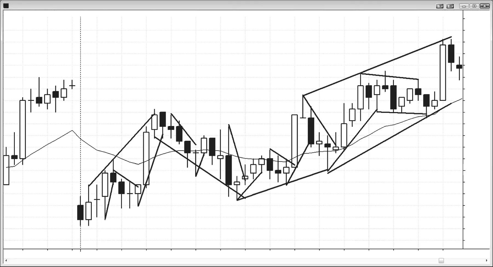

### CHAPTER 20 Two Legs

<!-- Source PDF pages 351–354 -->

<!-- PDF page 351 -->

C H A P T E R 2 0
Two Legs
T
he market regularly tries to do something twice, and this is why all moves
tend to subdivide into two smaller moves. This is true of both with-trend and
countertrend moves. If it fails in its two attempts, it will usually try to do the
opposite. If it succeeds, it will often then extend the trend.
Everyone is familiar with an ABC pullback in a trend that unfolds in three steps.
There is a countertrend move, a small with-trend move that usually does not go
beyond the trend’s extreme, and then a second countertrend move that usually
extends deeper than the first. Trends themselves also tend to subdivide into two
smaller legs as well. Elliott Wave followers look at a trend move and see three
with-trend waves. However, it is better to look at the first strong with-trend leg
as the start of the momentum (the Elliott Wave 3), even if there was a prior withtrend move or wave (Elliott Wave 1). That strong with-trend move often subdivides into two smaller with-trend moves, and, after a pullback, the trend will often
make two more pushes to test the extreme of the trend (these two pushes create
Elliott Wave 5). This two-legged view of markets makes more sense to a trader
since it offers sound logic and abundant trading opportunities, unlike Elliott Wave
Theory, which is essentially useless to the vast majority of traders who are trying
to make money.
A break of a trend line is the start of a new leg in the opposite direction. Any
time there is a new trend or any capitulation of one side, there will usually be at
least a two-legged move. This can occur in a pullback in a trend, a breakout, a
major reversal, or any time that enough traders believe that the move has sufficient
strength to warrant a second attempt to test whether or not a protracted trend will
develop. Both the bulls and the bears will be in agreement that the momentum is

<!-- PDF page 352 -->

TRENDS
strong enough that a test will be needed before they develop a strong conviction
one way or the other. For example, in a two-legged rally in a bear trend, bulls will
take profits above the first leg, new bears will short, and other bears who shorted
the first up leg will add to their shorts as soon as the second leg up goes above the
high of the first leg. If all of these shorts overwhelm the traders who bought the
breakout above the first leg up, the market will go down and enter either a trading
range or a new bear phase.
Some complex two-legged moves take place over dozens of bars and, if viewed
on a higher time frame chart, would appear clear and simple. However, any time
traders divert their attention away from their trading charts, they increase the
chances that they will miss important trades. To be checking the higher time frame
charts for the one signal a day that they might provide simply is not a sound financial decision.
Two legs is the ideal but there is some overlap with three-push patterns. When
there is a clear double top or double bottom, the second push is the test of the prior
price where the market reversed earlier, and if it fails again at that price, a reversal
or pullback is likely. But when the first move is not clearly the possible end of a
trend, the market will often then make a two-legged test of that extreme. Sometimes
both legs are beyond the prior extreme, creating a clear three-push pattern. At other
times only the second leg exceeds the prior extreme, creating a possible two-legged
higher high at the end of a bull trend or a two-legged lower low at the end of a
bear trend.
Sometimes one or both of the legs of a two-push move are composed of two
smaller legs so that the overall move actually has three legs. This is the case in
many three-push patterns where often two of the pushes really are just part of a
single leg. However, if you look carefully at the leg that has the two small legs
and think about what is going on, that leg with its two small legs is comparable in
strength or duration or overall shape to the other leg that has just a single move.
This is difficult and frustrating for traders who want perfect patterns; but when
you trade, you are always in a gray fog and nothing is perfectly clear. However,
whenever you are not confident about your read, do not take the trade—there will
always be another trade before too long that will be much clearer to you. One of
your most important goals is to avoid any confusing setups, because losses are hard
to overcome. You do not want to spend the rest of the day struggling to get back
to breakeven, so be patient and take only trades where you are comfortable with
your read.

<!-- PDF page 353 -->

Figure 20.1

TWO LEGS
FIGURE 20.1
Every Leg Is Made of Smaller Legs
Every trend line break and every pullback is a leg, and each larger leg is made of
smaller legs (see Figure 20.1). The term leg is very general and simply means that
the direction of movement has changed, using any criterion that you choose to
determine that the change exists.

<!-- PDF page 354: no extractable text (likely figure-only) -->

