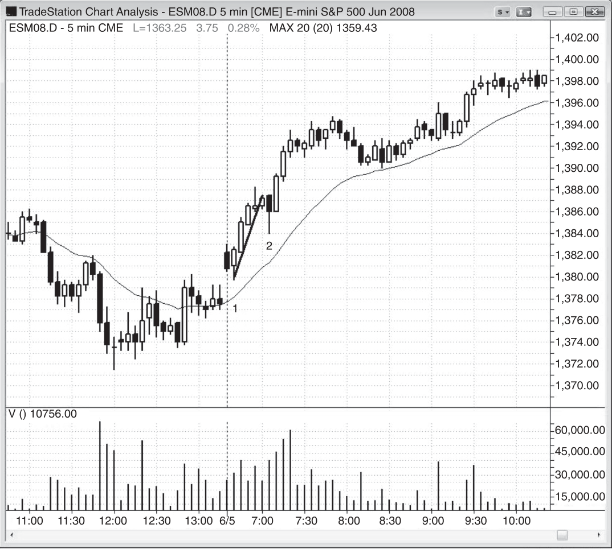
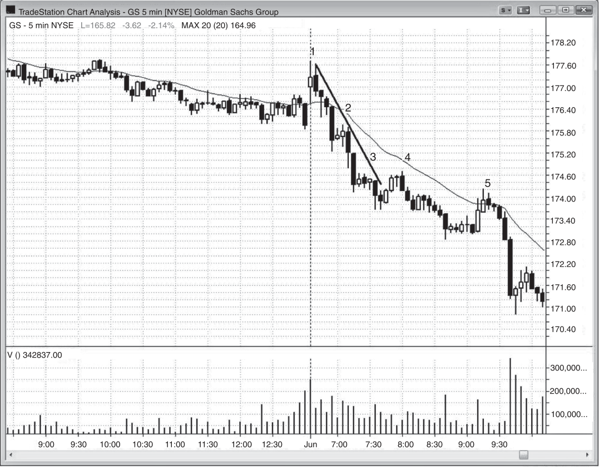
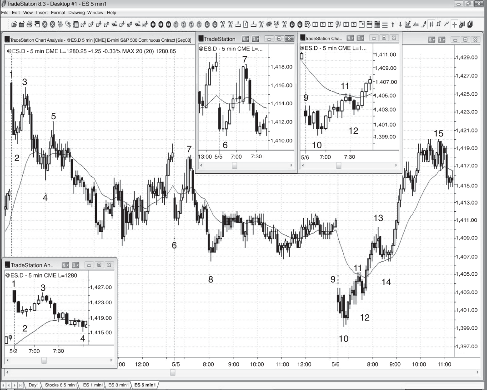
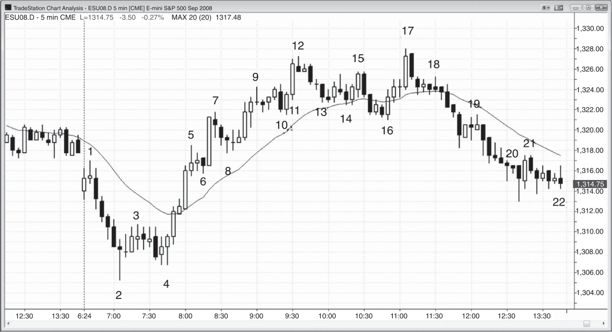
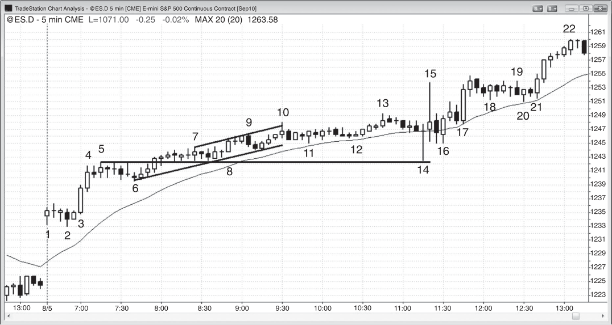
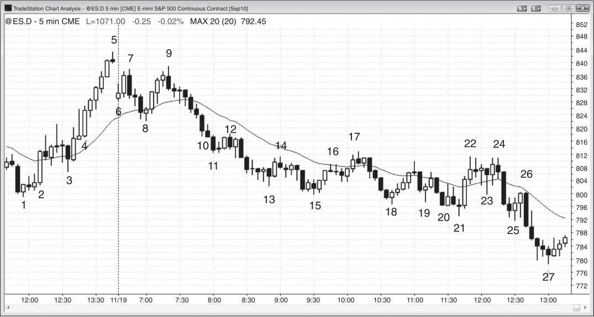

### CHAPTER 23 Trend from the Open and Small Pullback Trends

<!-- Source PDF pages 415–446 -->

<!-- PDF page 415 -->

C H A P T E R 2 3
Trend from the
Open and Small
Pullback Trends
P
rimary characteristics of trend from the open days:
r The low of a bull trend day or the high of a bear trend day is formed within the
first few bars of the day.
r If the opening range of the day is less than 25 percent of the average daily range
of recent days, there may be a double bottom on a bull trend day or a double
top on a bear trend day (if the opening range is about 50 percent of the average
daily range, a breakout is more likely to lead to a trending trading range day).
r The day may begin with a strong spike lasting many bars or it may have a small
opening range.
r If the market trends from the first bar or so and the initial spike lasts three or
more bars, entering on the first pullback is usually good for at least a scalp.
r If there is a strong spike on the open that lasts many bars and covers many
points, the day will usually become a spike and channel trend day.
r A large gap opening often leads to a trend from the open day, and the trend
can go in either direction. When there is a large gap up and a trend from the
open day forms, the day will be a bull trend day about 60 percent of the time
and a bear trend day 40 percent of the time. The opposite is true for gap down
openings. The larger the gap, the more likely the day will be a trend day and the
more likely the trend will be in the direction of the gap.
r Trend from the open days have urgency and conviction from the outset and are
usually the strongest trends and have the smallest pullbacks.
r Twenty gap bar and moving average gap bar setups come late in the trend.

<!-- PDF page 416 -->

COMMON TREND PATTERNS
r The strongest type of a trend from the open day and the strongest type of trend
is one where the opening range is small, and then the day trends relentlessly
with small pullbacks all day long. This is a small pullback trend day. For example, the pullbacks in the Emini might be just 10 to 12 ticks (10 to 30 percent
of the average daily range). When that is the case, there is usually a pullback
in the final couple of hours that is about 150 to 200 percent of the size of the
earlier pullbacks, followed by a resumption of the trend into the close.
r To an experienced trader, the swing setups are 70 percent or more likely to
work, even though to they never look that certain to a beginner. Many of the
signal bars look bad, as is the case for all strong trends. Most setups appear to
have 50 percent or less probability of success. This makes traders not take the
trades and forces them to chase the market, or miss the trend completely.
r There are often many trend bars in the opposite direction, which is a sign of
countertrend pressure, and it keeps beginning traders looking for reversals instead of with-trend trades. For example, in a bull trend, there will be many bear
trend bars and many two-bar and three-bar bear spikes. Beginners repeatedly
short them and lose. The spikes evolve into bull flags that look weak, which
discourages beginners from buying them. They just got out of a losing short
and are not ready emotionally to risk losing again, especially on a setup that
does not look strong. Each bad-looking bull flag is successful, and is followed
by another good-looking short setup that fails.
r The trend is often in a relatively tight channel, and pullbacks often come back
and hit breakeven stops, trapping traders out. Traders need to trail their stops
below swing lows in a bull trend or above swing highs in a bear trend. If they
are too eager to move their stops to breakeven, they will get trapped out.
Since almost all small pullback days are trend from the open days, they should
be considered to be a strong variant. A trend from the open day is usually the
strongest form of trend pattern, but it develops in only about 20 percent of days.
That means that buying above the first bar or shorting below it, expecting it to be
the start of a strong trend, is a low-probability trade. Reversals are far more common in the first hour, as is discussed in book 3. The chance of the first bar being the
high or low of the day on a day when there is a large gap opening can be 50 percent
or more, if the bar is a strong trend bar in either direction. The high or low of the day
forms within the first five bars or so in about 50 percent of days. However, it forms
within the opening range, which can last a couple of hours, in about 90 percent of
days. Any type of trend day can trend from the open. In a trend from the open day,
the market forms one extreme in the first bar or first few bars and then trends all
day, and often closes at or near the opposite extreme. There may be a small trading
range for the first 30 minutes or so and then a breakout, but the open of the day
will usually be very close to one extreme of the day (the low in a bull trend or the

<!-- PDF page 417 -->

TREND FROM THE OPEN AND SMALL PULLBACK TRENDS
high in a bear trend). These days often open with large gaps and then the market
continues as a trend in either direction. In other words, a large gap down can lead
to either a bull or a bear trend from the open day. The setup is more reliable if it
forms at a strong magnet like a trend channel line (for example, forming a wedge
reversal setup) or if it is part of a reversal pattern, like a reversal from a final flag at
yesterday’s close.
This type of trend can be so strong that there can be follow-through in the
first hour or two of the next day, so traders should be looking to enter with trend
on pullbacks after the open of the next day. The pullback often is strong enough
to make traders wonder if the market is reversing, but it is usually just a higher
time frame, two-legged correction, like a pullback to the 15 minute moving average.
However, most traders would find it easier to simply read only one chart when
trading and there is always a 5 minute setup at the end of the pullback.
As a trend from the open day is evolving, the pullbacks are often very small all
day long. When this happens, this is a small pullback trend day. This is the strongest
type of trend day and it forms only once or twice a month. About two-thirds of these
days have a larger pullback after 11:00 a.m. PST. That pullback is often about twice
the size of the biggest pullback since the trend began in the first hour. It is often
heralded by a relatively large, strong trend bar or two in the direction of the trend,
but representing climactic exhaustion. Take the example of a small pullback bull
trend day when the biggest pullback has been nine ticks and the market has been
channeling up all day. If sometime between 11:00 a.m. PST and noon the market
has two relatively large consecutive bull trend bars breaking out to a new high, the
move is more likely an exhaustive buy climax than the start of a new leg. Climaxes
are discussed more in the third book, but when a trend has gone on for a long time
and then has unusual further strength, it usually signals the end of the move for the
time being and the start of a two-legged pullback that will last about 10 bars or so.
Experienced traders are expecting a three- to five-point pullback and they will exit
their longs. Some will even short the close of that second bull trend bar, or maybe
a tick or two above its high, expecting the pullback. They might wait for the next
bar to close, and if it has a close around the middle, they might short the close. If it
is a bear reversal bar, they might short below its low. If they entered below a bear
reversal bar, their protective stop would be above its high, but if they entered at the
market at the close of the bull spike, they might use a three- or four-point stop and
scale in a point or two higher. Even if they are wrong and the market does not sell
off for a few points, it will likely enter a trading range and they should be able to
get out with a small profit within the final hour.
There might have been a slightly larger pullback in the first hour just before the
trend began, but only the pullbacks after the trend began are important. Look at
their size and if they are all very small and each subsequent one stays around the
same size or smaller than the first, the day is a strong trend day. For example, in

<!-- PDF page 418 -->

COMMON TREND PATTERNS
a bull trend in the Emini where the average daily range has been about 12 points,
the pullbacks might all be just two or three points. The bulls want a bigger pullback
where they can get long, hoping for less risk. After waiting and not getting what
they want, they start taking small positions at the market and on small pullbacks.
This small buying all day long keeps lifting the market. The bears never see a great
short and they decide instead to short smaller positions and weaker setups. There
is no follow-through and they are forced to cover, and this buying adds to the slow
rise in the market. Momentum traders see the trend and they, too, buy all day long.
The trend usually continues all day with only small pullbacks, but because the bulls
have been buying small positions all day long, they never have to chase the market
up in a panic. Also, because the bears are never heavily short, there is not strong
short covering. The result is that even though the day is a trend day, it often does
not cover too many points and the bulls do not make a windfall profit, even though
they were on the right side of a strong trend.
A report at 7:00 a.m. PST can often lead to a reversal bar, a breakout bar, or a
large outside bar that becomes the start of a strong trend, which can last all day.
However, computers have a huge edge on reports. They receive the data instantly
in a format that they can process to make decisions that lead to orders. All of this
happens within a second, and it gives them a significant advantage over traders.
When the computers have a big edge, traders are at a disadvantage and therefore
should rarely enter at the moment a report is released. The computers will usually
show what the always-in trade is within a bar or two, or they will set up a strong
reversal. Traders will then have probability on their side, and can look to enter in
the appropriate direction. The strong bar that leads to the start of the trend does
not always come on a report and can form several bars before or after the report. It
happens on the report often enough for traders to be ready for it and then to enter
as soon as the always-in position becomes clear.
Sometimes, after about 30 minutes of a small range, there is a test of the open
that occurs around 7:00 a.m. PST, usually coinciding with a report. Although this
results in a small trading range, the trend that breaks out is much stronger than
that seen on a trending trading range day; it is identical to a trend from the open
day and should be considered a variant.
Even the best patterns still fail to do what you expect about 40 percent of the
time. If the market does not pause by the third or fourth bar, it might have gone
too far too fast, and this increases the chances that the market will reverse instead
of trend.
Every day begins as a trend from the open day within the first few bars of the
day. As soon as a bar moves above the high of the prior bar, the day is a trend from
the open bull trend day, at least for that moment. If instead it trades below the low
of the first bar, it is a trend from the open bear trend day. On most days, the move
does not have much follow-through and there is a reversal, and the day evolves

<!-- PDF page 419 -->

TREND FROM THE OPEN AND SMALL PULLBACK TRENDS
into some other type of day. However, when the breakout of the prior bar grows
into a larger spike, the odds of a strong trend from the open trend day increase
considerably, and traders should begin to trade the day as a strong trend day.
If the market trends for four or more bars without a pullback, or even two large
trend bars, the move should be considered to be a strong spike. The spike is an
area where both bulls and bears agree that very little trading should take place, and
the market therefore needs to quickly move to another price level. When the spike
begins during the first few bars, the day is a trend from the open day. It may remain
so for the rest of the day, but sometimes the market soon reverses and breaks out in
the other direction. This can result in a trend in the opposite direction, like a spike
and channel trend or a trending trading range day, or simply a trading range day.
As with any strong spike, the bulls who bought early on will take partial profits at
some point, creating a small pullback (as discussed earlier in the section on trends).
Other bulls who missed the move will aggressively buy the pullback, as will bulls
who want a larger position. The bulls will buy with limit orders at and below the
low of the prior bar, hoping that the current bar will fall below the prior bar and
allow them to buy a little lower. Other bulls will buy with stop orders above the
high of the pullback bar (a high 1 buy signal).
A spike is usually followed by one of three things. First, the market might have
gone too far too fast and be experiencing exhaustive climactic behavior. For example, if there is then a pause or pullback like an inside bar or a small wedge flag,
this could become a final flag and lead to a reversal after a small breakout, and the
reversal could last for several hours. Alternatively, the market might go sideways
in a tight trading range for several hours, followed by the trend resuming into the
close, resulting in a trend resumption day. This small, sideways movement is very
common following a relentless five- to 10-bar spike. The third and most common
outcome, when the spike is not so large as to be exhaustive, is the formation of a
trend channel, and the day then becomes a spike and channel trend day.
Entering on the first pullback after a strong first leg is simply capitalizing on the
propensity for strong moves to test the extreme. Most strong moves have at least
two legs, so entering on the first pullback has a very good chance of leading to a
profitable trade. This entry is especially important on trend from the open days if
you missed the original entry. In strong trends, what constitutes the first pullback
is not always clear because trends frequently have two or three sideways bars that
don’t break a meaningful trend line and therefore really aren’t significant enough
to constitute a pull “back.” However, even if there is no retracement and no real
pulling back in price, a pause is a sideways correction and is a variant of a pullback.
The single most difficult part of trading these very strong trend days is that
the trends do not look particularly strong as they are forming. There are usually
no impressive spikes or easy, high-probability pullbacks to the moving average. Instead, the market has pullbacks after every few bars and lots of trend bars in the

<!-- PDF page 420 -->

COMMON TREND PATTERNS
opposite direction. It often is in a weak-looking channel. What beginners fail to see
is that the pullbacks are all small, the market never seems to get back to the moving average, and the price keeps moving slowly away from the open. Experienced
traders see all of these things as signs that the bull trend is very strong, and this
gives them the confidence to take swing trades. They correctly know that, although
the bars look like they are part of a weak channel and therefore should create lowprobability setups, when they occur in a small pullback bull trend day, they form
high-probability swing setups. All pullbacks in trend from the open days are great
with trend entries, even though they almost always look weak. A trader can continue to have confidence entering with trend even after a pullback finally breaks
a meaningful trend line. In a strong bull trend, look to buy at the low of the prior
bar, or one or two ticks below its low, or on a stop at one tick above high 1 and
high 2 setups. Look at the size of the pullbacks since the trend began. For example,
in a small pullback bull trend, if the largest pullback in the past couple of hours has
been only eight ticks, buy with a limit order at five to seven ticks below the high
of the day. In strong bear trends, traders will do the opposite and short at the high
of the prior bar or one or two ticks above it, on a stop at one tick below low 1 and
low 2 signal bars, and on any bounce that is about the size of an average bar.
The market has inertia and the first attempt to end the trend usually fails. Once
a trend line has been broken and there has been a significant pullback, then the first
leg of the trend has likely ended. Even then, the first break of the trend line has high
odds of setting up a with-trend entry that will lead to a second trend leg and a new
extreme in the trend.
The pullbacks often have weak signal bars, and there are many countertrend
trend bars. For example, in a strong bull trend, most of the buy signal bars might
be small bear trend bars or doji bars, and several of the entry bars might be outside
up bars with small bodies. They often follow two or three consecutive bear trend
bars or bear micro channels. This constant selling pressure makes many traders
look for sell signals, trapping them out of the bull trend. The sell signals never look
quite strong enough, but the traders sell anyway because they look better than the
buy signals, and they want to trade. They see that there was a pullback after just
about every buy signal that comes back and hits a breakeven stop and think that
this is a sign of a weak bull trend. They see that it is a bull trend and want to get
long, but can’t figure out how to do so, because they think every buy signal looks
bad. The pullbacks are too small and the setups are too weak. Also, since these
days happen only a couple of times a month, they are conditioned to the other
days, when selling pressure usually leads to a tradable short, so they continue to
short sell setups that don’t quite look right. They don’t look right because they are
the start of bull flags, not reversals. However, when experienced traders see a bull
trend with small pullbacks and an inability to fall below the moving average, along
with many bear trend bars and weak buy signals, they understand what is going

<!-- PDF page 421 -->

TREND FROM THE OPEN AND SMALL PULLBACK TRENDS
on. They see traders being trapped out of longs and being fooled into constantly
looking for tops, and know that this bull trend is especially strong. The experienced
trader knows that too many traders will be doing the opposite of what they should
be doing, and will be forced to exit their losing shorts and chase the market up.
This creates a relentless tension on the upside where many traders want to buy but
don’t, and experienced traders buy relentlessly and have a very profitable day.
These days are usually in relatively tight channels, and if traders are looking to swing their trades, they should not be overly eager to move their stops to
breakeven. When a trend is in a tight channel, it will usually come back to the entry
price before reaching a new trend extreme, and inexperienced, fearful traders will
mistakenly let themselves get trapped out of a strong trend. For example, if there
is a strong bull trend, the market will often come back to the entry price at the signal bar high in five to 10 bars, and will often dip a tick or two below it. This can
make beginning traders nervous. They had enough profit for a scalp, but since the
day was a trend day, they wanted to swing the trade for a larger profit. Now, after
an hour, the market is back to the entry price. They worried for an hour because
the market was not going much above the entry price, and they are now afraid that
their winner will turn into a loser. They cannot take the pain anymore and exit with
a small profit or loss. A few bars later, they are upset because the market is now
at a new high and they are on the sidelines, trapped out of a great trade, waiting
to buy the next pullback. They should trail their protective stops below the most
recent swing low only after the market pulls back to the area of the signal bar high
and then rallies to a new high. Trends tend to have trending highs and lows, so
once a bull trend makes a new high, traders will raise their protective stops to just
below the most recent swing low. Since they expect trending lows, they want the
next pullback to stay above the last. If the market begins to enter a trading range,
pullbacks will fall below prior higher lows, and they will then adjust to a trading
range style of trading (discussed in book 2).
If there is a gap open that is more than just a few ticks and the first bar is a
strong trend bar (small tail, good-sized bar), trading its breakout in either direction
is usually a good trade. The first bar of every day is a signal bar for a trend from the
open bull day and a trend from the open bear day, depending on the direction of
the breakout of the bar. If you enter and your protective stop is hit on the next bar,
consider reversing for a swing trade because the market will usually move more
than the number of ticks that you lost on the first entry, and there is always the
possibility that it could develop into a trend from the open day.
Even if there is not a gap open, a trend bar for the first bar is a good setup for
a trade; but the chance for success is higher if there is a gap, since the market is
more overdone and any move will tend to be stronger.

<!-- PDF page 422 -->

COMMON TREND PATTERNS
Figure 23.1

FIGURE 23.1
Buy the First Pullback in Strong Trend
The market formed a bull trend from the open in Figure 23.1, and the bar 2 break
below the trend line was the first pullback. Traders bought on a stop at one tick
above its high, even though it was a weak signal bar (bear close, but at least
the close was above the midpoint). Aggressive bulls bought on a limit order at
the low of the bar before bar 2, anticipating a failed micro channel breakout and
higher prices.
It was reasonable but aggressive to short below the first bar of the day because
it was a bear trend bar and there was a gap up, and there was room to the moving

<!-- PDF page 423 -->

Figure 23.1
TREND FROM THE OPEN AND SMALL PULLBACK TRENDS
average and to yesterday’s close. However, yesterday ended with several strong
bull trend bars in the final hour, which is a sign of buying pressure. When there is
any doubt, especially on the open, it is better to wait for more information or until
one side is trapped. The problem with this initial short is that most traders would
not have been able to change their mind-set quickly enough to reverse to long above
bar 2. They would have been trapped out; most would have waited to buy above the
first pullback, and that later entry would have cost them several points of profit.

<!-- PDF page 424 -->

COMMON TREND PATTERNS
Figure 23.2

FIGURE 23.2
Small Pullback Bull Trend Day
A trend from the open day is the strongest type of trend day, and a small pullback
day is the strongest type of trend from the open day. Trend from the open days
occur about once or twice a week, but small pullback days (seen in Figure 23.2)
form only once or twice a month. The average daily range in the Eminis had been
about 12 points, and by bar 9 the biggest pullback of the day was only nine ticks.
The pullback to bar 11 was only 11 ticks. Smart bulls saw this and therefore placed
limit orders to buy maybe from six to 10 ticks down from the most recent high.
Their initial stops might have been a couple of points. The market tried to create
a larger pullback in the move down to bar 17 but could not drive the market down
more than 14 ticks. Bulls saw the large bull trend bar before bar 14 as a possible
buy climax, and many exited longs. A sudden surge that was likely to be followed
by a pullback is a great opportunity to exit at a very good price that was likely to
be brief. Other experienced traders shorted the close of the bar and the close of
bar 14 and the next bar, since they had tails on the top, which is a sign of selling
pressure. These traders expected a two-legged pullback lasting about 10 bars, and
almost certainly a test of the moving average, since the market already tested it at
bars 9 and 11. On a small pullback trend day, the market usually has a pullback
sometime after 11:00 a.m. PST that is about twice the size of the largest pullback of
the day.

<!-- PDF page 425 -->

Figure 23.2
TREND FROM THE OPEN AND SMALL PULLBACK TRENDS
There was a 20 gap bar long above bar 9 and the bulls bought the moving average tests at bars 8, 9, 11, 13, 17, and 19. There was not a strong sell signal all day,
but aggressive bears could have scalped below the inside bar after bar 14. However,
most traders instead would have looked to buy pullbacks instead of shorting new
highs since this was such a strong bull trend day.
The market had a strong bull spike up from bar 2 and then the rest of the day
was a bull channel. Traders became always-in long on bar 2 or on the strong bull
trend bar that followed. Most of the channel was a slightly upward-sloping tight
trading range with very little price gain, which is often the case on small pullback
days. The high of the day was only four points above the bar 5 high at 8:25 a.m.
As is the case with all strong trends, most of the buy signal bars looked bad.
This kept bulls from buying, trapping them out, and they ended up having to chase
the market higher. It also kept shorts from exiting, and they were trapped into larger
and larger losses. There were also many bear trend bars and bear spikes. This selling pressure made beginning traders look for reversal setups and not take buy signals. Experienced, unemotional traders understand that bad buy signal bars and
bear trend bars in a trend day with very small pullbacks are signs of a very strong
bull trend. They made sure to buy despite the weak setups. They bought on bar 2
as it broke above the doji high 1 signal bar. They bought again as bar 4 reversed up
into an outside bar after forming a double bottom with the bull reversal bar from
seven bars earlier. They bought the high 2 above bar 8 and above the bull bar that
followed it, which created a two-bar reversal.
Bar 9 was a triangle (bars 6 and 8 were the first two pushes down) in a
bull trend day and therefore a bull flag buy setup. They bought above the bar 11
bear trend bar that closed below the moving average, because it was a failed onetick breakout below the bars 8 and 9 double bottom. It was also a pullback from the
breakout to bar 10 of the triangle. At this point, the market was in a trading range,
so most bulls would not have exited on a breakout below. They know that most
breakout attempts fail and that most trading ranges in bull trends are bull flags and
will ultimately break out of the top of the range. Most bulls either would have exited their longs below the bear bars after bar 10 or would have used the bottom of
the most recent bull spike for their protective stops. For example, they might have
had their stops at one tick below bar 4 or below the outside up bar that formed
three bars later.
Usually, when there is a bear micro channel, like the one from bar 10 to bar 11,
it is better to buy a pullback from the breakout, but there is a sense of urgency
when the trend is strong, and smart traders are unwilling to wait for perfection
because they don’t want to risk missing the move. They also bought above the bear
bar after bar 13, even though it had a bear body. It was a high 2 buy setup (the
high 1 was the bull bar after bar 12) and a second-entry breakout pullback buy
setup from the breakout above the bear micro channel down from bar 10 (the high 1

<!-- PDF page 426 -->

COMMON TREND PATTERNS
Figure 23.2
was the first setup). They bought again as bar 17 became an outside up bar, even
though it followed a small doji bar and a big bear trend bar. The moving average
was continuing to contain all sell-offs. They bought above the bar 17 bull doji, and
above the bull bar that followed it. They bought above the bear bar after bar 19
because it was another small high 2 at the moving average. It was a bear bar, and
the first leg down was made of the two bear bars after bar 18. Others bought on a
stop above bar 19 because it was a bull bar in a pullback to the moving average in
a strong bull trend.
The market spent most the day trying to reverse down, running stops on the
bulls and trapping beginners into losing shorts, but relentlessly forming higher
highs and lows, opening near the low of the day and closing near the high of the
day. The buy setups all looked like they were low probability, and this trapped inexperienced bulls out. However, experienced traders knew what was going on and
bought every sharp sell-off all day. They realized that, as bad as the long setups
looked, the trend was so strong that the probability of success was much higher
than it appeared.

<!-- PDF page 427 -->

Figure 23.3

TREND FROM THE OPEN AND SMALL PULLBACK TRENDS
FIGURE 23.3
A Small Pullback Day Is the Strongest Type of Trend
When there is a trend from the open and all of the pullbacks are less than 20 to
30 percent of the recent average daily range, the day is a small pullback day, which
is the strongest type of trend day. There is usually a pullback later in the day that is
about 150 to 200 percent larger than the size of the earlier pullbacks, and that was
the case here in the OIH (see Figure 23.3). Any sideways movement was a pause and
a type of pullback and was a buy setup. The ii breakout at bar 1 was a good entry,
and the bar 3 breakout of the two-legged sideways correction was another. Finally,
there was the tight trading range breakout at bar 4. All of these entries should be
considered to be part of the first up leg and not a first pullback, which comes after
the first leg and sets up the second leg. Rarely, days just don’t seem to pull back
and traders are forced to enter on breakouts from even brief sideways pauses. The
reality is that on strong days like this you can just buy at the market at any point,
trusting that even if there is a reversal, the odds are overwhelming that the market
will make another high before the pullback retraces very far. Many traders buy the
closes of bull and bear trend bars and at or below the low of the prior bar.

<!-- PDF page 428 -->

COMMON TREND PATTERNS
Figure 23.4

FIGURE 23.4
The First Trend Line Break Usually Fails
In a strong trend, determining which pullback is the first significant pullback is
often difficult to do. When that is the case, the odds are very high that your trade
will be profitable because an unclear pullback means the countertrend traders are
very weak. In Figure 23.4, bars 2 and 3 were tiny pullbacks that did not break a
meaningful trend line. The first pullback to break a trend line was bar 4. The first
trend line break has a very good chance of being followed by another trend leg and
is therefore a great entry (like shorting below the bar 4 bear trend bar). Today was
a small pullback type of trend from the open bear trend day.

<!-- PDF page 429 -->

Figure 23.5

TREND FROM THE OPEN AND SMALL PULLBACK TRENDS
FIGURE 23.5
Strong First Bar Can Trap Traders in the Wrong Direction
Sometimes the first bar of the day can trap traders into entering in the wrong direction, and the day can then become a strong trend day in the opposite direction. In
Figure 23.5, the market gapped below yesterday’s low and broke out of a large trading range formed over the second half of yesterday (a head and shoulders top bear
flag). The first bar today, bar 9, was a bull trend bar, which usually would lead to a
partial gap closure or even a bull trend. Many went long on a stop at one tick above
its high. However, the market trapped those longs two bars later when it traded
below its low. That bull trend bar trapped bulls in and bears out because traders
assumed that its strength was a sign that the market was going to try to close the
gap and maybe become a bull trend day. It tried to reverse up from the breakout
below yesterday’s trading range and from breaking below the trend channel line.
You have to be very flexible on the open and assume that the exact opposite of
what you believed a minute ago can happen. You want to be able to see what is
happening as early as it is happening so that you can enter as early as possible. The
market tried to reverse back up above the trend channel line and failed, and this
two-bar breakout pullback could lead to some kind of measured move down. If the
day becomes a trend day and you miss the earliest entry, there will be chances to
enter all day long.

<!-- PDF page 430 -->

COMMON TREND PATTERNS
Figure 23.5
Bar 10 provided a great opportunity to go short at one tick below the low of the
bar 9 bull trend bar because this is where most of those trapped longs would get
out, driving the market down. Also, any potential buyers would be waiting for more
price action, so there were only sellers in the market, making for a high-probability
short. Shorts added on at the bear flags along that way that trapped other early
longs into believing that the market was bottoming.
Traders became confident that the market was always-in short by the close of
bar 11, which confirmed the downside breakout. Many traders were confident of
the always-in trade at the close of the bear breakout bar, just before bar 11.
Despite all of the reversal attempts, the market closed on its low. This is a good
example of why it is important to try to swing at least part of your trade when you
see a strong trend from the open day. If you do take long trades, you have to force
yourself to get back on the short side as you exit your longs because you don’t want
to miss out on a huge short just to catch a small long.
Deeper Discussion of This Chart
Bar 12 was a strong bull reversal bar in Figure 23.5, but it largely overlapped the prior
two bars and therefore it was part of a small trading range and was not functioning as a
reversal bar, despite its appearance. Reversal bars always have to be judged in context,
and when they overlap the prior bars by too much they are part of a small trading range,
and buying above a trading range in a bear trend is a losing strategy. Smart traders are
doing just the opposite. They have limit orders to go short at and above the high of the
prior bar, even if the bar has a strong bull body.
Bar 13 was a low 2 short setup but the signal bar was a small doji. A doji is a weak
signal bar, and weak setups often mean that the market is not yet ready to break out.
However, in a strong bear trend like this, you can short for any reason and just use a
wider stop. You could also go short below the bar 12 or bar 11 lows. In a strong bear
trend, you can sell below the lows of bars and below swing lows and expect to make
a profit.
Bar 14 was an attempt to reverse up after the failed low 2 and was therefore the
third push up. The doji after bar 11 was the first push and bar 12 was the second. A
third push up in a bear flag creates a wedge bear flag, so it is reasonable to short below
its low.
This bar 14 failed low 2 buy setup illustrates one of the worst things that a trader
can do, which is buying above a weak bar in a bear flag in search of a scalper’s profit.
You will not only lose on the scalp, but your mind-set will be that of a buyer. You will not
be mentally prepared to short the breakout of the bear flag, which has a much higher
chance of success and is more likely to result in a swing trade and not just a scalp.
The bar 15 breakout bar was a strong bear trend bar and a statement that the bears
controlled the market. When there is a strong bear breakout like this, there will usually

<!-- PDF page 431 -->

Figure 23.5
TREND FROM THE OPEN AND SMALL PULLBACK TRENDS
be at least two more legs down in the form of a bear channel, and those two additional
legs often create a wedge bear flag. This usually leads to a two-legged correction, as it
did here in the rally to the moving average at bar 22.
Bar 22 was a bear reversal bar at the moving average and a low 2 short. It was also
a 20 gap bar short and a wedge bear flag where the push up to bar 19 was the first leg
up in the wedge.
The market sold offto a new bear low at the two-bar reversal at bar 25. It was also a
reversal up from a one-bar final flag and a high 2 buy signal at the bottom of a developing
trading range.
Bar 27 was a strong bull trend bar and an attempt to form an upside breakout, but
it formed a double top bear flag with bar 22.
The bar 28 ii pattern became a final flag as the market reversed down from the small
bar 29 lower high and moving average gap bar short setup.
Bar 30 was a two-legged higher low test of the bear low.
The bear rally ended with a wedge bear flag at bar 35, where bars 27 and 33 were the
first two pushes up. The higher highs trapped bulls in and bears out, but alert traders
were prepared for the bear day to resume, and they noticed how bar 35 missed the
breakeven stops on the shorts below bar 11. This means that the strongest bears were
reasserting themselves. They took over the market on the strong bar 15 bear spike; they
were sitting on the sidelines, waiting for a test, and then they appeared out of nowhere
and drove the market down into the close.

<!-- PDF page 432 -->

COMMON TREND PATTERNS
Figure 23.6

FIGURE 23.6
Gaps Can Lead to Trends Up or Down
Here, in Figure 23.6, are three consecutive gap openings but with different results,
even though the first bar on each day was a bear trend bar. Bars 1 and 9 were also
gap openings on the daily chart.
Bar 1 had no tail at the top and a small tail on the bottom and was a large bear
trend bar, which is a good short setup on a day with a large gap up open. It was
followed by a strong bear entry bar. If the first bar of the day is a strong trend bar
(see thumbnail), there will usually be follow-through, and when the first two bars
are strong, an attempted reversal up usually becomes a lower high, as it did here. A
large gap up with strong selling usually becomes a trend from the open bear trend
day. There was a sharp rally to bar 3 that tested the open, but this failed opening
reversal resulted in a lower high or a double top, and then a lengthy down move.

<!-- PDF page 433 -->

Figure 23.6
TREND FROM THE OPEN AND SMALL PULLBACK TRENDS
Bar 2 was an attempt to form a breakout pullback from the breakout above yesterday’s high, but the bears were too strong and the rally failed at bar 3.
Two bars after bar 6 was a strong bull reversal bar, and an opening reversal
after a bear trend bar on the open broke below the bull channel of the final two
hours of the day before. A bull channel is a bear flag, and the bull reversal bar that
formed two bars after bar 6 was an attempt to have the breakout of the bear flag
fail. Shorting below the first bar of the day was risky here, even though it was a bear
trend bar, because the bar was at the level of a trading range at the end of yesterday
and shorting at the bottom of a trading range is usually a losing strategy, especially
in a market where there is no clear direction (a trading range).
The sharp rally up to bar 7 tested the close of the prior day and formed a lower
high or a double top. The bear signal bar made this a good short. Pullbacks happen
when bulls take profits. Why do traders ever take profits when a trend is strong?
Because no matter how strong a trend is, it can have a deep pullback that would
allow traders to enter again at a much better price, and sometimes the trend can
reverse. If they did not take at least partial profits, they would then watch their big
profit disappear and even turn into a loss.
Bar 9 gapped below the low of the prior day and formed a bear trend bar, but
it had big tails, indicating that traders bought into the close of the bar. The second
bar was a bear trend bar with a close on its low, indicating that the bears were
strong, but it was followed by a strong bull trend bar, forming a reversal. Although
the long did not trigger, this was again evidence that the bears lacked urgency.
When the gap is this large, everyone knows that the behavior is extreme and if
there is no immediate follow-through, the market will reverse quickly to undo this
extreme situation.
Bar 10 was a large bear trend bar and therefore a sell climax. The next bar was
an inside bar and this created a breakout mode situation. If there was no immediate
follow-through selling, the bears would aggressively begin to buy back their shorts
and look to sell higher, and bulls would buy, hoping for a low of the day. The market
had been in a large bear channel for a couple of days and it was at the bottom of
the channel, so there was a good chance that it would reverse up and a smaller
chance that it would break through the bottom of the bear channel and form an
even steeper bear trend. The channel lines are not shown, but the bear trend line is
above the bar 1 and bar 7 highs and the bear trend channel line is a best fit line that
could be drawn along the bar 4 and bar 8 lows. Bulls also bought above bull trend
bars, like above the bull trend bar before bar 10 and the bull trend bar that formed
two bars after bar 10. They would also buy above the small inside bar after bar 12,
since that would be a failed low 2. Since this is a possible reversal up from the low
of the day and the bottom of a two-day bull flag (a bear channel is a bull flag), it is
a good buy setup.

<!-- PDF page 434 -->

COMMON TREND PATTERNS
Figure 23.7

FIGURE 23.7
First Bar on Gap Day Often Points to Trend’s Direction
The market in Figure 23.7 opened with a moderate gap down, which can be near
the high or low of the day. Bar 3 was the first bar and it was a bear trend bar and
a possible start of a bear trend from the open. The market failed to reverse the
bar 2 swing low from yesterday so it would likely test the next level of support
from yesterday, which was its low at bar 1. A trader would place an order to go
short at one tick below the low of bar 3. Once the market fell below yesterday’s
low, it was likely to try to reverse up again, at least briefly, so a trader would place
an order to go long on a stop at one tick above the first good signal bar. Although
some traders would buy above bar 4, it was a bear trend bar with a close below its
middle. It would be safer to wait until the next bar closed to see if a better setup
would develop. The bar had a good-sized bull body and it formed a two-bar reversal
with bar 4. The entry is above its high. In general, it is always better to buy above
bull trend bars, especially when trading countertrend.
If the buy order wasn’t filled and the next bar had a lower low, traders would
try to buy above its high since they would be looking for a failed breakout below
yesterday’s low to form an opening reversal. However, if the market fell much further without a good buy setup, traders should only trade shorts until after a rally
breaks a trend line.

<!-- PDF page 435 -->

Figure 23.7
TREND FROM THE OPEN AND SMALL PULLBACK TRENDS
The market made a small two-legged rally to the moving average and above
the high of the day, where it set up a double top bear flag at the moving average.
The large bull trend bar that broke above the bar 4 reversal was followed by a bear
bar, which is bad follow-through and a signal that the market might be forming
a trading range instead of a bull trend. The market continued in a trading range
until midday. Up to that point, the range was about half the size of an average daily
range. This alerted traders to the possibility of a breakout, an approximate doubling
of the range, and the formation of a trending trading range day. The breakout began
with the strong spike down from bar 10. Although not shown, the day ended with
a strong reversal, as is often the case on trending trading range days, and it closed
back in the tight trading range that began at bar 7. Tight trading ranges are magnets
and tend to pull breakouts back into them.

<!-- PDF page 436 -->

COMMON TREND PATTERNS
Figure 23.8

FIGURE 23.8
Open on High Tick of the Day
Sometimes, a trend from the open day opens on the highest tick of the day. In
Figure 23.8, bar 12 was the first bar of the day and it opened on its high tick and
broke out below the wedge from yesterday’s close. Most traders would not be
nimble enough to sell below the inside bar at the end of yesterday, but it would
be reasonable to sell a small position on the close of the first bar. If you missed
the first entry, you could look at a 1 minute chart for a small pullback (there were
many) to short or simply wait for a 5 minute setup. When there is a trend from the
open, selling the first pullback is a high-probability trade, even though it is hard to
take since you are selling near the low of a big move down in this case. Bar 15 was
the signal bar for that first pullback short, and it was also a pullback that reversed
down just below the moving average. The shorts were so eager to get in that they
were selling below the moving average without waiting for the market to actually
touch the moving average. Some traders would be afraid to short after five bars
with bull bodies, but the bodies were small and this was the first pullback after a
strong bear spike and therefore a reliable low 1 short setup. It was also a moving
average test and a double top bear flag with the bar 13 high.
The day became a spike and channel bear with the bear channel beginning at
bar 15 and also at bar 17 and ending at bar 19. The market rallied into the close and
did not close on the low.

<!-- PDF page 437 -->

Figure 23.8
TREND FROM THE OPEN AND SMALL PULLBACK TRENDS
Deeper Discussion of This Chart
There was other spike and channel behavior in Figure 23.8, as is the case on most days.
Bar 12 and the bar after it formed a spike, as did bar 13 and the bar before bar 14, and
the entire move down to bar 14 was a spike. The two bars after bar 15 formed another
spike, which was followed by the channel that began with the bar 17 low 2 and ended
at bar 19.
Bar 16 was also a breakout pullback from the breakout below bar 14 and bar 1. It
was also close enough to a breakout below yesterday’s low to behave like a pullback
from an actual breakout (close is close enough). The eagerness of the bears to short
prevented that first pullback from reaching the moving average. They were afraid that
it might not get there and therefore shorted so heavily on the approach that it never
reached the moving average target. When the pullback turns back down just below the
moving average, the bears are very aggressive and have a sense of urgency. They are
very eager to short, even at relatively low prices, so lower prices are likely to follow.
Bar 19 was a spike up, and a channel up began with the bar 20 higher low. The bar
after bar 20 was also a spike that ended with a three-bar channel at bar 21, the final bar
on the chart.
Yesterday also had spike and channel activity, such as the spike up to bar 2 and the
channel that began with either bar 3 or bar 5. The move from bar 5 to bar 6 was another
spike, as was the bar before bar 7. The channel for both began with the bar 8 low. The
entire move up from bar 5 to bar 7 was probably a spike on a higher time frame chart.
Yesterday’s bull channel into the close poked above the trend channel line, which
was drawn as a parallel of the bull trend line from bar 5 to bar 9. Once the market
reversed back into the channel on the bar 12 first bar of the day, it was likely to poke
through the bottom of the channel at a minimum. The next target is a measured move
down using the vertical height of the channel, and the target after that is the bottom of
the channel from yesterday, which was the bar 8 low. Since the move up to bar 11 had
a wedge shape and the market tested below the start of the wedge, the next downside
target is a measured move down. Use the height of the wedge (the bar 11 high minus
the bar 8 low) and subtract that from the bar 8 bottom of the wedge. This target was
exceeded during the sell-offbelow bar 17.
Bar 19 was a reversal up from a second break below a bear trend channel line (drawn
parallel to the bar 15 to bar 17 trend line), so two legs up were likely. Bar 18 tried to
reverse up from a tiny poke below the trend channel line, but the market never went
above the high of the two-bar reversal so there was no long entry.
It is important to realize that although yesterday ended with a wedge top, there was
still a strong bull trend into the close. This made beginning traders look for an additional
rally on today’s open, and deny the unfolding reversal. Always be ready for the opposite
of what might appear likely, because it will happen in about 40 percent of the time.

<!-- PDF page 438 -->

COMMON TREND PATTERNS
Figure 23.9

FIGURE 23.9
Reversal after Trend from the Open
Not all days that begin as trend from the open days result in strong trend days in the
direction of the initial trend. In Figure 23.9, the day started as a bear trend from
the open. It gapped below yesterday’s low but then pulled back and almost closed
the gap, and bar 1 became a breakout pullback short setup. The market sold off for
five bars and set up a first pullback short below bar 3, but it then entered a tight
trading range instead of immediately triggering a short. Although a scalp was possible, the market reversed up in a higher low at bar 4.
Deeper Discussion of This Chart
In Figure 23.9, bar 1 was a breakout pullback short following the breakout below yesterday’s closing trading range. The initial sell-offdown to bar 2 was around 12 points,
which was about the average daily range recently. Once the market reversed back above
the high of the open and broke to the upside, a measured move up was likely. Sometimes
the market will make a measured move up equal to the open of the day to the low of
the day and then close back down near the open, creating a doji day on the daily chart.
Other times the measured move up is equal to about the height of the entire initial leg
down. The bar 17 high of the day was three ticks below that measured move target. That
reversal up above the opening range created a large bottom tail on the daily chart. When

<!-- PDF page 439 -->

Figure 23.9
TREND FROM THE OPEN AND SMALL PULLBACK TRENDS
the market turns down from about a measured move up from a large opening range, it
often comes back down and the day closes somewhere in the middle of the range, as it
did here.
The spike up from bar 4 to bar 5 was also a good basis for a measured move, but
it did not happen here. Instead, the market went one tick higher than a leg 1 = leg 2
move where leg 1 was from bar 4 to bar 5 and leg 2 was from the bar 6 low to the bar
17 high of the day. The sell-offinto the close was also a test of the bar 6 bottom of the
bull channel that followed the spike up.
The two-bar spike down from bar 15 was followed by a pullback to a higher high at
bar 17, which was the start of the bear channel. Sometimes the pullback after the spike
down can be a higher high, but when it is, there is usually another spike down after the
pullback. Here, the large bear inside bar after bar 17 was a spike down, and the move
down from bar 18 formed another spike down, with the large bear trend bars being the
most influential. The three-bar move down to bar 13 was also a bear spike and therefore
probably had some influence on the sell-offthat eventually followed. When the market
starts to form many bear trend bars, it is accumulating selling pressure, and it often is
able to overwhelm the bulls eventually, as it did here.

<!-- PDF page 440 -->

COMMON TREND PATTERNS
Figure 23.10

FIGURE 23.10
Strong Trends Have Weak Setups
Figure 23.10 shows a trend from the open bull trend day, but why are the best trends
so difficult to trade? Because most of the with-trend entries look weak and there are
many small pullbacks that trap traders out of the market. None of these pullbacks
would have hit a two-point money stop, which is usually the best stop to use in a
strong trend. With so many small, sideways bars, price-action stops below the lows
of prior bars get hit too often and it makes more sense to rely on the original twopoint stop. When the trend is strong, you need to do whatever you can do to stay
long. Strong, relentless trends are often made of small bars with tails and lots of
overlap but very small pullbacks that are mostly sideways pauses.
With a large gap up on the open, the odds favored a trend day up or down,
and a larger gap like this makes a bull trend more likely. Because there was no
significant selling in the first several bars, there was a possibility of a bull trend
from the open, so traders had to be looking long. The market moved up quietly all
day because institutions had buy orders to fill, and they filled them in pieces during
the day because they were afraid that a pullback might not come and they needed
to buy. Their constant buying prevented a significant pullback from forming. They
don’t buy all at once because they might create an exhaustive buy climax and a
significant reversal to well below their purchase price. Also, as the market is going
up, they are receiving additional buy orders throughout the day as investors become
more confident.

<!-- PDF page 441 -->

Figure 23.10
TREND FROM THE OPEN AND SMALL PULLBACK TRENDS
Deeper Discussion of This Chart
In a strong trend such as that shown in Figure 23.10, you can buy for any reason
and at any time. Buying above pullback bars is reliable, but you can also place limit
orders to buy at or below the low of the prior bar. Shorting below bars is a loser’s
strategy. If you were to look for shorts, you should short only above the highs of
bars or at the close of strong bull trend bars. When a day is this strong, most traders
should not short, because shorting would probably be a distraction and result in missing buy setups, which are swing trades in a strong trend and therefore more profitable
than scalps.
Bar 3 was the first bar of a two-bar spike up, and the market corrected sideways in
a tight trading range before the channel up began. The very strongest trends tend to
create reversal patterns all day long, but they somehow don’t look just right. However,
they constantly trap early bears into shorting, thinking that the small bars mean small
risk, but after four or five small losses, they are so far behind that they will never catch
up. You cannot take a trade simply because the risk is small. You need to consider the
probability of success and the size of the profit target as well.
Bears saw bars 5, 7, and 9 as a three-push pattern and therefore a wedge variant,
and they then saw bars 7, 9, and 10 as another wedge. When the correction from a
wedge is sideways instead of down, you should conclude that the trend is very strong;
stop looking for reversals and only trade with trend.
Bar 14 coincided with a Federal Open Market Committee (FOMC) report, and the
market sold offsharply but immediately reversed up after missing the bar 5 high by
one tick.
Going into the close, there were several two-bar bull spikes (bars 16, 17, and 21
were the first of the two bars in each spike).
A strong trend like this sets up reversals all day long, but the setups are never quite
right and they almost always fail. The wedge that ended at bar 9 was in a tight bull
channel composed almost entirely of bull trend bars. The market had not hit the moving
average in over two hours. The odds were high that there would be buyers there, so
there was little to be gained by shorting. Bar 10 broke above the trend channel line but it
had a bull body. Again, the channel was very tight with no prior bear strength. You could
only short a second signal and only if there was some prior bear strength, like a five- to
10-bar pullback to the moving average. In the absence of that, any short is a bet that the
market would do something that it had not done all day. The biggest pullback all day
was only nine ticks. If you short below a bar, your entry is about five ticks down and you
need the market to go another five ticks down for you to make a one-point scalp. Since
the market has tried to pull back repeatedly and could not fall more than nine ticks,
betting that your short would now succeed is a very low-probability trade. You can scalp
for one point and risk six or seven ticks only if the probability of success is 60 percent or
higher, so you cannot short this market. You could argue that the move to bar 12 broke

<!-- PDF page 442 -->

COMMON TREND PATTERNS
Figure 23.10
the bull trend line and therefore it was acceptable to short the bar 13 higher high, but
the market still had not yet pulled back to the moving average, which is just six ticks
below, and there would certainly be buyers there. Also, bar 13 was the fifth consecutive
bull body and that represents too much strength to be shorting.
On most strong trend days, there is usually a sharp, brief reversal between
11:00 a.m. and noon PST that shakes out weak longs and traps overly eager bears who
are hoping to recoup their earlier losses. It is always attributed to some news event, but
that is irrelevant. What is important is that it usually sets up a buying opportunity for
those who do not get frightened by the spike down.
Today, there was an FOMC report at 11:15 a.m. When the report came out, bar 14
was briefly a bear trend bar with a large bear body. If you shorted before the bar closed,
believing that the market was going to sell offhard on the report, you were ignoring
a very important rule: you should wait for the bar to close, because what appears as a
large bear trend bar at four minutes into the bar can become a doji bar or even a bull
reversal bar by the time the bar closes.
Bar 16 was a higher low after the rally from the bottom of bar 14 to the top of
bar 15, and it was followed by the bar 17 breakout pullback long entry. All spikes
should be thought of as spikes, climaxes, and breakouts, so the two-bar spike that began
with bar 16 was a breakout and bar 17 was the entry from the pullback.
Bar 19 was a double top bear flag, but there was no prior strong spike down so the
market was more likely just going sideways after the bar 17 spike up.
Bar 20 was a bull reversal bar and a high 2 long, and bar 21, the bar after the entry
bar, traded below the entry bar and trapped longs out. However, since the move up from
bar 20 had gone only one tick, the protective stop was below the bar 20 signal bar and
you should not tighten it too soon. Strong trend days constantly trick traders into exiting
longs early and into taking shorts. The bears have to buy back their shorts, which adds
to the buying pressure and removes the bears from additionally shorting for at least
a bar or two. They just lost and will need to recover before they look to short again.
Also, the bulls who were just trapped out will chase the market as it goes up, adding to
the buying.

<!-- PDF page 443 -->

Figure 23.11

TREND FROM THE OPEN AND SMALL PULLBACK TRENDS
FIGURE 23.11
Double Top in a Strong Bear Day
A trend from the open can have a double top or bottom before the strong trend
begins. In Figure 23.11, bar 7 tried to set up a bear trend from the open but the
high was tested on a 7:00 a.m. report, which commonly happens. Even though
the market formed a small trading range up to bar 9, you always have to consider
the possibility that the market was just waiting for the report before it unleashed
its strength.
The opening range was less than a third of the size of the range of recent days,
and this put the market in breakout mode. Once there was a spike down and a spike
up after the first bar (a reversal down and then a reversal up), some traders would
enter on a breakout, expecting the range to increase severalfold. After the market
fell below the bar 7 two-bar reversal, the bar 7 reversal down became a swing high.
After the market moved above bar 8, bar 8 became a swing low and a reversal up.
These traders placed a buy stop at one tick above the bar 7 spike top and a sell
stop at one tick below the bar 8 spike bottom. Once the buy order got filled as bar 9
moved above the high of bar 7, they doubled the size of the sell stop below bar 8.
As that second order got filled, as it did in the move below bar 8, they got stopped
out of their longs and they reversed into shorts. This is the traditional approach
to this setup, but it is generally better to be more aggressive. A better approach

<!-- PDF page 444 -->

COMMON TREND PATTERNS
Figure 23.11
would have been for traders to short below the bar 7 two-bar reversal and scalp out
part, and then tighten their protective stops. Next, they could reverse to long on the
bar 8 high 2 at the moving average. They could scalp out part and tighten their stops.
They could reverse to short below the bar 9 outside down bear bar, since there were
trapped bull breakout traders and the market was forming a double top bear flag
with bar 7. They could scalp out part, tighten their stops, and swing the balance
until there was a clear buy signal; if there was none, they could hold short into the
close. If they did buy at maybe the bar 15, 18, or 21 lows, they had to reverse to short
as they took profits. If they were unable to do that, they should either continue to
hold short or exit on those minor buy signals and look to short rallies.
Even though the day began with a small trading range and some traders might
call this a trending trading range day or a bear trend resumption day, when the
pullbacks are this small, you are dealing with a very strong bear trend. When that
is the case, it is better to make sure that you are short for most or all of the day.
Thinking of this as a trending trading range day will make you take longs and often
miss shorts. The pullback that began at bar 15 was about twice the size of the earlier
pullbacks since the trend began at bar 9. The day was not a classic small pullback
trend day because those days usually don’t have a larger pullback until later in the
day, like after 11:00 a.m. PST, but today was still a strong bear trend day.
Deeper Discussion of This Chart
Bars 11, 13, and 15 formed a wedge in Figure 23.11, but since the market had not
touched the moving average in about 20 bars and the bear channel was tight, this would
likely lead to a test of the moving average where bears would short aggressively. The
bulls were able to generate two legs up to bar 17, which was a moving average gap bar.
The first moving average gap bar in a bear trend often leads to the final leg down before
there is a larger correction up.
Since the leg up to the moving average gap bar almost always breaks a significant
bear trend line, the higher low or lower low test of the bear low usually leads to a protracted correction up or even a reversal. The market tried to reverse up at bar 18 and
again at the small wedge that ended at bar 21. The market created a strong two-bar
bull spike up to bar 22, trapping bulls in and bears out, but experienced traders know
that the market often has a strong countertrend move after 11 a.m. PST on a trend day
and they would be ready to short the failure, like the small double top at bar 24. There
was a bear inside bar for the signal bar and the bar 22 and 24 double top formed a
larger double top bear flag with bar 17. The spike down to bar 25 was followed by a
couple of strong bull trend bars, which set up the bar 26 breakout pullback short for
the sell-offinto the close. That reversal attempt at bar 25 was the signal bar for an expanding triangle bottom, where bars 18, 21, and 25 were the three lows. Instead, the

<!-- PDF page 445 -->

Figure 23.11
TREND FROM THE OPEN AND SMALL PULLBACK TRENDS
bottom failed and bar 26 became the breakout pullback short entry bar. A failed wedge
often leads to a measured move down, and the sell-offinto the close came close to
the target.
This turned the day into a trend resumption bear, where there was an initial bear
trend down to bar 13, then a trading range that lasted a couple of hours to bar 24, and
then another bear leg into the close.

<!-- PDF page 446: no extractable text (likely figure-only) -->

