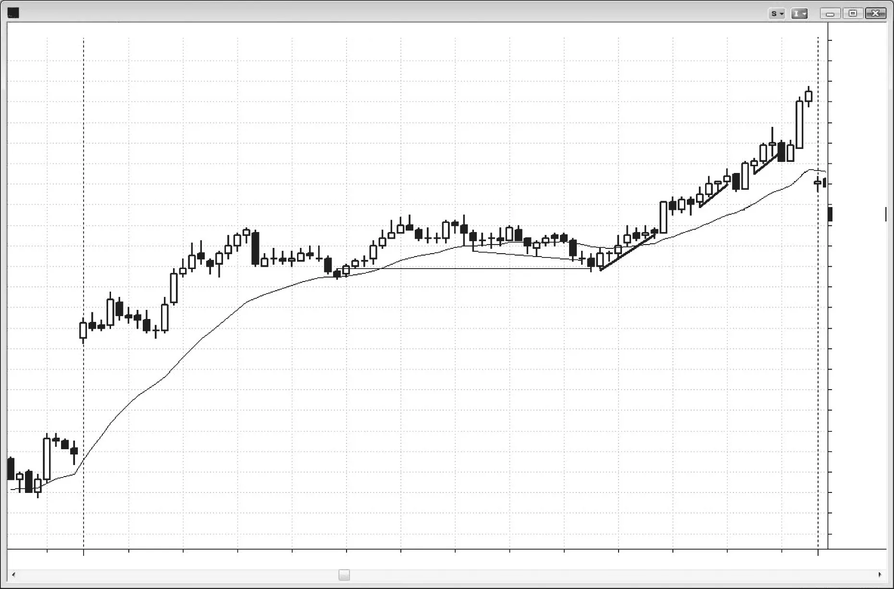
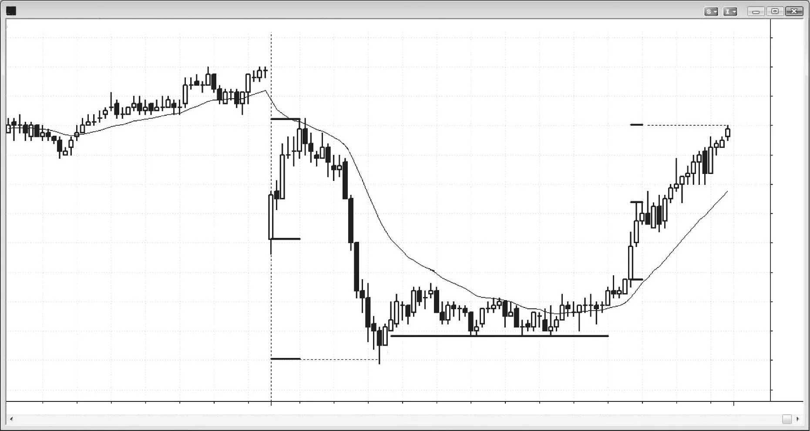
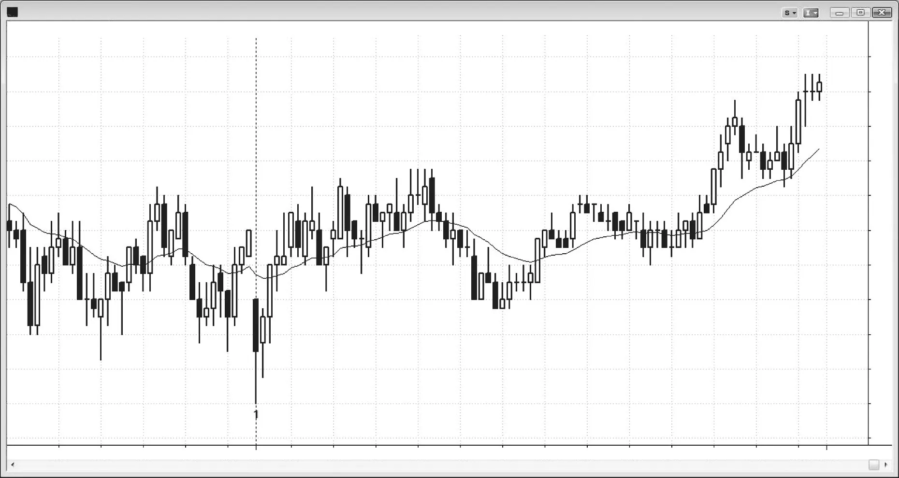
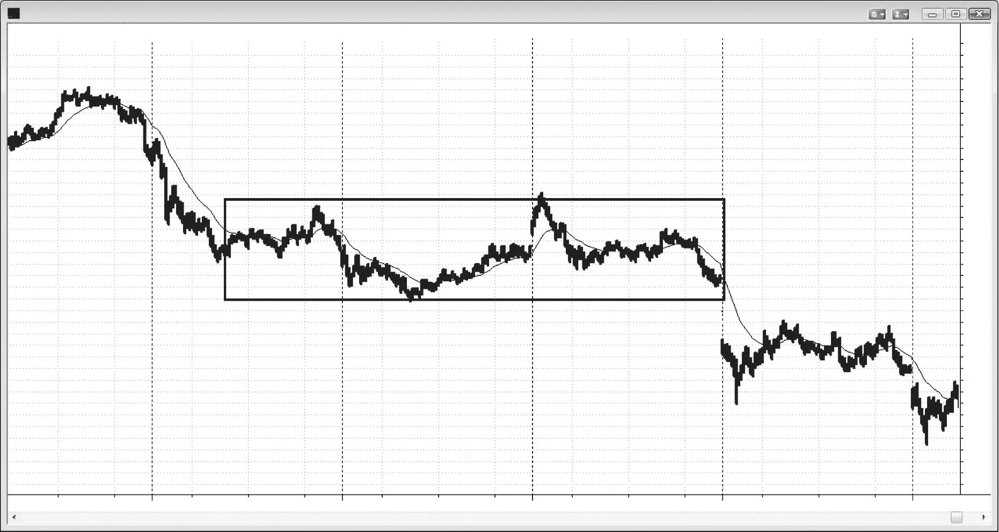

### CHAPTER 25 Trend Resumption Day

<!-- Source PDF pages 455–462 -->

<!-- PDF page 455 -->

C H A P T E R 2 5
Trend
Resumption Day
P
rimary characteristics of trend resumption days:
r The day has a strong trend in the first hour or so and then enters a trading
range.
r The trading range lasts for hours and often lulls traders into thinking that the
day will be quiet into the close.
r The trend resumes in the final hour or two.
r The second leg often is about the same size as the first leg.
r The protracted trading range is often a very tight trading range.
r There is often a breakout from the trading range late in the day that tries to
reverse the trend, but it is usually a trap. The market then reverses and breaks
out in the opposite direction into the close. A trap is more likely when the
trading range is unusually tight.
r There is often a breakout pullback entry for traders who did not enter earlier
or on the breakout.
Sometimes there will be a strong trend for the first hour or so and then the market goes sideways for several hours. Whenever this happens and especially if the
sideways action is in a very tight trading range, the day is likely becoming a trend
resumption day. Don’t give up on the boring midday trading range, because there
might be a strong trend in the final hour or so. The breakout is usually in the direction of the earlier trend, but sometimes it can be in the opposite direction and
turn the day into a reversal day. For example, if the trend from the open was a bear
trend, there is usually a late downside breakout from the trading range, and the day

<!-- PDF page 456 -->

COMMON TREND PATTERNS
often opens near its high and closes near its low. There is frequently a brief one- or
two-bar strong reversal breakout that fails between 11 a.m. and noon PST, trapping
traders into the wrong (long) direction, and it is usually followed by a breakout in
the other direction. This happens quickly, but if you are expecting it, you have a
chance of catching a big bear move into the close. Less often, the reversal breakout
succeeds and the trend in the final hour, if there is one, can retrace all or part of the
opening bear trend.
The midday sideways action does not have to be a tight trading range, and it
often has tradable legs in both directions. Sometimes there are three countertrend
lazy pushes, creating a wedge flag. At other times the third leg fails to surpass the
second, and this forms a head and shoulders flag (most head and shoulders reversal patterns fail and become continuation patterns). Because the pattern often has
three pushes instead of two, it traps traders out of their positions from the open,
thinking that this countertrend action might in fact be a new, opposite trend. However, don’t let yourself get trapped out, and be ready to enter when you see a good
setup that will get you into the market in the same direction as the morning trend.
Traders are scaling into positions in both directions and, at some point, many reach
their maximum size. Once there is a breakout, the losing side cannot scale in anymore, and their only choices are hope and getting stopped out. For example, if there
is a strong morning bear trend and then the market goes sideways, both the bulls
and the bears will continue to add to their positions during the trading range over
the next several hours, and many will reach the maximum size that they are willing
to hold. Once the market begins to break to the downside, the bulls can no longer
continue to buy. With a lot of bulls no longer able to buy, the bears are unopposed.
As the market falls, it will often accelerate as more and more bulls give up and sell
out of their losing longs, adding to the collapse into the close. The difficult part of
this type of day is that the quiet midday sideways movement often leads traders to
give up on the day when in fact they should view this as an opportunity. Just be
ready to enter. The best forms of this pattern occur only a couple of times a month.
Instead of a midday trading range, the market will sometimes form a weakly
trending countertrend move for a couple of hours, leaving traders wondering if the
day is a reversal day instead of a trend resumption day. What might be developing
is a weak trend resumption day, one that feels more like a trading range day but
ends up opening on one extreme and closing on the other. Watch for the trend
of the open to resume in the final hour, and be prepared to enter. For example,
if there was a strong sell-off on the open, and then a lower-momentum rally with
three pushes up that retraces some or even all of the initial sell-off, be prepared
for a break below that bull channel and a resumption of the bear trend into the
close. If there is a breakout of the top of the bull channel that reverses back down,
this can be a good swing short entry for the trend into the close. Instead, there
might be a setup that looks like a good low-risk short on the breakout below the

<!-- PDF page 457 -->

TREND RESUMPTION DAY
channel. Otherwise, you can wait for the bear trend to resume and then look to
enter on a breakout pullback or a pullback near the moving average. Even though
the 5 minute chart might look like a trading range, maybe like an ABC on a higher
time frame chart, if the market closes near the low, the day will create a bear trend
bar on the daily chart.
Trend resumption patterns often take place over two or more days. Although
the 5 minute chart might look like it has huge swings during those days, they may
create a simple ABC on the 60 minute chart. For example, if yesterday had a strong
bull spike for a couple of hours and then entered a trading range and that trading
range continued for a couple of hours today, yesterday’s trend might resume at any
point. If you are aware of this, you will be more likely to be willing to swing a larger
part of your position for what could be a big move.

<!-- PDF page 458 -->

COMMON TREND PATTERNS
Figure 25.1

FIGURE 25.1
Gap Test after a Gap Up
On big gap days, the market often tests the open before the trend begins. In Figure 25.1, the market opened with a large gap up and then had a double bottom test
of the low followed by a big rally up to bar 3. From there, it traded in a tight range
for more than three hours, lulling traders into thinking that the good trading was
done. Bar 6 reversed up from a poke below a bear trend channel line and it also
dipped one tick below the bar 4 signal bar high. This trapped some bears into a
short and many bulls out of their longs. The signal bar for the rally into the close
was the first moving average gap bar of the day.
There were several other chances to get long, like the reversal up from the
failed breakouts below micro trend lines at bars 7, 9, and 10.
Deeper Discussion of This Chart
In Figure 25.1, bar 7 was a high 2 entry and a reversal up from a one-tick break of a
small bull trend line. Bar 1 was the high 1 entry.
Bar 8 was a high 2 variant (bear-bull-bear bars: the bar after bar 7 had a bear body
and therefore the first push down, the next bar had a bull body and therefore traded up,
and then the following bar had a bear body again, for a second push down).

<!-- PDF page 459 -->

Figure 25.2

TREND RESUMPTION DAY
FIGURE 25.2
Tight Trading Range and Then a Reversal
Sometimes a tight trading range that follows a strong trend can lead to a reversal
instead of trend resumption. In Figure 25.2, today had a strong sell-off from bar 3
and then entered a tight trading range for a few hours. This often leads to a bear
trend resumption into the close with the final sell-off often being as large as the
initial one. There is frequently a failed breakout of the top of the range before the
final bear leg begins. Bar 12 was a perfect setup for a swing short because it was a
bear reversal bar that broke out of the top of the tight trading range late in the day.
However, instead of the next bar being an entry bar for a large bear move, it was
a small bull inside bar, and therefore a breakout pullback long setup. Bar 12 broke
out and this inside bar was a pause, which is a type of pullback.
Deeper Discussion of This Chart
In Figure 25.2, the day opened with a large gap down and a strong bull reversal bar,
setting up a failed breakout long and a possible trend from the open bull day.
Bars 13 and 14 were large bull trend bars that formed a two-bar breakout. Any
breakout often is followed by a measured move based on the spike. It is usually based
on the height from the open or low of the first bar of the spike to the close or high of
the final bar. The closing high of the day was at a measured move from the open of bar
13 to the high of bar 14.

<!-- PDF page 460 -->

COMMON TREND PATTERNS
Figure 25.2
Most trend resumption bear days do not have a large rally on the open, and that
large rally is an indication that the bulls were willing to buy aggressively today. Even
though the middle of the day was setting up perfectly for a big sell-offinto the close,
you can never be certain and there is always about a 40 percent chance that the exact
opposite can happen. Another clue that the market might rally to test the open of the
day was that the low of the day was almost a perfect measured move down from the
open of the day to the top of the initial rally. That means that the open of the day was in
the middle of the day’s range. If the market could get back up there, the day could be
close to a doji day, which is fairly common. Notice how the market repeatedly tested the
support line at the bar 7 low to the tick and continued to find buyers. There were double
bottom pullback long setups at the inside bar after bar 8, the inside bar after bar 9, and
the higher lows at bars 9 and 11.
The support line was one tick below the initial bar 5 entry bar for the expected
pullback from the sell climax. Bar 5 was the entry bar above the two-bar reversal setup
at the low of the day. The market ran the stops below that entry bar by one tick, but,
despite many attempts, it could not go any further down. This is a sign of strong bulls
at work. Both buy and sell programs continued throughout the tight trading range, but
eventually the buy programs overwhelmed the sell programs. All of those shorts had
to be bought back, and this added to the buying pressure. Also, many sell programs
reversed to buy programs, adding to the buying. The bars 14 and 15 spike up was
followed by a channel into the close.

<!-- PDF page 461 -->

Figure 25.3

TREND RESUMPTION DAY
FIGURE 25.3
Trend Resumption
Even though the initial rally may only have a couple of strong trend bars and appear
to be leading to a trading range day, the trend resumption can still be strong. In
Figure 25.3, the market started as a trend from the open bull trend when it rallied
from an expanding triangle bottom and a failed breakout of yesterday’s low. It then
ran for two bars, but it stalled in the middle of yesterday’s trading range. A rally
from any three-push pattern usually results in at least two legs up, which ultimately
developed here. Bar 2 was a breakout pullback that led to another small rally, but
then the market lost momentum. It continued to weakly trend above the moving
average until bar 3. At this point, it was clear that something was not right. A trend
from the open bull trend is one of the strongest forms of trends but this was clearly
not trending strongly. That meant that traders would soon decide that the day was
not what they thought and they would exit and wait. They would then be looking
for a trading range day and a possible new low for the day. It was possible for the
bar 2 low to be followed by a double bottom bull flag, but, in the absence of strong
early bulls, bears would aggressively push for a new low of the day and the bar 2
low would likely fail. Bar 4 was a second small push below bar 2 and it was followed
by a trend into the close, creating a trend resumption bull day, albeit a weak one,
and giving the expected second leg up from the expanding triangle bottom. Bar 4
was an exact breakout test of the trend from the open signal bar high.

<!-- PDF page 462 -->

COMMON TREND PATTERNS
Figure 25.4

FIGURE 25.4
Trend Resumption after Several Days
Trend resumption can take place over the course of several days. In Figure 25.4,
the market had a strong move down to bar 2 and then entered a trading range that
lasted two and a half days. Trading ranges can last a long time, but usually break
out in the direction of the trend. The bear trend resumed and had a second leg down
from bar 5 to bar 14, five days after the first move down.
The bear leg down from bar 5 to bar 6 was followed by a trading range, and the
second leg down ended on the open of the next day at bar 9.
The sell-off from bar 7 to bar 9 was followed by a trading range to bar 13, and
the bear trend resumption occurred with the move down to bar 14. This was a
three-day trend resumption pattern.
