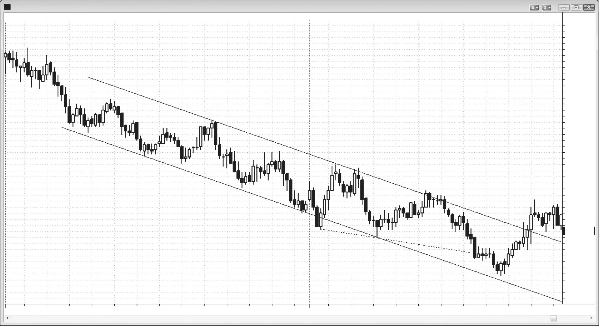
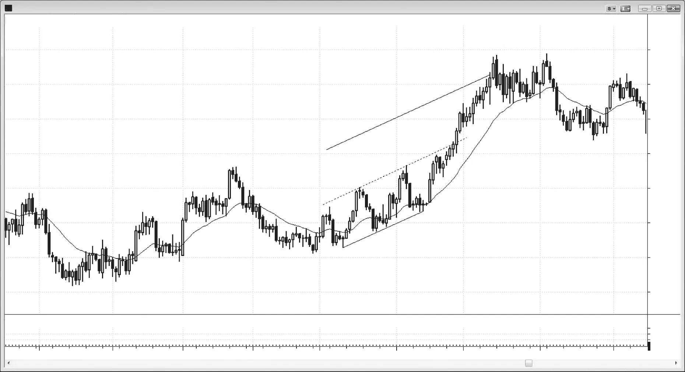
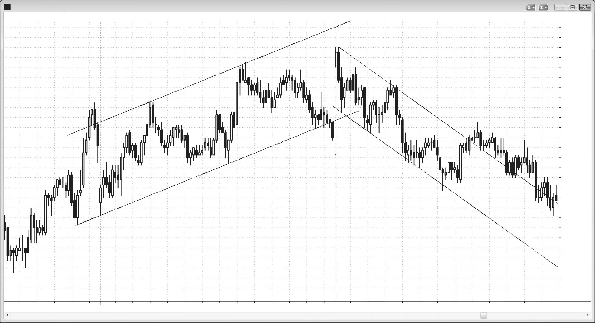

### CHAPTER 26 Stairs: Broad Channel Trend

<!-- Source PDF pages 463–468 -->

<!-- PDF page 463 -->

C H A P T E R 2 6
Stairs: Broad
Channel Trend
P
rimary characteristics of stairs days:
r A stairs day is a variant of a trending trading range day where there are at least
three trading ranges.
r The day has broad swings, but trending highs and lows.
r Because the swings are large, traders can usually place trades in both directions, but they should try to swing part or all of their with-trend trades.
r Almost every breakout is followed by a pullback (a breakout test) beyond the
breakout point, so that there is some overlap between consecutive swings. For
example, in a broad bear channel, every breakout to a new low is followed
by a rally that goes back above the breakout point but stays below the most
recent swing high. However, there is sometimes a swing or two that will extend
above the prior swing high by a little. This will make some traders wonder if
the market is reversing, but the trend will usually soon resume.
r If each breakout gets a little smaller than the prior one, then this is a shrinking stairs pattern and a sign of waning momentum, which can lead to a larger
correction.
When a market has a series of three or more trending swings that resemble
a mildly sloping trading range or channel, both the bulls and the bears are active
but one side is exerting somewhat more control. Each pullback retraces beyond its
breakout point, creating overlap between each breakout spike and the following
pullback. Two-way trading is taking place within the broad channel, so traders can
look for entries in both directions. If the breakouts get smaller and smaller, then

<!-- PDF page 464 -->

COMMON TREND PATTERNS
this is a shrinking stairs pattern and indicates waning momentum. It often leads
to a two-legged reversal and a trend line break. Many three-push reversals qualify
as stairs or shrinking stairs trends that failed and reversed. Stairs are often just
pullbacks or flags in higher time frame trends, and it is common to see stairs over
the final hour or two of the day and then a breakout of the flag on the open of the
next day. For example, a broad bull channel today might just be a large bear flag,
and the bear trend could break out tomorrow.
Alternatively, one stair might suddenly accelerate and break out of the trend
channel in the with-trend direction. If it then reverses, this overshoot and reversal
will likely result in at least a two-legged move. If it does not, the breakout will
probably continue for at least two more legs or at least the approximate height
of the channel in an imprecise measured move (the distance beyond the channel
should be about the same as the distance within the channel).
Traders pay attention to how many ticks breakouts run past the most recent
swing point, and then use that number to fade subsequent breakouts, expecting a
breakout test. For example, if the last swing low fell 14 ticks below the swing low
before it, traders will look to scale into longs beginning around 10 ticks below the
most recent swing low, which will usually be around the trend channel line. If the
pullback from the most recent breakout was about 15 ticks, they will look to take
profits around 10 to 15 ticks up from the low, which will usually be around the trend
line (the top of the bear channel).

<!-- PDF page 465 -->

Figure 26.1

STAIRS: BROAD CHANNEL TREND
FIGURE 26.1
Bear Stairs
A bear stairs pattern is a downwardly sloping channel where each breakout to a
new low is followed by a pullback that goes back above the breakout point. For
example, in Figure 26.1 the breakout leg below bar 6 down to bar 9 was followed
by a pullback that went back above the bar 7 low, and the rally after the leg that
broke below bar 9 down to bar 13 was followed by a pullback that went above the
bar 9 breakout point, overlapping the prior range.
Some traders buy near the trend channel line and short near the trend line.
Other traders pay attention to how far a breakout goes before there is a pullback. For example, the low of bar 5 was about four points below the low of bar 3.
Aggressive bulls placed limit orders to buy at about three to four points below the
low of bar 5. They were not filled on the sell-off to bar 7. However, as the market
fell below bar 7, they again placed limit orders to buy three to four points lower,
and were filled on the move down to bar 9, which had a low that was four points
below the low of bar 7. Since prior rallies were about four points, they took profits at around three points above their entries. They did the same on the sell-offs
to bars 11 and 16. They tried on the sell-off to bar 13, but the market did not fall
far enough for their orders to get filled. Bears did the opposite. They saw that past
rallies were about four to six points, so they scaled into shorts around three to five
points above the most recent swing low, which was in the area of the bear trend

<!-- PDF page 466 -->

COMMON TREND PATTERNS
Figure 26.1
line. This style of trading is only for experienced traders. Beginners should restrict
themselves to stop entries, so that the market is already going their way (this is
discussed in the second book).
Bar 7 was the third push down and a shrinking stair (it extended less below
bar 5 than bar 5 extended below bar 3). The channel lines are drawn as best fit lines
to highlight that the market is trending down and in a channel. There is clearly twosided trading and traders should be buying the lows and selling the highs when they
see appropriate setups.
Deeper Discussion of This Chart
The market opened near the bottom of the bear channel that started yesterday in Figure 26.1 and broke out below the channel. The breakout failed with a two-bar reversal
that led to a four-bar bull spike. After a double top that tested the bear trend line (drawn
as a parallel of the best fit trend channel line), the market had a spike down to bar 13.
With both bull and bear spikes, the two sides were fighting over the direction of the
expected channel. The bulls started a channel but it failed at the trend line and reversed
down in a bear channel. The market reversed up from a test of the trend channel line
where the bar 16 low could not reach the line. This is a sign of aggressive buying. The
bar 16 two-bar reversal was also a final flag long setup from the bar 15 four-bar final flag.
Three pushes down does not guarantee a trend reversal. The move down to bar 7 had
very little buying pressure. There were no large bull trend bars and no strong climactic
reversals. The move up from bar 7 was also not particularly strong. This was not how
strong reversals typically look, and because of that, it did not attract enough strong bulls
to reverse the market. Instead, the market formed a wedge bear flag (bar 6 and then the
two small pushes up from bar 7 were the three pushes) and a lower high (although the
rally was above bar 6 and therefore a sign of some strength, it was still below bar 4),
and the bear trend resumed.

<!-- PDF page 467 -->

Figure 26.2

STAIRS: BROAD CHANNEL TREND
FIGURE 26.2
Stairs Accelerating into a Strong Trend
A stairs pattern can accelerate into a stronger trend (see Figure 26.2). By bar 7, the
EUR/USD forex chart had three higher highs and lows in a channel and therefore
formed a stair type of bull trend.
Bar 8 was a bull trend bar that broke out of the top of the channel, and it was
followed by a bear reversal bar that never triggered a short. The breakout should
extend to about a measured move up to a parallel line that is about the same distance from the middle line as the middle line is from the bottom line (an Andrew’s
Pitchfork move), which it did. The acceleration upward is typical when a wedge top
fails. There were three pushes up that ended at bar 6, but you could also view the
small swing high just before bar 8 as the third push up if you restarted your count
with the strong bull spike up to bar 4. The failed wedge was followed by about a
measured move up equal to about the height of the wedge (the bar 6 high to the
bar 3 or maybe bar 1 low).

<!-- PDF page 468 -->

COMMON TREND PATTERNS
Figure 26.3

FIGURE 26.3
Shrinking Stairs
When each breakout is smaller than the previous one, the trend’s momentum is
waning and a deeper pullback or a reversal might soon follow. Figure 26.3 shows
a bull trend stairs pattern with three or more trending higher highs and lows contained in a roughly drawn channel. Bars 4, 6, and 8 formed shrinking stairs, representing loss of bullish momentum and presaging the reversal. The channel functioned like a large bear flag and the bear breakout occurred at bar 9.
After the bar 9 breakout, there was a lower high breakout pullback to bar 10
that resulted in a stairs bear trend. Bar 10 was a rough double top bear flag with the
high of the first pullback in the move down to bar 9.
Bar 11 overshot the bear channel to the downside and led to a small two-legged
reversal up and the expected penetration of the top of the channel.
Once the market begins to form stairs down, you can usually fade the close of
every strong trend bar breakout for a scalp. Buy every bear trend bar that closes
below a prior bear stair for a scalp. Likewise, in bull stairs, you can scalp a short on
the close of any trend bar that exceeds the high of the prior stair. In general, though,
it is safer to enter on a stop as the market reverses (for example, if the market
reverses up from the bottom of the channel, enter on a stop above the prior bar).
